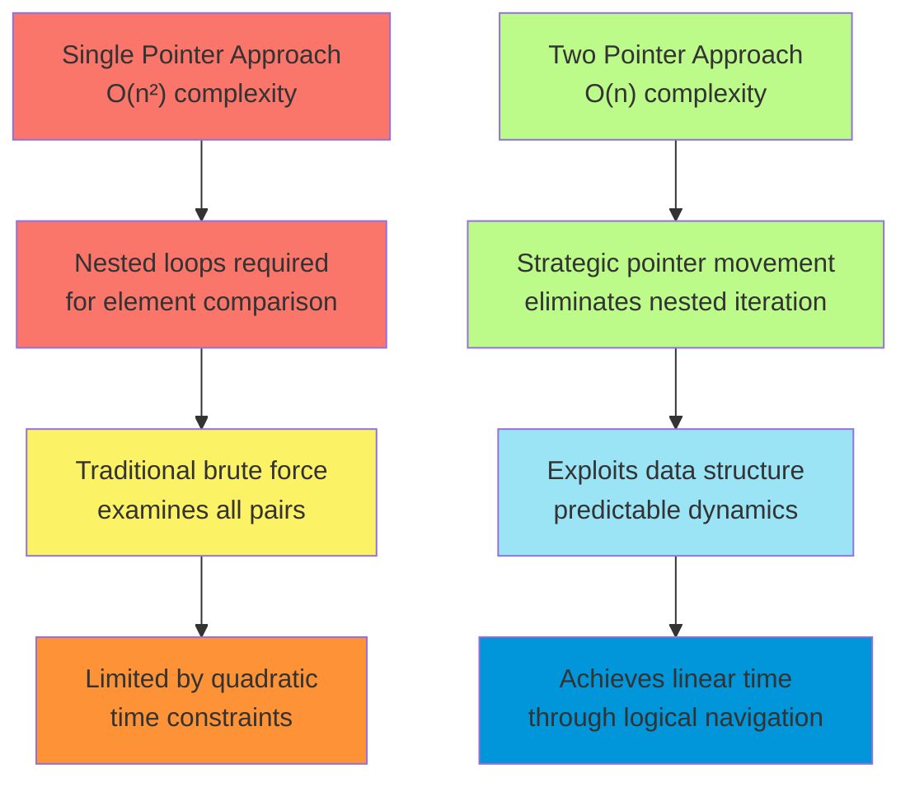
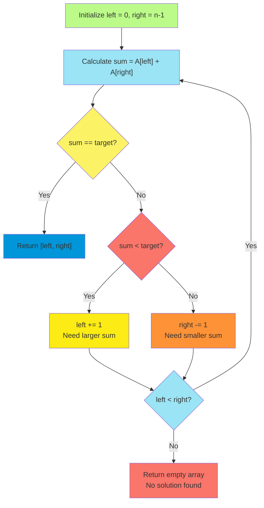
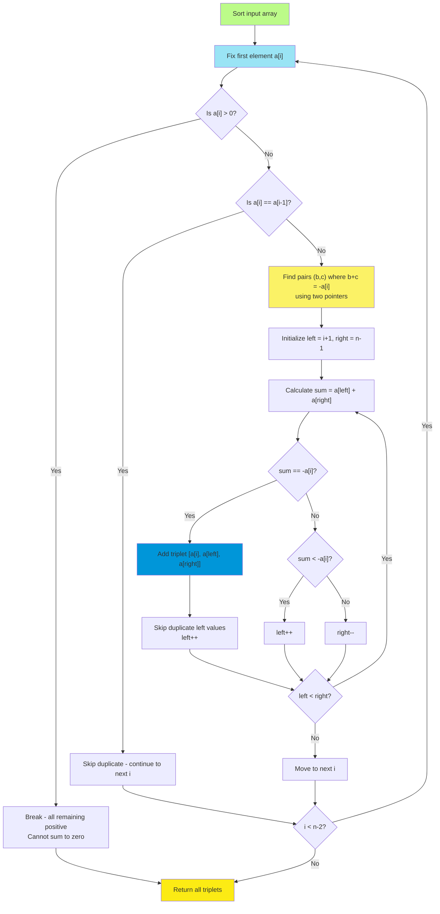
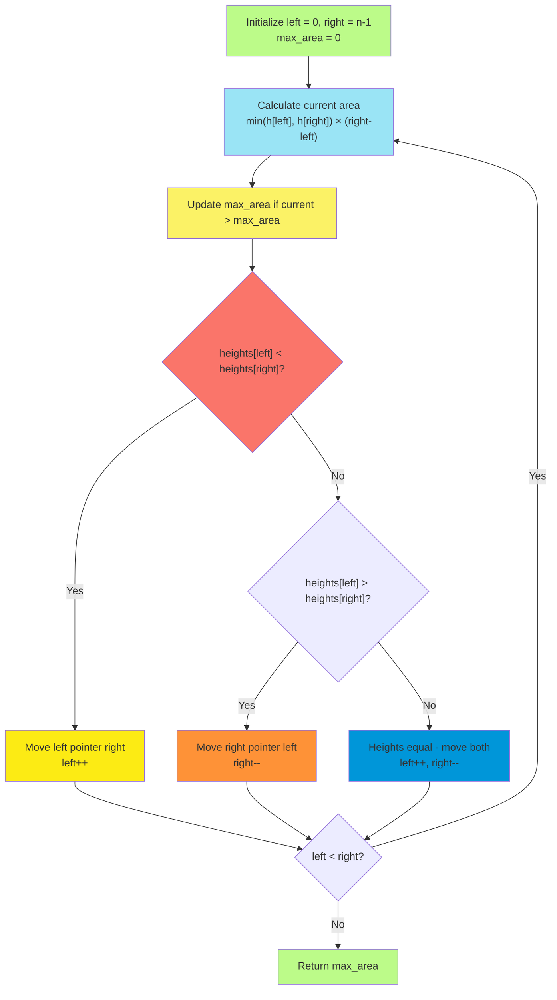
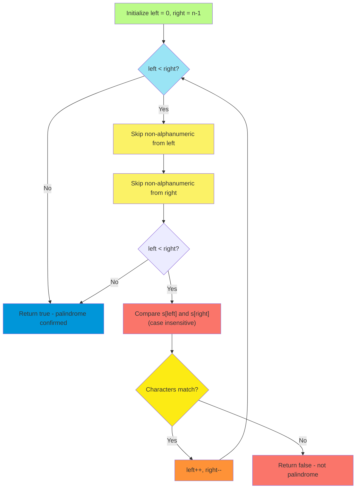

# C-1: Two Pointers Algorithm Patterns

1. Theoretical Foundations of Two-Pointer Algorithms
   - Pointer-Based Data Structure Navigation
   - Predictable Dynamics in Linear Structures
   - Complexity Reduction Principles
   - Algorithmic Strategy Classification

2. Inward Traversal Pattern
   - Pair Sum in Sorted Arrays
   - Triplet Sum with Zero Target
   - Container Water Maximization
   - Palindrome Validation

3. Unidirectional Traversal Pattern
   - Sliding Window Foundations
   - Array Manipulation Techniques

4. Staged Traversal Pattern
   - Sequential Pointer Deployment
   - Conditional Traversal Logic


## Theoretical Foundations of Two-Pointer Algorithms

### Understanding Pointer-Based Navigation

The two-pointer technique represents a fundamental paradigm shift in how we approach linear data structure traversal. At its core, a pointer serves as an abstraction—a variable that encapsulates positional information within a data structure, typically representing an index in an array or a reference to a node in a linked list.

The mathematical foundation of single-pointer algorithms can be expressed as a function $f: \mathbb{N} \rightarrow D$, where $\mathbb{N}$ represents the natural numbers (indices) and $D$ represents our data domain. Traditional single-pointer approaches often require nested iteration to establish relationships between elements, leading to quadratic time complexity $O(n^2)$.

The introduction of a second pointer fundamentally transforms our computational model. We now have two functions $f_1: \mathbb{N} \rightarrow D$ and $f_2: \mathbb{N} \rightarrow D$, where we can establish comparative relationships $R(f_1(i), f_2(j))$ for positions $i$ and $j$. This dual-pointer approach enables us to reduce many problems from $O(n^2)$ to $O(n)$ complexity through strategic pointer movement.



### Predictable Dynamics in Linear Structures

The efficacy of two-pointer algorithms relies heavily on the concept of predictable dynamics within data structures. A data structure exhibits predictable dynamics when the movement of a pointer in a specific direction guarantees certain properties about the values encountered.

Consider a sorted array $A = [a_1, a_2, \ldots, a_n]$ where $a_i \leq a_{i+1}$ for all $i \in [1, n-1]$. The predictable dynamic here is monotonicity: advancing a pointer rightward guarantees encountering values greater than or equal to the current value. Mathematically, if pointer $p$ moves from position $i$ to position $j$ where $j > i$, then $A[j] \geq A[i]$.

This predictability enables intelligent decision-making during traversal. When we need to increase a sum, we can confidently move the left pointer rightward in a sorted array. Conversely, to decrease a sum, we move the right pointer leftward. This deterministic behavior eliminates the need for exhaustive search patterns.

### Algorithmic Strategy Classification

Two-pointer algorithms can be systematically classified into three primary patterns, each exploiting different types of predictable dynamics:

#### Inward Traversal Pattern

This pattern initializes pointers at opposite extremes of the data structure and moves them toward each other. The mathematical representation involves pointers $left$ and $right$ where initially $left = 0$ and $right = n-1$, with the invariant $left \leq right$ maintained throughout execution.

The convergence condition $left \geq right$ serves as the termination criterion. This pattern is particularly effective for problems requiring comparison of elements from different ends of the structure, such as palindrome validation or finding pairs with specific sum properties.

#### Unidirectional Traversal Pattern

Both pointers begin at the same end (typically the beginning) and advance in the same direction, but they serve complementary purposes. Mathematically, we have pointers $p_1$ and $p_2$ where both start at position 0, but they advance according to different logical conditions.

One pointer typically serves as an explorer, advancing to discover information, while the other acts as a tracker, maintaining or recording discovered information. This pattern is foundational for sliding window techniques and array manipulation problems.

#### Staged Traversal Pattern

This pattern employs sequential pointer deployment. The first pointer traverses until it satisfies a specific condition, then the second pointer is activated to gather additional information relative to the first pointer's position.

The mathematical model involves conditional activation: pointer $p_2$ begins operation only when pointer $p_1$ satisfies predicate $P(p_1)$. This creates a hierarchical search structure where the second pointer's behavior depends on the first pointer's discoveries.

## Inward Traversal Pattern

### Pair Sum in Sorted Arrays

The pair sum problem in sorted arrays represents the quintessential application of inward traversal. Given a sorted array and a target sum, we seek to find indices of two elements that sum to the target value.

#### Theoretical Foundation

Let $A = [a_1, a_2, \ldots, a_n]$ be a sorted array where $a_i \leq a_{i+1}$, and let $target$ be our desired sum. We seek indices $i, j$ such that $a_i + a_j = target$ where $i \neq j$.

The brute force approach examines all $\binom{n}{2} = \frac{n(n-1)}{2}$ pairs, yielding $O(n^2)$ time complexity. However, the sorted property enables a more efficient approach through strategic pointer movement.

**Theorem**: In a sorted array, if the sum of elements at positions $left$ and $right$ is less than the target, then all pairs $(left, k)$ where $k < right$ will also have sums less than the target.

**Proof**: Since the array is sorted, $A[k] \leq A[right]$ for all $k < right$. Therefore, $A[left] + A[k] \leq A[left] + A[right] < target$.

This theorem justifies incrementing the left pointer when the current sum is too small, as all pairs with the current left value and smaller right values are guaranteed to be insufficient.

#### Algorithm Implementation



**Python Implementation:**

```python
def pair_sum_sorted(nums: List[int], target: int) -> List[int]:
    """
    Find indices of two numbers in sorted array that sum to target.
    
    Args:
        nums: Sorted array of integers
        target: Target sum value
    
    Returns:
        List containing indices of the pair, or empty list if not found
    
    Time Complexity: O(n)
    Space Complexity: O(1)
    """
    left, right = 0, len(nums) - 1
    
    while left < right:
        current_sum = nums[left] + nums[right]
        
        if current_sum == target:
            return [left, right]
        elif current_sum < target:
            # Need larger sum, move left pointer right
            left += 1
        else:
            # Need smaller sum, move right pointer left
            right -= 1
    
    return []  # No solution found
```

**Java Implementation:**

```java
import java.util.Arrays;

public class PairSum {
    /**
     * Find indices of two numbers in sorted array that sum to target.
     * 
     * @param nums Sorted array of integers
     * @param target Target sum value
     * @return Array containing indices of the pair, or empty array if not found
     * 
     * Time Complexity: O(n)
     * Space Complexity: O(1)
     */
    public static int[] pairSumSorted(int[] nums, int target) {
        int left = 0;
        int right = nums.length - 1;
        
        while (left < right) {
            int currentSum = nums[left] + nums[right];
            
            if (currentSum == target) {
                return new int[]{left, right};
            } else if (currentSum < target) {
                // Need larger sum, move left pointer right
                left++;
            } else {
                // Need smaller sum, move right pointer left
                right--;
            }
        }
        
        return new int[0];  // No solution found
    }
}
```

**C++ Implementation:**

```cpp
#include <vector>
#include <algorithm>

class PairSum {
public:
    /**
     * Find indices of two numbers in sorted array that sum to target.
     * 
     * @param nums Sorted vector of integers
     * @param target Target sum value
     * @return Vector containing indices of the pair, or empty vector if not found
     * 
     * Time Complexity: O(n)
     * Space Complexity: O(1)
     */
    static std::vector<int> pairSumSorted(const std::vector<int>& nums, int target) {
        int left = 0;
        int right = static_cast<int>(nums.size()) - 1;
        
        while (left < right) {
            int currentSum = nums[left] + nums[right];
            
            if (currentSum == target) {
                return {left, right};
            } else if (currentSum < target) {
                // Need larger sum, move left pointer right
                ++left;
            } else {
                // Need smaller sum, move right pointer left
                --right;
            }
        }
        
        return {};  // No solution found
    }
};
```

#### Complexity Analysis

**Time Complexity**: $O(n)$ where $n$ is the length of the array. Each element is visited at most once by either pointer, and the total number of pointer movements is bounded by $2n$.

**Space Complexity**: $O(1)$ as we only use a constant amount of additional space for the pointer variables and sum calculation.

**Proof of Correctness**: The algorithm maintains the invariant that if a solution exists, it must lie within the current window $[left, right]$. The pointer movement rules ensure we never eliminate valid solutions while systematically reducing the search space.

### Triplet Sum with Zero Target

The triplet sum problem extends the pair sum concept to three elements, seeking all unique triplets that sum to zero. This problem introduces additional complexity through the requirement to find all solutions while avoiding duplicates.

#### Theoretical Framework

Given an array $A$ of $n$ integers, we seek all unique triplets $(a_i, a_j, a_k)$ such that $a_i + a_j + a_k = 0$ where $i \neq j \neq k$.

The key insight is that we can fix one element and reduce the problem to finding pairs that sum to the negative of that element. If we fix element $a_i$, we need to find pairs $(a_j, a_k)$ such that $a_j + a_k = -a_i$.

**Theorem**: For any triplet $(a, b, c)$ where $a + b + c = 0$, if we sort the array and fix the smallest element $a$, then finding $(b, c)$ such that $b + c = -a$ can be solved in $O(n)$ time using two pointers.

This reduction transforms the problem from $O(n^3)$ brute force to $O(n^2)$ optimal solution.

#### Duplicate Handling Strategy

Managing duplicates requires careful consideration at two levels:

1. **Fixed Element Duplicates**: When iterating through potential first elements, we skip consecutive identical values to avoid generating duplicate triplets with the same first element.
2. **Pair Element Duplicates**: Within the two-pointer search for each fixed element, we skip consecutive identical values for the left pointer to avoid duplicate pairs.

The mathematical justification relies on the sorted property: identical elements are adjacent, so skipping consecutive duplicates ensures each unique value is considered exactly once in each position.



#### Algorithm Implementation

**Python Implementation:**

```python
def triplet_sum(nums: List[int]) -> List[List[int]]:
    """
    Find all unique triplets that sum to zero.
    
    Args:
        nums: Array of integers
    
    Returns:
        List of triplets that sum to zero
    
    Time Complexity: O(n²)
    Space Complexity: O(1) excluding output space
    """
    if len(nums) < 3:
        return []
    
    nums.sort()  # Essential for duplicate handling and two-pointer approach
    triplets = []
    
    for i in range(len(nums) - 2):
        # Optimization: if current number is positive, 
        # all remaining numbers are positive (array is sorted)
        if nums[i] > 0:
            break
            
        # Skip duplicate values for the first element
        if i > 0 and nums[i] == nums[i - 1]:
            continue
            
        # Find pairs that sum to -nums[i]
        target = -nums[i]
        left, right = i + 1, len(nums) - 1
        
        while left < right:
            current_sum = nums[left] + nums[right]
            
            if current_sum == target:
                triplets.append([nums[i], nums[left], nums[right]])
                
                # Skip duplicate values for left pointer
                while left < right and nums[left] == nums[left + 1]:
                    left += 1
                left += 1
                right -= 1
                
            elif current_sum < target:
                left += 1
            else:
                right -= 1
    
    return triplets
```

**Java Implementation:**

```java
import java.util.*;

public class TripletSum {
    /**
     * Find all unique triplets that sum to zero.
     * 
     * @param nums Array of integers
     * @return List of triplets that sum to zero
     * 
     * Time Complexity: O(n²)
     * Space Complexity: O(1) excluding output space
     */
    public static List<List<Integer>> tripletSum(int[] nums) {
        List<List<Integer>> triplets = new ArrayList<>();
        
        if (nums.length < 3) {
            return triplets;
        }
        
        Arrays.sort(nums);  // Essential for duplicate handling
        
        for (int i = 0; i < nums.length - 2; i++) {
            // Optimization: if current number is positive, break
            if (nums[i] > 0) {
                break;
            }
            
            // Skip duplicate values for the first element
            if (i > 0 && nums[i] == nums[i - 1]) {
                continue;
            }
            
            // Find pairs that sum to -nums[i]
            int target = -nums[i];
            int left = i + 1;
            int right = nums.length - 1;
            
            while (left < right) {
                int currentSum = nums[left] + nums[right];
                
                if (currentSum == target) {
                    triplets.add(Arrays.asList(nums[i], nums[left], nums[right]));
                    
                    // Skip duplicate values for left pointer
                    while (left < right && nums[left] == nums[left + 1]) {
                        left++;
                    }
                    left++;
                    right--;
                    
                } else if (currentSum < target) {
                    left++;
                } else {
                    right--;
                }
            }
        }
        
        return triplets;
    }
}
```

**C++ Implementation:**

```cpp
#include <vector>
#include <algorithm>

class TripletSum {
public:
    /**
     * Find all unique triplets that sum to zero.
     * 
     * @param nums Vector of integers
     * @return Vector of triplets that sum to zero
     * 
     * Time Complexity: O(n²)
     * Space Complexity: O(1) excluding output space
     */
    static std::vector<std::vector<int>> tripletSum(std::vector<int>& nums) {
        std::vector<std::vector<int>> triplets;
        
        if (nums.size() < 3) {
            return triplets;
        }
        
        std::sort(nums.begin(), nums.end());  // Essential for duplicate handling
        
        for (int i = 0; i < static_cast<int>(nums.size()) - 2; ++i) {
            // Optimization: if current number is positive, break
            if (nums[i] > 0) {
                break;
            }
            
            // Skip duplicate values for the first element
            if (i > 0 && nums[i] == nums[i - 1]) {
                continue;
            }
            
            // Find pairs that sum to -nums[i]
            int target = -nums[i];
            int left = i + 1;
            int right = static_cast<int>(nums.size()) - 1;
            
            while (left < right) {
                int currentSum = nums[left] + nums[right];
                
                if (currentSum == target) {
                    triplets.push_back({nums[i], nums[left], nums[right]});
                    
                    // Skip duplicate values for left pointer
                    while (left < right && nums[left] == nums[left + 1]) {
                        ++left;
                    }
                    ++left;
                    --right;
                    
                } else if (currentSum < target) {
                    ++left;
                } else {
                    --right;
                }
            }
        }
        
        return triplets;
    }
};
```

#### Complexity Analysis

**Time Complexity**: $O(n^2)$ where $n$ is the length of the array. The sorting step takes $O(n \log n)$, and the main algorithm iterates through $n$ elements, with each iteration potentially taking $O(n)$ time for the two-pointer search. Since $O(n^2)$ dominates $O(n \log n)$, the overall complexity is $O(n^2)$.

**Space Complexity**: $O(1)$ auxiliary space, not counting the output array. The sorting is done in-place, and we only use constant extra space for variables.

**Optimality**: This is optimal for the general case, as any algorithm must examine $\Omega(n^2)$ pairs in the worst case to ensure all triplets are found.

### Container Water Maximization

The container problem asks us to find two lines that, together with the x-axis, form a container capable of holding the maximum amount of water. This problem elegantly demonstrates how two-pointer techniques can solve optimization problems.

#### Mathematical Formulation

Given an array $heights = [h_1, h_2, \ldots, h_n]$ representing the heights of vertical lines, we want to find indices $i$ and $j$ such that the area $A(i,j) = \min(h_i, h_j) \times |j - i|$ is maximized.

The area formula captures two essential components:

- **Width**: $|j - i|$ represents the horizontal distance between the lines
- **Height**: $\min(h_i, h_j)$ represents the maximum water level (limited by the shorter line)

The brute force approach examines all $\binom{n}{2}$ pairs, requiring $O(n^2)$ time. However, we can optimize this using the two-pointer technique with a crucial insight about pointer movement strategy.

#### Strategic Pointer Movement Theory

**Theorem**: When two pointers are at positions $left$ and $right$ with $heights[left] < heights[right]$, moving the right pointer inward cannot yield a larger area than the current area with any container that includes the left line.

**Proof**: Consider the current area $A_{current} = heights[left] \times (right - left)$. If we move the right pointer to any position $k < right$ while keeping the left pointer fixed, the new area becomes $A_{new} = \min(heights[left], heights[k]) \times (k - left)$.

Since $k < right$, we have $(k - left) < (right - left)$. Additionally, $\min(heights[left], heights[k]) \leq heights[left]$ regardless of $heights[k]$.

Therefore: $A_{new} = \min(heights[left], heights[k]) \times (k - left) \leq heights[left] \times (k - left) < heights[left] \times (right - left) = A_{current}$

This theorem justifies our strategy: always move the pointer at the shorter line, as moving the pointer at the taller line cannot improve the solution.



#### Algorithm Implementation

**Python Implementation:**

```python
def max_area_container(heights: List[int]) -> int:
    """
    Find the maximum area of water that can be contained.
    
    Args:
        heights: List of heights representing vertical lines
    
    Returns:
        Maximum area of water that can be contained
    
    Time Complexity: O(n)
    Space Complexity: O(1)
    """
    if len(heights) < 2:
        return 0
    
    left, right = 0, len(heights) - 1
    max_area = 0
    
    while left < right:
        # Calculate current area
        width = right - left
        height = min(heights[left], heights[right])
        current_area = width * height
        
        # Update maximum area
        max_area = max(max_area, current_area)
        
        # Move pointer at shorter line
        if heights[left] < heights[right]:
            left += 1
        elif heights[left] > heights[right]:
            right -= 1
        else:
            # Heights are equal - move both pointers
            left += 1
            right -= 1
    
    return max_area
```

**Java Implementation:**

```java
public class MaxAreaContainer {
    /**
     * Find the maximum area of water that can be contained.
     * 
     * @param heights Array of heights representing vertical lines
     * @return Maximum area of water that can be contained
     * 
     * Time Complexity: O(n)
     * Space Complexity: O(1)
     */
    public static int maxAreaContainer(int[] heights) {
        if (heights.length < 2) {
            return 0;
        }
        
        int left = 0;
        int right = heights.length - 1;
        int maxArea = 0;
        
        while (left < right) {
            // Calculate current area
            int width = right - left;
            int height = Math.min(heights[left], heights[right]);
            int currentArea = width * height;
            
            // Update maximum area
            maxArea = Math.max(maxArea, currentArea);
            
            // Move pointer at shorter line
            if (heights[left] < heights[right]) {
                left++;
            } else if (heights[left] > heights[right]) {
                right--;
            } else {
                // Heights are equal - move both pointers
                left++;
                right--;
            }
        }
        
        return maxArea;
    }
}
```

**C++ Implementation:**

```cpp
#include <vector>
#include <algorithm>

class MaxAreaContainer {
public:
    /**
     * Find the maximum area of water that can be contained.
     * 
     * @param heights Vector of heights representing vertical lines
     * @return Maximum area of water that can be contained
     * 
     * Time Complexity: O(n)
     * Space Complexity: O(1)
     */
    static int maxAreaContainer(const std::vector<int>& heights) {
        if (heights.size() < 2) {
            return 0;
        }
        
        int left = 0;
        int right = static_cast<int>(heights.size()) - 1;
        int maxArea = 0;
        
        while (left < right) {
            // Calculate current area
            int width = right - left;
            int height = std::min(heights[left], heights[right]);
            int currentArea = width * height;
            
            // Update maximum area
            maxArea = std::max(maxArea, currentArea);
            
            // Move pointer at shorter line
            if (heights[left] < heights[right]) {
                ++left;
            } else if (heights[left] > heights[right]) {
                --right;
            } else {
                // Heights are equal - move both pointers
                ++left;
                --right;
            }
        }
        
        return maxArea;
    }
};
```

#### Complexity Analysis and Correctness Proof

**Time Complexity**: $O(n)$ where $n$ is the number of heights. Each element is visited at most once by either pointer.

**Space Complexity**: $O(1)$ as we only use constant additional space.

**Correctness Proof**: The algorithm maintains the invariant that the maximum area among all possible containers must either be the current area or lie within the remaining search space bounded by the current pointer positions. The pointer movement strategy ensures we never eliminate the optimal solution while systematically reducing the search space.

**Lemma**: If we have examined all containers that include the line at position $i$, then we can safely exclude position $i$ from further consideration.

This lemma justifies moving the pointer at the shorter line: we've implicitly examined all containers that pair the shorter line with any line between the current pointer positions.

### Palindrome Validation

Palindrome validation represents another elegant application of the inward traversal pattern, where we verify if a string reads the same forwards and backwards while handling non-alphanumeric characters appropriately.

#### Theoretical Foundation

A palindrome is formally defined as a string $s$ such that $s = s^R$ where $s^R$ denotes the reverse of $s$. For practical applications, we often need to consider only alphanumeric characters and ignore case differences.

Let $f: \Sigma^* \rightarrow \Sigma^*$ be a function that filters a string to contain only alphanumeric characters in lowercase. Then $s$ is a valid palindrome if $f(s) = f(s)^R$.

The two-pointer approach validates this property by comparing characters from both ends moving inward. If at any point corresponding characters don't match, the string is not a palindrome.

#### Character Processing Strategy

The algorithm must handle non-alphanumeric characters by skipping them during comparison. This requires careful pointer advancement:

1. Advance the left pointer until it points to an alphanumeric character
2. Advance the right pointer until it points to an alphanumeric character
3. Compare the characters (case-insensitive)
4. If they match, move both pointers inward; otherwise, return false



#### Algorithm Implementation

**Python Implementation:**

```python
def is_palindrome_valid(s: str) -> bool:
    """
    Determine if a string is a valid palindrome ignoring non-alphanumeric characters.
    
    Args:
        s: Input string
    
    Returns:
        True if the string is a valid palindrome, False otherwise
    
    Time Complexity: O(n)
    Space Complexity: O(1)
    """
    if not s:
        return True
    
    left, right = 0, len(s) - 1
    
    while left < right:
        # Skip non-alphanumeric characters from left
        while left < right and not s[left].isalnum():
            left += 1
        
        # Skip non-alphanumeric characters from right
        while left < right and not s[right].isalnum():
            right -= 1
        
        # Compare characters (case insensitive)
        if s[left].lower() != s[right].lower():
            return False
        
        left += 1
        right -= 1
    
    return True
```

**Java Implementation:**

```java
public class PalindromeValidator {
    /**
     * Determine if a string is a valid palindrome ignoring non-alphanumeric characters.
     * 
     * @param s Input string
     * @return True if the string is a valid palindrome, false otherwise
     * 
     * Time Complexity: O(n)
     * Space Complexity: O(1)
     */
    public static boolean isP
```