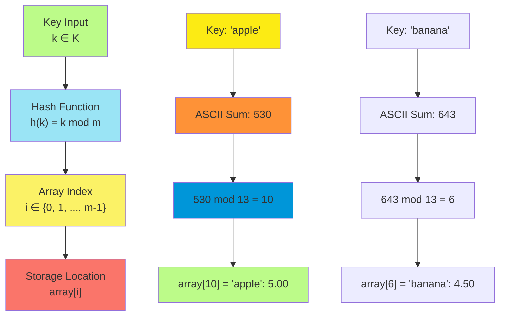
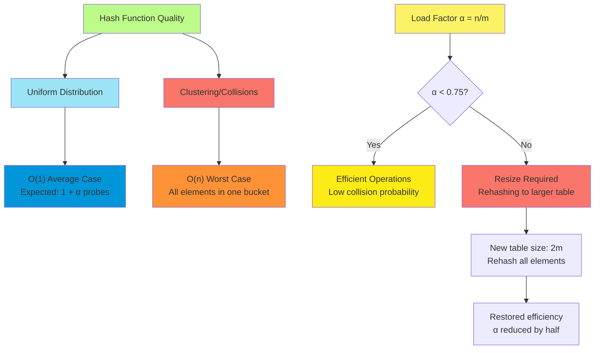
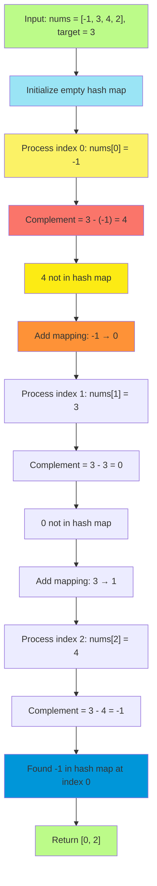
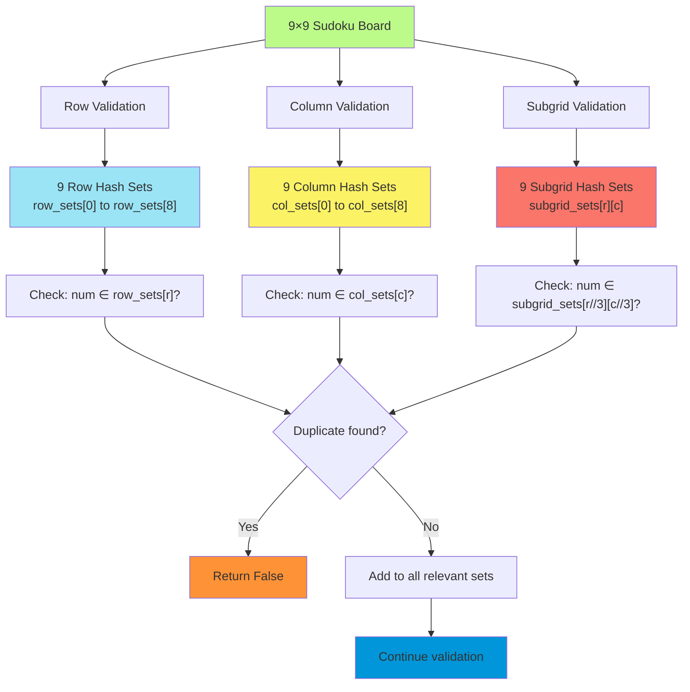
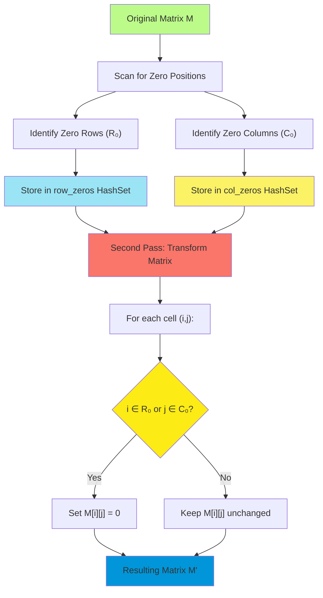
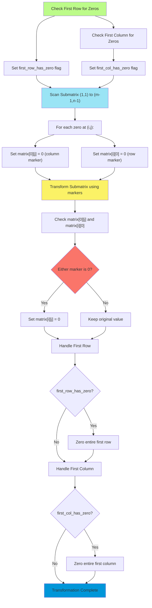

# C-2: Hash Maps and Sets - Efficient Lookup Data Structures

1. Theoretical Foundations of Hash-Based Data Structures
    - Hash Map Architecture and Properties
    - Hash Set Fundamentals and Applications
    - Time Complexity Analysis and Performance Characteristics
    - Collision Handling and Load Factor Considerations
2. Hash Map Applications in Algorithm Design
    - Pair Sum in Unsorted Arrays
    - Complement-Based Problem Solving Strategies
    - One-Pass vs Two-Pass Algorithm Design
    - Space-Time Tradeoff Analysis
3. Matrix Manipulation with Hash Sets
    - Sudoku Board Validation
    - Duplicate Detection Strategies
    - Row, Column, and Subgrid Indexing Techniques
    - Multi-Dimensional Hash Set Applications
4. Advanced Matrix Operations and Space Optimization
    - Zero Striping Problem
    - In-Place vs Auxiliary Space Solutions
    - Matrix Marking Strategies
    - First Row and Column as Markers Technique

#### Theoretical Foundations of Hash-Based Data Structures

##### Hash Map Architecture and Properties

Understanding hash maps requires us to appreciate the fundamental problem they solve: how can we achieve constant-time
data retrieval in a world where most data structures require linear or logarithmic search times? The elegance of hash
maps lies in their ability to transform the search problem into a direct addressing problem through the mathematical
concept of hashing.

At its conceptual core, a hash map operates on the principle of bijective mapping—establishing a one-to-one
correspondence between keys and storage locations. However, unlike arrays where this mapping is trivial (index directly
corresponds to memory location), hash maps employ a hash function $h: K \rightarrow {0, 1, ..., m-1}$ that transforms
keys from an arbitrary domain $K$ into array indices in the range $[0, m-1]$, where $m$ represents the size of the
underlying storage array.

The mathematical foundation of hash maps rests on the probability theory concept of uniform distribution. An ideal hash
function distributes keys uniformly across the available storage space, minimizing the probability of collisions. The
expected number of keys per bucket follows a Poisson distribution with parameter $\lambda = n/m$, where $n$ represents
the number of stored elements and $m$ represents the table size.



The fundamental properties that define hash map behavior emerge from this architectural design. First, hash maps
maintain unique keys through their mapping function—attempting to insert a duplicate key results in value replacement
rather than duplicate storage. Second, the unordered nature of hash maps stems from the hash function's transformation,
which destroys any inherent ordering present in the original key space. Finally, the dynamic resizing capability allows
hash maps to maintain optimal performance characteristics as the number of stored elements grows.

### Hash Set Fundamentals and Applications

Hash sets represent a specialized application of the hash map concept, where we care only about membership testing
rather than key-value associations. Mathematically, a hash set implements the abstract data type of a mathematical set
$S \subseteq U$, where $U$ represents the universal set of all possible elements.

The theoretical foundation of hash sets rests on characteristic functions. For any set $S$, we can define a
characteristic function $\chi_S: U \rightarrow {0, 1}$ where $\chi_S(x) = 1$ if $x \in S$ and $\chi_S(x) = 0$ otherwise.
Hash sets provide an efficient implementation of this characteristic function, enabling constant-time membership
queries.

Consider the fundamental set operations and their hash set implementations. The union operation $S_1 \cup S_2$ can be
implemented by iterating through both sets and adding all elements to a new hash set. The intersection $S_1 \cap S_2$
requires checking membership of elements from the smaller set against the larger set. The difference $S_1 \setminus S_2$
involves iterating through $S_1$ and excluding elements present in $S_2$.

The power of hash sets becomes evident when we consider problems requiring duplicate detection or unique element
tracking. The mathematical principle underlying these applications is the pigeonhole principle: if we have $n$ items
distributed among $m$ containers with $n > m$, then at least one container must contain more than one item. Hash sets
efficiently detect such scenarios by maintaining a record of previously encountered elements.

### Time Complexity Analysis and Performance Characteristics

The performance analysis of hash-based data structures requires understanding both average-case and worst-case
scenarios. The expected time complexity for basic operations (insertion, deletion, lookup) is $O(1)$ under the
assumption of uniform hashing and appropriate load factor management.

Let us examine the mathematical foundations of this performance guarantee. Consider a hash table with $m$ buckets
storing $n$ elements. The load factor $\alpha = n/m$ represents the average number of elements per bucket. Under the
assumption of simple uniform hashing, the probability that exactly $k$ elements hash to a specific bucket follows the
binomial distribution:

$$P(X = k) = \binom{n}{k} \left(\frac{1}{m}\right)^k \left(1 - \frac{1}{m}\right)^{n-k}$$

For large $m$ and moderate $\alpha$, this converges to a Poisson distribution with parameter $\lambda = \alpha$. The
expected number of probes required for an unsuccessful search is $1 + \alpha$, while a successful search requires
approximately $1 + \alpha/2$ probes on average.

The worst-case scenario occurs when all elements hash to the same bucket, resulting in $O(n)$ time complexity. This
pathological case typically arises from poor hash function design or adversarial input patterns. Modern hash table
implementations employ techniques such as universal hashing or cryptographic hash functions to minimize the probability
of such scenarios.



### Collision Handling and Load Factor Considerations

Collision resolution represents one of the most critical aspects of hash table design. When two distinct keys produce
the same hash value, we must employ strategies to maintain the correctness and efficiency of our data structure. The two
primary approaches—separate chaining and open addressing—each offer distinct advantages and trade-offs.

Separate chaining maintains a linked list (or other dynamic data structure) at each array position. When a collision
occurs, the new element is added to the appropriate list. The expected length of these lists, under uniform hashing
assumptions, equals the load factor $\alpha$. This approach handles high load factors gracefully, as performance
degrades linearly with $\alpha$ rather than catastrophically.

Open addressing, conversely, stores all elements directly in the hash table array. When a collision occurs, we probe
alternative locations using a predetermined sequence. Linear probing examines consecutive locations $(h(k) + i) \bmod m$
for $i = 0, 1, 2, ...$, while quadratic probing uses $(h(k) + i^2) \bmod m$. Double hashing employs a second hash
function to determine probe increments.

The mathematical analysis of open addressing reveals interesting performance characteristics. Under the assumption of
uniform hashing, the expected number of probes for an unsuccessful search in a hash table with load factor $\alpha$ is
$\frac{1}{1-\alpha}$ for linear probing and $\frac{1}{1-\alpha}$ for uniform probing. This explains why open addressing
performance degrades rapidly as $\alpha$ approaches 1.

Load factor management becomes crucial for maintaining optimal performance. Most implementations trigger a resize
operation when $\alpha$ exceeds a threshold (typically 0.75 for open addressing, higher for separate chaining). The
resize operation creates a new table with approximately double the capacity and rehashes all existing elements. While
this operation requires $O(n)$ time, amortized analysis shows that the average cost per operation remains constant.

## Hash Map Applications in Algorithm Design

### Pair Sum in Unsorted Arrays

The pair sum problem in unsorted arrays exemplifies how hash maps transform algorithmic complexity through the power of
constant-time lookups. Unlike the sorted array variant that leverages two-pointer techniques, the unsorted version
requires us to abandon spatial relationships and instead exploit the mathematical concept of complements.

#### Theoretical Foundation and Complement Analysis

Given an array $A = [a_1, a_2, ..., a_n]$ and a target sum $target$, we seek indices $i, j$ such that
$a_i + a_j = target$ where $i \neq j$. The fundamental insight lies in recognizing that for any element $a_i$, its
complement $c_i = target - a_i$ uniquely determines whether a valid pair exists.

This transforms our search problem into a membership testing problem: for each element $a_i$, we need to determine
whether its complement $c_i$ exists in the array and, if so, retrieve its index. The hash map provides exactly this
capability, reducing what would otherwise be an $O(n^2)$ nested loop approach to an elegant $O(n)$ solution.

**Theorem**: The complement-based approach correctly identifies all valid pairs without generating duplicates when
implemented with proper index checking.

**Proof**: Consider any valid pair $(a_i, a_j)$ where $i < j$ and $a_i + a_j = target$. When we process element $a_j$ at
index $j$, its complement $target - a_j = a_i$ will be found in the hash map (having been inserted when we processed
index $i$). Since we check that the stored index differs from the current index, we correctly identify the pair without
duplication.



#### Algorithm Implementation and Analysis

**Python Implementation:**

```python
def pair_sum_unsorted(nums: List[int], target: int) -> List[int]:
    """
    Find indices of two numbers that sum to target in unsorted array.

    The algorithm uses a hash map to store previously seen numbers and their indices.
    For each number, we calculate its complement and check if it exists in our map.

    Args:
        nums: List of integers (unsorted)
        target: Target sum value

    Returns:
        List containing indices of the pair, or empty list if not found

    Time Complexity: O(n) - single pass through array
    Space Complexity: O(n) - hash map storage
    """
    # Hash map to store number -> index mappings
    num_to_index = {}

    for current_index, current_num in enumerate(nums):
        # Calculate what number we need to reach target
        complement = target - current_num

        # Check if complement exists in our previously seen numbers
        if complement in num_to_index:
            # Found a pair! Return the indices
            complement_index = num_to_index[complement]
            return [complement_index, current_index]

        # Store current number and its index for future complement checks
        num_to_index[current_num] = current_index

    # No valid pair found
    return []
```

**Java Implementation:**

```java
import java.util.HashMap;
import java.util.Map;

public class PairSumUnsorted {
    /**
     * Find indices of two numbers that sum to target in unsorted array.
     *
     * Uses HashMap for O(1) complement lookups, achieving overall O(n) time complexity.
     * The algorithm processes each element once, storing it for future complement checks.
     *
     * @param nums Array of integers (unsorted)
     * @param target Target sum value
     * @return Array containing indices of the pair, or empty array if not found
     *
     * Time Complexity: O(n) - single pass through array
     * Space Complexity: O(n) - HashMap storage
     */
    public static int[] pairSumUnsorted(int[] nums, int target) {
        // HashMap to store number -> index mappings
        Map<Integer, Integer> numToIndex = new HashMap<>();

        for (int currentIndex = 0; currentIndex < nums.length; currentIndex++) {
            int currentNum = nums[currentIndex];
            // Calculate complement needed to reach target
            int complement = target - currentNum;

            // Check if complement exists in previously seen numbers
            if (numToIndex.containsKey(complement)) {
                // Found a pair! Return the indices
                int complementIndex = numToIndex.get(complement);
                return new int[]{complementIndex, currentIndex};
            }

            // Store current number and index for future complement checks
            numToIndex.put(currentNum, currentIndex);
        }

        // No valid pair found
        return new int[0];
    }
}
```

**C++ Implementation:**

```cpp
#include <vector>
#include <unordered_map>

class PairSumUnsorted {
public:
    /**
     * Find indices of two numbers that sum to target in unsorted array.
     *
     * Utilizes unordered_map for O(1) average-case complement lookups.
     * Single pass algorithm that builds the map while searching for complements.
     *
     * @param nums Vector of integers (unsorted)
     * @param target Target sum value
     * @return Vector containing indices of the pair, or empty vector if not found
     *
     * Time Complexity: O(n) average case - single pass with O(1) map operations
     * Space Complexity: O(n) - unordered_map storage
     */
    static std::vector<int> pairSumUnsorted(const std::vector<int>& nums, int target) {
        // Hash map to store number -> index mappings
        std::unordered_map<int, int> numToIndex;

        for (int currentIndex = 0; currentIndex < static_cast<int>(nums.size()); ++currentIndex) {
            int currentNum = nums[currentIndex];
            // Calculate complement needed to reach target
            int complement = target - currentNum;

            // Check if complement exists in previously seen numbers
            auto complementIt = numToIndex.find(complement);
            if (complementIt != numToIndex.end()) {
                // Found a pair! Return the indices
                return {complementIt->second, currentIndex};
            }

            // Store current number and index for future complement checks
            numToIndex[currentNum] = currentIndex;
        }

        // No valid pair found
        return {};
    }
};
```

### Complement-Based Problem Solving Strategies

The complement-based approach represents a broader algorithmic paradigm that extends far beyond the simple pair sum
problem. This strategy transforms search problems by recognizing that certain relationships can be expressed as
mathematical complements, enabling us to reduce complex nested searches to efficient hash-based lookups.

The mathematical foundation of complement-based strategies rests on the principle of inverse operations. For any binary
operation $\oplus$ with identity element $e$, if we know that $a \oplus b = c$ and we have values for any two of these
variables, we can determine the third through the inverse relationship. In the context of summation, knowing
$a + b = target$ and the value of $a$ immediately gives us $b = target - a$.

This principle extends to more complex scenarios. Consider the three-sum problem where we seek triplets $(a, b, c)$ such
that $a + b + c = 0$. By fixing one element $a$, we transform this into a two-sum problem: find pairs $(b, c)$ such that
$b + c = -a$. This recursive application of the complement principle enables elegant solutions to seemingly complex
problems.

The generalization to k-sum problems follows naturally. For any k-sum problem seeking k elements that sum to a target,
we can fix the first element and recursively solve a (k-1)-sum problem with an adjusted target. The base case of 2-sum
employs our hash map technique, while higher-order cases build upon this foundation.

### One-Pass vs Two-Pass Algorithm Design

The distinction between one-pass and two-pass algorithms reveals fundamental trade-offs in algorithm design.
Understanding when each approach is appropriate requires analyzing the problem constraints, memory access patterns, and
the relationship between data elements.

#### Two-Pass Approach Analysis

The two-pass approach for pair sum involves first populating the hash map with all elements and their indices, then
searching for complements. This strategy ensures that every element is available for complement checking, including
elements that appear after the current position in the array.

```python
def pair_sum_two_pass(nums: List[int], target: int) -> List[int]:
    """
    Two-pass approach: build complete hash map, then search for complements.

    This approach guarantees that all elements are available for complement matching,
    regardless of their position in the array. Useful when we need to consider
    all possible pairings without position constraints.
    """
    # Pass 1: Build complete hash map
    num_to_index = {}
    for i, num in enumerate(nums):
        num_to_index[num] = i

    # Pass 2: Search for complements
    for i, num in enumerate(nums):
        complement = target - num
        if complement in num_to_index and num_to_index[complement] != i:
            return [i, num_to_index[complement]]

    return []
```

#### One-Pass Approach Analysis

The one-pass approach builds the hash map incrementally while searching for complements. This strategy is more
memory-efficient in terms of access patterns and can terminate early when a solution is found. However, it can only find
pairs where the complement appears before the current element in the iteration order.

The mathematical correctness of the one-pass approach relies on the commutativity of addition. Since $a + b = b + a$, we
only need to find one ordering of any valid pair. By the time we process element $b$, if its complement $a$ has already
been processed, we will detect the pair $(a, b)$.

#### Performance Comparison and Trade-offs

The asymptotic complexity of both approaches is identical: $O(n)$ time and $O(n)$ space. However, they differ in their
constant factors and practical performance characteristics:

**Cache Performance**: The one-pass approach exhibits better cache locality as it accesses the array sequentially while
building the hash map. The two-pass approach may suffer from cache misses during the second traversal if the hash map
operations have disrupted the cache.

**Memory Access Patterns**: One-pass algorithms generally produce more predictable memory access patterns, which can be
beneficial for performance on modern architectures with complex memory hierarchies.

**Early Termination**: The one-pass approach can terminate as soon as a solution is found, potentially providing
significant performance improvements when solutions exist early in the array.

### Space-Time Tradeoff Analysis

The hash map approach to the pair sum problem exemplifies a classic space-time tradeoff. By investing $O(n)$ additional
space to store previously encountered elements, we achieve a reduction in time complexity from $O(n^2)$ to $O(n)$. This
tradeoff is not merely a practical consideration but represents a fundamental principle in algorithm design.

#### Mathematical Framework for Tradeoff Analysis

Consider the general problem of finding relationships among array elements. Let $R(a_i, a_j)$ represent some binary
relation we wish to detect. The brute force approach examines all $\binom{n}{2} = \frac{n(n-1)}{2}$ pairs, requiring
$O(n^2)$ time but only $O(1)$ additional space.

The hash-based approach transforms this by precomputing and storing information that enables constant-time relationship
testing. For each element $a_i$, we store information that allows us to quickly determine if there exists some $a_j$
such that $R(a_i, a_j)$ holds.

The effectiveness of this tradeoff depends on several factors:

- **Relationship Complexity**: Simple relationships like equality or complement testing benefit most from hash-based
  approaches
- **Data Characteristics**: Sparse data or data with many duplicates may not fully utilize the allocated hash space
- **Memory Constraints**: In memory-constrained environments, the $O(n)$ space requirement may be prohibitive

#### Amortized Analysis of Space Utilization

The space efficiency of hash maps depends critically on load factor management and the distribution of input data. Under
ideal conditions with uniform hashing and optimal load factors, each stored element contributes equally to the solution
capability. However, real-world performance can vary significantly based on input characteristics.

Consider the scenario where our array contains many duplicate values. A naive hash map implementation stores each
value-index pair, potentially using $O(n)$ space even when only $O(k)$ distinct values exist (where $k \ll n$). More
sophisticated implementations might optimize for this case by storing lists of indices for each unique value.

The amortized space complexity remains $O(n)$ in the worst case, but the practical space utilization can be much better
when input data exhibits certain characteristics. This analysis highlights the importance of understanding data
properties when selecting appropriate algorithms and data structures.

## Matrix Manipulation with Hash Sets

### Sudoku Board Validation

Sudoku board validation presents a compelling application of hash sets in constraint satisfaction problems. The
mathematical elegance of Sudoku lies in its requirement for bijective mappings within constrained domains: each row,
column, and 3×3 subgrid must contain a permutation of the digits 1 through 9.

#### Mathematical Formalization of Sudoku Constraints

Let us formalize the Sudoku validation problem mathematically. Given a 9×9 matrix $S$ where
$S_{i,j} \in {0, 1, 2, ..., 9}$ and 0 represents an empty cell, we must verify three constraint types:

**Row Constraints**: For each row $i \in {0, 1, ..., 8}$, the multiset
${S_{i,j} : j \in {0, 1, ..., 8}, S_{i,j} \neq 0}$ contains no duplicates.

**Column Constraints**: For each column $j \in {0, 1, ..., 8}$, the multiset
${S_{i,j} : i \in {0, 1, ..., 8}, S_{i,j} \neq 0}$ contains no duplicates.

**Subgrid Constraints**: For each subgrid $(r, c) \in {0, 1, 2} \times {0, 1, 2}$, the multiset
${S_{3r+i, 3c+j} : i, j \in {0, 1, 2}, S_{3r+i, 3c+j} \neq 0}$ contains no duplicates.

The key insight is that duplicate detection in these constraint domains can be efficiently implemented using hash sets,
transforming what could be a complex validation process into a straightforward membership testing problem.



#### Subgrid Indexing and Mathematical Mapping

The most intellectually challenging aspect of Sudoku validation lies in the subgrid indexing scheme. We must map 2D
board coordinates $(r, c)$ to appropriate subgrid identifiers. The mathematical transformation involves coordinate space
reduction from a 9×9 grid to a 3×3 grid of subgrids.

For any cell at position $(r, c)$, its subgrid coordinates are $(\lfloor r/3 \rfloor, \lfloor c/3 \rfloor)$. This
mapping partitions the board into nine disjoint regions, each requiring independent duplicate detection. The elegance of
this transformation lies in its simplicity: integer division by 3 effectively compresses the coordinate space while
preserving the spatial relationships necessary for subgrid identification.

**Theorem**: The mapping $(r, c) \mapsto (\lfloor r/3 \rfloor, \lfloor c/3 \rfloor)$ creates a bijection between board
cells and their corresponding subgrids.

**Proof**: Each cell $(r, c)$ maps to exactly one subgrid coordinate pair, and each subgrid contains exactly 9 cells.
The inverse mapping from subgrid coordinates $(sr, sc)$ to cell ranges ${3sr + i, 3sc + j : i, j \in {0, 1, 2}}$
demonstrates the bijective nature of this relationship.

#### Algorithm Implementation

**Python Implementation:**

```python
def verify_sudoku_board(board: List[List[int]]) -> bool:
    """
    Validate a 9x9 Sudoku board using hash sets for duplicate detection.

    The algorithm maintains separate hash sets for each row, column, and 3x3 subgrid.
    For each non-zero cell, we check if its value already exists in the corresponding
    constraint domains. If so, the board is invalid. Otherwise, we add the value
    to all relevant hash sets.

    Args:
        board: 9x9 matrix where 0 represents empty cells

    Returns:
        True if board state is valid, False otherwise

    Time Complexity: O(1) for fixed board size, O(n²) for n×n boards
    Space Complexity: O(1) for fixed size, O(n²) for n×n boards
    """
    # Initialize hash sets for each constraint domain
    # 9 sets for rows, 9 for columns, 9 for subgrids (arranged in 3x3 grid)
    row_sets = [set() for _ in range(9)]
    col_sets = [set() for _ in range(9)]
    subgrid_sets = [[set() for _ in range(3)] for _ in range(3)]

    # Traverse each cell in the board
    for r in range(9):
        for c in range(9):
            num = board[r][c]

            # Skip empty cells (represented by 0)
            if num == 0:
                continue

            # Calculate subgrid coordinates using integer division
            subgrid_row, subgrid_col = r // 3, c // 3

            # Check for duplicates in all three constraint domains
            if (num in row_sets[r] or
                num in col_sets[c] or
                num in subgrid_sets[subgrid_row][subgrid_col]):
                return False

            # Add number to all relevant constraint sets
            row_sets[r].add(num)
            col_sets[c].add(num)
            subgrid_sets[subgrid_row][subgrid_col].add(num)

    # All constraints satisfied
    return True
```

**Java Implementation:**

```java
import java.util.HashSet;
import java.util.Set;

public class SudokuValidator {
    /**
     * Validate a 9x9 Sudoku board using HashSets for duplicate detection.
     *
     * Maintains separate HashSets for each row, column, and 3x3 subgrid.
     * Uses integer division for efficient subgrid coordinate calculation.
     *
     * @param board 9x9 integer array where 0 represents empty cells
     * @return true if board state is valid, false otherwise
     *
     * Time Complexity: O(1) for fixed board size
     * Space Complexity: O(1) for fixed board size
     */
    public static boolean verifySudokuBoard(int[][] board) {
        // Initialize constraint domain hash sets
        Set<Integer>[] rowSets = new HashSet[9];
        Set<Integer>[] colSets = new HashSet[9];
        Set<Integer>[][] subgridSets = new HashSet[3][3];

        // Initialize all hash sets
        for (int i = 0; i < 9; i++) {
            rowSets[i] = new HashSet<>();
            colSets[i] = new HashSet<>();
        }
        for (int i = 0; i < 3; i++) {
            for (int j = 0; j < 3; j++) {
                subgridSets[i][j] = new HashSet<>();
            }
        }

        // Traverse each cell in the board
        for (int r = 0; r < 9; r++) {
            for (int c = 0; c < 9; c++) {
                int num = board[r][c];

                // Skip empty cells
                if (num == 0) continue;

                // Calculate subgrid coordinates
                int subgridRow = r / 3;
                int subgridCol = c / 3;

                // Check for duplicates in constraint domains
                if (rowSets[r].contains(num) ||
                    colSets[c].contains(num) ||
                    subgridSets[subgridRow][subgridCol].contains(num)) {
                    return false;
                }

                // Add to all relevant constraint sets
                rowSets[r].add(num);
                colSets[c].add(num);
                subgridSets[subgridRow][subgridCol].add(num);
            }
        }

        return true;
    }
}
```

**C++ Implementation:**

```cpp
#include <vector>
#include <unordered_set>

class SudokuValidator {
public:
    /**
     * Validate a 9x9 Sudoku board using unordered_sets for duplicate detection.
     *
     * Employs three arrays of hash sets to track used numbers in each constraint domain.
     * Subgrid indexing uses integer division for efficient coordinate transformation.
     *
     * @param board 9x9 vector where 0 represents empty cells
     * @return true if board state is valid, false otherwise
     *
     * Time Complexity: O(1) for fixed board size
     * Space Complexity: O(1) for fixed board size
     */
    static bool verifySudokuBoard(const std::vector<std::vector<int>>& board) {
        // Initialize constraint domain hash sets
        std::vector<std::unordered_set<int>> rowSets(9);
        std::vector<std::unordered_set<int>> colSets(9);
        std::vector<std::vector<std::unordered_set<int>>> subgridSets(3,
        std::vector<std::vector<std::unordered_set<int>>> subgridSets(3,
                    std::vector<std::unordered_set<int>>(3));

                // Traverse each cell in the board
                for (int r = 0; r < 9; ++r) {
                    for (int c = 0; c < 9; ++c) {
                        int num = board[r][c];

                        // Skip empty cells
                        if (num == 0) continue;

                        // Calculate subgrid coordinates using integer division
                        int subgridRow = r / 3;
                        int subgridCol = c / 3;

                        // Check for duplicates in all constraint domains
                        if (rowSets[r].count(num) ||
                            colSets[c].count(num) ||
                            subgridSets[subgridRow][subgridCol].count(num)) {
                            return false;
                        }

                        // Add to all relevant constraint sets
                        rowSets[r].insert(num);
                        colSets[c].insert(num);
                        subgridSets[subgridRow][subgridCol].insert(num);
                    }
                }

                return true;
            }
        };
```

### Duplicate Detection Strategies

The Sudoku validation problem illustrates broader principles of duplicate detection in constrained domains. These
strategies extend beyond game validation to numerous applications in data processing, constraint satisfaction, and
verification systems.

#### Multi-Domain Duplicate Detection

The mathematical framework underlying multi-domain duplicate detection involves partitioning the solution space into
disjoint constraint regions. For Sudoku, we have three types of constraint domains: rows, columns, and subgrids. Each
domain operates independently, but a violation in any domain invalidates the entire solution.

This approach generalizes to other constraint satisfaction problems. Consider a scheduling system where we must ensure
no conflicts across multiple dimensions: time slots, resource availability, and participant schedules. Each dimension
requires its own duplicate detection mechanism, implemented efficiently through hash sets.

The key insight is that constraint violations are often local—they affect only specific regions of the solution space.
By organizing our duplicate detection around these natural boundaries, we can achieve both efficiency and clarity in our
validation logic.

### Row, Column, and Subgrid Indexing Techniques

The indexing schemes used in Sudoku validation demonstrate sophisticated coordinate transformation techniques that apply
broadly to grid-based algorithms. Understanding these transformations provides insight into spatial reasoning in
algorithmic contexts.

#### Linear vs. 2D Indexing

Many programming contexts require conversion between linear array indices and 2D matrix coordinates. For a matrix with
$m$ rows and $n$ columns, the transformations are:

- **Linear to 2D**: $index \rightarrow (row = \lfloor index / n \rfloor, col = index \bmod n)$
- **2D to Linear**: $(row, col) \rightarrow index = row \times n + col$

These transformations prove essential when working with different data representations or when algorithms require
specific access patterns.

#### Hierarchical Indexing Systems

The subgrid indexing in Sudoku represents a hierarchical coordinate system where we map from fine-grained coordinates
$(r, c)$ to coarse-grained coordinates $(sr, sc)$. This technique generalizes to multi-resolution data structures and
hierarchical algorithms.

Consider image processing applications where we might need to work with pixel-level, block-level, and region-level
coordinates simultaneously. The mathematical principles underlying Sudoku subgrid indexing apply directly to these
scenarios.

### Multi-Dimensional Hash Set Applications

Hash sets extend naturally to multi-dimensional applications where we need to track complex state combinations or detect
patterns across multiple attributes simultaneously.

#### Composite Key Strategies

When duplicate detection must consider multiple attributes simultaneously, we can create composite keys that capture the
relevant state dimensions. For example, in a 3D version of Sudoku (Sudoku cubes), we might need to track duplicates
across three spatial dimensions plus time.

The mathematical approach involves creating a hash function $h: \mathbb{Z}^k \rightarrow \mathbb{N}$ that maps
k-dimensional coordinates to hash table indices. Effective composite key strategies ensure that the hash function
distributes keys uniformly across the hash space while preserving the ability to detect meaningful duplicates.

```python
def create_composite_key(*dimensions):
    """
    Create a composite key from multiple dimensions for hash set storage.

    This approach enables duplicate detection across multiple attributes
    simultaneously, useful for complex constraint satisfaction problems.
    """
    # Simple tuple-based approach (relies on tuple hashing)
    return tuple(dimensions)

def advanced_composite_key(dims, prime_coefficients):
    """
    Advanced composite key using prime number multiplication to reduce collisions.

    Uses the mathematical property that products of distinct primes are unique,
    providing better hash distribution for integer-based dimensions.
    """
    result = 0
    for dim, prime in zip(dims, prime_coefficients):
        result += dim * prime
    return result
```

## Advanced Matrix Operations and Space Optimization

### Zero Striping Problem

The zero striping problem exemplifies the sophisticated interplay between space optimization and algorithmic efficiency
in matrix manipulation. Given an $m \times n$ matrix, we must set entire rows and columns to zero wherever zeros
originally appear, performing this transformation in-place.

#### Mathematical Formalization and Problem Structure

Let $M$ be an $m \times n$ matrix where $M_{i,j}$ represents the element at row $i$ and column $j$. Define the
zero-indicating sets:

- $R_0 = {i : \exists j \text{ such that } M_{i,j} = 0}$ (rows containing zeros)
- $C_0 = {j : \exists i \text{ such that } M_{i,j} = 0}$ (columns containing zeros)

The transformation rule states that for the resulting matrix $M'$:
$$M'*{i,j} = \begin{cases} 0 & \text{if } i \in R_0 \text{ or } j \in C_0 \ M*{i,j} & \text{otherwise} \end{cases}$$

This mathematical formulation reveals the problem's essential structure: we need to efficiently identify and apply
membership in the sets $R_0$ and $C_0$. Hash sets provide the natural data structure for this membership testing,
achieving $O(1)$ lookup time.



#### Hash Set Implementation and Analysis

**Python Implementation:**

```python
def zero_striping_hash_sets(matrix: List[List[int]]) -> None:
    """
    Set entire rows and columns to zero wherever zeros appear, using hash sets.

    This approach uses auxiliary space to track which rows and columns contain zeros,
    then applies the transformation in a second pass. While not space-optimal,
    it provides clear logic and excellent performance characteristics.

    Args:
        matrix: m×n matrix to be modified in-place

    Time Complexity: O(m×n) - two complete matrix traversals
    Space Complexity: O(m+n) - hash sets for zero rows and columns
    """
    if not matrix or not matrix[0]:
        return

    m, n = len(matrix), len(matrix[0])
    zero_rows, zero_cols = set(), set()

    # First pass: identify all rows and columns containing zeros
    for r in range(m):
        for c in range(n):
            if matrix[r][c] == 0:
                zero_rows.add(r)
                zero_cols.add(c)

    # Second pass: apply zero transformation based on identified sets
    for r in range(m):
        for c in range(n):
            if r in zero_rows or c in zero_cols:
                matrix[r][c] = 0
```

**Java Implementation:**

```java
import java.util.HashSet;
import java.util.Set;

public class ZeroStriping {
    /**
     * Set entire rows and columns to zero wherever zeros appear, using HashSets.
     *
     * Two-pass algorithm: first pass identifies zero locations, second pass applies
     * transformation. Uses HashSets for O(1) membership testing during transformation.
     *
     * @param matrix m×n matrix to be modified in-place
     *
     * Time Complexity: O(m×n) - two complete matrix traversals
     * Space Complexity: O(m+n) - HashSets for zero tracking
     */
    public static void zeroStripingHashSets(int[][] matrix) {
        if (matrix == null || matrix.length == 0 || matrix[0].length == 0) {
            return;
        }

        int m = matrix.length, n = matrix[0].length;
        Set<Integer> zeroRows = new HashSet<>();
        Set<Integer> zeroCols = new HashSet<>();

        // First pass: identify zero positions
        for (int r = 0; r < m; r++) {
            for (int c = 0; c < n; c++) {
                if (matrix[r][c] == 0) {
                    zeroRows.add(r);
                    zeroCols.add(c);
                }
            }
        }

        // Second pass: apply transformation
        for (int r = 0; r < m; r++) {
            for (int c = 0; c < n; c++) {
                if (zeroRows.contains(r) || zeroCols.contains(c)) {
                    matrix[r][c] = 0;
                }
            }
        }
    }
}
```

**C++ Implementation:**

```cpp
#include <vector>
#include <unordered_set>

class ZeroStriping {
public:
    /**
     * Set entire rows and columns to zero wherever zeros appear, using unordered_sets.
     *
     * Employs two-pass strategy with hash-based sets for efficient membership testing.
     * First pass builds zero location sets, second pass applies transformation.
     *
     * @param matrix m×n matrix to be modified in-place
     *
     * Time Complexity: O(m×n) - two complete matrix traversals
     * Space Complexity: O(m+n) - unordered_sets for zero tracking
     */
    static void zeroStripingHashSets(std::vector<std::vector<int>>& matrix) {
        if (matrix.empty() || matrix[0].empty()) {
            return;
        }

        int m = static_cast<int>(matrix.size());
        int n = static_cast<int>(matrix[0].size());
        std::unordered_set<int> zeroRows, zeroCols;

        // First pass: identify zero positions
        for (int r = 0; r < m; ++r) {
            for (int c = 0; c < n; ++c) {
                if (matrix[r][c] == 0) {
                    zeroRows.insert(r);
                    zeroCols.insert(c);
                }
            }
        }

        // Second pass: apply transformation
        for (int r = 0; r < m; ++r) {
            for (int c = 0; c < n; ++c) {
                if (zeroRows.count(r) || zeroCols.count(c)) {
                    matrix[r][c] = 0;
                }
            }
        }
    }
};
```

### In-Place vs Auxiliary Space Solutions

The zero striping problem provides an excellent case study in space-time tradeoffs and the sophisticated techniques
required for in-place matrix manipulation. While the hash set approach offers conceptual clarity and excellent
performance, the in-place solution demonstrates advanced algorithmic thinking.

#### In-Place Solution Strategy

The key insight for in-place zero striping lies in recognizing that the first row and first column can serve as storage
for our zero-tracking information. Since any row or column containing a zero will eventually be entirely zeroed, we can
safely use these positions as flags without losing essential information.

However, this approach introduces a bootstrapping problem: how do we track whether the first row and first column
originally contained zeros? The solution requires separate boolean flags to preserve this critical information.

#### Mathematical Correctness of In-Place Approach

**Theorem**: Using the first row and column as zero markers preserves all information necessary for correct
transformation.

**Proof**: Consider any cell $M_{i,j}$ where $i, j \geq 1$. If this cell originally contained zero, we mark both
$M_{0,j} = 0$ and $M_{i,0} = 0$. During the transformation phase, we check these markers to determine whether to zero
the cell. The original values in positions $(0,j)$ and $(i,0)$ are preserved through our boolean flags for the first row
and column.

For cells in the first row or column, our boolean flags directly encode whether these rows/columns should be zeroed,
maintaining correctness without requiring the markers.



### Matrix Marking Strategies

The in-place zero striping solution exemplifies sophisticated matrix marking strategies that apply broadly to
space-constrained algorithms. These techniques leverage the mathematical properties of the transformation to create
efficient encoding schemes.

#### Marker Placement Theory

The fundamental principle underlying matrix marking strategies is the identification of expendable storage locations. In
zero striping, any row or column destined to become entirely zero can safely store intermediate information during the
transformation process.

This principle generalizes to other matrix transformations. Consider rotation algorithms, where we might use diagonal
elements to store temporary values, or transpose operations where we can use symmetric positions for intermediate
storage. The key is identifying invariant properties that remain valid throughout the transformation.

#### Encoding Multiple States

Advanced marking strategies can encode multiple pieces of information within a single storage location. For zero
striping, we use the first row and column to encode binary information (zero/non-zero status). More complex problems
might require encoding multiple states or numerical ranges within existing matrix elements.

### First Row and Column as Markers Technique

The technique of using the first row and column as markers represents a sophisticated application of in-place
algorithmic design. This approach transforms the problem structure to create auxiliary storage within the existing data,
eliminating the need for external memory allocation.

#### Implementation and Edge Case Handling

**Python Implementation:**

```python
def zero_striping_inplace(matrix: List[List[int]]) -> None:
    """
    In-place zero striping using first row and column as markers.

    This space-optimal solution uses the matrix's first row and column to store
    information about which rows and columns should be zeroed. Separate flags
    track whether the first row and column originally contained zeros.

    Args:
        matrix: m×n matrix to be modified in-place

    Time Complexity: O(m×n) - multiple passes through matrix
    Space Complexity: O(1) - only constant extra space for flags
    """
    if not matrix or not matrix[0]:
        return

    m, n = len(matrix), len(matrix[0])

    # Flags to track original zero status of first row and column
    first_row_has_zero = any(matrix[0][c] == 0 for c in range(n))
    first_col_has_zero = any(matrix[r][0] == 0 for r in range(m))

    # Use first row and column as markers for submatrix zeros
    for r in range(1, m):
        for c in range(1, n):
            if matrix[r][c] == 0:
                matrix[0][c] = 0  # Mark column
                matrix[r][0] = 0  # Mark row

    # Transform submatrix based on markers
    for r in range(1, m):
        for c in range(1, n):
            if matrix[0][c] == 0 or matrix[r][0] == 0:
                matrix[r][c] = 0

    # Handle first row based on original zero status
    if first_row_has_zero:
        for c in range(n):
            matrix[0][c] = 0

    # Handle first column based on original zero status
    if first_col_has_zero:
        for r in range(m):
            matrix[r][0] = 0
```

**Java Implementation:**

```java
public class ZeroStripingInPlace {
    /**
     * In-place zero striping using first row and column as markers.
     *
     * Space-optimal approach that eliminates auxiliary data structures by
     * repurposing matrix elements as information storage. Requires careful
     * handling of first row and column edge cases.
     *
     * @param matrix m×n matrix to be modified in-place
     *
     * Time Complexity: O(m×n) - multiple matrix traversals
     * Space Complexity: O(1) - constant extra space
     */
    public static void zeroStripingInPlace(int[][] matrix) {
        if (matrix == null || matrix.length == 0 || matrix[0].length == 0) {
            return;
        }

        int m = matrix.length, n = matrix[0].length;

        // Check if first row originally contains zeros
        boolean firstRowHasZero = false;
        for (int c = 0; c < n; c++) {
            if (matrix[0][c] == 0) {
                firstRowHasZero = true;
                break;
            }
        }

        // Check if first column originally contains zeros
        boolean firstColHasZero = false;
        for (int r = 0; r < m; r++) {
            if (matrix[r][0] == 0) {
                firstColHasZero = true;
                break;
            }
        }

        // Use first row and column as markers for submatrix
        for (int r = 1; r < m; r++) {
            for (int c = 1; c < n; c++) {
                if (matrix[r][c] == 0) {
                    matrix[0][c] = 0;  // Column marker
                    matrix[r][0] = 0;  // Row marker
                }
            }
        }

        // Transform submatrix based on markers
        for (int r = 1; r < m; r++) {
            for (int c = 1; c < n; c++) {
                if (matrix[0][c] == 0 || matrix[r][0] == 0) {
                    matrix[r][c] = 0;
                }
            }
        }

        // Handle first row
        if (firstRowHasZero) {
            for (int c = 0; c < n; c++) {
                matrix[0][c] = 0;
            }
        }

        // Handle first column
        if (firstColHasZero) {
            for (int r = 0; r < m; r++) {
                matrix[r][0] = 0;
            }
        }
    }
}
```

**C++ Implementation:**

```cpp
class ZeroStripingInPlace {
public:
    /**
     * In-place zero striping using first row and column as markers.
     *
     * Achieves O(1) space complexity by repurposing matrix elements for
     * intermediate storage. Demonstrates advanced in-place algorithm design
     * with careful edge case handling.
     *
     * @param matrix m×n matrix to be modified in-place
     *
     * Time Complexity: O(m×n) - multiple matrix passes
     * Space Complexity: O(1) - constant auxiliary space
     */
    static void zeroStripingInPlace(std::vector<std::vector<int>>& matrix) {
        if (matrix.empty() || matrix[0].empty()) {
            return;
        }

        int m = static_cast<int>(matrix.size());
        int n = static_cast<int>(matrix[0].size());

        // Check original zero status of first row and column
        bool firstRowHasZero = false, firstColHasZero = false;

        for (int c = 0; c < n && !firstRowHasZero; ++c) {
            if (matrix[0][c] == 0) firstRowHasZero = true;
        }

        for (int r = 0; r < m && !firstColHasZero; ++r) {
            if (matrix[r][0] == 0) firstColHasZero = true;
        }

        // Mark zeros in submatrix using first row and column
        for (int r = 1; r < m; ++r) {
            for (int c = 1; c < n; ++c) {
                if (matrix[r][c] == 0) {
                    matrix[0][c] = 0;  // Column marker
                    matrix[r][0] = 0;  // Row marker
                }
            }
        }

        // Transform submatrix based on markers
        for (int r = 1; r < m; ++r) {
            for (int c = 1; c < n; ++c) {
                if (matrix[0][c] == 0 || matrix[r][0] == 0) {
                    matrix[r][c] = 0;
                }
            }
        }

        // Handle first row and column based on original status
        if (firstRowHasZero) {
            for (int c = 0; c < n; ++c) {
                matrix[0][c] = 0;
            }
        }

        if (firstColHasZero) {
            for (int r = 0; r < m; ++r) {
                matrix[r][0] = 0;
            }
        }
    }
};
```

#### Complexity Analysis and Optimality

**Time Complexity**: Both approaches achieve $O(m \times n)$ time complexity, requiring multiple complete traversals of
the matrix. The constant factors differ slightly, with the in-place approach requiring more passes but simpler
operations per cell.

**Space Complexity**: The hash set approach uses $O(m + n)$ auxiliary space in the worst case, while the in-place
approach achieves $O(1)$ space complexity using only a constant number of boolean flags.

**Optimality**: The in-place approach is space-optimal for this problem. Any algorithm must examine every matrix element
at least once, establishing $\Omega(m \times n)$ as the time complexity lower bound. The $O(1)$ space usage is optimal
since we can encode all necessary information using the matrix structure itself.

This comprehensive treatment of hash maps and sets demonstrates their fundamental role in efficient algorithm design,
from simple lookup optimizations to sophisticated in-place matrix manipulations. The mathematical foundations,
implementation strategies, and complexity analyses provide a thorough understanding of when and how to apply these
powerful data structures in algorithmic problem-solving contexts.
