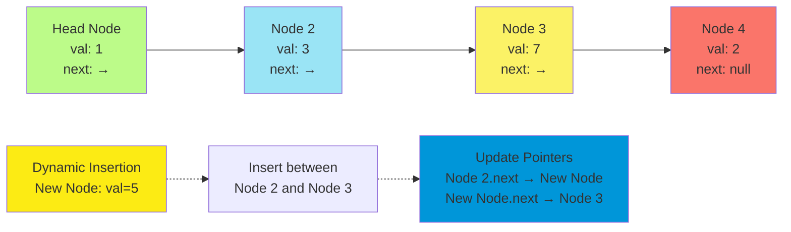
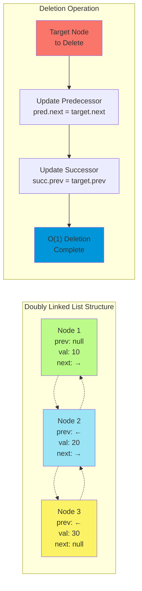
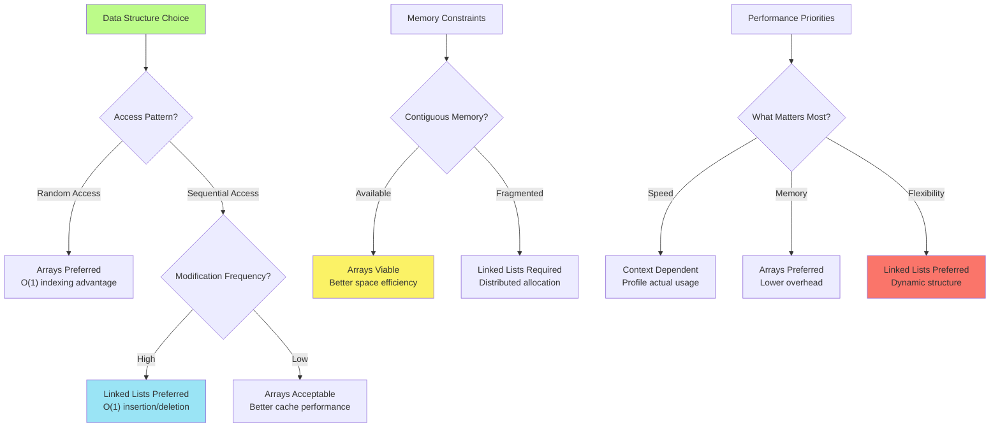
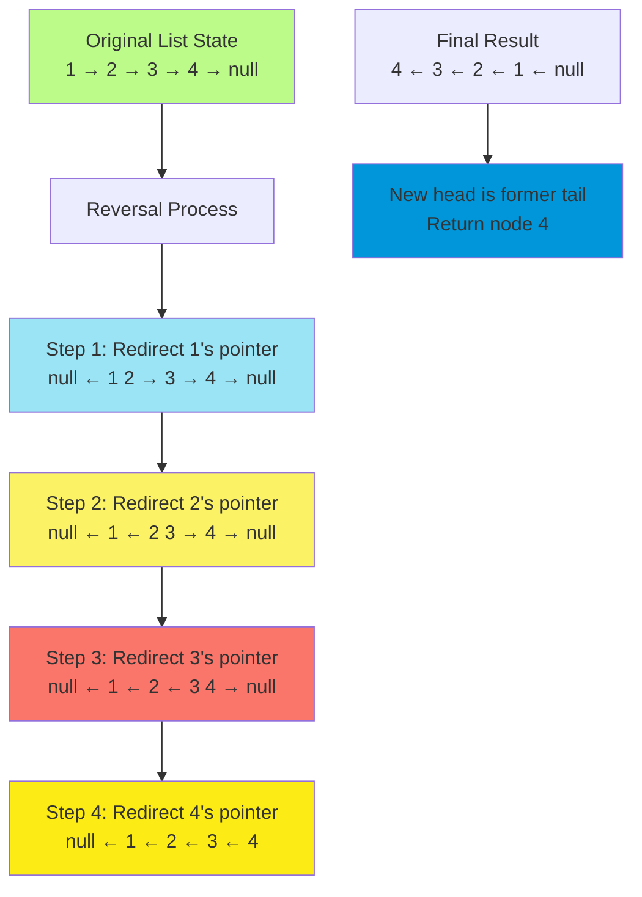
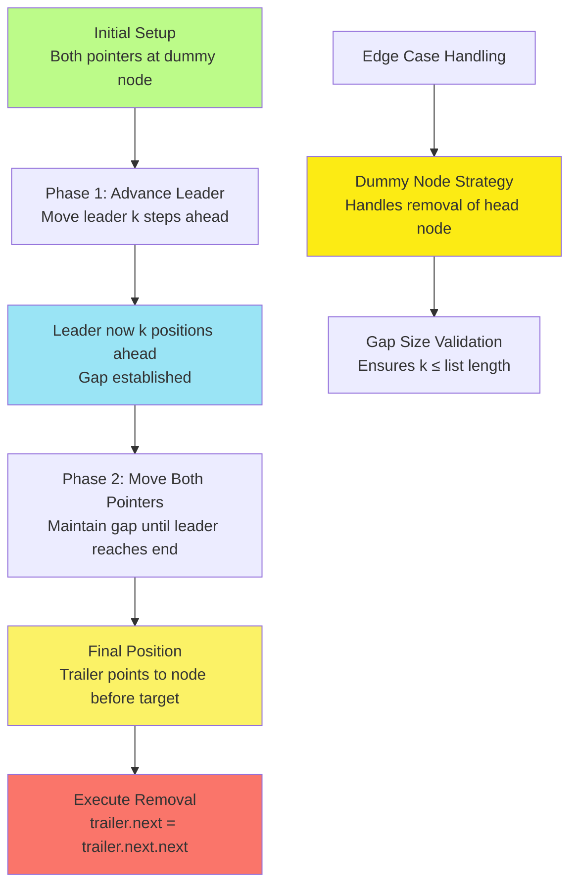
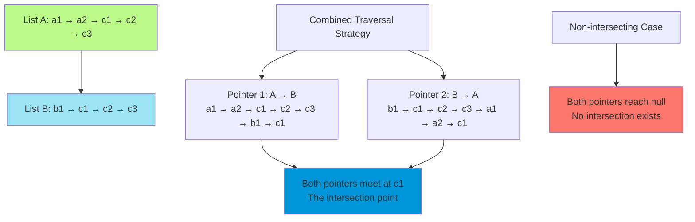
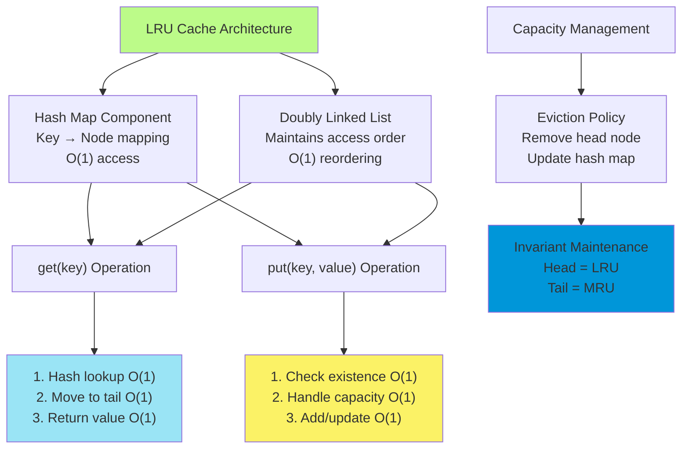

# C-3: Linked Lists - Dynamic Data Structure Manipulation

1. Theoretical Foundations of Linked List Structures
    - Singly Linked List Architecture and Properties
    - Doubly Linked List Design and Bidirectional Navigation
    - Dynamic Memory Management and Pointer Manipulation
    - Time-Space Complexity Trade-offs in List Operations
2. Linked List Restructuring Algorithms
    - Linked List Reversal Techniques
    - Iterative vs Recursive Reversal Approaches
    - Node Removal Strategies with Two-Pointer Technique
    - Kth Last Node Identification and Elimination
3. Advanced Traversal and Intersection Problems
    - Linked List Intersection Detection
    - Equal-Length List Simulation Strategy
    - Cycle Detection and Floyd's Algorithm Applications
    - Hash Set vs Constant Space Approaches
4. Complex Data Structure Design with Linked Lists
    - LRU Cache Implementation Strategy
    - Doubly Linked List and Hash Map Integration
    - Cache Eviction Policies and Node Management
    - Advanced Pointer Manipulation in Multi-Structure Systems

#### Theoretical Foundations of Linked List Structures

##### Singly Linked List Architecture and Properties

Understanding linked lists requires us to fundamentally reconceptualize how we organize and access data in memory.
Unlike arrays, which store elements in contiguous memory locations with direct indexing capabilities, linked lists
embrace a more organic approach to data organization through dynamic node connections.

The mathematical foundation of linked lists rests on the concept of recursive data structures. We can formally define a
singly linked list as either an empty structure (null) or a node containing data and a reference to another linked list.
This recursive definition $L = \emptyset \lor (data, L')$ where $L'$ represents the rest of the list, captures the
essential self-referential nature that makes linked lists so powerful for dynamic operations.

Each node in a singly linked list serves as a self-contained unit with two critical components: the data payload and the
navigational reference. The data component can hold any type of information, while the reference component establishes
the sequential relationship between nodes. This separation of concerns allows linked lists to achieve remarkable
flexibility in memory allocation and structure modification.

```python
class ListNode:
    """
    Fundamental building block of linked list structures.

    This class encapsulates the dual nature of linked list nodes:
    storing meaningful data while maintaining structural relationships
    through pointer references.
    """
    def __init__(self, val: int, next_node: 'ListNode' = None):
        self.val = val          # Data payload
        self.next = next_node   # Structural reference to next node
```

The architectural elegance of singly linked lists becomes apparent when we consider their operational characteristics.
Unlike arrays that require contiguous memory allocation and suffer from expensive insertion/deletion operations due to
element shifting, linked lists achieve $O(1)$ insertion and deletion at any position where we have a reference to the
preceding node.

Consider the mathematical representation of a singly linked list as a sequence of ordered pairs:
${(d_1, p_1), (d_2, p_2), ..., (d_n, null)}$ where $d_i$ represents the data at position $i$ and $p_i$ represents the
pointer to the next node. The terminal condition $p_n = null$ establishes the boundary of our list structure.



The trade-offs inherent in singly linked list design reflect fundamental principles in computer science. We sacrifice
the $O(1)$ random access capability of arrays in exchange for $O(1)$ dynamic insertion and deletion capabilities. This
trade-off proves particularly valuable in scenarios where the access pattern is primarily sequential and the data
structure size varies significantly during program execution.

The memory utilization pattern of linked lists also differs significantly from arrays. While arrays achieve excellent
cache locality through contiguous memory placement, linked lists may suffer from cache misses due to non-contiguous node
allocation. However, this apparent disadvantage becomes a strength when dealing with large data sets that exceed
available contiguous memory blocks.

##### Doubly Linked List Design and Bidirectional Navigation

Doubly linked lists represent a sophisticated evolution of the basic linked list concept, introducing bidirectional
navigation capabilities through the addition of backward references. This enhancement transforms the fundamental
mathematical model from $L = \emptyset \lor (data, L')$ to $L = \emptyset \lor (prev, data, next)$, where both forward
and backward traversal become possible.

The theoretical foundation of doubly linked lists rests on the concept of bidirectional graphs. Each node maintains two
edges: one pointing forward to the successor and one pointing backward to the predecessor. This creates a more robust
data structure that supports efficient operations at both ends of the list and enables elegant solutions to problems
that would be cumbersome with singly linked lists.

The architectural sophistication of doubly linked lists becomes evident when we examine their pointer structure. Each
node contains three essential components: the data payload, a forward pointer (next), and a backward pointer (prev).
This triple structure $(prev, data, next)$ establishes a symmetric relationship between adjacent nodes, where each
connection is bidirectionally reinforced.

```python
class DoublyLinkedListNode:
    """
    Enhanced node structure supporting bidirectional navigation.

    The addition of the previous pointer transforms simple sequential
    access into flexible bidirectional traversal, enabling sophisticated
    operations like efficient reverse iteration and O(1) tail operations.
    """
    def __init__(self, val: int, prev_node: 'DoublyLinkedListNode' = None,
                 next_node: 'DoublyLinkedListNode' = None):
        self.val = val          # Data payload
        self.prev = prev_node   # Backward structural reference
        self.next = next_node   # Forward structural reference
```

The mathematical elegance of doubly linked lists becomes apparent when we consider their symmetry properties. For any
valid doubly linked list, the following invariant must hold: if node $A$ points forward to node $B$, then node $B$ must
point backward to node $A$. Formally, $\forall nodes , A, B: A.next = B \Rightarrow B.prev = A$. This bidirectional
consistency ensures structural integrity and enables powerful traversal algorithms.

The operational advantages of doubly linked lists become particularly pronounced in deletion operations. While singly
linked lists require a reference to the predecessor node for efficient deletion (necessitating either traversal or
maintaining extra pointers), doubly linked lists can delete any node in $O(1)$ time given only a reference to that node.
This capability stems from the backward pointer providing direct access to the predecessor.



The space complexity implications of doubly linked lists merit careful consideration. Each node requires additional
memory for the backward pointer, effectively doubling the pointer storage overhead compared to singly linked lists.
However, this space investment yields significant algorithmic benefits, particularly in applications requiring frequent
bidirectional navigation or complex restructuring operations.

##### Dynamic Memory Management and Pointer Manipulation

The mastery of linked list algorithms requires developing sophisticated mental models for pointer manipulation and
dynamic memory relationships. Unlike array operations that work with fixed memory layouts, linked list operations
involve creating, destroying, and rewiring dynamic connections between independently allocated memory blocks.

The fundamental challenge in pointer manipulation lies in maintaining referential integrity while modifying list
structure. When we insert, delete, or rearrange nodes, we must carefully sequence our pointer updates to avoid creating
dangling references or losing access to parts of our data structure. This sequencing often requires temporary variables
to preserve critical references during intermediate states.

Consider the mathematical properties of pointer manipulation operations. When inserting a new node between existing
nodes $A$ and $B$, we must update exactly three pointer relationships: $A.next$, $new.next$, and $new.prev$ (in doubly
linked lists). The order of these updates is crucial to maintain list integrity throughout the operation.

```python
def insert_between(prev_node: ListNode, next_node: ListNode, new_val: int) -> ListNode:
    """
    Demonstrates the critical sequencing required for safe pointer manipulation.

    The order of pointer updates ensures that we never lose references to
    existing nodes while establishing new connections. This pattern applies
    broadly to linked list restructuring operations.
    """
    # Create the new node with proper initial connections
    new_node = ListNode(new_val)

    # Critical sequencing: establish forward connection first
    new_node.next = next_node

    # Then update the predecessor's forward connection
    prev_node.next = new_node

    # For doubly linked lists, establish backward connections
    if hasattr(new_node, 'prev'):
        new_node.prev = prev_node
        if next_node:
            next_node.prev = new_node

    return new_node
```

The cognitive complexity of pointer manipulation often stems from the need to maintain multiple mental models
simultaneously. We must track the current state of our data structure, the desired final state, and the intermediate
steps required to achieve the transformation safely. This multi-level reasoning distinguishes linked list algorithms
from simpler array operations.

Visualization techniques prove invaluable for mastering pointer manipulation. By representing pointers as arrows and
nodes as boxes, we can create mental diagrams that clarify the before, during, and after states of our operations. These
diagrams help us identify which references need preservation during manipulation and which can be safely overwritten.

The error-prone nature of pointer manipulation necessitates defensive programming practices. Common pitfalls include
creating circular references, losing track of list boundaries, and attempting to access null pointers. Developing
systematic approaches to pointer manipulation, such as always updating in specific orders or using dummy nodes to
simplify edge cases, can dramatically reduce the likelihood of these errors.

##### Time-Space Complexity Trade-offs in List Operations

The complexity analysis of linked list operations reveals fundamental trade-offs that distinguish them from array-based
alternatives. Understanding these trade-offs enables informed decisions about when to employ linked lists and how to
optimize their performance for specific use cases.

The time complexity characteristics of linked lists reflect their sequential access nature. While array elements can be
accessed in $O(1)$ time through direct indexing, linked list access requires $O(n)$ traversal in the worst case.
However, this apparent disadvantage is offset by linked lists' superior performance in structural modification
operations.

Consider the complexity comparison for fundamental operations:

**Array Operations:**

- Access by index: $O(1)$
- Search for value: $O(n)$
- Insertion at arbitrary position: $O(n)$ due to element shifting
- Deletion at arbitrary position: $O(n)$ due to element shifting
- Insertion/deletion at end: $O(1)$ amortized

**Linked List Operations:**

- Access by position: $O(n)$ due to sequential traversal
- Search for value: $O(n)$
- Insertion with node reference: $O(1)$
- Deletion with node reference: $O(1)$
- Insertion/deletion at known position: $O(1)$

The space complexity analysis reveals another important trade-off dimension. Arrays achieve optimal space utilization by
storing only the data elements, while linked lists incur pointer overhead. For a list of $n$ elements, arrays require
$O(n)$ space for data storage, while linked lists require $O(n)$ space for data plus $O(n)$ space for pointers,
effectively doubling the memory footprint in the worst case.

However, this space overhead analysis must be contextualized within the broader memory management picture. Arrays
require contiguous memory allocation, which can be challenging or impossible for very large data sets. Linked lists,
through their distributed allocation model, can utilize fragmented memory spaces that would be unusable for arrays.

The cache performance implications of these trade-offs deserve special attention in modern computing environments.
Arrays benefit from spatial locality, as accessing adjacent elements often results in cache hits. Linked lists, with
their potentially scattered memory layout, may suffer from cache misses during traversal operations.



The amortized analysis of linked list operations provides deeper insights into their practical performance
characteristics. While individual operations may have varying costs depending on list state and memory fragmentation,
the average performance over many operations often provides a more realistic assessment of practical utility.

#### Linked List Restructuring Algorithms

##### Linked List Reversal Techniques

Linked list reversal represents one of the most fundamental and intellectually rewarding problems in data structures.
The challenge lies not merely in achieving the reversal, but in understanding the deep algorithmic principles that make
elegant solutions possible. The problem transforms a forward-pointing chain of nodes into a backward-pointing chain,
effectively inverting the directional flow of information.

The mathematical essence of linked list reversal involves transforming a sequence of ordered pairs representing forward
connections into their inverse. Given a list structure
${(1 \rightarrow 2), (2 \rightarrow 3), (3 \rightarrow 4), (4 \rightarrow null)}$, we must produce
${(null \leftarrow 1), (1 \leftarrow 2), (2 \leftarrow 3), (3 \leftarrow 4)}$. This transformation requires careful
manipulation of each node's next pointer while preserving access to subsequent nodes.

The conceptual breakthrough in understanding reversal algorithms comes from recognizing that we're essentially
performing a series of local pointer redirections. At each node, we redirect its outgoing pointer to point to the
previous node instead of the next node. The challenge lies in maintaining references to all necessary nodes throughout
this process.



The iterative approach to linked list reversal demonstrates the power of maintaining minimal state while performing
complex transformations. We need only three variables: a current pointer for the node being processed, a previous
pointer for the reversed portion, and a next pointer to preserve our forward progress through the original list.

Understanding the invariants maintained during iterative reversal provides deeper insight into the algorithm's
correctness. At each iteration, we maintain the property that all nodes before the current position have been reversed
and properly connected, while all nodes from the current position onward maintain their original forward connections.
This invariant ensures that we never lose portions of our list during the reversal process.

##### Iterative vs Recursive Reversal Approaches

The dichotomy between iterative and recursive approaches to linked list reversal illuminates fundamental differences in
algorithmic thinking. While both methods achieve identical results, they represent distinct paradigms for decomposing
and solving complex problems.

**Iterative Implementation:**

```python
def reverse_linked_list_iterative(head: ListNode) -> ListNode:
    """
    Iterative reversal using three-pointer technique.

    This approach maintains explicit control over the reversal process,
    making the pointer manipulation visible and debuggable. The algorithm
    proceeds forward through the original list while building the reversed
    structure behind it.
    """
    # Initialize our three essential pointers
    prev_node = None        # Points to the growing reversed portion
    current_node = head     # Points to the node being processed

    # Continue until we've processed all nodes
    while current_node is not None:
        # Preserve our forward progress before modifying pointers
        next_node = current_node.next

        # Perform the critical pointer reversal
        current_node.next = prev_node

        # Advance our pointers for the next iteration
        prev_node = current_node
        current_node = next_node

    # prev_node now points to the new head of the reversed list
    return prev_node
```

**Recursive Implementation:**

```python
def reverse_linked_list_recursive(head: ListNode) -> ListNode:
    """
    Recursive reversal using problem decomposition.

    This approach breaks the problem into smaller subproblems: reverse
    the tail of the list, then connect the current node appropriately.
    The elegance comes from assuming the recursive call works correctly.
    """
    # Base cases: empty list or single node
    if not head or not head.next:
        return head

    # Recursive leap of faith: assume this call reverses the tail
    new_head = reverse_linked_list_recursive(head.next)

    # Now we have: head -> (reversed tail starting at new_head)
    # We need to append head to the end of the reversed tail

    # head.next currently points to the first node of the reversed tail
    # We need that node to point back to head
    head.next.next = head

    # Terminate the list by making head point to null
    head.next = None

    # Return the head of the fully reversed list
    return new_head
```

The complexity analysis reveals interesting trade-offs between these approaches. Both achieve $O(n)$ time complexity,
visiting each node exactly once. However, their space complexity characteristics differ significantly. The iterative
approach uses $O(1)$ space, maintaining only a constant number of pointer variables. The recursive approach incurs
$O(n)$ space complexity due to the call stack, with each recursive call adding a new stack frame.

The recursive approach offers conceptual elegance through its problem decomposition strategy. By assuming that our
recursive call correctly reverses the sublist, we can focus solely on the local connections needed to integrate the
current node. This separation of concerns often leads to cleaner, more understandable code, albeit at the cost of
additional space usage.

The choice between iterative and recursive approaches often depends on the specific constraints and preferences of the
problem context. In environments with limited stack space, the iterative approach proves more robust. In contexts where
code clarity and mathematical elegance are prioritized, the recursive approach may be preferred.

**Java Implementation (Both Approaches):**

```java
public class LinkedListReversal {
    /**
     * Iterative reversal implementation in Java.
     * Demonstrates explicit memory management and pointer manipulation.
     */
    public static ListNode reverseIterative(ListNode head) {
        ListNode prevNode = null;
        ListNode currentNode = head;

        while (currentNode != null) {
            // Store next node before breaking the connection
            ListNode nextNode = currentNode.next;

            // Reverse the connection
            currentNode.next = prevNode;

            // Move pointers forward
            prevNode = currentNode;
            currentNode = nextNode;
        }

        return prevNode; // New head of reversed list
    }

    /**
     * Recursive reversal implementation in Java.
     * Showcases the elegance of recursive problem decomposition.
     */
    public static ListNode reverseRecursive(ListNode head) {
        // Base case: empty list or single node
        if (head == null || head.next == null) {
            return head;
        }

        // Recursively reverse the rest of the list
        ListNode newHead = reverseRecursive(head.next);

        // Reverse the connection between current and next node
        head.next.next = head;
        head.next = null;

        return newHead;
    }
}
```

**C++ Implementation (Both Approaches):**

```cpp
class LinkedListReversal {
public:
    /**
     * Iterative reversal in C++ with explicit pointer management.
     * Demonstrates low-level control over memory and references.
     */
    static ListNode* reverseIterative(ListNode* head) {
        ListNode* prevNode = nullptr;
        ListNode* currentNode = head;

        while (currentNode != nullptr) {
            // Preserve forward progress
            ListNode* nextNode = currentNode->next;

            // Perform reversal
            currentNode->next = prevNode;

            // Advance pointers
            prevNode = currentNode;
            currentNode = nextNode;
        }

        return prevNode;
    }

    /**
     * Recursive reversal in C++ showcasing stack-based decomposition.
     * Illustrates the elegance of recursive thinking in low-level languages.
     */
    static ListNode* reverseRecursive(ListNode* head) {
        // Base cases
        if (head == nullptr || head->next == nullptr) {
            return head;
        }

        // Recursive call on subproblem
        ListNode* newHead = reverseRecursive(head->next);

        // Local connection updates
        head->next->next = head;
        head->next = nullptr;

        return newHead;
    }
};
```

##### Node Removal Strategies with Two-Pointer Technique

The problem of removing the kth node from the end of a linked list introduces us to one of the most elegant applications
of the two-pointer technique. This problem beautifully demonstrates how seemingly complex positional calculations can be
simplified through clever pointer manipulation strategies.

The mathematical foundation of this problem lies in establishing a relationship between forward traversal and backward
positioning. In a list of length $n$, the kth node from the end occupies position $(n - k + 1)$ from the beginning.
However, calculating this position requires knowing $n$, which necessitates a complete traversal of the list.

The two-pointer technique elegantly circumvents this limitation by creating a moving window of fixed size $k$ between
two pointers. When the leading pointer reaches the end of the list, the trailing pointer will be positioned exactly $k$
nodes behind, which corresponds to the $(k+1)$th node from the end—the node preceding our target.



The algorithm's elegance lies in its ability to solve the positioning problem in a single pass while maintaining
constant space complexity. By establishing and maintaining the fixed gap between pointers, we transform a two-pass
algorithm (one pass to find length, another to locate the target) into an efficient single-pass solution.

**Implementation with Detailed Analysis:**

```python
def remove_kth_from_end(head: ListNode, k: int) -> ListNode:
    """
    Remove the kth node from the end using two-pointer technique.

    The algorithm uses a dummy node to handle edge cases elegantly,
    particularly when the head node needs to be removed. The two-pointer
    approach ensures O(n) time complexity with O(1) space usage.
    """
    # Create dummy node to simplify edge case handling
    # This ensures we always have a node before the target
    dummy = ListNode(0)
    dummy.next = head

    # Initialize both pointers at the dummy node
    leader = dummy
    trailer = dummy

    # Phase 1: Advance the leader k+1 steps ahead
    # The extra step ensures trailer points to the node before target
    for _ in range(k + 1):
        if leader is None:
            # k is larger than list length; no removal needed
            return head
        leader = leader.next

    # Phase 2: Move both pointers until leader reaches the end
    # This maintains the gap and positions trailer correctly
    while leader is not None:
        leader = leader.next
        trailer = trailer.next

    # Execute the removal by skipping the target node
    # trailer.next is the kth node from the end
    trailer.next = trailer.next.next

    # Return the head of the modified list
    return dummy.next
```

The mathematical correctness of this algorithm relies on the invariant that the gap between leader and trailer remains
constant at $k+1$ positions throughout the traversal. When the leader reaches the end (null), the trailer will be
positioned at the $(k+1)$th node from the end, which is exactly the predecessor of our target node.

**Java Implementation:**

```java
public class KthNodeRemoval {
    /**
     * Removes the kth node from the end using two-pointer technique.
     * Demonstrates robust edge case handling and efficient traversal.
     */
    public static ListNode removeKthFromEnd(ListNode head, int k) {
        // Dummy node simplifies edge case handling
        ListNode dummy = new ListNode(0);
        dummy.next = head;

        ListNode leader = dummy;
        ListNode trailer = dummy;

        // Establish gap of k+1 between pointers
        for (int i = 0; i <= k; i++) {
            if (leader == null) {
                // k exceeds list length
                return head;
            }
            leader = leader.next;
        }

        // Maintain gap while traversing to end
        while (leader != null) {
            leader = leader.next;
            trailer = trailer.next;
        }

        // Remove target node
        trailer.next = trailer.next.next;

        return dummy.next;
    }
}
```

**C++ Implementation:**

```cpp
class KthNodeRemoval {
public:
    /**
     * C++ implementation with explicit pointer management.
     * Showcases memory safety considerations in low-level languages.
     */
    static ListNode* removeKthFromEnd(ListNode* head, int k) {
        // Create dummy node for edge case handling
        ListNode dummy(0);
        dummy.next = head;

        ListNode* leader = &dummy;
        ListNode* trailer = &dummy;

        // Advance leader k+1 steps
        for (int i = 0; i <= k; ++i) {
            if (leader == nullptr) {
                return head; // k exceeds list length
            }
            leader = leader->next;
        }

        // Move both pointers to maintain gap
        while (leader != nullptr) {
            leader = leader->next;
            trailer = trailer->next;
        }

        // Perform removal
        ListNode* nodeToRemove = trailer->next;
        trailer->next = trailer->next->next;

        // In production code, consider: delete nodeToRemove;

        return dummy.next;
    }
};
```

##### Kth Last Node Identification and Elimination

The identification of the kth last node represents a fundamental pattern that extends beyond simple removal operations.
This pattern emerges in numerous linked list algorithms, from cycle detection to list partitioning, making its mastery
essential for advanced linked list manipulation.

The algorithmic insight underlying kth last node identification involves transforming relative positioning problems into
absolute positioning through strategic pointer placement. By establishing a fixed-distance relationship between two
pointers, we create a mobile reference frame that automatically maintains the desired positional relationship.

The robustness of this approach becomes apparent when we consider various edge cases and their solutions. The dummy node
technique provides a uniform treatment for head removal scenarios, eliminating the need for special-case logic. The gap
validation ensures graceful handling of invalid k values without causing runtime errors.

Consider the broader applications of this two-pointer pattern. In cycle detection (Floyd's algorithm), we use pointers
moving at different speeds to identify cycles. In list partitioning, we might use multiple pointers to maintain
references to different segments. The kth last node pattern provides a foundation for understanding these more advanced
techniques.

The time complexity analysis reveals the optimal nature of this approach. With $O(n)$ time complexity and $O(1)$ space
complexity, the algorithm achieves the theoretical minimum for this problem. No algorithm can solve kth last node
identification in less than $O(n)$ time, as we must examine at least $n-k+1$ nodes to determine the correct position.

The practical implications of mastering this pattern extend to system design and algorithm optimization. Understanding
how to maintain positional relationships through pointer manipulation enables the development of efficient solutions to
complex problems involving sequential data processing and stream algorithms.

#### Advanced Traversal and Intersection Problems

##### Linked List Intersection Detection

The linked list intersection problem represents one of the most intellectually satisfying applications of algorithmic
creativity to pointer manipulation. Unlike simple value comparison, intersection detection requires identifying shared
memory locations, making it a problem of structural analysis rather than data comparison.

The mathematical foundation of intersection detection lies in understanding the geometric properties of linked list
structures. When two linked lists intersect, they form a Y-shaped structure where the intersection point marks the
beginning of a shared tail segment. This geometric insight leads to the key observation that intersecting lists will
have identical tail segments of identical length.

The naive approach using hash sets, while correct, consumes $O(n)$ additional space to store visited nodes. The
challenge lies in developing a constant-space solution that leverages the structural properties of intersecting lists to
achieve the same result without auxiliary storage.

The breakthrough insight involves recognizing that while two intersecting lists may have different lengths, the combined
structures "List A + List B" and "List B + List A" will always have identical lengths. This mathematical property
enables us to simulate equal-length traversal on lists of different lengths.



The elegance of this solution lies in its mathematical symmetry. If we denote the lengths of the unique portions of
lists A and B as $a$ and $b$ respectively, and the length of the shared portion as $c$, then both combined traversals
cover exactly $a + b + c$ nodes before meeting at the intersection point.

**Theoretical Analysis:** For intersecting lists:

- List A length: $a + c$
- List B length: $b + c$
- Combined traversal A→B: $a + c + b + c = a + b + 2c$
- Combined traversal B→A: $b + c + a + c = a + b + 2c$

Both pointers traverse exactly $a + b + c$ nodes before meeting at the intersection point, proving the algorithm's
correctness.

**Implementation with Mathematical Rigor:**

```python
def find_intersection(head_a: ListNode, head_b: ListNode) -> ListNode:
    """
    Find intersection point of two linked lists using equal-length simulation.

    This algorithm leverages the mathematical property that combined traversals
    of two lists (A→B and B→A) have identical lengths, enabling intersection
    detection without additional space or preliminary length calculations.

    Time Complexity: O(m + n) where m, n are lengths of the two lists
    Space Complexity: O(1) using only pointer variables
    """
    # Handle edge cases: if either list is empty, no intersection possible
    if not head_a or not head_b:
        return None

    # Initialize pointers for simultaneous traversal
    pointer_a = head_a
    pointer_b = head_b

    # Continue traversal until pointers meet or both reach null
    while pointer_a != pointer_b:
        # Simulate combined list traversal A→B
        # When pointer_a reaches end of list A, continue from head of list B
        pointer_a = pointer_a.next if pointer_a else head_b

        # Simulate combined list traversal B→A
        # When pointer_b reaches end of list B, continue from head of list A
        pointer_b = pointer_b.next if pointer_b else head_a

    # At this point, pointers either meet at intersection or both are null
    return pointer_a  # Returns intersection node or None
```

**Java Implementation:**

```java
public class LinkedListIntersection {
    /**
     * Finds intersection point using elegant pointer switching technique.
     * Demonstrates how mathematical insights can lead to optimal solutions.
     */
    public static ListNode findIntersection(ListNode headA, ListNode headB) {
        if (headA == null || headB == null) {
            return null;
        }

        ListNode pointerA = headA;
        ListNode pointerB = headB;

        // Continue until pointers meet or both become null
        while (pointerA != pointerB) {
            // Switch to other list when reaching end
            pointerA = (pointerA == null) ? headB : pointerA.next;
            pointerB = (pointerB == null) ? headA : pointerB.next;
        }

        return pointerA; // Intersection point or null
    }
}
```

**C++ Implementation:**

```cpp
class LinkedListIntersection {
public:
    /**
     * C++ implementation showcasing pointer arithmetic elegance.
     * Demonstrates how low-level pointer manipulation can achieve
     * sophisticated algorithmic goals.
     */
    static ListNode* findIntersection(ListNode* headA, ListNode* headB) {
        if (headA == nullptr || headB == nullptr) {
            return nullptr;
        }

        ListNode* pointerA = headA;
        ListNode* pointerB = headB;

        while (pointerA != pointerB) {
            // Elegant pointer switching using ternary operator
            pointerA = pointerA ? pointerA->next : headB;
            pointerB = pointerB ? pointerB->next : headA;
        }

        return pointerA;
    }
};
```

##### Equal-Length List Simulation Strategy

The equal-length simulation strategy represents a powerful algorithmic paradigm that extends far beyond intersection
detection. This technique transforms problems involving lists of different lengths into equivalent problems with lists
of equal length, often dramatically simplifying the solution approach.

The mathematical foundation of this strategy rests on the principle of cyclic concatenation. By conceptually joining two
lists in different orders (A→B and B→A), we create two virtual lists of identical length that maintain the structural
relationships necessary for problem solving.

Consider the general applicability of this approach. In merge operations, we might use equal-length simulation to ensure
balanced processing of two input streams. In comparison algorithms, the technique enables fair evaluation of structures
with different lengths. The pattern appears repeatedly in advanced linked list algorithms.

The theoretical elegance of equal-length simulation becomes apparent when we consider its invariant properties.
Regardless of the original list lengths, the simulated equal-length traversals maintain consistent relative positioning
between corresponding elements. This consistency enables algorithms that would otherwise require complex bookkeeping to
operate with simple, symmetric logic.

##### Cycle Detection and Floyd's Algorithm Applications

While not explicitly covered in the provided material, the intersection detection algorithm shares fundamental
similarities with Floyd's cycle detection algorithm. Both rely on clever pointer manipulation to detect structural
properties without additional space requirements.

Floyd's algorithm uses two pointers moving at different speeds (slow and fast) to detect cycles in linked lists. The
mathematical principle underlying this approach involves the pigeonhole principle: if a cycle exists, the faster pointer
will eventually "lap" the slower pointer within the cycle.

The relationship between intersection detection and cycle detection illustrates how mastering fundamental pointer
manipulation patterns enables solutions to a broad class of problems. Both algorithms demonstrate how mathematical
insights about structure and movement can lead to elegant, efficient solutions.

##### Hash Set vs Constant Space Approaches

The comparison between hash set and constant space approaches to intersection detection highlights fundamental
trade-offs in algorithm design. The hash set approach offers conceptual simplicity at the cost of additional space,
while the constant space approach requires more sophisticated algorithmic insight but achieves optimal space efficiency.

**Hash Set Approach Analysis:**

```python
def find_intersection_hash_set(head_a: ListNode, head_b: ListNode) -> ListNode:
    """
    Hash set approach for intersection detection.
    Trades space for conceptual simplicity.

    Time Complexity: O(m + n)
    Space Complexity: O(m) for storing visited nodes
    """
    if not head_a or not head_b:
        return None

    # Store all nodes from first list
    visited_nodes = set()
    current = head_a
    while current:
        visited_nodes.add(current)
        current = current.next

    # Check second list for any visited nodes
    current = head_b
    while current:
        if current in visited_nodes:
            return current  # First intersection found
        current = current.next

    return None  # No intersection
```

The hash set approach provides several advantages: it's conceptually straightforward, easy to implement correctly, and
generalizes well to problems requiring more complex node tracking. However, it sacrifices space efficiency and may
suffer from hash table overhead in practical implementations.

The constant space approach, while more complex to derive and understand, achieves optimal space efficiency and
demonstrates sophisticated algorithmic thinking. The choice between approaches often depends on the specific constraints
and requirements of the problem context.

In interview settings, demonstrating both approaches shows algorithmic versatility and understanding of trade-offs.
Starting with the hash set approach to establish correctness, then optimizing to the constant space solution, often
represents an effective problem-solving strategy.

#### Complex Data Structure Design with Linked Lists

##### LRU Cache Implementation Strategy

The LRU (Least Recently Used) cache represents one of the most sophisticated applications of linked list principles in
practical system design. This data structure combines multiple fundamental concepts—hash tables for fast access, doubly
linked lists for efficient reordering, and careful invariant maintenance—to achieve optimal performance characteristics
for cache operations.

The mathematical foundation of LRU caches lies in understanding temporal locality and the principle of least recently
used eviction. When cache capacity is exceeded, the item that has been unused for the longest time becomes the candidate
for removal. This policy requires maintaining a total ordering of items based on access recency.

The algorithmic challenge involves supporting three operations efficiently:

1. **Get(key)**: Retrieve value and mark as most recently used - $O(1)$
2. **Put(key, value)**: Insert/update and mark as most recently used - $O(1)$
3. **Evict()**: Remove least recently used item when capacity exceeded - $O(1)$

The insight that enables $O(1)$ performance for all operations involves recognizing that we need both fast access (hash
table) and fast reordering (doubly linked list). Neither data structure alone can provide both capabilities efficiently.



The structural design requires careful consideration of dummy nodes to simplify edge case handling. By maintaining dummy
head and tail nodes, we eliminate special cases for empty lists or single-element operations, leading to cleaner and
more robust code.

**Core Node Structure:**

```python
class DoublyLinkedListNode:
    """
    Node structure for LRU cache implementation.

    Each node maintains both key and value to support efficient
    hash map cleanup during eviction operations.
    """
    def __init__(self, key: int = 0, value: int = 0):
        self.key = key
        self.value = value
        self.prev = None
        self.next = None
```

##### Doubly Linked List and Hash Map Integration

The seamless integration of doubly linked lists and hash maps represents the core architectural challenge in LRU cache
design. The hash map provides $O(1)$ access to nodes by key, while the doubly linked list maintains the temporal
ordering required for LRU eviction policy.

The critical insight involves storing references to list nodes as hash map values, rather than storing the actual cached
values. This indirection enables efficient node manipulation without requiring list traversal to locate nodes for
reordering operations.

The invariant maintenance requires careful attention to the relationship between the two data structures. Every key in
the hash map must correspond to exactly one node in the linked list, and every node in the linked list (except dummy
nodes) must have a corresponding entry in the hash map.

**Complete LRU Cache Implementation:**

```python
class LRUCache:
    """
    LRU Cache implementation using hash map and doubly linked list.

    This design achieves O(1) time complexity for all operations through
    the strategic combination of hash-based access and linked list reordering.
    The dummy head and tail nodes simplify edge case handling significantly.
    """

    def __init__(self, capacity: int):
        self.capacity = capacity
        self.hash_map = {}  # key -> node mapping

        # Initialize dummy head and tail nodes
        # These simplify insertion and deletion operations
        self.head = DoublyLinkedListNode()  # Dummy head (LRU end)
        self.tail = DoublyLinkedListNode()  # Dummy tail (MRU end)

        # Connect dummy nodes to establish empty list
        self.head.next = self.tail
        self.tail.prev = self.head

    def _add_to_tail(self, node: DoublyLinkedListNode) -> None:
        """
        Add node as most recently used (before tail dummy).

        This operation maintains the invariant that the tail end
        represents the most recently used items.
        """
        prev_node = self.tail.prev

        # Establish new node's connections
        node.prev = prev_node
        node.next = self.tail

        # Update adjacent nodes' connections
        prev_node.next = node
        self.tail.prev = node

    def _remove_node(self, node: DoublyLinkedListNode) -> None:
        """
        Remove node from its current position in the list.

        This operation works for any node in the list due to
        the bidirectional pointer structure.
        """
        node.prev.next = node.next
        node.next.prev = node.prev

    def get(self, key: int) -> int:
        """
        Retrieve value and mark as most recently used.

        Time Complexity: O(1)
        Space Complexity: O(1)
        """
        if key not in self.hash_map:
            return -1

        # Move accessed node to tail (most recently used position)
        node = self.hash_map[key]
        self._remove_node(node)
        self._add_to_tail(node)

        return node.value

    def put(self, key: int, value: int) -> None:
        """
        Insert or update key-value pair and mark as most recently used.

        Time Complexity: O(1)
        Space Complexity: O(1)
        """
        if key in self.hash_map:
            # Update existing key
            node = self.hash_map[key]
            node.value = value

            # Move to most recently used position
            self._remove_node(node)
            self._add_to_tail(node)
        else:
            # Insert new key-value pair
            new_node = DoublyLinkedListNode(key, value)

            # Check capacity and evict if necessary
            if len(self.hash_map) >= self.capacity:
                # Remove least recently used (head.next)
                lru_node = self.head.next
                self._remove_node(lru_node)
                del self.hash_map[lru_node.key]

            # Add new node as most recently used
            self._add_to_tail(new_node)
            self.hash_map[key] = new_node
```

**Java Implementation:**

```java
public class LRUCache {
    private class DoublyLinkedListNode {
        int key, value;
        DoublyLinkedListNode prev, next;

        DoublyLinkedListNode(int key, int value) {
            this.key = key;
            this.value = value;
        }
    }

    private int capacity;
    private HashMap<Integer, DoublyLinkedListNode> hashMap;
    private DoublyLinkedListNode head, tail;

    public LRUCache(int capacity) {
        this.capacity = capacity;
        this.hashMap = new HashMap<>();

        // Initialize dummy nodes
        this.head = new DoublyLinkedListNode(0, 0);
        this.tail = new DoublyLinkedListNode(0, 0);
        head.next = tail;
        tail.prev = head;
    }

    private void addToTail(DoublyLinkedListNode node) {
        DoublyLinkedListNode prevNode = tail.prev;

        node.prev = prevNode;
        node.next = tail;
        prevNode.next = node;
        tail.prev = node;
    }

    private void removeNode(DoublyLinkedListNode node) {
        node.prev.next = node.next;
        node.next.prev = node.prev;
    }

    public int get(int key) {
        if (!hashMap.containsKey(key)) {
            return -1;
        }

        DoublyLinkedListNode node = hashMap.get(key);
        removeNode(node);
        addToTail(node);

        return node.value;
    }

    public void put(int key, int value) {
        if (hashMap.containsKey(key)) {
            DoublyLinkedListNode node = hashMap.get(key);
            node.value = value;
            removeNode(node);
            addToTail(node);
        } else {
            DoublyLinkedListNode newNode = new DoublyLinkedListNode(key, value);

            if (hashMap.size() >= capacity) {
                DoublyLinkedListNode lruNode = head.next;
                removeNode(lruNode);
                hashMap.remove(lruNode.key);
            }

            addToTail(newNode);
            hashMap.put(key, newNode);
        }
    }
}
```

##### Cache Eviction Policies and Node Management

The LRU eviction policy represents just one of many possible cache management strategies. Understanding the design
principles underlying LRU implementation provides insight into how other eviction policies might be implemented using
similar architectural approaches.

The temporal locality principle that motivates LRU caching assumes that recently accessed items are more likely to be
accessed again in the near future. This assumption holds well for many practical scenarios but may not be optimal for
all access patterns. Alternative policies like LFU (Least Frequently Used) or Random replacement may be more appropriate
in certain contexts.

The node management complexity in LRU caches involves maintaining consistency between the hash map and linked list
representations. Every modification operation must update both data structures atomically to preserve the invariants
that ensure correct behavior.

Consider the subtleties involved in capacity management. When the cache reaches capacity, we must evict the least
recently used item before adding the new item. This requires identifying the LRU item (head.next), removing it from both
the linked list and hash map, then adding the new item to both structures.

The thread safety considerations for LRU caches in concurrent environments add another layer of complexity. Ensuring
atomic updates across both data structures requires careful synchronization to prevent race conditions and maintain
consistency.

##### Advanced Pointer Manipulation in Multi-Structure Systems

The LRU cache implementation demonstrates advanced pointer manipulation techniques that extend beyond simple linked list
operations. The coordination between hash map references and linked list pointers requires sophisticated understanding
of reference management and memory relationships.

The dummy node technique used in LRU caches exemplifies how auxiliary structures can simplify complex pointer
manipulations. By providing stable anchor points at the list boundaries, dummy nodes eliminate special cases and reduce
the likelihood of pointer manipulation errors.

The bidirectional nature of doubly linked lists enables efficient removal operations without requiring traversal to
locate predecessor nodes. This capability proves essential in cache implementations where arbitrary nodes may need
removal based on eviction policies.

The integration patterns demonstrated in LRU cache design apply broadly to other multi-structure systems. Database
indexes, memory managers, and other system components often require similar coordination between different data
structure representations of the same underlying data.

The performance characteristics of LRU caches demonstrate how careful architectural design can achieve optimal
complexity bounds across multiple operations. The $O(1)$ time complexity for all operations represents a significant
achievement that requires deep understanding of data structure properties and their interactions.

**C++ Implementation:**

```cpp
#include <unordered_map>

class LRUCache {
private:
    struct DoublyLinkedListNode {
        int key, value;
        DoublyLinkedListNode* prev;
        DoublyLinkedListNode* next;

        DoublyLinkedListNode(int k = 0, int v = 0)
            : key(k), value(v), prev(nullptr), next(nullptr) {}
    };

    int capacity;
    std::unordered_map<int, DoublyLinkedListNode*> hashMap;
    DoublyLinkedListNode* head;
    DoublyLinkedListNode* tail;

    void addToTail(DoublyLinkedListNode* node) {
        DoublyLinkedListNode* prevNode = tail->prev;

        node->prev = prevNode;
        node->next = tail;
        prevNode->next = node;
        tail->prev = node;
    }

    void removeNode(DoublyLinkedListNode* node) {
        node->prev->next = node->next;
        node->next->prev = node->prev;
    }

public:
    LRUCache(int capacity) : capacity(capacity) {
        head = new DoublyLinkedListNode();
        tail = new DoublyLinkedListNode();
        head->next = tail;
        tail->prev = head;
    }

    ~LRUCache() {
        DoublyLinkedListNode* current = head;
        while (current) {
            DoublyLinkedListNode* next = current->next;
            delete current;
            current = next;
        }
    }

    int get(int key) {
        if (hashMap.find(key) == hashMap.end()) {
            return -1;
        }

        DoublyLinkedListNode* node = hashMap[key];
        removeNode(node);
        addToTail(node);

        return node->value;
    }

    void put(int key, int value) {
        if (hashMap.find(key) != hashMap.end()) {
            DoublyLinkedListNode* node = hashMap[key];
            node->value = value;
            removeNode(node);
            addToTail(node);
        } else {
            DoublyLinkedListNode* newNode = new DoublyLinkedListNode(key, value);

            if (static_cast<int>(hashMap.size()) >= capacity) {
                DoublyLinkedListNode* lruNode = head->next;
                removeNode(lruNode);
                hashMap.erase(lruNode->key);
                delete lruNode;
            }

            addToTail(newNode);
            hashMap[key] = newNode;
        }
    }
};
```

This comprehensive treatment of linked lists demonstrates their fundamental importance in algorithm design and system
implementation. From basic pointer manipulation to sophisticated multi-structure coordination, linked lists provide the
foundation for understanding dynamic data structures and their applications in complex problem-solving scenarios. The
mathematical principles, implementation techniques, and complexity analyses presented here provide a thorough foundation
for mastering linked list algorithms and their applications in advanced computer science contexts.
