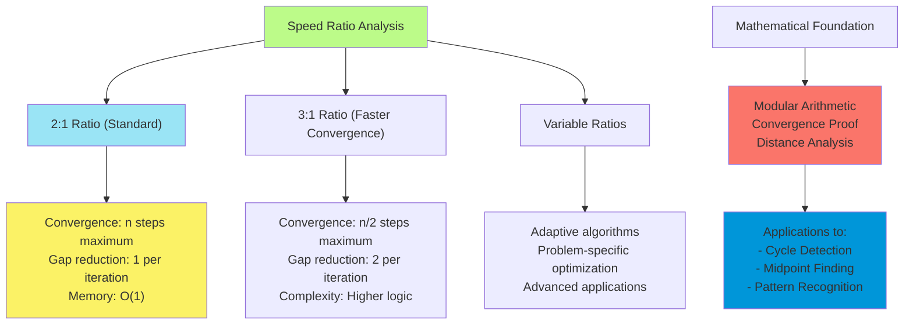
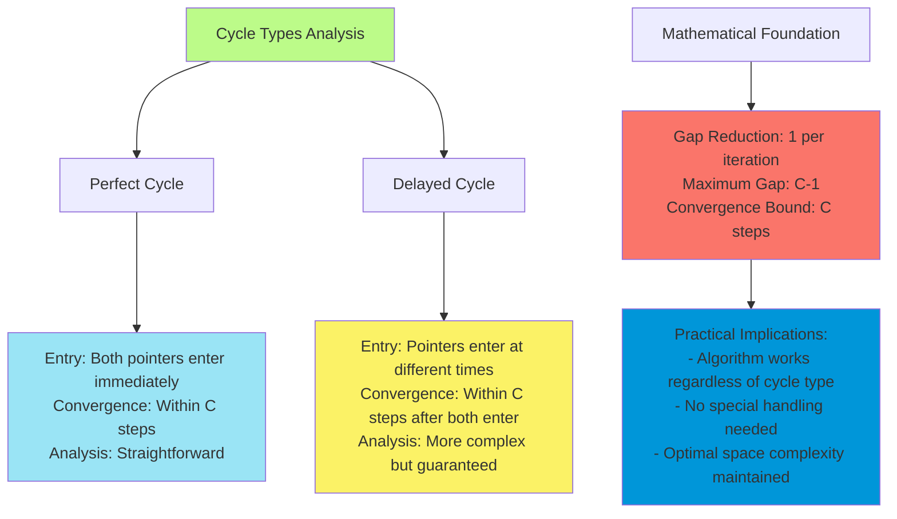
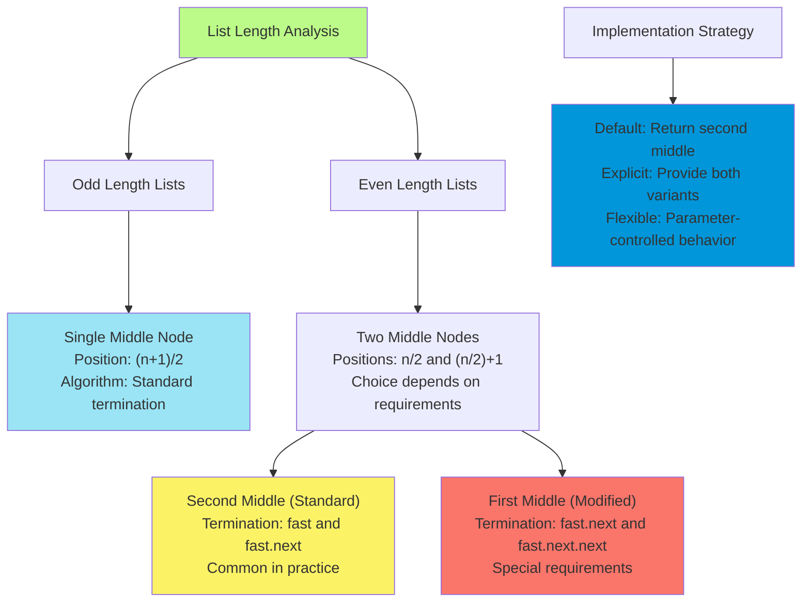
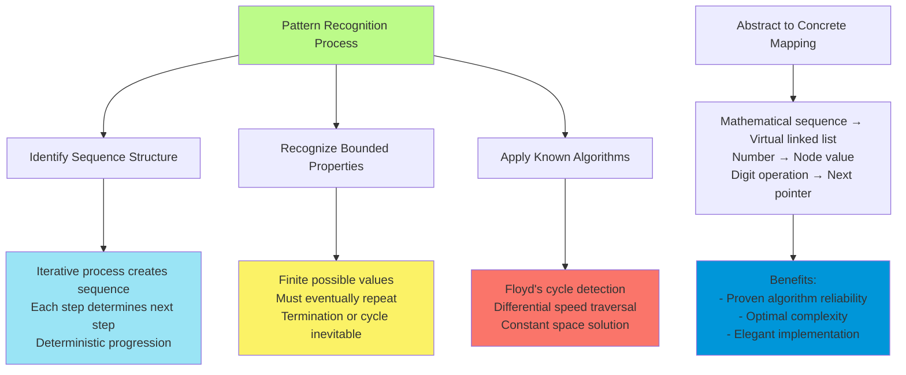

# C-4: Fast and Slow Pointers - Differential Speed Traversal Algorithms

1. Theoretical Foundations of Fast and Slow Pointer Techniques
    - Differential Speed Traversal Principles
    - Mathematical Properties of Pointer Speed Ratios
    - Race Track Analogy and Convergence Theory
    - Applications Beyond Traditional Data Structures
2. Cycle Detection in Sequential Structures
    - Floyd's Cycle Detection Algorithm
    - Perfect Cycles vs Delayed Cycles Analysis
    - Convergence Proof and Distance Gap Theory
    - Hash Set vs Constant Space Approaches
3. Fractional Point Identification in Linear Structures
    - Linked List Midpoint Detection
    - Even vs Odd Length Handling Strategies
    - Single-Pass vs Multi-Pass Algorithm Comparison
    - Generalization to Other Fractional Points
4. Abstract Sequence Analysis and Cycle Detection
    - Happy Number Problem and Sequence Modeling
    - Mathematical Sequence to Linked List Reduction
    - Digit Manipulation and Next Element Generation
    - Pattern Recognition in Non-Physical Data Structures

#### Theoretical Foundations of Fast and Slow Pointer Techniques

##### Differential Speed Traversal Principles

The fast and slow pointer technique represents one of the most elegant applications of relative motion principles to
algorithm design. This approach fundamentally transforms how we think about traversing sequential data structures by
introducing the concept of differential speed navigation, where two pointers move at different rates through the same
structure.

Understanding the theoretical foundation requires us to consider the mathematical relationship between distance, speed,
and time. When two entities move at different speeds through the same path, their relative positions change predictably
over time. This predictable relationship becomes the cornerstone of powerful algorithmic techniques that can solve
complex problems with remarkable efficiency.

The beauty of differential speed traversal lies in its ability to gather information about global structure properties
through local operations. By maintaining two pointers moving at different speeds, we can detect patterns, identify
special positions, and discover structural properties that would otherwise require multiple passes or additional memory.

Consider the fundamental equation governing differential speed traversal: if a slow pointer moves at speed $v_s$ and a
fast pointer moves at speed $v_f$, then after time $t$, the distance between them is $(v_f - v_s) \times t$. This
relationship forms the mathematical foundation for understanding when and why the pointers will meet in cyclic
structures.

```python
def demonstrate_differential_speed_concept():
    """
    Conceptual demonstration of how differential speeds create predictable
    relative positioning between pointers.

    This serves as the theoretical foundation for understanding more complex
    applications like cycle detection and midpoint finding.
    """
    # In each iteration, the gap between pointers changes predictably
    slow_position = 0  # Moves 1 step per iteration
    fast_position = 0  # Moves 2 steps per iteration

    print("Iteration | Slow Position | Fast Position | Gap")
    print("----------|---------------|---------------|----")

    for iteration in range(5):
        print(f"    {iteration}     |       {slow_position}       |       {fast_position}       |  {fast_position - slow_position}")

        # Update positions with differential speeds
        slow_position += 1  # Slow pointer moves 1 step
        fast_position += 2  # Fast pointer moves 2 steps
```

The power of this technique becomes apparent when we realize that the relative speed difference allows us to detect
structural properties that would be impossible to identify with uniform-speed traversal. The faster pointer effectively
"scouts ahead" while the slower pointer provides a stable reference point, creating a dynamic relationship that reveals
hidden patterns in the data structure.

##### Mathematical Properties of Pointer Speed Ratios

The mathematical analysis of fast and slow pointer algorithms reveals fascinating properties that govern their behavior
across different scenarios. The choice of speed ratio fundamentally determines the algorithm's characteristics and the
types of problems it can solve effectively.

The most common speed ratio used in practice is 2:1, where the fast pointer moves twice as fast as the slow pointer.
This ratio provides optimal balance between convergence speed and algorithmic simplicity. However, understanding why
this ratio works requires examining the underlying mathematical principles.

In a cyclic structure of length $n$, when both pointers enter the cycle, the fast pointer gains exactly one position on
the slow pointer with each iteration. This creates a predictable convergence pattern where the maximum number of steps
required for the pointers to meet is $n$, regardless of their starting positions within the cycle.

Let me walk you through the mathematical proof of convergence. Suppose the slow pointer is at position $s$ and the fast
pointer is at position $f$ within a cycle of length $n$. After $k$ iterations, the slow pointer will be at position
$(s + k) \bmod n$ and the fast pointer will be at position $(f + 2k) \bmod n$. They meet when
$(s + k) \equiv (f + 2k) \pmod{n}$, which simplifies to $k \equiv (f - s) \pmod{n}$. Since $0 \leq |f - s| < n$,
convergence is guaranteed within $n$ steps.



The generalization to other speed ratios reveals interesting trade-offs. A 3:1 ratio would achieve faster convergence
but at the cost of increased algorithmic complexity. The mathematical analysis shows that for a speed ratio of $r:1$,
the gap closes by $(r-1)$ positions per iteration, leading to convergence within $\lceil n/(r-1) \rceil$ steps.

Understanding these mathematical properties helps us make informed decisions about which speed ratio to use for specific
problems and provides insight into the theoretical limits of what these algorithms can achieve.

##### Race Track Analogy and Convergence Theory

The race track analogy provides an intuitive framework for understanding the behavior of fast and slow pointer
algorithms. Imagine two runners on a circular track where one runner moves twice as fast as the other. The fundamental
question becomes: under what conditions will the faster runner catch up to the slower one?

This analogy helps us visualize several key concepts. First, in a non-circular track (equivalent to a linear data
structure without cycles), the faster runner will simply reach the end first without ever catching up to the slower
runner. Second, in a circular track (equivalent to a cyclic data structure), the faster runner will eventually lap the
slower runner, creating a meeting point.

The convergence theory extends this analogy to provide mathematical guarantees about when and where the pointers will
meet. The key insight is that the relative speed difference creates a predictable pattern of gap reduction that leads to
inevitable convergence in cyclic structures.

Let's think about this step by step. When both pointers are in a cycle, we can model their positions as functions of
time. If the slow pointer's position is $P_s(t) = (s_0 + t) \bmod n$ and the fast pointer's position is
$P_f(t) = (f_0 + 2t) \bmod n$, then convergence occurs when $P_s(t) = P_f(t)$.

The beauty of this mathematical framework is that it provides both existence guarantees (convergence will occur) and
bounds on performance (it will occur within $n$ steps). This combination of theoretical rigor and practical efficiency
makes fast and slow pointer algorithms particularly valuable for solving complex problems.

##### Applications Beyond Traditional Data Structures

While fast and slow pointer techniques are most commonly associated with linked lists, their applications extend far
beyond traditional data structures. The fundamental principle of differential speed traversal can be applied to any
sequential process where we need to detect patterns or identify special positions.

Consider sequence analysis problems where we're examining mathematical progressions or iterative processes. The happy
number problem, which we'll explore in detail later, demonstrates how abstract mathematical sequences can be treated as
virtual linked lists, allowing us to apply fast and slow pointer techniques to detect cycles in purely mathematical
contexts.

The technique also finds applications in stream processing, where we need to identify patterns in continuous data
streams without storing the entire stream in memory. By maintaining pointers at different positions in the stream, we
can detect repeating patterns or identify special events efficiently.

Think about how this principle might apply to areas like signal processing, where we're looking for periodic patterns in
continuous signals, or in computational biology, where we're analyzing DNA sequences for repeating motifs. The
underlying mathematical principles remain the same, even though the surface-level applications appear quite different.

#### Cycle Detection in Sequential Structures

##### Floyd's Cycle Detection Algorithm

Floyd's Cycle Detection Algorithm, often called the "tortoise and hare" algorithm, represents one of the most elegant
solutions to the cycle detection problem. This algorithm demonstrates how sophisticated mathematical insights can lead
to remarkably simple and efficient implementations.

The fundamental challenge in cycle detection lies in identifying when a traversal process enters a repetitive loop
without using additional memory to track visited elements. Floyd's algorithm solves this by introducing two pointers
that move at different speeds, leveraging the mathematical properties of modular arithmetic to guarantee convergence.

Let's understand the algorithm's operation through careful analysis. When no cycle exists, the fast pointer will
eventually reach the end of the structure, providing a clear termination condition. When a cycle exists, both pointers
will eventually enter the cycle, at which point the mathematical properties of differential speed movement guarantee
that they will meet.

The genius of Floyd's algorithm lies in its simplicity and the mathematical elegance of its convergence proof. The
algorithm requires only two pointers and simple iteration logic, yet it provides a complete solution to the cycle
detection problem with optimal space complexity.

```python
def floyd_cycle_detection(head: ListNode) -> bool:
    """
    Floyd's Cycle Detection Algorithm implementation.

    This algorithm uses two pointers moving at different speeds to detect
    cycles in linked lists. The mathematical foundation ensures that if a
    cycle exists, the pointers will meet within the cycle.

    The beauty lies in its simplicity: we only need to check if the fast
    and slow pointers ever point to the same node.
    """
    # Handle edge case: empty list cannot have cycles
    if not head:
        return False

    # Initialize both pointers at the head
    slow = head
    fast = head

    # Continue until fast pointer reaches end or pointers meet
    while fast and fast.next:
        # Move slow pointer one step
        slow = slow.next

        # Move fast pointer two steps
        fast = fast.next.next

        # Check for convergence - indicates cycle detection
        if slow == fast:
            return True

    # Fast pointer reached end - no cycle exists
    return False
```

The algorithm's correctness stems from the mathematical principle that in any cycle, the faster pointer will eventually
catch up to the slower pointer. This is guaranteed by the fact that the relative speed difference of 1 step per
iteration will eventually close any gap between the pointers within the cycle.

**Java Implementation:**

```java
public class FloydCycleDetection {
    /**
     * Detects cycles in linked lists using Floyd's algorithm.
     *
     * The algorithm's elegance lies in its mathematical foundation:
     * in any cycle, differential speed movement guarantees convergence.
     */
    public static boolean hasCycle(ListNode head) {
        if (head == null) {
            return false;
        }

        ListNode slow = head;
        ListNode fast = head;

        // Continue until fast reaches end or pointers meet
        while (fast != null && fast.next != null) {
            slow = slow.next;      // Move slow pointer one step
            fast = fast.next.next; // Move fast pointer two steps

            // Convergence indicates cycle presence
            if (slow == fast) {
                return true;
            }
        }

        return false; // No cycle detected
    }
}
```

**C++ Implementation:**

```cpp
class FloydCycleDetection {
public:
    /**
     * C++ implementation of Floyd's cycle detection algorithm.
     *
     * Demonstrates the algorithm's efficiency and simplicity
     * in low-level pointer manipulation contexts.
     */
    static bool hasCycle(ListNode* head) {
        if (head == nullptr) {
            return false;
        }

        ListNode* slow = head;
        ListNode* fast = head;

        while (fast != nullptr && fast->next != nullptr) {
            slow = slow->next;
            fast = fast->next->next;

            if (slow == fast) {
                return true;
            }
        }

        return false;
    }
};
```

##### Perfect Cycles vs Delayed Cycles Analysis

Understanding the behavior of Floyd's algorithm across different cycle configurations provides deeper insight into its
robustness and reliability. The algorithm handles both perfect cycles (where the entire structure is cyclic) and delayed
cycles (where a linear portion precedes the cyclic portion) with equal effectiveness.

In perfect cycles, both pointers immediately enter the cycle and begin the convergence process. The mathematical
analysis is straightforward: the pointers will meet within at most $n$ steps, where $n$ is the cycle length.

Delayed cycles present a more interesting case. Here, the pointers traverse a linear portion before entering the cycle
at potentially different times. The key insight is that once both pointers are within the cycle, the same mathematical
principles apply, guaranteeing convergence regardless of when each pointer entered the cycle.

Let's analyze this mathematically. Suppose we have a structure with a linear portion of length $L$ followed by a cycle
of length $C$. The slow pointer enters the cycle after $L$ steps, while the fast pointer enters after
$\lceil L/2 \rceil$ steps. Despite this difference in entry timing, convergence within the cycle is still guaranteed
within $C$ steps after both pointers have entered.



The robustness of Floyd's algorithm across different cycle configurations demonstrates the power of choosing the right
mathematical abstraction. By focusing on the relative speed difference rather than absolute positions, the algorithm
naturally handles various structural configurations without requiring special case logic.

##### Convergence Proof and Distance Gap Theory

The mathematical proof of convergence in Floyd's algorithm provides a beautiful example of how rigorous analysis can
guarantee algorithmic correctness. Let's work through this proof step by step to understand why the algorithm always
works when cycles are present.

Consider two pointers in a cycle of length $n$. Let's denote their positions as $s$ (slow) and $f$ (fast). After $k$
iterations, the slow pointer will be at position $(s + k) \bmod n$ and the fast pointer will be at position
$(f + 2k) \bmod n$.

The pointers meet when their positions are equal: $(s + k) \equiv (f + 2k) \pmod{n}$. Rearranging this equation, we get
$k \equiv (f - s) \pmod{n}$. Since the initial gap $(f - s)$ is less than $n$, there exists a unique solution $k$ in the
range $[0, n-1]$.

This mathematical analysis provides both an existence proof (the pointers will meet) and a performance bound (they will
meet within $n$ steps). The beauty of this proof lies in its simplicity and the insight it provides into the algorithm's
behavior.

The distance gap theory extends this analysis to understand how the gap between pointers changes over time. In each
iteration, the fast pointer gains exactly one position on the slow pointer. This means that if the initial gap is $g$,
the pointers will meet after exactly $(n - g)$ iterations.

Understanding this theory helps us analyze the algorithm's performance characteristics and provides insight into
potential optimizations for specific scenarios.

##### Hash Set vs Constant Space Approaches

The comparison between hash set-based cycle detection and Floyd's algorithm illustrates a fundamental trade-off in
algorithm design between space and conceptual complexity. Both approaches solve the same problem but represent different
points in the space-time efficiency spectrum.

The hash set approach offers conceptual simplicity: traverse the structure while keeping track of visited nodes, and
declare a cycle when we encounter a previously visited node. This approach requires $O(n)$ additional space but provides
straightforward logic that's easy to understand and implement.

```python
def cycle_detection_hash_set(head: ListNode) -> bool:
    """
    Hash set approach to cycle detection.

    This method trades space efficiency for conceptual simplicity.
    While it requires O(n) additional memory, the logic is
    straightforward and easy to understand.
    """
    if not head:
        return False

    visited_nodes = set()
    current = head

    while current:
        # Check if we've seen this node before
        if current in visited_nodes:
            return True  # Cycle detected

        # Mark current node as visited
        visited_nodes.add(current)
        current = current.next

    return False  # No cycle found
```

Floyd's algorithm, while more complex to derive and understand, achieves the same result with $O(1)$ space complexity.
The algorithm's sophistication lies in its mathematical foundation rather than its implementation complexity.

The choice between these approaches often depends on the specific constraints and requirements of the problem context.
In memory-constrained environments, Floyd's algorithm is clearly superior. In contexts where code clarity and
maintainability are prioritized, the hash set approach might be preferred.

For interview purposes, demonstrating both approaches shows algorithmic versatility and understanding of trade-offs. The
recommended strategy is often to start with the hash set approach to establish correctness, then optimize to Floyd's
algorithm to demonstrate space efficiency awareness.

#### Fractional Point Identification in Linear Structures

##### Linked List Midpoint Detection

Finding the midpoint of a linked list represents one of the most elegant applications of the fast and slow pointer
technique. This problem beautifully demonstrates how differential speed traversal can solve positional problems without
requiring multiple passes or additional memory.

The mathematical insight underlying midpoint detection involves recognizing that when one pointer moves twice as fast as
another, the slower pointer will be at the midpoint when the faster pointer reaches the end. This relationship holds
because the slow pointer covers exactly half the distance of the fast pointer in the same time period.

Let's think about this mathematically. If the list has length $n$, then when the fast pointer has moved $n$ steps
(reaching the end), the slow pointer will have moved $n/2$ steps, placing it at the midpoint. This beautiful
relationship allows us to find the midpoint in a single pass with constant space complexity.

The implementation requires careful consideration of edge cases, particularly the distinction between odd and even
length lists. For odd-length lists, there's a unique middle node. For even-length lists, there are two middle nodes, and
the problem typically specifies which one to return.

```python
def find_midpoint(head: ListNode) -> ListNode:
    """
    Find the midpoint of a linked list using fast and slow pointers.

    This algorithm demonstrates the elegance of differential speed traversal
    for positional problems. By moving the fast pointer twice as fast as
    the slow pointer, we ensure the slow pointer reaches the midpoint
    exactly when the fast pointer reaches the end.

    For even-length lists, this returns the second middle node.
    """
    # Handle edge case: empty list
    if not head:
        return None

    slow = head
    fast = head

    # Continue until fast pointer reaches end
    while fast and fast.next:
        slow = slow.next      # Move slow pointer one step
        fast = fast.next.next # Move fast pointer two steps

    # When fast reaches end, slow is at midpoint
    return slow
```

The termination condition `fast and fast.next` deserves special attention. This condition ensures we stop at the right
moment for both odd and even length lists. For odd-length lists, we stop when `fast.next` is None. For even-length
lists, we stop when `fast` becomes None.

**Java Implementation:**

```java
public class LinkedListMidpoint {
    /**
     * Finds the midpoint of a linked list using differential speed traversal.
     *
     * The algorithm's mathematical foundation ensures that when the fast
     * pointer reaches the end, the slow pointer is positioned at the midpoint.
     */
    public static ListNode findMidpoint(ListNode head) {
        if (head == null) {
            return null;
        }

        ListNode slow = head;
        ListNode fast = head;

        // Traverse until fast pointer reaches end
        while (fast != null && fast.next != null) {
            slow = slow.next;      // Slow pointer moves one step
            fast = fast.next.next; // Fast pointer moves two steps
        }

        return slow; // Slow pointer is now at midpoint
    }

    /**
     * Variant that returns the first middle node for even-length lists.
     *
     * This demonstrates how slight modifications can change the algorithm's
     * behavior for specific requirements.
     */
    public static ListNode findFirstMiddle(ListNode head) {
        if (head == null) {
            return null;
        }

        ListNode slow = head;
        ListNode fast = head;

        // Modified termination condition
        while (fast.next != null && fast.next.next != null) {
            slow = slow.next;
            fast = fast.next.next;
        }

        return slow;
    }
}
```

**C++ Implementation:**

```cpp
class LinkedListMidpoint {
public:
    /**
     * C++ implementation of midpoint detection.
     *
     * Demonstrates the algorithm's efficiency in low-level contexts
     * while maintaining the mathematical elegance of the approach.
     */
    static ListNode* findMidpoint(ListNode* head) {
        if (head == nullptr) {
            return nullptr;
        }

        ListNode* slow = head;
        ListNode* fast = head;

        while (fast != nullptr && fast->next != nullptr) {
            slow = slow->next;
            fast = fast->next->next;
        }

        return slow;
    }
};
```

##### Even vs Odd Length Handling Strategies

The distinction between even and odd length lists in midpoint detection reveals important considerations in algorithm
design. Understanding how to handle both cases correctly requires careful analysis of the termination conditions and
their implications.

For odd-length lists, the midpoint is unambiguous - there's exactly one middle node. The algorithm naturally handles
this case because when the fast pointer reaches the end, the slow pointer will be positioned at the unique middle node.

Even-length lists present a more interesting challenge because there are two nodes that could be considered "middle"
nodes. The problem specification typically determines which one to return, but understanding how to achieve either
behavior requires modifying the termination condition appropriately.

Let's analyze the mathematics behind these different behaviors. For a list of length $n$:

- If $n$ is odd, the middle node is at position $\lceil n/2 \rceil = (n+1)/2$
- If $n$ is even, the two middle nodes are at positions $n/2$ and $(n/2) + 1$

The standard implementation returns the second middle node for even-length lists. To return the first middle node, we
need to modify the termination condition to `fast.next and fast.next.next`, which causes the algorithm to stop one
iteration earlier.



Understanding these nuances helps in interview situations where the requirements might not be explicitly stated,
requiring you to clarify the expected behavior for even-length lists.

##### Single-Pass vs Multi-Pass Algorithm Comparison

The fast and slow pointer approach to midpoint detection represents a significant improvement over naive multi-pass
algorithms. Comparing these approaches reveals important insights about algorithm optimization and the power of
mathematical insights in algorithm design.

The naive approach involves first traversing the list to determine its length, then traversing again to reach the
midpoint. While this approach is conceptually straightforward, it requires two complete traversals and additional logic
to handle the positioning correctly.

```python
def find_midpoint_naive(head: ListNode) -> ListNode:
    """
    Naive approach using two passes to find the midpoint.

    This approach is conceptually simple but inefficient, requiring
    two complete traversals of the list and additional logic to
    handle positioning.
    """
    if not head:
        return None

    # First pass: count nodes
    length = 0
    current = head
    while current:
        length += 1
        current = current.next

    # Second pass: find midpoint
    midpoint_position = length // 2
    current = head
    for _ in range(midpoint_position):
        current = current.next

    return current
```

The fast and slow pointer approach achieves the same result in a single pass with more elegant logic. The mathematical
insight that differential speed traversal can solve positional problems transforms what seems like a complex problem
into a simple and efficient solution.

From a complexity analysis perspective, both approaches have $O(n)$ time complexity and $O(1)$ space complexity.
However, the fast and slow pointer approach has better constant factors (single vs double traversal) and demonstrates
more sophisticated algorithmic thinking.

The single-pass approach also tends to be more cache-friendly in practice, as it maintains better spatial locality by
accessing each node only once in sequential order.

##### Generalization to Other Fractional Points

The midpoint detection algorithm can be generalized to find other fractional points in linked lists, demonstrating the
broader applicability of differential speed traversal techniques. Understanding this generalization provides insight
into how mathematical principles can be extended to solve related problems.

To find the point at fraction $k/n$ of the list, we can use pointers with speed ratio $k:(n-k)$. For example, to find
the point at 1/3 of the list, we could use pointers with speeds 1 and 2, where the slower pointer moves 1 step and the
faster pointer moves 3 steps in each iteration.

The mathematical analysis follows the same principles: when the faster pointer reaches the end, the slower pointer will
be positioned at the desired fractional point. This generalization demonstrates how the core mathematical insight can be
adapted to solve a broader class of problems.

Consider applications where we might need to find quarter points, third points, or other fractional positions. The same
differential speed principle applies, though the specific speed ratios and termination conditions need to be adjusted
accordingly.

This generalization also applies to problems involving multiple fractional points simultaneously. By maintaining
multiple pointers with different speed ratios, we can identify several fractional positions in a single pass.

#### Abstract Sequence Analysis and Cycle Detection

##### Happy Number Problem and Sequence Modeling

The happy number problem presents a fascinating example of how mathematical sequences can be modeled as virtual linked
lists, enabling the application of pointer-based algorithms to purely abstract problems. This transformation
demonstrates the power of recognizing underlying structural patterns that transcend the specific problem domain.

Understanding the happy number problem requires grasping the iterative process that defines it. Starting with any
positive integer, we repeatedly sum the squares of its digits. A number is happy if this process eventually reaches 1;
otherwise, it enters a cycle and never reaches 1.

The key insight is that this iterative process creates a sequence of numbers that behaves exactly like a linked list,
where each number points to the next number in the sequence. This recognition allows us to apply Floyd's cycle detection
algorithm to determine whether the sequence reaches 1 or enters a cycle.

Let's think about why this sequence must either reach 1 or enter a cycle. Since we're dealing with finite sequences of
digit squares, and the sum of squares of digits is bounded, the sequence must eventually repeat. The mathematical
analysis shows that the sequence either terminates at 1 or enters a cycle, making cycle detection the perfect approach
for solving this problem.

```python
def is_happy_number(n: int) -> bool:
    """
    Determine if a number is happy using Floyd's cycle detection algorithm.

    This problem demonstrates how abstract mathematical sequences can be
    modeled as virtual linked lists, enabling the use of pointer-based
    algorithms for purely mathematical problems.

    The key insight is that the sequence of digit-square sums behaves
    exactly like a linked list, where each number 'points to' the next
    number in the sequence.
    """
    def get_next_number(num: int) -> int:
        """
        Calculate the next number in the happy number sequence.

        This function serves as our 'next pointer' in the virtual
        linked list, transforming the current number into the next
        number by summing the squares of its digits.
        """
        total = 0
        while num > 0:
            digit = num % 10    # Extract the last digit
            total += digit ** 2 # Add square of digit to total
            num //= 10          # Remove the last digit
        return total

    # Apply Floyd's cycle detection algorithm
    slow = n
    fast = n

    # Continue until we find a cycle or reach 1
    while True:
        slow = get_next_number(slow)                    # Move slow pointer one step
        fast = get_next_number(get_next_number(fast))   # Move fast pointer two steps

        # If fast pointer reaches 1, number is happy
        if fast == 1:
            return True

        # If pointers meet, we've detected a cycle (unhappy number)
        if slow == fast:
            return False
```

The elegance of this solution lies in its recognition that the abstract mathematical process can be treated as a
concrete data structure traversal problem. This type of insight - recognizing familiar patterns in unfamiliar contexts -
represents a crucial skill in algorithm design.

**Java Implementation:**

```java
public class HappyNumber {
    /**
     * Determines if a number is happy using cycle detection.
     *
     * This implementation demonstrates how mathematical sequences
     * can be modeled as virtual data structures, enabling the
     * application of structural algorithms to abstract problems.
     */
    public static boolean isHappy(int n) {
        int slow = n;
        int fast = n;

        do {
            slow = getNextNumber(slow);
            fast = getNextNumber(getNextNumber(fast));

            if (fast == 1) {
                return true;
            }
        } while (slow != fast);

        return false;
    }

    /**
     * Calculates the next number in the happy number sequence.
     *
     * This method serves as the 'next pointer' function for our
     * virtual linked list representation of the number sequence.
     */
    private static int getNextNumber(int num) {
        int total = 0;
        while (num > 0) {
            int digit = num % 10;
            total += digit * digit;
            num /= 10;
        }
        return total;
    }
}
```

**C++ Implementation:**

```cpp
class HappyNumber {
public:
    /**
     * C++ implementation of happy number detection.
     *
     * Demonstrates the universality of the cycle detection approach
     * across different programming languages and paradigms.
     */
    static bool isHappy(int n) {
        int slow = n;
        int fast = n;

        do {
            slow = getNextNumber(slow);
            fast = getNextNumber(getNextNumber(fast));

            if (fast == 1) {
                return true;
            }
        } while (slow != fast);

        return false;
    }

private:
    static int getNextNumber(int num) {
        int total = 0;
        while (num > 0) {
            int digit = num % 10;
            total += digit * digit;
            num /= 10;
        }
        return total;
    }
};
```

##### Mathematical Sequence to Linked List Reduction

The transformation of mathematical sequences into virtual linked lists represents a powerful abstraction technique that
enables the application of well-understood algorithms to novel problem domains. This reduction demonstrates how
recognizing structural similarities can lead to elegant solutions.

The key to successful reduction lies in identifying the essential properties that define a linked list and recognizing
these properties in the mathematical sequence. A linked list requires nodes with values and pointers to next nodes. In
the happy number sequence, each number serves as a node value, and the digit-square-sum operation serves as the pointer
to the next node.

This abstraction works because the mathematical sequence satisfies the fundamental properties required for cycle
detection algorithms:

1. Deterministic progression: each number uniquely determines the next number
2. Finite state space: the sequence must eventually repeat due to bounded digit sums
3. Reachable termination: the sequence either reaches 1 or enters a cycle

Understanding this reduction technique enables us to recognize similar patterns in other mathematical or computational
problems where iterative processes might benefit from cycle detection analysis.

The mathematical analysis of why this reduction works provides insight into the broader applicability of the technique.
Any deterministic sequence with bounded values will eventually enter a cycle, making cycle detection algorithms broadly
applicable to sequence analysis problem.

Consider other examples where this reduction might apply: iterative mathematical functions, hash function sequences in
cryptography, or state transitions in finite automata. The underlying principle remains the same: if we can define a
"next" operation and the sequence has bounded values, we can apply cycle detection algorithms.

##### Digit Manipulation and Next Element Generation

The digit manipulation techniques used in the happy number problem represent fundamental operations in computational
mathematics. Understanding these operations and their efficiency characteristics provides insight into how mathematical
algorithms can be optimized for performance.

The process of extracting digits from a number and computing their squares involves two key operations: the modulo
operation for digit extraction and integer division for digit removal. These operations, while conceptually simple,
require careful implementation to ensure both correctness and efficiency.

```python
def get_next_number_detailed(num: int) -> int:
    """
    Detailed implementation of digit manipulation for happy number sequence.

    This function demonstrates the mathematical operations involved in
    transforming a number into its digit-square sum, serving as the
    'next pointer' operation in our virtual linked list.
    """
    total = 0
    original_num = num  # Preserve for debugging/logging

    # Process each digit from right to left
    while num > 0:
        # Extract the rightmost digit using modulo operation
        digit = num % 10

        # Add the square of this digit to our running total
        total += digit * digit

        # Remove the rightmost digit using integer division
        num //= 10

    return total

def analyze_digit_processing(num: int) -> None:
    """
    Analytical function to demonstrate the digit processing steps.

    This helps visualize how the mathematical transformation works
    and provides insight into the algorithm's behavior.
    """
    print(f"Processing number: {num}")
    total = 0
    position = 0

    while num > 0:
        digit = num % 10
        square = digit * digit
        total += square
        print(f"Position {position}: digit={digit}, square={square}, running_total={total}")

        num //= 10
        position += 1

    print(f"Final result: {total}")
    return total
```

The time complexity of digit manipulation is $O(\log n)$ where $n$ is the input number, since the number of digits in a
number is logarithmic in its value. This efficiency is crucial for the overall performance of the happy number
algorithm.

Understanding these digit manipulation techniques is important because they appear in many mathematical algorithms, from
digit sum calculations to number theory problems. The ability to efficiently extract and process digits forms the
foundation for many computational approaches to mathematical problems.

**Mathematical Properties of Digit Operations:** The digit-square-sum operation has interesting mathematical properties
that affect the behavior of the happy number sequence:

1. **Monotonicity**: The operation tends to reduce large numbers, as the sum of digit squares is generally smaller than
   the original number for multi-digit numbers.
2. **Bounded Output**: For any $d$-digit number, the maximum possible output is $d \times 81$ (when all digits are 9).
3. **Convergence**: These properties ensure that the sequence will eventually enter a small cycle or reach 1.

##### Pattern Recognition in Non-Physical Data Structures

The happy number problem exemplifies how pattern recognition techniques can be applied to abstract mathematical
sequences that don't correspond to physical data structures. This application demonstrates the power of algorithmic
thinking in recognizing structural similarities across different problem domains.

The key insight is that many mathematical and computational processes exhibit structural properties similar to
well-understood data structures. By recognizing these similarities, we can apply proven algorithms to solve problems
that might otherwise seem unrelated.

In the case of happy numbers, the pattern recognition involves several steps:

1. Recognizing that the iterative process creates a sequence
2. Understanding that sequences with bounded values must eventually cycle
3. Realizing that cycle detection algorithms can identify whether the sequence reaches a termination condition

This type of pattern recognition skill is crucial for algorithm design and problem-solving in computer science. It
enables us to build upon existing knowledge and techniques rather than starting from scratch for each new problem.



The broader implications of this pattern recognition approach extend to many areas of computer science and mathematics.
Consider how similar techniques might apply to:

- **Cryptographic sequences**: Analyzing the behavior of hash functions or encryption algorithms
- **Dynamical systems**: Understanding the long-term behavior of iterative mathematical systems
- **Computational processes**: Detecting infinite loops or convergence in iterative algorithms
- **Game theory**: Analyzing strategy cycles in competitive scenarios

The fundamental skill being developed here is the ability to recognize when a problem can be transformed into a
well-understood form, enabling the application of existing algorithmic solutions. This represents a crucial aspect of
algorithmic thinking and problem-solving expertise.

**Advanced Applications:** The pattern recognition techniques demonstrated in the happy number problem can be extended
to more complex scenarios:

1. **Multi-variable sequences**: Where each step depends on multiple previous values
2. **Probabilistic sequences**: Where the next step involves randomness but still exhibits cyclic behavior
3. **Conditional sequences**: Where the next step depends on complex logical conditions

Understanding these extensions helps develop more sophisticated pattern recognition skills and enables the application
of cycle detection techniques to increasingly complex problems.

The happy number problem thus serves as more than just an interesting mathematical puzzle - it provides a concrete
example of how abstract thinking and pattern recognition can lead to elegant algorithmic solutions. This type of
problem-solving approach is fundamental to advanced algorithm design and represents a crucial skill for tackling novel
computational challenges.

**Complexity Considerations:** The overall complexity of the happy number algorithm deserves special attention:

- **Time Complexity**: While the analysis is complex, the algorithm runs in $O(\log n)$ time, where $n$ is the input
  number
- **Space Complexity**: $O(1)$ constant space, achieved through the cycle detection approach
- **Practical Performance**: The algorithm typically converges very quickly due to the mathematical properties of
  digit-square sums

This combination of theoretical efficiency and practical performance makes the fast and slow pointer approach to the
happy number problem an excellent example of how sophisticated mathematical insights can lead to both elegant and
efficient algorithmic solutions.

The comprehensive treatment of fast and slow pointer techniques presented here demonstrates their fundamental importance
in algorithm design, from basic cycle detection to sophisticated pattern recognition in abstract mathematical sequences.
The mathematical foundations, implementation strategies, and complexity analyses provide a thorough understanding of
when and how to apply these powerful techniques in diverse computational contexts.
