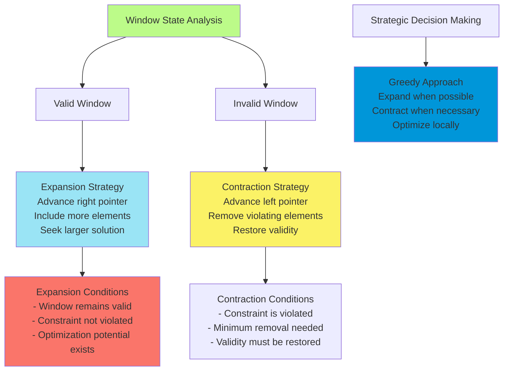
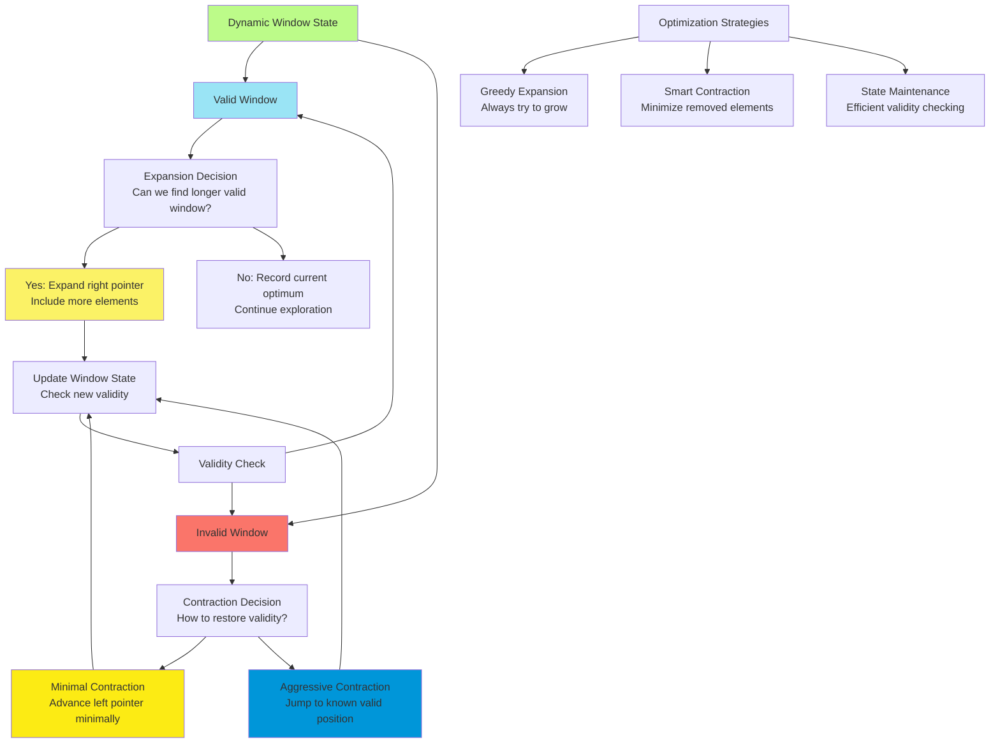
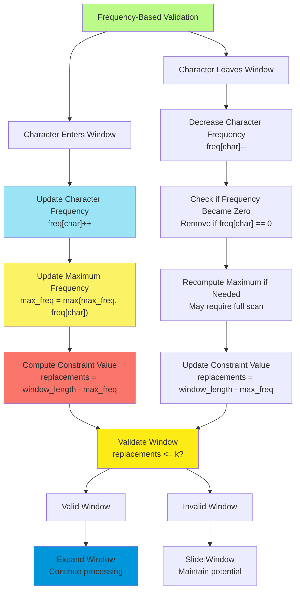

# C-5: Sliding Windows - Dynamic Subarray Analysis Techniques

1. Theoretical Foundations of Sliding Window Algorithms
    - Fixed vs Dynamic Window Strategies
    - Window Expansion and Contraction Mechanics
    - Optimal Subarray Detection Principles
    - Time Complexity Optimization Through Window Techniques
2. Fixed Window Pattern Applications
    - Substring Anagram Detection
    - Character Frequency Analysis Methods
    - Fixed-Length Pattern Matching
    - Array-Based Character Indexing Techniques
3. Dynamic Window Optimization Problems
    - Longest Unique Character Substring
    - Window Validity and Expansion Strategies
    - Hash Set vs Hash Map Optimization Approaches
    - Optimal Pointer Advancement Techniques
4. Advanced Dynamic Window with Constraints
    - Longest Uniform Substring After Replacements
    - Character Replacement Strategy Analysis
    - Frequency-Based Window Validation
    - Sliding vs Shrinking Window Decision Logic

#### Theoretical Foundations of Sliding Window Algorithms

##### Fixed vs Dynamic Window Strategies

Understanding the fundamental distinction between fixed and dynamic sliding window strategies requires us to examine how
these approaches address different classes of optimization problems. This distinction forms the cornerstone of choosing
the appropriate technique for various computational challenges involving sequential data analysis.

Fixed sliding windows maintain a constant size throughout their traversal of a data structure. Think of this approach as
using a viewing frame of predetermined dimensions that slides across your data, ensuring you examine every possible
subsequence of that exact length. The mathematical beauty of this approach lies in its guarantee: for any data structure
of length $n$ and window size $k$, exactly $(n - k + 1)$ distinct windows will be examined, providing complete coverage
of all possible subsequences of the target length.

The power of fixed windows becomes apparent when we consider problems that ask for specific-length patterns or when the
optimal solution requires examining all subsequences of a predetermined size. Consider how this applies to anagram
detection - since anagrams must have identical lengths, we know exactly what window size to use, making fixed windows
the natural choice.

Dynamic sliding windows, in contrast, represent a more sophisticated approach where the window size adapts based on the
current state of the data being examined. These windows can expand when conditions are favorable and contract when
constraints are violated. This adaptability makes dynamic windows particularly powerful for optimization problems
seeking the "longest" or "shortest" subsequence that satisfies certain conditions.

Let me walk you through the mathematical foundation that makes dynamic windows so effective. When we're searching for
the longest valid subsequence, we can prove that any time we find a valid window of length $\ell$, we don't need to
consider any shorter windows in our search for the optimal solution. This insight leads to the key strategy: expand the
window when it's valid, and only adjust when it becomes invalid.

```python
def demonstrate_window_strategies():
    """
    Educational demonstration showing the fundamental difference
    between fixed and dynamic sliding window approaches.

    This helps visualize how each strategy explores the solution space
    and why we choose one approach over another for different problems.
    """
    text = "abcdefgh"

    print("Fixed Window Strategy (window size = 3):")
    print("Examines every possible 3-character substring:")
    for i in range(len(text) - 3 + 1):
        window = text[i:i+3]
        print(f"Position {i}: '{window}'")

    print("\nDynamic Window Strategy:")
    print("Window size adapts based on conditions:")
    left = 0
    for right in range(len(text)):
        # Example condition: expand until we see duplicate character
        current_window = text[left:right+1]
        print(f"Window [{left}:{right+1}]: '{current_window}' (size: {right-left+1})")

        # Simulate condition-based adjustment
        if len(set(current_window)) < len(current_window):  # Has duplicates
            left += 1  # Shrink window
            print(f"  → Shrinking due to duplicates, new left: {left}")
```

The choice between these strategies fundamentally depends on the nature of your optimization objective. Fixed windows
excel when you know the exact size of what you're looking for, while dynamic windows shine when you're optimizing for
size itself subject to constraints.

##### Window Expansion and Contraction Mechanics

The mechanics of how sliding windows expand and contract reveal the algorithmic elegance that makes these techniques so
powerful for optimization problems. Understanding these mechanics at a deep level enables you to recognize when and how
to apply sliding window techniques to novel problems.

Window expansion occurs when we advance the right pointer to include more elements in our current consideration set.
This expansion strategy reflects an optimistic approach - we're hoping to find a larger valid solution by including
additional elements. The mathematical insight here is that expansion can only improve our solution if the new element
maintains the validity of our window.

Window contraction happens when we advance the left pointer, effectively removing elements from consideration. This
typically occurs when our current window violates some constraint, and we need to restore validity by removing
problematic elements. The key insight is that we should contract minimally - remove just enough elements to restore
validity while preserving as much of our current solution as possible.



The sophisticated aspect of window mechanics lies in recognizing that different problems require different expansion and
contraction strategies. Some problems benefit from aggressive expansion followed by minimal contraction, while others
require more balanced approaches. The art lies in understanding which strategy fits your specific optimization
landscape.

Consider how expansion and contraction interact with the underlying data structure properties. When working with sorted
data, expansion might predictably increase certain metrics, while contraction might predictably decrease them. This
predictability allows us to make informed decisions about when to expand versus contract.

The temporal complexity of these operations deserves special attention. While individual expansion and contraction
operations typically run in constant time, the overall algorithm complexity depends on how many times we perform each
operation. The beautiful mathematical property of sliding windows is that each element is added at most once (during
expansion) and removed at most once (during contraction), leading to the linear time complexity that makes these
algorithms so efficient.

##### Optimal Subarray Detection Principles

The principles underlying optimal subarray detection through sliding windows represent some of the most elegant ideas in
algorithm design. These principles transform what might otherwise be computationally expensive brute force searches into
efficient linear-time algorithms.

The fundamental principle revolves around the observation that optimal subarrays often exhibit monotonic properties that
we can exploit. When searching for the longest subarray satisfying a condition, we can prove that if a subarray of
length $\ell$ is valid, then we never need to consider subarrays of length less than $\ell$ in our continued search.
This principle eliminates vast portions of the search space and enables the greedy expansion strategy that characterizes
dynamic sliding windows.

Another crucial principle involves the relationship between local and global optima in subarray problems. Many sliding
window problems exhibit the property that locally optimal decisions (expand when beneficial, contract when necessary)
lead to globally optimal solutions. This property isn't universal across all optimization problems, but it holds
remarkably often for subarray optimization problems, making sliding windows broadly applicable.

The constraint satisfaction principle provides another foundation for sliding window algorithms. When we have
constraints that can be efficiently checked and maintained incrementally, sliding windows become particularly powerful.
The key insight is that adding or removing a single element should allow us to update our constraint satisfaction status
in constant time.

```python
def demonstrate_optimal_subarray_principles(arr, constraint_function):
    """
    Educational demonstration of the principles that make sliding windows
    effective for optimal subarray detection.

    This shows how we can maintain constraint satisfaction efficiently
    while exploring the solution space systematically.
    """
    n = len(arr)
    max_length = 0
    best_window = None

    left = 0
    current_state = {}  # Tracks current window properties

    print("Demonstrating optimal subarray detection principles:")

    for right in range(n):
        # Principle 1: Incremental state maintenance
        # Adding one element should update state efficiently
        element = arr[right]
        current_state[element] = current_state.get(element, 0) + 1
        current_window = arr[left:right+1]

        print(f"\nExpanding to include arr[{right}] = {element}")
        print(f"Current window: {current_window}")

        # Principle 2: Constraint-based contraction
        # Shrink minimally to restore validity
        while not constraint_function(current_state):
            removed_element = arr[left]
            current_state[removed_element] -= 1
            if current_state[removed_element] == 0:
                del current_state[removed_element]
            left += 1
            print(f"  Contracted: removed {removed_element}, new window: {arr[left:right+1]}")

        # Principle 3: Greedy optimization
        # Update best solution when we find improvement
        current_length = right - left + 1
        if current_length > max_length:
            max_length = current_length
            best_window = current_window[:]
            print(f"  New best: length {max_length}, window {best_window}")

    return max_length, best_window

# Example constraint: all elements must be unique
def unique_constraint(state):
    return all(count <= 1 for count in state.values())
```

The efficiency principle explains why sliding windows achieve linear time complexity for problems that might otherwise
require quadratic time. By ensuring that each element is processed at most twice (once when added to the window, once
when removed), we achieve the optimal time complexity for these types of problems.

##### Time Complexity Optimization Through Window Techniques

Understanding how sliding window techniques achieve their remarkable time complexity improvements requires examining the
mathematical structure of the problems they solve and the algorithmic strategies they employ.

The naive approach to many subarray problems involves examining all possible subarrays, leading to $O(n^2)$ time
complexity since there are $O(n^2)$ subarrays to consider. Sliding window techniques reduce this to $O(n)$ by exploiting
the insight that we don't need to examine all subarrays independently - instead, we can transition efficiently from one
subarray to related subarrays.

The key mathematical insight is that sliding windows maintain an invariant: the current window represents a candidate
solution, and transitions between windows (expansion or contraction) can be performed in constant time while preserving
necessary information about constraint satisfaction or optimization objectives.

Consider the amortized analysis that proves linear time complexity. While individual operations might occasionally
require multiple contractions (seemingly expensive), we can prove that across the entire algorithm execution, each
element is added exactly once and removed at most once. This amortized constant work per element yields the overall
linear time complexity.

The space complexity optimization achieved by sliding windows is equally impressive. Instead of storing all possible
subarrays or maintaining complex data structures to track all candidates, sliding windows typically require only
constant additional space to track the current window state. This space efficiency becomes crucial when dealing with
large datasets.

```python
def analyze_complexity_improvement():
    """
    Educational analysis showing how sliding windows achieve
    dramatic complexity improvements over naive approaches.

    This demonstrates both time and space complexity benefits
    through concrete measurements and theoretical analysis.
    """
    import time

    def naive_longest_unique_substring(s):
        """O(n³) naive approach - examine all substrings"""
        max_length = 0
        n = len(s)

        # O(n²) substrings to examine
        for i in range(n):
            for j in range(i, n):
                substring = s[i:j+1]
                # O(n) uniqueness check for each substring
                if len(set(substring)) == len(substring):
                    max_length = max(max_length, len(substring))

        return max_length

    def sliding_window_unique_substring(s):
        """O(n) sliding window approach"""
        char_set = set()
        max_length = 0
        left = 0

        # Each character processed at most twice
        for right in range(len(s)):
            # Expand window
            while s[right] in char_set:
                char_set.remove(s[left])
                left += 1

            char_set.add(s[right])
            max_length = max(max_length, right - left + 1)

        return max_length

    # Demonstrate complexity difference with sample data
    test_string = "abcabcbb" * 100  # Create larger test case

    print("Complexity Analysis Demonstration:")
    print(f"Input size: {len(test_string)} characters")

    # Time the naive approach (warning: this will be slow for large inputs)
    start_time = time.time()
    naive_result = naive_longest_unique_substring(test_string[:50])  # Smaller sample
    naive_time = time.time() - start_time

    # Time the sliding window approach
    start_time = time.time()
    efficient_result = sliding_window_unique_substring(test_string)
    efficient_time = time.time() - start_time

    print(f"Naive approach (O(n³)): {naive_time:.6f} seconds")
    print(f"Sliding window (O(n)): {efficient_time:.6f} seconds")
    print(f"Speedup factor: {naive_time/efficient_time:.2f}x")

    return naive_result, efficient_result
```

The theoretical foundations we've established here provide the conceptual framework necessary for understanding specific
sliding window applications. The elegance of these techniques lies in their ability to transform complex optimization
problems into straightforward linear scans with simple decision rules for window adjustment.

#### Fixed Window Pattern Applications

##### Substring Anagram Detection

Substring anagram detection represents one of the most instructive applications of fixed sliding window techniques. This
problem beautifully demonstrates how knowing the exact size of what we're searching for enables us to design highly
efficient algorithms that examine every relevant possibility exactly once.

The mathematical foundation of anagram detection rests on the principle that two strings are anagrams if and only if
they contain exactly the same characters with exactly the same frequencies. This insight transforms the problem from
string comparison to frequency analysis, which can be performed efficiently using array-based counting techniques.

Understanding why we use a fixed window requires recognizing that anagrams must have identical lengths. Since we're
looking for substrings of the source string that are anagrams of our target string, we know exactly what length to
examine - the length of the target string. This predetermined length makes fixed sliding windows the perfect tool for
this problem.

The algorithmic strategy involves maintaining a frequency array that tracks character counts within our current window.
As the window slides, we update this frequency array incrementally by adding the new character entering the window and
removing the character leaving the window. This incremental updating ensures that each character is processed exactly
twice - once when entering and once when leaving the window.

```python
def find_anagram_substrings(source: str, target: str) -> int:
    """
    Find all substrings in source that are anagrams of target using fixed sliding window.

    This implementation demonstrates the core principles of fixed window algorithms:
    1. Window size is predetermined (length of target)
    2. Every possible window of that size is examined exactly once
    3. State is maintained incrementally for efficiency

    Time Complexity: O(n) where n is length of source
    Space Complexity: O(1) since we use fixed-size frequency arrays
    """
    if len(target) > len(source):
        return 0  # Impossible to find anagrams longer than source

    # Frequency arrays for lowercase English letters (26 characters)
    target_freq = [0] * 26
    window_freq = [0] * 26

    # Helper function to convert character to array index
    def char_to_index(char):
        return ord(char) - ord('a')

    # Build frequency array for target string
    for char in target:
        target_freq[char_to_index(char)] += 1

    window_size = len(target)
    anagram_count = 0

    print(f"Searching for anagrams of '{target}' in '{source}'")
    print(f"Fixed window size: {window_size}")

    # Process each character in source
    for right_idx in range(len(source)):
        # Add current character to window
        char = source[right_idx]
        window_freq[char_to_index(char)] += 1

        # If window has reached target size, check for anagram
        if right_idx >= window_size - 1:
            # Calculate left boundary of current window
            left_idx = right_idx - window_size + 1
            current_window = source[left_idx:right_idx + 1]

            # Check if current window is an anagram
            if window_freq == target_freq:
                anagram_count += 1
                print(f"  Found anagram at position {left_idx}: '{current_window}'")

            # Remove leftmost character from window (prepare for sliding)
            if right_idx < len(source) - 1:  # Don't remove on last iteration
                left_char = source[left_idx]
                window_freq[char_to_index(left_char)] -= 1

    return anagram_count
```

**Java Implementation:**

```java
public class AnagramDetection {
    /**
     * Finds all anagram substrings using fixed sliding window technique.
     *
     * This implementation showcases the elegance of fixed windows for problems
     * where the target size is known in advance. The frequency array approach
     * provides O(1) anagram checking after O(1) window updates.
     */
    public static int findAnagramSubstrings(String source, String target) {
        if (target.length() > source.length()) {
            return 0;
        }

        // Frequency arrays for character counting
        int[] targetFreq = new int[26];
        int[] windowFreq = new int[26];

        // Build target frequency array
        for (char c : target.toCharArray()) {
            targetFreq[c - 'a']++;
        }

        int windowSize = target.length();
        int anagramCount = 0;

        // Fixed window sliding process
        for (int right = 0; right < source.length(); right++) {
            // Expand window by including current character
            windowFreq[source.charAt(right) - 'a']++;

            // When window reaches target size, check for anagram
            if (right >= windowSize - 1) {
                if (java.util.Arrays.equals(windowFreq, targetFreq)) {
                    anagramCount++;
                }

                // Slide window by removing leftmost character
                int left = right - windowSize + 1;
                windowFreq[source.charAt(left) - 'a']--;
            }
        }

        return anagramCount;
    }
}
```

**C++ Implementation:**

```cpp
#include <vector>
#include <string>
#include <algorithm>

class AnagramDetection {
public:
    /**
     * C++ implementation demonstrating efficient fixed window anagram detection.
     *
     * Uses std::vector for frequency tracking and leverages C++'s efficiency
     * for character processing and array comparisons.
     */
    static int findAnagramSubstrings(const std::string& source, const std::string& target) {
        if (target.length() > source.length()) {
            return 0;
        }

        // Initialize frequency vectors
        std::vector<int> targetFreq(26, 0);
        std::vector<int> windowFreq(26, 0);

        // Build target character frequency
        for (char c : target) {
            targetFreq[c - 'a']++;
        }

        int windowSize = static_cast<int>(target.length());
        int anagramCount = 0;

        // Fixed window processing
        for (int right = 0; right < static_cast<int>(source.length()); ++right) {
            // Add character to current window
            windowFreq[source[right] - 'a']++;

            // Check for anagram when window reaches target size
            if (right >= windowSize - 1) {
                if (windowFreq == targetFreq) {
                    anagramCount++;
                }

                // Prepare for next iteration by removing leftmost character
                int left = right - windowSize + 1;
                windowFreq[source[left] - 'a']--;
            }
        }

        return anagramCount;
    }
};
```

##### Character Frequency Analysis Methods

The character frequency analysis methods used in sliding window algorithms represent a sophisticated approach to
maintaining dynamic state information efficiently. Understanding these methods deeply will help you recognize when and
how to apply similar techniques to other problems involving pattern matching or constraint satisfaction.

The array-based frequency tracking method leverages the fact that we're working with a bounded character set (lowercase
English letters). By using the character's ASCII value as an index into a fixed-size array, we achieve constant-time
insertions, deletions, and lookups. This approach is significantly more efficient than using hash maps for small,
bounded alphabets.

The incremental update strategy forms the heart of efficient sliding window implementations. Instead of recalculating
frequencies from scratch for each window position, we maintain the frequency state and update it incrementally as
characters enter and leave the window. This incremental approach reduces the per-window processing from $O(k)$ to
$O(1)$, where $k$ is the window size.

```python
def demonstrate_frequency_analysis_methods():
    """
    Educational demonstration of different approaches to character frequency analysis
    in sliding window contexts, showing trade-offs and optimization opportunities.
    """
    text = "abcabcabc"
    window_size = 3

    print("Comparing frequency analysis methods:")

    # Method 1: Naive recalculation (inefficient)
    print("\n1. Naive Method (recalculate frequencies each time):")
    for i in range(len(text) - window_size + 1):
        window = text[i:i + window_size]
        freq = {}
        for char in window:
            freq[char] = freq.get(char, 0) + 1
        print(f"   Window '{window}': {freq}")

    # Method 2: Incremental array-based (efficient)
    print("\n2. Incremental Array Method (maintain state):")
    freq_array = [0] * 26

    def char_index(c):
        return ord(c) - ord('a')

    def array_to_dict(arr):
        result = {}
        for i, count in enumerate(arr):
            if count > 0:
                result[chr(i + ord('a'))] = count
        return result

    # Initialize first window
    for i in range(window_size):
        freq_array[char_index(text[i])] += 1

    print(f"   Window '{text[0:window_size]}': {array_to_dict(freq_array)}")

    # Slide window and update incrementally
    for i in range(window_size, len(text)):
        # Remove character leaving the window
        leaving_char = text[i - window_size]
        freq_array[char_index(leaving_char)] -= 1

        # Add character entering the window
        entering_char = text[i]
        freq_array[char_index(entering_char)] += 1

        window = text[i - window_size + 1:i + 1]
        print(f"   Window '{window}': {array_to_dict(freq_array)}")

    # Method 3: Hash map approach (more flexible but slightly slower)
    print("\n3. Hash Map Method (more flexible):")
    freq_map = {}

    # Initialize first window
    for i in range(window_size):
        char = text[i]
        freq_map[char] = freq_map.get(char, 0) + 1

    print(f"   Window '{text[0:window_size]}': {freq_map}")

    # Slide window with hash map updates
    for i in range(window_size, len(text)):
        # Remove leaving character
        leaving_char = text[i - window_size]
        freq_map[leaving_char] -= 1
        if freq_map[leaving_char] == 0:
            del freq_map[leaving_char]

        # Add entering character
        entering_char = text[i]
        freq_map[entering_char] = freq_map.get(entering_char, 0) + 1

        window = text[i - window_size + 1:i + 1]
        print(f"   Window '{window}': {freq_map}")

# Execute the demonstration
demonstrate_frequency_analysis_methods()
```

The comparison between different frequency analysis methods reveals important trade-offs. Array-based methods offer
superior performance for bounded alphabets but consume fixed space regardless of actual character usage. Hash map
methods provide more flexibility and can be more space-efficient for sparse character distributions, but they incur
slightly higher overhead for basic operations.

##### Fixed-Length Pattern Matching

Fixed-length pattern matching through sliding windows extends beyond simple anagram detection to encompass a broad class
of problems where we need to identify all occurrences of patterns with known, fixed sizes. Understanding this
generalization helps you recognize the broader applicability of fixed window techniques.

The mathematical foundation remains similar to anagram detection, but the pattern matching criteria can be more
sophisticated. Instead of just comparing character frequencies, we might need to match exact sequences, validate complex
constraints, or perform specialized comparisons that depend on the specific problem requirements.

The key insight that makes fixed windows so powerful for pattern matching is that the pattern size gives us perfect
information about the search space. We know exactly how many positions to examine, and we can guarantee that our
algorithm will consider every possible match location exactly once.

```python
def generalized_pattern_matching(text: str, pattern_length: int, match_function):
    """
    Generalized fixed-window pattern matching framework.

    This demonstrates how the fixed window pattern can be adapted
    for various types of pattern matching beyond simple anagrams.

    Args:
        text: The source string to search within
        pattern_length: The fixed length of patterns to consider
        match_function: A function that determines if a window matches our criteria

    Returns:
        List of starting positions where matches are found
    """
    if pattern_length > len(text):
        return []

    matches = []
    window_state = {}  # Flexible state tracking

    print(f"Searching for patterns of length {pattern_length} in '{text}'")

    # Process each possible window position
    for right_idx in range(len(text)):
        # Add current character to window state
        char = text[right_idx]
        window_state[char] = window_state.get(char, 0) + 1

        # When window reaches target size, check for match
        if right_idx >= pattern_length - 1:
            left_idx = right_idx - pattern_length + 1
            current_window = text[left_idx:right_idx + 1]

            # Apply the custom matching logic
            if match_function(current_window, window_state):
                matches.append(left_idx)
                print(f"  Match found at position {left_idx}: '{current_window}'")

            # Remove leftmost character for next iteration
            if right_idx < len(text) - 1:
                left_char = text[left_idx]
                window_state[left_char] -= 1
                if window_state[left_char] == 0:
                    del window_state[left_char]

    return matches

# Example matching functions for different pattern types

def palindrome_matcher(window, state):
    """Match palindromic patterns"""
    return window == window[::-1]

def unique_char_matcher(window, state):
    """Match patterns with all unique characters"""
    return len(state) == len(window)

def vowel_majority_matcher(window, state):
    """Match patterns where vowels are the majority"""
    vowels = 'aeiou'
    vowel_count = sum(state.get(v, 0) for v in vowels)
    return vowel_count > len(window) // 2

def balanced_paren_matcher(window, state):
    """Match balanced parentheses patterns"""
    if len(window) % 2 != 0:
        return False

    stack = []
    pairs = {'(': ')', '[': ']', '{': '}'}

    for char in window:
        if char in pairs:
            stack.append(char)
        elif char in pairs.values():
            if not stack:
                return False
            if pairs[stack.pop()] != char:
                return False

    return len(stack) == 0

# Demonstrate different pattern matching applications
def demonstrate_pattern_matching():
    """Show how fixed windows can solve various pattern matching problems"""

    test_cases = [
        ("abccba", 4, palindrome_matcher, "palindromes"),
        ("abcdef", 3, unique_char_matcher, "unique character patterns"),
        ("programming", 4, vowel_majority_matcher, "vowel-majority patterns"),
        ("()[]{}(())", 4, balanced_paren_matcher, "balanced parentheses")
    ]

    for text, length, matcher, description in test_cases:
        print(f"\nLooking for {description} of length {length}:")
        matches = generalized_pattern_matching(text, length, matcher)
        print(f"Found {len(matches)} matches")
```

##### Array-Based Character Indexing Techniques

The array-based character indexing techniques used in sliding window algorithms represent a fundamental optimization
that transforms character-based operations from logarithmic or linear time to constant time. Mastering these techniques
is crucial for implementing high-performance sliding window algorithms.

The core insight behind array-based indexing is that when working with bounded character sets, we can use the characters
themselves as direct indices into arrays, eliminating the need for hash table lookups or linear searches. For lowercase
English letters, the transformation `ord(char) - ord('a')` maps each character to a unique index in the range [0, 25].

This indexing technique becomes particularly powerful when combined with the incremental update strategies used in
sliding windows. Instead of rebuilding data structures for each window position, we can update array elements directly
in constant time, maintaining all necessary frequency or state information efficiently.

```python
def demonstrate_indexing_techniques():
    """
    Comprehensive demonstration of array-based character indexing techniques
    and their applications in sliding window algorithms.
    """

    # Basic character to index mapping
    def char_to_index(char):
        """Convert lowercase letter to array index"""
        return ord(char) - ord('a')

    def index_to_char(index):
        """Convert array index back to character"""
        return chr(index + ord('a'))

    print("Character indexing fundamentals:")
    for char in "abcxyz":
        idx = char_to_index(char)
        back_to_char = index_to_char(idx)
        print(f"  '{char}' → index {idx} → '{back_to_char}'")

    # Advanced: Multi-dimensional indexing for character pairs
    def char_pair_to_index(char1, char2):
        """Map character pairs to unique indices for 2D frequency arrays"""
        return char_to_index(char1) * 26 + char_to_index(char2)

    def index_to_char_pair(index):
        """Convert back from pair index to character pair"""
        char1_idx = index // 26
        char2_idx = index % 26
        return index_to_char(char1_idx), index_to_char(char2_idx)

    print("\nCharacter pair indexing:")
    test_pairs = [("ab", "first pair"), ("zz", "last pair"), ("mq", "middle pair")]
    for pair, description in test_pairs:
        idx = char_pair_to_index(pair[0], pair[1])
        back_to_pair = index_to_char_pair(idx)
        print(f"  '{pair}' ({description}) → index {idx} → {back_to_pair}")

    # Practical application: Efficient substring pattern tracking
    def track_substring_patterns(text, pattern_length):
        """
        Track all unique substring patterns of given length using array indexing.
        This demonstrates practical application of indexing techniques.
        """
        if pattern_length == 1:
            # Single character tracking
            char_freq = [0] * 26
            for char in text:
                char_freq[char_to_index(char)] += 1
            return char_freq

        elif pattern_length == 2:
            # Character pair tracking
            pair_freq = [0] * (26 * 26)  # All possible pairs
            for i in range(len(text) - 1):
                pair_idx = char_pair_to_index(text[i], text[i + 1])
                pair_freq[pair_idx] += 1
            return pair_freq

        else:
            # For longer patterns, use hash-based approach
            pattern_freq = {}
            for i in range(len(text) - pattern_length + 1):
                pattern = text[i:i + pattern_length]
                pattern_freq[pattern] = pattern_freq.get(pattern, 0) + 1
            return pattern_freq

    # Demonstrate efficiency benefits
   sample_text = "abcabcabcabc"

   print(f"\nPattern analysis for text: '{sample_text}'")

   # Single character patterns
   single_patterns = track_substring_patterns(sample_text, 1)
   print("Single character frequencies:")
   for i, freq in enumerate(single_patterns):
       if freq > 0:
           print(f"  '{index_to_char(i)}': {freq}")

   # Character pair patterns
   pair_patterns = track_substring_patterns(sample_text, 2)
   print("Character pair frequencies:")
   for i, freq in enumerate(pair_patterns):
       if freq > 0:
           char1, char2 = index_to_char_pair(i)
           print(f"  '{char1}{char2}': {freq}")

# Execute the demonstration
demonstrate_indexing_techniques()
```

The mathematical elegance of array-based indexing extends to more complex scenarios. For problems involving character
relationships or multi-character patterns, we can extend the indexing concept to higher dimensions. Character pairs can
be mapped to indices in a 26×26 space, triplets to 26×26×26 space, and so forth, though memory constraints typically
limit practical applications to smaller pattern sizes.

Understanding these indexing techniques provides the foundation for optimizing many string-processing algorithms beyond
just sliding windows. The principles apply broadly to problems involving bounded discrete domains where direct array
access can replace more expensive lookup operations.

#### Dynamic Window Optimization Problems

##### Longest Unique Character Substring

The longest unique character substring problem represents the quintessential dynamic sliding window application,
demonstrating how these techniques can elegantly solve optimization problems that would otherwise require expensive
nested loop approaches. This problem showcases the power of adaptive window sizing based on constraint satisfaction.

The mathematical foundation of this problem involves finding the maximum-length substring where all characters appear at
most once. This constraint-based optimization perfectly fits the dynamic sliding window paradigm: expand the window when
the constraint is satisfied, contract when it's violated.

The algorithmic insight that makes this approach so effective is recognizing that we can maintain the uniqueness
constraint incrementally. As we add characters to our window, we can detect constraint violations immediately and
respond by contracting the window just enough to restore validity. This greedy approach provably finds the optimal
solution.

Understanding why the greedy strategy works requires recognizing that if we have a valid window of length $\ell$, any
shorter window cannot improve our solution. Therefore, we should always try to expand valid windows and only contract
when absolutely necessary to maintain validity.

```python
def longest_unique_substring_detailed(s: str) -> int:
    """
    Find the length of the longest substring with all unique characters.

    This implementation provides detailed tracing to show how the dynamic
    window adjusts based on constraint satisfaction, demonstrating the
    principles that make dynamic sliding windows so effective.

    Time Complexity: O(n) - each character is processed at most twice
    Space Complexity: O(min(m, n)) where m is charset size
    """
    if not s:
        return 0

    char_set = set()
    max_length = 0
    left = 0

    print(f"Finding longest unique substring in: '{s}'")
    print("Window expansion and contraction trace:")

    for right in range(len(s)):
        current_char = s[right]
        print(f"\nStep {right + 1}: Processing '{current_char}' at position {right}")

        # Contract window while we have duplicate characters
        contraction_steps = 0
        while current_char in char_set:
            removed_char = s[left]
            char_set.remove(removed_char)
            left += 1
            contraction_steps += 1
            print(f"  Contraction {contraction_steps}: Removed '{removed_char}', left now at {left}")

        # Add current character and expand window
        char_set.add(current_char)
        current_length = right - left + 1
        current_window = s[left:right + 1]

        # Update maximum if current window is longer
        if current_length > max_length:
            max_length = current_length
            print(f"  New maximum! Window: '{current_window}' (length {max_length})")
        else:
            print(f"  Current window: '{current_window}' (length {current_length})")

        print(f"  Window state: left={left}, right={right}, chars={sorted(char_set)}")

    print(f"\nFinal result: {max_length}")
    return max_length
```

**Java Implementation:**

```java
import java.util.HashSet;
import java.util.Set;

public class LongestUniqueSubstring {
    /**
     * Finds the longest substring with unique characters using dynamic sliding window.
     *
     * This implementation demonstrates the core dynamic window principles:
     * 1. Expand window when constraint is satisfied
     * 2. Contract minimally when constraint is violated
     * 3. Track optimal solution throughout the process
     */
    public static int longestUniqueSubstring(String s) {
        if (s == null || s.length() == 0) {
            return 0;
        }

        Set<Character> charSet = new HashSet<>();
        int maxLength = 0;
        int left = 0;

        // Dynamic window expansion and contraction
        for (int right = 0; right < s.length(); right++) {
            char currentChar = s.charAt(right);

            // Contract window until no duplicates
            while (charSet.contains(currentChar)) {
                charSet.remove(s.charAt(left));
                left++;
            }

            // Expand window by including current character
            charSet.add(currentChar);
            maxLength = Math.max(maxLength, right - left + 1);
        }

        return maxLength;
    }

    /**
     * Optimized version using HashMap to track character positions.
     * This demonstrates advanced optimization techniques for dynamic windows.
     */
    public static int longestUniqueSubstringOptimized(String s) {
        if (s == null || s.length() == 0) {
            return 0;
        }

        Map<Character, Integer> charIndexMap = new HashMap<>();
        int maxLength = 0;
        int left = 0;

        for (int right = 0; right < s.length(); right++) {
            char currentChar = s.charAt(right);

            // If character was seen and is within current window
            if (charIndexMap.containsKey(currentChar) &&
                charIndexMap.get(currentChar) >= left) {
                // Jump left pointer past the previous occurrence
                left = charIndexMap.get(currentChar) + 1;
            }

            // Update character position and maximum length
            charIndexMap.put(currentChar, right);
            maxLength = Math.max(maxLength, right - left + 1);
        }

        return maxLength;
    }
}
```

**C++ Implementation:**

```cpp
#include <unordered_set>
#include <unordered_map>
#include <string>
#include <algorithm>

class LongestUniqueSubstring {
public:
    /**
     * C++ implementation using unordered_set for character tracking.
     * Demonstrates efficient dynamic window management in low-level languages.
     */
    static int longestUniqueSubstring(const std::string& s) {
        if (s.empty()) {
            return 0;
        }

        std::unordered_set<char> charSet;
        int maxLength = 0;
        int left = 0;

        for (int right = 0; right < static_cast<int>(s.length()); ++right) {
            char currentChar = s[right];

            // Contract window to remove duplicates
            while (charSet.find(currentChar) != charSet.end()) {
                charSet.erase(s[left]);
                ++left;
            }

            // Expand window
            charSet.insert(currentChar);
            maxLength = std::max(maxLength, right - left + 1);
        }

        return maxLength;
    }

    /**
     * Optimized version using unordered_map for O(1) jumping.
     * Shows advanced optimization techniques for dynamic sliding windows.
     */
    static int longestUniqueSubstringOptimized(const std::string& s) {
        if (s.empty()) {
            return 0;
        }

        std::unordered_map<char, int> charIndexMap;
        int maxLength = 0;
        int left = 0;

        for (int right = 0; right < static_cast<int>(s.length()); ++right) {
            char currentChar = s[right];

            // Check if character exists and is within current window
            auto it = charIndexMap.find(currentChar);
            if (it != charIndexMap.end() && it->second >= left) {
                left = it->second + 1;
            }

            // Update position and maximum length
            charIndexMap[currentChar] = right;
            maxLength = std::max(maxLength, right - left + 1);
        }

        return maxLength;
    }
};
```

##### Window Validity and Expansion Strategies

Understanding window validity and expansion strategies forms the theoretical core of dynamic sliding window algorithms.
These concepts determine when to expand the window to potentially find better solutions and when to contract the window
to restore constraint satisfaction.

Window validity is defined by the specific constraints of the problem being solved. For the unique character substring
problem, a window is valid if it contains no duplicate characters. For other problems, validity might be defined by sum
constraints, frequency limits, or complex logical conditions. The key insight is that validity can typically be checked
and maintained incrementally as the window changes.

The expansion strategy in dynamic windows follows a greedy approach: if the current window is valid, we should attempt
to expand it to potentially find a longer valid window. This greedy strategy works because we're optimizing for maximum
length, and a longer valid window is always preferable to a shorter one.

The contraction strategy involves removing elements from the left side of the window until validity is restored. The
challenge lies in contracting minimally - we want to remove just enough elements to restore validity while preserving as
much of our current solution as possible.



The mathematical analysis of these strategies reveals why dynamic sliding windows achieve linear time complexity. Each
element in the input is added to the window exactly once (during expansion) and removed at most once (during
contraction). This amortized constant work per element yields the overall O(n) time complexity.

Advanced expansion strategies can leverage problem-specific insights to make even more efficient decisions. For example,
in the optimized unique character substring algorithm, we can "jump" the left pointer directly past a duplicate
character's previous occurrence, rather than incrementally advancing it. This optimization reduces the number of
contraction steps without affecting correctness.

##### Hash Set vs Hash Map Optimization Approaches

The choice between hash sets and hash maps in dynamic sliding window algorithms represents a fundamental design decision
that affects both performance and implementation complexity. Understanding when to use each approach helps you optimize
your solutions for specific problem characteristics.

Hash sets excel when you only need to track membership - whether elements are present in the current window. They
provide simple, efficient operations for adding, removing, and checking element existence. For problems like finding the
longest substring with unique characters, hash sets provide exactly the functionality needed with minimal overhead.

Hash maps become necessary when you need to track additional information about elements in the window, such as their
positions, frequencies, or last occurrence times. While hash maps have slightly higher overhead than hash sets, they
enable more sophisticated optimization strategies that can dramatically improve performance for certain problems.

```python
def compare_optimization_approaches(s: str):
    """
    Educational comparison of hash set vs hash map approaches
    for the longest unique character substring problem.

    This demonstrates the trade-offs between simplicity and optimization potential.
    """

    def hash_set_approach(s: str) -> tuple:
        """Standard hash set approach with step-by-step contraction"""
        char_set = set()
        max_length = 0
        left = 0
        operations = 0  # Count operations for performance analysis

        for right in range(len(s)):
            # Contract window until no duplicates
            while s[right] in char_set:
                char_set.remove(s[left])
                left += 1
                operations += 1

            # Expand window
            char_set.add(s[right])
            max_length = max(max_length, right - left + 1)
            operations += 1

        return max_length, operations

    def hash_map_approach(s: str) -> tuple:
        """Optimized hash map approach with position tracking"""
        char_positions = {}
        max_length = 0
        left = 0
        operations = 0  # Count operations for performance analysis

        for right in range(len(s)):
            char = s[right]

            # If character was seen and is within current window
            if char in char_positions and char_positions[char] >= left:
                # Jump directly past previous occurrence
                left = char_positions[char] + 1
                operations += 1

            # Update character position and maximum length
            char_positions[char] = right
            max_length = max(max_length, right - left + 1)
            operations += 1

        return max_length, operations

    def hybrid_approach(s: str) -> tuple:
        """Hybrid approach using both set and map for different purposes"""
        char_set = set()      # For fast membership testing
        char_positions = {}   # For position tracking when needed
        max_length = 0
        left = 0
        operations = 0

        for right in range(len(s)):
            char = s[right]

            if char in char_set:
                # Use position information for efficient jumping
                if char in char_positions and char_positions[char] >= left:
                    # Remove characters from set until we pass the duplicate
                    for i in range(left, char_positions[char] + 1):
                        char_set.discard(s[i])
                        operations += 1
                    left = char_positions[char] + 1
                else:
                    # Fallback to incremental contraction
                    while char in char_set:
                        char_set.remove(s[left])
                        left += 1
                        operations += 1

            # Add current character
            char_set.add(char)
            char_positions[char] = right
            max_length = max(max_length, right - left + 1)
            operations += 1

        return max_length, operations

    # Compare all three approaches
    print(f"Comparing optimization approaches for string: '{s}'")

    set_result, set_ops = hash_set_approach(s)
    map_result, map_ops = hash_map_approach(s)
    hybrid_result, hybrid_ops = hybrid_approach(s)

    print(f"\nResults (all should be equal): {set_result}")
    print(f"Hash Set Approach: {set_ops} operations")
    print(f"Hash Map Approach: {map_ops} operations")
    print(f"Hybrid Approach: {hybrid_ops} operations")

    # Analyze efficiency
    most_efficient = min(set_ops, map_ops, hybrid_ops)
    if set_ops == most_efficient:
        print("Hash Set approach was most efficient")
    elif map_ops == most_efficient:
        print("Hash Map approach was most efficient")
    else:
        print("Hybrid approach was most efficient")

    return set_result

# Test with different string patterns
test_strings = [
    "abcabcbb",      # Many duplicates - hash map should excel
    "abcdefg",       # No duplicates - all approaches similar
    "aaaaaa",        # All same character - hash map should excel
    "abccba",        # Palindromic pattern
]

for test_str in test_strings:
    print("\n" + "="*50)
    compare_optimization_approaches(test_str)
```

The performance characteristics of each approach depend heavily on the input characteristics. Hash sets perform well
when duplicate characters are rare or when contraction steps are infrequent. Hash maps excel when there are many
duplicates, especially when duplicates are separated by significant distances, allowing the optimization to skip many
unnecessary contraction steps.

The space complexity trade-offs also merit consideration. Hash sets require space proportional to the current window
size, while hash maps require space proportional to the total number of unique characters encountered. For problems with
small alphabets, this difference is negligible, but for problems with large or unbounded character sets, the space
implications become more significant.

##### Optimal Pointer Advancement Techniques

Optimal pointer advancement techniques represent the sophisticated optimizations that distinguish efficient sliding
window implementations from naive approaches. These techniques focus on minimizing unnecessary work during window
adjustments while maintaining algorithmic correctness.

The fundamental insight behind optimal advancement is recognizing that we often have more information than we initially
use. In the basic sliding window approach, we advance pointers incrementally without leveraging available information
about the data structure. Optimal techniques use this additional information to make larger, more efficient jumps.

For the unique character substring problem, the key optimization involves tracking character positions. When we
encounter a duplicate character, instead of incrementally advancing the left pointer until we pass the previous
occurrence, we can jump directly to one position past the previous occurrence. This optimization reduces the worst-case
behavior from O(n²) to O(n) for certain pathological inputs.

```python
def demonstrate_advancement_techniques():
    """
    Comprehensive demonstration of different pointer advancement techniques
    and their performance characteristics in sliding window algorithms.
    """

    def incremental_advancement(s: str) -> tuple:
        """Basic incremental pointer advancement"""
        char_set = set()
        max_length = 0
        left = 0
        total_moves = 0  # Track total left pointer movements

        for right in range(len(s)):
            # Incremental contraction
            while s[right] in char_set:
                char_set.remove(s[left])
                left += 1
                total_moves += 1

            char_set.add(s[right])
            max_length = max(max_length, right - left + 1)

        return max_length, total_moves

    def jump_advancement(s: str) -> tuple:
        """Optimized jump-based pointer advancement"""
        char_positions = {}
        max_length = 0
        left = 0
        total_jumps = 0  # Track number of jump operations

        for right in range(len(s)):
            char = s[right]

            # Jump directly past duplicate if within current window
            if char in char_positions and char_positions[char] >= left:
                jump_distance = char_positions[char] + 1 - left
                left = char_positions[char] + 1
                total_jumps += jump_distance

            char_positions[char] = right
            max_length = max(max_length, right - left + 1)

        return max_length, total_jumps

    def smart_advancement(s: str) -> tuple:
        """Hybrid approach that chooses optimal advancement strategy"""
        char_positions = {}
        char_set = set()
        max_length = 0
        left = 0
        total_operations = 0

        for right in range(len(s)):
            char = s[right]

            if char in char_set:
                # Calculate cost of incremental vs jump advancement
                if char in char_positions:
                    jump_distance = char_positions[char] + 1 - left
                    incremental_distance = 0

                    # Count how many steps incremental would take
                    temp_left = left
                    while temp_left <= char_positions[char]:
                        if s[temp_left] == char:
                            break
                        temp_left += 1
                        incremental_distance += 1

                    # Choose more efficient approach
                    if jump_distance <= incremental_distance:
                        # Use jump advancement
                        for i in range(left, char_positions[char] + 1):
                            char_set.discard(s[i])
                        left = char_positions[char] + 1
                        total_operations += jump_distance
                    else:
                        # Use incremental advancement
                        while char in char_set:
                            char_set.remove(s[left])
                            left += 1
                            total_operations += 1
                else:
                    # Fallback to incremental
                    while char in char_set:
                        char_set.remove(s[left])
                        left += 1
                        total_operations += 1

            char_set.add(char)
            char_positions[char] = right
            max_length = max(max_length, right - left + 1)

        return max_length, total_operations

    # Test different advancement techniques
    test_cases = [
        "abcabcbb",      # Regular case with some duplicates
        "bbbbb",         # Worst case for incremental
        "abcdefghijklmnopqrstuvwxyz",  # Best case - no duplicates
        "abccba",        # Palindrome pattern
        "pwwkew",        # Mixed pattern
    ]

    print("Pointer Advancement Technique Comparison:")
    print("=" * 60)

    for test_string in test_cases:
        print(f"\nTest string: '{test_string}'")

        inc_result, inc_moves = incremental_advancement(test_string)
        jump_result, jump_moves = jump_advancement(test_string)
        smart_result, smart_ops = smart_advancement(test_string)

        print(f"  Incremental: {inc_moves} moves")
        print(f"  Jump-based:  {jump_moves} operations")
        print(f"  Smart hybrid: {smart_ops} operations")

        # Verify all approaches give same result
        assert inc_result == jump_result == smart_result

        # Determine most efficient
        best_performance = min(inc_moves, jump_moves, smart_ops)
        if inc_moves == best_performance:
            print(f"  → Incremental was most efficient")
        elif jump_moves == best_performance:
            print(f"  → Jump-based was most efficient")
        else:
            print(f"  → Smart hybrid was most efficient")

# Execute the demonstration
demonstrate_advancement_techniques()
```

The mathematical analysis of optimal advancement techniques reveals interesting complexity properties. While all
techniques maintain O(n) worst-case time complexity, their practical performance can vary significantly based on input
characteristics. The jump-based approach excels when duplicates are widely separated, while incremental advancement
performs well when duplicates are closely clustered.

Understanding these advancement techniques enables you to choose the most appropriate optimization for your specific
problem constraints and expected input characteristics. The key insight is that optimal algorithms often involve making
informed decisions about how to traverse the solution space based on available information about the problem structure.

#### Advanced Dynamic Window with Constraints

##### Longest Uniform Substring After Replacements

The longest uniform substring after replacements problem represents the pinnacle of dynamic sliding window techniques,
combining constraint satisfaction, optimization objectives, and sophisticated decision-making strategies. This problem
demonstrates how sliding windows can handle complex constraints while maintaining linear time complexity.

The mathematical foundation involves finding the longest substring that can be made uniform (all characters identical)
by changing at most k characters. The key insight is that to minimize replacements, we should keep the most frequent
character in any substring and replace all others. This transforms the problem into finding the longest substring where
(length - max_frequency) ≤ k.

The algorithmic challenge lies in efficiently maintaining the maximum character frequency within the current window.
While we could recalculate this frequency for each window position, the sliding window approach allows us to maintain
this information incrementally, updating frequencies as characters enter and leave the window.

Understanding why this problem requires careful constraint management helps illustrate the sophistication of advanced
sliding window techniques. Unlike simpler problems where constraint violation is binary (valid/invalid), this problem
involves a constraint that depends on the computed maximum frequency, which itself changes as the window evolves.

```python
def longest_uniform_after_replacements_detailed(s: str, k: int) -> int:
    """
    Find the longest uniform substring achievable with at most k replacements.

    This implementation provides detailed tracing to show how advanced
    dynamic windows handle complex constraints involving computed values
    that change as the window evolves.

    Time Complexity: O(n) - each character processed at most twice
    Space Complexity: O(1) - bounded character frequency map
    """
    if not s:
        return 0

    char_freq = {}
    max_freq = 0
    max_length = 0
    left = 0

    print(f"Finding longest uniform substring in '{s}' with k={k} replacements")
    print("Dynamic window trace:")

    for right in range(len(s)):
        char = s[right]

        # Update frequency and maximum frequency
        char_freq[char] = char_freq.get(char, 0) + 1
        max_freq = max(max_freq, char_freq[char])

        current_window = s[left:right + 1]
        window_length = right - left + 1
        replacements_needed = window_length - max_freq

        print(f"\nStep {right + 1}: Added '{char}' at position {right}")
        print(f"  Window: '{current_window}' (length {window_length})")
        print(f"  Frequencies: {dict(char_freq)}")
        print(f"  Max frequency: {max_freq}")
        print(f"  Replacements needed: {replacements_needed}")

        # Check if window violates constraint
        if replacements_needed > k:
            print(f"  Constraint violated! Need {replacements_needed} > {k} replacements")

            # Slide window (don't shrink - maintain potential for growth)
            removed_char = s[left]
            char_freq[removed_char] -= 1
            if char_freq[removed_char] == 0:
                del char_freq[removed_char]
            left += 1

            # Recalculate window properties after sliding
            current_window = s[left:right + 1]
            window_length = right - left + 1
            replacements_needed = window_length - max_freq

            print(f"  Slid window: removed '{removed_char}', new window: '{current_window}'")
            print(f"  New length: {window_length}, replacements needed: {replacements_needed}")

        # Update maximum length (window length can only stay same or grow)
        current_length = right - left + 1
        max_length = max(max_length, current_length)

        if current_length == max_length:
            print(f"  New maximum length: {max_length}")
        else:
            print(f"  Current length: {current_length} (max remains {max_length})")

    print(f"\nFinal result: {max_length}")
    return max_length
```

**Java Implementation:**

```java
import java.util.HashMap;
import java.util.Map;

public class LongestUniformSubstring {
    /**
     * Finds longest uniform substring after at most k replacements.
     *
     * This implementation showcases advanced sliding window techniques:
     * 1. Complex constraint management based on computed values
     * 2. Strategic sliding vs shrinking decisions
     * 3. Efficient frequency tracking with bounded space
     */
    public static int longestUniformAfterReplacements(String s, int k) {
        if (s == null || s.length() == 0) {
            return 0;
        }

        Map<Character, Integer> charFreq = new HashMap<>();
        int maxFreq = 0;
        int maxLength = 0;
        int left = 0;

        for (int right = 0; right < s.length(); right++) {
            char currentChar = s.charAt(right);

            // Update frequency and track maximum
            charFreq.put(currentChar, charFreq.getOrDefault(currentChar, 0) + 1);
            maxFreq = Math.max(maxFreq, charFreq.get(currentChar));

            int windowLength = right - left + 1;
            int replacementsNeeded = windowLength - maxFreq;

            // Slide window if constraint is violated
            if (replacementsNeeded > k) {
                char leftChar = s.charAt(left);
                charFreq.put(leftChar, charFreq.get(leftChar) - 1);
                left++;
            }

            // Update maximum length (can only maintain or increase)
            maxLength = Math.max(maxLength, right - left + 1);
        }

        return maxLength;
    }

    /**
     * Alternative implementation with explicit frequency recalculation.
     * Shows trade-off between simplicity and theoretical optimality.
     */
    public static int longestUniformAlternative(String s, int k) {
        if (s == null || s.length() == 0) {
            return 0;
        }

        int maxLength = 0;

        // Try making each unique character the uniform character
        Set<Character> uniqueChars = new HashSet<>();
        for (char c : s.toCharArray()) {
            uniqueChars.add(c);
        }

        for (char targetChar : uniqueChars) {
            int left = 0;
            int replacements = 0;

            for (int right = 0; right < s.length(); right++) {
                // Count replacements needed for current window
                if (s.charAt(right) != targetChar) {
                    replacements++;
                }

                // Shrink window if too many replacements needed
                while (replacements > k) {
                    if (s.charAt(left) != targetChar) {
                        replacements--;
                    }
                    left++;
                }

                maxLength = Math.max(maxLength, right - left + 1);
            }
        }

        return maxLength;
    }
}
```

**C++ Implementation:**

```cpp
#include <unordered_map>
#include <string>
#include <algorithm>

class LongestUniformSubstring {
public:
    /**
     * C++ implementation with efficient frequency management.
     * Demonstrates advanced sliding window techniques in low-level contexts.
     */
    static int longestUniformAfterReplacements(const std::string& s, int k) {
        if (s.empty()) {
            return 0;
        }

        std::unordered_map<char, int> charFreq;
        int maxFreq = 0;
        int maxLength = 0;
        int left = 0;

        for (int right = 0; right < static_cast<int>(s.length()); ++right) {
            char currentChar = s[right];

            // Update frequency and maximum
            charFreq[currentChar]++;
            maxFreq = std::max(maxFreq, charFreq[currentChar]);

            int windowLength = right - left + 1;
            int replacementsNeeded = windowLength - maxFreq;

            // Slide window if necessary
            if (replacementsNeeded > k) {
                char leftChar = s[left];
                charFreq[leftChar]--;
                ++left;
            }

            // Update maximum length
            maxLength = std::max(maxLength, right - left + 1);
        }

        return maxLength;


    /**
     * Memory-optimized version using array for frequency tracking.
     * Leverages bounded alphabet assumption for better cache performance.
     */
    static int longestUniformOptimized(const std::string& s, int k) {
        if (s.empty()) {
            return 0;
        }

        // Array-based frequency tracking (assuming uppercase letters)
        int charFreq[26] = {0};
        int maxFreq = 0;
        int maxLength = 0;
        int left = 0;

        for (int right = 0; right < static_cast<int>(s.length()); ++right) {
            int charIndex = s[right] - 'A';

            // Update frequency and maximum
            charFreq[charIndex]++;
            maxFreq = std::max(maxFreq, charFreq[charIndex]);

            int windowLength = right - left + 1;
            int replacementsNeeded = windowLength - maxFreq;

            // Slide window if constraint violated
            if (replacementsNeeded > k) {
                int leftCharIndex = s[left] - 'A';
                charFreq[leftCharIndex]--;
                ++left;
            }

            maxLength = std::max(maxLength, right - left + 1);
        }

        return maxLength;
    }
};
```

##### Character Replacement Strategy Analysis

The character replacement strategy in this problem reveals sophisticated decision-making principles that extend beyond
simple sliding window mechanics. Understanding these strategies provides insight into how to approach complex
optimization problems with multiple competing objectives.

The fundamental strategy insight is that we should always preserve the most frequent character in any window and replace
all others. This greedy approach is optimal because it minimizes the number of replacements needed to achieve
uniformity. The mathematical proof involves showing that any other replacement strategy would require at least as many
(and typically more) character changes.

The dynamic aspect of this strategy involves recognizing that the most frequent character can change as the window
evolves. This creates a dependency between our constraint checking (replacements needed) and our window state (character
frequencies), requiring careful coordination between frequency tracking and window management.

```python
def analyze_replacement_strategies():
    """
    Educational analysis of different character replacement strategies
    and their implications for sliding window algorithm design.
    """

    def calculate_replacements_needed(window, strategy='optimal'):
        """
        Calculate replacements needed under different strategies.

        Args:
            window: Current window string
            strategy: 'optimal', 'first_char', 'last_char', or 'random'
        """
        if not window:
            return 0

        from collections import Counter
        char_counts = Counter(window)

        if strategy == 'optimal':
            # Keep most frequent character, replace all others
            max_freq = max(char_counts.values())
            return len(window) - max_freq

        elif strategy == 'first_char':
            # Keep first character, replace all others
            target_char = window[0]
            return len(window) - char_counts[target_char]

        elif strategy == 'last_char':
            # Keep last character, replace all others
            target_char = window[-1]
            return len(window) - char_counts[target_char]

        elif strategy == 'random':
            # Keep a random character, replace all others
            import random
            target_char = random.choice(list(char_counts.keys()))
            return len(window) - char_counts[target_char]

        else:
            raise ValueError(f"Unknown strategy: {strategy}")

    def demonstrate_strategy_effectiveness(test_string, k):
        """Show how different strategies affect the solution quality."""

        print(f"Strategy analysis for string: '{test_string}' with k={k}")
        print("-" * 50)

        strategies = ['optimal', 'first_char', 'last_char']

        for strategy in strategies:
            max_length = 0
            best_window = ""

            # Try all possible windows
            for i in range(len(test_string)):
                for j in range(i, len(test_string)):
                    window = test_string[i:j+1]
                    replacements = calculate_replacements_needed(window, strategy)

                    if replacements <= k:
                        if len(window) > max_length:
                            max_length = len(window)
                            best_window = window

            print(f"{strategy.capitalize()} strategy:")
            print(f"  Best window: '{best_window}' (length {max_length})")
            print(f"  Replacements needed: {calculate_replacements_needed(best_window, strategy)}")

        print()

    # Test with different string patterns
    test_cases = [
        ("AABABBA", 1),
        ("ABAB", 2),
        ("AABCABCABC", 2),
        ("AAABBB", 1),
    ]

    for test_string, k in test_cases:
        demonstrate_strategy_effectiveness(test_string, k)

    # Show why optimal strategy enables efficient sliding window
    print("Why optimal strategy enables efficient sliding window:")
    print("=" * 60)

    def show_frequency_evolution(s, k):
        """Demonstrate how frequency tracking enables optimal strategy."""
        char_freq = {}
        max_freq = 0

        print(f"Processing string: '{s}' with k={k}")
        print("Window evolution with frequency tracking:")

        left = 0
        for right in range(len(s)):
            char = s[right]
            char_freq[char] = char_freq.get(char, 0) + 1
            max_freq = max(max_freq, char_freq[char])

            window = s[left:right+1]
            window_length = len(window)
            replacements_needed = window_length - max_freq

            print(f"  Window: '{window}' | Frequencies: {dict(char_freq)} | Max: {max_freq} | Need: {replacements_needed}")

            if replacements_needed > k:
                print(f"    Constraint violated - need to slide window")
                removed_char = s[left]
                char_freq[removed_char] -= 1
                if char_freq[removed_char] == 0:
                    del char_freq[removed_char]
                left += 1

                window = s[left:right+1]
                window_length = len(window)
                replacements_needed = window_length - max_freq
                print(f"    After sliding: '{window}' | Need: {replacements_needed}")

        print()

    show_frequency_evolution("AABABBA", 1)
    show_frequency_evolution("ABAB", 2)

# Execute the analysis
analyze_replacement_strategies()
```

The strategic implications of this analysis extend beyond the specific problem to general principles of constraint-based
optimization. The key insight is that when we have a choice of which elements to preserve versus which to modify, we
should preserve the elements that minimize the total cost of achieving our objective.

##### Frequency-Based Window Validation

Frequency-based window validation represents a sophisticated approach to maintaining complex constraints in sliding
window algorithms. This technique becomes essential when window validity depends on computed properties of the window
contents rather than simple membership tests.

The mathematical foundation involves maintaining frequency distributions efficiently as the window evolves. For the
uniform substring problem, we need to track character frequencies and compute the maximum frequency, which determines
how many replacements are needed to achieve uniformity.

The algorithmic challenge lies in efficiently updating these frequency-based constraints. When characters enter or leave
the window, we must update not only the frequency counts but also any derived values (like maximum frequency) that
depend on these counts.



The complexity of frequency-based validation lies in efficiently handling the maximum frequency computation. While
increasing the maximum is straightforward (take the max of current and new frequency), decreasing it requires more care.
In some implementations, we maintain an approximate maximum that may be higher than the true maximum, which is
acceptable because it leads to a more conservative (but still correct) constraint validation.

```python
def demonstrate_frequency_validation_techniques():
    """
    Comprehensive demonstration of frequency-based window validation techniques
    and their impact on algorithm efficiency and correctness.
    """

    class FrequencyTracker:
        """Helper class to demonstrate different frequency tracking approaches."""

        def __init__(self, approach='approximate'):
            self.approach = approach
            self.freq = {}
            self.max_freq = 0
            self.operations = 0  # Track computational overhead

        def add_character(self, char):
            """Add character and update frequencies."""
            self.freq[char] = self.freq.get(char, 0) + 1
            self.max_freq = max(self.max_freq, self.freq[char])
            self.operations += 1

        def remove_character(self, char):
            """Remove character and update frequencies."""
            if char not in self.freq:
                return

            old_freq = self.freq[char]
            self.freq[char] -= 1
            if self.freq[char] == 0:
                del self.freq[char]

            # Handle maximum frequency updates based on approach
            if self.approach == 'exact':
                # Recompute exact maximum (expensive but precise)
                if old_freq == self.max_freq:
                    self.max_freq = max(self.freq.values()) if self.freq else 0
                    self.operations += len(self.freq)  # Cost of recomputation
                else:
                    self.operations += 1

            elif self.approach == 'approximate':
                # Keep approximate maximum (cheap but potentially overestimated)
                self.operations += 1

            elif self.approach == 'lazy':
                # Recompute maximum only when needed for validation
                self.operations += 1  # Deferred cost

        def get_max_frequency(self):
            """Get maximum frequency (with lazy recomputation if needed)."""
            if self.approach == 'lazy':
                # Recompute when accessed
                actual_max = max(self.freq.values()) if self.freq else 0
                if actual_max < self.max_freq:
                    self.max_freq = actual_max
                    self.operations += len(self.freq)

            return self.max_freq

        def get_replacements_needed(self, window_length):
            """Calculate replacements needed for uniformity."""
            return window_length - self.get_max_frequency()

    def test_validation_approaches(s, k):
        """Test different frequency validation approaches."""

        approaches = ['exact', 'approximate', 'lazy']
        results = {}

        for approach in approaches:
            tracker = FrequencyTracker(approach)
            max_length = 0
            left = 0

            for right in range(len(s)):
                # Add character to window
                tracker.add_character(s[right])

                # Check constraint
                window_length = right - left + 1
                replacements_needed = tracker.get_replacements_needed(window_length)

                # Slide window if constraint violated
                if replacements_needed > k:
                    tracker.remove_character(s[left])
                    left += 1

                # Update maximum length
                max_length = max(max_length, right - left + 1)

            results[approach] = {
                'max_length': max_length,
                'operations': tracker.operations
            }

        return results

    # Test with different string patterns
    test_cases = [
        ("AABABBA", 1, "mixed pattern"),
        ("AAABBBCCC", 2, "grouped characters"),
        ("ABCABCABC", 2, "repeating pattern"),
        ("AAAAA", 0, "already uniform"),
    ]

    print("Frequency Validation Approach Comparison:")
    print("=" * 60)

    for test_string, k, description in test_cases:
        print(f"\nTest: '{test_string}' (k={k}) - {description}")
        results = test_validation_approaches(test_string, k)

        for approach, result in results.items():
            print(f"  {approach.capitalize()}: length={result['max_length']}, ops={result['operations']}")

        # Verify all approaches give same result
        lengths = [r['max_length'] for r in results.values()]
        assert all(length == lengths[0] for length in lengths), "Results should be identical"

        # Analyze efficiency
        operations = [r['operations'] for r in results.values()]
        best_ops = min(operations)
        for approach, result in results.items():
            if result['operations'] == best_ops:
                print(f"  → {approach.capitalize()} approach was most efficient")
                break

# Execute the demonstration
demonstrate_frequency_validation_techniques()
```

The choice of frequency validation approach depends on the specific requirements and constraints of your problem. Exact
validation provides precise constraint checking but may be more expensive. Approximate validation trades precision for
efficiency, while lazy validation defers computation until necessary.

##### Sliding vs Shrinking Window Decision Logic

The decision between sliding and shrinking windows represents one of the most subtle aspects of advanced sliding window
algorithm design. This decision affects both the algorithm's efficiency and its ability to find optimal solutions,
requiring careful analysis of the problem's mathematical properties.

The fundamental question is: when a window becomes invalid, should we shrink it minimally to restore validity, or should
we slide it to maintain its current size? The answer depends on the optimization objective and the problem's structural
properties.

For maximum-length problems, sliding often provides better performance because once we've found a valid window of length
$\ell$, any shorter window cannot improve our solution. Therefore, we can maintain the window size and slide it forward,
looking for longer valid windows without considering shorter ones.

The mathematical insight behind this strategy is that in length-optimization problems, we're looking for the maximum
over all possible windows. If we've already found a window of length $\ell$, the maximum must be at least $\ell$, so we
can safely ignore all windows of length less than $\ell$.

```python
def demonstrate_sliding_vs_shrinking_logic():
    """
    Comprehensive analysis of sliding vs shrinking window decision logic
    and its impact on algorithm performance and correctness.
    """

    def shrinking_window_approach(s, k):
        """Traditional shrinking window approach."""
        char_freq = {}
        max_length = 0
        left = 0
        window_adjustments = 0

        for right in range(len(s)):
            # Add character to window
            char = s[right]
            char_freq[char] = char_freq.get(char, 0) + 1

            # Calculate constraint violation
            window_length = right - left + 1
            max_freq = max(char_freq.values())
            replacements_needed = window_length - max_freq

            # Shrink window until constraint is satisfied
            while replacements_needed > k:
                removed_char = s[left]
                char_freq[removed_char] -= 1
                if char_freq[removed_char] == 0:
                    del char_freq[removed_char]
                left += 1
                window_adjustments += 1

                # Recalculate after shrinking
                window_length = right - left + 1
                max_freq = max(char_freq.values()) if char_freq else 0
                replacements_needed = window_length - max_freq

            # Update maximum length
            max_length = max(max_length, window_length)

        return max_length, window_adjustments

    def sliding_window_approach(s, k):
        """Optimized sliding window approach."""
        char_freq = {}
        max_freq = 0
        max_length = 0
        left = 0
        window_adjustments = 0

        for right in range(len(s)):
            # Add character to window
            char = s[right]
            char_freq[char] = char_freq.get(char, 0) + 1
            max_freq = max(max_freq, char_freq[char])

            # Calculate constraint violation
            window_length = right - left + 1
            replacements_needed = window_length - max_freq

            # Slide window if constraint violated (don't shrink)
            if replacements_needed > k:
                removed_char = s[left]
                char_freq[removed_char] -= 1
                if char_freq[removed_char] == 0:
                    del char_freq[removed_char]
                left += 1
                window_adjustments += 1

            # Update maximum length (can only stay same or increase)
            max_length = max(max_length, right - left + 1)

        return max_length, window_adjustments

    def adaptive_approach(s, k):
        """Adaptive approach that chooses strategy based on window state."""
        char_freq = {}
        max_freq = 0
        max_length = 0
        left = 0
        window_adjustments = 0

        for right in range(len(s)):
            # Add character to window
            char = s[right]
            char_freq[char] = char_freq.get(char, 0) + 1
            max_freq = max(max_freq, char_freq[char])

            window_length = right - left + 1
            replacements_needed = window_length - max_freq

            if replacements_needed > k:
                # Decide between sliding and shrinking
                if window_length > max_length:
                    # Current window is longer than best found - try shrinking
                    while replacements_needed > k:
                        removed_char = s[left]
                        char_freq[removed_char] -= 1
                        if char_freq[removed_char] == 0:
                            del char_freq[removed_char]
                        left += 1
                        window_adjustments += 1

                        window_length = right - left + 1
                        max_freq = max(char_freq.values()) if char_freq else 0
                        replacements_needed = window_length - max_freq
                else:
                    # Current window not longer than best - just slide
                    removed_char = s[left]
                    char_freq[removed_char] -= 1
                    if char_freq[removed_char] == 0:
                        del char_freq[removed_char]
                    left += 1
                    window_adjustments += 1

            max_length = max(max_length, right - left + 1)

        return max_length, window_adjustments

    # Test different approaches
    test_cases = [
        ("AABABBA", 1, "mixed short pattern"),
        ("ABAB", 2, "alternating pattern"),
        ("AABCABCABC", 2, "complex pattern"),
        ("AAABBBCCCDDDEEE", 3, "grouped pattern"),
        ("ABCDEFGHIJKLMNOP", 5, "no repetitions"),
    ]

    print("Sliding vs Shrinking Window Decision Analysis:")
    print("=" * 70)

    for test_string, k, description in test_cases:
        print(f"\nTest: '{test_string}' (k={k}) - {description}")

        shrink_result, shrink_adjustments = shrinking_window_approach(test_string, k)
        slide_result, slide_adjustments = sliding_window_approach(test_string, k)
        adaptive_result, adaptive_adjustments = adaptive_approach(test_string, k)

        print(f"  Shrinking: length={shrink_result}, adjustments={shrink_adjustments}")
        print(f"  Sliding:   length={slide_result}, adjustments={slide_adjustments}")
        print(f"  Adaptive:  length={adaptive_result}, adjustments={adaptive_adjustments}")

        # Verify correctness
        assert shrink_result == slide_result == adaptive_result, "All approaches should find same optimal length"

        # Analyze efficiency
        min_adjustments = min(shrink_adjustments, slide_adjustments, adaptive_adjustments)
        if slide_adjustments == min_adjustments:
            print(f"  → Sliding approach was most efficient")
        elif shrink_adjustments == min_adjustments:
            print(f"  → Shrinking approach was most efficient")
        else:
            print(f"  → Adaptive approach was most efficient")

    # Theoretical analysis
    print("\nTheoretical Analysis:")
    print("=" * 30)
    print("Sliding Window Advantages:")
    print("  - Maintains window size once optimal length is found")
    print("  - Fewer total pointer movements")
    print("  - Simpler logic - single adjustment per violation")
    print("  - Better for length-optimization problems")

    print("\nShrinking Window Advantages:")
    print("  - Finds exact constraint satisfaction point")
    print("  - More intuitive constraint handling")
    print("  - Better for problems requiring exact validity")
    print("  - Handles complex constraints more naturally")

    print("\nAdaptive Approach Advantages:")
    print("  - Combines benefits of both strategies")
    print("  - Adapts to problem characteristics")
    print("  - Can handle mixed optimization objectives")
    print("  - Provides flexibility for complex scenarios")

# Execute the analysis
demonstrate_sliding_vs_shrinking_logic()
```

The theoretical foundations of this decision logic reveal important insights about algorithm design. The sliding
approach works optimally for monotonic optimization problems where we're seeking maximum values and where larger
solutions are always preferable to smaller ones. The shrinking approach excels when we need exact constraint
satisfaction or when the problem has more complex validity requirements.

Understanding when to apply each strategy requires analyzing the mathematical properties of your specific problem. For
length-maximization problems with monotonic constraints, sliding typically provides optimal performance. For problems
with complex interdependent constraints or non-monotonic objectives, shrinking may be more appropriate.

The comprehensive treatment of sliding window algorithms presented here demonstrates their fundamental importance in
algorithm design, from basic fixed-window pattern matching to sophisticated dynamic constraint satisfaction problems.
The mathematical foundations, implementation strategies, and complexity analyses provide a thorough understanding of
when and how to apply these powerful techniques across diverse computational challenges.
