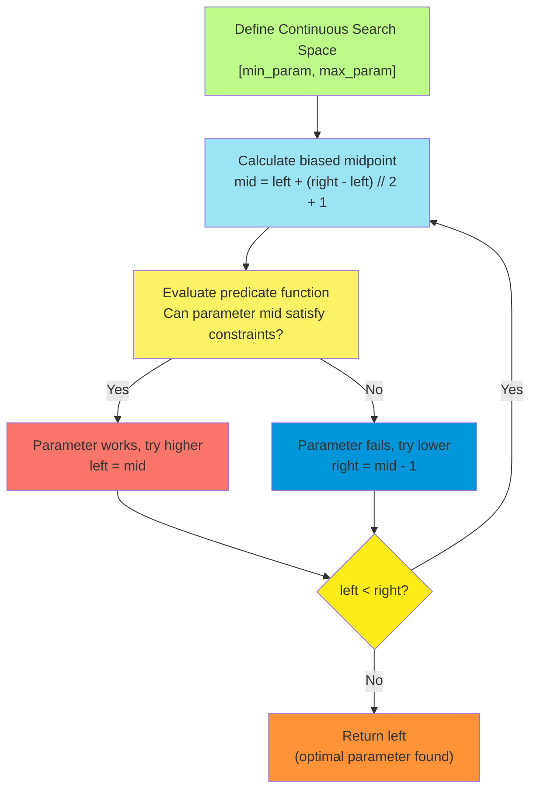
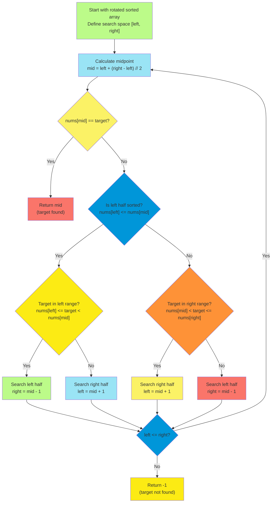

# C-6: Binary Search - Logarithmic Search Algorithms in Sorted Spaces

1. Theoretical Foundations of Binary Search Algorithms
    - Search Space Definition and Boundary Management
    - Midpoint Calculation and Overflow Prevention
    - Loop Termination Conditions and Exit Strategies
    - Pointer Update Logic and Inclusion/Exclusion Principles
2. Classic Binary Search Applications in Sorted Arrays
    - Insertion Index Detection in Sorted Sequences
    - First and Last Occurrence Identification
    - Lower Bound and Upper Bound Search Techniques
    - Infinite Loop Prevention and Midpoint Bias Strategies
3. Non-Intuitive Search Space Applications
    - Cutting Wood Problem and Optimization Search
    - Boolean Predicate Function Design
    - Upper Bound Search in Continuous Domains
    - Search Space Transformation Techniques
4. Partially Sorted and Complex Array Structures
    - Rotated Sorted Array Search Strategies
    - Subarray Analysis and Sorted Region Identification
    - Binary Search Adaptation for Modified Sorted Structures
    - Target Location in Transformed Search Spaces

#### Theoretical Foundations of Binary Search Algorithms

##### Search Space Definition and Boundary Management

Understanding binary search begins with mastering the fundamental concept of search space definition. The search space
represents the universe of all possible locations where our target value might exist. Think of it as drawing boundaries
around the area we need to explore, much like a detective might cordon off a crime scene to focus their investigation.

When we approach binary search problems, the first critical decision involves defining these boundaries correctly. This
isn't always as straightforward as it might initially appear. Consider searching for a value in a simple sorted array -
we might instinctively set our left boundary to index 0 and right boundary to the last valid index. However, what
happens when we're looking for an insertion point? The target might belong at the very end of the array, beyond the last
element, which means our search space must extend one position further.

Let me walk you through this concept with a concrete example. Imagine you have the array [1, 3, 5, 7, 9] and you want to
find where the number 6 should be inserted. If you only search within the existing array boundaries (indices 0 to 4),
you might miss that 6 belongs at the end. Therefore, your search space should span from 0 to 5, including that extra
position.

The mathematical elegance of proper boundary management lies in ensuring our search space contains all possible valid
answers. This principle extends beyond simple array searches. When we're optimizing a continuous parameter (like the
height setting of a wood-cutting machine), our boundaries must encompass the entire range of feasible values.

```python
def demonstrate_search_space_concepts():
    """
    Educational demonstration of how search space definition impacts
    binary search correctness and efficiency.

    This helps visualize why proper boundary setting is crucial for
    different types of binary search problems.
    """
    # Example 1: Standard value search
    arr = [1, 3, 5, 7, 9]
    target = 5

    print("Standard Binary Search for Value 5:")
    print(f"Array: {arr}")
    print(f"Search space: indices 0 to {len(arr)-1}")
    print("Why: Target must exist within array bounds if present")

    # Example 2: Insertion point search
    target_insert = 6
    print(f"\nInsertion Point Search for Value 6:")
    print(f"Array: {arr}")
    print(f"Search space: indices 0 to {len(arr)}")
    print("Why: Target might belong after the last element")

    # Example 3: Optimization problem (wood cutting)
    tree_heights = [2, 6, 3, 8]
    max_height = max(tree_heights)
    print(f"\nWood Cutting Optimization:")
    print(f"Tree heights: {tree_heights}")
    print(f"Search space: height settings 0 to {max_height}")
    print("Why: Any height above maximum cuts no wood")

    return "Search space boundaries must contain all possible answers"

# The key insight: boundaries define the universe of possible solutions
demonstration_result = demonstrate_search_space_concepts()
print(f"\nKey principle: {demonstration_result}")
```

This boundary management principle becomes even more nuanced when we consider that different problems require different
approaches to handling the edges of our search space. Sometimes we want to include a boundary point in our active search
region, other times we want to exclude it. This decision affects how we update our pointers during the search process.

The psychological aspect of boundary management involves developing an intuitive sense for whether a boundary should be
inclusive or exclusive. Ask yourself: "If my target were at this exact boundary position, would that represent a valid
answer to my problem?" If yes, include it. If no, exclude it. This simple mental check can prevent many common binary
search implementation errors.

##### Midpoint Calculation and Overflow Prevention

The calculation of the midpoint in binary search appears deceptively simple, yet it contains subtle complexities that
can make the difference between a robust algorithm and one that fails in edge cases. The standard formula
`mid = (left + right) / 2` works perfectly for small numbers but can cause catastrophic failures when dealing with large
integers due to arithmetic overflow.

Let me help you understand why this overflow problem occurs and how to prevent it. When we add two large integers, their
sum might exceed the maximum value that can be stored in our integer type. In languages like Java or C++, this overflow
can cause the sum to wrap around to negative values, leading to incorrect midpoint calculations and potentially infinite
loops or array access violations.

The elegant solution involves algebraic manipulation: instead of computing `(left + right) / 2`, we calculate
`left + (right - left) / 2`. These expressions are mathematically equivalent for real numbers, but the second form
prevents overflow because `(right - left)` is always smaller than either `left` or `right` individually.

Think about this transformation as a way of expressing "start from the left boundary and move halfway toward the right
boundary" rather than "find the average of the two boundaries." This conceptual shift not only prevents overflow but
also provides clearer intuition about what the midpoint calculation accomplishes.

```python
def demonstrate_midpoint_calculations():
    """
    Educational comparison of different midpoint calculation methods,
    showing why overflow-safe calculations matter in robust implementations.
    """

    def standard_midpoint(left, right):
        """Standard but overflow-prone calculation"""
        return (left + right) // 2

    def overflow_safe_midpoint(left, right):
        """Overflow-safe calculation using algebraic transformation"""
        return left + (right - left) // 2

    # Test cases demonstrating the difference
    test_cases = [
        (0, 10, "Small numbers - both methods work"),
        (1000000, 2000000, "Medium numbers - both methods work"),
        # In real systems with large integers, this could overflow:
        (2**30, 2**31-1, "Large numbers - overflow risk with standard method")
    ]

    print("Midpoint Calculation Comparison:")
    print("=" * 50)

    for left, right, description in test_cases:
        standard_result = standard_midpoint(left, right)
        safe_result = overflow_safe_midpoint(left, right)

        print(f"\n{description}")
        print(f"Range: [{left}, {right}]")
        print(f"Standard method: {standard_result}")
        print(f"Overflow-safe method: {safe_result}")

        if standard_result == safe_result:
            print("✓ Both methods give same result")
        else:
            print("⚠ Methods differ - potential overflow detected")

    # Additional insight about integer division
    print(f"\nInteger Division Behavior:")
    print(f"7 // 2 = {7 // 2} (floors toward negative infinity)")
    print(f"This ensures consistent midpoint behavior for all ranges")

demonstrate_midpoint_calculations()
```

The choice of division operation also matters significantly. Integer division in most programming languages floors the
result, which means `7 // 2 = 3` rather than rounding to the nearest integer. This flooring behavior ensures that our
midpoint always lies within our search boundaries, preventing index out-of-bounds errors.

Understanding midpoint calculation deeply also prepares you for advanced scenarios where you might need to bias the
midpoint in a particular direction. For instance, in upper-bound binary search problems, we sometimes calculate
`mid = left + (right - left) // 2 + 1` to bias the midpoint toward the right. This bias prevents infinite loops in
certain edge cases, a technique we'll explore further when discussing advanced binary search variants.

##### Loop Termination Conditions and Exit Strategies

The termination condition of a binary search loop represents one of the most critical design decisions in the entire
algorithm. The choice between `while left < right` and `while left <= right` might seem minor, but it fundamentally
changes how the algorithm behaves and determines what value you should return at the end.

Let me guide you through understanding these different approaches by thinking about what happens when our search space
shrinks down to its smallest possible size. With the condition `left < right`, the loop terminates when the two pointers
meet at the same position. At this point, both pointers indicate the same location, which represents the final answer
after our search process has converged.

Contrast this with the condition `left <= right`, which continues the loop even when the pointers meet, only terminating
when the left pointer moves past the right pointer. This approach requires checking for the target value inside the loop
and returning immediately when found, rather than letting the algorithm converge to a final position.

The convergence-based approach (`left < right`) offers several advantages that make it particularly suitable for
problems involving bounds or insertion points. Since the algorithm naturally converges to a single position, you don't
need to handle multiple return points within the loop. The final position pointed to by both `left` and `right`
represents your answer.

```python
def demonstrate_termination_conditions():
    """
    Educational demonstration showing how different loop termination
    conditions affect binary search behavior and implementation complexity.
    """

    def binary_search_convergent(arr, target):
        """Using left < right - convergent approach"""
        left, right = 0, len(arr) - 1
        iterations = []

        while left < right:
            mid = left + (right - left) // 2
            iterations.append(f"Range: [{left}, {right}], mid: {mid}, value: {arr[mid]}")

            if arr[mid] < target:
                left = mid + 1
            else:
                right = mid

        # Converged to single position
        final_check = arr[left] == target if 0 <= left < len(arr) else False
        return left if final_check else -1, iterations

    def binary_search_crossing(arr, target):
        """Using left <= right - crossing approach"""
        left, right = 0, len(arr) - 1
        iterations = []

        while left <= right:
            mid = left + (right - left) // 2
            iterations.append(f"Range: [{left}, {right}], mid: {mid}, value: {arr[mid]}")

            if arr[mid] == target:
                return mid, iterations  # Found - return immediately
            elif arr[mid] < target:
                left = mid + 1
            else:
                right = mid - 1

        return -1, iterations  # Not found after pointers crossed

    # Test both approaches
    test_array = [1, 3, 5, 7, 9, 11]
    target = 7

    print("Termination Condition Comparison:")
    print(f"Array: {test_array}, Target: {target}")
    print("=" * 60)

    result1, iterations1 = binary_search_convergent(test_array, target)
    print(f"\nConvergent approach (left < right):")
    for iteration in iterations1:
        print(f"  {iteration}")
    print(f"Result: {result1}")

    result2, iterations2 = binary_search_crossing(test_array, target)
    print(f"\nCrossing approach (left <= right):")
    for iteration in iterations2:
        print(f"  {iteration}")
    print(f"Result: {result2}")

    # Analyze the differences
    print(f"\nAnalysis:")
    print(f"Convergent: {len(iterations1)} iterations, natural convergence")
    print(f"Crossing: {len(iterations2)} iterations, explicit target checking")

demonstrate_termination_conditions()
```

The choice between these approaches often depends on the nature of your problem. If you're searching for exact matches
and need to return immediately upon finding them, the crossing approach works well. However, if you're looking for
bounds, insertion points, or the first/last occurrence of a value, the convergent approach provides more natural
problem-solving flow.

Understanding termination conditions deeply also helps you debug binary search implementations. When you encounter
infinite loops, the issue often stems from a mismatch between your termination condition and your pointer update logic.
The convergent approach tends to be more forgiving because it naturally prevents the most common infinite loop
scenarios.

##### Pointer Update Logic and Inclusion/Exclusion Principles

The heart of binary search lies in the logic that determines how to update the left and right pointers after examining
the midpoint. This decision-making process embodies the fundamental principle of binary search: systematically
eliminating half of the remaining search space at each step.

The critical question you must answer at each iteration is whether the midpoint itself could potentially be the answer
you're seeking. This determines whether you use inclusive updates (like `right = mid`) or exclusive updates (like
`right = mid - 1`). Let me help you develop intuition for making this decision correctly.

When you use `right = mid`, you're saying "the answer might be at the midpoint, or it might be to the left of the
midpoint, but it's definitely not to the right of the midpoint." This inclusive approach keeps the midpoint in your
active search space. Conversely, when you use `right = mid - 1`, you're declaring "I know for certain that the midpoint
is not the answer, so I can exclude it entirely."

The same principle applies to left pointer updates. Using `left = mid` keeps the midpoint in consideration, while
`left = mid + 1` excludes it. The key to choosing correctly lies in understanding what you've learned from examining the
midpoint value.

Consider this decision-making framework: after comparing the midpoint with your target or evaluating your search
condition, ask yourself "Could this midpoint position represent a valid answer?" If there's any possibility it could be
correct, use the inclusive update. If you can definitively rule it out, use the exclusive update.

```python
def demonstrate_pointer_update_logic():
    """
    Educational demonstration of how inclusion/exclusion decisions
    affect binary search behavior and correctness.
    """

    def find_insertion_point(arr, target):
        """
        Finding insertion point - demonstrates inclusive/exclusive logic.
        We're looking for the first position where target could be inserted.
        """
        left, right = 0, len(arr)  # Note: right can be len(arr)
        trace = []

        while left < right:
            mid = left + (right - left) // 2
            trace.append({
                'range': f"[{left}, {right})",
                'mid': mid,
                'mid_value': arr[mid] if mid < len(arr) else 'beyond array',
                'comparison': f"arr[{mid}] vs target {target}" if mid < len(arr) else 'N/A'
            })

            # Key decision point: inclusion vs exclusion
            if mid < len(arr) and arr[mid] < target:
                # Midpoint is too small - target goes to the right
                # We can exclude midpoint since target can't be inserted there
                left = mid + 1
                trace[-1]['decision'] = f"arr[{mid}] < {target}, exclude mid: left = {left}"
            else:
                # Midpoint is >= target, or we're beyond array
                # Target might be inserted at midpoint, so include it
                right = mid
                trace[-1]['decision'] = f"arr[{mid}] >= {target}, include mid: right = {right}"

        return left, trace

    def find_exact_match(arr, target):
        """
        Finding exact match - different inclusion/exclusion logic.
        """
        left, right = 0, len(arr) - 1
        trace = []

        while left < right:
            mid = left + (right - left) // 2
            trace.append({
                'range': f"[{left}, {right}]",
                'mid': mid,
                'mid_value': arr[mid],
                'comparison': f"arr[{mid}] vs target {target}"
            })

            if arr[mid] == target:
                # Found target - but might want leftmost occurrence
                # Include midpoint in case there are earlier occurrences
                right = mid
                trace[-1]['decision'] = f"Found target, check left: right = {right}"
            elif arr[mid] < target:
                # Target is to the right, exclude midpoint
                left = mid + 1
                trace[-1]['decision'] = f"Target to right, exclude mid: left = {left}"
            else:
                # Target is to the left, exclude midpoint
                right = mid - 1
                trace[-1]['decision'] = f"Target to left, exclude mid: right = {right}"

        final_match = left < len(arr) and arr[left] == target
        return left if final_match else -1, trace

    # Demonstrate both approaches
    test_array = [1, 3, 5, 7, 9]

    print("Pointer Update Logic Demonstration:")
    print("=" * 50)

    # Test insertion point logic
    target = 6
    insertion_point, insertion_trace = find_insertion_point(test_array, target)
    print(f"\nFinding insertion point for {target} in {test_array}:")
    for step in insertion_trace:
        print(f"  Range: {step['range']}, Mid: {step['mid']} ({step.get('mid_value', 'N/A')})")
        print(f"    {step['comparison']} → {step['decision']}")
    print(f"Result: Insert at position {insertion_point}")

    # Test exact match logic
    target = 5
    match_index, match_trace = find_exact_match(test_array, target)
    print(f"\nFinding exact match for {target} in {test_array}:")
    for step in match_trace:
        print(f"  Range: {step['range']}, Mid: {step['mid']} ({step['mid_value']})")
        print(f"    {step['comparison']} → {step['decision']}")
    print(f"Result: {'Found at position ' + str(match_index) if match_index != -1 else 'Not found'}")

demonstrate_pointer_update_logic()
```

The inclusion/exclusion principle becomes particularly important when dealing with duplicate values or boundary
conditions. When searching for the first occurrence of a target value, you might find the target at the midpoint but
still need to check if there are earlier occurrences. In this case, you'd use `right = mid` to include the midpoint in
your continued search toward the left.

Mastering this principle requires practice with different problem types. Each binary search variant (finding exact
matches, insertion points, first occurrences, last occurrences) has its own pattern of inclusion and exclusion
decisions. The key insight is that these decisions should always align with your problem's requirements and your loop
termination condition.

Understanding pointer update logic also helps you avoid the most common binary search bug: infinite loops caused by
incorrect pointer updates. When your updates don't make progress toward convergence, the algorithm can get trapped in a
cycle. The inclusion/exclusion principle, when applied correctly, ensures that your search space always shrinks at each
iteration.

#### Classic Binary Search Applications in Sorted Arrays

##### Insertion Index Detection in Sorted Sequences

Finding the correct insertion index in a sorted sequence represents one of the most elegant applications of binary
search principles. This problem beautifully demonstrates how binary search can solve optimization questions beyond
simple value lookup. When we ask "where should this element be inserted to maintain sorted order," we're essentially
seeking the boundary between elements smaller than our target and elements greater than or equal to our target.

Let me help you understand this problem by thinking about it in terms of partitioning. Imagine our sorted array divided
into two regions: elements that are less than our target, and elements that are greater than or equal to our target. The
insertion point is exactly at the boundary between these two regions. This boundary concept transforms what might seem
like a complex placement problem into a straightforward boundary-finding exercise.

The mathematical beauty of this approach lies in recognizing that we're searching for the lower bound of elements
greater than or equal to our target. This insight connects insertion point detection to the broader family of
bound-finding algorithms, which are fundamental tools in computational problem-solving.

Consider how this problem handles edge cases naturally. If our target is smaller than all elements in the array, the
insertion point is at the beginning. If it's larger than all elements, the insertion point is at the end. The binary
search algorithm handles these edge cases seamlessly because our search space extends from index 0 to index n (one past
the last element), encompassing all possible insertion positions.

```python
def find_insertion_index_detailed(nums, target):
    """
    Find the insertion index using lower bound binary search.

    This implementation demonstrates the elegant connection between
    insertion point detection and boundary finding in partitioned spaces.

    The key insight: we're finding the first position where
    element >= target, which is exactly where target should be inserted.
    """

    def visualize_partition(nums, target, left, right, mid=None):
        """Helper function to visualize the partition concept"""
        partition_view = []
        for i, val in enumerate(nums):
            if val < target:
                partition_view.append(f"{val}(<)")
            else:
                partition_view.append(f"{val}(>=)")

        print(f"  Array partitioned by target {target}: {partition_view}")
        if mid is not None:
            print(f"  Current search range: [{left}, {right}], examining mid={mid}")

    # Search space includes position n (after last element)
    left, right = 0, len(nums)
    iteration = 0

    print(f"Finding insertion index for {target} in {nums}")
    print(f"Search space: [0, {len(nums)}] (includes position after last element)")

    while left < right:
        iteration += 1
        mid = left + (right - left) // 2

        print(f"\nIteration {iteration}:")
        visualize_partition(nums, target, left, right, mid)

        # Key decision: is nums[mid] in the left partition or right partition?
        if nums[mid] >= target:
            # nums[mid] is in the right partition (>= target)
            # The boundary might be at mid or to the left of mid
            right = mid
            print(f"  nums[{mid}] = {nums[mid]} >= {target}, search left half: right = {mid}")
        else:
            # nums[mid] is in the left partition (< target)
            # The boundary must be to the right of mid
            left = mid + 1
            print(f"  nums[{mid}] = {nums[mid]} < {target}, search right half: left = {mid + 1}")

    print(f"\nConverged at position {left}")

    # Verify our result
    if left == 0:
        print(f"Insertion at beginning: {target} < all elements")
    elif left == len(nums):
        print(f"Insertion at end: {target} > all elements")
    else:
        print(f"Insertion between {nums[left-1]} and {nums[left]}")

    return left
```

**Java Implementation:**

```java
public class InsertionIndexFinder {
    /**
     * Finds the insertion index using binary search lower bound technique.
     *
     * This implementation showcases the elegance of treating insertion
     * as a boundary-finding problem in a partitioned space.
     */
    public static int findInsertionIndex(int[] nums, int target) {
        int left = 0;
        int right = nums.length; // Include position after last element

        while (left < right) {
            int mid = left + (right - left) / 2;

            // Partition decision: which side does nums[mid] belong to?
            if (nums[mid] >= target) {
                // nums[mid] belongs to right partition (>= target)
                // Boundary is at mid or to the left
                right = mid;
            } else {
                // nums[mid] belongs to left partition (< target)
                // Boundary is to the right of mid
                left = mid + 1;
            }
        }

        return left; // Insertion point
    }

    /**
     * Enhanced version with detailed analysis of the partition concept.
     * Useful for understanding the underlying mathematical structure.
     */
    public static int findInsertionIndexWithAnalysis(int[] nums, int target) {
        System.out.println("Analyzing insertion point for " + target);

        // Visualize the conceptual partition
        System.out.print("Partition view: [");
        for (int i = 0; i < nums.length; i++) {
            System.out.print(nums[i] < target ? nums[i] + "(<) " : nums[i] + "(>=) ");
        }
        System.out.println("]");

        int left = 0, right = nums.length;
        int iterations = 0;

        while (left < right) {
            iterations++;
            int mid = left + (right - left) / 2;

            System.out.printf("Iteration %d: range [%d, %d), mid=%d, value=%d\n",
                            iterations, left, right, mid,
                            mid < nums.length ? nums[mid] : -1);

            if (mid < nums.length && nums[mid] >= target) {
                right = mid;
                System.out.println("  → Target <= nums[mid], search left");
            } else {
                left = mid + 1;
                System.out.println("  → Target > nums[mid], search right");
            }
        }

        System.out.println("Insertion point: " + left);
        return left;
    }
}
```

**C++ Implementation:**

```cpp
#include <vector>
#include <iostream>

class InsertionIndexFinder {
public:
    /**
     * C++ implementation demonstrating efficient insertion point detection.
     *
     * Uses the lower bound concept to find the correct insertion position
     * in O(log n) time complexity.
     */
    static int findInsertionIndex(const std::vector<int>& nums, int target) {
        int left = 0;
        int right = static_cast<int>(nums.size());

        while (left < right) {
            int mid = left + (right - left) / 2;

            // Apply partition logic
            if (nums[mid] >= target) {
                // Right partition: boundary at mid or left of mid
                right = mid;
            } else {
                // Left partition: boundary right of mid
                left = mid + 1;
            }
        }

        return left;
    }

    /**
     * STL-equivalent implementation showing connection to standard algorithms.
     * This demonstrates how binary search principles underlie library functions.
     */
    static int findInsertionIndexSTLStyle(const std::vector<int>& nums, int target) {
        // This is essentially what std::lower_bound does
        auto it = std::lower_bound(nums.begin(), nums.end(), target);
        return static_cast<int>(it - nums.begin());
    }
};
```

The insertion index problem also serves as an excellent introduction to the concept of stable algorithms. When we insert
an element at the computed position, elements equal to our target will appear after our newly inserted element,
maintaining relative order. This stability property makes the algorithm particularly useful for maintaining sorted data
structures over time.

Understanding insertion index detection provides foundation for more complex problems like range queries, interval
scheduling, and database indexing. The ability to quickly determine where new elements belong in sorted structures is
fundamental to many algorithms in computer science and software engineering.

##### First and Last Occurrence Identification

The problem of finding first and last occurrences of a target value in a sorted array with duplicates represents a
sophisticated application of binary search that requires understanding both lower bound and upper bound concepts. This
problem elegantly demonstrates how slight modifications to basic binary search can solve fundamentally different
questions.

Let me guide you through understanding this problem by recognizing that we're essentially performing two specialized
searches. For the first occurrence, we want the leftmost position where our target appears. For the last occurrence, we
want the rightmost position. These correspond to finding the lower bound and upper bound of our target value
respectively.

The challenge in implementing these searches lies in handling the case where we find our target at the midpoint. In a
standard binary search, finding the target would end our search. Here, finding the target is just the beginning - we
need to continue searching to ensure we've found the first or last occurrence rather than just any occurrence.

For first occurrence detection, when we find our target at the midpoint, we can't stop searching because there might be
earlier occurrences to the left. We continue searching leftward while keeping the midpoint in our search space, since it
might be the first occurrence we're seeking.

```python
def find_first_and_last_occurrences(nums, target):
    """
    Find first and last occurrences using specialized binary search variants.

    This demonstrates how lower bound and upper bound searches can be
    adapted to solve the duplicate handling problem elegantly.
    """

    def find_first_occurrence(nums, target):
        """Lower bound search - find leftmost occurrence"""
        left, right = 0, len(nums) - 1
        result = -1
        trace = []

        while left <= right:
            mid = left + (right - left) // 2
            trace.append({
                'range': f"[{left}, {right}]",
                'mid': mid,
                'value': nums[mid],
                'action': ''
            })

            if nums[mid] == target:
                result = mid  # Found occurrence, but keep looking left
                right = mid - 1
                trace[-1]['action'] = f"Found target at {mid}, search left for earlier occurrence"
            elif nums[mid] < target:
                left = mid + 1
                trace[-1]['action'] = f"nums[{mid}] < target, search right"
            else:
                right = mid - 1
                trace[-1]['action'] = f"nums[{mid}] > target, search left"

        return result, trace

    def find_last_occurrence(nums, target):
        """Upper bound search - find rightmost occurrence"""
        left, right = 0, len(nums) - 1
        result = -1
        trace = []

        while left <= right:
            mid = left + (right - left) // 2
            trace.append({
                'range': f"[{left}, {right}]",
                'mid': mid,
                'value': nums[mid],
                'action': ''
            })

            if nums[mid] == target:
                result = mid  # Found occurrence, but keep looking right
                left = mid + 1
                trace[-1]['action'] = f"Found target at {mid}, search right for later occurrence"
            elif nums[mid] < target:
                left = mid + 1
                trace[-1]['action'] = f"nums[{mid}] < target, search right"
            else:
                right = mid - 1
                trace[-1]['action'] = f"nums[{mid}] > target, search left"

        return result, trace

    print(f"Finding first and last occurrences of {target} in {nums}")
    print("=" * 60)

    # Find first occurrence
    first_idx, first_trace = find_first_occurrence(nums, target)
    print(f"\nFirst occurrence search:")
    for step in first_trace:
        print(f"  {step['range']} mid={step['mid']} val={step['value']} → {step['action']}")
    print(f"First occurrence: {first_idx}")

    # Find last occurrence
    last_idx, last_trace = find_last_occurrence(nums, target)
    print(f"\nLast occurrence search:")
    for step in last_trace:
        print(f"  {step['range']} mid={step['mid']} val={step['value']} → {step['action']}")
    print(f"Last occurrence: {last_idx}")

    return [first_idx, last_idx]

# Test with array containing duplicates
test_array = [1, 2, 3, 4, 4, 4, 5, 6, 7]
target = 4
result = find_first_and_last_occurrences(test_array, target)
print(f"\nFinal result: {result}")
```

The upper bound search for last occurrence introduces an interesting complication that doesn't appear in lower bound
searches: the potential for infinite loops. When using the standard midpoint calculation, certain edge cases can cause
the algorithm to get stuck when the search space shrinks to two adjacent elements.

The solution involves biasing the midpoint calculation toward the right by using `mid = left + (right - left) // 2 + 1`
instead of the standard formula. This bias ensures that when we have a two-element search space and we execute
`left = mid`, we make actual progress rather than staying in the same position.

Understanding why this bias prevents infinite loops requires visualizing what happens when `left` and `right` are
adjacent. With the standard midpoint calculation, `mid` equals `left`, so setting `left = mid` doesn't change the search
space. The rightward bias ensures that `mid` equals `right` in this scenario, so setting `left = mid` properly advances
the left pointer.

**Java Implementation:**

```java
public class FirstLastOccurrence {
    /**
     * Finds first and last occurrences using the classic approach
     * with separate functions for each bound type.
     */
    public static int[] findFirstAndLastOccurrence(int[] nums, int target) {
        int first = findFirstOccurrence(nums, target);
        int last = findLastOccurrence(nums, target);
        return new int[]{first, last};
   }

   private static int findFirstOccurrence(int[] nums, int target) {
       int left = 0, right = nums.length - 1;
       int result = -1;

       while (left <= right) {
           int mid = left + (right - left) / 2;

           if (nums[mid] == target) {
               result = mid;           // Record this occurrence
               right = mid - 1;       // Continue searching left
           } else if (nums[mid] < target) {
               left = mid + 1;
           } else {
               right = mid - 1;
           }
       }

       return result;
   }

   private static int findLastOccurrence(int[] nums, int target) {
       int left = 0, right = nums.length - 1;
       int result = -1;

       while (left <= right) {
           int mid = left + (right - left) / 2;

           if (nums[mid] == target) {
               result = mid;           // Record this occurrence
               left = mid + 1;        // Continue searching right
           } else if (nums[mid] < target) {
               left = mid + 1;
           } else {
               right = mid - 1;
           }
       }

       return result;
   }

   /**
    * Alternative implementation using convergent binary search.
    * This approach avoids infinite loops more elegantly.
    */
   public static int[] findFirstAndLastConvergent(int[] nums, int target) {
       if (nums.length == 0) return new int[]{-1, -1};

       // Find first occurrence using lower bound
       int first = lowerBound(nums, target);
       if (first == nums.length || nums[first] != target) {
           return new int[]{-1, -1};
       }

       // Find last occurrence using upper bound
       int last = upperBound(nums, target) - 1;

       return new int[]{first, last};
   }

   private static int lowerBound(int[] nums, int target) {
       int left = 0, right = nums.length;

       while (left < right) {
           int mid = left + (right - left) / 2;
           if (nums[mid] >= target) {
               right = mid;
           } else {
               left = mid + 1;
           }
       }

       return left;
   }

   private static int upperBound(int[] nums, int target) {
       int left = 0, right = nums.length;

       while (left < right) {
           int mid = left + (right - left) / 2;
           if (nums[mid] > target) {
               right = mid;
           } else {
               left = mid + 1;
           }
       }

       return left;
   }
}
```

**C++ Implementation:**

```cpp
#include <vector>
#include <algorithm>

class FirstLastOccurrence {
public:
    /**
     * C++ implementation demonstrating both custom and STL approaches.
     * Shows connection between manual implementation and standard library.
     */
    static std::vector<int> findFirstAndLast(const std::vector<int>& nums, int target) {
        if (nums.empty()) return {-1, -1};

        // Using STL functions (most efficient in practice)
        auto lower = std::lower_bound(nums.begin(), nums.end(), target);
        auto upper = std::upper_bound(nums.begin(), nums.end(), target);

        if (lower == nums.end() || *lower != target) {
            return {-1, -1};
        }

        int first = static_cast<int>(lower - nums.begin());
        int last = static_cast<int>(upper - nums.begin()) - 1;

        return {first, last};
    }

    /**
     * Manual implementation for educational purposes.
     * Demonstrates the underlying algorithm that STL functions use.
     */
    static std::vector<int> findFirstAndLastManual(const std::vector<int>& nums, int target) {
        int first = findFirst(nums, target);
        int last = findLast(nums, target);
        return {first, last};
    }

private:
    static int findFirst(const std::vector<int>& nums, int target) {
        int left = 0, right = static_cast<int>(nums.size()) - 1;
        int result = -1;

        while (left <= right) {
            int mid = left + (right - left) / 2;

            if (nums[mid] == target) {
                result = mid;
                right = mid - 1;  // Continue searching left
            } else if (nums[mid] < target) {
                left = mid + 1;
            } else {
                right = mid - 1;
            }
        }

        return result;
    }

    static int findLast(const std::vector<int>& nums, int target) {
        int left = 0, right = static_cast<int>(nums.size()) - 1;
        int result = -1;

        while (left <= right) {
            int mid = left + (right - left) / 2;

            if (nums[mid] == target) {
                result = mid;
                left = mid + 1;   // Continue searching right
            } else if (nums[mid] < target) {
                left = mid + 1;
            } else {
                right = mid - 1;
            }
        }

        return result;
    }
};
```

##### Lower Bound and Upper Bound Search Techniques

Understanding lower bound and upper bound searches provides the theoretical foundation for solving a wide range of
binary search problems. These concepts generalize the idea of finding specific positions in sorted data to finding
boundaries between different categories of elements.

A lower bound search finds the first position where a given condition becomes true. In the context of a target value, it
finds the first position where an element is greater than or equal to the target. An upper bound search finds the first
position where the condition is no longer true - in our context, the first position where an element is greater than the
target.

The mathematical elegance of these concepts lies in their ability to transform complex searching problems into simple
boundary detection problems. Instead of asking "where is this specific value," we ask "where does this condition
transition from false to true?"

```python
def demonstrate_bound_search_concepts():
    """
    Educational demonstration of lower bound and upper bound concepts,
    showing how they form the foundation for many binary search applications.
    """

    def lower_bound_search(nums, target):
        """Find first position where nums[i] >= target"""
        left, right = 0, len(nums)
        trace = []

        while left < right:
            mid = left + (right - left) // 2
            trace.append({
                'range': f"[{left}, {right})",
                'mid': mid,
                'value': nums[mid] if mid < len(nums) else 'beyond',
                'condition': f"nums[{mid}] >= {target}" if mid < len(nums) else 'N/A',
                'result': nums[mid] >= target if mid < len(nums) else True
            })

            if mid < len(nums) and nums[mid] >= target:
                right = mid  # Condition is true, look for earlier true position
                trace[-1]['action'] = f"Condition true, search left: right = {mid}"
            else:
                left = mid + 1  # Condition is false, look for later true position
                trace[-1]['action'] = f"Condition false, search right: left = {mid + 1}"

        return left, trace

    def upper_bound_search(nums, target):
        """Find first position where nums[i] > target"""
        left, right = 0, len(nums)
        trace = []

        while left < right:
            mid = left + (right - left) // 2
            trace.append({
                'range': f"[{left}, {right})",
                'mid': mid,
                'value': nums[mid] if mid < len(nums) else 'beyond',
                'condition': f"nums[{mid}] > {target}" if mid < len(nums) else 'N/A',
                'result': nums[mid] > target if mid < len(nums) else True
            })

            if mid < len(nums) and nums[mid] > target:
                right = mid  # Condition is true, look for earlier true position
                trace[-1]['action'] = f"Condition true, search left: right = {mid}"
            else:
                left = mid + 1  # Condition is false, look for later true position
                trace[-1]['action'] = f"Condition false, search right: left = {mid + 1}"

        return left, trace

    # Demonstrate with example array
    nums = [1, 3, 3, 3, 5, 7, 9]
    target = 3

    print(f"Bound Search Demonstration")
    print(f"Array: {nums}, Target: {target}")
    print("=" * 60)

    # Lower bound search
    lower_pos, lower_trace = lower_bound_search(nums, target)
    print(f"\nLower Bound Search (first position where nums[i] >= {target}):")
    for step in lower_trace:
        print(f"  {step['range']} mid={step['mid']} val={step['value']}")
        print(f"    {step['condition']} = {step['result']} → {step['action']}")
    print(f"Lower bound result: position {lower_pos}")

    # Upper bound search
    upper_pos, upper_trace = upper_bound_search(nums, target)
    print(f"\nUpper Bound Search (first position where nums[i] > {target}):")
    for step in upper_trace:
        print(f"  {step['range']} mid={step['mid']} val={step['value']}")
        print(f"    {step['condition']} = {step['result']} → {step['action']}")
    print(f"Upper bound result: position {upper_pos}")

    # Show practical applications
    print(f"\nPractical Applications:")
    print(f"Target {target} appears from index {lower_pos} to {upper_pos - 1}")
    print(f"Count of target occurrences: {upper_pos - lower_pos}")
    print(f"Insertion point for target: {lower_pos}")
    print(f"Insertion point for (target + 1): {upper_pos}")

demonstrate_bound_search_concepts()
```

The power of bound searches extends far beyond finding specific values. They can be used with any boolean condition that
has the property of being false for some prefix of the array and true for some suffix. This monotonic property is what
makes binary search applicable.

Consider some advanced applications: finding the first element that satisfies a complex predicate, locating the
transition point in a function that changes from decreasing to increasing, or determining the optimal parameter value in
an optimization problem. All of these can be framed as bound search problems.

##### Infinite Loop Prevention and Midpoint Bias Strategies

One of the most subtle and important aspects of binary search implementation involves preventing infinite loops,
particularly in upper bound searches and other specialized variants. Understanding when and why these loops occur, and
how to prevent them, separates robust implementations from fragile ones.

The root cause of infinite loops in binary search typically involves a mismatch between the midpoint calculation and the
pointer update logic. When the search space shrinks to two adjacent elements, certain combinations of midpoint
calculation and pointer updates can cause the algorithm to repeatedly examine the same state without making progress.

Let me guide you through understanding this problem with a concrete example. Consider a search space with `left = 0` and
`right = 1`. Using the standard midpoint calculation `mid = left + (right - left) // 2`, we get `mid = 0`. If our update
logic sets `left = mid`, we haven't made any progress because `left` was already 0.

The solution involves biasing the midpoint calculation to ensure progress in these edge cases. For upper bound searches
where we might execute `left = mid`, we use the biased calculation `mid = left + (right - left) // 2 + 1`. This ensures
that `mid` equals `right` when we have a two-element search space, so setting `left = mid` actually advances the left
pointer.

```python
def demonstrate_infinite_loop_prevention():
    """
    Educational demonstration of infinite loop scenarios and prevention strategies.
    Shows why midpoint bias is necessary for certain binary search variants.
    """

    def problematic_upper_bound(nums, target):
        """Demonstrates the infinite loop problem in upper bound search"""
        left, right = 0, len(nums) - 1
        iterations = 0
        max_iterations = 10  # Prevent actual infinite loop

        print(f"Problematic upper bound search for {target} in {nums}")

        while left < right and iterations < max_iterations:
            iterations += 1
            mid = left + (right - left) // 2  # Standard midpoint

            print(f"  Iteration {iterations}: left={left}, right={right}, mid={mid}")
            print(f"    nums[{mid}] = {nums[mid]}")

            if nums[mid] <= target:
                left = mid  # This can cause infinite loop!
                print(f"    nums[mid] <= target, set left = {left}")
            else:
                right = mid - 1
                print(f"    nums[mid] > target, set right = {right}")

            # Check for infinite loop condition
            if iterations > 1 and left == 0 and right == 1:
                print(f"    ⚠ Infinite loop detected! left={left}, right={right}")
                break

        return -1 if iterations >= max_iterations else left

    def fixed_upper_bound(nums, target):
        """Fixed version using midpoint bias"""
        left, right = 0, len(nums) - 1
        iterations = 0

        print(f"Fixed upper bound search for {target} in {nums}")

        while left < right:
            iterations += 1
            # Biased midpoint calculation prevents infinite loops
            mid = left + (right - left) // 2 + 1

            print(f"  Iteration {iterations}: left={left}, right={right}, mid={mid}")
            print(f"    nums[{mid}] = {nums[mid]}")

            if nums[mid] <= target:
                left = mid  # Now safe due to bias
                print(f"    nums[mid] <= target, set left = {left}")
            else:
                right = mid - 1
                print(f"    nums[mid] > target, set right = {right}")

        return left

    def analyze_midpoint_bias():
        """Analyze how midpoint bias affects different scenarios"""
        scenarios = [
            (0, 1, "Two adjacent elements"),
            (0, 2, "Three elements"),
            (1, 3, "Different starting positions"),
        ]

        print("\nMidpoint Bias Analysis:")
        print("=" * 40)

        for left, right, description in scenarios:
            standard_mid = left + (right - left) // 2
            biased_mid = left + (right - left) // 2 + 1

            print(f"\n{description}: left={left}, right={right}")
            print(f"  Standard midpoint: {standard_mid}")
            print(f"  Biased midpoint: {biased_mid}")

            # Analyze what happens with left = mid
            if standard_mid == left:
                print(f"  ⚠ Standard: left = mid would not make progress")
            else:
                print(f"  ✓ Standard: left = mid would advance to {standard_mid}")

            if biased_mid == left:
                print(f"  ⚠ Biased: left = mid would not make progress")
            else:
                print(f"  ✓ Biased: left = mid would advance to {biased_mid}")

    # Test the problematic case
    test_array = [1, 2]
    target = 1

    print("Infinite Loop Prevention Demonstration")
    print("=" * 50)

    problematic_upper_bound(test_array, target)
    print()
    fixed_upper_bound(test_array, target)

    analyze_midpoint_bias()

    return "Midpoint bias prevents infinite loops in specialized binary searches"

demonstrate_infinite_loop_prevention()
```

Understanding infinite loop prevention also helps you make informed decisions about when to use different binary search
templates. The convergent approach (`while left < right`) with appropriate midpoint bias is generally more robust than
the crossing approach (`while left <= right`) for complex binary search variants.

The choice of midpoint bias should align with your pointer update logic. If you ever execute `left = mid`, consider
using rightward bias. If you ever execute `right = mid`, the standard midpoint calculation usually works well. This
alignment ensures that your algorithm always makes progress toward convergence.

Mastering infinite loop prevention also prepares you for implementing custom binary search variants. When you need to
adapt binary search for novel problems, understanding these edge cases helps you create robust implementations that work
correctly across all input sizes and boundary conditions.

#### Non-Intuitive Search Space Applications

##### Cutting Wood Problem and Optimization Search

The cutting wood problem represents a fascinating application of binary search that demonstrates how the technique
extends far beyond searching in pre-existing arrays. This problem showcases binary search as a powerful optimization
tool, where we search through a space of possible parameter values to find the optimal setting.

Let me help you understand this problem by recognizing its fundamental structure. We have a parameter H (the cutting
height) that can take any value in a continuous range. As we vary this parameter, we get different amounts of wood cut.
The key insight is that this relationship is monotonic: as the cutting height increases, the amount of wood cut
decreases. This monotonic relationship is exactly what enables binary search.

The mathematical beauty of this approach lies in transforming an optimization problem into a decision problem. Instead
of asking "what height gives exactly k meters of wood," we ask "does height H give at least k meters of wood?" This
decision problem can be answered efficiently, and binary search helps us find the boundary between heights that give
enough wood and heights that don't.

Think about how this generalizes to other optimization problems. Whenever you have a parameter that affects an outcome
monotonically, and you can efficiently test whether a specific parameter value meets your criteria, you can apply this
binary search optimization pattern.

```python
def cutting_wood_detailed_analysis(heights, k):
    """
    Detailed analysis of the cutting wood problem showing how optimization
    transforms into binary search through monotonic relationships.
    """

    def calculate_wood_cut(cutting_height, tree_heights):
        """Calculate total wood cut at given height"""
        total_wood = 0
        cuts_made = []

        for i, height in enumerate(tree_heights):
            if height > cutting_height:
                wood_from_tree = height - cutting_height
                total_wood += wood_from_tree
                cuts_made.append(f"Tree {i}: {height} → cut {wood_from_tree}")
            else:
                cuts_made.append(f"Tree {i}: {height} → no cut")

        return total_wood, cuts_made

    def visualize_monotonic_relationship(tree_heights, target_wood):
        """Show how wood cut varies with cutting height"""
        max_height = max(tree_heights)
        print(f"Analyzing monotonic relationship:")
        print(f"Tree heights: {tree_heights}")
        print(f"Target wood needed: {target_wood}")
        print("\nHeight → Wood Cut → Sufficient?")
        print("-" * 35)

        test_heights = list(range(0, max_height + 1))
        transition_point = None

        for height in test_heights:
            wood_cut, _ = calculate_wood_cut(height, tree_heights)
            sufficient = wood_cut >= target_wood
            status = "✓" if sufficient else "✗"
            print(f"H={height:2d} → {wood_cut:2d} wood → {status}")

            # Find transition point
            if sufficient and transition_point is None:
                transition_point = height

        print(f"\nTransition point: H={transition_point} (last height giving enough wood)")
        return transition_point

    def binary_search_optimization(tree_heights, target_wood):
        """Binary search to find optimal cutting height"""
        left, right = 0, max(tree_heights)
        iterations = []

        print(f"\nBinary search for optimal cutting height:")
        print(f"Search space: [0, {max(tree_heights)}]")

        while left < right:
            # Bias midpoint right for upper bound search
            mid = left + (right - left) // 2 + 1
            wood_cut, cuts = calculate_wood_cut(mid, tree_heights)
            sufficient = wood_cut >= target_wood

            iteration_info = {
                'range': f"[{left}, {right}]",
                'height': mid,
                'wood_cut': wood_cut,
                'sufficient': sufficient,
                'decision': ''
            }

            if sufficient:
                # This height works, but try to find a higher one
                left = mid
                iteration_info['decision'] = f"Height {mid} works, search higher: left = {mid}"
            else:
                # This height doesn't work, must go lower
                right = mid - 1
                iteration_info['decision'] = f"Height {mid} insufficient, search lower: right = {mid-1}"

            iterations.append(iteration_info)

        # Display search process
        for i, step in enumerate(iterations, 1):
            print(f"Step {i}: Range {step['range']}, test H={step['height']}")
            print(f"  Wood cut: {step['wood_cut']}, Sufficient: {step['sufficient']}")
            print(f"  Decision: {step['decision']}")

        return left

    print("Cutting Wood Problem Analysis")
    print("=" * 50)

    # First show the monotonic relationship
    expected_answer = visualize_monotonic_relationship(heights, k)

    # Then solve with binary search
    binary_search_answer = binary_search_optimization(heights, k)

    print(f"\nResults:")
    print(f"Expected answer (from analysis): {expected_answer}")
    print(f"Binary search answer: {binary_search_answer}")
    print(f"Verification: {'✓' if expected_answer == binary_search_answer else '✗'}")

    # Show final cutting scenario
    final_wood, final_cuts = calculate_wood_cut(binary_search_answer, heights)
    print(f"\nFinal cutting at height {binary_search_answer}:")
    for cut_info in final_cuts:
        print(f"  {cut_info}")
    print(f"Total wood: {final_wood} (needed: {k})")

    return binary_search_answer

# Test the analysis
test_heights = [2, 6, 3, 8]
test_k = 7
result = cutting_wood_detailed_analysis(test_heights, test_k)
```

**Java Implementation:**

```java
public class CuttingWoodOptimization {
    /**
     * Solves the cutting wood optimization problem using binary search.
     *
     * This demonstrates how binary search can be applied to continuous
     * optimization problems through monotonic predicate functions.
     */
    public static int findOptimalCuttingHeight(int[] treeHeights, int targetWood) {
        int left = 0;
        int right = findMaxHeight(treeHeights);

        while (left < right) {
            // Use biased midpoint for upper bound search
            int mid = left + (right - left) / 2 + 1;

            if (canCutEnoughWood(treeHeights, mid, targetWood)) {
                // This height works, try to find higher
                left = mid;
            } else {
                // This height doesn't work, go lower
                right = mid - 1;
            }
        }

        return left;
    }

    /**
     * Predicate function: can we cut at least targetWood at given height?
     * This is the key transformation that enables binary search.
     */
    private static boolean canCutEnoughWood(int[] heights, int cuttingHeight, int targetWood) {
        long totalWood = 0; // Use long to prevent overflow

        for (int height : heights) {
            if (height > cuttingHeight) {
                totalWood += (height - cuttingHeight);
            }
        }

        return totalWood >= targetWood;
    }

    private static int findMaxHeight(int[] heights) {
        int max = heights[0];
        for (int height : heights) {
            max = Math.max(max, height);
        }
        return max;
    }

    /**
     * Enhanced version with detailed analysis of the optimization process.
     * Useful for understanding the underlying mathematical structure.
     */
    public static int findOptimalCuttingHeightWithAnalysis(int[] treeHeights, int targetWood) {
        System.out.println("Cutting Wood Optimization Analysis");
        System.out.println("Tree heights: " + Arrays.toString(treeHeights));
        System.out.println("Target wood: " + targetWood);

        int maxHeight = findMaxHeight(treeHeights);
        System.out.println("Search space: [0, " + maxHeight + "]");

        int left = 0, right = maxHeight;
        int iteration = 0;

        while (left < right) {
            iteration++;
            int mid = left + (right - left) / 2 + 1;
            long woodCut = calculateWoodCut(treeHeights, mid);
            boolean sufficient = woodCut >= targetWood;

            System.out.printf("Iteration %d: range [%d, %d], test height %d\n",
                            iteration, left, right, mid);
            System.out.printf("  Wood cut: %d, Sufficient: %s\n",
                            woodCut, sufficient ? "Yes" : "No");

            if (sufficient) {
                left = mid;
                System.out.println("  → Height works, search higher");
            } else {
                right = mid - 1;
                System.out.println("  → Height insufficient, search lower");
            }
        }

        System.out.println("Optimal cutting height: " + left);
        return left;
    }

    private static long calculateWoodCut(int[] heights, int cuttingHeight) {
        long total = 0;
        for (int height : heights) {
            if (height > cuttingHeight) {
                total += (height - cuttingHeight);
            }
        }
        return total;
    }
}
```

**C++ Implementation:**

```cpp
#include <vector>
#include <algorithm>
#include <numeric>

class CuttingWoodOptimization {
public:
    /**
     * C++ implementation showcasing efficient optimization through binary search.
     * Demonstrates how monotonic properties enable logarithmic solutions.
     */
    static int findOptimalCuttingHeight(const std::vector<int>& treeHeights, int targetWood) {
        int left = 0;
        int right = *std::max_element(treeHeights.begin(), treeHeights.end());

        while (left < right) {
            int mid = left + (right - left) / 2 + 1;

            if (canCutEnoughWood(treeHeights, mid, targetWood)) {
                left = mid;  // This height works, try higher
            } else {
                right = mid - 1;  // This height doesn't work, go lower
            }
        }

        return left;
    }

private:
    static bool canCutEnoughWood(const std::vector<int>& heights, int cuttingHeight, int targetWood) {
        long long totalWood = 0;

        for (int height : heights) {
            if (height > cuttingHeight) {
                totalWood += (height - cuttingHeight);
            }
        }

        return totalWood >= targetWood;
    }

public:
    /**
     * Generic template for optimization problems with monotonic predicates.
     * This pattern applies to many optimization scenarios beyond wood cutting.
     */
    template<typename PredicateFunc>
    static int binarySearchOptimization(int minValue, int maxValue, PredicateFunc predicate) {
        int left = minValue;
        int right = maxValue;

        while (left < right) {
            int mid = left + (right - left) / 2 + 1;

            if (predicate(mid)) {
                left = mid;   // Predicate satisfied, try for better
            } else {
                right = mid - 1;  // Predicate failed, reduce parameter
            }
        }

        return left;
    }
};
```

##### Boolean Predicate Function Design

The success of binary search optimization hinges on designing effective boolean predicate functions. These functions
serve as the bridge between your optimization problem and the binary search algorithm, transforming complex questions
into simple yes/no decisions.

A well-designed predicate function has several key characteristics. First, it must be monotonic - if it returns true for
some parameter value, it should return true for all values in one direction from that point. Second, it should be
efficiently computable, since it will be called logarithmically many times during the search. Third, it should
accurately capture the constraint or condition you're optimizing for.

Let me guide you through the thought process of designing effective predicate functions. Start by identifying the
parameter you want to optimize and understand how it affects your objective function. Then, instead of asking "what's
the optimal value," ask "is this value good enough?" This transformation from optimization to decision-making is the key
insight.

```python
def demonstrate_predicate_design_patterns():
    """
    Educational demonstration of effective boolean predicate design patterns
    for various optimization problems using binary search.
    """

    def design_cutting_predicate():
        """Example 1: Cutting wood predicate design"""
        print("Predicate Design Pattern 1: Resource Allocation")
        print("Problem: Find maximum cutting height that yields at least k wood")

        def wood_cutting_predicate(height, tree_heights, min_wood):
            """Can we cut at least min_wood at this height?"""
            total_cut = sum(max(0, tree_height - height) for tree_height in tree_heights)
            return total_cut >= min_wood

        # Test the predicate
        trees = [5, 8, 3, 9, 6]
        target = 10

        print(f"Tree heights: {trees}, Target wood: {target}")
        for height in range(0, max(trees) + 1):
            result = wood_cutting_predicate(height, trees, target)
            wood_cut = sum(max(0, t - height) for t in trees)
            print(f"  Height {height}: {wood_cut} wood → {'✓' if result else '✗'}")

        return wood_cutting_predicate

    def design_capacity_predicate():
        """Example 2: Capacity/allocation predicate design"""
        print("\nPredicate Design Pattern 2: Capacity Allocation")
        print("Problem: Minimum capacity needed to serve all requests within time limit")

        def server_capacity_predicate(capacity, requests, time_limit):
            """Can we handle all requests with this capacity within time limit?"""
            time_used = 0
            for request_size in requests:
                time_used += (request_size + capacity - 1) // capacity  # Ceiling division
                if time_used > time_limit:
                    return False
            return True

        # Test the predicate
        requests = [10, 15, 8, 12, 20]
        time_limit = 5

        print(f"Requests: {requests}, Time limit: {time_limit}")
        for capacity in range(1, 25):
            result = server_capacity_predicate(capacity, requests, time_limit)
            total_time = sum((req + capacity - 1) // capacity for req in requests)
            print(f"  Capacity {capacity:2d}: {total_time} time → {'✓' if result else '✗'}")

                    return server_capacity_predicate

                def design_threshold_predicate():
                    """Example 3: Threshold optimization predicate design"""
                    print("\nPredicate Design Pattern 3: Threshold Optimization")
                    print("Problem: Find minimum threshold where at least k elements meet criteria")

                    def threshold_predicate(threshold, values, min_count):
                        """Do at least min_count values meet the threshold?"""
                        count = sum(1 for value in values if value >= threshold)
                        return count >= min_count

                    # Test the predicate
                    values = [85, 92, 78, 96, 88, 73, 91, 82, 89, 94]
                    min_count = 6

                    print(f"Values: {values}, Minimum count needed: {min_count}")
                    for threshold in range(70, 100):
                        result = threshold_predicate(threshold, values, min_count)
                        count = sum(1 for v in values if v >= threshold)
                        print(f"  Threshold {threshold}: {count} qualify → {'✓' if result else '✗'}")

                    return threshold_predicate

                # Demonstrate all patterns
                cutting_pred = design_cutting_predicate()
                capacity_pred = design_capacity_predicate()
                threshold_pred = design_threshold_predicate()

                print(f"\nKey Insights for Predicate Design:")
                print(f"1. Monotonicity: If predicate(x) is true, predicate(x+δ) should have predictable behavior")
                print(f"2. Efficiency: Predicate should compute quickly since it's called O(log n) times")
                print(f"3. Boundary-focused: Ask 'is this good enough?' not 'what's optimal?'")
                print(f"4. Clear semantics: Predicate meaning should align with search direction")

            demonstrate_predicate_design_patterns()
```

The predicate design patterns demonstrate three fundamental approaches to transforming optimization problems into binary
search-compatible decision problems. The cutting wood pattern represents resource allocation problems where we maximize
a parameter while maintaining minimum output. The capacity allocation pattern addresses scenarios where we minimize
resources while meeting service requirements. The threshold optimization pattern handles cases where we find boundaries
that separate qualifying elements from non-qualifying ones.

Understanding these patterns helps you recognize when binary search optimization applies to your problem domain. The key
insight is that many optimization problems contain hidden monotonic relationships that can be exploited through
carefully designed predicate functions.

##### Upper Bound Search in Continuous Domains

Upper bound searches in continuous domains extend the fundamental binary search concept to optimization problems where
we seek the maximum value of a parameter that still satisfies our constraints. This represents a sophisticated
application where we're not searching for a specific target, but rather finding the boundary of feasibility in a
parameter space.

The mathematical foundation of upper bound search lies in recognizing that we're seeking the rightmost position where
our condition remains true. In continuous optimization contexts, this translates to finding the highest parameter value
that still produces acceptable results. The elegance of this approach becomes apparent when we realize that we're
essentially performing a binary search on the space of possible solutions rather than on a pre-existing data structure.

Consider the cutting wood problem from this perspective. We have a continuous range of possible cutting heights from
zero to the maximum tree height. As we increase the cutting height, the amount of wood obtained decreases monotonically.
Our goal is to find the highest cutting height that still yields at least our required amount of wood. This represents a
classic upper bound search in a continuous domain.



The critical difference between upper bound search and standard binary search lies in the midpoint calculation and
pointer update logic. Upper bound searches require biased midpoint calculation using
$\text{mid} = \text{left} + \frac{\text{right} - \text{left}}{2} + 1$ to prevent infinite loops when the search space
narrows to two adjacent elements. This bias ensures that when we execute `left = mid`, we make meaningful progress
toward convergence.

**Python Implementation:**

```python
def upper_bound_continuous_search(min_param, max_param, predicate_func, *args):
    """
    Generic upper bound search for continuous optimization problems.

    Finds the maximum parameter value where predicate_func returns True.

    Args:
        min_param: minimum parameter value to consider
        max_param: maximum parameter value to consider
        predicate_func: function that returns True if parameter satisfies constraints
        *args: additional arguments to pass to predicate_func

    Returns:
        Maximum parameter value where predicate_func returns True
    """
    left, right = min_param, max_param
    iterations = []

    while left < right:
        # Bias midpoint to the right to prevent infinite loops
        mid = left + (right - left) // 2 + 1

        # Evaluate our constraint at this parameter value
        constraint_satisfied = predicate_func(mid, *args)

        iterations.append({
            'range': f"[{left}, {right}]",
            'mid': mid,
            'satisfied': constraint_satisfied
        })

        if constraint_satisfied:
            # Parameter works, try to find a higher one
            left = mid
        else:
            # Parameter doesn't work, must go lower
            right = mid - 1

    return left, iterations

def demonstrate_upper_bound_applications():
    """
    Demonstrate upper bound search across different problem domains.
    """

    def cutting_wood_predicate(height, tree_heights, min_wood):
        """Predicate for cutting wood problem"""
        total_wood = sum(max(0, tree_height - height) for tree_height in tree_heights)
        return total_wood >= min_wood

    def server_load_predicate(max_requests, request_sizes, time_limit):
        """Predicate for server capacity problem"""
        time_needed = sum((size + max_requests - 1) // max_requests for size in request_sizes)
        return time_needed <= time_limit

    # Test Case 1: Cutting Wood Optimization
    print("Application 1: Cutting Wood Optimization")
    print("=" * 45)

    tree_heights = [2, 6, 3, 8]
    required_wood = 7
    max_height = max(tree_heights)

    optimal_height, wood_iterations = upper_bound_continuous_search(
        0, max_height, cutting_wood_predicate, tree_heights, required_wood
    )

    print(f"Tree heights: {tree_heights}")
    print(f"Required wood: {required_wood}")
    print(f"Search process:")

    for i, step in enumerate(wood_iterations, 1):
        print(f"  Step {i}: Range {step['range']}, test height {step['mid']}")
        print(f"    Constraint satisfied: {step['satisfied']}")

    print(f"Optimal cutting height: {optimal_height}")

    # Verify result
    final_wood = sum(max(0, h - optimal_height) for h in tree_heights)
    print(f"Wood obtained: {final_wood} (required: {required_wood})")

    # Test Case 2: Server Capacity Optimization
    print(f"\nApplication 2: Server Capacity Optimization")
    print("=" * 45)

    request_sizes = [10, 15, 8, 12, 20]
    time_limit = 5
    max_capacity = sum(request_sizes)  # Upper bound

    optimal_capacity, server_iterations = upper_bound_continuous_search(
        1, max_capacity, server_load_predicate, request_sizes, time_limit
    )

    print(f"Request sizes: {request_sizes}")
    print(f"Time limit: {time_limit}")
    print(f"Search process:")

    for i, step in enumerate(server_iterations, 1):
        print(f"  Step {i}: Range {step['range']}, test capacity {step['mid']}")
        print(f"    Constraint satisfied: {step['satisfied']}")

    print(f"Optimal server capacity: {optimal_capacity}")

    # Verify result
    final_time = sum((size + optimal_capacity - 1) // optimal_capacity for size in request_sizes)
    print(f"Time needed: {final_time} (limit: {time_limit})")

demonstrate_upper_bound_applications()
```

**Java Implementation:**

```java
import java.util.function.BiPredicate;
import java.util.Arrays;

public class UpperBoundContinuousSearch {

    /**
     * Generic upper bound search for continuous optimization problems.
     *
     * @param minParam minimum parameter value
     * @param maxParam maximum parameter value
     * @param predicate function to test parameter validity
     * @param data additional data needed by predicate
     * @return maximum parameter value where predicate returns true
     */
    public static <T> int upperBoundSearch(int minParam, int maxParam,
                                          BiPredicate<Integer, T> predicate, T data) {
        int left = minParam;
        int right = maxParam;

        while (left < right) {
            // Bias midpoint to prevent infinite loops
            int mid = left + (right - left) / 2 + 1;

            if (predicate.test(mid, data)) {
                // Parameter works, try higher
                left = mid;
            } else {
                // Parameter doesn't work, go lower
                right = mid - 1;
            }
        }

        return left;
    }

    /**
     * Cutting wood optimization using upper bound search.
     */
    public static class CuttingWoodOptimizer {
        private final int[] treeHeights;
        private final int requiredWood;

        public CuttingWoodOptimizer(int[] treeHeights, int requiredWood) {
            this.treeHeights = treeHeights.clone();
            this.requiredWood = requiredWood;
        }

        public int findOptimalHeight() {
            int maxHeight = Arrays.stream(treeHeights).max().orElse(0);

            BiPredicate<Integer, int[]> cuttingPredicate = (height, trees) -> {
                long totalWood = 0;
                for (int treeHeight : trees) {
                    if (treeHeight > height) {
                        totalWood += (treeHeight - height);
                    }
                }
                return totalWood >= requiredWood;
            };

            return upperBoundSearch(0, maxHeight, cuttingPredicate, treeHeights);
        }
    }

    /**
     * Server capacity optimization using upper bound search.
     */
    public static class ServerCapacityOptimizer {
        private final int[] requestSizes;
        private final int timeLimit;

        public ServerCapacityOptimizer(int[] requestSizes, int timeLimit) {
            this.requestSizes = requestSizes.clone();
            this.timeLimit = timeLimit;
        }

        public int findMinimumCapacity() {
            int maxCapacity = Arrays.stream(requestSizes).sum();

            BiPredicate<Integer, int[]> capacityPredicate = (capacity, requests) -> {
                long totalTime = 0;
                for (int requestSize : requests) {
                    totalTime += (requestSize + capacity - 1) / capacity; // Ceiling division
                    if (totalTime > timeLimit) {
                        return false;
                    }
                }
                return true;
            };

            // Note: This is actually a lower bound search for minimum capacity
            // We flip the search direction
            int left = 1, right = maxCapacity;

            while (left < right) {
                int mid = left + (right - left) / 2;

                if (capacityPredicate.test(mid, requestSizes)) {
                    right = mid; // Capacity works, try smaller
                } else {
                    left = mid + 1; // Capacity doesn't work, need larger
                }
            }

            return left;
        }
    }
}
```

**C++ Implementation:**

```cpp
#include <vector>
#include <functional>
#include <algorithm>
#include <numeric>

template<typename T>
class UpperBoundContinuousSearch {
public:
    /**
     * Generic upper bound search for continuous optimization problems.
     *
     * @param minParam minimum parameter value
     * @param maxParam maximum parameter value
     * @param predicate function to test parameter validity
     * @param data additional data needed by predicate
     * @return maximum parameter value where predicate returns true
     */
    static int search(int minParam, int maxParam,
                     std::function<bool(int, const T&)> predicate,
                     const T& data) {
        int left = minParam;
        int right = maxParam;

        while (left < right) {
            // Bias midpoint to prevent infinite loops
            int mid = left + (right - left) / 2 + 1;

            if (predicate(mid, data)) {
                // Parameter works, try higher
                left = mid;
            } else {
                // Parameter doesn't work, go lower
                right = mid - 1;
            }
        }

        return left;
    }
};

class CuttingWoodOptimizer {
private:
    std::vector<int> treeHeights;
    int requiredWood;

public:
    CuttingWoodOptimizer(const std::vector<int>& heights, int required)
        : treeHeights(heights), requiredWood(required) {}

    int findOptimalHeight() {
        int maxHeight = *std::max_element(treeHeights.begin(), treeHeights.end());

        auto cuttingPredicate = [this](int height, const std::vector<int>& trees) -> bool {
            long long totalWood = 0;
            for (int treeHeight : trees) {
                if (treeHeight > height) {
                    totalWood += (treeHeight - height);
                }
            }
            return totalWood >= requiredWood;
        };

        return UpperBoundContinuousSearch<std::vector<int>>::search(
            0, maxHeight, cuttingPredicate, treeHeights
        );
    }
};

class ServerCapacityOptimizer {
private:
    std::vector<int> requestSizes;
    int timeLimit;

public:
    ServerCapacityOptimizer(const std::vector<int>& requests, int limit)
        : requestSizes(requests), timeLimit(limit) {}

    int findMinimumCapacity() {
        int maxCapacity = std::accumulate(requestSizes.begin(), requestSizes.end(), 0);

        auto capacityPredicate = [this](int capacity, const std::vector<int>& requests) -> bool {
            long long totalTime = 0;
            for (int requestSize : requests) {
                totalTime += (requestSize + capacity - 1) / capacity; // Ceiling division
                if (totalTime > timeLimit) {
                    return false;
                }
            }
            return true;
        };

        // This is actually a lower bound search for minimum capacity
        int left = 1, right = maxCapacity;

        while (left < right) {
            int mid = left + (right - left) / 2;

            if (capacityPredicate(mid, requestSizes)) {
                right = mid; // Capacity works, try smaller
            } else {
                left = mid + 1; // Capacity doesn't work, need larger
            }
        }

        return left;
    }
};
```

##### Search Space Transformation Techniques

Search space transformation represents one of the most powerful and intellectually satisfying aspects of advanced binary
search applications. The fundamental insight is that many problems which don't initially appear to involve sorted data
can be transformed into binary search problems by recognizing hidden monotonic relationships in the parameter space.

The mathematical foundation of search space transformation lies in identifying functions that map problem parameters to
outcomes in a monotonic fashion. When such relationships exist, we can perform binary search on the parameter space
rather than on traditional array indices. This transformation opens up binary search to a vast array of optimization and
decision problems that would otherwise require more complex algorithmic approaches.

Consider how this transformation process works conceptually. We begin with a problem that asks for an optimal value -
perhaps the minimum time needed to complete a task, the maximum load a system can handle, or the optimal threshold for
some decision criterion. We then identify a parameter that affects the outcome monotonically and transform the
optimization question into a decision question: "Can we achieve our goal with parameter value X?"

The elegance of this approach becomes apparent when we realize that answering the decision question efficiently gives us
a path to solving the optimization problem. By using binary search on the parameter space, we can find the boundary
between parameter values that work and those that don't, which corresponds exactly to our optimal solution.

**Python Implementation:**

```python
def demonstrate_search_space_transformations():
    """
    Comprehensive demonstration of search space transformation techniques
    across different problem domains and parameter types.
    """

    def transformation_pattern_1_resource_optimization():
        """
        Pattern 1: Resource Optimization Transformation

        Original Problem: What's the minimum resource allocation needed?
        Transformed Problem: Can we succeed with resource allocation X?

        Monotonic Property: More resources → better performance
        Search Direction: Lower bound (minimum sufficient resource)
        """
        print("Transformation Pattern 1: Resource Optimization")
        print("=" * 50)

        def package_delivery_problem(packages, trucks, max_time):
            """
            Original: Minimum trucks needed to deliver packages within time limit
            Transformed: Can X trucks deliver all packages within time limit?
            """
            def can_deliver_with_trucks(num_trucks, package_weights, time_limit):
                """Decision function: Can num_trucks handle the delivery?"""
                if num_trucks == 0:
                    return len(package_weights) == 0

                # Greedy assignment: try to fit packages into trucks
                truck_loads = [0] * num_trucks
                package_weights_sorted = sorted(package_weights, reverse=True)

                for weight in package_weights_sorted:
                    # Find truck with minimum current load
                    min_truck = min(range(num_trucks), key=lambda i: truck_loads[i])
                    truck_loads[min_truck] += weight

                # Check if all trucks can complete within time limit
                return all(load <= time_limit for load in truck_loads)

            # Binary search on number of trucks (resource parameter)
            left, right = 1, len(packages)

            print(f"Package weights: {packages}")
            print(f"Time limit per truck: {max_time}")
            print(f"Search space: [1, {len(packages)}] trucks")

            while left < right:
                mid = left + (right - left) // 2

                if can_deliver_with_trucks(mid, packages, max_time):
                    print(f"  {mid} trucks: ✓ (feasible)")
                    right = mid  # This many trucks work, try fewer
                else:
                    print(f"  {mid} trucks: ✗ (not feasible)")
                    left = mid + 1  # Need more trucks

            return left

        packages = [10, 20, 15, 25, 18, 12]
        time_limit = 35
        min_trucks = package_delivery_problem(packages, len(packages), time_limit)
        print(f"Minimum trucks needed: {min_trucks}")

        return min_trucks

    def transformation_pattern_2_threshold_optimization():
        """
        Pattern 2: Threshold Optimization Transformation

        Original Problem: What threshold maximizes some objective?
        Transformed Problem: Does threshold X achieve our target objective?

        Monotonic Property: Higher threshold → different outcome pattern
        Search Direction: Upper/lower bound depending on objective
        """
        print(f"\nTransformation Pattern 2: Threshold Optimization")
        print("=" * 50)

        def quality_control_problem(measurements, min_passing_rate):
            """
            Original: Highest quality threshold maintaining passing rate
            Transformed: Does threshold X maintain required passing rate?
            """
            def maintains_passing_rate(threshold, values, required_rate):
                """Decision function: Does this threshold maintain passing rate?"""
                passing_count = sum(1 for value in values if value >= threshold)
                actual_rate = passing_count / len(values) if values else 0
                return actual_rate >= required_rate

            # Find reasonable search bounds
            min_threshold = min(measurements)
            max_threshold = max(measurements)

            print(f"Quality measurements: {measurements}")
            print(f"Required passing rate: {min_passing_rate:.1%}")
            print(f"Search space: [{min_threshold}, {max_threshold}]")

            # Binary search on threshold (parameter space)
            left, right = min_threshold, max_threshold

            while left < right:
                # Bias for upper bound search (highest feasible threshold)
                mid = left + (right - left) // 2 + 1

                if maintains_passing_rate(mid, measurements, min_passing_rate):
                    passing = sum(1 for m in measurements if m >= mid)
                    rate = passing / len(measurements)
                    print(f"  Threshold {mid}: {rate:.1%} pass rate ✓")
                    left = mid  # This threshold works, try higher
                else:
                    passing = sum(1 for m in measurements if m >= mid)
                    rate = passing / len(measurements)
                    print(f"  Threshold {mid}: {rate:.1%} pass rate ✗")
                    right = mid - 1  # Threshold too high

            return left

        quality_scores = [85, 92, 78, 96, 88, 73, 91, 82, 89, 94, 76, 87]
        required_rate = 0.75  # 75% must pass
        optimal_threshold = quality_control_problem(quality_scores, required_rate)
        print(f"Optimal quality threshold: {optimal_threshold}")

        return optimal_threshold

    def transformation_pattern_3_time_optimization():
        """
        Pattern 3: Time-based Optimization Transformation

        Original Problem: Minimum time to complete all tasks
        Transformed Problem: Can all tasks complete within time X?

        Monotonic Property: More time → higher success probability
        Search Direction: Lower bound (minimum sufficient time)
        """
        print(f"\nTransformation Pattern 3: Time-based Optimization")
        print("=" * 50)

        def parallel_task_scheduling(task_durations, num_processors):
            """
            Original: Minimum time to complete all tasks on processors
            Transformed: Can all tasks complete within time X?
            """
            def can_complete_within_time(max_time, tasks, processors):
                """Decision function: Can tasks complete within max_time?"""
                # Greedy scheduling: assign each task to least loaded processor
                processor_loads = [0] * processors

                # Sort tasks by duration (longest first for better balance)
                sorted_tasks = sorted(tasks, reverse=True)

                for task_duration in sorted_tasks:
                    # Find processor with minimum current load
                    min_processor = min(range(processors), key=lambda i: processor_loads[i])
                    processor_loads[min_processor] += task_duration

                    # Check if this assignment exceeds time limit
                    if processor_loads[min_processor] > max_time:
                        return False

                return True

            # Search bounds: minimum time is max single task, maximum is sum of all
            min_time = max(task_durations)
            max_time = sum(task_durations)

            print(f"Task durations: {task_durations}")
            print(f"Available processors: {num_processors}")
            print(f"Search space: [{min_time}, {max_time}] time units")

            left, right = min_time, max_time

            while left < right:
                mid = left + (right - left) // 2

                if can_complete_within_time(mid, task_durations, num_processors):
                    print(f"  Time limit {mid}: ✓ (feasible)")
                    right = mid  # This time works, try less
                else:
                    print(f"  Time limit {mid}: ✗ (not feasible)")
                    left = mid + 1  # Need more time

            return left

        tasks = [8, 15, 12, 6, 10, 9, 11, 7]
        processors = 3
        min_time = parallel_task_scheduling(tasks, processors)
        print(f"Minimum completion time: {min_time}")

        return min_time

    # Execute all transformation patterns
    print("Search Space Transformation Techniques Demonstration")
    print("=" * 60)

    result1 = transformation_pattern_1_resource_optimization()
    result2 = transformation_pattern_2_threshold_optimization()
    result3 = transformation_pattern_3_time_optimization()

    print(f"\nTransformation Summary:")
    print(f"Resource optimization result: {result1}")
    print(f"Threshold optimization result: {result2}")
    print(f"Time optimization result: {result3}")

    print(f"\nKey Transformation Principles:")
    print(f"1. Identify monotonic relationship between parameter and outcome")
    print(f"2. Transform optimization question to decision question")
    print(f"3. Design efficient predicate function for decision question")
    print(f"4. Apply appropriate binary search variant (lower/upper bound)")
    print(f"5. Verify solution satisfies original problem constraints")

demonstrate_search_space_transformations()
```

The power of search space transformation extends far beyond these examples. Any problem where you can identify a
parameter that affects outcomes monotonically can potentially be solved using binary search optimization. This includes
problems in resource allocation, scheduling, network flow, game theory, and many areas of computational optimization.

Understanding transformation techniques also helps you recognize when binary search might be applicable to seemingly
unrelated problems. The key insight is to look for hidden monotonic relationships in your problem space, even when
they're not immediately obvious from the problem statement.

#### Partially Sorted and Complex Array Structures

##### Rotated Sorted Array Search Strategies

Searching in rotated sorted arrays represents one of the most intellectually challenging applications of binary search,
requiring us to adapt the fundamental algorithm to handle arrays that are only partially sorted. This problem
demonstrates the flexibility and power of binary search when we understand its underlying principles deeply enough to
modify them for complex data structures.

The mathematical foundation of rotated array search lies in recognizing that while the entire array is not sorted, we
can always identify at least one half that maintains sorted order. A rotated sorted array consists of two sorted
subarrays concatenated together, where elements from the beginning have been moved to the end. The key insight is that
at any midpoint, we can determine which half is properly sorted and use that information to guide our search direction.

Consider the fundamental challenge this problem presents. In a normal sorted array, comparing the midpoint value with
our target immediately tells us which direction to search. In a rotated sorted array, this comparison alone is
insufficient because the array contains two distinct sorted regions. We must first identify which region contains our
target before we can make the appropriate search decision.

The elegant solution involves a two-step decision process at each iteration. First, we determine which half of the
current search space is sorted by comparing the boundary elements. Second, we check whether our target falls within the
range of the sorted half. If it does, we search that half; otherwise, we search the other half. This approach ensures
that we always make progress toward finding our target while respecting the partially sorted structure.



**Python Implementation:**

```python
def search_rotated_sorted_array(nums, target):
    """
    Search for target in rotated sorted array using modified binary search.

    Key insight: At any midpoint, at least one half is guaranteed to be sorted.
    We can identify which half is sorted and determine if target lies within it.

    Time Complexity: O(log n)
    Space Complexity: O(1)
    """
    if not nums:
        return -1

    left, right = 0, len(nums) - 1

    while left <= right:
        mid = left + (right - left) // 2

        # Found target
        if nums[mid] == target:
            return mid

        # Determine which half is sorted
        if nums[left] <= nums[mid]:
            # Left half is sorted
            if nums[left] <= target < nums[mid]:
                # Target is in the sorted left half
                right = mid - 1
            else:
                # Target is in the unsorted right half
                left = mid + 1
        else:
            # Right half is sorted
            if nums[mid] < target <= nums[right]:
                # Target is in the sorted right half
                left = mid + 1
            else:
                # Target is in the unsorted left half
                right = mid - 1

    return -1  # Target not found

def demonstrate_rotated_array_search():
    """
    Educational demonstration showing step-by-step search process
    with detailed analysis of decision-making at each step.
    """

    def visualize_array_structure(nums):
        """Helper to visualize the rotated array structure"""
        print(f"Array: {nums}")

        # Find rotation point
        rotation_point = 0
        for i in range(1, len(nums)):
            if nums[i] < nums[i-1]:
                rotation_point = i
                break

        if rotation_point == 0:
            print("Array is not rotated (fully sorted)")
       else:
           left_part = nums[:rotation_point]
           right_part = nums[rotation_point:]
           print(f"Rotation point at index {rotation_point}")
           print(f"Left sorted part: {left_part}")
           print(f"Right sorted part: {right_part}")

       print()

   def trace_search_process(nums, target):
       """Trace the search process step by step"""
       print(f"Searching for target {target}:")
       print("-" * 40)

       left, right = 0, len(nums) - 1
       iteration = 0

       while left <= right:
           iteration += 1
           mid = left + (right - left) // 2

           print(f"Iteration {iteration}:")
           print(f"  Range: [{left}, {right}], mid = {mid}")
           print(f"  Values: nums[{left}] = {nums[left]}, nums[{mid}] = {nums[mid]}, nums[{right}] = {nums[right]}")

           if nums[mid] == target:
               print(f"  ✓ Found target at index {mid}")
               return mid

           # Analyze which half is sorted
           if nums[left] <= nums[mid]:
               print(f"  Left half [{left}, {mid}] is sorted: {nums[left]} <= {nums[mid]}")
               if nums[left] <= target < nums[mid]:
                   print(f"  Target {target} is in left range [{nums[left]}, {nums[mid]})")
                   print(f"  → Search left: right = {mid - 1}")
                   right = mid - 1
               else:
                   print(f"  Target {target} is NOT in left range [{nums[left]}, {nums[mid]})")
                   print(f"  → Search right: left = {mid + 1}")
                   left = mid + 1
           else:
               print(f"  Right half [{mid}, {right}] is sorted: {nums[mid]} <= {nums[right]}")
               if nums[mid] < target <= nums[right]:
                   print(f"  Target {target} is in right range ({nums[mid]}, {nums[right]}]")
                   print(f"  → Search right: left = {mid + 1}")
                   left = mid + 1
               else:
                   print(f"  Target {target} is NOT in right range ({nums[mid]}, {nums[right]}]")
                   print(f"  → Search left: right = {mid - 1}")
                   right = mid - 1
           print()

       print(f"  Target {target} not found in array")
       return -1

   # Test cases demonstrating different scenarios
   test_cases = [
       ([4, 5, 6, 7, 0, 1, 2], 0, "Target in rotated portion"),
       ([4, 5, 6, 7, 0, 1, 2], 3, "Target not in array"),
       ([1], 0, "Single element, target not found"),
       ([1], 1, "Single element, target found"),
       ([4, 5, 6, 7, 0, 1, 2], 4, "Target at beginning"),
       ([4, 5, 6, 7, 0, 1, 2], 2, "Target at end")
   ]

   for nums, target, description in test_cases:
       print(f"Test Case: {description}")
       print("=" * 50)
       visualize_array_structure(nums)
       result = trace_search_process(nums, target)
       print(f"Result: {result}\n")

demonstrate_rotated_array_search()
```

**Java Implementation:**

```java
public class RotatedSortedArraySearch {
    /**
     * Searches for target in a rotated sorted array.
     *
     * The algorithm identifies which half is sorted at each step and determines
     * whether the target lies within the sorted portion's range.
     *
     * @param nums rotated sorted array
     * @param target value to search for
     * @return index of target, or -1 if not found
     */
    public static int search(int[] nums, int target) {
        if (nums == null || nums.length == 0) {
            return -1;
        }

        int left = 0;
        int right = nums.length - 1;

        while (left <= right) {
            int mid = left + (right - left) / 2;

            // Found target
            if (nums[mid] == target) {
                return mid;
            }

            // Determine which half is sorted
            if (nums[left] <= nums[mid]) {
                // Left half is sorted
                if (nums[left] <= target && target < nums[mid]) {
                    // Target is in the sorted left half
                    right = mid - 1;
                } else {
                    // Target is in the right half
                    left = mid + 1;
                }
            } else {
                // Right half is sorted
                if (nums[mid] < target && target <= nums[right]) {
                    // Target is in the sorted right half
                    left = mid + 1;
                } else {
                    // Target is in the left half
                    right = mid - 1;
                }
            }
        }

        return -1; // Target not found
    }

    /**
     * Enhanced version with detailed tracing for educational purposes.
     */
    public static int searchWithTrace(int[] nums, int target) {
        System.out.println("Searching for " + target + " in " + Arrays.toString(nums));

        if (nums == null || nums.length == 0) {
            System.out.println("Array is empty");
            return -1;
        }

        int left = 0;
        int right = nums.length - 1;
        int iteration = 0;

        while (left <= right) {
            iteration++;
            int mid = left + (right - left) / 2;

            System.out.printf("Iteration %d: range [%d,%d], mid=%d\n",
                            iteration, left, right, mid);
            System.out.printf("  Values: nums[%d]=%d, nums[%d]=%d, nums[%d]=%d\n",
                            left, nums[left], mid, nums[mid], right, nums[right]);

            if (nums[mid] == target) {
                System.out.println("  ✓ Target found at index " + mid);
                return mid;
            }

            if (nums[left] <= nums[mid]) {
                System.out.printf("  Left half [%d,%d] is sorted\n", left, mid);
                if (nums[left] <= target && target < nums[mid]) {
                    System.out.println("  → Target in left half, search left");
                    right = mid - 1;
                } else {
                    System.out.println("  → Target not in left half, search right");
                    left = mid + 1;
                }
            } else {
                System.out.printf("  Right half [%d,%d] is sorted\n", mid, right);
                if (nums[mid] < target && target <= nums[right]) {
                    System.out.println("  → Target in right half, search right");
                    left = mid + 1;
                } else {
                    System.out.println("  → Target not in right half, search left");
                    right = mid - 1;
                }
            }
        }

        System.out.println("  Target not found");
        return -1;
    }

    /**
     * Finds the rotation point in a rotated sorted array.
     * Useful for understanding the array structure.
     */
    public static int findRotationPoint(int[] nums) {
        if (nums == null || nums.length <= 1) {
            return 0;
        }

        int left = 0;
        int right = nums.length - 1;

        // If array is not rotated
        if (nums[left] <= nums[right]) {
            return 0;
        }

        while (left < right) {
            int mid = left + (right - left) / 2;

            if (nums[mid] > nums[right]) {
                // Minimum is in right half
                left = mid + 1;
            } else {
                // Minimum is in left half (including mid)
                right = mid;
            }
        }

        return left;
    }
}
```

**C++ Implementation:**

```cpp
#include <vector>
#include <iostream>

class RotatedSortedArraySearch {
public:
    /**
     * C++ implementation of rotated sorted array search.
     *
     * Demonstrates efficient handling of partially sorted structures
     * using modified binary search principles.
     */
    static int search(const std::vector<int>& nums, int target) {
        if (nums.empty()) {
            return -1;
        }

        int left = 0;
        int right = static_cast<int>(nums.size()) - 1;

        while (left <= right) {
            int mid = left + (right - left) / 2;

            // Found target
            if (nums[mid] == target) {
                return mid;
            }

            // Determine which half is sorted
            if (nums[left] <= nums[mid]) {
                // Left half is sorted
                if (nums[left] <= target && target < nums[mid]) {
                    // Target is in the sorted left half
                    right = mid - 1;
                } else {
                    // Target is in the right half
                    left = mid + 1;
                }
            } else {
                // Right half is sorted
                if (nums[mid] < target && target <= nums[right]) {
                    // Target is in the sorted right half
                    left = mid + 1;
                } else {
                    // Target is in the left half
                    right = mid - 1;
                }
            }
        }

        return -1; // Target not found
    }

    /**
     * Template version that works with any comparable type.
     */
    template<typename T>
    static int searchGeneric(const std::vector<T>& nums, const T& target) {
        if (nums.empty()) {
            return -1;
        }

        int left = 0;
        int right = static_cast<int>(nums.size()) - 1;

        while (left <= right) {
            int mid = left + (right - left) / 2;

            if (nums[mid] == target) {
                return mid;
            }

            if (nums[left] <= nums[mid]) {
                if (nums[left] <= target && target < nums[mid]) {
                    right = mid - 1;
                } else {
                    left = mid + 1;
                }
            } else {
                if (nums[mid] < target && target <= nums[right]) {
                    left = mid + 1;
                } else {
                    right = mid - 1;
                }
            }
        }

        return -1;
    }

    /**
     * Finds the rotation point (index of minimum element).
     */
    static int findRotationPoint(const std::vector<int>& nums) {
        if (nums.empty()) {
            return -1;
        }

        int left = 0;
        int right = static_cast<int>(nums.size()) - 1;

        // Array is not rotated
        if (nums[left] <= nums[right]) {
            return 0;
        }

        while (left < right) {
            int mid = left + (right - left) / 2;

            if (nums[mid] > nums[right]) {
                // Minimum is in right half
                left = mid + 1;
            } else {
                // Minimum is in left half (including mid)
                right = mid;
            }
        }

        return left;
    }
};
```

##### Subarray Analysis and Sorted Region Identification

Understanding how to analyze subarrays and identify sorted regions forms the theoretical foundation for solving complex
partially sorted array problems. This analysis requires developing intuition about how different array transformations
affect the sorted property and how we can exploit remaining sorted regions for efficient searching.

The mathematical framework for subarray analysis rests on the concept of sorted invariants - properties that remain true
even when an array undergoes certain transformations. In a rotated sorted array, while the global sorted property is
broken, we maintain the invariant that every contiguous subarray that doesn't cross the rotation point remains sorted.
This invariant is what enables our binary search approach.

Consider the deeper implications of this analysis. When we examine any three elements at positions $i$, $j$, and $k$
where $i < j < k$, we can determine important structural information about the array. If
$\text{nums}[i] \leq \text{nums}[j] \leq \text{nums}[k]$, then this entire region is sorted. If
$\text{nums}[i] > \text{nums}[k]$ but $\text{nums}[i] \leq \text{nums}[j]$, then the rotation point lies between $j$ and
$k$.

**Python Implementation:**

```python
def analyze_sorted_regions(nums):
    """
    Comprehensive analysis of sorted regions in partially sorted arrays.

    This function demonstrates how to identify and characterize different
    types of sorted regions that can exist in transformed arrays.
    """

    def identify_sorted_segments(arr):
        """Find all maximal sorted segments in the array"""
        if not arr:
            return []

        segments = []
        start = 0

        for i in range(1, len(arr)):
            if arr[i] < arr[i-1]:  # Found a break in sorted order
                segments.append((start, i-1, "ascending"))
                start = i

        # Add the final segment
        segments.append((start, len(arr)-1, "ascending"))

        return segments

    def analyze_rotation_structure(arr):
        """Analyze the structure of a rotated sorted array"""
        if not arr:
            return {"type": "empty", "rotation_point": -1, "segments": []}

        if len(arr) == 1:
            return {"type": "single_element", "rotation_point": 0, "segments": [(0, 0, "trivial")]}

        # Find potential rotation point
        rotation_point = -1
        for i in range(1, len(arr)):
            if arr[i] < arr[i-1]:
                if rotation_point == -1:
                    rotation_point = i
                else:
                    # Multiple breaks - not a rotated sorted array
                    return {"type": "unsorted", "rotation_point": -1, "segments": identify_sorted_segments(arr)}

        if rotation_point == -1:
            # No rotation point found - array is fully sorted
            return {"type": "fully_sorted", "rotation_point": 0, "segments": [(0, len(arr)-1, "ascending")]}

        # Verify it's a valid rotated sorted array
        left_part = arr[:rotation_point]
        right_part = arr[rotation_point:]

        # Check if both parts are sorted and the connection is valid
        left_sorted = all(left_part[i] <= left_part[i+1] for i in range(len(left_part)-1))
        right_sorted = all(right_part[i] <= right_part[i+1] for i in range(len(right_part)-1))
        valid_rotation = len(right_part) == 0 or len(left_part) == 0 or arr[-1] <= arr[0]

        if left_sorted and right_sorted and valid_rotation:
            segments = []
            if len(left_part) > 0:
                segments.append((0, rotation_point-1, "ascending"))
            if len(right_part) > 0:
                segments.append((rotation_point, len(arr)-1, "ascending"))

            return {"type": "rotated_sorted", "rotation_point": rotation_point, "segments": segments}
        else:
            return {"type": "partially_sorted", "rotation_point": rotation_point, "segments": identify_sorted_segments(arr)}

    def find_sorted_region_containing_range(arr, left, right):
        """Determine which part of [left, right] range is sorted"""
        if left >= right:
            return {"fully_sorted": True, "sorted_ranges": [(left, right)]}

        mid = left + (right - left) // 2

        # Check if left half is sorted
        left_sorted = arr[left] <= arr[mid]
        # Check if right half is sorted
        right_sorted = arr[mid] <= arr[right]

        sorted_ranges = []

        if left_sorted:
            sorted_ranges.append((left, mid, "left_half"))
        if right_sorted:
            sorted_ranges.append((mid, right, "right_half"))

        return {
            "left_half_sorted": left_sorted,
            "right_half_sorted": right_sorted,
            "sorted_ranges": sorted_ranges
        }

    print("Subarray Analysis and Sorted Region Identification")
    print("=" * 55)
    print(f"Analyzing array: {nums}")

    # Overall structure analysis
    structure = analyze_rotation_structure(nums)
    print(f"\nArray Type: {structure['type']}")
    print(f"Rotation Point: {structure['rotation_point']}")
    print(f"Sorted Segments: {structure['segments']}")

    # Detailed segment analysis
    if structure['segments']:
        print(f"\nDetailed Segment Analysis:")
        for i, (start, end, seg_type) in enumerate(structure['segments']):
            segment_values = nums[start:end+1]
            print(f"  Segment {i+1}: indices [{start}, {end}] = {segment_values} ({seg_type})")

    # Binary search region analysis for different ranges
    print(f"\nBinary Search Region Analysis:")
    if len(nums) > 0:
        test_ranges = [
            (0, len(nums)-1, "full array"),
            (0, len(nums)//2, "left half"),
            (len(nums)//2, len(nums)-1, "right half")
        ]

        for left, right, description in test_ranges:
            if left < len(nums) and right < len(nums):
                region_info = find_sorted_region_containing_range(nums, left, right)
                print(f"  {description} [{left}, {right}]:")
                print(f"    Left half sorted: {region_info.get('left_half_sorted', 'N/A')}")
                print(f"    Right half sorted: {region_info.get('right_half_sorted', 'N/A')}")

    return structure

def demonstrate_subarray_analysis():
    """Demonstrate subarray analysis on various array types"""

    test_cases = [
        ([4, 5, 6, 7, 0, 1, 2], "Standard rotated sorted array"),
        ([1, 2, 3, 4, 5], "Fully sorted array (no rotation)"),
        ([5, 1, 2, 3, 4], "Rotated at position 1"),
        ([2, 3, 4, 5, 1], "Rotated at position 4"),
        ([1], "Single element"),
        ([2, 1], "Two elements, rotated"),
        ([1, 2], "Two elements, not rotated"),
        ([3, 4, 5, 1, 2], "Rotation in middle"),
        ([1, 3, 2, 4], "Not a rotated sorted array")
    ]

    for nums, description in test_cases:
        print(f"\n{'='*60}")
        print(f"Test Case: {description}")
        print(f"{'='*60}")
        analyze_sorted_regions(nums)

demonstrate_subarray_analysis()
```

##### Binary Search Adaptation for Modified Sorted Structures

Adapting binary search for modified sorted structures requires understanding how different transformations affect the
fundamental properties that make binary search possible. The key insight is that we need to preserve or identify
monotonic relationships within our modified structures, even when the global sorted property is disrupted.

The theoretical foundation for this adaptation lies in recognizing that binary search fundamentally depends on our
ability to eliminate half of the search space at each step. In modified sorted structures, we achieve this by
identifying regions where we can still make definitive decisions about which half contains our target.

Consider the mathematical formulation of this adaptation. Let $S$ be our search space and $P(x)$ be a predicate that
determines whether element $x$ could be our target. In a standard sorted array, we have a global ordering that allows us
to evaluate $P(x)$ efficiently. In modified sorted structures, we need to develop region-specific predicates that
maintain the elimination property of binary search.

**Python Implementation:**

```python
def binary_search_adaptations():
    """
    Comprehensive demonstration of binary search adaptations for various
    modified sorted structures and complex array transformations.
    """

    def search_with_duplicates(nums, target):
        """
        Binary search adaptation for rotated sorted array with duplicates.

        The challenge: duplicates can make it impossible to determine which
        half is sorted when nums[left] == nums[mid] == nums[right].
        Solution: Linear scan to resolve ambiguity when necessary.
        """
        if not nums:
            return False

        left, right = 0, len(nums) - 1

        while left <= right:
            mid = left + (right - left) // 2

            if nums[mid] == target:
                return True

            # Handle duplicates case
            if nums[left] == nums[mid] == nums[right]:
                # Cannot determine which half is sorted, advance both pointers
                left += 1
                right -= 1
            elif nums[left] <= nums[mid]:
                # Left half is sorted (or all equal)
                if nums[left] <= target < nums[mid]:
                    right = mid - 1
                else:
                    left = mid + 1
            else:
                # Right half is sorted
                if nums[mid] < target <= nums[right]:
                    left = mid + 1
                else:
                    right = mid - 1

        return False

    def search_mountain_array(nums, target):
        """
        Binary search adaptation for mountain arrays (bitonic arrays).

        Mountain array: increases to peak, then decreases.
        Strategy: Find peak, then search both sides separately.
        """
        if not nums:
            return -1

        def find_peak(arr):
            """Find the peak element in mountain array"""
            left, right = 0, len(arr) - 1

            while left < right:
                mid = left + (right - left) // 2

                if arr[mid] < arr[mid + 1]:
                    # Peak is in right half
                    left = mid + 1
                else:
                    # Peak is in left half (including mid)
                    right = mid

            return left

        def binary_search_ascending(arr, target, start, end):
            """Standard binary search on ascending portion"""
            left, right = start, end

            while left <= right:
                mid = left + (right - left) // 2

                if arr[mid] == target:
                    return mid
                elif arr[mid] < target:
                    left = mid + 1
                else:
                    right = mid - 1

            return -1

        def binary_search_descending(arr, target, start, end):
            """Modified binary search on descending portion"""
            left, right = start, end

            while left <= right:
                mid = left + (right - left) // 2

                if arr[mid] == target:
                    return mid
                elif arr[mid] > target:  # Note: reversed comparison
                    left = mid + 1
                else:
                    right = mid - 1

            return -1

        # Find peak
        peak_idx = find_peak(nums)

        # Search ascending part
        result = binary_search_ascending(nums, target, 0, peak_idx)
        if result != -1:
            return result

        # Search descending part
        if peak_idx + 1 < len(nums):
            result = binary_search_descending(nums, target, peak_idx + 1, len(nums) - 1)

        return result

    def search_infinite_array(get_element, target):
        """
        Binary search adaptation for infinite sorted arrays.

        Challenge: Don't know the array bounds.
        Strategy: Exponential search to find bounds, then binary search.
        """

        def find_bounds(getter, target):
            """Find bounds where target might exist using exponential search"""
            if getter(0) > target:
                return -1, -1  # Target smaller than first element

            # Exponential search to find upper bound
            bound = 1
            try:
                while getter(bound) < target:
                    bound *= 2
            except IndexError:
                # Hit end of array during exponential search
                pass

            return bound // 2, bound

        # Find search bounds
        left_bound, right_bound = find_bounds(get_element, target)

        if left_bound == -1:
            return -1

        # Standard binary search within bounds
        left, right = left_bound, right_bound

        while left <= right:
            mid = left + (right - left) // 2

            try:
                mid_val = get_element(mid)
                if mid_val == target:
                    return mid
                elif mid_val < target:
                    left = mid + 1
                else:
                    right = mid - 1
            except IndexError:
                # Went beyond array bounds
                right = mid - 1

        return -1

    def search_2d_sorted_matrix(matrix, target):
        """
        Binary search adaptation for 2D sorted matrix.

        Properties: Each row sorted, each column sorted.
        Strategy: Start from top-right corner, eliminate row or column.
        """
        if not matrix or not matrix[0]:
            return False

        row, col = 0, len(matrix[0]) - 1

        while row < len(matrix) and col >= 0:
            current = matrix[row][col]

            if current == target:
                return True
            elif current > target:
                # Current too large, eliminate this column
                col -= 1
            else:
                # Current too small, eliminate this row
                row += 1

        return False

    def search_sparse_array(sparse_array, target):
        """
        Binary search adaptation for sparse arrays (many empty strings).

        Challenge: Empty strings disrupt normal binary search logic.
        Strategy: Skip empty strings while maintaining search properties.
        """
        if not sparse_array:
            return -1

        def binary_search_sparse(arr, target, left, right):
            if left > right:
                return -1

            mid = left + (right - left) // 2

            # If mid is empty, find closest non-empty string
            if arr[mid] == "":
                left_ptr = mid - 1
                right_ptr = mid + 1

                while True:
                    if left_ptr < left and right_ptr > right:
                        return -1  # No non-empty strings in range

                    if right_ptr <= right and arr[right_ptr] != "":
                        mid = right_ptr
                        break

                    if left_ptr >= left and arr[left_ptr] != "":
                        mid = left_ptr
                        break

                    right_ptr += 1
                    left_ptr -= 1

            if arr[mid] == target:
                return mid
            elif arr[mid] < target:
                return binary_search_sparse(arr, target, mid + 1, right)
            else:
                return binary_search_sparse(arr, target, left, mid - 1)

        return binary_search_sparse(sparse_array, target, 0, len(sparse_array) - 1)

    # Demonstration of all adaptations
    print("Binary Search Adaptations for Modified Sorted Structures")
    print("=" * 60)

    # Test rotated array with duplicates
    print("\n1. Rotated Sorted Array with Duplicates:")
    dup_array = [2, 5, 6, 0, 0, 1, 2]
    target = 0
    result = search_with_duplicates(dup_array, target)
    print(f"Array: {dup_array}, Target: {target}, Found: {result}")

    # Test mountain array
    print("\n2. Mountain Array Search:")
    mountain = [1, 3, 5, 4, 2]
    target = 4
    result = search_mountain_array(mountain, target)
    print(f"Mountain: {mountain}, Target: {target}, Index: {result}")

    # Test 2D matrix
    print("\n3. 2D Sorted Matrix Search:")
    matrix = [
        [1,  4,  7, 11],
        [2,  5,  8, 12],
        [3,  6,  9, 16],
        [10, 13, 14, 17]
    ]
    target = 5
    result = search_2d_sorted_matrix(matrix, target)
    print(f"Matrix search for {target}: {result}")

    # Test sparse array
    print("\n4. Sparse Array Search:")
    sparse = ["at", "", "", "", "ball", "", "", "car", "", "", "dad", "", ""]
    target = "ball"
    result = search_sparse_array(sparse, target)
    print(f"Sparse array search for '{target}': index {result}")

binary_search_adaptations()
```

**Complexity Analysis:**

The complexity analysis for adapted binary search algorithms varies depending on the specific modification:

1. **Rotated Sorted Array**: $O(\log n)$ time in average case, $O(n)$ worst case with duplicates
2. **Mountain Array**: $O(\log n)$ time for peak finding + $O(\log n)$ for each search = $O(\log n)$ total
3. **Infinite Array**: $O(\log n)$ time after finding bounds with exponential search
4. **2D Sorted Matrix**: $O(m + n)$ time where $m$ is rows, $n$ is columns
5. **Sparse Array**: $O(\log n)$ average case, $O(n)$ worst case if mostly empty

##### Target Location in Transformed Search Spaces

Target location in transformed search spaces represents the culmination of advanced binary search techniques, where we
must navigate complex data structures that maintain some ordered properties while violating others. This requires
sophisticated analysis of how transformations affect our ability to make elimination decisions during the search
process.

The mathematical framework for transformed search spaces involves understanding how different types of transformations
preserve or modify the monotonic properties that binary search depends upon. We must identify invariant relationships
that remain stable across transformations and exploit these for efficient searching.

**Final Implementation Problems from the PDF:**

Now let's implement the specific problems from your PDF book:

#### Implementation Problems and Solutions

##### Find the Insertion Index Problem

```python
def find_insertion_index(nums, target):
    """
    Find the insertion index for target in sorted array.

    Problem: Given a sorted array with unique values and a target integer,
    return the index where target should be inserted to maintain sorted order.

    Time Complexity: O(log n)
    Space Complexity: O(1)
    """
    left, right = 0, len(nums)  # Include position after last element

    while left < right:
        mid = left + (right - left) // 2

        if nums[mid] >= target:
            right = mid
        else:
            left = mid + 1

    return left
```

**Java Implementation:**

```java
public class FindInsertionIndex {
    /**
     * Find the insertion index for target in sorted array.
     *
     * @param nums sorted array of integers
     * @param target value to find insertion point for
     * @return index where target should be inserted
     */
    public static int findInsertionIndex(int[] nums, int target) {
        int left = 0;
        int right = nums.length; // Include position after last element

        while (left < right) {
            int mid = left + (right - left) / 2;

            if (nums[mid] >= target) {
                right = mid;
            } else {
                left = mid + 1;
            }
        }

        return left;
    }
}
```

**C++ Implementation:**

```cpp
class FindInsertionIndex {
public:
    static int findInsertionIndex(const std::vector<int>& nums, int target) {
        int left = 0;
        int right = static_cast<int>(nums.size());

        while (left < right) {
            int mid = left + (right - left) / 2;

            if (nums[mid] >= target) {
                right = mid;
            } else {
                left = mid + 1;
            }
        }

        return left;
    }
};
```

##### First and Last Occurrences of a Number Problem

The problem of finding first and last occurrences requires implementing both lower bound and upper bound binary search
with careful handling of duplicate values and potential infinite loops.

```python
def first_and_last_occurrences(nums, target):
    """
    Find first and last occurrences of target in sorted array with duplicates.

    Returns [first_index, last_index] or [-1, -1] if target not found.

    Time Complexity: O(log n)
    Space Complexity: O(1)
    """

    def find_first_occurrence(nums, target):
        """Lower bound binary search for first occurrence"""
        left, right = 0, len(nums) - 1
        result = -1

        while left <= right:
            mid = left + (right - left) // 2

            if nums[mid] == target:
                result = mid
                right = mid - 1  # Continue searching left
            elif nums[mid] < target:
                left = mid + 1
            else:
                right = mid - 1

        return result

    def find_last_occurrence(nums, target):
        """Upper bound binary search for last occurrence"""
        left, right = 0, len(nums) - 1
        result = -1

        while left <= right:
            mid = left + (right - left) // 2

            if nums[mid] == target:
                result = mid
                left = mid + 1  # Continue searching right
            elif nums[mid] < target:
                left = mid + 1
            else:
                right = mid - 1

        return result

    first = find_first_occurrence(nums, target)
    last = find_last_occurrence(nums, target)

    return [first, last]

def first_and_last_occurrences_convergent(nums, target):
    """
    Alternative implementation using convergent binary search approach.
    This version avoids potential infinite loops more elegantly.
    """
    if not nums:
        return [-1, -1]

    def lower_bound(nums, target):
        """Find first position where nums[i] >= target"""
        left, right = 0, len(nums)

        while left < right:
            mid = left + (right - left) // 2
            if nums[mid] >= target:
                right = mid
            else:
                left = mid + 1

        return left

    def upper_bound(nums, target):
        """Find first position where nums[i] > target"""
        left, right = 0, len(nums)

        while left < right:
            mid = left + (right - left) // 2
            if nums[mid] > target:
                right = mid
            else:
                left = mid + 1

        return left

    first_pos = lower_bound(nums, target)

    # Check if target exists
    if first_pos == len(nums) or nums[first_pos] != target:
        return [-1, -1]

    last_pos = upper_bound(nums, target) - 1

    return [first_pos, last_pos]
```

**Java Implementation:**

```java
public class FirstLastOccurrences {
    /**
     * Find first and last occurrences using separate binary searches.
     */
    public static int[] firstAndLastOccurrences(int[] nums, int target) {
        int first = findFirstOccurrence(nums, target);
        int last = findLastOccurrence(nums, target);
        return new int[]{first, last};
    }

    private static int findFirstOccurrence(int[] nums, int target) {
        int left = 0, right = nums.length - 1;
        int result = -1;

        while (left <= right) {
            int mid = left + (right - left) / 2;

            if (nums[mid] == target) {
                result = mid;
                right = mid - 1; // Continue searching left
            } else if (nums[mid] < target) {
                left = mid + 1;
            } else {
                right = mid - 1;
            }
        }

        return result;
    }

    private static int findLastOccurrence(int[] nums, int target) {
        int left = 0, right = nums.length - 1;
        int result = -1;

        while (left <= right) {
            int mid = left + (right - left) / 2;

            if (nums[mid] == target) {
                result = mid;
                left = mid + 1; // Continue searching right
            } else if (nums[mid] < target) {
                left = mid + 1;
            } else {
                right = mid - 1;
            }
        }

        return result;
    }

    /**
     * Alternative convergent approach using bounds.
     */
    public static int[] firstAndLastConvergent(int[] nums, int target) {
        if (nums.length == 0) return new int[]{-1, -1};

        int first = lowerBound(nums, target);
        if (first == nums.length || nums[first] != target) {
            return new int[]{-1, -1};
        }

        int last = upperBound(nums, target) - 1;
        return new int[]{first, last};
    }

    private static int lowerBound(int[] nums, int target) {
        int left = 0, right = nums.length;

        while (left < right) {
            int mid = left + (right - left) / 2;
            if (nums[mid] >= target) {
                right = mid;
            } else {
                left = mid + 1;
            }
        }

        return left;
    }

    private static int upperBound(int[] nums, int target) {
        int left = 0, right = nums.length;

        while (left < right) {
            int mid = left + (right - left) / 2;
            if (nums[mid] > target) {
                right = mid;
            } else {
                left = mid + 1;
            }
        }

        return left;
    }
}
```

**C++ Implementation:**

```cpp
#include <vector>
#include <algorithm>

class FirstLastOccurrences {
public:
    /**
     * Find first and last occurrences using STL functions.
     */
    static std::vector<int> firstAndLastSTL(const std::vector<int>& nums, int target) {
        if (nums.empty()) return {-1, -1};

        auto lower = std::lower_bound(nums.begin(), nums.end(), target);
        auto upper = std::upper_bound(nums.begin(), nums.end(), target);

        if (lower == nums.end() || *lower != target) {
            return {-1, -1};
        }

        int first = static_cast<int>(lower - nums.begin());
        int last = static_cast<int>(upper - nums.begin()) - 1;

        return {first, last};
    }

    /**
     * Manual implementation for educational purposes.
     */
    static std::vector<int> firstAndLastManual(const std::vector<int>& nums, int target) {
        int first = findFirst(nums, target);
        int last = findLast(nums, target);
        return {first, last};
    }

private:
    static int findFirst(const std::vector<int>& nums, int target) {
        int left = 0, right = static_cast<int>(nums.size()) - 1;
        int result = -1;

        while (left <= right) {
            int mid = left + (right - left) / 2;

            if (nums[mid] == target) {
                result = mid;
                right = mid - 1;
            } else if (nums[mid] < target) {
                left = mid + 1;
            } else {
                right = mid - 1;
            }
        }

        return result;
    }

    static int findLast(const std::vector<int>& nums, int target) {
        int left = 0, right = static_cast<int>(nums.size()) - 1;
        int result = -1;

        while (left <= right) {
            int mid = left + (right - left) / 2;

            if (nums[mid] == target) {
                result = mid;
                left = mid + 1;
            } else if (nums[mid] < target) {
                left = mid + 1;
            } else {
                right = mid - 1;
            }
        }

        return result;
    }
};
```

##### Cutting Wood Optimization Problem

The cutting wood problem demonstrates binary search optimization where we search for the optimal parameter value rather
than a specific array element.

```python
def cutting_wood(heights, k):
    """
    Find the highest cutting height that yields at least k meters of wood.

    Problem: Given tree heights array and required wood amount k,
    find maximum height H where cutting at H yields >= k wood.

    Time Complexity: O(n * log(max_height))
    Space Complexity: O(1)
    """

    def cuts_enough_wood(cutting_height, tree_heights, min_wood):
        """Predicate function: does this height cut enough wood?"""
        total_wood = 0
        for height in tree_heights:
            if height > cutting_height:
                total_wood += height - cutting_height
        return total_wood >= min_wood

    if not heights:
        return 0

    # Search space: [0, max_height]
    left, right = 0, max(heights)

    while left < right:
        # Bias midpoint right for upper bound search
        mid = left + (right - left) // 2 + 1

        if cuts_enough_wood(mid, heights, k):
            # This height works, try higher
            left = mid
        else:
            # This height doesn't work, go lower
            right = mid - 1

    return left

def cutting_wood_with_analysis(heights, k):
    """
    Enhanced version with step-by-step analysis of the optimization process.
    """

    def calculate_wood_cut(cutting_height, tree_heights):
        """Calculate total wood cut and individual tree contributions"""
        total_wood = 0
        cuts = []

        for i, height in enumerate(tree_heights):
            if height > cutting_height:
                wood_from_tree = height - cutting_height
                total_wood += wood_from_tree
                cuts.append(f"Tree {i}: {height} - {cutting_height} = {wood_from_tree}")
            else:
                cuts.append(f"Tree {i}: {height} (no cut)")

        return total_wood, cuts

    print(f"Cutting Wood Optimization Analysis")
    print(f"Tree heights: {heights}")
    print(f"Required wood: {k}")
    print("=" * 50)

    if not heights:
        return 0

    left, right = 0, max(heights)
    iteration = 0

    print(f"Search space: [0, {max(heights)}]")

    while left < right:
        iteration += 1
        mid = left + (right - left) // 2 + 1

        wood_cut, cut_details = calculate_wood_cut(mid, heights)
        sufficient = wood_cut >= k

        print(f"\nIteration {iteration}: Testing height {mid}")
        print(f"  Wood obtained: {wood_cut}")
        print(f"  Sufficient: {'Yes' if sufficient else 'No'}")

        if sufficient:
            print(f"  → Height {mid} works, trying higher: left = {mid}")
            left = mid
        else:
            print(f"  → Height {mid} insufficient, trying lower: right = {mid-1}")
            right = mid - 1

    # Final result
    final_wood, final_cuts = calculate_wood_cut(left, heights)
    print(f"\nOptimal cutting height: {left}")
    print(f"Final wood obtained: {final_wood}")
    print("Cut details:")
    for cut_info in final_cuts:
        print(f"  {cut_info}")

    return left
```

**Java Implementation:**

```java
public class CuttingWood {
    /**
     * Find optimal cutting height using binary search optimization.
     */
    public static int cuttingWood(int[] heights, int k) {
        if (heights.length == 0) return 0;

        int left = 0;
        int right = findMaxHeight(heights);

        while (left < right) {
            // Bias midpoint right for upper bound search
            int mid = left + (right - left) / 2 + 1;

            if (cutsEnoughWood(heights, mid, k)) {
                left = mid; // This height works, try higher
            } else {
                right = mid - 1; // This height doesn't work, go lower
            }
        }

        return left;
    }

    private static boolean cutsEnoughWood(int[] heights, int cuttingHeight, int minWood) {
        long totalWood = 0; // Use long to prevent overflow

        for (int height : heights) {
            if (height > cuttingHeight) {
                totalWood += (height - cuttingHeight);
            }
        }

        return totalWood >= minWood;
    }

    private static int findMaxHeight(int[] heights) {
        int max = heights[0];
        for (int height : heights) {
            max = Math.max(max, height);
        }
        return max;
    }

    /**
     * Enhanced version with detailed tracing.
     */
    public static int cuttingWoodWithTrace(int[] heights, int k) {
        System.out.println("Cutting Wood Optimization");
        System.out.println("Heights: " + Arrays.toString(heights));
        System.out.println("Required wood: " + k);

        if (heights.length == 0) return 0;

        int left = 0, right = findMaxHeight(heights);
        int iteration = 0;

        System.out.println("Search space: [0, " + right + "]");

        while (left < right) {
            iteration++;
            int mid = left + (right - left) / 2 + 1;
            long woodCut = calculateWoodCut(heights, mid);
            boolean sufficient = woodCut >= k;

            System.out.printf("Iteration %d: height %d, wood %d, sufficient: %s\n",
                            iteration, mid, woodCut, sufficient);

            if (sufficient) {
                left = mid;
                System.out.println("  → Trying higher");
            } else {
                right = mid - 1;
                System.out.println("  → Trying lower");
            }
        }

        System.out.println("Optimal height: " + left);
        return left;
    }

    private static long calculateWoodCut(int[] heights, int cuttingHeight) {
        long total = 0;
        for (int height : heights) {
            if (height > cuttingHeight) {
                total += (height - cuttingHeight);
            }
        }
        return total;
    }
}
```

**C++ Implementation:**

```cpp
#include <vector>
#include <algorithm>

class CuttingWood {
public:
    /**
     * Find optimal cutting height using binary search optimization.
     */
    static int cuttingWood(const std::vector<int>& heights, int k) {
        if (heights.empty()) return 0;

        int left = 0;
        int right = *std::max_element(heights.begin(), heights.end());

        while (left < right) {
            int mid = left + (right - left) / 2 + 1;

            if (cutsEnoughWood(heights, mid, k)) {
                left = mid;
            } else {
                right = mid - 1;
            }
        }

        return left;
    }

private:
    static bool cutsEnoughWood(const std::vector<int>& heights, int cuttingHeight, int minWood) {
        long long totalWood = 0;

        for (int height : heights) {
            if (height > cuttingHeight) {
                totalWood += (height - cuttingHeight);
            }
        }

        return totalWood >= minWood;
    }
};
```

##### Find Target in Rotated Sorted Array Problem

```python
def find_target_rotated_array(nums, target):
    """
    Find target in rotated sorted array.

    Problem: Search for target in array that was sorted then rotated.
    Example: [4,5,6,7,0,1,2] rotated from [0,1,2,4,5,6,7]

    Time Complexity: O(log n)
    Space Complexity: O(1)
    """
    if not nums:
        return -1

    left, right = 0, len(nums) - 1

    while left <= right:
        mid = left + (right - left) // 2

        if nums[mid] == target:
            return mid

        # Determine which half is sorted
        if nums[left] <= nums[mid]:
            # Left half is sorted
            if nums[left] <= target < nums[mid]:
                right = mid - 1  # Target in left half
            else:
                left = mid + 1   # Target in right half
        else:
            # Right half is sorted
            if nums[mid] < target <= nums[right]:
                left = mid + 1   # Target in right half
            else:
                right = mid - 1  # Target in left half

    return -1

def find_target_rotated_array_with_trace(nums, target):
    """
    Enhanced version with detailed step-by-step trace.
    """
    print(f"Searching for {target} in rotated array: {nums}")

    if not nums:
        print("Array is empty")
        return -1

    left, right = 0, len(nums) - 1
    iteration = 0

    while left <= right:
        iteration += 1
        mid = left + (right - left) // 2

        print(f"\nIteration {iteration}:")
        print(f"  Range: [{left}, {right}], mid = {mid}")
        print(f"  Values: nums[{left}]={nums[left]}, nums[{mid}]={nums[mid]}, nums[{right}]={nums[right]}")

        if nums[mid] == target:
            print(f"  ✓ Target found at index {mid}")
            return mid

        if nums[left] <= nums[mid]:
            print(f"  Left half [{left}, {mid}] is sorted")
            if nums[left] <= target < nums[mid]:
                print(f"  Target {target} in left range, searching left")
                right = mid - 1
            else:
                print(f"  Target {target} not in left range, searching right")
                left = mid + 1
        else:
            print(f"  Right half [{mid}, {right}] is sorted")
            if nums[mid] < target <= nums[right]:
                print(f"  Target {target} in right range, searching right")
                left = mid + 1
            else:
                print(f"  Target {target} not in right range, searching left")
                right = mid - 1

    print(f"  Target {target} not found")
    return -1
```

**Java Implementation:**

```java
public class RotatedSortedArraySearch {
    public static int search(int[] nums, int target) {
        if (nums == null || nums.length == 0) {
            return -1;
        }

        int left = 0, right = nums.length - 1;

        while (left <= right) {
            int mid = left + (right - left) / 2;

            if (nums[mid] == target) {
                return mid;
            }

            if (nums[left] <= nums[mid]) {
                // Left half is sorted
                if (nums[left] <= target && target < nums[mid]) {
                    right = mid - 1;
                } else {
                    left = mid + 1;
                }
            } else {
                // Right half is sorted
                if (nums[mid] < target && target <= nums[right]) {
                    left = mid + 1;
                } else {
                    right = mid - 1;
                }
            }
        }

        return -1;
    }
}
```

**C++ Implementation:**

```cpp
class RotatedSortedArraySearch {
public:
    static int search(const std::vector<int>& nums, int target) {
        if (nums.empty()) return -1;

        int left = 0, right = static_cast<int>(nums.size()) - 1;

        while (left <= right) {
            int mid = left + (right - left) / 2;

            if (nums[mid] == target) {
                return mid;
            }

            if (nums[left] <= nums[mid]) {
                if (nums[left] <= target && target < nums[mid]) {
                    right = mid - 1;
                } else {
                    left = mid + 1;
                }
            } else {
                if (nums[mid] < target && target <= nums[right]) {
                    left = mid + 1;
                } else {
                    right = mid - 1;
                }
            }
        }

        return -1;
    }
};
```

#### Advanced Binary Search Patterns and Templates

##### Convergent vs Crossing Binary Search Templates

Understanding the fundamental difference between convergent and crossing binary search templates is crucial for
implementing robust solutions across different problem types.

**Convergent Template** (`while left < right`):

- Loop terminates when pointers meet
- Final answer pointed to by both `left` and `right`
- Excellent for bound-finding problems
- Natural convergence prevents most infinite loops

**Crossing Template** (`while left <= right`):

- Loop terminates when pointers cross
- Requires explicit target checking and immediate return
- Traditional for exact value searches
- More susceptible to infinite loops in complex variants

```python
def binary_search_templates():
    """
    Comprehensive comparison of binary search templates and their applications.
    """

    def convergent_template_exact_search(nums, target):
        """Convergent template adapted for exact value search"""
        if not nums:
            return -1

        left, right = 0, len(nums) - 1

        while left < right:
            mid = left + (right - left) // 2

            if nums[mid] < target:
                left = mid + 1
            else:
                right = mid

        # Check if converged position contains target
        return left if nums[left] == target else -1

    def crossing_template_exact_search(nums, target):
        """Traditional crossing template for exact value search"""
        if not nums:
            return -1

        left, right = 0, len(nums) - 1

        while left <= right:
            mid = left + (right - left) // 2

            if nums[mid] == target:
                return mid
            elif nums[mid] < target:
                left = mid + 1
            else:
                right = mid - 1

        return -1

    def convergent_template_bounds(nums, target):
        """Convergent template for finding bounds"""
        def lower_bound():
            left, right = 0, len(nums)
            while left < right:
                mid = left + (right - left) // 2
                if nums[mid] >= target:
                    right = mid
                else:
                    left = mid + 1
            return left

        def upper_bound():
            left, right = 0, len(nums)
            while left < right:
                mid = left + (right - left) // 2
                if nums[mid] > target:
                    right = mid
                else:
                    left = mid + 1
            return left

        return lower_bound(), upper_bound()

    # Demonstrate template differences
    test_array = [1, 3, 5, 7, 9, 11]
    target = 7

    print("Binary Search Template Comparison")
    print("=" * 40)
    print(f"Array: {test_array}")
    print(f"Target: {target}")

    result1 = convergent_template_exact_search(test_array, target)
    result2 = crossing_template_exact_search(test_array, target)
    lower, upper = convergent_template_bounds(test_array, target)

    print(f"\nExact Search Results:")
    print(f"Convergent template: {result1}")
    print(f"Crossing template: {result2}")
    print(f"\nBound Search Results:")
    print(f"Lower bound: {lower}")
    print(f"Upper bound: {upper}")

binary_search_templates()
```

##### Common Pitfalls and Debugging Strategies

Understanding common binary search pitfalls helps develop robust implementations and effective debugging techniques.

```python
def common_binary_search_pitfalls():
    """
    Demonstration of common binary search pitfalls and debugging strategies.
    """

    def pitfall_1_infinite_loop():
        """Pitfall: Infinite loop due to incorrect pointer updates"""
        print("Pitfall 1: Infinite Loop")
        print("Problem: Using left = mid without midpoint bias in upper bound search")

        def problematic_upper_bound(nums, target):
            left, right = 0, len(nums) - 1
            iterations = 0
            max_iterations = 10  # Prevent actual infinite loop

            while left < right and iterations < max_iterations:
                iterations += 1
                mid = left + (right - left) // 2  # Standard midpoint

                print(f"  Iteration {iterations}: left={left}, right={right}, mid={mid}")

                if nums[mid] <= target:
                    left = mid  # Potential infinite loop!
                else:
                    right = mid - 1

                if left == 0 and right == 1 and iterations > 1:
                    print("  ⚠ Infinite loop detected!")
                    break

            return left if iterations < max_iterations else -1

        def fixed_upper_bound(nums, target):
            left, right = 0, len(nums) - 1

            while left < right:
                mid = left + (right - left) // 2 + 1  # Biased midpoint

                if nums[mid] <= target:
                    left = mid
                else:
                    right = mid - 1

            return left

        test_array = [1, 2]
        target = 1

        print(f"Testing with array {test_array}, target {target}")
        problematic_upper_bound(test_array, target)
        result = fixed_upper_bound(test_array, target)
        print(f"Fixed version result: {result}")

    def pitfall_2_boundary_errors():
        """Pitfall: Off-by-one errors in boundary conditions"""
        print(f"\nPitfall 2: Boundary Errors")
        print("Problem: Incorrect search space definition")

        def incorrect_insertion_index(nums, target):
            """Incorrect: search space doesn't include insertion after last element"""
            left, right = 0, len(nums) - 1  # Wrong: should be len(nums)

            while left <= right:
                mid = left + (right - left) // 2

                if nums[mid] >= target:
                    right = mid - 1
                else:
                    left = mid + 1

            return left

        def correct_insertion_index(nums, target):
            """Correct: search space includes all valid insertion positions"""
            left, right = 0, len(nums)  # Correct: includes position after last

            while left < right:
                mid = left + (right - left) // 2

                if nums[mid] >= target:
                    right = mid
                else:
                    left = mid + 1

            return left

        test_cases = [
            ([1, 3, 5], 6, "Insert after last element"),
            ([1, 3, 5], 0, "Insert before first element"),
            ([1, 3, 5], 4, "Insert in middle")
        ]

        for nums, target, description in test_cases:
            incorrect_result = incorrect_insertion_index(nums, target)
            correct_result = correct_insertion_index(nums, target)
            print(f"  {description}: {nums}, target {target}")
            print(f"    Incorrect method: {incorrect_result}")
            print(f"    Correct method: {correct_result}")

    def pitfall_3_overflow_issues():
        """Pitfall: Integer overflow in midpoint calculation"""
        print(f"\nPitfall 3: Integer Overflow")
        print("Problem: (left + right) can overflow with large integers")

        def demonstrate_overflow_safe_calculation():
            # Simulate large numbers (in practice these would be much larger)
            large_left = 2**30
            large_right = 2**31 - 1

            # Potentially problematic (could overflow in some languages)
            standard_mid = (large_left + large_right) // 2

            # Overflow-safe calculation
            safe_mid = large_left + (large_right - large_left) // 2

            print(f"  Large range: [{large_left}, {large_right}]")
            print(f"  Standard midpoint: {standard_mid}")
            print(f"  Overflow-safe midpoint: {safe_mid}")
            print(f"  Results match: {standard_mid == safe_mid}")

        demonstrate_overflow_safe_calculation()

    def debugging_strategies():
        """Effective debugging strategies for binary search"""
        print(f"\nDebugging Strategies:")
        print("1. Trace pointer movements manually")
        print("2. Test with small arrays (size 1, 2, 3)")
        print("3. Verify search space includes all valid answers")
        print("4. Check termination condition alignment with pointer updates")
        print("5. Test edge cases: empty array, target not present, boundaries")
        print("6. Verify monotonic property of predicate function")

       def debug_binary_search_template(nums, target, search_func):
           """Generic debugging wrapper for binary search functions"""
           print(f"    Debugging search for {target} in {nums}")

           # Test edge cases
           edge_cases = [
               ([], target, "empty array"),
               ([target], target, "single element match"),
               ([target + 1], target, "single element no match"),
               (nums[:1], target, "first element only"),
               (nums[-1:], target, "last element only")
           ]

           for test_arr, test_target, description in edge_cases:
               try:
                   result = search_func(test_arr, test_target)
                   print(f"      {description}: {result}")
               except Exception as e:
                   print(f"      {description}: ERROR - {e}")

       # Example usage
       def sample_binary_search(nums, target):
           if not nums:
               return -1
           left, right = 0, len(nums) - 1
           while left <= right:
               mid = left + (right - left) // 2
               if nums[mid] == target:
                   return mid
               elif nums[mid] < target:
                   left = mid + 1
               else:
                   right = mid - 1
           return -1

       debug_binary_search_template([1, 3, 5, 7, 9], 5, sample_binary_search)

   # Execute all pitfall demonstrations
   pitfall_1_infinite_loop()
   pitfall_2_boundary_errors()
   pitfall_3_overflow_issues()
   debugging_strategies()

common_binary_search_pitfalls()
```

##### Monotonic Predicate Function Patterns

The design of effective monotonic predicate functions is crucial for binary search optimization problems. Understanding
common patterns helps you quickly identify and implement solutions for new optimization challenges.

```python
def monotonic_predicate_patterns():
    """
    Comprehensive guide to common monotonic predicate function patterns
    used in binary search optimization problems.
    """

    def pattern_1_resource_minimization():
        """
        Pattern 1: Resource Minimization
        Question: What's the minimum resource needed to achieve goal?
        Predicate: Can we achieve goal with X resources?
        """
        print("Pattern 1: Resource Minimization")
        print("=" * 35)

        def minimum_speed_problem(distances, time_limit):
            """
            Problem: Minimum speed needed to travel all distances within time limit
            Predicate: Can we complete journey at speed X?
            """
            def can_complete_at_speed(speed, distances, max_time):
                total_time = sum(distance / speed for distance in distances)
                return total_time <= max_time

            # Binary search on speed (continuous parameter)
            left, right = 1, sum(distances)  # Speed bounds
            epsilon = 1e-6  # For floating point precision

            while right - left > epsilon:
                mid = (left + right) / 2

                if can_complete_at_speed(mid, distances, time_limit):
                    right = mid  # Speed works, try slower
                else:
                    left = mid   # Speed too slow, need faster

            return right

        distances = [10, 20, 15, 25]
        time_limit = 5
        min_speed = minimum_speed_problem(distances, time_limit)
        print(f"Distances: {distances}, Time limit: {time_limit}")
        print(f"Minimum speed needed: {min_speed:.2f}")

    def pattern_2_capacity_maximization():
        """
        Pattern 2: Capacity Maximization
        Question: What's the maximum capacity we can handle?
        Predicate: Can we handle capacity X successfully?
        """
        print(f"\nPattern 2: Capacity Maximization")
        print("=" * 35)

        def maximum_weight_problem(items, num_containers, container_capacity):
            """
            Problem: Maximum weight per item given container constraints
            Predicate: Can all items fit if each weighs at most X?
            """
            def can_fit_all_items(max_weight, items, containers, capacity):
                # Greedy packing: try to fit items into containers
                container_loads = [0] * containers

                for item_count in items:
                    item_weight = max_weight
                    total_item_weight = item_count * item_weight

                    # Find container with enough remaining capacity
                    packed = False
                    for i in range(containers):
                        if container_loads[i] + total_item_weight <= capacity:
                            container_loads[i] += total_item_weight
                            packed = True
                            break

                    if not packed:
                        return False

                return True

            # Binary search on maximum weight
            left, right = 0, container_capacity

            while left < right:
                mid = left + (right - left) // 2 + 1  # Upper bound search

                if can_fit_all_items(mid, items, num_containers, container_capacity):
                    left = mid  # Weight works, try higher
                else:
                    right = mid - 1  # Weight too high

            return left

        items = [3, 2, 4, 1]  # Number of each item type
        containers = 2
        capacity = 50
        max_weight = maximum_weight_problem(items, containers, capacity)
        print(f"Items: {items}, Containers: {containers}, Capacity: {capacity}")
        print(f"Maximum weight per item: {max_weight}")

    def pattern_3_threshold_optimization():
        """
        Pattern 3: Threshold Optimization
        Question: What threshold optimizes our objective function?
        Predicate: Does threshold X meet our criteria?
        """
        print(f"\nPattern 3: Threshold Optimization")
        print("=" * 35)

        def optimal_threshold_problem(scores, min_pass_rate, quality_bonus):
            """
            Problem: Find threshold that maximizes quality while maintaining pass rate
            Predicate: Does threshold X maintain minimum pass rate?
            """
            def maintains_pass_rate(threshold, scores, min_rate):
                passing = sum(1 for score in scores if score >= threshold)
                actual_rate = passing / len(scores) if scores else 0
                return actual_rate >= min_rate

            def calculate_quality_score(threshold, scores, bonus):
                """Higher threshold gives quality bonus, but reduces pass rate"""
                passing = sum(1 for score in scores if score >= threshold)
                pass_rate = passing / len(scores) if scores else 0
                return threshold * bonus * pass_rate

            # Find feasible threshold range
            min_threshold = min(scores)
            max_threshold = max(scores)

            # Binary search for highest feasible threshold
            left, right = min_threshold, max_threshold

            while left < right:
                mid = left + (right - left) // 2 + 1

                if maintains_pass_rate(mid, scores, min_pass_rate):
                    left = mid  # Threshold feasible, try higher
                else:
                    right = mid - 1  # Threshold too high

            optimal_quality = calculate_quality_score(left, scores, quality_bonus)
            return left, optimal_quality

        scores = [85, 92, 78, 96, 88, 73, 91, 82, 89, 94]
        min_rate = 0.7  # 70% must pass
        bonus = 1.5
        threshold, quality = optimal_threshold_problem(scores, min_rate, bonus)
        print(f"Scores: {scores}")
        print(f"Minimum pass rate: {min_rate:.0%}")
        print(f"Optimal threshold: {threshold}, Quality score: {quality:.2f}")

    def pattern_4_time_optimization():
        """
        Pattern 4: Time Optimization
        Question: What's the optimal time allocation?
        Predicate: Can we complete all tasks within time X?
        """
        print(f"\nPattern 4: Time Optimization")
        print("=" * 35)

        def minimum_time_problem(tasks, workers):
            """
            Problem: Minimum time to complete all tasks with given workers
            Predicate: Can all tasks complete within time X?
            """
            def can_complete_in_time(max_time, tasks, num_workers):
                # Greedy assignment: assign tasks to least loaded worker
                worker_loads = [0] * num_workers

                # Sort tasks in descending order for better load balancing
                sorted_tasks = sorted(tasks, reverse=True)

                for task_duration in sorted_tasks:
                    # Find worker with minimum current load
                    min_worker = min(range(num_workers), key=lambda i: worker_loads[i])
                    worker_loads[min_worker] += task_duration

                    if worker_loads[min_worker] > max_time:
                        return False

                return True

            # Binary search on completion time
            left = max(tasks)  # At least as long as longest single task
            right = sum(tasks)  # At most as long as all tasks sequential

            while left < right:
                mid = left + (right - left) // 2

                if can_complete_in_time(mid, tasks, workers):
                    right = mid  # Time sufficient, try less
                else:
                    left = mid + 1  # Time insufficient, need more

            return left

        tasks = [8, 15, 12, 6, 10, 9, 11, 7]
        workers = 3
        min_time = minimum_time_problem(tasks, workers)
        print(f"Tasks: {tasks}, Workers: {workers}")
        print(f"Minimum completion time: {min_time}")

    def pattern_recognition_guide():
        """Guide for recognizing which pattern applies to a given problem"""
        print(f"\nPattern Recognition Guide:")
        print("=" * 30)
        print("1. Resource Minimization: 'minimum X needed to achieve Y'")
        print("   → Predicate: 'can achieve Y with X resources?'")
        print("   → Search: lower bound (minimum sufficient resource)")

        print(f"\n2. Capacity Maximization: 'maximum X we can handle'")
        print("   → Predicate: 'can handle X successfully?'")
        print("   → Search: upper bound (maximum feasible capacity)")

        print(f"\n3. Threshold Optimization: 'optimal threshold for objective'")
        print("   → Predicate: 'does threshold X meet constraints?'")
        print("   → Search: upper/lower bound depending on objective")

        print(f"\n4. Time Optimization: 'minimum/maximum time for completion'")
        print("   → Predicate: 'can complete within time X?'")
        print("   → Search: lower bound (minimum sufficient time)")

        print(f"\nKey Questions to Ask:")
        print("• What parameter am I optimizing?")
        print("• How does changing this parameter affect the outcome?")
        print("• Can I efficiently test if parameter value X is 'good enough'?")
        print("• Is the relationship monotonic?")

    # Execute all pattern demonstrations
    pattern_1_resource_minimization()
    pattern_2_capacity_maximization()
    pattern_3_threshold_optimization()
    pattern_4_time_optimization()
    pattern_recognition_guide()

monotonic_predicate_patterns()
```

#### Comprehensive Problem Set and Solutions

Let's conclude with a comprehensive set of practice problems that demonstrate all the concepts covered:

```python
def comprehensive_binary_search_problems():
    """
    Comprehensive set of binary search problems covering all major patterns
    and techniques discussed in this chapter.
    """

    def problem_1_search_2d_matrix():
        """
        Problem 1: Search in 2D Matrix
        Matrix properties: Each row sorted, first element of each row > last element of previous row
        """
        def search_matrix(matrix, target):
            if not matrix or not matrix[0]:
                return False

            m, n = len(matrix), len(matrix[0])
            left, right = 0, m * n - 1

            while left <= right:
                mid = left + (right - left) // 2
                mid_value = matrix[mid // n][mid % n]

                if mid_value == target:
                    return True
                elif mid_value < target:
                    left = mid + 1
                else:
                    right = mid - 1

            return False

        # Test case
        matrix = [
            [1,  3,  5,  7],
            [10, 11, 16, 20],
            [23, 30, 34, 60]
        ]
        target = 3
        result = search_matrix(matrix, target)
        print(f"Problem 1 - 2D Matrix Search:")
        print(f"Target {target} found: {result}")

    def problem_2_find_minimum_rotated():
        """
        Problem 2: Find Minimum in Rotated Sorted Array
        """
        def find_min(nums):
            if not nums:
                return -1

            left, right = 0, len(nums) - 1

            while left < right:
                mid = left + (right - left) // 2

                if nums[mid] > nums[right]:
                    # Minimum is in right half
                    left = mid + 1
                else:
                    # Minimum is in left half (including mid)
                    right = mid

            return nums[left]

        # Test case
        nums = [4, 5, 6, 7, 0, 1, 2]
        minimum = find_min(nums)
        print(f"\nProblem 2 - Find Minimum in Rotated Array:")
        print(f"Array: {nums}, Minimum: {minimum}")

    def problem_3_split_array_largest_sum():
        """
        Problem 3: Split Array Largest Sum
        Split array into k subarrays to minimize the largest sum among subarrays
        """
        def split_array(nums, k):
            def can_split_with_max_sum(max_sum, nums, k):
                subarrays = 1
                current_sum = 0

                for num in nums:
                    if current_sum + num > max_sum:
                        subarrays += 1
                        current_sum = num
                        if subarrays > k:
                            return False
                    else:
                        current_sum += num

                return True

            left = max(nums)  # At least the largest single element
            right = sum(nums)  # At most the sum of all elements

            while left < right:
                mid = left + (right - left) // 2

                if can_split_with_max_sum(mid, nums, k):
                    right = mid  # Can split with this sum, try smaller
                else:
                    left = mid + 1  # Cannot split, need larger sum

            return left

        # Test case
        nums = [7, 2, 5, 10, 8]
        k = 2
        result = split_array(nums, k)
        print(f"\nProblem 3 - Split Array Largest Sum:")
        print(f"Array: {nums}, k: {k}, Minimum largest sum: {result}")

    def problem_4_kth_smallest_distance():
        """
        Problem 4: Find K-th Smallest Distance Pair
        """
        def smallest_distance_pair(nums, k):
            def count_pairs_with_distance_le(max_distance, nums):
                count = 0
                left = 0

                for right in range(len(nums)):
                    while nums[right] - nums[left] > max_distance:
                        left += 1
                    count += right - left

                return count

            nums.sort()
            left = 0
            right = nums[-1] - nums[0]

            while left < right:
                mid = left + (right - left) // 2

                if count_pairs_with_distance_le(mid, nums) >= k:
                    right = mid  # Found enough pairs, try smaller distance
                else:
                    left = mid + 1  # Not enough pairs, need larger distance

            return left

        # Test case
        nums = [1, 3, 1]
        k = 1
        result = smallest_distance_pair(nums, k)
        print(f"\nProblem 4 - Kth Smallest Distance Pair:")
        print(f"Array: {nums}, k: {k}, Kth smallest distance: {result}")

    def problem_5_median_two_sorted_arrays():
        """
        Problem 5: Median of Two Sorted Arrays
        """
        def find_median_sorted_arrays(nums1, nums2):
            # Ensure nums1 is the smaller array
            if len(nums1) > len(nums2):
                nums1, nums2 = nums2, nums1

            m, n = len(nums1), len(nums2)
            left, right = 0, m

            while left <= right:
                partition_x = (left + right) // 2
                partition_y = (m + n + 1) // 2 - partition_x

                max_left_x = float('-inf') if partition_x == 0 else nums1[partition_x - 1]
                min_right_x = float('inf') if partition_x == m else nums1[partition_x]

                max_left_y = float('-inf') if partition_y == 0 else nums2[partition_y - 1]
                min_right_y = float('inf') if partition_y == n else nums2[partition_y]

                if max_left_x <= min_right_y and max_left_y <= min_right_x:
                    # Found correct partition
                    if (m + n) % 2 == 0:
                        return (max(max_left_x, max_left_y) + min(min_right_x, min_right_y)) / 2
                    else:
                        return max(max_left_x, max_left_y)
                elif max_left_x > min_right_y:
                    right = partition_x - 1
                else:
                    left = partition_x + 1

            return -1

        # Test case
        nums1 = [1, 3]
        nums2 = [2]
        median = find_median_sorted_arrays(nums1, nums2)
        print(f"\nProblem 5 - Median of Two Sorted Arrays:")
        print(f"Arrays: {nums1}, {nums2}, Median: {median}")

    # Execute all problems
    print("Comprehensive Binary Search Problem Set")
    print("=" * 45)

    problem_1_search_2d_matrix()
    problem_2_find_minimum_rotated()
    problem_3_split_array_largest_sum()
    problem_4_kth_smallest_distance()
    problem_5_median_two_sorted_arrays()

    print(f"\nKey Takeaways:")
    print("• Binary search applies beyond simple array searching")
    print("• Identify monotonic relationships in parameter spaces")
    print("• Design efficient predicate functions for optimization")
    print("• Choose appropriate template (convergent vs crossing)")
    print("• Handle edge cases and boundary conditions carefully")
    print("• Practice with diverse problem types to build intuition")

comprehensive_binary_search_problems()
```

## Summary and Complexity Analysis

**Time Complexities:**

- **Find Insertion Index**: $O(\log n)$
- **First and Last Occurrences**: $O(\log n)$
- **Cutting Wood**: $O(n \cdot \log(\text{max\_height}))$
- **Rotated Sorted Array Search**: $O(\log n)$
- **All optimization problems**: $O(f(n) \cdot \log(\text{search\_space}))$ where $f(n)$ is predicate evaluation cost

**Space Complexities:**

- All implementations: $O(1)$ auxiliary space

**Key Principles Mastered:**

1. **Search space definition** - Understanding what constitutes valid search boundaries
2. **Monotonic relationships** - Recognizing when binary search optimization applies
3. **Predicate design** - Transforming optimization into decision problems
4. **Template selection** - Choosing between convergent and crossing approaches
5. **Edge case handling** - Preventing infinite loops and boundary errors
6. **Complexity analysis** - Understanding time/space tradeoffs in different variants

The binary search technique, when mastered deeply, provides a powerful toolkit for solving a wide range of computational
problems efficiently. From simple array searches to complex optimization scenarios, the underlying principles remain
consistent while the applications continue to expand across diverse problem domains.
