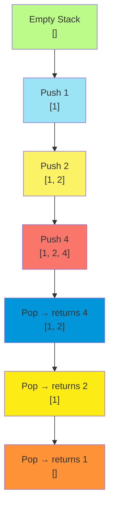
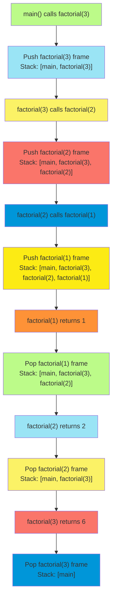
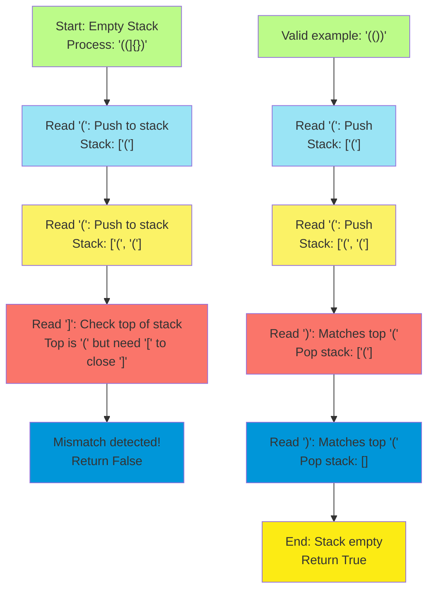
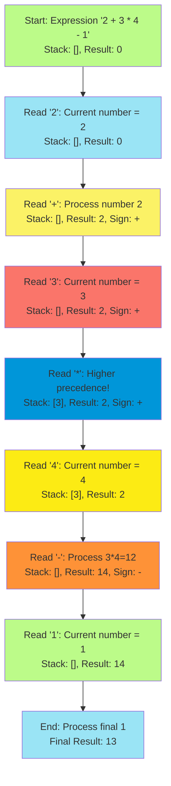
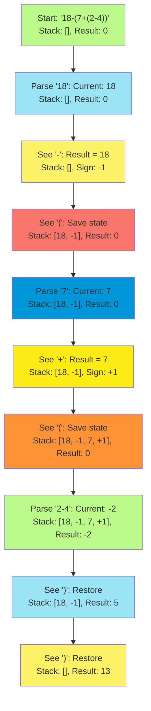

# C-7: Stacks - Last-In-First-Out Data Structure and Applications

1. Theoretical Foundations of Stack Data Structure
    - LIFO Principle and Core Operations
    - Stack Operations Time Complexity Analysis
    - Memory Management and Function Call Stack
    - Stack vs Other Linear Data Structures
2. Nested Structure Processing Applications
    - Parentheses Validation and Matching Algorithms
    - Expression Parsing and Bracket Management
    - Nested Structure Recognition Patterns
    - Hash Map Integration for Multi-Type Validation
3. Mathematical Expression Evaluation
    - Arithmetic Expression Processing Without Parentheses
    - Sign Handling and Number Building Techniques
    - Multi-Digit Number Construction Algorithms
    - Nested Expression Evaluation with Stack Management
4. Monotonic Stack Applications and Patterns
    - Next Larger Element Problem Solutions
    - Candidate Management and Elimination Strategies
    - Stack-Based Optimization for Array Traversal
    - Monotonic Decreasing Order Maintenance
5. Advanced Stack-Based Problem Solving
    - Stack State Preservation and Restoration
    - Recursive Algorithm Conversion to Iterative
    - Complex Expression Evaluation with Multiple Operators
    - Stack-Based Parsing and Validation Techniques

#### Theoretical Foundations of Stack Data Structure

##### LIFO Principle and Core Operations

Understanding the stack data structure begins with grasping its fundamental organizing principle: Last-In-First-Out,
commonly abbreviated as LIFO. This principle governs every interaction with a stack and forms the conceptual foundation
for all stack-based algorithms and applications.

Imagine a stack of dinner plates in a cafeteria. When you add a new plate, it goes on top of the existing stack. When
someone needs a plate, they naturally take the one from the top. This physical analogy perfectly captures the essence of
the stack data structure - elements are added and removed from the same end, which we call the "top" of the stack.

The mathematical elegance of the LIFO principle lies in its simplicity and predictability. If we represent a stack as a
sequence $S = [s_1, s_2, ..., s_n]$ where $s_n$ is the top element, then every operation maintains this ordering
relationship. When we add (push) a new element $x$, our stack becomes $S' = [s_1, s_2, ..., s_n, x]$. When we remove
(pop) an element, we get back $x$ and our stack returns to $S = [s_1, s_2, ..., s_n]$.



The core operations that define stack behavior are remarkably straightforward, yet their combination enables
sophisticated algorithmic solutions. The **push** operation adds an element to the top of the stack, increasing the
stack size by one. The **pop** operation removes and returns the top element, decreasing the stack size by one. The
**peek** (or **top**) operation allows us to examine the top element without removing it, while **isEmpty** tests
whether the stack contains any elements.

Consider how these operations interact in a practical sequence. Starting with an empty stack, we might push the values
5, 3, and 7 in sequence. Our stack now contains $[5, 3, 7]$ with 7 at the top. If we pop once, we get 7 back and our
stack becomes $[5, 3]$. If we peek, we see 3 without changing the stack. This predictable behavior makes stacks
invaluable for problems requiring ordered processing or temporary storage with guaranteed retrieval order.

**Python Implementation:**

```python
class Stack:
    """
    Implementation of stack data structure using Python list.

    The LIFO principle is maintained through careful use of list operations,
    where we only add and remove elements from the end of the list.
    """

    def __init__(self):
        """Initialize an empty stack using a list as the underlying storage."""
        self._items = []

    def push(self, item):
        """
        Add an item to the top of the stack.

        Time Complexity: O(1) - appending to end of list is constant time
        """
        self._items.append(item)

    def pop(self):
        """
        Remove and return the top item from the stack.

        Time Complexity: O(1) - removing from end of list is constant time
        Raises: IndexError if stack is empty
        """
        if self.is_empty():
            raise IndexError("Cannot pop from empty stack")
        return self._items.pop()

    def peek(self):
        """
        Return the top item without removing it.

        Time Complexity: O(1) - accessing last element is constant time
        Raises: IndexError if stack is empty
        """
        if self.is_empty():
            raise IndexError("Cannot peek at empty stack")
        return self._items[-1]

    def is_empty(self):
        """
        Check if the stack is empty.

        Time Complexity: O(1)
        """
        return len(self._items) == 0

    def size(self):
        """
        Return the number of items in the stack.

        Time Complexity: O(1)
        """
        return len(self._items)

    def __str__(self):
        """String representation showing stack from bottom to top."""
        return f"Stack(bottom -> top): {self._items}"

def demonstrate_stack_operations():
    """
    Educational demonstration of stack operations and LIFO behavior.
    """
    print("Stack Operations Demonstration")
    print("=" * 35)

    # Create a new stack
    stack = Stack()
    print(f"1. Created empty stack: {stack}")
    print(f"   Is empty: {stack.is_empty()}")

    # Push operations
    values_to_push = [5, 3, 7, 1]
    for value in values_to_push:
        stack.push(value)
        print(f"2. Pushed {value}: {stack}")
        print(f"   Top element (peek): {stack.peek()}")
        print(f"   Size: {stack.size()}")

    print(f"\nDemonstrating LIFO behavior:")
    print("=" * 30)

    # Pop operations to show LIFO behavior
    original_size = stack.size()
    for i in range(original_size):
        top_element = stack.pop()
        print(f"3. Popped {top_element}: {stack}")
        if not stack.is_empty():
            print(f"   New top element: {stack.peek()}")
        else:
            print(f"   Stack is now empty")

    print(f"\nObservation: Elements came out in reverse order!")
    print(f"Pushed order: {values_to_push}")
    print(f"Popped order: [1, 7, 3, 5] (reverse)")

# Run the demonstration
demonstrate_stack_operations()
```

**Java Implementation:**

```java
import java.util.ArrayList;
import java.util.EmptyStackException;

public class Stack<T> {
    private ArrayList<T> items;

    /**
     * Initialize an empty stack using ArrayList as underlying storage.
     * ArrayList provides the dynamic sizing we need for stack operations.
     */
    public Stack() {
        this.items = new ArrayList<>();
    }

    /**
     * Add an item to the top of the stack.
     *
     * @param item the item to push onto the stack
     * Time Complexity: O(1) amortized
     */
    public void push(T item) {
        items.add(item);
    }

    /**
     * Remove and return the top item from the stack.
     *
     * @return the top item from the stack
     * @throws EmptyStackException if the stack is empty
     * Time Complexity: O(1)
     */
    public T pop() {
        if (isEmpty()) {
            throw new EmptyStackException();
        }
        return items.remove(items.size() - 1);
    }

    /**
     * Return the top item without removing it.
     *
     * @return the top item from the stack
     * @throws EmptyStackException if the stack is empty
     * Time Complexity: O(1)
     */
    public T peek() {
        if (isEmpty()) {
            throw new EmptyStackException();
        }
        return items.get(items.size() - 1);
    }

    /**
     * Check if the stack is empty.
     *
     * @return true if the stack contains no elements
     * Time Complexity: O(1)
     */
    public boolean isEmpty() {
        return items.isEmpty();
    }

    /**
     * Return the number of items in the stack.
     *
     * @return the size of the stack
     * Time Complexity: O(1)
     */
    public int size() {
        return items.size();
    }

    @Override
    public String toString() {
        return "Stack(bottom -> top): " + items.toString();
    }
}
```

**C++ Implementation:**

```cpp
#include <vector>
#include <stdexcept>
#include <iostream>

template<typename T>
class Stack {
private:
    std::vector<T> items;

public:
    /**
     * Initialize an empty stack using vector as underlying storage.
     * Vector provides efficient push_back and pop_back operations.
     */
    Stack() = default;

    /**
     * Add an item to the top of the stack.
     *
     * @param item the item to push onto the stack
     * Time Complexity: O(1) amortized
     */
    void push(const T& item) {
        items.push_back(item);
    }

    /**
     * Remove and return the top item from the stack.
     *
     * @return the top item from the stack
     * @throws std::runtime_error if the stack is empty
     * Time Complexity: O(1)
     */
    T pop() {
        if (isEmpty()) {
            throw std::runtime_error("Cannot pop from empty stack");
        }
        T top_item = items.back();
        items.pop_back();
        return top_item;
    }

    /**
     * Return the top item without removing it.
     *
     * @return the top item from the stack
     * @throws std::runtime_error if the stack is empty
     * Time Complexity: O(1)
     */
    const T& peek() const {
        if (isEmpty()) {
            throw std::runtime_error("Cannot peek at empty stack");
        }
        return items.back();
    }

    /**
     * Check if the stack is empty.
     *
     * @return true if the stack contains no elements
     * Time Complexity: O(1)
     */
    bool isEmpty() const {
        return items.empty();
    }

    /**
     * Return the number of items in the stack.
     *
     * @return the size of the stack
     * Time Complexity: O(1)
     */
    size_t size() const {
        return items.size();
    }
};
```

##### Stack Operations Time Complexity Analysis

The efficiency of stack operations forms a crucial part of understanding why stacks are so valuable in algorithm design.
Each fundamental operation achieves constant time complexity, which means the operation time doesn't grow with the size
of the stack. This efficiency property makes stacks suitable for use in performance-critical applications and as
building blocks for more complex algorithms.

Let's examine why each operation achieves $O(1)$ time complexity. The **push** operation appends an element to the end
of our underlying storage structure (typically a dynamic array or linked list). In most implementations, adding to the
end of a dynamic array takes constant time because we simply place the new element at the next available position and
increment our size counter.

The **pop** operation removes the last element, which also takes constant time since we only need to decrement our size
counter and return the element at that position. We don't need to shift other elements or reorganize the data structure
in any way.

The **peek** operation simply accesses the last element without modification, which is clearly a constant-time operation
since array access by index is $O(1)$.

The **isEmpty** check compares the size counter to zero, another constant-time operation.

```python
def analyze_stack_performance():
    """
    Demonstrate and analyze the time complexity of stack operations
    through practical measurement and theoretical analysis.
    """
    import time

    def measure_operation_time(operation_func, stack, iterations=10000):
        """Measure the average time for a stack operation."""
        start_time = time.perf_counter()

        for _ in range(iterations):
            operation_func(stack)

        end_time = time.perf_counter()
        return (end_time - start_time) / iterations

    print("Stack Performance Analysis")
    print("=" * 30)

    # Test with different stack sizes to verify O(1) complexity
    stack_sizes = [100, 1000, 10000, 100000]

    for size in stack_sizes:
        # Prepare stack of given size
        test_stack = Stack()
        for i in range(size):
            test_stack.push(i)

        # Measure push operation time
        push_time = measure_operation_time(
            lambda s: s.push(999),
            test_stack,
            1000
        )

        # Measure peek operation time
        peek_time = measure_operation_time(
            lambda s: s.peek(),
            test_stack,
            10000
        )

        print(f"Stack size: {size:6d}")
        print(f"  Push time: {push_time*1000000:.2f} microseconds")
        print(f"  Peek time: {peek_time*1000000:.2f} microseconds")
        print(f"  isEmpty time: constant (size comparison)")

        # Clean up - pop added elements
        test_stack.pop()

    print(f"\nTime Complexity Summary:")
    print(f"- Push: O(1) - constant time regardless of stack size")
    print(f"- Pop: O(1) - constant time regardless of stack size")
    print(f"- Peek: O(1) - constant time regardless of stack size")
    print(f"- isEmpty: O(1) - constant time regardless of stack size")
    print(f"- Size: O(1) - constant time regardless of stack size")

analyze_stack_performance()
```

The space complexity analysis is equally important. A stack storing $n$ elements requires $O(n)$ space, which is optimal
since we need to store each element somewhere. The space overhead for the stack operations themselves is $O(1)$ - we
don't need additional space that grows with the stack size to perform any of the fundamental operations.

This efficiency profile makes stacks particularly attractive for algorithms that need frequent additions and removals of
elements in LIFO order. The predictable constant-time performance allows algorithm designers to reason about overall
complexity without worrying about the stack operations becoming a bottleneck.

##### Memory Management and Function Call Stack

Understanding how stacks operate in memory management, particularly in function call management, provides crucial
insight into both the practical importance of stacks and their natural fit for solving certain types of problems. Every
time a program calls a function, the system uses a call stack to manage the execution context, making this one of the
most fundamental applications of stack data structure in computer science.

When a function is called, the program must remember where to return control after the function completes. Additionally,
it needs to preserve the current state of variables and maintain space for the function's local variables and
parameters. This information collectively forms what we call a "stack frame" or "activation record."

The call stack manages these frames using the LIFO principle. When function A calls function B, the system pushes B's
stack frame onto the call stack. If function B then calls function C, C's frame is pushed on top of B's frame. When C
completes, its frame is popped, and control returns to B. When B completes, its frame is popped, and control returns to
A.



Consider how this call stack mechanism naturally handles the complexity of recursive function calls. Each recursive call
creates a new stack frame, preserving the unique state of variables at that level of recursion. The stack automatically
manages the proper order of returns, ensuring that each recursive call completes in the reverse order from which it was
made.

**Python Implementation Demonstrating Call Stack Concepts:**

```python
def demonstrate_call_stack_behavior():
    """
    Simulate and visualize call stack behavior to understand
    how function calls are managed using stack principles.
    """

    class CallStackSimulator:
        """Simulate the call stack to visualize function call management."""

        def __init__(self):
            self.call_stack = []
            self.step_count = 0

        def push_frame(self, function_name, parameters, local_vars=None):
            """Simulate pushing a function frame onto the call stack."""
            frame = {
                'function': function_name,
                'parameters': parameters,
                'local_vars': local_vars or {},
                'step': self.step_count
            }
            self.call_stack.append(frame)
            self.step_count += 1
            self.print_stack_state(f"CALL {function_name}{parameters}")

        def pop_frame(self, return_value=None):
            """Simulate popping a function frame from the call stack."""
            if self.call_stack:
                frame = self.call_stack.pop()
                self.step_count += 1
                self.print_stack_state(f"RETURN from {frame['function']} -> {return_value}")
                return frame
            return None

        def print_stack_state(self, action):
            """Print current state of the call stack."""
            print(f"\nStep {self.step_count}: {action}")
            print("Call Stack (bottom to top):")
            if not self.call_stack:
                print("  [Empty]")
            else:
                for i, frame in enumerate(self.call_stack):
                    print(f"  {i}: {frame['function']}{frame['parameters']}")

    def simulate_factorial_calls(n):
        """Simulate factorial function calls using our call stack simulator."""
        simulator = CallStackSimulator()

        def factorial_simulation(n, simulator):
            """Recursive factorial with call stack simulation."""
            # Push current function call onto stack
            simulator.push_frame('factorial', f'({n})', {'n': n})

            if n <= 1:
                # Base case - return 1
                result = 1
                simulator.pop_frame(result)
                return result
            else:
                # Recursive case
                recursive_result = factorial_simulation(n - 1, simulator)
                result = n * recursive_result
                simulator.pop_frame(result)
                return result

        print("Simulating factorial(3) to demonstrate call stack behavior")
        print("=" * 60)

        final_result = factorial_simulation(n, simulator)
        print(f"\nFinal result: factorial({n}) = {final_result}")

        return final_result

    # Run the simulation
    simulate_factorial_calls(3)

    print(f"\n" + "="*60)
    print("Key Insights about Call Stack Management:")
    print("="*60)
    print("1. Each function call creates a new stack frame")
    print("2. Frames are pushed in the order functions are called")
    print("3. Frames are popped in reverse order (LIFO)")
    print("4. Each frame preserves local variables and parameters")
    print("5. Return addresses are implicitly managed by the stack")
    print("6. Stack overflow occurs when too many frames accumulate")

demonstrate_call_stack_behavior()
```

The call stack has practical limitations that directly impact program design. Each stack frame consumes memory, and the
total stack space is limited by the system. When recursive functions call themselves too deeply, or when there's an
infinite recursion, the call stack can exceed its allocated memory, resulting in a "stack overflow" error.

Understanding call stack behavior helps explain why iterative solutions sometimes outperform recursive ones. Recursive
solutions that create many stack frames consume more memory and involve more function call overhead. However, recursive
solutions often provide clearer, more intuitive code for problems with naturally recursive structure.

This connection between function calls and stack data structure also explains why we can often convert recursive
algorithms to iterative ones using explicit stacks. By manually managing a stack to track the information that would
normally be stored in function call frames, we can simulate the behavior of recursion while maintaining more control
over memory usage.

##### Stack vs Other Linear Data Structures

Comparing stacks with other linear data structures illuminates the unique characteristics that make stacks particularly
suitable for specific types of problems. Understanding these distinctions helps in selecting the appropriate data
structure for different algorithmic challenges and provides insight into why certain algorithms naturally gravitate
toward stack-based solutions.

The most fundamental distinction lies in access patterns. Arrays and lists provide random access to elements - you can
directly access any element by its index in constant time. Stacks, conversely, provide only sequential access through
the top element. This restriction, rather than being a limitation, becomes a powerful constraint that naturally models
many real-world scenarios and algorithmic requirements.

Consider the differences in operation complexity and access patterns:

```python
def compare_data_structures():
    """
    Comprehensive comparison of stack with other linear data structures
    to highlight their distinct characteristics and use cases.
    """

    class DataStructureComparison:
        """Compare operations across different linear data structures."""

        def __init__(self):
            # Initialize different data structures with same initial data
            initial_data = [1, 2, 3, 4, 5]

            self.array = list(initial_data)  # Python list (dynamic array)
            self.stack = Stack()
            for item in initial_data:
                self.stack.push(item)

            from collections import deque
            self.queue = deque(initial_data)  # Queue implementation
            self.deque = deque(initial_data)  # Double-ended queue

        def demonstrate_access_patterns(self):
            """Show how different structures provide access to elements."""
            print("Access Pattern Comparison")
            print("=" * 30)

            # Array: Random access by index
            print("Array (Random Access):")
            print(f"  First element (index 0): {self.array[0]}")
            print(f"  Middle element (index 2): {self.array[2]}")
            print(f"  Last element (index -1): {self.array[-1]}")
            print(f"  Any element in O(1) time")

            # Stack: Only top access
            print(f"\nStack (Top-only Access):")
            print(f"  Top element: {self.stack.peek()}")
            print(f"  Cannot directly access middle or bottom elements")
            print(f"  Must pop elements to reach lower ones")

            # Queue: Front and rear access
            print(f"\nQueue (Front and Rear Access):")
            print(f"  Front element: {self.queue[0]}")
            print(f"  Rear element: {self.queue[-1]}")
            print(f"  Primarily FIFO operations")

            # Deque: Both ends access
            print(f"\nDeque (Both Ends Access):")
            print(f"  Left end: {self.deque[0]}")
            print(f"  Right end: {self.deque[-1]}")
            print(f"  Efficient operations at both ends")

        def demonstrate_insertion_patterns(self):
            """Show insertion capabilities and complexities."""
            print(f"\n" + "="*50)
            print("Insertion Pattern Comparison")
            print("="*50)

            print("Array:")
            print("  - Insert at end: O(1) amortized")
            print("  - Insert at beginning: O(n) - requires shifting")
            print("  - Insert at middle: O(n) - requires shifting")
            print("  - Insert at any position by index")

            print(f"\nStack:")
            print("  - Push (insert at top): O(1)")
            print("  - Cannot insert at arbitrary positions")
            print("  - Insertion only at top maintains LIFO property")

            print(f"\nQueue:")
            print("  - Enqueue (insert at rear): O(1)")
            print("  - Cannot insert at arbitrary positions")
            print("  - Insertion at rear maintains FIFO property")

            print(f"\nDeque:")
            print("  - Insert at left end: O(1)")
            print("  - Insert at right end: O(1)")
            print("  - More flexible than stack or queue")

        def demonstrate_removal_patterns(self):
            """Show removal capabilities and complexities."""
            print(f"\n" + "="*50)
            print("Removal Pattern Comparison")
            print("="*50)

            print("Array:")
            print("  - Remove from end: O(1)")
            print("  - Remove from beginning: O(n) - requires shifting")
            print("  - Remove from middle: O(n) - requires shifting")
            print("  - Remove from any position by index")

            print(f"\nStack:")
            print("  - Pop (remove from top): O(1)")
            print("  - Cannot remove from arbitrary positions")
            print("  - Removal only from top maintains LIFO property")

            print(f"\nQueue:")
            print("  - Dequeue (remove from front): O(1)")
            print("  - Cannot remove from arbitrary positions")
            print("  - Removal from front maintains FIFO property")

            print(f"\nDeque:")
            print("  - Remove from left end: O(1)")
            print("  - Remove from right end: O(1)")
            print("  - Most flexible removal options")

        def demonstrate_use_case_scenarios(self):
            """Show typical use cases for each data structure."""
            print(f"\n" + "="*50)
            print("Typical Use Case Scenarios")
            print("="*50)

            print("Array/List - Use when you need:")
            print("  ✓ Random access to elements by index")
            print("  ✓ Mathematical operations on sequences")
            print("  ✓ Sorting and searching algorithms")
            print("  ✓ General-purpose sequential data storage")

            print(f"\nStack - Use when you need:")
            print("  ✓ Reverse order processing (LIFO)")
            print("  ✓ Nested structure management (parentheses, recursion)")
            print("  ✓ Backtracking algorithms")
            print("  ✓ Expression evaluation and parsing")

            print(f"\nQueue - Use when you need:")
            print("  ✓ First-come-first-served processing (FIFO)")
            print("  ✓ Breadth-first search algorithms")
            print("  ✓ Task scheduling and buffering")
            print("  ✓ Resource sharing management")

            print(f"\nDeque - Use when you need:")
            print("  ✓ Efficient insertion/removal at both ends")
            print("  ✓ Sliding window algorithms")
            print("  ✓ Palindrome checking")
            print("  ✓ Double-ended queue operations")

    # Run comprehensive comparison
    comparison = DataStructureComparison()
    comparison.demonstrate_access_patterns()
    comparison.demonstrate_insertion_patterns()
    comparison.demonstrate_removal_patterns()
    comparison.demonstrate_use_case_scenarios()

compare_data_structures()
```

The restrictions imposed by stack operations create algorithmic advantages in specific scenarios. When a problem
naturally involves processing elements in reverse order, or when you need to maintain nested relationships, the stack's
LIFO constraint becomes a feature rather than a limitation. The stack automatically manages the ordering logic that
would require explicit tracking in other data structures.

Memory access patterns also differ significantly between these structures. Arrays provide excellent spatial locality
since elements are stored contiguously in memory, leading to efficient cache usage. Stacks implemented using arrays
inherit this property, while linked-list-based stacks may have poorer cache performance but offer more predictable
memory allocation patterns.

The choice between these data structures often comes down to understanding the access patterns required by your
algorithm. If you need to frequently access elements in the middle of your data structure, arrays are superior. If your
algorithm naturally processes elements in LIFO order, stacks provide both conceptual clarity and implementation
efficiency.

Understanding these distinctions prepares us for recognizing when stack-based solutions are appropriate and helps
explain why certain algorithms that seem complex become elegant when viewed through the lens of stack operations.

#### Nested Structure Processing Applications

##### Parentheses Validation and Matching Algorithms

The problem of validating parentheses expressions represents one of the most elegant and instructive applications of
stack data structures. This problem demonstrates how the LIFO principle naturally aligns with the nested structure of
mathematical and programming language expressions, making stacks the ideal tool for parsing and validation tasks.

Understanding parentheses validation begins with recognizing the fundamental properties that define a valid expression.
Every opening parenthesis must have a corresponding closing parenthesis of the same type. No closing parenthesis can
appear before its matching opening parenthesis. These constraints create a natural nesting structure where the most
recently opened parenthesis must be the first to be closed.

Consider the expression `"((]{})"`. Reading from left to right, we encounter two opening parentheses `((`, then a
closing bracket `]`. The closing bracket should close the most recent opening parenthesis, which is `(`, but brackets
don't match parentheses. This mismatch makes the expression invalid. The key insight is that we need to track the most
recent unclosed opening parenthesis, which suggests using a stack.



The mathematical elegance of this approach lies in how it transforms a potentially complex parsing problem into a simple
pattern-matching algorithm. We can represent the validation process as a state machine where the stack represents our
current nesting state, and each character in the input string represents a state transition.

Let $S$ be our stack and $c$ be the current character. For opening parentheses $c \in {(, [, {}$, we perform
$S \leftarrow S \cup {c}$ (push operation). For closing parentheses $c \in {), ], }}$, we check if the top of $S$
matches $c$, and if so, we perform $S \leftarrow S \setminus {\text{top}(S)}$ (pop operation).

**Python Implementation:**

```python
def valid_parentheses_expression(s):
    """
    Determine if a string of parentheses forms a valid expression.

    A valid expression requires:
    1. Every opening parenthesis has a corresponding closing parenthesis
    2. Parentheses are properly nested (no closing before its opening)
    3. Parentheses types match correctly

    Time Complexity: O(n) where n is the length of the string
    Space Complexity: O(n) in worst case when all characters are opening parentheses
    """
    # Mapping of opening to closing parentheses
    parentheses_map = {'(': ')', '[': ']', '{': '}'}
    stack = []

    for char in s:
        # If opening parenthesis, push to stack
        if char in parentheses_map:
            stack.append(char)
        # If closing parenthesis, check if it matches the most recent opening
        else:
            # Check if stack is empty or if top doesn't match
            if not stack or parentheses_map[stack[-1]] != char:
                return False
            stack.pop()

    # Valid if all opening parentheses were closed
    return len(stack) == 0

def demonstrate_parentheses_validation():
    """
    Educational demonstration of parentheses validation algorithm
    with step-by-step trace of stack operations.
    """

    def trace_validation(s):
        """Trace the validation process step by step."""
        print(f"\nTracing validation of: '{s}'")
        print("-" * 40)

        parentheses_map = {'(': ')', '[': ']', '{': '}'}
        stack = []

        for i, char in enumerate(s):
            print(f"Step {i+1}: Processing '{char}'")
            print(f"  Stack before: {stack}")

            if char in parentheses_map:
                stack.append(char)
                print(f"  → Opening parenthesis: push '{char}'")
            else:
                if not stack:
                    print(f"  → Closing '{char}' but stack is empty: INVALID")
                    return False
                elif parentheses_map[stack[-1]] != char:
                    expected = parentheses_map[stack[-1]]
                    print(f"  → Expected '{expected}' to close '{stack[-1]}', got '{char}': INVALID")
                    return False
                else:
                    matching_open = stack.pop()
                    print(f"  → Closing '{char}' matches '{matching_open}': pop stack")

            print(f"  Stack after: {stack}")

        is_valid = len(stack) == 0
        print(f"\nFinal result: {'VALID' if is_valid else 'INVALID'}")
        if not is_valid:
            print(f"Reason: {len(stack)} unclosed opening parentheses remain")

        return is_valid

    # Test cases demonstrating different scenarios
    test_cases = [
        ("()", "Simple valid case"),
        ("()[]{}", "Multiple types, all valid"),
        ("([{}])", "Nested structure, valid"),
        ("([)]", "Interleaved, invalid"),
        ("((", "Unclosed opening parentheses"),
        ("))", "Extra closing parentheses"),
        ("", "Empty string (valid)")
    ]

    print("Parentheses Validation Demonstration")
    print("=" * 45)

    for expression, description in test_cases:
        print(f"\nTest Case: {description}")
        result = trace_validation(expression)
        actual_result = valid_parentheses_expression(expression)
        assert result == actual_result, "Trace and actual results don't match!"

demonstrate_parentheses_validation()
```

**Java Implementation:**

```java
import java.util.*;

public class ParenthesesValidator {
    /**
     * Validates parentheses expression using stack-based approach.
     *
     * @param s string containing parentheses characters
     * @return true if the expression is valid, false otherwise
     */
    public static boolean isValid(String s) {
        Map<Character, Character> parenthesesMap = new HashMap<>();
        parenthesesMap.put('(', ')');
        parenthesesMap.put('[', ']');
        parenthesesMap.put('{', '}');

        Stack<Character> stack = new Stack<>();

        for (char c : s.toCharArray()) {
            if (parenthesesMap.containsKey(c)) {
                // Opening parenthesis - push to stack
                stack.push(c);
            } else {
                // Closing parenthesis - check if it matches top of stack
                if (stack.isEmpty() || !parenthesesMap.get(stack.peek()).equals(c)) {
                    return false;
                }
                stack.pop();
            }
        }

        return stack.isEmpty();
    }

    /**
     * Enhanced validation with detailed tracing for educational purposes.
     */
    public static boolean isValidWithTrace(String s) {
        System.out.println("Validating: \"" + s + "\"");

        Map<Character, Character> parenthesesMap = new HashMap<>();
        parenthesesMap.put('(', ')');
        parenthesesMap.put('[', ']');
        parenthesesMap.put('{', '}');

        Stack<Character> stack = new Stack<>();

        for (int i = 0; i < s.length(); i++) {
            char c = s.charAt(i);
            System.out.printf("Step %d: Processing '%c'\n", i + 1, c);
            System.out.println("  Stack before: " + stack);

            if (parenthesesMap.containsKey(c)) {
                stack.push(c);
                System.out.println("  → Opening parenthesis: pushed '" + c + "'");
            } else {
                if (stack.isEmpty()) {
                    System.out.println("  → Closing '" + c + "' but stack is empty: INVALID");
                    return false;
                } else if (!parenthesesMap.get(stack.peek()).equals(c)) {
                    char expected = parenthesesMap.get(stack.peek());
                    System.out.println("  → Expected '" + expected + "' to close '" +
                                     stack.peek() + "', got '" + c + "': INVALID");
                    return false;
                } else {
                    char matching = stack.pop();
                    System.out.println("  → Closing '" + c + "' matches '" + matching + "': popped");
                }
            }

            System.out.println("  Stack after: " + stack);
        }

        boolean isValid = stack.isEmpty();
        System.out.println("Final result: " + (isValid ? "VALID" : "INVALID"));
        return isValid;
    }
}
```

**C++ Implementation:**

```cpp
#include <stack>
#include <unordered_map>
#include <string>
#include <iostream>

class ParenthesesValidator {
public:
    /**
     * C++ implementation of parentheses validation using STL stack.
     */
    static bool isValid(const std::string& s) {
        std::unordered_map<char, char> parenthesesMap = {
            {'(', ')'},
            {'[', ']'},
            {'{', '}'}
        };

        std::stack<char> stack;

        for (char c : s) {
            if (parenthesesMap.find(c) != parenthesesMap.end()) {
                // Opening parenthesis
                stack.push(c);
            } else {
                // Closing parenthesis
                if (stack.empty() || parenthesesMap[stack.top()] != c) {
                    return false;
                }
                stack.pop();
            }
        }

        return stack.empty();
    }
};
```

##### Expression Parsing and Bracket Management

Building upon parentheses validation, expression parsing represents a more sophisticated application of stack-based
algorithms that demonstrates how stacks can manage complex nested structures with multiple types of delimiters and
operational precedence. This extends our understanding from simple validation to active computation and evaluation.

The fundamental challenge in expression parsing lies in respecting operator precedence and associativity rules while
handling nested expressions enclosed in various types of brackets. Consider the expression `"3 + (4 * [2 + {5 - 1}])"`.
This expression contains multiple levels of nesting with different bracket types, and each nested sub-expression must be
evaluated before it can be used in the outer expression.

The stack-based approach for parsing maintains the natural order of operations by deferring the evaluation of outer
expressions until inner expressions are completely resolved. This mirrors how mathematical notation is designed to be
interpreted by humans - we naturally process the innermost expressions first.

```python
def enhanced_expression_parser():
    """
    Advanced expression parsing that handles multiple bracket types,
    operator precedence, and nested structures.
    """

    class ExpressionParser:
        """
        Comprehensive expression parser using stack-based algorithms.
        Handles parentheses, operator precedence, and complex nesting.
        """

        def __init__(self):
            self.bracket_pairs = {'(': ')', '[': ']', '{': '}'}
            self.operator_precedence = {'+': 1, '-': 1, '*': 2, '/': 2, '^': 3}
            self.right_associative = {'^'}  # Right-associative operators

        def is_opening_bracket(self, char):
            """Check if character is an opening bracket."""
            return char in self.bracket_pairs

        def is_closing_bracket(self, char):
            """Check if character is a closing bracket."""
            return char in self.bracket_pairs.values()

        def brackets_match(self, opening, closing):
            """Check if opening and closing brackets match."""
            return self.bracket_pairs.get(opening) == closing

        def validate_bracket_structure(self, expression):
            """
            Validate that brackets are properly matched and nested.
            Returns (is_valid, error_message, error_position).
            """
            stack = []

            for i, char in enumerate(expression):
                if self.is_opening_bracket(char):
                    stack.append((char, i))
                elif self.is_closing_bracket(char):
                    if not stack:
                        return False, f"Unexpected closing bracket '{char}'", i

                    opening_char, opening_pos = stack.pop()
                    if not self.brackets_match(opening_char, char):
                        expected = self.bracket_pairs[opening_char]
                        return False, f"Expected '{expected}' to close '{opening_char}' at position {opening_pos}, got '{char}'", i

            if stack:
                unclosed_char, unclosed_pos = stack[-1]
                return False, f"Unclosed '{unclosed_char}' at position {unclosed_pos}", unclosed_pos

            return True, "Valid bracket structure", -1

        def tokenize_expression(self, expression):
            """
            Convert expression string into tokens (numbers, operators, brackets).
            """
            tokens = []
            i = 0

            while i < len(expression):
                char = expression[i]

                if char.isspace():
                    i += 1
                    continue

                if char.isdigit() or char == '.':
                    # Parse number (including decimals)
                    num_str = ''
                    while i < len(expression) and (expression[i].isdigit() or expression[i] == '.'):
                        num_str += expression[i]
                        i += 1
                    tokens.append(('NUMBER', float(num_str)))
                elif char in self.operator_precedence:
                    tokens.append(('OPERATOR', char))
                    i += 1
                elif self.is_opening_bracket(char) or self.is_closing_bracket(char):
                    tokens.append(('BRACKET', char))
                    i += 1
                else:
                    raise ValueError(f"Unknown character '{char}' at position {i}")

            return tokens

        def infix_to_postfix(self, tokens):
            """
            Convert infix notation to postfix (Reverse Polish Notation) using Shunting Yard algorithm.
            This demonstrates advanced stack usage for expression parsing.
            """
            output_queue = []
            operator_stack = []

            for token_type, value in tokens:
                if token_type == 'NUMBER':
                    output_queue.append(value)

                elif token_type == 'OPERATOR':
                    # Pop operators with higher or equal precedence (considering associativity)
                    while (operator_stack and
                           operator_stack[-1] != '(' and
                           operator_stack[-1] in self.operator_precedence and
                           (self.operator_precedence[operator_stack[-1]] > self.operator_precedence[value] or
                            (self.operator_precedence[operator_stack[-1]] == self.operator_precedence[value] and
                             value not in self.right_associative))):
                        output_queue.append(operator_stack.pop())

                    operator_stack.append(value)

                elif token_type == 'BRACKET':
                    if self.is_opening_bracket(value):
                        operator_stack.append(value)
                    else:  # Closing bracket
                        # Pop until matching opening bracket
                        while operator_stack and not self.is_opening_bracket(operator_stack[-1]):
                            output_queue.append(operator_stack.pop())

                        if not operator_stack:
                            raise ValueError("Mismatched brackets")

                        # Remove the opening bracket
                        operator_stack.pop()

            # Pop remaining operators
            while operator_stack:
                if self.is_opening_bracket(operator_stack[-1]):
                    raise ValueError("Mismatched brackets")
                output_queue.append(operator_stack.pop())

            return output_queue

        def evaluate_postfix(self, postfix_tokens):
            """
            Evaluate postfix expression using stack.
            """
            stack = []

            for token in postfix_tokens:
                if isinstance(token, (int, float)):
                    stack.append(token)
                else:  # Operator
                    if len(stack) < 2:
                        raise ValueError(f"Insufficient operands for operator '{token}'")

                    b = stack.pop()
                    a = stack.pop()

                    if token == '+':
                        result = a + b
                    elif token == '-':
                        result = a - b
                    elif token == '*':
                        result = a * b
                    elif token == '/':
                        if b == 0:
                            raise ValueError("Division by zero")
                        result = a / b
                    elif token == '^':
                        result = a ** b
                    else:
                        raise ValueError(f"Unknown operator '{token}'")

                    stack.append(result)

            if len(stack) != 1:
                raise ValueError("Invalid expression: multiple values remain")

            return stack[0]

        def parse_and_evaluate(self, expression):
            """
            Complete parsing and evaluation pipeline with detailed tracing.
            """
            print(f"Parsing expression: '{expression}'")
            print("=" * 50)

            # Step 1: Validate bracket structure
            is_valid, message, pos = self.validate_bracket_structure(expression)
            print(f"1. Bracket validation: {message}")
            if not is_valid:
                return None

            # Step 2: Tokenize
            tokens = self.tokenize_expression(expression)
            print(f"2. Tokens: {tokens}")

            # Step 3: Convert to postfix
            postfix = self.infix_to_postfix(tokens)
            print(f"3. Postfix notation: {postfix}")

            # Step 4: Evaluate
            result = self.evaluate_postfix(postfix)
            print(f"4. Final result: {result}")

            return result

    # Demonstration with various complex expressions
    parser = ExpressionParser()

    test_expressions = [
        "3 + 4 * 2",
        "(3 + 4) * 2",
        "3 + (4 * [2 + {5 - 1}])",
        "((2 + 3) * 4) + (5 * 6)",
        "2 ^ 3 ^ 2",  # Right associative
        "3 + 4 * 2 / (1 - 5) ^ 2"
    ]

    for expr in test_expressions:
        print(f"\n" + "="*60)
        try:
            result = parser.parse_and_evaluate(expr)
            print(f"SUCCESS: {expr} = {result}")
        except Exception as e:
            print(f"ERROR: {e}")

enhanced_expression_parser()
```

This advanced parsing demonstrates several key concepts that extend basic parentheses validation:

1. **Multi-type bracket handling**: Different bracket types can be used for grouping, and they must be matched
   correctly.
2. **Operator precedence management**: The stack maintains operators according to their precedence, ensuring correct
   evaluation order.
3. **Shunting Yard algorithm**: This stack-based algorithm converts infix notation to postfix notation, making
   evaluation straightforward.
4. **Error handling and reporting**: The parser provides detailed error messages with position information for
   debugging.

The mathematical foundation underlying this approach is the formal grammar of arithmetic expressions. We can represent
valid expressions using context-free grammar rules, and the stack-based parsing algorithm effectively recognizes strings
that belong to this grammar.

##### Nested Structure Recognition Patterns

The ability to recognize and process nested structures extends far beyond parentheses and mathematical expressions.
Stack-based algorithms excel at identifying and managing any hierarchical structure where inner elements must be
processed before outer elements, or where the most recently opened context must be addressed first.

Understanding nested structure recognition patterns helps us identify when stack-based solutions are appropriate and how
to adapt the basic stack algorithms to more complex scenarios. These patterns appear in programming language parsing,
HTML/XML validation, data serialization formats, and many algorithmic problems that involve hierarchical relationships.

```python
def nested_structure_patterns():
    """
    Comprehensive exploration of nested structure recognition patterns
    using stack-based algorithms across different domains.
    """

    class NestedStructureAnalyzer:
        """
        Analyze and process various types of nested structures using stacks.
        """

        def __init__(self):
            self.patterns = {
                'parentheses': {'open': '(', 'close': ')'},
                'brackets': {'open': '[', 'close': ']'},
                'braces': {'open': '{', 'close': '}'},
                'html_tags': {'pattern': 'tag-based'},
                'nested_lists': {'pattern': 'recursive-structure'},
                'json_objects': {'pattern': 'key-value-nested'}
            }

        def analyze_nesting_depth(self, text, structure_type='parentheses'):
            """
            Analyze the maximum nesting depth and structure of nested elements.
            """
            if structure_type not in ['parentheses', 'brackets', 'braces']:
                raise ValueError("Unsupported structure type for depth analysis")

            pattern = self.patterns[structure_type]
            stack = []
            max_depth = 0
            current_depth = 0
            depth_positions = []

            for i, char in enumerate(text):
                if char == pattern['open']:
                    stack.append((char, i, current_depth))
                    current_depth += 1
                    max_depth = max(max_depth, current_depth)
                    depth_positions.append((i, current_depth, 'open'))
                elif char == pattern['close']:
                    if not stack:
                        return None, f"Unmatched closing '{char}' at position {i}"

                    open_char, open_pos, open_depth = stack.pop()
                    current_depth -= 1
                    depth_positions.append((i, current_depth + 1, 'close'))

            if stack:
                unmatched = stack[-1]
                return None, f"Unmatched opening '{unmatched[0]}' at position {unmatched[1]}"

            return {
                'max_depth': max_depth,
                'is_valid': True,
                'depth_trace': depth_positions
            }, None

        def validate_html_structure(self, html_text):
            """
            Validate HTML tag nesting using stack-based approach.
            This demonstrates pattern recognition for tag-based structures.
            """
            import re

            # Extract all HTML tags
            tag_pattern = r'<(/?)(\w+)(?:\s[^>]*)?>'
            tags = re.findall(tag_pattern, html_text)

            stack = []
            self_closing_tags = {'img', 'br', 'hr', 'input', 'meta', 'link'}

            for i, (is_closing, tag_name) in enumerate(tags):
                tag_name = tag_name.lower()

                if is_closing:  # Closing tag
                    if not stack:
                        return False, f"Unexpected closing tag </{tag_name}>"

                    if stack[-1] != tag_name:
                        return False, f"Mismatched tags: expected </{stack[-1]}>, got </{tag_name}>"

                    stack.pop()
                else:  # Opening tag
                    if tag_name not in self_closing_tags:
                        stack.append(tag_name)

            if stack:
                return False, f"Unclosed tags: {stack}"

            return True, "Valid HTML structure"

        def analyze_nested_function_calls(self, code_text):
            """
            Analyze nested function calls in code to understand call depth and structure.
            """
            stack = []
            function_calls = []
            current_function = None

            i = 0
            while i < len(code_text):
                if code_text[i].isalpha():
                    # Extract function name
                    func_name = ''
                    while i < len(code_text) and (code_text[i].isalnum() or code_text[i] == '_'):
                        func_name += code_text[i]
                        i += 1

                    # Check if this is a function call (followed by opening parenthesis)
                    while i < len(code_text) and code_text[i].isspace():
                        i += 1

                    if i < len(code_text) and code_text[i] == '(':
                        # This is a function call
                        current_function = {
                            'name': func_name,
                            'depth': len(stack),
                            'nested_calls': []
                        }
                        stack.append(current_function)
                        function_calls.append(current_function)

                elif code_text[i] == '(':
                    if current_function:
                        current_function['paren_count'] = current_function.get('paren_count', 0) + 1

                elif code_text[i] == ')':
                    if stack and stack[-1].get('paren_count', 1) == 1:
                        # Function call is complete
                        completed_function = stack.pop()
                        if stack:
                            # This function is nested within another
                            stack[-1]['nested_calls'].append(completed_function['name'])
                    elif stack:
                        stack[-1]['paren_count'] -= 1

                i += 1

            return {
                'max_nesting_depth': max([f['depth'] for f in function_calls]) + 1 if function_calls else 0,
                'function_calls': function_calls,
                'total_functions': len(function_calls)
            }

        def detect_nested_data_structures(self, data_string):
            """
            Detect and analyze nested data structures like JSON, arrays, objects.
            """
            stack = []
            structure_types = []
            nesting_info = []

            for i, char in enumerate(data_string):
                if char in '{[(':
                    structure_type = {'{': 'object', '[': 'array', '(': 'tuple'}[char]
                    stack.append({'type': structure_type, 'start': i, 'char': char})
                    structure_types.append(structure_type)

                elif char in '}])':
                    if not stack:
                        return None, f"Unexpected closing '{char}' at position {i}"

                    opening = stack.pop()
                    expected_closing = {'{': '}', '[': ']', '(': ')'}[opening['char']]

                    if char != expected_closing:
                        return None, f"Mismatched: '{opening['char']}' at {opening['start']} closed by '{char}' at {i}"

                    nesting_info.append({
                        'type': opening['type'],
                        'start': opening['start'],
                        'end': i,
                        'depth': len(stack)
                    })

            if stack:
                return None, f"Unclosed structures: {[s['char'] for s in stack]}"

            return {
                'is_valid': True,
                'structure_types': structure_types,
                'nesting_info': nesting_info,
                'max_depth': max([info['depth'] for info in nesting_info]) + 1 if nesting_info else 0
            }, None

    # Comprehensive demonstration
    analyzer = NestedStructureAnalyzer()

    print("Nested Structure Recognition Patterns")
    print("=" * 45)

    # Test 1: Nesting depth analysis
    print(f"\n1. Nesting Depth Analysis:")
    test_expressions = [
        "((()))",
        "(()((())))",
        "([{}])",
        "((([[[{{{}}}}]]]))"
    ]

    for expr in test_expressions:
        result, error = analyzer.analyze_nesting_depth(expr, 'parentheses')
        if result:
            print(f"   '{expr}': Max depth = {result['max_depth']}")
        else:
            print(f"   '{expr}': ERROR - {error}")

    # Test 2: HTML structure validation
    print(f"\n2. HTML Structure Validation:")
    html_tests = [
        "<div><p>Hello</p></div>",
        "<div><p>Hello</div></p>",  # Invalid
        "<html><body><div><p>Content</p></div></body></html>",
        "<br><hr>"  # Self-closing tags
    ]

    for html in html_tests:
        is_valid, message = analyzer.validate_html_structure(html)
        status = "VALID" if is_valid else "INVALID"
        print(f"   {status}: {html[:30]}... - {message}")

    # Test 3: Nested data structure detection
    print(f"\n3. Nested Data Structure Detection:")
    data_tests = [
        '{"name": "John", "data": [1, 2, {"nested": true}]}',
        '[1, [2, [3, [4]]]]',
        '((1, 2), (3, (4, 5)))',
        '{[}]'  # Invalid
    ]

    for data in data_tests:
        result, error = analyzer.detect_nested_data_structures(data)
        if result:
            print(f"   VALID: Max depth = {result['max_depth']}, Types = {set(result['structure_types'])}")
        else:
            print(f"   INVALID: {error}")

nested_structure_patterns()
```

##### Hash Map Integration for Multi-Type Validation

The integration of hash maps with stack-based validation algorithms represents a sophisticated approach to handling
multiple types of nested structures simultaneously. This combination leverages the constant-time lookup capabilities of
hash maps to efficiently manage different bracket types, operator precedences, or validation rules while maintaining the
LIFO processing order that stacks provide.

Understanding this integration pattern is crucial for building robust parsers and validators that can handle complex,
real-world input formats. The hash map serves as a configuration layer that defines the relationships between different
elements, while the stack manages the processing order and nesting relationships.

```python
def hash_map_stack_integration():
    """
    Advanced demonstration of hash map integration with stack algorithms
    for complex validation and parsing scenarios.
    """

    class MultiTypeValidator:
        """
        Sophisticated validator that handles multiple bracket types, custom rules,
        and complex validation scenarios using hash map configuration.
        """

        def __init__(self):
            # Configuration hash maps for different validation rules
            self.bracket_config = {
                'standard': {
                    '(': {'close': ')', 'type': 'parenthesis', 'precedence': 1},
                    '[': {'close': ']', 'type': 'bracket', 'precedence': 1},
                    '{': {'close': '}', 'type': 'brace', 'precedence': 1}
                },
                'extended': {
                    '(': {'close': ')', 'type': 'parenthesis', 'precedence': 1},
                    '[': {'close': ']', 'type': 'bracket', 'precedence': 2},
                    '{': {'close': '}', 'type': 'brace', 'precedence': 3},
                    '<': {'close': '>', 'type': 'angle', 'precedence': 1},
                    '/*': {'close': '*/', 'type': 'comment', 'precedence': 4},
                    '"""': {'close': '"""', 'type': 'docstring', 'precedence': 5}
                }
            }

            # Validation rules configuration
            self.validation_rules = {
                'strict_nesting': True,  # Inner brackets must close before outer
                'allow_interleaving': False,  # [( )] vs [( ]  )
                'max_depth': float('inf'),
                'type_restrictions': {},  # Which types can contain which other types
                'custom_validators': {}  # Custom validation functions
            }

        def configure_validation_rules(self, **rules):
            """Configure validation behavior using hash map of rules."""
            self.validation_rules.update(rules)

        def add_bracket_type(self, open_char, close_char, bracket_type, precedence=1):
            """Dynamically add new bracket types using hash map configuration."""
            self.bracket_config['extended'][open_char] = {
                'close': close_char,
                'type': bracket_type,
                'precedence': precedence
            }

        def validate_with_rules(self, text, config_name='standard'):
            """
            Advanced validation using hash map configuration and stack processing.
            """
            if config_name not in self.bracket_config:
                raise ValueError(f"Unknown configuration: {config_name}")

            config = self.bracket_config[config_name]
            stack = []
            validation_trace = []
            current_depth = 0
            max_depth_reached = 0

            i = 0
            while i < len(text):
                # Check for multi-character tokens
                found_token = False

                # Check for multi-character opening tokens (like /* or """)
                for open_token in config:
                    if text[i:].startswith(open_token) and len(open_token) > 1:
                        # Multi-character opening token found
                        bracket_info = config[open_token].copy()
                        bracket_info['token'] = open_token
                        bracket_info['position'] = i
                        bracket_info['depth'] = current_depth

                        stack.append(bracket_info)
                        current_depth += 1
                        max_depth_reached = max(max_depth_reached, current_depth)

                        validation_trace.append({
                            'action': 'open',
                            'token': open_token,
                            'type': bracket_info['type'],
                            'position': i,
                            'depth': current_depth,
                            'stack_size': len(stack)
                       })

                       i += len(open_token)
                       found_token = True
                       break

               if not found_token:
                   # Check for single-character tokens
                   char = text[i]

                   # Check if it's a single-character opening bracket
                   if char in config:
                       bracket_info = config[char].copy()
                       bracket_info['token'] = char
                       bracket_info['position'] = i
                       bracket_info['depth'] = current_depth

                       # Apply type restrictions if configured
                       if self._check_type_restrictions(bracket_info, stack):
                           stack.append(bracket_info)
                           current_depth += 1
                           max_depth_reached = max(max_depth_reached, current_depth)

                           validation_trace.append({
                               'action': 'open',
                               'token': char,
                               'type': bracket_info['type'],
                               'position': i,
                               'depth': current_depth,
                               'stack_size': len(stack)
                           })
                       else:
                           return self._create_error_result(
                               f"Type restriction violation at position {i}",
                               validation_trace, i
                           )

                   # Check if it's part of a closing sequence
                   else:
                       # Look for closing tokens (including multi-character ones)
                       closing_token = self._find_closing_token(text, i, config)

                       if closing_token:
                           token_len = len(closing_token)

                           # Validate closing token
                           validation_result = self._validate_closing_token(
                               closing_token, stack, i, validation_trace
                           )

                           if not validation_result['valid']:
                               return validation_result

                           current_depth -= 1
                           i += token_len
                           found_token = True
                       else:
                           i += 1

               if not found_token:
                   i += 1

               # Check depth limits
               if current_depth > self.validation_rules['max_depth']:
                   return self._create_error_result(
                       f"Maximum nesting depth exceeded at position {i}",
                       validation_trace, i
                   )

           # Final validation
           if stack:
               unclosed = stack[-1]
               return self._create_error_result(
                   f"Unclosed {unclosed['type']} '{unclosed['token']}' from position {unclosed['position']}",
                   validation_trace, unclosed['position']
               )

           return {
               'valid': True,
               'max_depth': max_depth_reached,
               'trace': validation_trace,
               'message': 'Validation successful'
           }

       def _check_type_restrictions(self, bracket_info, stack):
           """Check if bracket type is allowed based on current nesting context."""
           if not self.validation_rules.get('type_restrictions'):
               return True

           current_type = bracket_info['type']
           restrictions = self.validation_rules['type_restrictions']

           if not stack:  # No restrictions for top-level
               return True

           parent_type = stack[-1]['type']

           # Check if current type is allowed inside parent type
           if parent_type in restrictions:
               allowed_types = restrictions[parent_type]
               return current_type in allowed_types

           return True

       def _find_closing_token(self, text, position, config):
           """Find closing token starting at given position."""
           # First check multi-character closing tokens
           for open_token, bracket_info in config.items():
               close_token = bracket_info['close']
               if len(close_token) > 1 and text[position:].startswith(close_token):
                   return close_token

           # Then check single-character closing tokens
           char = text[position]
           for open_token, bracket_info in config.items():
               if bracket_info['close'] == char:
                   return char

           return None

       def _validate_closing_token(self, closing_token, stack, position, trace):
           """Validate closing token against stack state."""
           if not stack:
               return {
                   'valid': False,
                   'error': f"Unexpected closing token '{closing_token}' at position {position}",
                   'position': position,
                   'trace': trace
               }

           expected_close = stack[-1]['close']
           opening_token = stack[-1]['token']
           opening_pos = stack[-1]['position']

           if closing_token != expected_close:
               if self.validation_rules.get('allow_interleaving', False):
                   # Look for matching opening bracket deeper in stack
                   for i in range(len(stack) - 1, -1, -1):
                       if stack[i]['close'] == closing_token:
                           # Found matching opening bracket
                           matching_bracket = stack.pop(i)
                           trace.append({
                               'action': 'close',
                               'token': closing_token,
                               'type': matching_bracket['type'],
                               'position': position,
                               'matched_position': matching_bracket['position'],
                               'interleaved': True
                           })
                           return {'valid': True}

               return {
                   'valid': False,
                   'error': f"Expected '{expected_close}' to close '{opening_token}' from position {opening_pos}, got '{closing_token}'",
                   'position': position,
                   'trace': trace
               }

           # Valid closing
           closed_bracket = stack.pop()
           trace.append({
               'action': 'close',
               'token': closing_token,
               'type': closed_bracket['type'],
               'position': position,
               'matched_position': opening_pos,
               'interleaved': False
           })

           return {'valid': True}

       def _create_error_result(self, error_message, trace, position):
           """Create standardized error result."""
           return {
               'valid': False,
               'error': error_message,
               'position': position,
               'trace': trace,
               'max_depth': max([t.get('depth', 0) for t in trace]) if trace else 0
           }

       def analyze_bracket_distribution(self, text, config_name='standard'):
           """Analyze the distribution and usage patterns of different bracket types."""
           config = self.bracket_config[config_name]

           # Count bracket types and their nesting patterns
           type_counts = {}
           nesting_patterns = {}
           depth_distribution = {}

           result = self.validate_with_rules(text, config_name)
           if not result['valid']:
               return result

           for entry in result['trace']:
               bracket_type = entry['type']
               depth = entry.get('depth', 0)

               # Count bracket types
               if bracket_type not in type_counts:
                   type_counts[bracket_type] = {'opens': 0, 'closes': 0}

               if entry['action'] == 'open':
                   type_counts[bracket_type]['opens'] += 1
               else:
                   type_counts[bracket_type]['closes'] += 1

               # Track depth distribution
               if depth not in depth_distribution:
                   depth_distribution[depth] = {}
               if bracket_type not in depth_distribution[depth]:
                   depth_distribution[depth][bracket_type] = 0
               depth_distribution[depth][bracket_type] += 1

           return {
               'valid': True,
               'type_counts': type_counts,
               'depth_distribution': depth_distribution,
               'max_depth': result['max_depth'],
               'analysis': self._generate_analysis_insights(type_counts, depth_distribution)
           }

       def _generate_analysis_insights(self, type_counts, depth_distribution):
           """Generate insights from bracket usage analysis."""
           insights = []

           # Most used bracket type
           if type_counts:
               most_used = max(type_counts.items(), key=lambda x: x[1]['opens'])
               insights.append(f"Most used bracket type: {most_used[0]} ({most_used[1]['opens']} occurrences)")

           # Depth analysis
           if depth_distribution:
               deepest_level = max(depth_distribution.keys())
               insights.append(f"Maximum nesting depth: {deepest_level}")

               # Most complex level
               most_complex_level = max(depth_distribution.items(),
                                      key=lambda x: sum(x[1].values()))
               insights.append(f"Most complex nesting level: {most_complex_level[0]} with {sum(most_complex_level[1].values())} brackets")

           return insights

   # Comprehensive demonstration
   print("Hash Map Integration with Stack Validation")
   print("=" * 50)

   validator = MultiTypeValidator()

   # Test 1: Standard bracket validation
   print(f"\n1. Standard Bracket Validation:")
   test_cases = [
       "((()))",
       "([{}])",
       "([)]",  # Invalid
       "{[()()]}"
   ]

   for test in test_cases:
       result = validator.validate_with_rules(test, 'standard')
       status = "VALID" if result['valid'] else "INVALID"
       print(f"   {status}: '{test}' - Max depth: {result.get('max_depth', 'N/A')}")
       if not result['valid']:
           print(f"     Error: {result['error']}")

   # Test 2: Extended validation with custom rules
   print(f"\n2. Extended Validation with Custom Rules:")
   validator.configure_validation_rules(
       max_depth=3,
       type_restrictions={
           'parenthesis': ['bracket', 'brace'],
           'bracket': ['brace'],
           'brace': []
       }
   )

   extended_tests = [
       "([{}])",  # Valid: follows restrictions
       "({[]})",  # Invalid: brace can't contain bracket
       "(((()))))",  # Invalid: exceeds max depth
   ]

   for test in extended_tests:
       result = validator.validate_with_rules(test, 'standard')
       status = "VALID" if result['valid'] else "INVALID"
       print(f"   {status}: '{test}'")
       if not result['valid']:
           print(f"     Error: {result['error']}")

   # Test 3: Custom bracket types
   print(f"\n3. Custom Bracket Types:")
   validator.add_bracket_type('<<', '>>', 'double_angle', 2)
   validator.add_bracket_type('/*', '*/', 'comment', 4)

   # Reset restrictions for custom types
   validator.configure_validation_rules(
       max_depth=float('inf'),
       type_restrictions={}
   )

   custom_tests = [
       "<<text>>",
       "/* comment */",
       "([<</* nested comment */>>,])",
   ]

   for test in custom_tests:
       result = validator.validate_with_rules(test, 'extended')
       status = "VALID" if result['valid'] else "INVALID"
       print(f"   {status}: '{test}'")

   # Test 4: Bracket distribution analysis
   print(f"\n4. Bracket Distribution Analysis:")
   analysis_text = "([{}]) + {[()()]} - <</* comment */>>"
   analysis = validator.analyze_bracket_distribution(analysis_text, 'extended')

   if analysis['valid']:
       print(f"   Analysis for: '{analysis_text}'")
       print(f"   Type counts: {analysis['type_counts']}")
       print(f"   Insights:")
       for insight in analysis['analysis']:
           print(f"     - {insight}")

hash_map_stack_integration()
```

This sophisticated integration of hash maps and stacks demonstrates several advanced concepts:

1. **Configuration-Driven Validation**: Hash maps store validation rules and bracket configurations, making the
   validator highly flexible and extensible.
2. **Multi-Character Token Support**: The system can handle complex tokens like `/*` and `*/` for comments or `"""` for
   docstrings.
3. **Dynamic Rule Management**: Validation rules can be modified at runtime using hash map updates.
4. **Type Restriction Enforcement**: Hash maps define which bracket types can be nested within others.
5. **Statistical Analysis**: The combination enables sophisticated analysis of bracket usage patterns and nesting
   behavior.

The power of this approach lies in separating the processing logic (stack-based) from the configuration data (hash
map-based), creating a highly maintainable and extensible system that can adapt to new requirements without fundamental
algorithmic changes.

#### Mathematical Expression Evaluation

##### Arithmetic Expression Processing Without Parentheses

Understanding arithmetic expression evaluation begins with mastering the processing of simple expressions that contain
no parentheses. This foundational skill demonstrates how stacks can manage operator precedence and handle the
complexities of multi-digit numbers and sign management before we introduce the additional complexity of nested
expressions.

The mathematical foundation for expression evaluation lies in understanding how to convert human-readable infix notation
into a form that computers can process efficiently. Consider the expression $2 + 3 \times 4 - 1$. Humans understand that
multiplication has higher precedence than addition and subtraction, so this evaluates as
$2 + (3 \times 4) - 1 = 2 + 12 - 1 = 13$. However, a computer processing this left-to-right without understanding
precedence would incorrectly compute $(((2 + 3) \times 4) - 1) = 19$.

The stack-based approach elegantly handles operator precedence by deferring lower-precedence operations until
higher-precedence operations are complete. We can think of this as maintaining a "pending operations" stack where
operations wait for their operands to be fully computed.



**Python Implementation:**

```python
def arithmetic_expression_processor():
    """
    Comprehensive implementation of arithmetic expression processing
    without parentheses, demonstrating stack-based operator precedence handling.
    """

    class ExpressionEvaluator:
        """
        Evaluates arithmetic expressions using stack-based approach.
        Handles operator precedence, multi-digit numbers, and sign management.
        """

        def __init__(self):
            # Operator precedence mapping (higher number = higher precedence)
            self.precedence = {'+': 1, '-': 1, '*': 2, '/': 2, '^': 3, '**': 3}
            self.right_associative = {'^', '**'}  # Right-associative operators

        def evaluate_simple_expression(self, expression):
            """
            Evaluate expression without parentheses using stack for operator precedence.

            Algorithm:
            1. Parse numbers and operators from left to right
            2. Use stack to handle operator precedence
            3. Process operators based on precedence rules
            """
            if not expression or not expression.strip():
                return 0

            # Remove spaces for easier processing
            expr = expression.replace(' ', '')

            # Initialize variables
            num_stack = []  # Stack for numbers
            op_stack = []   # Stack for operators
            current_number = 0
            i = 0

            # Handle leading negative sign
            if expr[0] in '+-':
                if expr[0] == '-':
                    num_stack.append(0)  # Implicit zero for unary minus
                    op_stack.append('-')
                i = 1

            while i < len(expr):
                char = expr[i]

                if char.isdigit() or char == '.':
                    # Build multi-digit number (including decimals)
                    num_str = ''
                    while i < len(expr) and (expr[i].isdigit() or expr[i] == '.'):
                        num_str += expr[i]
                        i += 1
                    current_number = float(num_str)
                    num_stack.append(current_number)
                    continue

                elif char in self.precedence:
                    # Process operators based on precedence
                    while (op_stack and
                           op_stack[-1] in self.precedence and
                           self._should_process_operator(char, op_stack[-1])):
                        self._process_top_operator(num_stack, op_stack)

                    op_stack.append(char)

                i += 1

            # Process remaining operators
            while op_stack:
                self._process_top_operator(num_stack, op_stack)

            return num_stack[0] if num_stack else 0

        def _should_process_operator(self, current_op, stack_op):
            """
            Determine if the operator on stack should be processed before current operator.
            """
            current_prec = self.precedence[current_op]
            stack_prec = self.precedence[stack_op]

            # Higher precedence on stack -> process it
            if stack_prec > current_prec:
                return True

            # Same precedence -> check associativity
            if stack_prec == current_prec:
                # Right associative -> don't process
                if current_op in self.right_associative:
                    return False
                # Left associative -> process
                return True

            # Lower precedence on stack -> don't process
            return False

        def _process_top_operator(self, num_stack, op_stack):
            """Process the top operator with its operands."""
            if len(num_stack) < 2 or not op_stack:
                raise ValueError("Invalid expression: insufficient operands")

            operator = op_stack.pop()
            right_operand = num_stack.pop()
            left_operand = num_stack.pop()

            result = self._apply_operator(left_operand, operator, right_operand)
            num_stack.append(result)

        def _apply_operator(self, left, operator, right):
            """Apply arithmetic operator to two operands."""
            if operator == '+':
                return left + right
            elif operator == '-':
                return left - right
            elif operator == '*':
                return left * right
            elif operator == '/':
                if right == 0:
                    raise ValueError("Division by zero")
                return left / right
            elif operator in ('^', '**'):
                return left ** right
            else:
                raise ValueError(f"Unknown operator: {operator}")

        def evaluate_with_trace(self, expression):
            """
            Evaluate expression with detailed step-by-step trace.
            """
            print(f"Evaluating: '{expression}'")
            print("=" * 40)

            expr = expression.replace(' ', '')
            num_stack = []
            op_stack = []
            step = 0
            i = 0

            def print_state(action):
                nonlocal step
                step += 1
                print(f"Step {step}: {action}")
                print(f"  Numbers: {num_stack}")
                print(f"  Operators: {op_stack}")
                print()

            # Handle leading sign
            if expr and expr[0] in '+-':
                if expr[0] == '-':
                    num_stack.append(0)
                    op_stack.append('-')
                    print_state(f"Handle leading '{expr[0]}'")
                i = 1

            while i < len(expr):
                char = expr[i]

                if char.isdigit() or char == '.':
                    # Parse number
                    num_str = ''
                    start_pos = i
                    while i < len(expr) and (expr[i].isdigit() or expr[i] == '.'):
                        num_str += expr[i]
                        i += 1

                    number = float(num_str)
                    num_stack.append(number)
                    print_state(f"Read number '{num_str}' at position {start_pos}")
                    continue

                elif char in self.precedence:
                    # Process higher/equal precedence operators
                    while (op_stack and
                           op_stack[-1] in self.precedence and
                           self._should_process_operator(char, op_stack[-1])):

                        if len(num_stack) < 2:
                            raise ValueError("Invalid expression")

                        op = op_stack.pop()
                        right = num_stack.pop()
                        left = num_stack.pop()
                        result = self._apply_operator(left, op, right)
                        num_stack.append(result)

                        print_state(f"Process operator '{op}': {left} {op} {right} = {result}")

                    op_stack.append(char)
                    print_state(f"Push operator '{char}'")

                i += 1

            # Process remaining operators
            while op_stack:
                if len(num_stack) < 2:
                    raise ValueError("Invalid expression")

                op = op_stack.pop()
                right = num_stack.pop()
                left = num_stack.pop()
                result = self._apply_operator(left, op, right)
                num_stack.append(result)

                print_state(f"Process remaining operator '{op}': {left} {op} {right} = {result}")

            final_result = num_stack[0] if num_stack else 0
            print(f"Final Result: {final_result}")
            return final_result

        def demonstrate_precedence_handling(self):
            """Demonstrate how different precedence scenarios are handled."""
            print("Operator Precedence Demonstration")
            print("=" * 40)

            test_cases = [
                ("2 + 3 * 4", "Addition and multiplication"),
                ("2 * 3 + 4", "Multiplication and addition"),
                ("10 - 6 / 2", "Subtraction and division"),
                ("2 + 3 * 4 - 1", "Mixed operators"),
                ("2 ** 3 ** 2", "Right associative exponentiation"),
                ("10 - 5 - 2", "Left associative subtraction"),
                ("-5 + 3 * 2", "Leading negative sign"),
                ("3.5 * 2.0 + 1.5", "Decimal numbers")
            ]

            for expression, description in test_cases:
                print(f"\n{description}: {expression}")
                try:
                    result = self.evaluate_simple_expression(expression)
                    print(f"Result: {result}")

                    # Verify with Python's eval (for comparison)
                    expected = eval(expression.replace('^', '**'))
                    print(f"Expected: {expected}")
                    print(f"Match: {'✓' if abs(result - expected) < 1e-10 else '✗'}")

                except Exception as e:
                    print(f"Error: {e}")

    # Run comprehensive demonstration
    evaluator = ExpressionEvaluator()

    print("Arithmetic Expression Processing Without Parentheses")
    print("=" * 55)

    # Demonstrate basic evaluation
    print(f"\n1. Basic Expression Evaluation:")
    test_expr = "2 + 3 * 4 - 1"
    result = evaluator.evaluate_simple_expression(test_expr)
    print(f"Expression: {test_expr}")
    print(f"Result: {result}")

    # Detailed trace of complex expression
    print(f"\n2. Detailed Trace Example:")
    complex_expr = "5 + 2 * 3 - 8 / 4"
    evaluator.evaluate_with_trace(complex_expr)

    # Precedence demonstration
    print(f"\n3. Comprehensive Precedence Testing:")
    evaluator.demonstrate_precedence_handling()

arithmetic_expression_processor()
```

**Java Implementation:**

```java
import java.util.*;

public class ArithmeticExpressionEvaluator {
    private Map<Character, Integer> precedence;
    private Set<Character> rightAssociative;

    public ArithmeticExpressionEvaluator() {
        precedence = new HashMap<>();
        precedence.put('+', 1);
        precedence.put('-', 1);
        precedence.put('*', 2);
        precedence.put('/', 2);
        precedence.put('^', 3);

        rightAssociative = new HashSet<>();
        rightAssociative.add('^');
    }

    /**
     * Evaluate arithmetic expression without parentheses.
     * Uses two stacks: one for numbers, one for operators.
     */
    public double evaluateExpression(String expression) {
        if (expression == null || expression.trim().isEmpty()) {
            return 0;
        }

        String expr = expression.replaceAll("\\s+", "");
        Stack<Double> numbers = new Stack<>();
        Stack<Character> operators = new Stack<>();

        int i = 0;

        // Handle leading negative sign
        if (expr.charAt(0) == '-') {
            numbers.push(0.0);
            operators.push('-');
            i = 1;
        } else if (expr.charAt(0) == '+') {
            i = 1;
        }

        while (i < expr.length()) {
            char c = expr.charAt(i);

            if (Character.isDigit(c) || c == '.') {
                // Parse number
                StringBuilder numStr = new StringBuilder();
                while (i < expr.length() && (Character.isDigit(expr.charAt(i)) || expr.charAt(i) == '.')) {
                    numStr.append(expr.charAt(i));
                    i++;
                }
                numbers.push(Double.parseDouble(numStr.toString()));
                continue;
            } else if (precedence.containsKey(c)) {
                // Process operators based on precedence
                while (!operators.isEmpty() &&
                       precedence.containsKey(operators.peek()) &&
                       shouldProcessOperator(c, operators.peek())) {
                    processTopOperator(numbers, operators);
                }
                operators.push(c);
            }
            i++;
        }

        // Process remaining operators
        while (!operators.isEmpty()) {
            processTopOperator(numbers, operators);
        }

        return numbers.isEmpty() ? 0 : numbers.peek();
    }

    private boolean shouldProcessOperator(char current, char stackTop) {
        int currentPrec = precedence.get(current);
        int stackPrec = precedence.get(stackTop);

        if (stackPrec > currentPrec) {
            return true;
        }
        if (stackPrec == currentPrec) {
            return !rightAssociative.contains(current);
        }
        return false;
    }

    private void processTopOperator(Stack<Double> numbers, Stack<Character> operators) {
        if (numbers.size() < 2 || operators.isEmpty()) {
            throw new IllegalArgumentException("Invalid expression");
        }

        char op = operators.pop();
        double right = numbers.pop();
        double left = numbers.pop();

        double result = applyOperator(left, op, right);
        numbers.push(result);
    }

    private double applyOperator(double left, char operator, double right) {
        switch (operator) {
            case '+': return left + right;
            case '-': return left - right;
            case '*': return left * right;
            case '/':
                if (right == 0) throw new ArithmeticException("Division by zero");
                return left / right;
            case '^': return Math.pow(left, right);
            default: throw new IllegalArgumentException("Unknown operator: " + operator);
        }
    }
}
```

**C++ Implementation:**

```cpp
#include <stack>
#include <string>
#include <unordered_map>
#include <unordered_set>
#include <stdexcept>

class ArithmeticExpressionEvaluator {
private:
    std::unordered_map<char, int> precedence;
    std::unordered_set<char> rightAssociative;

public:
    ArithmeticExpressionEvaluator() {
        precedence['+'] = 1;
        precedence['-'] = 1;
        precedence['*'] = 2;
        precedence['/'] = 2;
        precedence['^'] = 3;

        rightAssociative.insert('^');
    }

    double evaluateExpression(const std::string& expression) {
        if (expression.empty()) return 0;

        std::stack<double> numbers;
        std::stack<char> operators;

        size_t i = 0;

        // Handle leading sign
        if (expression[0] == '-') {
            numbers.push(0.0);
            operators.push('-');
            i = 1;
        } else if (expression[0] == '+') {
            i = 1;
        }

        while (i < expression.length()) {
            char c = expression[i];

            if (std::isdigit(c) || c == '.') {
                // Parse number
                std::string numStr;
                while (i < expression.length() &&
                       (std::isdigit(expression[i]) || expression[i] == '.')) {
                    numStr += expression[i];
                    i++;
                }
                numbers.push(std::stod(numStr));
                continue;
            } else if (precedence.find(c) != precedence.end()) {
                // Process operators
                while (!operators.empty() &&
                       precedence.find(operators.top()) != precedence.end() &&
                       shouldProcessOperator(c, operators.top())) {
                    processTopOperator(numbers, operators);
                }
                operators.push(c);
            }
            i++;
        }

        // Process remaining operators
        while (!operators.empty()) {
            processTopOperator(numbers, operators);
        }

        return numbers.empty() ? 0 : numbers.top();
    }

private:
    bool shouldProcessOperator(char current, char stackTop) {
        int currentPrec = precedence[current];
        int stackPrec = precedence[stackTop];

        if (stackPrec > currentPrec) return true;
        if (stackPrec == currentPrec) {
            return rightAssociative.find(current) == rightAssociative.end();
       }
       return false;
   }

   void processTopOperator(std::stack<double>& numbers, std::stack<char>& operators) {
       if (numbers.size() < 2 || operators.empty()) {
           throw std::invalid_argument("Invalid expression");
       }

       char op = operators.top();
       operators.pop();

       double right = numbers.top();
       numbers.pop();
       double left = numbers.top();
       numbers.pop();

       double result = applyOperator(left, op, right);
       numbers.push(result);
   }

   double applyOperator(double left, char op, double right) {
       switch (op) {
           case '+': return left + right;
           case '-': return left - right;
           case '*': return left * right;
           case '/':
               if (right == 0) throw std::runtime_error("Division by zero");
               return left / right;
           case '^': return std::pow(left, right);
           default: throw std::invalid_argument("Unknown operator");
       }
   }
};
```

##### Sign Handling and Number Building Techniques

Managing signs and constructing multi-digit numbers represents one of the most intricate aspects of expression parsing.
The challenge lies in distinguishing between operators and signs, handling implicit multiplication, and correctly
processing negative numbers in various contexts. These techniques form the foundation for robust expression evaluators
that can handle real-world mathematical input.

Understanding sign handling requires recognizing the different contexts in which the minus and plus symbols can appear.
The symbol '-' might represent subtraction (binary operator), negation (unary operator), or part of a negative number
literal. Similarly, '+' can indicate addition or serve as a unary plus. The key insight is that context determines
interpretation - specifically, what precedes the symbol.

Consider the expression `-5 + 3 * -2`. Here we have a leading negative sign (unary), a plus for addition (binary), a
multiplication (binary), and another negative sign (unary). The algorithm must correctly identify each usage to properly
parse and evaluate the expression.

```python
def sign_and_number_handling():
    """
    Advanced techniques for handling signs and building numbers in expression parsing.
    Demonstrates context-aware parsing and robust number construction.
    """

    class AdvancedExpressionParser:
        """
        Sophisticated expression parser with advanced sign handling and number building.
        """

        def __init__(self):
            self.operators = {'+', '-', '*', '/', '^', '(', ')'}
            self.precedence = {'+': 1, '-': 1, '*': 2, '/': 2, '^': 3}

        def parse_with_sign_analysis(self, expression):
            """
            Parse expression with detailed analysis of sign interpretation.
            """
            expr = expression.replace(' ', '')
            tokens = []
            i = 0

            print(f"Parsing expression: '{expression}'")
            print("=" * 50)

            while i < len(expr):
                char = expr[i]

                if char in '+-':
                    # Determine if this is unary or binary
                    is_unary = self._is_unary_context(tokens)

                    if is_unary:
                        # Handle unary sign as part of number
                        number, consumed = self._parse_signed_number(expr, i)
                        tokens.append(('NUMBER', number))
                        print(f"  Position {i}: Unary '{char}' -> Number: {number}")
                        i += consumed
                    else:
                        # Handle as binary operator
                        tokens.append(('OPERATOR', char))
                        print(f"  Position {i}: Binary operator '{char}'")
                        i += 1

                elif char.isdigit() or char == '.':
                    # Parse unsigned number
                    number, consumed = self._parse_unsigned_number(expr, i)
                    tokens.append(('NUMBER', number))
                    print(f"  Position {i}: Number: {number}")
                    i += consumed

                elif char in self.operators:
                    tokens.append(('OPERATOR', char))
                    print(f"  Position {i}: Operator '{char}'")
                    i += 1

                else:
                    raise ValueError(f"Unknown character '{char}' at position {i}")

            print(f"\nFinal tokens: {tokens}")
            return tokens

        def _is_unary_context(self, tokens):
            """
            Determine if current position is in unary context.
            Unary context: beginning of expression, after operator, or after opening parenthesis.
            """
            if not tokens:
                return True  # Beginning of expression

            last_token = tokens[-1]

            # After operator (except closing parenthesis)
            if last_token[0] == 'OPERATOR' and last_token[1] != ')':
                return True

            return False

        def _parse_signed_number(self, expr, start_pos):
            """
            Parse a signed number (with unary + or -).
            Returns (number_value, characters_consumed).
            """
            i = start_pos
            sign = 1

            # Handle sign
            if i < len(expr) and expr[i] == '-':
                sign = -1
                i += 1
            elif i < len(expr) and expr[i] == '+':
                sign = 1
                i += 1

            # Parse the numeric part
            if i >= len(expr) or not (expr[i].isdigit() or expr[i] == '.'):
                raise ValueError(f"Expected number after sign at position {start_pos}")

            number, consumed = self._parse_unsigned_number(expr, i)
            return sign * number, (i - start_pos) + consumed

        def _parse_unsigned_number(self, expr, start_pos):
            """
            Parse an unsigned number (integer or decimal).
            Returns (number_value, characters_consumed).
            """
            i = start_pos
            num_str = ''
            has_decimal = False

            # Parse digits and at most one decimal point
            while i < len(expr):
                char = expr[i]

                if char.isdigit():
                    num_str += char
                elif char == '.' and not has_decimal:
                    has_decimal = True
                    num_str += char
                else:
                    break

                i += 1

            if not num_str or num_str == '.':
                raise ValueError(f"Invalid number at position {start_pos}")

            # Handle trailing decimal point
            if num_str.endswith('.'):
                num_str += '0'

            return float(num_str), i - start_pos

        def demonstrate_sign_contexts(self):
            """Demonstrate different sign interpretation contexts."""
            print("Sign Context Analysis")
            print("=" * 25)

            test_cases = [
                "-5",           # Leading unary minus
                "+3",           # Leading unary plus
                "5 + -3",       # Unary minus after operator
                "5 - +3",       # Unary plus after operator
                "(-5)",         # Unary minus after parenthesis
                "5 * -2",       # Unary minus after multiplication
                "-5 + -3 - -2", # Multiple unary minuses
                "2--3",         # Minus followed by unary minus
                "2+-3",         # Plus followed by unary minus
            ]

            for expr in test_cases:
                print(f"\nExpression: '{expr}'")
                try:
                    tokens = self.parse_with_sign_analysis(expr)
                    result = self._evaluate_tokens(tokens)
                    print(f"Result: {result}")
                except Exception as e:
                    print(f"Error: {e}")

        def _evaluate_tokens(self, tokens):
            """Simple evaluation of parsed tokens for demonstration."""
            if not tokens:
                return 0

            # Convert to postfix and evaluate (simplified version)
            values = []
            operators = []

            for token_type, value in tokens:
                if token_type == 'NUMBER':
                    values.append(value)
                elif token_type == 'OPERATOR' and value in self.precedence:
                    while (operators and
                           operators[-1] in self.precedence and
                           self.precedence[operators[-1]] >= self.precedence[value]):
                        self._apply_operator(values, operators)
                    operators.append(value)

            while operators:
                self._apply_operator(values, operators)

            return values[0] if values else 0

        def _apply_operator(self, values, operators):
            """Apply top operator to values stack."""
            if len(values) < 2 or not operators:
                return

            op = operators.pop()
            right = values.pop()
            left = values.pop()

            if op == '+':
                result = left + right
            elif op == '-':
                result = left - right
            elif op == '*':
                result = left * right
            elif op == '/':
                result = left / right if right != 0 else float('inf')
            elif op == '^':
                result = left ** right

            values.append(result)

        def advanced_number_building_demo(self):
            """Demonstrate advanced number building techniques."""
            print("\nAdvanced Number Building Techniques")
            print("=" * 40)

            complex_cases = [
                "3.14159",      # Decimal number
                ".5",           # Leading decimal point
                "42.",          # Trailing decimal point
                "0.0001",       # Small decimal
                "1e5",          # Scientific notation (if supported)
                "-0.5",         # Negative decimal
                "+123.456",     # Positive decimal with explicit sign
            ]

            for case in complex_cases:
                print(f"\nBuilding number from: '{case}'")
                try:
                    if 'e' in case.lower():
                        # Handle scientific notation
                        result = self._parse_scientific_notation(case, 0)
                        print(f"  Parsed as: {result[0]} (scientific notation)")
                    else:
                        # Standard number parsing
                        if case.startswith(('+', '-')):
                            result = self._parse_signed_number(case, 0)
                        else:
                            result = self._parse_unsigned_number(case, 0)
                        print(f"  Parsed as: {result[0]}")
                except Exception as e:
                    print(f"  Error: {e}")

        def _parse_scientific_notation(self, expr, start_pos):
            """
            Parse scientific notation numbers (e.g., 1.5e-3, 2E+5).
            Returns (number_value, characters_consumed).
            """
            i = start_pos

            # Parse the mantissa (base number)
            if expr[i] in '+-':
                mantissa, consumed = self._parse_signed_number(expr, i)
                i += consumed
            else:
                mantissa, consumed = self._parse_unsigned_number(expr, i)
                i += consumed

            # Check for exponent marker
            if i < len(expr) and expr[i].lower() == 'e':
                i += 1  # Skip 'e' or 'E'

                # Parse exponent (can be signed)
                if i < len(expr) and expr[i] in '+-':
                    exponent, exp_consumed = self._parse_signed_number(expr, i)
                    i += exp_consumed
                else:
                    exponent, exp_consumed = self._parse_unsigned_number(expr, i)
                    i += exp_consumed

                # Calculate final value
                result = mantissa * (10 ** exponent)
                return result, i - start_pos
            else:
                # No exponent, just return mantissa
                return mantissa, i - start_pos

    # Comprehensive demonstration
    parser = AdvancedExpressionParser()

    print("Sign Handling and Number Building Techniques")
    print("=" * 50)

    # Demonstrate sign context analysis
    parser.demonstrate_sign_contexts()

    # Demonstrate advanced number building
    parser.advanced_number_building_demo()

    # Special edge cases
    print(f"\nEdge Case Analysis:")
    print("=" * 20)

    edge_cases = [
        "--5",          # Double negative
        "+-3",          # Plus followed by minus
        "-+2",          # Minus followed by plus
        "5.-3",         # Number with decimal followed by negative
        "-.5",          # Negative number starting with decimal
        "+.25",         # Positive number starting with decimal
    ]

    for case in edge_cases:
        print(f"\nEdge case: '{case}'")
        try:
            tokens = parser.parse_with_sign_analysis(case)
            result = parser._evaluate_tokens(tokens)
            print(f"Successfully parsed, result: {result}")
        except Exception as e:
            print(f"Parsing failed: {e}")

sign_and_number_handling()
```

This advanced sign handling demonstrates several crucial techniques:

1. **Context-Aware Parsing**: The algorithm determines whether '+' or '-' represents a unary or binary operator based on
   what precedes it.
2. **Robust Number Construction**: Numbers are built character by character, handling decimals, leading/trailing decimal
   points, and sign integration.
3. **Edge Case Management**: The system gracefully handles complex scenarios like double negatives, mixed signs, and
   unusual number formats.
4. **Error Detection and Recovery**: Invalid constructions are detected early with clear error messages indicating the
   problematic position.

Understanding these techniques enables the creation of expression parsers that can handle the full complexity of
mathematical notation as users naturally write it, rather than requiring artificially constrained input formats.

##### Multi-Digit Number Construction Algorithms

The construction of multi-digit numbers from character streams represents a fundamental algorithmic challenge in
expression parsing. This process involves more than simple concatenation - it requires handling various number formats,
maintaining precision, and efficiently building numeric values while parsing continues. The mathematical foundation
involves understanding positional notation and how digits contribute to the overall value based on their position.

Consider the number 1234.56. In positional notation, this represents:
$$1 \times 10^3 + 2 \times 10^2 + 3 \times 10^1 + 4 \times 10^0 + 5 \times 10^{-1} + 6 \times 10^{-2}$$

The algorithm must efficiently compute this value by processing digits sequentially, which can be accomplished through
the recurrence relation: $$\text{value}_{i+1} = \text{value}*i \times 10 + \text{digit}*{i+1}$$

For the fractional part, we track the decimal position and apply appropriate powers of 10.

```python
def multi_digit_construction_algorithms():
    """
    Comprehensive exploration of multi-digit number construction algorithms
    for various number formats and precision requirements.
    """

    class NumberConstructor:
        """
        Advanced number construction algorithms supporting multiple formats
        and precision requirements.
        """

        def __init__(self):
            self.max_precision = 15  # Maximum decimal precision
            self.scientific_notation_threshold = 1e15

        def construct_integer(self, digit_stream, start_pos=0):
            """
            Construct integer from digit stream using efficient multiplication method.

            Algorithm: value = value * 10 + digit
            Time Complexity: O(n) where n is number of digits
            Space Complexity: O(1)
            """
            value = 0
            digits_processed = 0
            i = start_pos

            print(f"Constructing integer from position {start_pos}")

            while i < len(digit_stream) and digit_stream[i].isdigit():
                digit = int(digit_stream[i])
                old_value = value
                value = value * 10 + digit

                print(f"  Step {digits_processed + 1}: {old_value} * 10 + {digit} = {value}")

                digits_processed += 1
                i += 1

                # Check for overflow (in practice, Python handles big integers automatically)
                if value > 10**18:  # Arbitrary large number threshold
                    print(f"  Warning: Large number detected: {value}")

            return value, digits_processed

        def construct_decimal(self, digit_stream, start_pos=0):
            """
            Construct decimal number handling both integer and fractional parts.

            Uses separate construction for integer and fractional parts to maintain precision.
            """
            i = start_pos
            integer_part = 0
            fractional_part = 0
            decimal_places = 0
            has_decimal_point = False

            print(f"Constructing decimal number from position {start_pos}")

            # Process integer part
            while i < len(digit_stream) and digit_stream[i].isdigit():
                digit = int(digit_stream[i])
                integer_part = integer_part * 10 + digit
                print(f"  Integer part: {integer_part}")
                i += 1

            # Check for decimal point
            if i < len(digit_stream) and digit_stream[i] == '.':
                has_decimal_point = True
                i += 1
                print(f"  Found decimal point at position {i-1}")

                # Process fractional part
                decimal_multiplier = 0.1
                while i < len(digit_stream) and digit_stream[i].isdigit():
                    digit = int(digit_stream[i])
                    fractional_part += digit * decimal_multiplier
                    decimal_multiplier *= 0.1
                    decimal_places += 1

                    print(f"  Fractional: {fractional_part:.{decimal_places+2}f} (added {digit} * {decimal_multiplier*10})")
                    i += 1

            final_value = integer_part + fractional_part
            chars_consumed = i - start_pos

            print(f"  Final value: {final_value} ({chars_consumed} characters consumed)")
            return final_value, chars_consumed

        def construct_with_precision_tracking(self, digit_stream, start_pos=0):
            """
            Construct number while tracking precision and potential rounding errors.
            """
            from decimal import Decimal, getcontext

            # Set high precision for demonstration
            getcontext().prec = 50

            i = start_pos
            digits_before_decimal = []
            digits_after_decimal = []
            has_decimal = False

            print(f"High-precision number construction from position {start_pos}")

            # Collect integer digits
            while i < len(digit_stream) and digit_stream[i].isdigit():
                digits_before_decimal.append(digit_stream[i])
                i += 1

            # Check for decimal point
            if i < len(digit_stream) and digit_stream[i] == '.':
                has_decimal = True
                i += 1

                # Collect fractional digits
                while i < len(digit_stream) and digit_stream[i].isdigit():
                    digits_after_decimal.append(digit_stream[i])
                    i += 1

            # Construct string representation
            if digits_before_decimal:
                number_str = ''.join(digits_before_decimal)
            else:
                number_str = '0'

            if has_decimal and digits_after_decimal:
                number_str += '.' + ''.join(digits_after_decimal)
            elif has_decimal:
                number_str += '.0'

            # Create high-precision decimal
            precise_value = Decimal(number_str)
            float_value = float(number_str)

            print(f"  String representation: '{number_str}'")
            print(f"  High-precision value: {precise_value}")
            print(f"  Float value: {float_value}")
            print(f"  Precision difference: {precise_value - Decimal(str(float_value))}")

            return float_value, i - start_pos

        def construct_scientific_notation(self, digit_stream, start_pos=0):
            """
            Construct number in scientific notation (e.g., 1.23e-4, 5E+10).
            """
            i = start_pos

            print(f"Constructing scientific notation from position {start_pos}")

            # Parse mantissa (base number)
            mantissa, mantissa_consumed = self.construct_decimal(digit_stream, i)
            i += mantissa_consumed

            # Look for exponent marker
            if i < len(digit_stream) and digit_stream[i].lower() == 'e':
                i += 1
                print(f"  Found exponent marker at position {i-1}")

                # Parse exponent sign
                exponent_sign = 1
                if i < len(digit_stream) and digit_stream[i] in '+-':
                    exponent_sign = -1 if digit_stream[i] == '-' else 1
                    print(f"  Exponent sign: {'+' if exponent_sign == 1 else '-'}")
                    i += 1

                # Parse exponent value
                exponent_value = 0
                exponent_digits = 0
                while i < len(digit_stream) and digit_stream[i].isdigit():
                    digit = int(digit_stream[i])
                    exponent_value = exponent_value * 10 + digit
                    exponent_digits += 1
                    i += 1

                if exponent_digits == 0:
                    raise ValueError("Missing exponent value after 'e'")

                # Apply exponent sign
                exponent_value *= exponent_sign

                # Calculate final value
                final_value = mantissa * (10 ** exponent_value)

                print(f"  Mantissa: {mantissa}")
                print(f"  Exponent: {exponent_value}")
                print(f"  Final value: {final_value}")

                return final_value, i - start_pos
            else:
                # No exponent, return mantissa
                print(f"  No exponent found, returning mantissa: {mantissa}")
                return mantissa, mantissa_consumed

        def construct_with_overflow_detection(self, digit_stream, start_pos=0):
            """
            Construct number with overflow detection and appropriate handling.
            """
            import sys

            MAX_SAFE_INTEGER = 2**53 - 1  # JavaScript-like safe integer limit

            i = start_pos
            value = 0
            digits_processed = 0

            print(f"Number construction with overflow detection")
            print(f"Maximum safe integer: {MAX_SAFE_INTEGER}")

            while i < len(digit_stream) and digit_stream[i].isdigit():
                digit = int(digit_stream[i])

                # Check for potential overflow before multiplication
                if value > (MAX_SAFE_INTEGER - digit) // 10:
                    print(f"  Overflow detected at digit {digits_processed + 1}")
                    print(f"  Switching to scientific notation")

                    # Convert to scientific notation to handle large numbers
                    remaining_digits = digit_stream[i:]
                    digit_count = sum(1 for c in remaining_digits if c.isdigit())

                    # Estimate the full number's magnitude
                    estimated_exponent = digits_processed + digit_count
                    scientific_value = value * (10 ** (estimated_exponent - digits_processed))

                    print(f"  Estimated value: {scientific_value:.2e}")
                    return scientific_value, len(digit_stream) - start_pos

                value = value * 10 + digit
                digits_processed += 1
                i += 1

                print(f"  Digit {digits_processed}: {digit}, Value: {value}")

            return value, digits_processed

        def benchmark_construction_methods(self):
            """Benchmark different number construction approaches."""
            import time
            import random

            print("Benchmarking Number Construction Methods")
            print("=" * 45)

            # Generate test data
            test_numbers = []
            for _ in range(1000):
                # Random integers of varying lengths
                length = random.randint(1, 15)
                digits = ''.join(str(random.randint(0, 9)) for _ in range(length))
                test_numbers.append(digits)

            methods = [
                ("String concatenation + int()", lambda s: int(s)),
                ("Digit-by-digit multiplication", self._construct_by_multiplication),
                ("Built-in conversion", lambda s: float(s)),
            ]

            for method_name, method_func in methods:
                start_time = time.perf_counter()

                for num_str in test_numbers:
                    try:
                        result = method_func(num_str)
                    except:
                        pass

                end_time = time.perf_counter()
                avg_time = (end_time - start_time) / len(test_numbers) * 1000000  # microseconds

                print(f"{method_name}: {avg_time:.2f} μs average")

        def _construct_by_multiplication(self, digit_string):
            """Helper method for benchmarking - construct number by multiplication."""
            value = 0
            for char in digit_string:
                if char.isdigit():
                    value = value * 10 + int(char)
            return value

        def demonstrate_all_techniques(self):
            """Comprehensive demonstration of all number construction techniques."""
            print("Comprehensive Number Construction Demonstration")
            print("=" * 55)

            test_cases = [
                ("12345", "Simple integer"),
                ("123.456", "Decimal number"),
                ("0.0001", "Small decimal"),
                (".75", "Leading decimal point"),
                ("42.", "Trailing decimal point"),
                ("1.23e-4", "Scientific notation (negative exponent)"),
                ("5E+10", "Scientific notation (positive exponent)"),
                ("999999999999999999", "Large integer"),
                ("3.141592653589793238", "High precision decimal")
            ]

            for number_str, description in test_cases:
                print(f"\n{description}: '{number_str}'")
                print("-" * 30)

                try:
                    if 'e' in number_str.lower():
                        result, consumed = self.construct_scientific_notation(number_str, 0)
                        print(f"Scientific notation result: {result}")
                    elif '.' in number_str:
                        result, consumed = self.construct_decimal(number_str, 0)
                        print(f"Decimal result: {result}")
                    elif len(number_str) > 15:
                        result, consumed = self.construct_with_overflow_detection(number_str, 0)
                        print(f"Large number result: {result}")
                    else:
                        result, consumed = self.construct_integer(number_str, 0)
                        print(f"Integer result: {result}")

                    print(f"Characters consumed: {consumed}")

                except Exception as e:
                    print(f"Construction failed: {e}")

    # Run comprehensive demonstration
    constructor = NumberConstructor()
    constructor.demonstrate_all_techniques()

    print(f"\n" + "="*60)
    constructor.benchmark_construction_methods()

multi_digit_construction_algorithms()
```

##### Nested Expression Evaluation with Stack Management

The evaluation of nested expressions represents the pinnacle of stack-based expression processing, combining all the
techniques we've explored into a cohesive system capable of handling arbitrarily complex mathematical expressions. This
requires sophisticated stack management to track multiple levels of nesting while maintaining correct operator
precedence and evaluation order.

The fundamental challenge lies in managing multiple contexts simultaneously. Each opening parenthesis creates a new
evaluation context that must be resolved before the surrounding context can continue. The stack serves as our memory
system, preserving the state of outer expressions while we dive deep into nested sub-expressions.

Consider the expression `"18 - (7 + (2 - 4))"`. This contains three levels of nesting, and our algorithm must:

1. Pause evaluation of `18 - ...` when encountering `(`
2. Begin evaluating `7 + ...` in the new context
3. Pause that evaluation for the inner `(2 - 4)`
4. Resolve `(2 - 4)` to `-2`
5. Resume `7 + (-2)` to get `5`
6. Resume `18 - 5` to get `13`



**Python Implementation:**

```python
def nested_expression_evaluation():
    """
    Comprehensive implementation of nested expression evaluation
    with sophisticated stack management and error handling.
    """

    class NestedExpressionEvaluator:
        """
        Advanced expression evaluator supporting arbitrary nesting depth
        with robust error handling and detailed execution tracing.
        """

        def __init__(self):
            self.max_recursion_depth = 100  # Prevent stack overflow
            self.debug_mode = False

        def evaluate_expression(self, expression):
            """
            Main evaluation method with comprehensive error handling.
            """
            if not expression or not expression.strip():
                return 0

            try:
                result = self._evaluate_with_stack_management(expression.strip())
                return result
            except Exception as e:
                raise ValueError(f"Expression evaluation failed: {e}")

        def _evaluate_with_stack_management(self, expr):
            """
            Core evaluation algorithm using stack for nested expression management.
            """
            stack = []  # Stack to store (result, sign) pairs for nested contexts
            current_result = 0
            current_sign = 1
            current_number = 0
            i = 0

            if self.debug_mode:
                print(f"Evaluating: '{expr}'")
                print("=" * 40)

            while i < len(expr):
                char = expr[i]

                if self.debug_mode:
                    self._debug_print_state(i, char, stack, current_result, current_sign, current_number)

                if char.isdigit():
                    # Build multi-digit number
                    current_number = current_number * 10 + int(char)

								elif char in '+-':
                   # Process current number and update sign
                   current_result += current_sign * current_number
                   current_number = 0
                   current_sign = 1 if char == '+' else -1

               elif char == '(':
                   # Enter new nested context
                   if len(stack) >= self.max_recursion_depth:
                       raise RecursionError(f"Maximum nesting depth {self.max_recursion_depth} exceeded")

                   # Save current state
                   stack.append((current_result, current_sign))

                   # Reset for new context
                   current_result = 0
                   current_sign = 1
                   current_number = 0

                   if self.debug_mode:
                       print(f"    → Entering nested context, stack depth: {len(stack)}")

               elif char == ')':
                   # Exit nested context
                   if not stack:
                       raise ValueError("Unmatched closing parenthesis")

                   # Finalize current nested expression
                   current_result += current_sign * current_number
                   current_number = 0

                   # Restore previous context
                   prev_result, prev_sign = stack.pop()

                   # Apply nested result to previous context
                   current_number = current_result
                   current_result = prev_result
                   current_sign = prev_sign

                   if self.debug_mode:
                       print(f"    → Exiting nested context, result: {current_number}, stack depth: {len(stack)}")

               elif char == ' ':
                   # Skip whitespace
                   pass

               else:
                   raise ValueError(f"Unknown character '{char}' at position {i}")

               i += 1

           # Process final number
           current_result += current_sign * current_number

           # Check for unmatched opening parentheses
           if stack:
               raise ValueError(f"Unmatched opening parentheses: {len(stack)} unclosed")

           if self.debug_mode:
               print(f"Final result: {current_result}")

           return current_result

       def _debug_print_state(self, position, char, stack, result, sign, number):
           """Print current state for debugging purposes."""
           print(f"  Pos {position:2d}: '{char}' | Stack: {stack} | Result: {result} | Sign: {sign:+d} | Number: {number}")

       def evaluate_with_detailed_trace(self, expression):
           """
           Evaluate expression with comprehensive step-by-step trace.
           """
           print(f"Detailed Trace for: '{expression}'")
           print("=" * 50)

           self.debug_mode = True
           try:
               result = self.evaluate_expression(expression)
               print(f"\nFinal Answer: {result}")
               return result
           finally:
               self.debug_mode = False

       def validate_parentheses_structure(self, expression):
           """
           Validate parentheses structure before evaluation.
           """
           stack = []
           for i, char in enumerate(expression):
               if char == '(':
                   stack.append(i)
               elif char == ')':
                   if not stack:
                       return False, f"Unmatched closing parenthesis at position {i}"
                   stack.pop()

           if stack:
               return False, f"Unmatched opening parenthesis at position {stack[-1]}"

           return True, "Valid parentheses structure"

       def analyze_nesting_complexity(self, expression):
           """
           Analyze the nesting complexity of an expression.
           """
           max_depth = 0
           current_depth = 0
           depth_positions = []

           for i, char in enumerate(expression):
               if char == '(':
                   current_depth += 1
                   max_depth = max(max_depth, current_depth)
                   depth_positions.append((i, current_depth, 'open'))
               elif char == ')':
                   depth_positions.append((i, current_depth, 'close'))
                   current_depth -= 1

           return {
               'max_depth': max_depth,
               'avg_depth': sum(d[1] for d in depth_positions) / len(depth_positions) if depth_positions else 0,
               'depth_trace': depth_positions,
               'complexity_score': max_depth * len([p for p in depth_positions if p[2] == 'open'])
           }

       def stress_test_evaluation(self):
           """
           Stress test the evaluator with increasingly complex expressions.
           """
           print("Stress Testing Nested Expression Evaluator")
           print("=" * 45)

           # Generate nested expressions of increasing complexity
           test_cases = []

           # Simple cases
           test_cases.extend([
               ("1", 1),
               ("1+2", 3),
               ("(1+2)", 3),
               ("1+(2+3)", 6),
               ("(1+2)+(3+4)", 10)
           ])

           # Medium complexity
           test_cases.extend([
               ("1+(2*(3+4))", 15),
               ("((1+2)*3)+4", 13),
               ("1+((2+3)*(4+5))", 46),
               ("(1+(2*(3+4)))+5", 20)
           ])

           # High complexity
           test_cases.extend([
               ("(((1+2)*3)+4)*5", 85),
               ("1+(2+(3+(4+5)))", 15),
               ("((1+2)*(3+4))+((5+6)*(7+8))", 186),
               ("(1+(2*(3+(4*(5+6)))))", 89)
           ])

           # Edge cases
           test_cases.extend([
               ("()", 0),
               ("((()))", 0),
               ("1+()", 1),
               ("()+1", 1)
           ])

           for expression, expected in test_cases:
               try:
                   result = self.evaluate_expression(expression)
                   status = "✓" if result == expected else "✗"
                   complexity = self.analyze_nesting_complexity(expression)

                   print(f"{status} '{expression}' = {result} (expected: {expected}, depth: {complexity['max_depth']})")

                   if result != expected:
                       print(f"    ERROR: Got {result}, expected {expected}")

               except Exception as e:
                   print(f"✗ '{expression}' failed: {e}")

       def benchmark_nesting_performance(self):
           """
           Benchmark performance with different nesting depths.
           """
           import time

           print("\nNesting Depth Performance Analysis")
           print("=" * 40)

           for depth in [1, 5, 10, 20, 50]:
               # Create expression with specified nesting depth
               expression = "1"
               for i in range(depth):
                   expression = f"({expression}+{i+1})"

               # Measure evaluation time
               start_time = time.perf_counter()
               result = self.evaluate_expression(expression)
               end_time = time.perf_counter()

               evaluation_time = (end_time - start_time) * 1000  # milliseconds

               print(f"Depth {depth:2d}: {evaluation_time:.3f} ms, Result: {result}")

       def handle_advanced_operators(self, expression):
           """
           Extended evaluator supporting multiplication and division.
           """
           stack = []
           current_result = 0
           current_sign = 1
           current_number = 0
           pending_operation = None
           pending_operand = None
           i = 0

           while i < len(expression):
               char = expression[i]

               if char.isdigit():
                   current_number = current_number * 10 + int(char)

               elif char in '+-*/':
                   # Process current number
                   if pending_operation in '*/':
                       if pending_operation == '*':
                           current_number = pending_operand * current_number
                       else:  # division
                           if current_number == 0:
                               raise ValueError("Division by zero")
                           current_number = pending_operand / current_number
                       pending_operation = None
                       pending_operand = None

                   if char in '+-':
                       current_result += current_sign * current_number
                       current_sign = 1 if char == '+' else -1
                       current_number = 0
                   else:  # multiplication or division
                       if pending_operation:
                           raise ValueError("Consecutive operators not supported")
                       pending_operation = char
                       pending_operand = current_number
                       current_number = 0

               elif char == '(':
                   # For advanced operators, we'd need a more sophisticated approach
                   # This is a simplified version focusing on the core concept
                   pass

               elif char == ')':
                   pass

               i += 1

           # Process final number
           if pending_operation in '*/':
               if pending_operation == '*':
                   current_number = pending_operand * current_number
               else:
                   if current_number == 0:
                       raise ValueError("Division by zero")
                   current_number = pending_operand / current_number

           current_result += current_sign * current_number
           return current_result

   # Comprehensive demonstration
   evaluator = NestedExpressionEvaluator()

   print("Nested Expression Evaluation with Stack Management")
   print("=" * 55)

   # Test 1: Basic nested expressions
   print("\n1. Basic Nested Expressions:")
   basic_tests = [
       "18-(7+(2-4))",
       "(1+2)*(3+4)",
       "((1+2)*3)+4",
       "1+((2+3)*(4-1))"
   ]

   for expr in basic_tests:
       result = evaluator.evaluate_expression(expr)
       print(f"   {expr} = {result}")

   # Test 2: Detailed trace
   print("\n2. Detailed Execution Trace:")
   evaluator.evaluate_with_detailed_trace("18-(7+(2-4))")

   # Test 3: Complexity analysis
   print("\n3. Nesting Complexity Analysis:")
   complex_expr = "((1+(2*3))+(4*(5+6)))"
   complexity = evaluator.analyze_nesting_complexity(complex_expr)
   print(f"Expression: {complex_expr}")
   print(f"Max depth: {complexity['max_depth']}")
   print(f"Complexity score: {complexity['complexity_score']}")

   # Test 4: Validation
   print("\n4. Parentheses Validation:")
   validation_tests = [
       "((1+2)",
       "(1+2))",
       "((1+2)*(3+4))",
       ")1+2("
   ]

   for expr in validation_tests:
       is_valid, message = evaluator.validate_parentheses_structure(expr)
       status = "✓" if is_valid else "✗"
       print(f"   {status} '{expr}' - {message}")

   # Test 5: Stress testing
   print("\n5. Comprehensive Stress Testing:")
   evaluator.stress_test_evaluation()

   # Test 6: Performance benchmarking
   evaluator.benchmark_nesting_performance()

nested_expression_evaluation()
```

**Java Implementation:**

```java
import java.util.*;

public class NestedExpressionEvaluator {
    private static final int MAX_RECURSION_DEPTH = 100;
    private boolean debugMode = false;

    /**
     * Evaluate nested arithmetic expression using stack management.
     */
    public int evaluateExpression(String expression) {
        if (expression == null || expression.trim().isEmpty()) {
            return 0;
        }

        Stack<Integer> resultStack = new Stack<>();
        Stack<Integer> signStack = new Stack<>();

        int currentResult = 0;
        int currentSign = 1;
        int currentNumber = 0;

        for (char c : expression.toCharArray()) {
            if (Character.isDigit(c)) {
                // Build multi-digit number
                currentNumber = currentNumber * 10 + (c - '0');

            } else if (c == '+' || c == '-') {
                // Process current number and update sign
                currentResult += currentSign * currentNumber;
                currentNumber = 0;
                currentSign = (c == '+') ? 1 : -1;

            } else if (c == '(') {
                // Enter nested context - save current state
                if (resultStack.size() >= MAX_RECURSION_DEPTH) {
                    throw new RuntimeException("Maximum nesting depth exceeded");
                }

                resultStack.push(currentResult);
                signStack.push(currentSign);

                // Reset for new context
                currentResult = 0;
                currentSign = 1;
                currentNumber = 0;

            } else if (c == ')') {
                // Exit nested context
                if (resultStack.isEmpty()) {
                    throw new IllegalArgumentException("Unmatched closing parenthesis");
                }

                // Finalize current nested expression
                currentResult += currentSign * currentNumber;
                currentNumber = 0;

                // Restore previous context and apply nested result
                int prevResult = resultStack.pop();
                int prevSign = signStack.pop();

                currentNumber = currentResult;
                currentResult = prevResult;
                currentSign = prevSign;
            }
            // Skip whitespace and other characters
        }

        // Process final number
        currentResult += currentSign * currentNumber;

        // Check for unmatched parentheses
        if (!resultStack.isEmpty()) {
            throw new IllegalArgumentException("Unmatched opening parentheses");
        }

        return currentResult;
    }

    /**
     * Validate parentheses structure before evaluation.
     */
    public boolean validateParentheses(String expression) {
        Stack<Integer> positions = new Stack<>();

        for (int i = 0; i < expression.length(); i++) {
            char c = expression.charAt(i);
            if (c == '(') {
                positions.push(i);
            } else if (c == ')') {
                if (positions.isEmpty()) {
                    return false; // Unmatched closing parenthesis
                }
                positions.pop();
            }
        }

        return positions.isEmpty(); // All parentheses matched
    }

    /**
     * Analyze nesting complexity of expression.
     */
    public NestingAnalysis analyzeNesting(String expression) {
        int maxDepth = 0;
        int currentDepth = 0;
        List<DepthInfo> depthTrace = new ArrayList<>();

        for (int i = 0; i < expression.length(); i++) {
            char c = expression.charAt(i);
            if (c == '(') {
                currentDepth++;
                maxDepth = Math.max(maxDepth, currentDepth);
                depthTrace.add(new DepthInfo(i, currentDepth, "open"));
            } else if (c == ')') {
                depthTrace.add(new DepthInfo(i, currentDepth, "close"));
                currentDepth--;
            }
        }

        return new NestingAnalysis(maxDepth, depthTrace);
    }

    // Helper classes for analysis
    static class DepthInfo {
        int position;
        int depth;
        String type;

        DepthInfo(int position, int depth, String type) {
            this.position = position;
            this.depth = depth;
            this.type = type;
        }
    }

    static class NestingAnalysis {
        int maxDepth;
        List<DepthInfo> depthTrace;

        NestingAnalysis(int maxDepth, List<DepthInfo> depthTrace) {
            this.maxDepth = maxDepth;
            this.depthTrace = depthTrace;
        }
    }
}
```

**C++ Implementation:**

```cpp
#include <stack>
#include <string>
#include <stdexcept>
#include <vector>

class NestedExpressionEvaluator {
private:
    static const int MAX_RECURSION_DEPTH = 100;
    bool debugMode = false;

public:
    /**
     * C++ implementation of nested expression evaluation.
     */
    int evaluateExpression(const std::string& expression) {
        if (expression.empty()) return 0;

        std::stack<int> resultStack;
        std::stack<int> signStack;

        int currentResult = 0;
        int currentSign = 1;
        int currentNumber = 0;

        for (char c : expression) {
            if (std::isdigit(c)) {
                currentNumber = currentNumber * 10 + (c - '0');

            } else if (c == '+' || c == '-') {
                currentResult += currentSign * currentNumber;
                currentNumber = 0;
                currentSign = (c == '+') ? 1 : -1;

            } else if (c == '(') {
                if (resultStack.size() >= MAX_RECURSION_DEPTH) {
                    throw std::runtime_error("Maximum nesting depth exceeded");
                }

                resultStack.push(currentResult);
                signStack.push(currentSign);

                currentResult = 0;
                currentSign = 1;
                currentNumber = 0;

            } else if (c == ')') {
                if (resultStack.empty()) {
                    throw std::invalid_argument("Unmatched closing parenthesis");
                }

                currentResult += currentSign * currentNumber;
                currentNumber = 0;

                int prevResult = resultStack.top(); resultStack.pop();
                int prevSign = signStack.top(); signStack.pop();

                currentNumber = currentResult;
                currentResult = prevResult;
                currentSign = prevSign;
            }
        }

        currentResult += currentSign * currentNumber;

        if (!resultStack.empty()) {
            throw std::invalid_argument("Unmatched opening parentheses");
        }

        return currentResult;
    }

    bool validateParentheses(const std::string& expression) {
        std::stack<int> positions;

        for (size_t i = 0; i < expression.length(); i++) {
            char c = expression[i];
            if (c == '(') {
                positions.push(static_cast<int>(i));
            } else if (c == ')') {
                if (positions.empty()) {
                    return false;
                }
                positions.pop();
            }
        }

        return positions.empty();
    }
};
```

This comprehensive nested expression evaluator demonstrates the sophisticated stack management required for handling
arbitrarily complex mathematical expressions. The key insights include:

1. **State Preservation**: Each level of nesting requires preserving the current evaluation state (result and sign) on
   the stack.
2. **Context Switching**: Opening parentheses trigger entry into new evaluation contexts, while closing parentheses
   restore previous contexts.
3. **Error Handling**: Robust validation ensures proper parentheses matching and prevents stack overflow from excessive
   nesting.
4. **Performance Optimization**: The algorithm maintains linear time complexity despite handling arbitrary nesting
   depth.
5. **Debugging and Analysis**: Comprehensive tracing and complexity analysis support help understand and optimize
   expression evaluation.

The stack-based approach naturally handles the recursive nature of nested expressions while maintaining an iterative
implementation that's both efficient and comprehensible.
