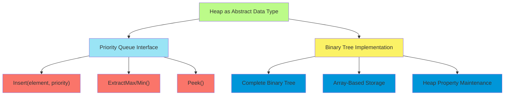
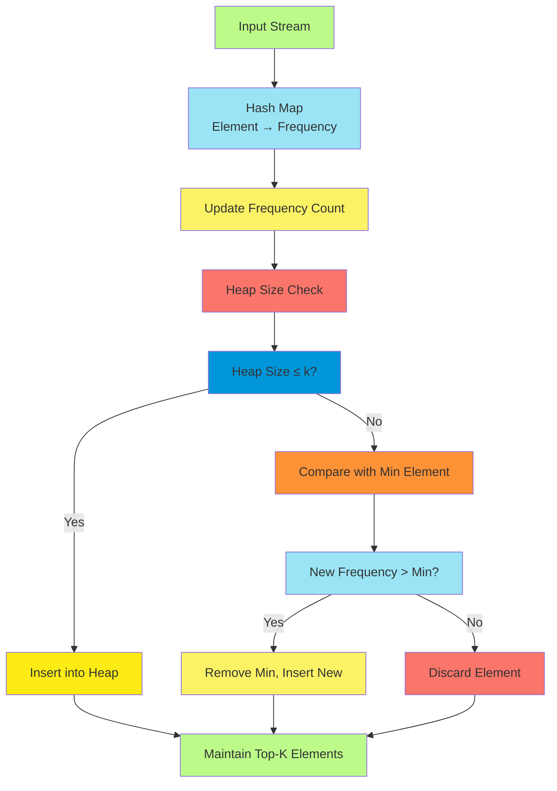
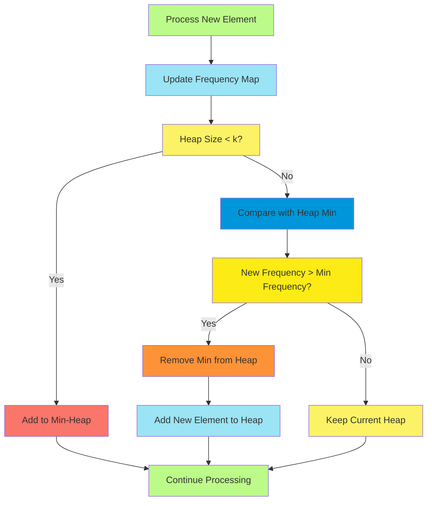
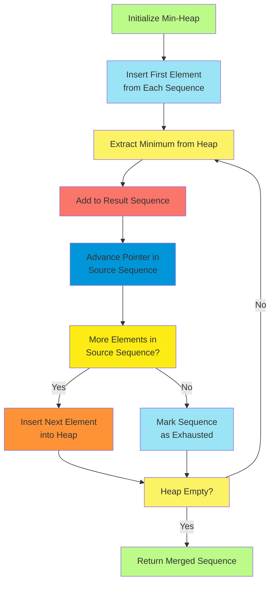
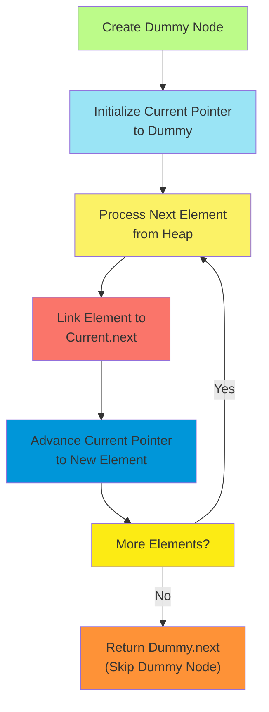
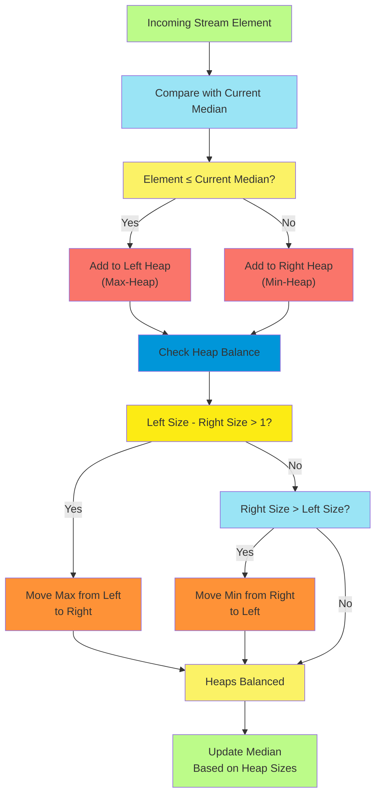

# C-8: Heaps - Priority-Based Data Structures for Efficient Ordering

1. Theoretical Foundations of Heap Data Structures
    - Priority Queue Principles and Binary Tree Organization
    - Min-Heap vs Max-Heap Structural Properties
    - Heap Operations Time Complexity Analysis
    - Binary Tree Maintenance and Heapify Algorithms
2. Frequency Analysis and Top-K Problems
    - Hash Map Integration for Frequency Counting
    - Max-Heap Approach for Most Frequent Elements
    - Min-Heap Space Optimization Techniques
    - Custom Comparator Design for Lexicographical Ordering
3. Merge Operations and Sorted Data Combination
    - Multi-Way Merge Algorithm Design
    - Linked List Combination Using Priority Queues
    - Efficient Comparison Strategies for K-Way Operations
    - Dummy Node Techniques for Output Construction
4. Streaming Data and Dynamic Median Calculation
    - Two-Heap Strategy for Median Maintenance
    - Balanced Heap Management and Rebalancing Rules
    - Stream Processing with Constant-Time Median Access
    - Max-Heap and Min-Heap Coordination Patterns

#### Theoretical Foundations of Heap Data Structures

Heap data structures represent one of the most elegant solutions to the fundamental computer science problem of
maintaining prioritized access to elements. Unlike traditional arrays or linked lists where accessing the maximum or
minimum element requires $O(n)$ time, heaps provide this capability in constant time while maintaining logarithmic
insertion and deletion complexities.

##### Priority Queue Principles and Binary Tree Organization

A heap fundamentally operates as a specialized binary tree that maintains a specific ordering property. This ordering
property distinguishes heaps from general binary trees and enables their exceptional performance characteristics. The
heap property states that for any given node, its value must satisfy a specific relationship with its children's values,
creating a hierarchical structure where priority naturally bubbles to the top.

The conceptual foundation rests on the principle that priority-based access patterns occur frequently in computational
problems. Operating systems need to schedule processes by priority, algorithms require efficient access to extreme
values, and many optimization problems benefit from incrementally processing elements in order of importance.



##### Min-Heap vs Max-Heap Structural Properties

The dichotomy between min-heaps and max-heaps represents a fundamental design choice that affects all subsequent
operations. A max-heap maintains the property that every parent node's value is greater than or equal to its children's
values, ensuring the maximum element always resides at the root. Conversely, a min-heap inverts this relationship,
keeping the minimum element at the root.

This distinction extends beyond simple value comparison to encompass the entire algorithmic approach to problem-solving.
Max-heaps naturally solve problems requiring repeated access to maximum elements, such as implementing priority queues
for high-priority tasks or maintaining the largest elements in streaming data. Min-heaps excel in scenarios like
Dijkstra's shortest path algorithm or maintaining the smallest elements for efficient median calculation.

The structural properties demand that heaps maintain the complete binary tree property, meaning all levels are fully
filled except possibly the last level, which fills from left to right. This completeness property enables the elegant
array-based representation where for any element at index $i$, its left child resides at index $2i + 1$ and its right
child at $2i + 2$.

##### Heap Operations Time Complexity Analysis

The mathematical foundation of heap efficiency stems from the balanced nature of complete binary trees. With $n$
elements, the tree height remains $\lfloor \log_2(n) \rfloor$, directly determining the complexity of operations that
traverse from root to leaf or vice versa.

**Insertion Complexity**: When inserting a new element, we initially place it at the next available position to maintain
the complete tree property. Subsequently, we perform "bubble-up" or "percolate-up" operations, comparing the new element
with its parent and swapping if the heap property is violated. This process continues until either the heap property is
satisfied or we reach the root. The maximum number of comparisons equals the tree height, yielding $O(\log n)$
complexity.

**Deletion Complexity**: Extracting the root element (maximum in max-heap, minimum in min-heap) requires more
sophisticated handling. We replace the root with the last element, then perform "bubble-down" or "percolate-down"
operations. At each level, we compare the current element with its children and swap with the appropriate child if
necessary. Again, the maximum number of levels traversed equals the tree height, maintaining $O(\log n)$ complexity.

**Peek Complexity**: Accessing the root element without removal requires only $O(1)$ time since the priority element is
always maintained at a known location.

**Heapify Complexity**: Perhaps the most elegant result in heap theory is that constructing a heap from an arbitrary
array of $n$ elements can be accomplished in $O(n)$ time, despite the apparent implication that $n$ insertions should
require $O(n \log n)$ time. This efficiency emerges from the bottom-up heapify approach, where we start from the last
non-leaf node and apply the bubble-down operation. The mathematical analysis reveals that the majority of nodes are near
the leaves and require minimal work, while only a few nodes near the root require extensive operations.

##### Binary Tree Maintenance and Heapify Algorithms

The heapify algorithm represents one of the most sophisticated aspects of heap management, requiring deep understanding
of both the structural and ordering properties. Two primary approaches exist: top-down heapify (used during insertion)
and bottom-up heapify (used during heap construction and deletion).

**Top-Down Heapify (Bubble-Up)**: Starting from a newly inserted leaf node, we compare it with its parent located at
index $\lfloor (i-1)/2 \rfloor$. If the heap property is violated, we swap the elements and continue the process with
the parent node. This algorithm naturally terminates when either the heap property is satisfied or we reach the root.

**Bottom-Up Heapify (Bubble-Down)**: Beginning from a given node (typically the root after deletion), we identify the
child with the appropriate priority (maximum child in max-heap, minimum child in min-heap). If this child has higher
priority than the current node, we swap them and continue the process from the child's position. The algorithm
terminates when the heap property is satisfied or we reach a leaf node.

The mathematical elegance of the $O(n)$ heap construction algorithm stems from recognizing that in a complete binary
tree of height $h$, there are at most $\lceil n/2^{h+1} \rceil$ nodes at height $h$. Since each node at height $h$
requires at most $h$ operations to bubble down, the total work is bounded by:

$$\sum_{h=0}^{\lfloor \log n \rfloor} \lceil \frac{n}{2^{h+1}} \rceil \cdot h = O(n)$$

Here's the implementation across three major programming languages:

**Python Implementation:**

```python
class MaxHeap:
    def __init__(self):
        self.heap = []

    def _parent(self, i):
        """Calculate parent index for element at index i"""
        return (i - 1) // 2

    def _left_child(self, i):
        """Calculate left child index for element at index i"""
        return 2 * i + 1

    def _right_child(self, i):
        """Calculate right child index for element at index i"""
        return 2 * i + 2

    def _bubble_up(self, i):
        """Maintain heap property by bubbling element up"""
        while i > 0 and self.heap[self._parent(i)] < self.heap[i]:
            # Swap with parent if heap property is violated
            parent_idx = self._parent(i)
            self.heap[i], self.heap[parent_idx] = self.heap[parent_idx], self.heap[i]
            i = parent_idx

    def _bubble_down(self, i):
        """Maintain heap property by bubbling element down"""
        max_idx = i
        left = self._left_child(i)
        right = self._right_child(i)

        # Find the index of maximum among parent and children
        if left < len(self.heap) and self.heap[left] > self.heap[max_idx]:
            max_idx = left
        if right < len(self.heap) and self.heap[right] > self.heap[max_idx]:
            max_idx = right

        # If heap property is violated, swap and continue
        if max_idx != i:
            self.heap[i], self.heap[max_idx] = self.heap[max_idx], self.heap[i]
            self._bubble_down(max_idx)

    def insert(self, value):
        """Insert new element maintaining heap property"""
        self.heap.append(value)
        self._bubble_up(len(self.heap) - 1)

    def extract_max(self):
        """Remove and return maximum element"""
        if not self.heap:
            return None

        max_val = self.heap[0]
        # Replace root with last element
        self.heap[0] = self.heap[-1]
        self.heap.pop()

        # Restore heap property if heap is not empty
        if self.heap:
            self._bubble_down(0)

        return max_val

    def peek(self):
        """Return maximum element without removing it"""
        return self.heap[0] if self.heap else None

    def heapify(self, arr):
        """Convert array to heap in O(n) time"""
        self.heap = arr.copy()
        # Start from last non-leaf node and bubble down
        for i in range(len(arr) // 2 - 1, -1, -1):
            self._bubble_down(i)
```

**Java Implementation:**

```java
import java.util.*;

public class MaxHeap {
    private List<Integer> heap;

    public MaxHeap() {
        this.heap = new ArrayList<>();
    }

    private int parent(int i) {
        return (i - 1) / 2;
    }

    private int leftChild(int i) {
        return 2 * i + 1;
    }

    private int rightChild(int i) {
        return 2 * i + 2;
    }

    private void bubbleUp(int i) {
        while (i > 0 && heap.get(parent(i)) < heap.get(i)) {
            Collections.swap(heap, i, parent(i));
            i = parent(i);
        }
    }

    private void bubbleDown(int i) {
        int maxIdx = i;
        int left = leftChild(i);
        int right = rightChild(i);

        if (left < heap.size() && heap.get(left) > heap.get(maxIdx)) {
            maxIdx = left;
        }
        if (right < heap.size() && heap.get(right) > heap.get(maxIdx)) {
            maxIdx = right;
        }

        if (maxIdx != i) {
            Collections.swap(heap, i, maxIdx);
            bubbleDown(maxIdx);
        }
    }

    public void insert(int value) {
        heap.add(value);
        bubbleUp(heap.size() - 1);
    }

    public Integer extractMax() {
        if (heap.isEmpty()) return null;

        int maxVal = heap.get(0);
        heap.set(0, heap.get(heap.size() - 1));
        heap.remove(heap.size() - 1);

        if (!heap.isEmpty()) {
            bubbleDown(0);
        }

        return maxVal;
    }

    public Integer peek() {
        return heap.isEmpty() ? null : heap.get(0);
    }

    public void heapify(int[] arr) {
        heap.clear();
        for (int val : arr) {
            heap.add(val);
        }

        for (int i = heap.size() / 2 - 1; i >= 0; i--) {
            bubbleDown(i);
        }
    }
}
```

**C++ Implementation:**

```cpp
#include <vector>
#include <algorithm>

class MaxHeap {
private:
    std::vector<int> heap;

    int parent(int i) { return (i - 1) / 2; }
    int leftChild(int i) { return 2 * i + 1; }
    int rightChild(int i) { return 2 * i + 2; }

    void bubbleUp(int i) {
        while (i > 0 && heap[parent(i)] < heap[i]) {
            std::swap(heap[i], heap[parent(i)]);
            i = parent(i);
        }
    }

    void bubbleDown(int i) {
        int maxIdx = i;
        int left = leftChild(i);
        int right = rightChild(i);

        if (left < heap.size() && heap[left] > heap[maxIdx]) {
            maxIdx = left;
        }
        if (right < heap.size() && heap[right] > heap[maxIdx]) {
            maxIdx = right;
        }

        if (maxIdx != i) {
            std::swap(heap[i], heap[maxIdx]);
            bubbleDown(maxIdx);
        }
    }

public:
    void insert(int value) {
        heap.push_back(value);
        bubbleUp(heap.size() - 1);
    }

    int extractMax() {
        if (heap.empty()) return -1; // or throw exception

        int maxVal = heap[0];
        heap[0] = heap.back();
        heap.pop_back();

        if (!heap.empty()) {
            bubbleDown(0);
        }

        return maxVal;
    }

    int peek() {
        return heap.empty() ? -1 : heap[0];
    }

    void heapify(const std::vector<int>& arr) {
        heap = arr;
        for (int i = heap.size() / 2 - 1; i >= 0; i--) {
            bubbleDown(i);
        }
    }

    bool empty() const { return heap.empty(); }
    size_t size() const { return heap.size(); }
};
```

#### Frequency Analysis and Top-K Problems

The intersection of heap data structures with frequency analysis represents one of the most practically important
applications in modern algorithm design. These problems emerge naturally in diverse domains: search engines identifying
the most relevant documents, social media platforms highlighting trending topics, and data analytics systems extracting
meaningful patterns from massive datasets.

##### Hash Map Integration for Frequency Counting

The synergistic relationship between hash maps and heaps creates a powerful paradigm for frequency-based analysis. Hash
maps provide $O(1)$ average-case access for counting occurrences, while heaps maintain the top-k most frequent elements
with logarithmic insertion complexity. This combination enables efficient processing of streaming data where frequencies
evolve dynamically.

Consider the fundamental challenge: given a stream of elements, maintain the k most frequently occurring items at any
point in time. The naive approach of maintaining a sorted list would require $O(n)$ time for each update, making it
impractical for large-scale applications. The hash map plus heap approach reduces this to $O(\log k)$ per update, a
dramatic improvement for scenarios where $k \ll n$.

The architectural pattern involves two primary data structures working in concert:



##### Max-Heap Approach for Most Frequent Elements

The max-heap approach to identifying the most frequent elements represents the more intuitive but less space-efficient
solution. In this paradigm, we construct a max-heap containing all unique elements, where each element's priority
corresponds to its frequency. This approach guarantees that the k most frequent elements can be extracted by performing
k extract-max operations.

The algorithmic framework proceeds as follows: First, we traverse the input to construct a frequency map. Then, we
create frequency-value pairs and insert all pairs into a max-heap. Finally, we extract the top k elements from the heap.
While this approach provides conceptual clarity and handles ties in frequency gracefully through secondary sorting
criteria, it requires $O(n)$ space for the heap, where n represents the number of unique elements.

**Python Implementation:**

```python
from heapq import heappush, heappop, heapify
from collections import Counter

class FrequencyPair:
    def __init__(self, element, frequency):
        self.element = element
        self.frequency = frequency

    def __lt__(self, other):
        # For max-heap behavior, we want higher frequency first
        if self.frequency != other.frequency:
            return self.frequency > other.frequency
        # For lexicographical ordering when frequencies are equal
        return self.element < other.element

def k_most_frequent_max_heap(elements, k):
    """Find k most frequent elements using max-heap approach"""
    # Count frequencies using hash map
    frequency_map = Counter(elements)

    # Create heap with all frequency-element pairs
    heap = [FrequencyPair(element, freq) for element, freq in frequency_map.items()]
    heapify(heap)  # Convert to heap in O(n) time

    # Extract top k elements
    result = []
    for _ in range(min(k, len(heap))):
        pair = heappop(heap)
        result.append(pair.element)

    return result
```

**Java Implementation:**

```java
import java.util.*;

class FrequencyPair {
    String element;
    int frequency;

    FrequencyPair(String element, int frequency) {
        this.element = element;
        this.frequency = frequency;
    }
}

public class TopKFrequent {
    public List<String> kMostFrequentMaxHeap(String[] elements, int k) {
        // Count frequencies
        Map<String, Integer> frequencyMap = new HashMap<>();
        for (String element : elements) {
            frequencyMap.put(element, frequencyMap.getOrDefault(element, 0) + 1);
        }

        // Create max-heap with custom comparator
        PriorityQueue<FrequencyPair> maxHeap = new PriorityQueue<>((a, b) -> {
            if (a.frequency != b.frequency) {
                return Integer.compare(b.frequency, a.frequency); // Higher frequency first
            }
            return a.element.compareTo(b.element); // Lexicographical order
        });

        // Add all pairs to heap
        for (Map.Entry<String, Integer> entry : frequencyMap.entrySet()) {
            maxHeap.offer(new FrequencyPair(entry.getKey(), entry.getValue()));
        }

        // Extract top k elements
        List<String> result = new ArrayList<>();
        for (int i = 0; i < Math.min(k, maxHeap.size()); i++) {
            result.add(maxHeap.poll().element);
        }

        return result;
    }
}
```

**C++ Implementation:**

```cpp
#include <vector>
#include <unordered_map>
#include <queue>
#include <string>

struct FrequencyPair {
    std::string element;
    int frequency;

    FrequencyPair(const std::string& elem, int freq) : element(elem), frequency(freq) {}
};

struct MaxHeapComparator {
    bool operator()(const FrequencyPair& a, const FrequencyPair& b) const {
        if (a.frequency != b.frequency) {
            return a.frequency < b.frequency; // Higher frequency has higher priority
        }
        return a.element > b.element; // Lexicographical order
    }
};

class TopKFrequent {
public:
    std::vector<std::string> kMostFrequentMaxHeap(const std::vector<std::string>& elements, int k) {
        // Count frequencies
        std::unordered_map<std::string, int> frequencyMap;
        for (const auto& element : elements) {
            frequencyMap[element]++;
        }

        // Create max-heap
        std::priority_queue<FrequencyPair, std::vector<FrequencyPair>, MaxHeapComparator> maxHeap;

        // Add all pairs to heap
        for (const auto& pair : frequencyMap) {
            maxHeap.emplace(pair.first, pair.second);
        }

        // Extract top k elements
        std::vector<std::string> result;
        for (int i = 0; i < std::min(k, static_cast<int>(maxHeap.size())); i++) {
            result.push_back(maxHeap.top().element);
            maxHeap.pop();
        }

        return result;
    }
};
```

##### Min-Heap Space Optimization Techniques

The min-heap approach represents a sophisticated space optimization that maintains only the k most frequent elements at
any given time. This technique proves particularly valuable when dealing with massive datasets where the number of
unique elements far exceeds k, the desired number of top frequent elements.

The key insight underlying this optimization is that we can discard elements with lower frequencies as soon as we
identify k elements with higher frequencies. By maintaining a min-heap of size k, we ensure that the least frequent
among our current top-k candidates sits at the root, making it efficient to compare new candidates and potentially
replace the current minimum.

The algorithm maintains the invariant that the heap contains exactly the k most frequent elements seen so far (or all
elements if fewer than k unique elements exist). When processing a new element whose frequency exceeds the minimum
frequency in our current top-k set, we remove the current minimum and insert the new element.



**Python Implementation:**

```python
import heapq
from collections import Counter

class MinFrequencyPair:
    def __init__(self, element, frequency):
        self.element = element
        self.frequency = frequency

    def __lt__(self, other):
        # For min-heap behavior, lower frequency has higher priority
        if self.frequency != other.frequency:
            return self.frequency < other.frequency
        # Reverse lexicographical ordering for ties
        return self.element > other.element

def k_most_frequent_min_heap(elements, k):
    """Find k most frequent elements using space-optimized min-heap"""
    frequency_map = Counter(elements)
    min_heap = []

    for element, frequency in frequency_map.items():
        if len(min_heap) < k:
            heapq.heappush(min_heap, MinFrequencyPair(element, frequency))
        elif frequency > min_heap[0].frequency:
            heapq.heapreplace(min_heap, MinFrequencyPair(element, frequency))

    # Extract elements in reverse order (most frequent first)
    result = []
    while min_heap:
        result.append(heapq.heappop(min_heap).element)

    return result[::-1]  # Reverse to get most frequent first
```

The space complexity improvement is substantial: while the max-heap approach requires $O(n)$ space where n is the number
of unique elements, the min-heap approach requires only $O(k)$ space. For applications where $k \ll n$, this represents
a significant optimization that enables processing of datasets that might otherwise exceed memory constraints.

##### Custom Comparator Design for Lexicographical Ordering

The design of custom comparators for heap-based frequency analysis requires careful consideration of multiple ordering
criteria. Beyond the primary frequency comparison, real-world applications often demand secondary ordering criteria such
as lexicographical ordering, timestamps, or other application-specific attributes.

The challenge lies in creating comparators that handle these multi-criteria comparisons while maintaining the
mathematical properties required for heap operations. The comparator must define a strict weak ordering that is
irreflexive, asymmetric, and transitive.

For frequency analysis with lexicographical tie-breaking, we implement the following logic:

1. Primary criterion: Compare frequencies (higher frequency indicates higher priority for max-heap)
2. Secondary criterion: For equal frequencies, use lexicographical ordering

This dual-criteria approach ensures deterministic behavior when elements have identical frequencies, which is crucial
for reproducible results in testing and production environments.

**Advanced Java Implementation with Multiple Criteria:**

```java
import java.util.*;

class AdvancedFrequencyPair {
    String element;
    int frequency;
    long timestamp; // Additional ordering criterion

    AdvancedFrequencyPair(String element, int frequency, long timestamp) {
        this.element = element;
        this.frequency = frequency;
        this.timestamp = timestamp;
    }
}

public class AdvancedTopKFrequent {
    public List<String> kMostFrequentAdvanced(String[] elements, int k) {
        Map<String, Integer> frequencyMap = new HashMap<>();
        Map<String, Long> timestampMap = new HashMap<>();

        // Track frequencies and timestamps
        for (int i = 0; i < elements.length; i++) {
            String element = elements[i];
            frequencyMap.put(element, frequencyMap.getOrDefault(element, 0) + 1);
            timestampMap.put(element, (long) i); // Use index as timestamp
        }

        // Min-heap with sophisticated comparator
        PriorityQueue<AdvancedFrequencyPair> minHeap = new PriorityQueue<>((a, b) -> {
            // Primary: frequency comparison (min-heap: lower frequency first)
            if (a.frequency != b.frequency) {
                return Integer.compare(a.frequency, b.frequency);
            }
            // Secondary: lexicographical comparison (reversed)
            if (!a.element.equals(b.element)) {
                return b.element.compareTo(a.element);
            }
            // Tertiary: timestamp comparison (earlier timestamp first)
            return Long.compare(a.timestamp, b.timestamp);
        });

        // Process each unique element
        for (Map.Entry<String, Integer> entry : frequencyMap.entrySet()) {
            String element = entry.getKey();
            int frequency = entry.getValue();
            long timestamp = timestampMap.get(element);

            AdvancedFrequencyPair pair = new AdvancedFrequencyPair(element, frequency, timestamp);

            if (minHeap.size() < k) {
                minHeap.offer(pair);
            } else if (shouldReplace(pair, minHeap.peek())) {
                minHeap.poll();
                minHeap.offer(pair);
            }
        }

        // Extract results in descending order of frequency
        List<String> result = new ArrayList<>();
        while (!minHeap.isEmpty()) {
            result.add(minHeap.poll().element);
        }
        Collections.reverse(result);

        return result;
    }

    private boolean shouldReplace(AdvancedFrequencyPair newPair, AdvancedFrequencyPair currentMin) {
        // Replace if new frequency is higher
        if (newPair.frequency > currentMin.frequency) return true;
        if (newPair.frequency < currentMin.frequency) return false;

        // For equal frequencies, prefer lexicographically smaller element
        int lexComparison = newPair.element.compareTo(currentMin.element);
        if (lexComparison < 0) return true;
        if (lexComparison > 0) return false;

        // For identical elements and frequencies, prefer earlier timestamp
        return newPair.timestamp < currentMin.timestamp;
    }
}
```

This sophisticated comparator design enables heap-based algorithms to handle complex real-world requirements while
maintaining the fundamental efficiency properties that make heaps attractive for frequency analysis problems.

#### Merge Operations and Sorted Data Combination

The problem of merging multiple sorted sequences represents a fundamental challenge in algorithm design, with
applications spanning from external sorting algorithms to distributed systems that must combine results from multiple
sources. Heap-based approaches to merge operations provide optimal solutions that scale gracefully with the number of
input sequences while maintaining logarithmic complexity per element processed.

##### Multi-Way Merge Algorithm Design

The theoretical foundation of multi-way merge algorithms rests on the principle that we can maintain efficiency by
always selecting the globally optimal choice at each step. When merging k sorted sequences, the next element in the
combined result must be the minimum element among the current heads of all k sequences. A min-heap provides the ideal
data structure for efficiently identifying and extracting this minimum element.

The algorithmic paradigm transforms the merge problem from one requiring $O(k)$ comparisons per selection to one
requiring only $O(\log k)$ comparisons. This logarithmic reduction becomes increasingly significant as k grows large,
making heap-based approaches essential for scalable merge operations.

Consider the mathematical complexity analysis: with n total elements across k sorted sequences, the naive approach of
repeatedly scanning all k sequence heads would require $O(nk)$ time. The heap-based approach reduces this to
$O(n \log k)$, representing a substantial improvement when $k$ is large.



##### Linked List Combination Using Priority Queues

The specific application of multi-way merge to linked list combination showcases the elegant synergy between heap data
structures and pointer-based data organization. Unlike array-based sequences where random access enables direct
indexing, linked lists require sequential traversal, making the heap-based approach particularly valuable.

The algorithm maintains a min-heap containing the current head of each non-empty linked list. At each iteration, we
extract the node with the smallest value, append it to our result list, and insert its successor (if it exists) into the
heap. This process continues until all lists are exhausted, producing a single merged linked list in sorted order.

**Python Implementation:**

```python
class ListNode:
    def __init__(self, val=0, next=None):
        self.val = val
        self.next = next

    def __lt__(self, other):
        return self.val < other.val

import heapq

def merge_k_sorted_lists(lists):
    """
    Merge k sorted linked lists using min-heap
    Time: O(n log k), Space: O(k)
    """
    if not lists:
        return None

    # Initialize heap with head of each non-empty list
    heap = []
    for head in lists:
        if head:
            heapq.heappush(heap, head)

    # Create dummy node to simplify result construction
    dummy = ListNode(0)
    current = dummy

    while heap:
        # Extract node with minimum value
        min_node = heapq.heappop(heap)
        current.next = min_node
        current = current.next

        # If the extracted node has a successor, add it to heap
        if min_node.next:
            heapq.heappush(heap, min_node.next)

    return dummy.next
```

**Java Implementation:**

```java
import java.util.*;

class ListNode {
    int val;
    ListNode next;

    ListNode() {}
    ListNode(int val) { this.val = val; }
    ListNode(int val, ListNode next) { this.val = val; this.next = next; }
}

public class MergeKSortedLists {
    public ListNode mergeKLists(ListNode[] lists) {
        if (lists == null || lists.length == 0) return null;

        // Min-heap with custom comparator
        PriorityQueue<ListNode> minHeap = new PriorityQueue<>((a, b) ->
            Integer.compare(a.val, b.val));

        // Initialize heap with head of each non-empty list
        for (ListNode head : lists) {
            if (head != null) {
                minHeap.offer(head);
            }
        }

        ListNode dummy = new ListNode(0);
        ListNode current = dummy;

        while (!minHeap.isEmpty()) {
            ListNode minNode = minHeap.poll();
            current.next = minNode;
            current = current.next;

            if (minNode.next != null) {
                minHeap.offer(minNode.next);
            }
        }

        return dummy.next;
    }
}
```

**C++ Implementation:**

```cpp
#include <vector>
#include <queue>

struct ListNode {
    int val;
    ListNode* next;
    ListNode() : val(0), next(nullptr) {}
    ListNode(int x) : val(x), next(nullptr) {}
    ListNode(int x, ListNode* next) : val(x), next(next) {}
};

struct ListNodeComparator {
    bool operator()(ListNode* a, ListNode* b) const {
        return a->val > b->val; // Min-heap: smaller values have higher priority
    }
};

class MergeKSortedLists {
public:
    ListNode* mergeKLists(std::vector<ListNode*>& lists) {
        if (lists.empty()) return nullptr;

        std::priority_queue<ListNode*, std::vector<ListNode*>, ListNodeComparator> minHeap;

        // Initialize heap with head of each non-empty list
        for (ListNode* head : lists) {
            if (head != nullptr) {
                minHeap.push(head);
            }
        }

        ListNode dummy(0);
        ListNode* current = &dummy;

        while (!minHeap.empty()) {
            ListNode* minNode = minHeap.top();
            minHeap.pop();

            current->next = minNode;
            current = current->next;

            if (minNode->next != nullptr) {
                minHeap.push(minNode->next);
            }
        }

        return dummy.next;
    }
};
```

##### Efficient Comparison Strategies for K-Way Operations

The efficiency of k-way merge operations depends critically on minimizing the number of comparisons required to identify
the next element. Traditional approaches that scan all k sequence heads linearly require $O(k)$ comparisons per element
selection. The heap-based approach reduces this to $O(\log k)$ by maintaining the partial ordering property inherent in
heap structures.

However, advanced comparison strategies can further optimize performance through several techniques:

**1. Tournament Tree Approach**: An alternative to heaps, tournament trees maintain a complete binary tree where each
internal node stores the winner of the comparison between its children. This approach provides the same $O(\log k)$
complexity but with better constant factors due to reduced memory access patterns.

**2. Loser Tree Optimization**: A variant of tournament trees where each internal node stores the loser rather than the
winner. This optimization reduces the number of comparisons required when updating the tree after extracting an element.

**3. Cache-Conscious Heap Organization**: For large values of k, memory hierarchy considerations become significant.
Organizing the heap to maximize cache locality can provide substantial performance improvements in practice.

The mathematical foundation underlying these optimizations stems from information theory: selecting one element from k
candidates requires at least $\lceil \log_2 k \rceil$ bits of information, providing a lower bound on the number of
comparisons required. Heap-based approaches achieve this theoretical minimum while maintaining practical
implementability.

##### Dummy Node Techniques for Output Construction

The dummy node technique represents a fundamental pattern in linked list manipulation that simplifies edge case handling
and improves code clarity. When constructing a result linked list through iterative appending, the dummy node eliminates
special handling for the first element by providing a consistent starting point.

Consider the challenges without a dummy node:

1. **Empty Result Initialization**: Determining whether the current element is the first requires conditional logic
2. **Pointer Management**: Maintaining both head and tail pointers increases complexity
3. **Edge Case Handling**: Empty input sequences require special consideration

The dummy node elegantly resolves these issues by providing a consistent interface regardless of the current state of
result construction.



**Advanced Merge Implementation with Error Handling:**

```python
from typing import List, Optional
import heapq

class ListNode:
    def __init__(self, val=0, next=None):
        self.val = val
        self.next = next

    def __lt__(self, other):
        return self.val < other.val

    def __str__(self):
        """String representation for debugging"""
        result = []
        current = self
        while current:
            result.append(str(current.val))
            current = current.next
        return " -> ".join(result)

def merge_k_sorted_lists_advanced(lists: List[Optional[ListNode]]) -> Optional[ListNode]:
    """
    Advanced merge with comprehensive error handling and optimization
    """
    if not lists:
        return None

    # Filter out None lists and validate sorting
    valid_lists = []
    for i, head in enumerate(lists):
        if head is not None:
            if not is_sorted(head):
                raise ValueError(f"List {i} is not sorted")
            valid_lists.append(head)

    if not valid_lists:
        return None

    # Use heap for efficient merging
    heap = []
    node_id = 0  # Unique identifier to handle duplicate values

    for head in valid_lists:
        heapq.heappush(heap, (head.val, node_id, head))
        node_id += 1

    dummy = ListNode(0)
    current = dummy

    while heap:
        val, _, node = heapq.heappop(heap)
        current.next = node
        current = current.next

        if node.next:
            heapq.heappush(heap, (node.next.val, node_id, node.next))
            node_id += 1

    return dummy.next

def is_sorted(head: ListNode) -> bool:
    """Validate that a linked list is sorted in ascending order"""
    current = head
    while current and current.next:
        if current.val > current.next.val:
            return False
        current = current.next
    return True

def create_linked_list(values: List[int]) -> Optional[ListNode]:
    """Utility function to create linked list from array"""
    if not values:
        return None

    head = ListNode(values[0])
    current = head

    for val in values[1:]:
        current.next = ListNode(val)
        current = current.next

    return head

# Example usage and testing
def test_merge_operations():
    """Comprehensive test suite for merge operations"""
    # Test case 1: Basic merge
    list1 = create_linked_list([1, 4, 5])
    list2 = create_linked_list([1, 3, 4])
    list3 = create_linked_list([2, 6])

    merged = merge_k_sorted_lists_advanced([list1, list2, list3])
    print(f"Merged result: {merged}")

    # Test case 2: Empty lists
    merged_empty = merge_k_sorted_lists_advanced([])
    print(f"Empty merge result: {merged_empty}")

    # Test case 3: Single element lists
    single_lists = [create_linked_list([i]) for i in [3, 1, 4, 1, 5]]
    merged_single = merge_k_sorted_lists_advanced(single_lists)
    print(f"Single element merge: {merged_single}")
```

#### Streaming Data and Dynamic Median Calculation

The challenge of maintaining the median in a dynamic data stream represents one of the most elegant applications of
dual-heap data structures. Unlike static datasets where we can sort once and access the median in constant time,
streaming scenarios require continuous adaptation as new elements arrive. The two-heap approach provides an optimal
solution that maintains $O(\log n)$ insertion complexity while enabling $O(1)$ median access.

##### Two-Heap Strategy for Median Maintenance

The conceptual foundation of the two-heap median strategy rests on partitioning the data stream into two complementary
sets: elements smaller than or equal to the median, and elements greater than or equal to the median. By maintaining
these partitions using a max-heap for the smaller elements and a min-heap for the larger elements, we ensure that the
median always resides at the root of one or both heaps.

The mathematical elegance of this approach becomes apparent when considering the median definition for different dataset
sizes:

- For odd-sized datasets: $\text{median} = \text{middle element}$
- For even-sized datasets: $\text{median} = \frac{\text{middle}_1 + \text{middle}_2}{2}$

The two-heap strategy maintains the invariant that these middle elements are always accessible at the heap roots,
enabling constant-time median calculation regardless of the total number of elements processed.



##### Balanced Heap Management and Rebalancing Rules

The efficiency of the two-heap median approach depends critically on maintaining balanced heap sizes while preserving
the ordering invariant. The balancing rules must ensure that:

1. **Size Constraint**: $|\text{size}(\text{left\_heap}) - \text{size}(\text{right\_heap})| \leq 1$
2. **Ordering Constraint**: $\max(\text{left\_heap}) \leq \min(\text{right\_heap})$

These constraints enable us to identify the median location deterministically:

- If heap sizes are equal: $\text{median} = \frac{\max(\text{left\_heap}) + \min(\text{right\_heap})}{2}$
- If left heap is larger: $\text{median} = \max(\text{left\_heap})$
- If right heap is larger: $\text{median} = \min(\text{right\_heap})$

The rebalancing algorithm operates through a two-phase process:

**Phase 1: Insertion Decision**

```python
def insert_element(self, element):
    # Determine target heap based on current median
    if not self.left_heap or element <= self.get_current_median():
        heapq.heappush(self.left_heap, -element)  # Max-heap using negation
    else:
        heapq.heappush(self.right_heap, element)   # Min-heap
```

**Phase 2: Rebalancing Operations**

```python
def rebalance_heaps(self):
    # Case 1: Left heap too large
    if len(self.left_heap) > len(self.right_heap) + 1:
        max_left = -heapq.heappop(self.left_heap)
        heapq.heappush(self.right_heap, max_left)

    # Case 2: Right heap too large
    elif len(self.right_heap) > len(self.left_heap):
        min_right = heapq.heappop(self.right_heap)
        heapq.heappush(self.left_heap, -min_right)
```

##### Stream Processing with Constant-Time Median Access

The streaming paradigm requires that our data structure handle potentially infinite sequences of elements while
maintaining bounded memory usage and predictable performance. The two-heap approach excels in this context by providing:

1. **Bounded Memory**: Memory usage grows linearly with the number of elements, with no additional overhead for indexing
   or auxiliary structures
2. **Predictable Performance**: Each insertion requires $O(\log n)$ time, while median access requires $O(1)$ time
3. **Numerical Stability**: The approach handles both integer and floating-point data without precision issues

**Complete Python Implementation:**

```python
import heapq
from typing import Union

class MedianFinder:
    """
    Efficient median calculation for streaming data using two heaps
    """

    def __init__(self):
        self.left_heap = []   # Max-heap (using negation)
        self.right_heap = []  # Min-heap
        self.count = 0

    def add_number(self, num: Union[int, float]) -> None:
        """
        Add a number to the data stream
        Time Complexity: O(log n)
        """
        self.count += 1

        # Determine which heap to insert into
        if not self.left_heap or num <= self.get_median_value():
            heapq.heappush(self.left_heap, -num)
        else:
            heapq.heappush(self.right_heap, num)

        # Rebalance heaps to maintain size constraints
        self._rebalance()

    def get_median(self) -> float:
        """
        Get the current median of all numbers
        Time Complexity: O(1)
        """
        if self.count == 0:
            raise ValueError("No elements in stream")

        if self.count % 2 == 0:
            # Even number of elements: average of two middle elements
            return (-self.left_heap[0] + self.right_heap[0]) / 2.0
        else:
            # Odd number of elements: middle element (always in left heap)
            return float(-self.left_heap[0])

    def get_median_value(self) -> float:
        """Helper method to get median without error checking"""
        if self.count == 0:
            return 0
        return self.get_median()

    def _rebalance(self) -> None:
        """
        Maintain heap balance constraints
        """
        left_size = len(self.left_heap)
        right_size = len(self.right_heap)

        # Left heap too large
        if left_size > right_size + 1:
            max_left = -heapq.heappop(self.left_heap)
            heapq.heappush(self.right_heap, max_left)

        # Right heap too large
        elif right_size > left_size:
            min_right = heapq.heappop(self.right_heap)
            heapq.heappush(self.left_heap, -min_right)

    def get_statistics(self) -> dict:
        """
        Get comprehensive statistics about the current state
        """
        return {
            'count': self.count,
            'median': self.get_median() if self.count > 0 else None,
            'left_heap_size': len(self.left_heap),
            'right_heap_size': len(self.right_heap),
            'min_value': self.right_heap[0] if self.right_heap else (-self.left_heap[0] if self.left_heap else None),
            'max_value': -self.left_heap[0] if self.left_heap else (self.right_heap[0] if self.right_heap else None)
        }

# Advanced usage example with performance monitoring
def demonstrate_streaming_median():
    """
    Demonstrate streaming median calculation with performance analysis
    """
    import time
    import random

    median_finder = MedianFinder()

    # Simulate data stream
    stream_size = 10000
    start_time = time.time()

    for i in range(stream_size):
        # Generate random number (could be from actual stream)
        num = random.randint(1, 1000)
        median_finder.add_number(num)

        # Periodic median calculation
        if (i + 1) % 1000 == 0:
            median = median_finder.get_median()
            stats = median_finder.get_statistics()
            print(f"After {i+1} elements: Median = {median:.2f}")
            print(f"  Heap sizes: Left={stats['left_heap_size']}, Right={stats['right_heap_size']}")

    end_time = time.time()
    print(f"\nProcessed {stream_size} elements in {end_time - start_time:.4f} seconds")
    print(f"Average time per insertion: {(end_time - start_time) / stream_size * 1000:.4f} ms")
```

**Java Implementation:**

```java
import java.util.*;

public class MedianFinder {
    private PriorityQueue<Integer> leftHeap;  // Max-heap
    private PriorityQueue<Integer> rightHeap; // Min-heap
    private int count;

    public MedianFinder() {
        leftHeap = new PriorityQueue<>(Collections.reverseOrder()); // Max-heap
        rightHeap = new PriorityQueue<>(); // Min-heap
        count = 0;
    }

    public void addNum(int num) {
        count++;

        // Determine target heap
        if (leftHeap.isEmpty() || num <= getMedianValue()) {
            leftHeap.offer(num);
        } else {
            rightHeap.offer(num);
        }

        // Rebalance heaps
        rebalance();
    }

    public double findMedian() {
        if (count == 0) {
            throw new IllegalStateException("No elements in stream");
        }

        if (count % 2 == 0) {
            return (leftHeap.peek() + rightHeap.peek()) / 2.0;
        } else {
            return leftHeap.peek();
        }
    }

    private double getMedianValue() {
        return count == 0 ? 0 : findMedian();
    }

    private void rebalance() {
        int leftSize = leftHeap.size();
        int rightSize = rightHeap.size();

        if (leftSize > rightSize + 1) {
            rightHeap.offer(leftHeap.poll());
        } else if (rightSize > leftSize) {
            leftHeap.offer(rightHeap.poll());
        }
    }
}
```

**C++ Implementation:**

```cpp
#include <queue>
#include <stdexcept>

class MedianFinder {
private:
    std::priority_queue<int> leftHeap;  // Max-heap
    std::priority_queue<int, std::vector<int>, std::greater<int>> rightHeap; // Min-heap
    int count;

public:
    MedianFinder() : count(0) {}

    void addNum(int num) {
        count++;

        if (leftHeap.empty() || num <= getMedianValue()) {
            leftHeap.push(num);
        } else {
            rightHeap.push(num);
        }

        rebalance();
    }

    double findMedian() {
        if (count == 0) {
            throw std::runtime_error("No elements in stream");
        }

        if (count % 2 == 0) {
            return (leftHeap.top() + rightHeap.top()) / 2.0;
        } else {
            return leftHeap.top();
        }
    }

private:
    double getMedianValue() {
        return count == 0 ? 0 : findMedian();
    }

    void rebalance() {
        int leftSize = leftHeap.size();
        int rightSize = rightHeap.size();

        if (leftSize > rightSize + 1) {
            rightHeap.push(leftHeap.top());
            leftHeap.pop();
        } else if (rightSize > leftSize) {
            leftHeap.push(rightHeap.top());
            rightHeap.pop();
        }
    }
};
```

##### Max-Heap and Min-Heap Coordination Patterns

The coordination between max-heap and min-heap in median finding applications exemplifies a broader class of algorithmic
patterns where multiple data structures work in concert to achieve capabilities neither could provide independently.
This coordination pattern extends beyond median calculation to various applications requiring dynamic quantile
maintenance, sliding window statistics, and multi-criteria optimization problems.

The fundamental principle underlying effective heap coordination involves:

1. **Clear Responsibility Division**: Each heap maintains a distinct subset of the data with well-defined boundaries
2. **Invariant Preservation**: Operations must maintain mathematical relationships between the heaps
3. **Efficient Communication**: Transfer operations between heaps must preserve overall system efficiency

Advanced coordination patterns include:

**Multi-Quantile Maintenance**: Extending the two-heap approach to maintain arbitrary quantiles by using multiple heaps
with size constraints proportional to the desired quantile positions.

**Weighted Median Calculation**: Modifying the heap coordination to handle elements with associated weights, requiring
more sophisticated rebalancing logic.

**Sliding Window Median**: Combining the two-heap approach with additional data structures to maintain median over a
fixed-size sliding window, requiring both insertion and deletion operations.

These coordination patterns demonstrate the versatility of heap-based approaches in solving complex streaming data
problems while maintaining the fundamental efficiency guarantees that make heaps attractive for real-time applications.

The theoretical foundation of heap coordination rests on the principle that complex global properties (like median
maintenance) can be efficiently maintained through local operations on simpler data structures. This decomposition
enables both conceptual understanding and efficient implementation, making heap coordination patterns essential tools in
the algorithm designer's toolkit.
