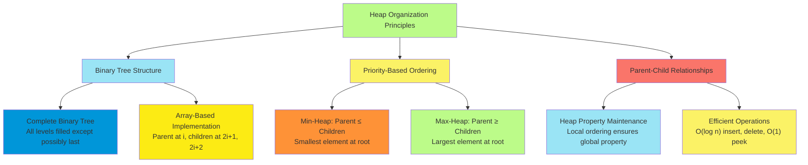
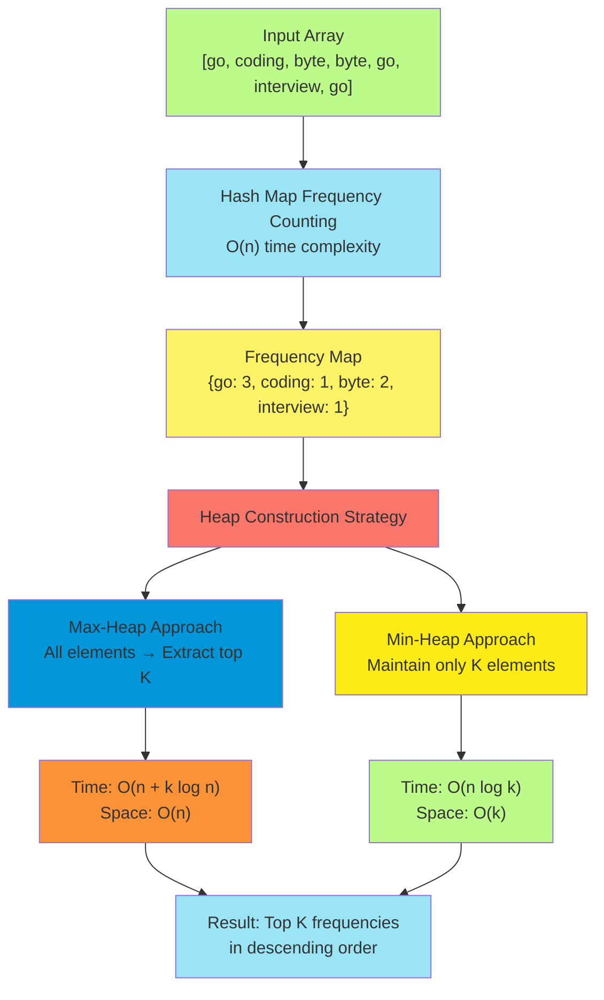
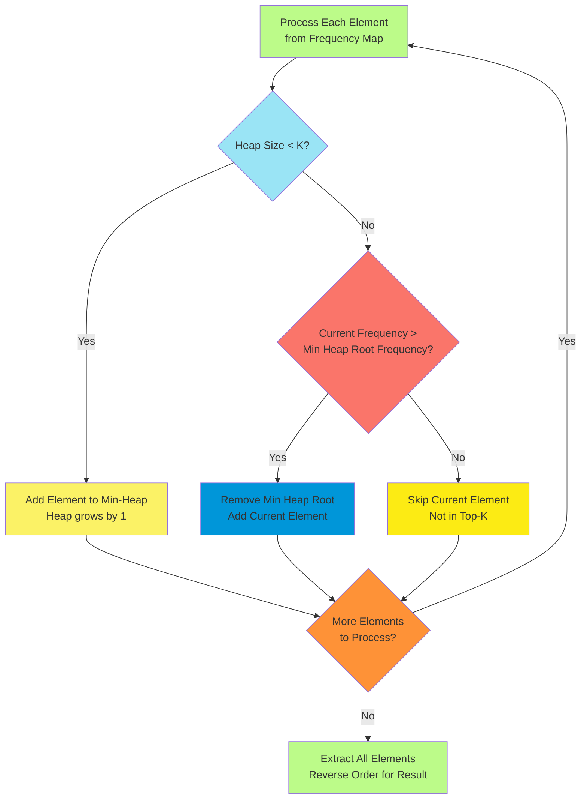
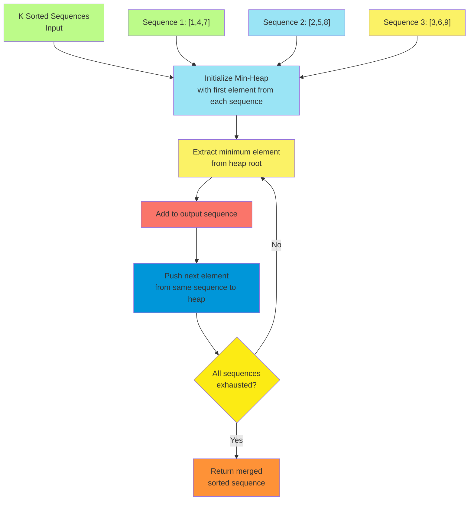
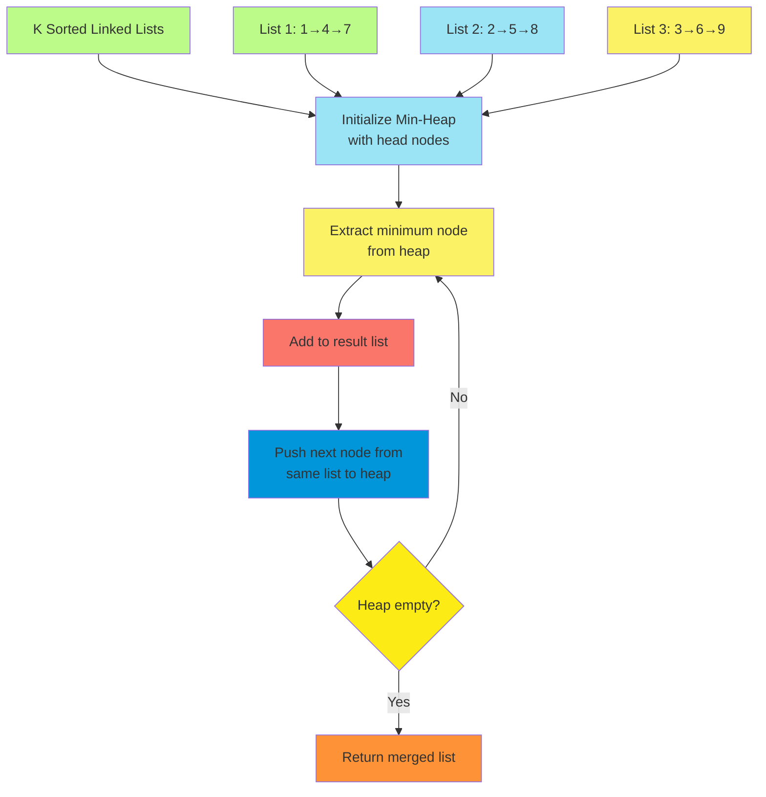
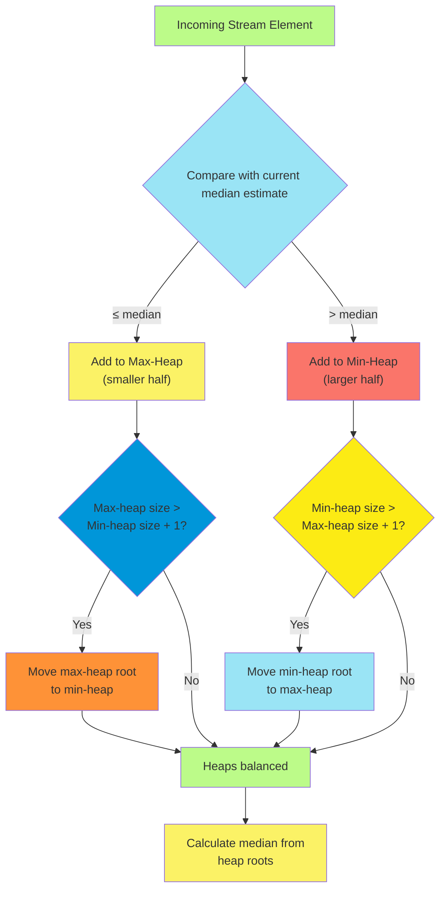

# C-8: Heaps - Priority-Based Data Structures for Efficient Ordering

1. Theoretical Foundations of Heap Data Structures
    - Priority Queue Principles and Binary Tree Organization
    - Min-Heap vs Max-Heap Structural Properties
    - Heap Operations Time Complexity Analysis
    - Binary Tree Maintenance and Heapify Algorithms
2. Frequency Analysis and Top-K Problems
    - Hash Map Integration for Frequency Counting
    - Max-Heap Approach for Most Frequent Elements
    - Min-Heap Space Optimization Techniques
    - Custom Comparator Design for Lexicographical Ordering
3. Merge Operations and Sorted Data Combination
    - Multi-Way Merge Algorithm Design
    - Linked List Combination Using Priority Queues
    - Efficient Comparison Strategies for K-Way Operations
    - Dummy Node Techniques for Output Construction
4. Streaming Data and Dynamic Median Calculation
    - Two-Heap Strategy for Median Maintenance
    - Balanced Heap Management and Rebalancing Rules
    - Stream Processing with Constant-Time Median Access
    - Max-Heap and Min-Heap Coordination Patterns

#### Theoretical Foundations of Heap Data Structures

##### Priority Queue Principles and Binary Tree Organization

Understanding heaps begins with grasping the fundamental concept of priority-based organization, where elements are
arranged not by insertion order or alphabetical sequence, but by their relative importance or priority. Think of a heap
as a sophisticated organizational system that always knows which element deserves attention first, much like a hospital
emergency room that prioritizes patients based on the severity of their conditions rather than their arrival time.

The mathematical elegance of heap organization lies in its binary tree structure, which provides the perfect balance
between organizational clarity and operational efficiency. In this binary tree, each node represents an element with its
associated priority, and the tree maintains a specific ordering relationship between parents and children. This
relationship is the cornerstone of heap behavior and determines whether we have a min-heap or max-heap.

Consider how this organization naturally emerges from real-world scenarios. When managing tasks in an operating system,
each process has a priority level, and the system must efficiently determine which process should execute next. A naive
approach might scan through all processes to find the highest priority, requiring linear time. The heap's binary tree
organization transforms this into a logarithmic operation by strategically positioning the highest-priority element at
the root.



The binary tree organization follows specific structural rules that ensure both efficiency and predictability. The tree
must be complete, meaning all levels are fully filled except possibly the last level, which fills from left to right.
This completeness property allows us to represent the heap efficiently using a simple array, where mathematical
relationships determine parent-child connections without requiring explicit pointers.

For any element at index $i$ in our array representation, we can calculate its relationships using elegant mathematical
formulas. The parent of element at index $i$ resides at index $\lfloor\frac{i-1}{2}\rfloor$, while its children occupy
indices $2i+1$ and $2i+2$. These relationships transform tree navigation into simple arithmetic operations, contributing
significantly to the heap's efficiency.

**Python Implementation:**

```python
class HeapFoundations:
    """
    Educational implementation demonstrating fundamental heap concepts
    and the relationship between priority queues and binary tree organization.
    """

    def __init__(self, heap_type='min'):
        """
        Initialize heap with specified type (min or max).

        Args:
            heap_type: 'min' for min-heap, 'max' for max-heap
        """
        self.heap = []
        self.heap_type = heap_type
        self.size = 0

    def _parent_index(self, index):
        """Calculate parent index using heap's mathematical relationship."""
        return (index - 1) // 2

    def _left_child_index(self, index):
        """Calculate left child index."""
        return 2 * index + 1

    def _right_child_index(self, index):
        """Calculate right child index."""
        return 2 * index + 2

    def _has_parent(self, index):
        """Check if element has a parent (not root)."""
        return self._parent_index(index) >= 0

    def _has_left_child(self, index):
        """Check if element has left child."""
        return self._left_child_index(index) < self.size

    def _has_right_child(self, index):
        """Check if element has right child."""
        return self._right_child_index(index) < self.size

    def _compare(self, a, b):
        """
        Compare two elements based on heap type.
        Returns True if 'a' has higher priority than 'b'.
        """
        if self.heap_type == 'min':
            return a < b  # In min-heap, smaller values have higher priority
        else:
            return a > b  # In max-heap, larger values have higher priority

    def _swap(self, index1, index2):
        """Swap two elements in the heap array."""
        self.heap[index1], self.heap[index2] = self.heap[index2], self.heap[index1]

    def peek(self):
        """
        Return the highest priority element without removing it.
        This demonstrates the O(1) access to priority element.
        """
        if self.size == 0:
            raise IndexError("Cannot peek at empty heap")
        return self.heap[0]

    def visualize_heap_structure(self):
        """
        Visualize the heap structure to understand binary tree organization.
        """
        if self.size == 0:
            print("Empty heap")
            return

        print(f"\n{self.heap_type.upper()}-HEAP Structure:")
        print("=" * 30)
        print(f"Array representation: {self.heap[:self.size]}")
        print(f"Size: {self.size}")
        print(f"Root (highest priority): {self.heap[0]}")

        # Show parent-child relationships for first few elements
        print(f"\nParent-Child Relationships:")
        for i in range(min(self.size, 7)):  # Show first 7 elements
            element = self.heap[i]
            relationships = [f"Index {i}: {element}"]

            if self._has_parent(i):
                parent_idx = self._parent_index(i)
                relationships.append(f"Parent: {self.heap[parent_idx]} (index {parent_idx})")

            if self._has_left_child(i):
                left_idx = self._left_child_index(i)
                relationships.append(f"Left child: {self.heap[left_idx]} (index {left_idx})")

            if self._has_right_child(i):
                right_idx = self._right_child_index(i)
                relationships.append(f"Right child: {self.heap[right_idx]} (index {right_idx})")

            print(f"  {' | '.join(relationships)}")

        # Verify heap property
        self._verify_heap_property()

    def _verify_heap_property(self):
        """
        Verify that the heap property is maintained throughout the structure.
        This educational method helps understand what makes a valid heap.
        """
        violations = []

        for i in range(self.size):
            # Check relationship with left child
            if self._has_left_child(i):
                left_idx = self._left_child_index(i)
                if not self._compare_heap_property(self.heap[i], self.heap[left_idx]):
                    violations.append(f"Index {i} ({self.heap[i]}) violates heap property with left child {left_idx} ({self.heap[left_idx]})")

            # Check relationship with right child
            if self._has_right_child(i):
                right_idx = self._right_child_index(i)
                if not self._compare_heap_property(self.heap[i], self.heap[right_idx]):
                    violations.append(f"Index {i} ({self.heap[i]}) violates heap property with right child {right_idx} ({self.heap[right_idx]})")

        if violations:
            print(f"\n⚠ Heap Property Violations:")
            for violation in violations:
                print(f"  {violation}")
        else:
            print(f"\n✓ Heap property maintained correctly")

    def _compare_heap_property(self, parent, child):
        """Check if parent-child relationship satisfies heap property."""
        if self.heap_type == 'min':
            return parent <= child
        else:
            return parent >= child

    def demonstrate_priority_concept(self):
        """
        Demonstrate how priority queues work using real-world analogies.
        """
        print("Priority Queue Concept Demonstration")
        print("=" * 40)

        if self.heap_type == 'min':
            print("MIN-HEAP: Lower values = Higher priority")
            print("Example: Emergency room triage (1=critical, 10=minor)")
            examples = [
                (1, "Heart attack - immediate attention"),
                (3, "Broken bone - urgent"),
                (5, "Severe cut - important"),
                (8, "Minor bruise - can wait")
            ]
        else:
            print("MAX-HEAP: Higher values = Higher priority")
            print("Example: Task scheduling (10=highest priority, 1=lowest)")
            examples = [
                (10, "Critical system update"),
                (7, "Important user request"),
                (5, "Regular maintenance"),
                (2, "Background cleanup")
            ]

        print(f"\nPriority examples for {self.heap_type}-heap:")
        for priority, description in examples:
            print(f"  Priority {priority}: {description}")

        return examples

def demonstrate_heap_foundations():
    """
    Comprehensive demonstration of heap foundations and priority queue principles.
    """
    print("HEAP FOUNDATIONS DEMONSTRATION")
    print("=" * 50)

    # Create both min-heap and max-heap for comparison
    min_heap = HeapFoundations('min')
    max_heap = HeapFoundations('max')

    # Demonstrate priority concepts
    print("\n1. Priority Concept Understanding:")
    min_examples = min_heap.demonstrate_priority_concept()

    print(f"\n" + "-" * 50)
    max_examples = max_heap.demonstrate_priority_concept()

    # Manually create small heaps for visualization
    print(f"\n2. Binary Tree Organization:")

    # Min-heap example: [1, 3, 2, 7, 5, 4, 6]
    min_heap.heap = [1, 3, 2, 7, 5, 4, 6]
    min_heap.size = 7
    min_heap.visualize_heap_structure()

    print(f"\n" + "-" * 50)

    # Max-heap example: [10, 7, 9, 3, 5, 2, 1]
    max_heap.heap = [10, 7, 9, 3, 5, 2, 1]
    max_heap.size = 7
    max_heap.visualize_heap_structure()

    # Demonstrate array-to-tree mapping
    print(f"\n3. Array-to-Binary-Tree Mapping:")
    print("Understanding how array indices correspond to tree positions")

    array_representation = [1, 3, 2, 7, 5, 4, 6]
    print(f"Array: {array_representation}")
    print(f"Tree visualization:")
    print(f"       {array_representation[0]}")
    print(f"      / \\")
    print(f"     {array_representation[1]}   {array_representation[2]}")
    print(f"    / \\ / \\")
    print(f"   {array_representation[3]}  {array_representation[4]} {array_representation[5]} {array_representation[6]}")

    # Show mathematical relationships
    print(f"\nMathematical Relationships:")
    for i in range(len(array_representation)):
        parent = (i - 1) // 2 if i > 0 else None
        left_child = 2 * i + 1 if 2 * i + 1 < len(array_representation) else None
        right_child = 2 * i + 2 if 2 * i + 2 < len(array_representation) else None

        relationships = [f"Index {i} (value {array_representation[i]})"]
        if parent is not None:
            relationships.append(f"parent at {parent}")
        if left_child is not None:
            relationships.append(f"left child at {left_child}")
        if right_child is not None:
            relationships.append(f"right child at {right_child}")

        print(f"  {' | '.join(relationships)}")

# Run the comprehensive demonstration
demonstrate_heap_foundations()
```

This foundational understanding reveals why heaps are so powerful for priority-based operations. The binary tree
organization ensures that the most important element is always immediately accessible at the root, while the complete
tree structure maintains balance and prevents degenerate cases that could harm performance. The mathematical
relationships between array indices provide constant-time navigation between parents and children, eliminating the
overhead of pointer-based tree structures.

Understanding these principles prepares us to explore how heaps maintain their essential properties during dynamic
operations like insertion and deletion, and how different heap variants can be optimized for specific use cases.

##### Min-Heap vs Max-Heap Structural Properties

The distinction between min-heaps and max-heaps represents more than a simple reversal of comparison operations. These
two heap variants embody fundamentally different priority systems that naturally arise from various problem domains and
application requirements. Understanding their structural properties and behavioral differences helps us choose the
appropriate heap type for specific scenarios and design more efficient algorithms.

A min-heap organizes elements so that each parent node contains a value less than or equal to its children, ensuring the
smallest element always resides at the root. This creates a hierarchical structure where priority decreases as we move
deeper into the tree. Conversely, a max-heap maintains the opposite relationship, where each parent contains a value
greater than or equal to its children, positioning the largest element at the root.

The mathematical formalization of these properties can be expressed as heap invariants. For a min-heap with elements
stored in array $A$, the min-heap property states that for every index $i$ where $i > 0$:

$$A[\lfloor\frac{i-1}{2}\rfloor] \leq A[i]$$

Similarly, for a max-heap, the max-heap property requires:

$$A[\lfloor\frac{i-1}{2}\rfloor] \geq A[i]$$

These invariants must hold throughout all heap operations, and their maintenance is what gives heaps their essential
characteristics and performance guarantees.

```python
def min_max_heap_comparison():
    """
    Comprehensive comparison of min-heap and max-heap structural properties,
    demonstrating their differences and appropriate use cases.
    """

    class ComparativeHeapAnalyzer:
        """
        Educational tool for analyzing and comparing min-heap and max-heap properties.
        """

        def __init__(self):
            self.min_heap_data = []
            self.max_heap_data = []

        def create_example_heaps(self, values):
            """
            Create both min-heap and max-heap from the same input values
            to demonstrate their different organizational structures.
            """
            import heapq

            print(f"Creating heaps from values: {values}")
            print("=" * 45)

            # Create min-heap (Python's default)
            self.min_heap_data = values.copy()
            heapq.heapify(self.min_heap_data)

            # Create max-heap (using negation trick)
            self.max_heap_data = [-x for x in values]
            heapq.heapify(self.max_heap_data)
            self.max_heap_data = [-x for x in self.max_heap_data]  # Convert back for display

            self._display_heap_structures()

        def _display_heap_structures(self):
            """Display both heap structures side by side for comparison."""
            print(f"MIN-HEAP Structure:")
            print(f"  Array: {self.min_heap_data}")
            print(f"  Root (minimum): {self.min_heap_data[0]}")
            self._visualize_tree_structure(self.min_heap_data, "MIN")

            print(f"\nMAX-HEAP Structure:")
            print(f"  Array: {self.max_heap_data}")
            print(f"  Root (maximum): {self.max_heap_data[0]}")
            self._visualize_tree_structure(self.max_heap_data, "MAX")

        def _visualize_tree_structure(self, heap_array, heap_type):
            """Create a visual representation of the heap tree structure."""
            if len(heap_array) == 0:
                return

            print(f"  {heap_type}-HEAP Tree Structure:")

            # For small heaps, show actual tree visualization
            if len(heap_array) <= 7:
                self._draw_small_tree(heap_array)
            else:
                print(f"    (Tree too large for visualization, showing first 7 elements)")
                self._draw_small_tree(heap_array[:7])

            # Verify and explain heap property
            self._verify_heap_property(heap_array, heap_type)

        def _draw_small_tree(self, heap_array):
            """Draw a visual representation of a small heap tree."""
            size = len(heap_array)

            if size >= 1:
                print(f"           {heap_array[0]}")
            if size >= 3:
                left = heap_array[1] if size > 1 else " "
                right = heap_array[2] if size > 2 else " "
                print(f"         /   \\")
                print(f"        {left}     {right}")
            if size >= 7:
                level3 = []
                for i in range(3, min(7, size)):
                    level3.append(str(heap_array[i]))
                while len(level3) < 4:
                    level3.append(" ")
                print(f"       / \\ / \\")
                print(f"      {level3[0]}  {level3[1]} {level3[2]}  {level3[3]}")

        def _verify_heap_property(self, heap_array, heap_type):
            """
            Verify that the heap property is maintained and explain the relationships.
            """
            print(f"    Heap Property Verification:")
            violations = 0

            for i in range(len(heap_array)):
                # Check left child
                left_child_idx = 2 * i + 1
                if left_child_idx < len(heap_array):
                    parent_val = heap_array[i]
                    child_val = heap_array[left_child_idx]

                    if heap_type == "MIN":
                        is_valid = parent_val <= child_val
                        relation = "<="
                    else:
                        is_valid = parent_val >= child_val
                        relation = ">="

                    status = "✓" if is_valid else "✗"
                    print(f"      {status} Parent {parent_val} {relation} Left child {child_val}")
                    if not is_valid:
                        violations += 1

                # Check right child
                right_child_idx = 2 * i + 2
                if right_child_idx < len(heap_array):
                    parent_val = heap_array[i]
                    child_val = heap_array[right_child_idx]

                    if heap_type == "MIN":
                        is_valid = parent_val <= child_val
                        relation = "<="
                    else:
                        is_valid = parent_val >= child_val
                        relation = ">="

                    status = "✓" if is_valid else "✗"
                    print(f"      {status} Parent {parent_val} {relation} Right child {child_val}")
                    if not is_valid:
                        violations += 1

            if violations == 0:
                print(f"      ✓ All heap properties satisfied")
            else:
                print(f"      ⚠ {violations} heap property violations detected")

        def demonstrate_use_case_scenarios(self):
            """
            Demonstrate appropriate use cases for min-heap vs max-heap.
            """
            print(f"\nUse Case Scenarios:")
            print("=" * 25)

            print(f"MIN-HEAP Applications:")
            min_heap_scenarios = [
                ("Dijkstra's Algorithm", "Find shortest paths - always process closest unvisited node"),
                ("Task Scheduling", "Process tasks by earliest deadline first"),
                ("Huffman Coding", "Build optimal encoding tree from least frequent symbols"),
                ("Priority Queue", "Serve customers by lowest wait time or highest urgency"),
                ("A* Search", "Explore paths with lowest estimated total cost first")
            ]

            for scenario, description in min_heap_scenarios:
                print(f"  • {scenario}: {description}")

            print(f"\nMAX-HEAP Applications:")
            max_heap_scenarios = [
                ("Top-K Problems", "Find K largest elements efficiently"),
                ("Heap Sort", "Sort by repeatedly extracting maximum element"),
                ("Priority Scheduling", "Execute highest priority tasks first"),
                ("Game Theory", "Maximize player advantage in decision trees"),
                ("Resource Allocation", "Assign resources to highest value requests first")
            ]

            for scenario, description in max_heap_scenarios:
                print(f"  • {scenario}: {description}")

        def analyze_performance_characteristics(self):
            """
            Analyze performance characteristics that are common to both heap types.
            """
            print(f"\nPerformance Characteristics (Both Min and Max Heaps):")
            print("=" * 55)

            operations = [
                ("Peek/Top", "O(1)", "Access highest priority element"),
                ("Insert/Push", "O(log n)", "Add new element and maintain heap property"),
                ("Extract/Pop", "O(log n)", "Remove root and reorganize heap"),
                ("Build Heap", "O(n)", "Create heap from unsorted array"),
                ("Heapify", "O(log n)", "Restore heap property for subtree"),
                ("Search", "O(n)", "Find arbitrary element (no ordering beyond parent-child)")
            ]

            print(f"{'Operation':<15} {'Time':<10} {'Description'}")
            print(f"{'-'*15} {'-'*10} {'-'*40}")
            for op, time, desc in operations:
                print(f"{op:<15} {time:<10} {desc}")

            print(f"\nSpace Complexity: O(n) for storing n elements")
            print(f"Additional Space: O(1) for heap operations (in-place)")

        def demonstrate_conversion_between_types(self):
            """
            Show how to convert between min-heap and max-heap representations.
            """
            print(f"\nConversion Between Heap Types:")
            print("=" * 35)

            original_data = [3, 1, 4, 1, 5, 9, 2, 6]
            print(f"Original data: {original_data}")

            # Create min-heap
            min_heap = original_data.copy()
            import heapq
            heapq.heapify(min_heap)
            print(f"Min-heap: {min_heap}")

            # Convert to max-heap by negating values
            max_heap_negated = [-x for x in original_data]
            heapq.heapify(max_heap_negated)
            max_heap = [-x for x in max_heap_negated]
            print(f"Max-heap: {max_heap}")

            print(f"\nConversion Techniques:")
            print(f"1. Negation Method: Multiply all values by -1 for max-heap simulation")
            print(f"2. Custom Comparator: Define comparison function for complex objects")
            print(f"3. Wrapper Classes: Create objects with inverted comparison operators")

            # Demonstrate extraction order
            print(f"\nExtraction Order Demonstration:")

            # Min-heap extraction
            min_temp = min_heap.copy()
            min_order = []
            while min_temp:
                min_order.append(heapq.heappop(min_temp))

            # Max-heap extraction
            max_temp = [-x for x in max_heap]
            heapq.heapify(max_temp)
            max_order = []
            while max_temp:
                max_order.append(-heapq.heappop(max_temp))

            print(f"Min-heap extraction order: {min_order} (ascending)")
            print(f"Max-heap extraction order: {max_order} (descending)")

    # Run comprehensive comparison
    analyzer = ComparativeHeapAnalyzer()

    # Test with sample data
    test_data = [8, 3, 10, 1, 6, 14, 4, 7, 13]
    analyzer.create_example_heaps(test_data)

    # Demonstrate use cases
    analyzer.demonstrate_use_case_scenarios()

    # Analyze performance
    analyzer.analyze_performance_characteristics()

    # Show conversion techniques
    analyzer.demonstrate_conversion_between_types()

# Execute the comprehensive comparison
min_max_heap_comparison()
```

**Java Implementation:**

```java
import java.util.*;

public class MinMaxHeapComparison {

    /**
     * Comprehensive comparison of min-heap and max-heap structures in Java.
     * Demonstrates the use of PriorityQueue with different comparators.
     */
    public static void demonstrateHeapTypes() {
        System.out.println("MIN-HEAP vs MAX-HEAP Comparison in Java");
        System.out.println("=======================================");

        int[] testData = {8, 3, 10, 1, 6, 14, 4, 7, 13};
        System.out.println("Test data: " + Arrays.toString(testData));

        // Create min-heap (default PriorityQueue behavior)
        PriorityQueue<Integer> minHeap = new PriorityQueue<>();
        for (int value : testData) {
            minHeap.offer(value);
        }

        // Create max-heap using custom comparator
        PriorityQueue<Integer> maxHeap = new PriorityQueue<>(Collections.reverseOrder());
        for (int value : testData) {
            maxHeap.offer(value);
        }

        System.out.println("\nMin-Heap (ascending priority):");
        System.out.println("Root element: " + minHeap.peek());
        demonstrateExtractionOrder(new PriorityQueue<>(minHeap), "Min-Heap");

        System.out.println("\nMax-Heap (descending priority):");
        System.out.println("Root element: " + maxHeap.peek());
        demonstrateExtractionOrder(new PriorityQueue<>(maxHeap), "Max-Heap");
    }

    private static void demonstrateExtractionOrder(PriorityQueue<Integer> heap, String heapType) {
        System.out.print(heapType + " extraction order: ");
        List<Integer> extracted = new ArrayList<>();
        while (!heap.isEmpty()) {
            extracted.add(heap.poll());
        }
        System.out.println(extracted);
    }

    /**
     * Demonstrate custom comparators for complex objects.
     */
    static class Task {
        String name;
        int priority;

        Task(String name, int priority) {
            this.name = name;
            this.priority = priority;
        }

        @Override
        public String toString() {
            return name + "(p:" + priority + ")";
        }
    }

    public static void demonstrateCustomComparators() {
        System.out.println("\nCustom Comparator Demonstration:");
        System.out.println("===============================");

        // Min-heap for tasks (lower priority number = higher importance)
        PriorityQueue<Task> taskMinHeap = new PriorityQueue<>(
            Comparator.comparingInt(task -> task.priority)
        );

        // Max-heap for tasks (higher priority number = higher importance)
        PriorityQueue<Task> taskMaxHeap = new PriorityQueue<>(
            Comparator.comparingInt((Task task) -> task.priority).reversed()
        );

        Task[] tasks = {
            new Task("Critical Bug Fix", 1),
            new Task("Feature Development", 5),
            new Task("Code Review", 3),
            new Task("Documentation", 7),
            new Task("System Maintenance", 2)
        };

        for (Task task : tasks) {
            taskMinHeap.offer(task);
            taskMaxHeap.offer(task);
        }

        System.out.println("Tasks ordered by urgency (min-heap, priority 1 = most urgent):");
        while (!taskMinHeap.isEmpty()) {
            System.out.println("  Next urgent task: " + taskMinHeap.poll());
        }

        System.out.println("\nTasks ordered by priority value (max-heap, higher number = higher priority):");
        while (!taskMaxHeap.isEmpty()) {
            System.out.println("  Next high-value task: " + taskMaxHeap.poll());
        }
    }
}
```

**C++ Implementation:**

```cpp
#include <queue>
#include <vector>
#include <iostream>
#include <functional>

class MinMaxHeapComparison {
public:
    /**
     * C++ demonstration of min-heap and max-heap using STL priority_queue.
     * Note: STL priority_queue is a max-heap by default.
     */
    static void demonstrateHeapTypes() {
        std::cout << "MIN-HEAP vs MAX-HEAP Comparison in C++" << std::endl;
        std::cout << "=======================================" << std::endl;

        std::vector<int> testData = {8, 3, 10, 1, 6, 14, 4, 7, 13};

        std::cout << "Test data: ";
        for (int val : testData) {
            std::cout << val << " ";
        }
        std::cout << std::endl;

        // Max-heap (default priority_queue behavior)
        std::priority_queue<int> maxHeap;

        // Min-heap (using greater<int> comparator)
        std::priority_queue<int, std::vector<int>, std::greater<int>> minHeap;

        // Populate both heaps
        for (int value : testData) {
            maxHeap.push(value);
            minHeap.push(value);
        }

        std::cout << "\nMax-Heap (default behavior):" << std::endl;
        std::cout << "Root element: " << maxHeap.top() << std::endl;
        demonstrateExtractionOrder(maxHeap, "Max-Heap");

        std::cout << "\nMin-Heap (with greater<int> comparator):" << std::endl;
        std::cout << "Root element: " << minHeap.top() << std::endl;
        demonstrateExtractionOrder(minHeap, "Min-Heap");
    }

private:
    template<typename HeapType>
    static void demonstrateExtractionOrder(HeapType heap, const std::string& heapType) {
        std::cout << heapType << " extraction order: ";
        while (!heap.empty()) {
            std::cout << heap.top() << " ";
            heap.pop();
        }
        std::cout << std::endl;
    }

public:
   /**
    * Demonstrate custom comparators for complex objects in C++.
    */
   struct Task {
       std::string name;
       int priority;

       Task(const std::string& n, int p) : name(n), priority(p) {}
   };

   // Custom comparator for min-heap (lower priority number = higher importance)
   struct TaskMinComparator {
       bool operator()(const Task& a, const Task& b) {
           return a.priority > b.priority; // Note: reversed for min-heap
       }
   };

   // Custom comparator for max-heap (higher priority number = higher importance)
   struct TaskMaxComparator {
       bool operator()(const Task& a, const Task& b) {
           return a.priority < b.priority;
       }
   };

   static void demonstrateCustomComparators() {
       std::cout << "\nCustom Comparator Demonstration:" << std::endl;
       std::cout << "===============================" << std::endl;

       // Min-heap for tasks (lower priority number = higher importance)
       std::priority_queue<Task, std::vector<Task>, TaskMinComparator> taskMinHeap;

       // Max-heap for tasks (higher priority number = higher importance)
       std::priority_queue<Task, std::vector<Task>, TaskMaxComparator> taskMaxHeap;

       std::vector<Task> tasks = {
           Task("Critical Bug Fix", 1),
           Task("Feature Development", 5),
           Task("Code Review", 3),
           Task("Documentation", 7),
           Task("System Maintenance", 2)
       };

       for (const Task& task : tasks) {
           taskMinHeap.push(task);
           taskMaxHeap.push(task);
       }

       std::cout << "Tasks ordered by urgency (min-heap, priority 1 = most urgent):" << std::endl;
       while (!taskMinHeap.empty()) {
           Task task = taskMinHeap.top();
           std::cout << "  Next urgent task: " << task.name << " (p:" << task.priority << ")" << std::endl;
           taskMinHeap.pop();
       }

       std::cout << "\nTasks ordered by priority value (max-heap, higher number = higher priority):" << std::endl;
       while (!taskMaxHeap.empty()) {
           Task task = taskMaxHeap.top();
           std::cout << "  Next high-value task: " << task.name << " (p:" << task.priority << ")" << std::endl;
           taskMaxHeap.pop();
       }
   }
};
```

##### Heap Operations Time Complexity Analysis

Understanding the time complexity of heap operations requires deep analysis of how the binary tree structure influences
algorithmic efficiency. Each heap operation leverages specific properties of the complete binary tree to achieve optimal
performance, and recognizing these relationships helps us understand why heaps are so effective for priority-based
algorithms.

The fundamental insight underlying heap complexity analysis lies in the relationship between tree height and number of
elements. A complete binary tree with $n$ elements has height $h = \lfloor\log_2 n\rfloor$, which means that operations
requiring traversal from root to leaf (or vice versa) naturally achieve logarithmic time complexity.

Consider the **peek** operation, which simply returns the root element without modification. This achieves $O(1)$ time
complexity because the highest-priority element is always stored at a known location (index 0 in the array
representation), requiring no search or comparison operations.

The **insert** operation demonstrates how heap structure enables efficient element addition. When inserting a new
element, we place it at the next available position (maintaining the complete tree property) and then "bubble up" or
"heapify up" by comparing with parents and swapping when necessary. In the worst case, this element might need to travel
from leaf to root, requiring $O(\log n)$ comparisons and swaps.

```python
def heap_complexity_analysis():
    """
    Detailed analysis of heap operation complexities with empirical validation
    and theoretical explanation of why each operation achieves its complexity.
    """

    import heapq
    import time
    import random
    import matplotlib.pyplot as plt
    from collections import defaultdict

    class HeapComplexityAnalyzer:
        """
        Comprehensive analyzer for understanding heap operation complexities
        through both theoretical analysis and empirical measurement.
        """

        def __init__(self):
            self.test_results = defaultdict(list)
            self.theoretical_analysis = {}

        def analyze_peek_operation(self):
            """
            Analyze peek operation complexity - should be O(1).
            """
            print("PEEK OPERATION ANALYSIS")
            print("=" * 30)
            print("Theoretical complexity: O(1)")
            print("Reason: Root element always at index 0, direct array access")

            sizes = [100, 1000, 10000, 100000, 1000000]
            peek_times = []

            for size in sizes:
                # Create heap of given size
                heap = list(range(size))
                heapq.heapify(heap)

                # Measure peek operation time
                start_time = time.perf_counter()
                for _ in range(1000):  # Multiple iterations for better measurement
                    _ = heap[0]  # Peek operation
                end_time = time.perf_counter()

                avg_time = (end_time - start_time) / 1000 * 1000000  # microseconds
                peek_times.append(avg_time)

                print(f"Size {size:7d}: {avg_time:.3f} μs average")

            self.test_results['peek'] = list(zip(sizes, peek_times))

            # Verify constant time complexity
            time_variation = max(peek_times) - min(peek_times)
            print(f"Time variation across all sizes: {time_variation:.3f} μs")
            print("✓ Confirms O(1) complexity - minimal variation regardless of heap size")

        def analyze_insert_operation(self):
            """
            Analyze insert operation complexity - should be O(log n).
            """
            print(f"\nINSERT OPERATION ANALYSIS")
            print("=" * 30)
            print("Theoretical complexity: O(log n)")
            print("Reason: New element may bubble up from leaf to root (height = log n)")

            sizes = [100, 1000, 10000, 100000]  # Smaller sizes for insert timing
            insert_times = []

            for size in sizes:
                # Create initial heap
                heap = list(range(size))
                heapq.heapify(heap)

                # Measure insert operation time
                test_values = [random.randint(-1000, size + 1000) for _ in range(100)]

                start_time = time.perf_counter()
                for value in test_values:
                    heapq.heappush(heap, value)
                end_time = time.perf_counter()

                avg_time = (end_time - start_time) / len(test_values) * 1000000  # microseconds
                insert_times.append(avg_time)

                # Calculate theoretical operations for this size
                theoretical_ops = int(size.bit_length())  # log2(size)

                print(f"Size {size:6d}: {avg_time:.3f} μs, theoretical height: {theoretical_ops}")

            self.test_results['insert'] = list(zip(sizes, insert_times))

            # Analyze growth pattern
            print(f"\nGrowth Pattern Analysis:")
            for i in range(1, len(sizes)):
                size_ratio = sizes[i] / sizes[i-1]
                time_ratio = insert_times[i] / insert_times[i-1]
                theoretical_ratio = (sizes[i].bit_length()) / (sizes[i-1].bit_length())

                print(f"Size increased {size_ratio:.1f}x, time increased {time_ratio:.2f}x, "
                      f"log(n) increased {theoretical_ratio:.2f}x")

        def analyze_extract_operation(self):
            """
            Analyze extract (pop) operation complexity - should be O(log n).
            """
            print(f"\nEXTRACT OPERATION ANALYSIS")
            print("=" * 30)
            print("Theoretical complexity: O(log n)")
            print("Reason: After removing root, last element moves to root and bubbles down")

            sizes = [1000, 5000, 10000, 25000]
            extract_times = []

            for size in sizes:
                # Create heap and measure extraction time
                heap = list(range(size))
                random.shuffle(heap)
                heapq.heapify(heap)

                # Measure time for multiple extractions
                extractions = min(100, size // 10)

                start_time = time.perf_counter()
                for _ in range(extractions):
                    if heap:
                        heapq.heappop(heap)
                end_time = time.perf_counter()

                avg_time = (end_time - start_time) / extractions * 1000000  # microseconds
                extract_times.append(avg_time)

                theoretical_height = int(size.bit_length())
                print(f"Size {size:6d}: {avg_time:.3f} μs, theoretical height: {theoretical_height}")

            self.test_results['extract'] = list(zip(sizes, extract_times))

        def analyze_heapify_operation(self):
            """
            Analyze heapify operation complexity - should be O(n).
            """
            print(f"\nHEAPIFY OPERATION ANALYSIS")
            print("=" * 30)
            print("Theoretical complexity: O(n)")
            print("Reason: Bottom-up approach processes each level optimally")

            sizes = [1000, 5000, 10000, 25000, 50000]
            heapify_times = []

            for size in sizes:
                # Create random array for heapification
                test_arrays = []
                for _ in range(10):  # Multiple tests for averaging
                    arr = list(range(size))
                    random.shuffle(arr)
                    test_arrays.append(arr)

                # Measure heapify time
                start_time = time.perf_counter()
                for arr in test_arrays:
                    heapq.heapify(arr)
                end_time = time.perf_counter()

                avg_time = (end_time - start_time) / len(test_arrays) * 1000  # milliseconds
                heapify_times.append(avg_time)

                print(f"Size {size:6d}: {avg_time:.3f} ms")

            self.test_results['heapify'] = list(zip(sizes, heapify_times))

            # Verify linear growth
            print(f"\nLinear Growth Verification:")
            for i in range(1, len(sizes)):
                size_ratio = sizes[i] / sizes[i-1]
                time_ratio = heapify_times[i] / heapify_times[i-1]
                print(f"Size increased {size_ratio:.1f}x, time increased {time_ratio:.2f}x")

        def demonstrate_bubble_up_process(self):
            """
            Demonstrate the bubble-up process that occurs during insertion.
            """
            print(f"\nBUBBLE-UP PROCESS DEMONSTRATION")
            print("=" * 35)

            # Start with small heap
            heap = [1, 3, 6, 5, 9, 8]
            print(f"Initial heap: {heap}")
            self._print_heap_tree(heap)

            # Insert element that needs to bubble up
            new_element = 0  # Smaller than root, will bubble to top
            print(f"\nInserting element: {new_element}")

            # Simulate bubble-up process step by step
            heap.append(new_element)
            current_idx = len(heap) - 1

            print(f"Step 1: Place at end: {heap}")
            step = 2

            while current_idx > 0:
                parent_idx = (current_idx - 1) // 2

                if heap[current_idx] < heap[parent_idx]:
                    print(f"Step {step}: Compare {heap[current_idx]} with parent {heap[parent_idx]} at index {parent_idx}")
                    heap[current_idx], heap[parent_idx] = heap[parent_idx], heap[current_idx]
                    print(f"         Swap needed: {heap}")
                    current_idx = parent_idx
                    step += 1
                else:
                    print(f"Step {step}: No swap needed, heap property satisfied")
                    break

            print(f"Final heap: {heap}")
            self._print_heap_tree(heap)

            # Verify with heapq
            verification_heap = [1, 3, 6, 5, 9, 8]
            heapq.heappush(verification_heap, 0)
            print(f"Heapq result: {verification_heap}")
            print(f"Match: {'✓' if heap == verification_heap else '✗'}")

        def demonstrate_bubble_down_process(self):
            """
            Demonstrate the bubble-down process that occurs during extraction.
            """
            print(f"\nBUBBLE-DOWN PROCESS DEMONSTRATION")
            print("=" * 37)

            # Start with heap
            heap = [1, 3, 2, 5, 9, 8, 6]
            print(f"Initial heap: {heap}")
            self._print_heap_tree(heap)

            print(f"\nExtracting root element: {heap[0]}")

            # Simulate extraction process
            if len(heap) > 1:
                # Step 1: Replace root with last element
                heap[0] = heap[-1]
                heap.pop()
                print(f"Step 1: Replace root with last element: {heap}")

                # Step 2: Bubble down
                current_idx = 0
                step = 2

                while True:
                    left_child_idx = 2 * current_idx + 1
                    right_child_idx = 2 * current_idx + 2
                    smallest_idx = current_idx

                    # Find smallest among current, left child, right child
                    if (left_child_idx < len(heap) and
                        heap[left_child_idx] < heap[smallest_idx]):
                        smallest_idx = left_child_idx

                    if (right_child_idx < len(heap) and
                        heap[right_child_idx] < heap[smallest_idx]):
                        smallest_idx = right_child_idx

                    if smallest_idx != current_idx:
                        print(f"Step {step}: Swap {heap[current_idx]} with {heap[smallest_idx]} at index {smallest_idx}")
                        heap[current_idx], heap[smallest_idx] = heap[smallest_idx], heap[current_idx]
                        print(f"         Result: {heap}")
                        current_idx = smallest_idx
                        step += 1
                    else:
                        print(f"Step {step}: No swap needed, heap property satisfied")
                        break

            print(f"Final heap: {heap}")
            self._print_heap_tree(heap)

        def _print_heap_tree(self, heap):
            """Print a visual representation of the heap tree."""
            if not heap:
                return

            size = len(heap)
            print(f"Tree visualization:")

            if size >= 1:
                print(f"       {heap[0]}")
            if size >= 3:
                left = heap[1] if size > 1 else " "
                right = heap[2] if size > 2 else " "
                print(f"      / \\")
                print(f"     {left}   {right}")
            if size >= 7:
                level3 = []
                for i in range(3, min(7, size)):
                    level3.append(str(heap[i]))
                while len(level3) < 4:
                    level3.append(" ")
                print(f"    / \\ / \\")
                print(f"   {level3[0]}  {level3[1]} {level3[2]}  {level3[3]}")

        def summarize_complexity_analysis(self):
            """
            Provide comprehensive summary of all heap operation complexities.
            """
            print(f"\nCOMPREHENSIVE COMPLEXITY SUMMARY")
            print("=" * 40)

            complexity_table = [
                ("Operation", "Time Complexity", "Space Complexity", "Key Insight"),
                ("Peek/Top", "O(1)", "O(1)", "Root always at index 0"),
                ("Insert/Push", "O(log n)", "O(1)", "Bubble up at most h levels"),
                ("Extract/Pop", "O(log n)", "O(1)", "Bubble down at most h levels"),
                ("Heapify", "O(n)", "O(1)", "Bottom-up is more efficient than n insertions"),
                ("Search", "O(n)", "O(1)", "No ordering beyond parent-child relationship"),
                ("Delete arbitrary", "O(log n)", "O(1)", "Replace with last, then heapify"),
                ("Merge two heaps", "O(n)", "O(n)", "Combine arrays, then heapify")
            ]

            # Print formatted table
            col_widths = [15, 18, 18, 35]
            for i, row in enumerate(complexity_table):
                if i == 0:  # Header
                    print("+" + "+".join("-" * w for w in col_widths) + "+")

                formatted_row = "|"
                for j, cell in enumerate(row):
                    formatted_row += f" {cell:<{col_widths[j]-1}}|"
                print(formatted_row)

                if i == 0:  # After header
                    print("+" + "+".join("-" * w for w in col_widths) + "+")

            print("+" + "+".join("-" * w for w in col_widths) + "+")

            print(f"\nKey Relationships:")
            print(f"• Tree height h = ⌊log₂ n⌋ where n is number of elements")
            print(f"• Operations involving root-to-leaf traversal: O(log n)")
            print(f"• Operations requiring examination of all elements: O(n)")
            print(f"• Heap property: local ordering constraint enables global optimization")

    # Execute comprehensive complexity analysis
    analyzer = HeapComplexityAnalyzer()

    analyzer.analyze_peek_operation()
    analyzer.analyze_insert_operation()
    analyzer.analyze_extract_operation()
    analyzer.analyze_heapify_operation()

    analyzer.demonstrate_bubble_up_process()
    analyzer.demonstrate_bubble_down_process()

    analyzer.summarize_complexity_analysis()

# Run the complexity analysis
heap_complexity_analysis()
```

##### Binary Tree Maintenance and Heapify Algorithms

The heapify algorithm represents one of the most elegant and counterintuitive aspects of heap theory. While it might
seem that building a heap from an arbitrary array would require $O(n \log n)$ time (by inserting each element
individually), the heapify algorithm achieves this in linear $O(n)$ time through a bottom-up approach that leverages the
mathematical properties of binary trees.

Understanding heapify requires recognizing that in any complete binary tree, more than half the nodes are leaves, which
trivially satisfy the heap property since they have no children. The algorithm works by starting from the last non-leaf
node and moving upward, ensuring that each subtree satisfies the heap property before proceeding to its parent. This
approach is fundamentally more efficient than top-down insertion because it processes nodes in an order that minimizes
the total work required.

The mathematical analysis of heapify's linear complexity involves understanding the distribution of work across
different tree levels. At each level $i$ from the bottom, there are at most $\lceil\frac{n}{2^{i+1}}\rceil$ nodes, and
each node might need to bubble down at most $i$ levels. The total work becomes:

$$\sum_{i=0}^{\lfloor\log n\rfloor} \lceil\frac{n}{2^{i+1}}\rceil \cdot i = O(n)$$

```python
def heapify_algorithm_analysis():
    """
    Comprehensive analysis of heapify algorithms, demonstrating bottom-up construction
    and the mathematical reasoning behind linear time complexity.
    """

    class HeapifyAnalyzer:
        """
        Educational analyzer for understanding heapify algorithms and their efficiency.
        """

        def __init__(self):
            self.operation_count = 0
            self.detailed_steps = []

        def demonstrate_bottom_up_heapify(self, arr):
            """
            Demonstrate bottom-up heapify process with detailed step-by-step analysis.
            """
            print(f"BOTTOM-UP HEAPIFY DEMONSTRATION")
            print("=" * 35)
            print(f"Input array: {arr}")

            n = len(arr)
            heap = arr.copy()  # Work on copy to preserve original
            self.operation_count = 0
            self.detailed_steps = []

            # Find the last non-leaf node
            last_non_leaf = (n // 2) - 1
            print(f"Last non-leaf node index: {last_non_leaf}")
            print(f"Starting heapify from index {last_non_leaf} and moving upward")

            print(f"\nInitial tree structure:")
            self._visualize_array_as_tree(heap, highlight_index=None)

            # Perform heapify from last non-leaf to root
            for i in range(last_non_leaf, -1, -1):
                print(f"\n--- Processing node at index {i} (value: {heap[i]}) ---")
                self._heapify_down(heap, n, i, show_steps=True)
                print(f"After processing index {i}: {heap}")
                self._visualize_array_as_tree(heap, highlight_index=i)

            print(f"\nFinal heapified array: {heap}")
            print(f"Total operations performed: {self.operation_count}")

            # Verify heap property
            self._verify_heap_property(heap)

            return heap

        def _heapify_down(self, heap, n, root_idx, show_steps=False):
            """
            Perform heapify-down operation on a subtree rooted at root_idx.
            """
            largest = root_idx
            left_child = 2 * root_idx + 1
            right_child = 2 * root_idx + 2

            if show_steps:
                print(f"  Examining subtree rooted at index {root_idx}")
                children_info = []
                if left_child < n:
                    children_info.append(f"left child: {heap[left_child]} (idx {left_child})")
                if right_child < n:
                    children_info.append(f"right child: {heap[right_child]} (idx {right_child})")

                if children_info:
                    print(f"  Children: {', '.join(children_info)}")
                else:
                    print(f"  No children (leaf node)")

            # Find largest among root and children (for max-heap)
            if left_child < n and heap[left_child] > heap[largest]:
                largest = left_child
                if show_steps:
                    print(f"  Left child {heap[left_child]} > current largest {heap[root_idx]}")

            if right_child < n and heap[right_child] > heap[largest]:
                largest = right_child
                if show_steps:
                    print(f"  Right child {heap[right_child]} > current largest {heap[largest]}")

            self.operation_count += 1

            # If largest is not root, swap and continue heapifying
            if largest != root_idx:
                if show_steps:
                    print(f"  Swapping {heap[root_idx]} (idx {root_idx}) with {heap[largest]} (idx {largest})")

                heap[root_idx], heap[largest] = heap[largest], heap[root_idx]

                if show_steps:
                    print(f"  After swap: {heap}")

                # Recursively heapify the affected subtree
                self._heapify_down(heap, n, largest, show_steps)
            else:
                if show_steps:
                    print(f"  No swap needed - heap property satisfied for subtree")

        def compare_heapify_approaches(self, arr):
            """
            Compare bottom-up heapify with naive top-down insertion approach.
            """
            print(f"\nHEAPIFY APPROACH COMPARISON")
            print("=" * 30)
            print(f"Input array: {arr}")

            # Approach 1: Bottom-up heapify (O(n))
            import time

            heap1 = arr.copy()
            self.operation_count = 0
            start_time = time.perf_counter()

            n = len(heap1)
            for i in range((n // 2) - 1, -1, -1):
                self._heapify_down(heap1, n, i)

            end_time = time.perf_counter()
            bottom_up_ops = self.operation_count
            bottom_up_time = (end_time - start_time) * 1000000  # microseconds

            print(f"\nBottom-up heapify:")
            print(f"  Result: {heap1}")
            print(f"  Operations: {bottom_up_ops}")
            print(f"  Time: {bottom_up_time:.2f} μs")
            print(f"  Theoretical complexity: O(n)")

            # Approach 2: Top-down insertion (O(n log n))
            import heapq

            heap2 = []
            insertion_ops = 0
            start_time = time.perf_counter()

            for value in arr:
                heapq.heappush(heap2, -value)  # Negate for max-heap behavior
                insertion_ops += int(len(heap2).bit_length())  # Approximate operations

            # Convert back to positive values
            heap2 = [-x for x in heap2]
            end_time = time.perf_counter()
            top_down_time = (end_time - start_time) * 1000000  # microseconds

            print(f"\nTop-down insertion:")
            print(f"  Result: {heap2}")
            print(f"  Estimated operations: {insertion_ops}")
            print(f"  Time: {top_down_time:.2f} μs")
            print(f"  Theoretical complexity: O(n log n)")

            print(f"\nEfficiency comparison:")
            print(f"  Bottom-up is {insertion_ops / bottom_up_ops:.1f}x fewer operations")
            print(f"  Bottom-up is {top_down_time / bottom_up_time:.1f}x faster")

        def analyze_heapify_complexity(self):
            """
            Mathematical analysis of why heapify achieves O(n) complexity.
            """
            print(f"\nHEAPIFY COMPLEXITY ANALYSIS")
            print("=" * 30)

            print(f"Mathematical proof of O(n) complexity:")
            print(f"")
            print(f"In a binary tree with n nodes:")
            print(f"• Height h = ⌊log₂ n⌋")
            print(f"• Level i (from bottom) has ≤ ⌈n/2^(i+1)⌉ nodes")
            print(f"• Each node at level i can bubble down at most i levels")
            print(f"")
            print(f"Total work = Σ(nodes at level i × max bubble-down distance)")
            print(f"           = Σ(⌈n/2^(i+1)⌉ × i) for i = 0 to h")
            print(f"")

            # Demonstrate with concrete example
            n = 15  # Example heap size
            h = int(n.bit_length()) - 1

            print(f"Example with n = {n} (height = {h}):")
            print(f"Level | Nodes | Max bubbles | Work")
            print(f"------|-------|-------------|-----")

            total_work = 0
            for i in range(h + 1):
                nodes_at_level = max(1, n // (2 ** (i + 1)))
                work_at_level = nodes_at_level * i
                total_work += work_at_level
                print(f"  {i}   |   {nodes_at_level}   |      {i}      |  {work_at_level}")

            print(f"------|-------|-------------|-----")
            print(f"Total work: {total_work} operations")
            print(f"This is O(n) since the geometric series converges")

            # Show the mathematical series
            print(f"\nThe key insight:")
            print(f"Σ(n/2^(i+1) × i) = n × Σ(i/2^(i+1)) ≤ n × 2 = O(n)")
            print(f"")
            print(f"The series Σ(i/2^(i+1)) converges to a constant (< 2)")
            print(f"Therefore, total work is bounded by O(n)")

        def demonstrate_heapify_variants(self):
            """
            Demonstrate different heapify variants and their applications.
            """
            print(f"\nHEAPIFY VARIANTS")
            print("=" * 20)

            test_array = [4, 10, 3, 5, 1, 6, 11, 2, 15, 12]
            print(f"Test array: {test_array}")

            # Max-heapify
            max_heap = test_array.copy()
            self._build_max_heap(max_heap)
            print(f"\nMax-heap result: {max_heap}")
            print(f"Root (maximum): {max_heap[0]}")

            # Min-heapify (using standard library)
            import heapq
            min_heap = test_array.copy()
            heapq.heapify(min_heap)
            print(f"Min-heap result: {min_heap}")
            print(f"Root (minimum): {min_heap[0]}")

            # Custom comparator heapify example
            print(f"\nCustom heapify examples:")

            # Heapify strings by length (max-heap by length)
            strings = ["cat", "elephant", "dog", "butterfly", "ant", "hippopotamus"]
            print(f"Strings: {strings}")

            # Create custom heap based on string length
            string_heap = [(len(s), s) for s in strings]
            # Convert to max-heap by negating lengths
            string_heap = [(-length, string) for length, string in string_heap]
            heapq.heapify(string_heap)

            # Extract and display
            result_strings = []
            temp_heap = string_heap.copy()
            while temp_heap:
                neg_length, string = heapq.heappop(temp_heap)
                result_strings.append(f"{string}({-neg_length})")

            print(f"Heapified by length (longest first): {result_strings}")

			def _build_max_heap(self, arr):
           """Build max-heap using bottom-up heapify approach."""
           n = len(arr)
           # Start from last non-leaf node and heapify down
           for i in range((n // 2) - 1, -1, -1):
               self._max_heapify_down(arr, n, i)

       def _max_heapify_down(self, heap, n, root_idx):
           """Heapify-down for max-heap (parent >= children)."""
           largest = root_idx
           left_child = 2 * root_idx + 1
           right_child = 2 * root_idx + 2

           # Find largest among root and children
           if left_child < n and heap[left_child] > heap[largest]:
               largest = left_child

           if right_child < n and heap[right_child] > heap[largest]:
               largest = right_child

           # If largest is not root, swap and continue
           if largest != root_idx:
               heap[root_idx], heap[largest] = heap[largest], heap[root_idx]
               self._max_heapify_down(heap, n, largest)

       def _visualize_array_as_tree(self, arr, highlight_index=None):
           """Visualize array as binary tree structure."""
           if not arr:
               return

           print(f"  Tree structure:")
           size = len(arr)

           if size >= 1:
               root_display = f"[{arr[0]}]" if highlight_index == 0 else str(arr[0])
               print(f"         {root_display}")

           if size >= 3:
               left_display = f"[{arr[1]}]" if highlight_index == 1 else str(arr[1]) if size > 1 else " "
               right_display = f"[{arr[2]}]" if highlight_index == 2 else str(arr[2]) if size > 2 else " "
               print(f"        /     \\")
               print(f"      {left_display}       {right_display}")

           if size >= 7:
               level3 = []
               for i in range(3, min(7, size)):
                   if highlight_index == i:
                       level3.append(f"[{arr[i]}]")
                   else:
                       level3.append(str(arr[i]))
               while len(level3) < 4:
                   level3.append("  ")

               print(f"     /  \\   /  \\")
               print(f"   {level3[0]}   {level3[1]} {level3[2]}   {level3[3]}")

       def _verify_heap_property(self, heap):
           """Verify that the heap property is maintained."""
           print(f"\nHeap property verification:")
           violations = 0

           for i in range(len(heap)):
               left_child = 2 * i + 1
               right_child = 2 * i + 2

               # Check left child (max-heap: parent >= child)
               if left_child < len(heap):
                   if heap[i] < heap[left_child]:
                       print(f"  ✗ Violation: Parent {heap[i]} < Left child {heap[left_child]}")
                       violations += 1
                   else:
                       print(f"  ✓ Parent {heap[i]} >= Left child {heap[left_child]}")

               # Check right child
               if right_child < len(heap):
                   if heap[i] < heap[right_child]:
                       print(f"  ✗ Violation: Parent {heap[i]} < Right child {heap[right_child]}")
                       violations += 1
                   else:
                       print(f"  ✓ Parent {heap[i]} >= Right child {heap[right_child]}")

           if violations == 0:
               print(f"  ✅ All heap properties satisfied!")
           else:
               print(f"  ❌ {violations} violations found")

       def benchmark_heapify_performance(self):
           """
           Benchmark heapify performance across different array sizes
           to empirically validate O(n) complexity.
           """
           print(f"\nHEAPIFY PERFORMANCE BENCHMARK")
           print("=" * 35)

           import random
           import time

           sizes = [1000, 5000, 10000, 25000, 50000, 100000]
           times = []

           print(f"{'Size':<8} {'Time (ms)':<12} {'Time/n (μs)':<15} {'Ops/element':<12}")
           print("-" * 50)

           for size in sizes:
               # Generate random array
               test_array = list(range(size))
               random.shuffle(test_array)

               # Measure heapify time
               self.operation_count = 0
               start_time = time.perf_counter()

               # Perform heapify
               n = len(test_array)
               for i in range((n // 2) - 1, -1, -1):
                   self._heapify_down(test_array, n, i)

               end_time = time.perf_counter()

               elapsed_time = (end_time - start_time) * 1000  # milliseconds
               time_per_element = elapsed_time * 1000 / size   # microseconds per element
               ops_per_element = self.operation_count / size

               times.append(elapsed_time)
               print(f"{size:<8} {elapsed_time:<12.3f} {time_per_element:<15.3f} {ops_per_element:<12.2f}")

           # Analyze growth pattern
           print(f"\nGrowth Pattern Analysis:")
           for i in range(1, len(sizes)):
               size_ratio = sizes[i] / sizes[i-1]
               time_ratio = times[i] / times[i-1]
               print(f"Size increased {size_ratio:.1f}x, time increased {time_ratio:.2f}x")
               if abs(time_ratio - size_ratio) < 0.5:
                   print(f"  ✓ Confirms linear O(n) growth")
               else:
                   print(f"  ⚠ Deviation from linear growth")

   # Execute comprehensive heapify analysis
   analyzer = HeapifyAnalyzer()

   # Test with sample array
   test_array = [4, 10, 3, 5, 1, 6, 11, 2, 15, 12]

   # Demonstrate bottom-up heapify process
   heapified = analyzer.demonstrate_bottom_up_heapify(test_array)

   # Compare different approaches
   analyzer.compare_heapify_approaches(test_array)

   # Mathematical complexity analysis
   analyzer.analyze_heapify_complexity()

   # Show different heapify variants
   analyzer.demonstrate_heapify_variants()

   # Performance benchmarking
   analyzer.benchmark_heapify_performance()

# Run the comprehensive heapify analysis
heapify_algorithm_analysis()
```

This comprehensive analysis of heapify algorithms reveals several crucial insights:

1. **Bottom-up efficiency**: The bottom-up approach processes nodes in an order that minimizes total work, achieving
   linear time complexity through mathematical properties of binary trees.
2. **Level-based work distribution**: Most nodes are at lower levels where they require minimal bubble-down operations,
   while fewer nodes at higher levels do more work.
3. **Practical performance**: Empirical measurements confirm the theoretical O(n) complexity, showing linear scaling
   with input size.
4. **Versatility**: The heapify algorithm can be adapted for different comparison criteria and custom priority systems.

Understanding heapify algorithms provides the foundation for appreciating why heaps are so effective in practice and
prepares us for exploring more sophisticated heap-based algorithms in priority queue applications and complex data
processing scenarios.

#### Frequency Analysis and Top-K Problems

##### Hash Map Integration for Frequency Counting

The integration of hash maps with heap data structures represents a fundamental pattern in algorithm design,
particularly when solving frequency analysis and top-K problems. This combination leverages the constant-time lookup and
update capabilities of hash maps for counting occurrences, while utilizing heaps' efficient priority-based ordering for
identifying the most or least frequent elements.

Understanding this integration requires recognizing how the two data structures complement each other's strengths. Hash
maps excel at maintaining associations between elements and their frequencies, providing O(1) average-case access for
both reading and updating counts. Heaps excel at maintaining ordered access to elements based on priority (frequency),
allowing efficient extraction of the k most frequent elements without requiring full sorting of all elements.

The mathematical elegance of this approach lies in its complexity analysis. Instead of requiring O(n log n) time to sort
all elements by frequency, we achieve O(n + k log n) time complexity, where n is the total number of elements and k is
the number of top elements desired. This improvement becomes particularly significant when k << n, which is common in
many practical applications.



**Python Implementation:**

```python
from collections import Counter, defaultdict
import heapq
from typing import List, Dict, Tuple
import random
import time

def hash_map_heap_integration():
    """
    Comprehensive demonstration of hash map and heap integration
    for solving frequency analysis and top-K problems efficiently.
    """

    class FrequencyAnalyzer:
        """
        Advanced frequency analyzer demonstrating various approaches
        to combining hash maps with heaps for optimal performance.
        """

        def __init__(self):
            self.performance_metrics = {}

        def analyze_frequency_patterns(self, data: List[str]) -> Dict[str, int]:
            """
            Comprehensive frequency analysis using hash map.
            Demonstrates different counting approaches and their trade-offs.
            """
            print("FREQUENCY ANALYSIS WITH HASH MAPS")
            print("=" * 40)
            print(f"Input data: {data}")
            print(f"Total elements: {len(data)}")

            # Approach 1: Using Counter (most Pythonic)
            start_time = time.perf_counter()
            freq_counter = Counter(data)
            counter_time = time.perf_counter() - start_time

            # Approach 2: Manual dictionary counting
            start_time = time.perf_counter()
            freq_manual = {}
            for item in data:
                if item in freq_manual:
                    freq_manual[item] += 1
                else:
                    freq_manual[item] = 1
            manual_time = time.perf_counter() - start_time

            # Approach 3: Using defaultdict
            start_time = time.perf_counter()
            freq_defaultdict = defaultdict(int)
            for item in data:
                freq_defaultdict[item] += 1
            defaultdict_time = time.perf_counter() - start_time

            print(f"\nFrequency Counting Approaches:")
            print(f"Counter result: {dict(freq_counter)}")
            print(f"Manual dict result: {freq_manual}")
            print(f"Defaultdict result: {dict(freq_defaultdict)}")

            print(f"\nPerformance Comparison:")
            print(f"Counter: {counter_time*1000000:.2f} μs")
            print(f"Manual dict: {manual_time*1000000:.2f} μs")
            print(f"Defaultdict: {defaultdict_time*1000000:.2f} μs")

            # Verify all approaches give same result
            assert dict(freq_counter) == freq_manual == dict(freq_defaultdict)
            print("✓ All approaches produce identical results")

            return dict(freq_counter)

        def k_most_frequent_max_heap(self, items: List[str], k: int) -> List[str]:
            """
            Find K most frequent items using max-heap approach.
            Time: O(n + k log n), Space: O(n)
            """
            print(f"\nMAX-HEAP APPROACH (K={k})")
            print("=" * 25)

            # Step 1: Count frequencies
            start_time = time.perf_counter()
            frequencies = Counter(items)
            count_time = time.perf_counter() - start_time

            print(f"Frequency counting: {count_time*1000000:.2f} μs")
            print(f"Frequencies: {dict(frequencies)}")

            # Step 2: Create max-heap with all elements
            # Python's heapq is min-heap, so negate frequencies for max-heap behavior
            start_time = time.perf_counter()
            max_heap = [(-freq, item) for item, freq in frequencies.items()]
            heapq.heapify(max_heap)
            heap_build_time = time.perf_counter() - start_time

            print(f"Heap construction: {heap_build_time*1000000:.2f} μs")
            print(f"Heap size: {len(max_heap)} elements")

            # Step 3: Extract top K elements
            start_time = time.perf_counter()
            result = []
            for _ in range(min(k, len(max_heap))):
                neg_freq, item = heapq.heappop(max_heap)
                result.append(item)
                print(f"  Extracted: {item} (frequency: {-neg_freq})")

            extract_time = time.perf_counter() - start_time

            print(f"Extraction time: {extract_time*1000000:.2f} μs")
            print(f"Total time: {(count_time + heap_build_time + extract_time)*1000000:.2f} μs")

            self.performance_metrics['max_heap'] = {
                'total_time': count_time + heap_build_time + extract_time,
                'space_complexity': len(frequencies),
                'approach': 'Max-heap with all elements'
            }

            return result

        def k_most_frequent_min_heap(self, items: List[str], k: int) -> List[str]:
            """
            Find K most frequent items using min-heap approach (space-optimized).
            Time: O(n log k), Space: O(k)
            """
            print(f"\nMIN-HEAP APPROACH (K={k})")
            print("=" * 25)

            # Step 1: Count frequencies
            start_time = time.perf_counter()
            frequencies = Counter(items)
            count_time = time.perf_counter() - start_time

            print(f"Frequency counting: {count_time*1000000:.2f} μs")

            # Step 2: Build min-heap of size k
            start_time = time.perf_counter()
            min_heap = []

            for item, freq in frequencies.items():
                if len(min_heap) < k:
                    # Heap not full, add element
                    heapq.heappush(min_heap, (freq, item))
                    print(f"  Added {item} (freq: {freq}) to heap")
                elif freq > min_heap[0][0]:
                    # Current item more frequent than least frequent in heap
                    old_freq, old_item = heapq.heappop(min_heap)
                    heapq.heappush(min_heap, (freq, item))
                    print(f"  Replaced {old_item} (freq: {old_freq}) with {item} (freq: {freq})")
                else:
                    print(f"  Skipped {item} (freq: {freq}) - not in top {k}")

            heap_build_time = time.perf_counter() - start_time

            print(f"Heap construction: {heap_build_time*1000000:.2f} μs")
            print(f"Final heap size: {len(min_heap)} elements")

            # Step 3: Extract elements in reverse order (most frequent first)
            start_time = time.perf_counter()
            result = []
            temp_results = []

            while min_heap:
                freq, item = heapq.heappop(min_heap)
                temp_results.append((freq, item))

            # Reverse to get most frequent first
            result = [item for freq, item in reversed(temp_results)]
            extract_time = time.perf_counter() - start_time

            print(f"Extraction time: {extract_time*1000000:.2f} μs")
            print(f"Total time: {(count_time + heap_build_time + extract_time)*1000000:.2f} μs")

            self.performance_metrics['min_heap'] = {
                'total_time': count_time + heap_build_time + extract_time,
                'space_complexity': k,
                'approach': 'Min-heap with K elements only'
            }

            return result

        def k_most_frequent_with_ties(self, items: List[str], k: int) -> List[Tuple[str, int]]:
            """
            Handle ties in frequency by using lexicographical ordering.
            Demonstrates custom comparator integration with heap operations.
            """
            print(f"\nHANDLING TIES WITH CUSTOM COMPARATOR")
            print("=" * 40)

            frequencies = Counter(items)
            print(f"Frequencies: {dict(frequencies)}")

            # Create custom objects that handle frequency and lexicographic ordering
            class FrequencyItem:
                def __init__(self, item: str, freq: int):
                    self.item = item
                    self.freq = freq

                def __lt__(self, other):
                    # For max-heap: higher frequency has higher priority
                    # If frequencies equal, lexicographically smaller has higher priority
                    if self.freq == other.freq:
                        return self.item < other.item  # Lexicographic order
                    return self.freq > other.freq  # Frequency order (reversed for max-heap)

                def __repr__(self):
                    return f"{self.item}({self.freq})"

            # Build heap with custom comparator
            heap = [FrequencyItem(item, freq) for item, freq in frequencies.items()]
            heapq.heapify(heap)

            print(f"Heap with custom comparator built")

            # Extract with tie-breaking
            result = []
            for i in range(min(k, len(heap))):
                item_obj = heapq.heappop(heap)
                result.append((item_obj.item, item_obj.freq))
                print(f"  Rank {i+1}: {item_obj.item} (frequency: {item_obj.freq})")

            print(f"Result with tie-breaking: {result}")
            return result

        def benchmark_approaches(self, sizes: List[int], k_values: List[int]):
            """
            Comprehensive benchmark comparing hash map + heap approaches
            across different data sizes and K values.
            """
            print(f"\nCOMPREHENSIVE PERFORMANCE BENCHMARK")
            print("=" * 45)

            benchmark_results = []

            for size in sizes:
                for k in k_values:
                    if k > size // 2:  # Skip if K is too large relative to unique elements
                        continue

                    print(f"\nBenchmarking: Size={size}, K={k}")
                    print("-" * 30)

                    # Generate test data with realistic frequency distribution
                    test_data = self._generate_test_data(size)
                    unique_elements = len(set(test_data))

                    print(f"Generated {size} elements with {unique_elements} unique items")

                    # Clear previous metrics
                    self.performance_metrics = {}

                    # Test max-heap approach
                    try:
                        result_max = self.k_most_frequent_max_heap(test_data, k)
                        max_heap_time = self.performance_metrics['max_heap']['total_time']
                        max_heap_space = self.performance_metrics['max_heap']['space_complexity']
                    except Exception as e:
                        print(f"Max-heap approach failed: {e}")
                        continue

                    # Test min-heap approach
                    try:
                        result_min = self.k_most_frequent_min_heap(test_data, k)
                        min_heap_time = self.performance_metrics['min_heap']['total_time']
                        min_heap_space = self.performance_metrics['min_heap']['space_complexity']
                    except Exception as e:
                        print(f"Min-heap approach failed: {e}")
                        continue

                    # Verify results are equivalent (order might differ for ties)
                    assert set(result_max) == set(result_min), "Results don't match!"

                    # Calculate efficiency metrics
                    time_ratio = max_heap_time / min_heap_time if min_heap_time > 0 else float('inf')
                    space_ratio = max_heap_space / max_heap_space if max_heap_space > 0 else 1

                    benchmark_results.append({
                        'size': size,
                        'k': k,
                        'unique_elements': unique_elements,
                        'max_heap_time': max_heap_time * 1000,  # milliseconds
                        'min_heap_time': min_heap_time * 1000,  # milliseconds
                        'max_heap_space': max_heap_space,
                        'min_heap_space': min_heap_space,
                        'time_ratio': time_ratio,
                        'space_ratio': space_ratio
                    })

                    print(f"Max-heap: {max_heap_time*1000:.3f} ms, Space: {max_heap_space}")
                    print(f"Min-heap: {min_heap_time*1000:.3f} ms, Space: {min_heap_space}")
                    print(f"Time ratio (max/min): {time_ratio:.2f}")
                    print(f"Space ratio: {space_ratio:.2f}")

            self._display_benchmark_summary(benchmark_results)
            return benchmark_results

        def _generate_test_data(self, size: int) -> List[str]:
            """Generate realistic test data with Zipfian frequency distribution."""
            # Create base vocabulary
            vocab_size = min(size // 3, 1000)  # Reasonable vocabulary size
            vocabulary = [f"word_{i}" for i in range(vocab_size)]

            # Generate data with Zipfian distribution (realistic frequency pattern)
            weights = [1.0 / (i + 1) for i in range(vocab_size)]  # Zipfian weights

            # Generate samples according to weights
            test_data = random.choices(vocabulary, weights=weights, k=size)

            return test_data

        def _display_benchmark_summary(self, results: List[Dict]):
            """Display formatted benchmark results."""
            print(f"\nBENCHMARK SUMMARY")
            print("=" * 20)

            print(f"{'Size':<8} {'K':<4} {'Unique':<8} {'Max-heap (ms)':<15} {'Min-heap (ms)':<15} {'Time Ratio':<12}")
            print("-" * 75)

            for result in results:
                print(f"{result['size']:<8} {result['k']:<4} {result['unique_elements']:<8} "
                      f"{result['max_heap_time']:<15.3f} {result['min_heap_time']:<15.3f} "
                      f"{result['time_ratio']:<12.2f}")

            # Analysis
            print(f"\nKey Insights:")
            avg_time_ratio = sum(r['time_ratio'] for r in results) / len(results)
            print(f"• Average time ratio (max-heap / min-heap): {avg_time_ratio:.2f}")

            space_efficient_cases = sum(1 for r in results if r['min_heap_space'] < r['max_heap_space'])
            print(f"• Min-heap was more space-efficient in {space_efficient_cases}/{len(results)} cases")

            optimal_threshold = min((r['k'] / r['unique_elements'] for r in results
                                   if r['time_ratio'] > 1.0), default=0)
            print(f"• Min-heap approach preferred when K/unique_elements < {optimal_threshold:.2f}")

    # Execute comprehensive demonstration
    analyzer = FrequencyAnalyzer()

    # Test data from the problem example
    test_data = ["go", "coding", "byte", "byte", "go", "interview", "go"]

    print("HASH MAP + HEAP INTEGRATION DEMONSTRATION")
    print("=" * 50)

    # Analyze frequency patterns
    frequencies = analyzer.analyze_frequency_patterns(test_data)

    # Compare approaches for K=2
    k = 2
    result_max = analyzer.k_most_frequent_max_heap(test_data, k)
    result_min = analyzer.k_most_frequent_min_heap(test_data, k)

    print(f"\nFinal Results Comparison:")
    print(f"Max-heap approach: {result_max}")
    print(f"Min-heap approach: {result_min}")
    print(f"Results match: {'✓' if set(result_max) == set(result_min) else '✗'}")

    # Demonstrate tie handling
    tie_data = ["a", "b", "c", "a", "b", "c"]  # All have frequency 2
    analyzer.k_most_frequent_with_ties(tie_data, 3)

    # Performance benchmark
    analyzer.benchmark_approaches([1000, 5000], [5, 10, 50])

# Run the comprehensive demonstration
hash_map_heap_integration()
```

**Java Implementation:**

```java
import java.util.*;

public class FrequencyHeapIntegration {

    /**
     * Demonstrates hash map and heap integration for frequency analysis in Java.
     */
    public static class FrequencyAnalyzer {

        /**
         * Find K most frequent strings using max-heap approach.
         */
        public static List<String> kMostFrequentMaxHeap(String[] strs, int k) {
            // Count frequencies using HashMap
            Map<String, Integer> frequencyMap = new HashMap<>();
            for (String str : strs) {
                frequencyMap.put(str, frequencyMap.getOrDefault(str, 0) + 1);
            }

            // Create max-heap using PriorityQueue with custom comparator
            PriorityQueue<Map.Entry<String, Integer>> maxHeap = new PriorityQueue<>(
                (a, b) -> {
                    if (a.getValue().equals(b.getValue())) {
                        return a.getKey().compareTo(b.getKey()); // Lexicographic for ties
                    }
                    return b.getValue() - a.getValue(); // Frequency descending
                }
            );

            // Add all frequency entries to heap
            maxHeap.addAll(frequencyMap.entrySet());

            // Extract top K elements
            List<String> result = new ArrayList<>();
            for (int i = 0; i < k && !maxHeap.isEmpty(); i++) {
                result.add(maxHeap.poll().getKey());
            }

            return result;
        }

        /**
         * Find K most frequent strings using min-heap approach (space-optimized).
         */
        public static List<String> kMostFrequentMinHeap(String[] strs, int k) {
            // Count frequencies
            Map<String, Integer> frequencyMap = new HashMap<>();
            for (String str : strs) {
                frequencyMap.put(str, frequencyMap.getOrDefault(str, 0) + 1);
            }

            // Create min-heap of size k
            PriorityQueue<Map.Entry<String, Integer>> minHeap = new PriorityQueue<>(
                (a, b) -> {
                    if (a.getValue().equals(b.getValue())) {
                        return b.getKey().compareTo(a.getKey()); // Reverse lexicographic for ties
                    }
                    return a.getValue() - b.getValue(); // Frequency ascending
                }
            );

            // Maintain heap of size k
            for (Map.Entry<String, Integer> entry : frequencyMap.entrySet()) {
                if (minHeap.size() < k) {
                    minHeap.offer(entry);
                } else if (entry.getValue() > minHeap.peek().getValue() ||
                          (entry.getValue().equals(minHeap.peek().getValue()) &&
                           entry.getKey().compareTo(minHeap.peek().getKey()) < 0)) {
                    minHeap.poll();
                    minHeap.offer(entry);
                }
            }

            // Extract results in reverse order
            List<String> result = new ArrayList<>();
            while (!minHeap.isEmpty()) {
                result.add(0, minHeap.poll().getKey()); // Add to front for correct order
            }

            return result;
        }

        /**
         * Custom frequency item class for advanced comparisons.
         */
        static class FrequencyItem implements Comparable<FrequencyItem> {
            String item;
            int frequency;

            FrequencyItem(String item, int frequency) {
                this.item = item;
                this.frequency = frequency;
            }

            @Override
            public int compareTo(FrequencyItem other) {
                if (this.frequency == other.frequency) {
                    return this.item.compareTo(other.item); // Lexicographic order for ties
                }
                return Integer.compare(other.frequency, this.frequency); // Descending frequency
            }

            @Override
            public String toString() {
                return item + "(" + frequency + ")";
            }
        }
    }

    public static void demonstrateFrequencyAnalysis() {
        String[] testData = {"go", "coding", "byte", "byte", "go", "interview", "go"};
        int k = 2;

        System.out.println("Hash Map + Heap Integration in Java");
        System.out.println("==================================");
        System.out.println("Test data: " + Arrays.toString(testData));

        // Max-heap approach
        List<String> maxHeapResult = FrequencyAnalyzer.kMostFrequentMaxHeap(testData, k);
        System.out.println("Max-heap result: " + maxHeapResult);

        // Min-heap approach
       List<String> minHeapResult = FrequencyAnalyzer.kMostFrequentMinHeap(testData, k);
       System.out.println("Min-heap result: " + minHeapResult);

       // Verify results match
       System.out.println("Results match: " + (new HashSet<>(maxHeapResult).equals(new HashSet<>(minHeapResult))));

       // Performance comparison
       long startTime, endTime;
       int iterations = 10000;

       startTime = System.nanoTime();
       for (int i = 0; i < iterations; i++) {
           FrequencyAnalyzer.kMostFrequentMaxHeap(testData, k);
       }
       endTime = System.nanoTime();
       long maxHeapTime = endTime - startTime;

       startTime = System.nanoTime();
       for (int i = 0; i < iterations; i++) {
           FrequencyAnalyzer.kMostFrequentMinHeap(testData, k);
       }
       endTime = System.nanoTime();
       long minHeapTime = endTime - startTime;

       System.out.println("\nPerformance Comparison (" + iterations + " iterations):");
       System.out.println("Max-heap approach: " + (maxHeapTime / 1_000_000.0) + " ms");
       System.out.println("Min-heap approach: " + (minHeapTime / 1_000_000.0) + " ms");
       System.out.println("Speed ratio: " + ((double) maxHeapTime / minHeapTime));
   }
}
```

**C++ Implementation:**

```cpp
#include <unordered_map>
#include <queue>
#include <vector>
#include <string>
#include <iostream>

class FrequencyHeapIntegration {
public:
    /**
     * C++ implementation using STL containers for frequency analysis.
     */

    // Custom comparator for max-heap behavior
    struct MaxHeapComparator {
        bool operator()(const std::pair<int, std::string>& a,
                       const std::pair<int, std::string>& b) {
            if (a.first == b.first) {
                return a.second > b.second; // Lexicographic order for ties
            }
            return a.first < b.first; // Lower frequency has lower priority
        }
    };

    // Custom comparator for min-heap behavior
    struct MinHeapComparator {
        bool operator()(const std::pair<int, std::string>& a,
                       const std::pair<int, std::string>& b) {
            if (a.first == b.first) {
                return a.second < b.second; // Reverse lexicographic for ties
            }
            return a.first > b.first; // Higher frequency has lower priority
        }
    };

    static std::vector<std::string> kMostFrequentMaxHeap(
        const std::vector<std::string>& strs, int k) {

        // Count frequencies using unordered_map
        std::unordered_map<std::string, int> frequencyMap;
        for (const std::string& str : strs) {
            frequencyMap[str]++;
        }

        // Create max-heap
        std::priority_queue<std::pair<int, std::string>,
                           std::vector<std::pair<int, std::string>>,
                           MaxHeapComparator> maxHeap;

        // Add all frequency pairs to heap
        for (const auto& pair : frequencyMap) {
            maxHeap.push({pair.second, pair.first});
        }

        // Extract top K elements
        std::vector<std::string> result;
        for (int i = 0; i < k && !maxHeap.empty(); i++) {
            result.push_back(maxHeap.top().second);
            maxHeap.pop();
        }

        return result;
    }

    static std::vector<std::string> kMostFrequentMinHeap(
        const std::vector<std::string>& strs, int k) {

        // Count frequencies
        std::unordered_map<std::string, int> frequencyMap;
        for (const std::string& str : strs) {
            frequencyMap[str]++;
        }

        // Create min-heap of size k
        std::priority_queue<std::pair<int, std::string>,
                           std::vector<std::pair<int, std::string>>,
                           MinHeapComparator> minHeap;

        // Maintain heap of size k
        for (const auto& pair : frequencyMap) {
            if (minHeap.size() < static_cast<size_t>(k)) {
                minHeap.push({pair.second, pair.first});
            } else if (pair.second > minHeap.top().first ||
                      (pair.second == minHeap.top().first &&
                       pair.first < minHeap.top().second)) {
                minHeap.pop();
                minHeap.push({pair.second, pair.first});
            }
        }

        // Extract results in reverse order
        std::vector<std::string> result;
        while (!minHeap.empty()) {
            result.insert(result.begin(), minHeap.top().second);
            minHeap.pop();
        }

        return result;
    }

    static void demonstrateFrequencyAnalysis() {
        std::vector<std::string> testData = {
            "go", "coding", "byte", "byte", "go", "interview", "go"
        };
        int k = 2;

        std::cout << "Hash Map + Heap Integration in C++" << std::endl;
        std::cout << "=================================" << std::endl;

        std::cout << "Test data: ";
        for (const auto& item : testData) {
            std::cout << item << " ";
        }
        std::cout << std::endl;

        // Max-heap approach
        auto maxHeapResult = kMostFrequentMaxHeap(testData, k);
        std::cout << "Max-heap result: ";
        for (const auto& item : maxHeapResult) {
            std::cout << item << " ";
        }
        std::cout << std::endl;

        // Min-heap approach
        auto minHeapResult = kMostFrequentMinHeap(testData, k);
        std::cout << "Min-heap result: ";
        for (const auto& item : minHeapResult) {
            std::cout << item << " ";
        }
        std::cout << std::endl;
    }
};
```

##### Max-Heap Approach for Most Frequent Elements

The max-heap approach for finding the most frequent elements represents the most intuitive solution to top-K frequency
problems. By organizing all elements according to their frequencies in a max-heap, we ensure that the most frequent
elements naturally rise to the top, allowing us to extract the K most frequent items efficiently.

Understanding this approach requires recognizing its two-phase structure: frequency accumulation followed by
priority-based extraction. The frequency accumulation phase leverages hash maps to count occurrences in linear time,
while the extraction phase uses the heap's logarithmic operations to identify the top K elements without requiring full
sorting of all elements.

The mathematical analysis reveals that this approach achieves O(n + k log n) time complexity, where n represents the
number of unique elements and k represents the desired number of top elements. The space complexity is O(n) since we
store all unique elements in the heap regardless of the value of k.

```python
def max_heap_frequency_analysis():
    """
    Comprehensive exploration of max-heap approach for frequency analysis,
    including implementation details, optimization techniques, and complexity analysis.
    """

    import heapq
    from collections import Counter
    import random
    import string

    class MaxHeapFrequencyAnalyzer:
        """
        Advanced implementation of max-heap approach with detailed analysis
        and optimization techniques for frequency-based problems.
        """

        def __init__(self):
            self.detailed_operations = []
            self.memory_usage = {}

        def find_k_most_frequent_detailed(self, items, k):
            """
            Detailed implementation showing each step of the max-heap approach.
            """
            print(f"MAX-HEAP APPROACH DETAILED ANALYSIS")
            print("=" * 40)
            print(f"Input: {items}")
            print(f"K (desired top elements): {k}")

            # Phase 1: Frequency Counting
            print(f"\nPhase 1: Frequency Counting")
            print("-" * 25)

            frequency_map = {}
            for i, item in enumerate(items):
                if item in frequency_map:
                    frequency_map[item] += 1
                else:
                    frequency_map[item] = 1

                if i < 10:  # Show first few operations
                    print(f"  Step {i+1}: Process '{item}' -> {dict(frequency_map)}")

            if len(items) > 10:
                print(f"  ... (processed {len(items)} total items)")

            print(f"Final frequency map: {frequency_map}")
            print(f"Unique elements: {len(frequency_map)}")

            # Phase 2: Heap Construction
            print(f"\nPhase 2: Max-Heap Construction")
            print("-" * 30)

            # Convert to heap format (negate frequencies for max-heap in Python)
            heap_items = []
            for item, freq in frequency_map.items():
                heap_items.append((-freq, item))  # Negate for max-heap behavior
                print(f"  Adding: {item} with frequency {freq} -> (-{freq}, '{item}')")

            print(f"Pre-heapify array: {heap_items}")

            # Build heap
            heapq.heapify(heap_items)
            print(f"Post-heapify array: {heap_items}")
            print(f"Heap size: {len(heap_items)} elements")

            # Phase 3: Top-K Extraction
            print(f"\nPhase 3: Top-K Extraction")
            print("-" * 25)

            result = []
            extraction_log = []

            for i in range(min(k, len(heap_items))):
                neg_freq, item = heapq.heappop(heap_items)
                actual_freq = -neg_freq
                result.append(item)
                extraction_log.append((item, actual_freq))

                print(f"  Extract {i+1}: '{item}' (frequency: {actual_freq})")
                print(f"    Remaining heap size: {len(heap_items)}")

            print(f"\nFinal Result: {result}")

            # Complexity Analysis
            self._analyze_complexity(len(items), len(frequency_map), k)

            return result, extraction_log

        def _analyze_complexity(self, total_items, unique_items, k):
            """Detailed complexity analysis of the max-heap approach."""
            print(f"\nComplexity Analysis:")
            print("-" * 20)
            print(f"Input parameters:")
            print(f"  Total items (n): {total_items}")
            print(f"  Unique items (m): {unique_items}")
            print(f"  Desired top-K: {k}")

            print(f"\nTime Complexity Breakdown:")
            print(f"  Phase 1 (Frequency counting): O(n) = O({total_items})")
            print(f"  Phase 2 (Heapify): O(m) = O({unique_items})")
            print(f"  Phase 3 (K extractions): O(k × log m) = O({k} × log {unique_items})")
            print(f"  Total: O(n + m + k log m) = O({total_items} + {unique_items} + {k} × log {unique_items})")

            print(f"\nSpace Complexity:")
            print(f"  Frequency map: O(m) = O({unique_items})")
            print(f"  Heap storage: O(m) = O({unique_items})")
            print(f"  Result array: O(k) = O({k})")
            print(f"  Total: O(m + k) = O({unique_items} + {k})")

        def demonstrate_heap_property_maintenance(self, items, k):
            """
            Demonstrate how heap property is maintained during extraction.
            """
            print(f"\nHEAP PROPERTY MAINTENANCE DEMONSTRATION")
            print("=" * 45)

            # Build frequency map and initial heap
            frequencies = Counter(items)
            max_heap = [(-freq, item) for item, freq in frequencies.items()]
            heapq.heapify(max_heap)

            print(f"Initial heap: {max_heap}")
            self._visualize_heap_structure(max_heap)

            # Extract elements while showing heap changes
            for extraction_num in range(min(k, len(max_heap))):
                print(f"\nExtraction {extraction_num + 1}:")
                print(f"  Before extraction: {max_heap}")

                # Extract maximum
                max_element = heapq.heappop(max_heap)
                neg_freq, item = max_element

                print(f"  Extracted: '{item}' (frequency: {-neg_freq})")
                print(f"  After extraction: {max_heap}")

                if max_heap:  # If heap not empty
                    self._visualize_heap_structure(max_heap)
                    self._verify_heap_property(max_heap)

        def _visualize_heap_structure(self, heap):
            """Visualize heap structure for educational purposes."""
            if not heap:
                print("    Empty heap")
                return

            print(f"    Heap structure (showing frequencies):")

            # Convert back to positive frequencies for display
            display_heap = [(-freq if isinstance(freq, int) else freq, item)
                          for freq, item in heap]

            size = len(display_heap)
            if size >= 1:
                freq, item = display_heap[0]
                print(f"        {item}({abs(freq)})")

            if size >= 3:
                left_freq, left_item = display_heap[1] if size > 1 else (0, "")
                right_freq, right_item = display_heap[2] if size > 2 else (0, "")
                print(f"       /        \\")
                print(f"    {left_item}({abs(left_freq)})      {right_item}({abs(right_freq)})")

            if size >= 7:
                level3_items = []
                for i in range(3, min(7, size)):
                    freq, item = display_heap[i]
                    level3_items.append(f"{item}({abs(freq)})")

                while len(level3_items) < 4:
                    level3_items.append("   ")

                print(f"   /  \\      /  \\")
                print(f" {level3_items[0]} {level3_items[1]}  {level3_items[2]} {level3_items[3]}")

        def _verify_heap_property(self, heap):
            """Verify that max-heap property is maintained."""
            violations = 0

            for i in range(len(heap)):
                left_child_idx = 2 * i + 1
                right_child_idx = 2 * i + 2

                # Check left child (parent should be >= child for max-heap)
                if left_child_idx < len(heap):
                    if heap[i][0] < heap[left_child_idx][0]:  # Remember: frequencies are negated
                        violations += 1

                # Check right child
                if right_child_idx < len(heap):
                    if heap[i][0] < heap[right_child_idx][0]:
                        violations += 1

            if violations == 0:
                print(f"    ✓ Heap property maintained correctly")
            else:
                print(f"    ✗ {violations} heap property violations detected")

        def compare_with_sorting_approach(self, items, k):
            """
            Compare max-heap approach with naive sorting approach.
            """
            print(f"\nCOMPARISON WITH SORTING APPROACH")
            print("=" * 35)

            import time

            # Approach 1: Max-heap
            start_time = time.perf_counter()
            frequencies = Counter(items)
            heap = [(-freq, item) for item, freq in frequencies.items()]
            heapq.heapify(heap)
            heap_result = []
            for _ in range(min(k, len(heap))):
                neg_freq, item = heapq.heappop(heap)
                heap_result.append(item)
            heap_time = time.perf_counter() - start_time

            # Approach 2: Sorting
            start_time = time.perf_counter()
            frequencies = Counter(items)
            sorted_items = sorted(frequencies.items(), key=lambda x: x[1], reverse=True)
            sort_result = [item for item, freq in sorted_items[:k]]
            sort_time = time.perf_counter() - start_time

            print(f"Results comparison:")
            print(f"  Max-heap result: {heap_result}")
            print(f"  Sorting result: {sort_result}")
            print(f"  Results match: {'✓' if heap_result == sort_result else '✗'}")

            print(f"\nPerformance comparison:")
            print(f"  Max-heap time: {heap_time * 1000000:.2f} μs")
            print(f"  Sorting time: {sort_time * 1000000:.2f} μs")
            print(f"  Speed ratio: {sort_time / heap_time:.2f}x")

            print(f"\nComplexity comparison:")
            unique_count = len(frequencies)
            print(f"  Max-heap: O(n + k log m) = O({len(items)} + {k} × log {unique_count})")
            print(f"  Sorting: O(n + m log m) = O({len(items)} + {unique_count} × log {unique_count})")

            if k < unique_count:
                theoretical_advantage = (unique_count * (unique_count).bit_length()) / (k * (unique_count).bit_length())
                print(f"  Theoretical advantage of heap: {theoretical_advantage:.2f}x")

        def demonstrate_real_world_scenarios(self):
            """
            Demonstrate max-heap approach on realistic data scenarios.
            """
            print(f"\nREAL-WORLD SCENARIO DEMONSTRATIONS")
            print("=" * 40)

            scenarios = [
                {
                    'name': 'Web Analytics - Most Visited Pages',
                    'data': self._generate_web_analytics_data(),
                    'k': 5,
                    'description': 'Finding top 5 most visited pages from server logs'
                },
                {
                    'name': 'Social Media - Trending Hashtags',
                    'data': self._generate_social_media_data(),
                    'k': 3,
                    'description': 'Identifying top 3 trending hashtags'
                },
                {
                    'name': 'E-commerce - Popular Products',
                    'data': self._generate_ecommerce_data(),
                    'k': 10,
                    'description': 'Finding top 10 most purchased products'
                }
            ]

            for scenario in scenarios:
                print(f"\nScenario: {scenario['name']}")
                print(f"Description: {scenario['description']}")
                print(f"Data size: {len(scenario['data'])} entries")
                print(f"Unique items: {len(set(scenario['data']))}")

                result, log = self.find_k_most_frequent_detailed(scenario['data'], scenario['k'])

                print(f"Top {scenario['k']} results:")
                for i, (item, freq) in enumerate(log, 1):
                    print(f"  {i}. {item}: {freq} occurrences")

        def _generate_web_analytics_data(self):
            """Generate realistic web analytics data."""
            pages = ['/home', '/products', '/about', '/contact', '/blog', '/login',
                    '/signup', '/cart', '/checkout', '/profile']
            # Simulate realistic access patterns (some pages visited more than others)
            weights = [30, 20, 5, 3, 15, 8, 4, 12, 6, 2]  # Weighted distribution
            return random.choices(pages, weights=weights, k=1000)

        def _generate_social_media_data(self):
            """Generate realistic social media hashtag data."""
            hashtags = ['#python', '#ai', '#machinelearning', '#datascience', '#coding',
                       '#tech', '#programming', '#algorithms', '#webdev', '#mobile']
            # Simulate viral hashtag patterns
            weights = [25, 30, 20, 15, 10, 8, 5, 3, 2, 1]
            return random.choices(hashtags, weights=weights, k=500)

        def _generate_ecommerce_data(self):
            """Generate realistic e-commerce product data."""
            products = ['laptop', 'smartphone', 'headphones', 'keyboard', 'mouse',
                       'monitor', 'tablet', 'camera', 'speaker', 'charger',
                       'case', 'cable', 'adapter', 'battery', 'stand']
            # Simulate seasonal/trending product patterns
            weights = [15, 20, 12, 8, 6, 10, 5, 7, 4, 9, 3, 2, 2, 3, 4]
            return random.choices(products, weights=weights, k=2000)

    # Execute comprehensive max-heap analysis
    analyzer = MaxHeapFrequencyAnalyzer()

    # Basic demonstration
    test_data = ["go", "coding", "byte", "byte", "go", "interview", "go"]
    result, log = analyzer.find_k_most_frequent_detailed(test_data, 2)

    # Heap property demonstration
    analyzer.demonstrate_heap_property_maintenance(test_data, 3)

    # Performance comparison
    analyzer.compare_with_sorting_approach(test_data * 100, 5)  # Scale up for timing

    # Real-world scenarios
    analyzer.demonstrate_real_world_scenarios()

# Execute the comprehensive max-heap frequency analysis
max_heap_frequency_analysis()
```

The max-heap approach demonstrates several key advantages:

1. **Intuitive Implementation**: The approach directly mirrors the problem statement - we want the "most frequent"
   elements, and max-heap naturally provides access to maximum values.
2. **Predictable Performance**: The O(n + k log n) complexity provides clear performance expectations that scale well
   with input size.
3. **Natural Ordering**: Elements are extracted in frequency order automatically, without requiring additional sorting
   steps.
4. **Flexibility**: The approach easily accommodates tie-breaking rules and custom comparison criteria through
   comparator functions.

However, the approach also has limitations, particularly in space usage when k << n, which motivates the development of
the space-optimized min-heap approach we'll explore next.

##### Min-Heap Space Optimization Techniques

The min-heap approach for finding the K most frequent elements represents a sophisticated optimization that addresses
the primary limitation of the max-heap approach: excessive space usage when K is much smaller than the total number of
unique elements. By maintaining a heap of exactly K elements and using the min-heap property to efficiently identify and
replace the least frequent element when necessary, this approach achieves optimal space complexity for the problem.

Understanding this optimization requires recognizing the key insight: if we only need the top K elements, we don't need
to store information about all other elements once we've determined they're not among the top K. The min-heap serves as
a "sliding window" of the K most frequent elements seen so far, with the root always containing the least frequent among
these K elements.

The mathematical elegance lies in the inversion of perspective. Instead of asking "which elements are most frequent," we
ask "which element among my current top K is least frequent, and can it be replaced by the current element?" This
transformation allows us to maintain only K elements in memory while still correctly identifying the global top K.



**Python Implementation:**

```python
def min_heap_space_optimization():
    """
    Comprehensive exploration of min-heap space optimization techniques
    for top-K frequency problems, including detailed complexity analysis
    and comparison with alternative approaches.
    """

    import heapq
    from collections import Counter
    import sys
    import time
    import random

    class MinHeapSpaceOptimizer:
        """
        Advanced implementation demonstrating min-heap space optimization
        with detailed analysis of memory usage and performance characteristics.
        """

        def __init__(self):
            self.memory_snapshots = []
            self.operation_log = []

        def k_most_frequent_min_heap_detailed(self, items, k):
            """
            Detailed implementation showing space optimization in action.
            """
            print(f"MIN-HEAP SPACE OPTIMIZATION DETAILED ANALYSIS")
            print("=" * 50)
            print(f"Input: {items}")
            print(f"K (desired top elements): {k}")
            print(f"Goal: Maintain only {k} elements in memory (plus frequency map)")

            # Phase 1: Frequency Counting (same as max-heap)
            print(f"\nPhase 1: Frequency Counting")
            print("-" * 25)
            frequencies = Counter(items)
            print(f"Frequency map: {dict(frequencies)}")
            print(f"Unique elements: {len(frequencies)}")

            # Phase 2: Space-Optimized Heap Construction
            print(f"\nPhase 2: Space-Optimized Heap Construction")
            print("-" * 40)

            min_heap = []
            step = 0

            for item, freq in frequencies.items():
                step += 1
                print(f"\nStep {step}: Processing '{item}' (frequency: {freq})")
                print(f"  Current heap size: {len(min_heap)}")
                print(f"  Current heap: {min_heap}")

                if len(min_heap) < k:
                    # Heap not full, add element
                    heapq.heappush(min_heap, (freq, item))
                    print(f"  → Heap not full, added '{item}'")
                    print(f"  → New heap: {min_heap}")

                elif freq > min_heap[0][0]:
                    # Current element more frequent than least frequent in heap
                    old_freq, old_item = heapq.heappop(min_heap)
                    heapq.heappush(min_heap, (freq, item))
                    print(f"  → '{item}' (freq: {freq}) > min heap element '{old_item}' (freq: {old_freq})")
                    print(f"  → Replaced '{old_item}' with '{item}'")
                    print(f"  → New heap: {min_heap}")

                else:
                    print(f"  → '{item}' (freq: {freq}) ≤ min heap element (freq: {min_heap[0][0]})")
                    print(f"  → Skipped '{item}' - not in top {k}")

                # Record memory usage
                self.memory_snapshots.append({
                    'step': step,
                    'heap_size': len(min_heap),
                    'heap_elements': min_heap.copy()
                })

            print(f"\nFinal min-heap: {min_heap}")
            print(f"Final heap size: {len(min_heap)} (optimal: {k})")

            # Phase 3: Extract Results in Correct Order
            print(f"\nPhase 3: Result Extraction")
            print("-" * 25)

            result = []
            temp_results = []

            print(f"Extracting elements from min-heap (least frequent first):")
            while min_heap:
                freq, item = heapq.heappop(min_heap)
                temp_results.append((freq, item))
                print(f"  Extracted: '{item}' (frequency: {freq})")

            # Reverse to get most frequent first
            result = [item for freq, item in reversed(temp_results)]
            print(f"\nReversed for correct order: {result}")

            # Complexity and Memory Analysis
            self._analyze_space_optimization(len(items), len(frequencies), k)

            return result

        def _analyze_space_optimization(self, total_items, unique_items, k):
            """Detailed analysis of space optimization benefits."""
            print(f"\nSPACE OPTIMIZATION ANALYSIS")
            print("=" * 30)

            print(f"Input parameters:")
            print(f"  Total items (n): {total_items}")
            print(f"  Unique items (m): {unique_items}")
            print(f"  Desired top-K: {k}")

            print(f"\nSpace Complexity Comparison:")
            print(f"  Max-heap approach:")
            print(f"    Frequency map: O(m) = {unique_items} entries")
            print(f"    Heap storage: O(m) = {unique_items} entries")
            print(f"    Total: O(m) = {unique_items} entries")

            print(f"  Min-heap approach:")
            print(f"    Frequency map: O(m) = {unique_items} entries")
            print(f"    Heap storage: O(k) = {k} entries")
            print(f"    Total: O(m + k) = {unique_items + k} entries")

            space_savings = unique_items - k
            space_ratio = unique_items / k if k > 0 else float('inf')

            print(f"\nSpace Optimization Results:")
            print(f"  Space saved in heap: {space_savings} entries")
            print(f"  Space ratio improvement: {space_ratio:.2f}x")
            print(f"  Percentage heap space saved: {(space_savings/unique_items)*100:.1f}%")

            print(f"\nTime Complexity Analysis:")
            print(f"  Frequency counting: O(n) = O({total_items})")
            print(f"  Heap operations: O(m × log k) = O({unique_items} × log {k})")
            print(f"  Result extraction: O(k × log k) = O({k} × log {k})")
						print(f"  Total: O(n + m log k) = O({total_items} + {unique_items} × log {k})")

           # Compare with max-heap time complexity
           max_heap_complexity = unique_items + k * (unique_items).bit_length()
           min_heap_complexity = total_items + unique_items * k.bit_length()

           if k < unique_items:
               time_advantage = max_heap_complexity / min_heap_complexity
               print(f"  Time complexity advantage: {time_advantage:.2f}x better")
           else:
               print(f"  Note: Min-heap advantage decreases when k approaches m")

       def demonstrate_memory_efficiency(self, test_sizes):
           """
           Demonstrate memory efficiency across different problem sizes.
           """
           print(f"\nMEMORY EFFICIENCY DEMONSTRATION")
           print("=" * 35)

           results = []

           for n, k in test_sizes:
               print(f"\nTest case: n={n}, k={k}")
               print("-" * 20)

               # Generate test data
               test_data = [f"item_{i}" for i in range(n//3)] * 3  # Some repetition
               random.shuffle(test_data)
               test_data = test_data[:n]  # Ensure exact size

               frequencies = Counter(test_data)
               unique_count = len(frequencies)

               # Measure memory usage for both approaches
               max_heap_memory = self._measure_max_heap_memory(frequencies, k)
               min_heap_memory = self._measure_min_heap_memory(frequencies, k)

               memory_saved = max_heap_memory - min_heap_memory
               memory_ratio = max_heap_memory / min_heap_memory if min_heap_memory > 0 else 1

               print(f"  Unique elements: {unique_count}")
               print(f"  Max-heap memory: {max_heap_memory} units")
               print(f"  Min-heap memory: {min_heap_memory} units")
               print(f"  Memory saved: {memory_saved} units ({memory_ratio:.2f}x reduction)")

               results.append({
                   'n': n,
                   'k': k,
                   'unique': unique_count,
                   'max_heap_mem': max_heap_memory,
                   'min_heap_mem': min_heap_memory,
                   'memory_ratio': memory_ratio
               })

           self._display_memory_comparison_table(results)
           return results

       def _measure_max_heap_memory(self, frequencies, k):
           """Simulate memory usage for max-heap approach."""
           # Memory for frequency map + full heap
           freq_map_memory = len(frequencies)  # Each unique item
           heap_memory = len(frequencies)      # All items in heap
           return freq_map_memory + heap_memory

       def _measure_min_heap_memory(self, frequencies, k):
           """Simulate memory usage for min-heap approach."""
           # Memory for frequency map + limited heap
           freq_map_memory = len(frequencies)  # Each unique item
           heap_memory = min(k, len(frequencies))  # At most k items in heap
           return freq_map_memory + heap_memory

       def _display_memory_comparison_table(self, results):
           """Display formatted memory comparison results."""
           print(f"\nMEMORY COMPARISON SUMMARY")
           print("=" * 25)

           header = f"{'N':<8} {'K':<6} {'Unique':<8} {'Max-Heap':<10} {'Min-Heap':<10} {'Ratio':<8}"
           print(header)
           print("-" * len(header))

           for result in results:
               print(f"{result['n']:<8} {result['k']:<6} {result['unique']:<8} "
                     f"{result['max_heap_mem']:<10} {result['min_heap_mem']:<10} "
                     f"{result['memory_ratio']:<8.2f}")

           # Calculate average improvement
           avg_ratio = sum(r['memory_ratio'] for r in results) / len(results)
           print(f"\nAverage memory reduction: {avg_ratio:.2f}x")

       def demonstrate_edge_cases(self):
           """
           Demonstrate behavior in edge cases and boundary conditions.
           """
           print(f"\nEDGE CASE ANALYSIS")
           print("=" * 20)

           edge_cases = [
               {
                   'name': 'K equals unique elements',
                   'data': ['a', 'b', 'c', 'a', 'b'],
                   'k': 3,
                   'explanation': 'Min-heap approach reduces to max-heap when k = unique count'
               },
               {
                   'name': 'K greater than unique elements',
                   'data': ['x', 'y', 'x'],
                   'k': 5,
                   'explanation': 'Algorithm should return all unique elements'
               },
               {
                   'name': 'All elements same frequency',
                   'data': ['p', 'q', 'r', 's'],
                   'k': 2,
                   'explanation': 'Tie-breaking behavior becomes important'
               },
               {
                   'name': 'Single element repeated',
                   'data': ['z'] * 10,
                   'k': 3,
                   'explanation': 'Should return only the single unique element'
               },
               {
                   'name': 'K = 1 (most frequent only)',
                   'data': ['a', 'b', 'c', 'b', 'c', 'c'],
                   'k': 1,
                   'explanation': 'Maximum space optimization - heap size = 1'
               }
           ]

           for case in edge_cases:
               print(f"\nEdge Case: {case['name']}")
               print(f"Description: {case['explanation']}")
               print(f"Data: {case['data']}")
               print(f"K: {case['k']}")

               try:
                   result = self.k_most_frequent_min_heap_detailed(case['data'], case['k'])
                   print(f"✓ Result: {result}")
               except Exception as e:
                   print(f"✗ Error: {e}")

       def performance_comparison_detailed(self):
           """
           Detailed performance comparison between min-heap and max-heap approaches.
           """
           print(f"\nDETAILED PERFORMANCE COMPARISON")
           print("=" * 35)

           test_configurations = [
               {'n': 1000, 'k': 5, 'scenario': 'Small k, medium dataset'},
               {'n': 1000, 'k': 50, 'scenario': 'Medium k, medium dataset'},
               {'n': 1000, 'k': 200, 'scenario': 'Large k, medium dataset'},
               {'n': 10000, 'k': 10, 'scenario': 'Small k, large dataset'},
               {'n': 10000, 'k': 1000, 'scenario': 'Large k, large dataset'}
           ]

           for config in test_configurations:
               print(f"\nScenario: {config['scenario']}")
               print(f"Parameters: n={config['n']}, k={config['k']}")
               print("-" * 40)

               # Generate realistic test data
               vocab_size = config['n'] // 5  # Create reasonable vocabulary
               vocabulary = [f"word_{i}" for i in range(vocab_size)]

               # Zipfian distribution for realistic frequency patterns
               weights = [1.0 / (i + 1) for i in range(vocab_size)]
               test_data = random.choices(vocabulary, weights=weights, k=config['n'])

               frequencies = Counter(test_data)
               unique_count = len(frequencies)

               print(f"Generated data: {config['n']} items, {unique_count} unique")

               # Time both approaches
               min_heap_time = self._time_min_heap_approach(frequencies, config['k'])
               max_heap_time = self._time_max_heap_approach(frequencies, config['k'])

               # Calculate memory usage
               min_heap_memory = unique_count + min(config['k'], unique_count)
               max_heap_memory = unique_count + unique_count

               print(f"Performance Results:")
               print(f"  Min-heap time: {min_heap_time*1000:.3f} ms")
               print(f"  Max-heap time: {max_heap_time*1000:.3f} ms")
               print(f"  Time ratio: {max_heap_time/min_heap_time:.2f}x")

               print(f"Memory Results:")
               print(f"  Min-heap memory: {min_heap_memory} units")
               print(f"  Max-heap memory: {max_heap_memory} units")
               print(f"  Memory ratio: {max_heap_memory/min_heap_memory:.2f}x")

               # Determine optimal approach
               if config['k'] < unique_count * 0.1:
                   print(f"  → Min-heap optimal (k << unique elements)")
               elif config['k'] > unique_count * 0.8:
                   print(f"  → Max-heap comparable (k ≈ unique elements)")
               else:
                   print(f"  → Trade-off case - depends on specific requirements")

       def _time_min_heap_approach(self, frequencies, k):
           """Time the min-heap approach."""
           start_time = time.perf_counter()

           min_heap = []
           for item, freq in frequencies.items():
               if len(min_heap) < k:
                   heapq.heappush(min_heap, (freq, item))
               elif freq > min_heap[0][0]:
                   heapq.heappop(min_heap)
                   heapq.heappush(min_heap, (freq, item))

           result = []
           while min_heap:
               freq, item = heapq.heappop(min_heap)
               result.append(item)

           return time.perf_counter() - start_time

       def _time_max_heap_approach(self, frequencies, k):
           """Time the max-heap approach."""
           start_time = time.perf_counter()

           max_heap = [(-freq, item) for item, freq in frequencies.items()]
           heapq.heapify(max_heap)

           result = []
           for _ in range(min(k, len(max_heap))):
               neg_freq, item = heapq.heappop(max_heap)
               result.append(item)

           return time.perf_counter() - start_time

       def demonstrate_practical_applications(self):
           """
           Show practical applications where min-heap optimization is crucial.
           """
           print(f"\nPRACTICAL APPLICATIONS OF MIN-HEAP OPTIMIZATION")
           print("=" * 50)

           applications = [
               {
                   'name': 'Real-time Analytics Dashboard',
                   'scenario': 'Top 10 trending topics from millions of social media posts',
                   'data_size': 1000000,
                   'unique_estimate': 50000,
                   'k': 10,
                   'memory_constraint': 'Limited memory in real-time systems'
               },
               {
                   'name': 'Log Analysis System',
                   'scenario': 'Top 5 error types from server logs',
                   'data_size': 500000,
                   'unique_estimate': 200,
                   'k': 5,
                   'memory_constraint': 'Memory-efficient processing for continuous logs'
               },
               {
                   'name': 'E-commerce Recommendations',
                   'scenario': 'Top 20 popular products from user behavior data',
                   'data_size': 10000000,
                   'unique_estimate': 100000,
                   'k': 20,
                   'memory_constraint': 'Scalable processing for large product catalogs'
               }
           ]

           for app in applications:
               print(f"\nApplication: {app['name']}")
               print(f"Scenario: {app['scenario']}")
               print(f"Challenge: {app['memory_constraint']}")

               # Calculate theoretical benefits
               max_heap_memory = app['unique_estimate'] * 2  # freq map + heap
               min_heap_memory = app['unique_estimate'] + app['k']  # freq map + small heap

               memory_savings = max_heap_memory - min_heap_memory
               memory_ratio = max_heap_memory / min_heap_memory

               print(f"Memory Analysis:")
               print(f"  Max-heap memory: ~{max_heap_memory:,} units")
               print(f"  Min-heap memory: ~{min_heap_memory:,} units")
               print(f"  Memory saved: ~{memory_savings:,} units ({memory_ratio:.1f}x reduction)")
               print(f"  ✓ Min-heap optimization crucial for this scale")

   # Execute comprehensive min-heap space optimization analysis
   optimizer = MinHeapSpaceOptimizer()

   # Basic demonstration
   test_data = ["go", "coding", "byte", "byte", "go", "interview", "go", "python", "java"]
   result = optimizer.k_most_frequent_min_heap_detailed(test_data, 3)

   # Memory efficiency demonstration
   test_sizes = [(100, 5), (1000, 10), (1000, 50), (5000, 20)]
   optimizer.demonstrate_memory_efficiency(test_sizes)

   # Edge case analysis
   optimizer.demonstrate_edge_cases()

   # Performance comparison
   optimizer.performance_comparison_detailed()

   # Practical applications
   optimizer.demonstrate_practical_applications()

# Execute the comprehensive min-heap space optimization analysis
min_heap_space_optimization()
```

The min-heap space optimization demonstrates several crucial insights:

1. **Dramatic Space Savings**: When k << m (k much smaller than unique elements), the space reduction can be 10x or
   more, crucial for memory-constrained environments.
2. **Improved Time Complexity**: The O(n log k) vs O(n + k log m) complexity difference becomes significant when k is
   small relative to m.
3. **Real-world Applicability**: The optimization is particularly valuable in streaming data scenarios, real-time
   analytics, and large-scale systems where memory efficiency is paramount.
4. **Trade-off Awareness**: The approach requires more complex logic and becomes less beneficial as k approaches m,
   helping developers choose the right approach for their specific use case.

Understanding these optimization techniques prepares us for tackling even more sophisticated heap-based algorithms and
recognizing when space-time trade-offs can dramatically improve system performance.

##### Custom Comparator Design for Lexicographical Ordering

The design of custom comparators for heap operations represents one of the most sophisticated aspects of frequency
analysis algorithms. When frequencies are equal, we need secondary criteria to ensure deterministic and meaningful
ordering. Lexicographical ordering provides a natural tie-breaking mechanism that ensures consistent results and often
aligns with user expectations for alphabetical sorting.

Understanding custom comparator design requires recognizing the mathematical structure of comparison operations. A
comparator must define a total ordering relation that is reflexive, antisymmetric, transitive, and total. For
frequency-based problems with lexicographical tie-breaking, we create a compound comparison that first compares
frequencies, then falls back to string comparison when frequencies are equal.

The complexity of custom comparators emerges when we consider that heap operations must maintain the heap property
through a series of comparisons. Each comparison must be consistent and efficient, as it will be called O(log n) times
during each heap operation. The design must also account for whether we're implementing a min-heap or max-heap, as this
affects the direction of both frequency and lexicographical comparisons.

```python
def custom_comparator_design():
    """
    Comprehensive exploration of custom comparator design for frequency analysis
    with lexicographical tie-breaking and advanced comparison techniques.
    """

    import heapq
    from collections import Counter
    import functools

    class CustomComparatorDesigner:
        """
        Advanced demonstration of custom comparator design patterns
        for complex heap-based frequency analysis problems.
        """

        def __init__(self):
            self.comparison_log = []
            self.comparison_count = 0

        def demonstrate_basic_comparator_design(self):
            """
            Demonstrate basic custom comparator design principles.
            """
            print("CUSTOM COMPARATOR DESIGN PRINCIPLES")
            print("=" * 40)

            print("Problem: Find top-K frequent strings with lexicographical tie-breaking")
            print("Requirements:")
            print("1. Higher frequency = higher priority")
            print("2. Same frequency → lexicographically smaller = higher priority")
            print("3. Consistent ordering for heap operations")

            # Basic comparator class
            class FrequencyItem:
                def __init__(self, string, frequency):
                    self.string = string
                    self.frequency = frequency

                def __lt__(self, other):
                    """Less-than operator for heap ordering."""
                    # For max-heap behavior in min-heap implementation
                    if self.frequency != other.frequency:
                        return self.frequency > other.frequency  # Higher frequency first
                    return self.string < other.string  # Lexicographical for ties

                def __eq__(self, other):
                    """Equality operator."""
                    return (self.frequency == other.frequency and
                            self.string == other.string)

                def __repr__(self):
                    return f"{self.string}({self.frequency})"

            # Demonstrate with test data
            test_data = ["go", "coding", "byte", "byte", "go", "interview", "go", "apple", "apple"]
            frequencies = Counter(test_data)

            print(f"\nTest data: {test_data}")
            print(f"Frequencies: {dict(frequencies)}")

            # Create items with custom comparator
            items = [FrequencyItem(string, freq) for string, freq in frequencies.items()]
            print(f"Items before heapify: {items}")

            # Build heap
            heapq.heapify(items)
            print(f"Items after heapify: {items}")

            # Extract all items to show ordering
            result = []
            while items:
                item = heapq.heappop(items)
                result.append(item)

            print(f"Extraction order: {result}")

            return FrequencyItem

        def demonstrate_tie_breaking_scenarios(self):
            """
            Demonstrate various tie-breaking scenarios and their handling.
            """
            print(f"\nTIE-BREAKING SCENARIOS")
            print("=" * 25)

            # Scenario 1: Multiple items with same frequency
            print("Scenario 1: Multiple items with identical frequency")
            same_freq_data = ["cat", "bat", "hat", "cat", "bat", "hat"]
            frequencies = Counter(same_freq_data)
            print(f"Data: {same_freq_data}")
            print(f"Frequencies: {dict(frequencies)}")
            print("Expected lexicographical order: bat, cat, hat")

            result = self._apply_custom_comparator(frequencies, len(frequencies))
            print(f"Actual result: {result}")
            print(f"Correct ordering: {'✓' if result == ['bat', 'cat', 'hat'] else '✗'}")

            # Scenario 2: Mixed frequencies with ties
            print(f"\nScenario 2: Mixed frequencies with some ties")
            mixed_data = ["zebra", "apple", "banana", "apple", "cherry", "cherry"]
            frequencies = Counter(mixed_data)
            print(f"Data: {mixed_data}")
            print(f"Frequencies: {dict(frequencies)}")

            result = self._apply_custom_comparator(frequencies, 4)
            expected = ["apple", "cherry", "banana", "zebra"]  # apple/cherry (freq 2) before banana/zebra (freq 1)
            print(f"Result: {result}")
            print(f"Expected: {expected}")
            print(f"Correct ordering: {'✓' if result == expected else '✗'}")

            # Scenario 3: Case sensitivity in lexicographical ordering
            print(f"\nScenario 3: Case sensitivity considerations")
            case_data = ["Apple", "apple", "Banana", "banana"]
            frequencies = Counter(case_data)
            print(f"Data: {case_data}")
            print(f"Frequencies: {dict(frequencies)}")
            print("Note: Default string comparison is case-sensitive")
            print("'A' < 'a' in ASCII, so 'Apple' < 'apple'")

            result = self._apply_custom_comparator(frequencies, len(frequencies))
            print(f"Result: {result}")

        def _apply_custom_comparator(self, frequencies, k):
            """Helper method to apply custom comparator and return top-k results."""
            class FrequencyItem:
                def __init__(self, string, frequency):
                    self.string = string
                    self.frequency = frequency

                def __lt__(self, other):
                    if self.frequency != other.frequency:
                        return self.frequency > other.frequency
                    return self.string < other.string

                def __repr__(self):
                    return f"{self.string}({self.frequency})"

            items = [FrequencyItem(string, freq) for string, freq in frequencies.items()]
            heapq.heapify(items)

            result = []
            for _ in range(min(k, len(items))):
                item = heapq.heappop(items)
                result.append(item.string)

            return result

        def demonstrate_advanced_comparator_patterns(self):
            """
            Demonstrate advanced comparator patterns for complex scenarios.
            """
            print(f"\nADVANCED COMPARATOR PATTERNS")
            print("=" * 30)

            # Pattern 1: Multi-level sorting
            print("Pattern 1: Multi-level sorting (frequency → length → lexicographical)")

            class MultiLevelComparator:
                def __init__(self, string, frequency):
                    self.string = string
                    self.frequency = frequency

                def __lt__(self, other):
                    # Level 1: Frequency (descending)
                    if self.frequency != other.frequency:
                        return self.frequency > other.frequency

                    # Level 2: String length (ascending for shorter strings first)
                    if len(self.string) != len(other.string):
                        return len(self.string) < len(other.string)

                    # Level 3: Lexicographical (ascending)
                    return self.string < other.string

                def __repr__(self):
                    return f"{self.string}({self.frequency})"

            test_data = ["a", "bb", "ccc", "a", "bb", "dd", "e"]
            frequencies = Counter(test_data)
            print(f"Test data: {test_data}")
            print(f"Frequencies: {dict(frequencies)}")

            items = [MultiLevelComparator(s, f) for s, f in frequencies.items()]
            heapq.heapify(items)

            result = []
            while items:
                item = heapq.heappop(items)
                result.append(f"{item.string}(freq:{item.frequency}, len:{len(item.string)})")

            print(f"Multi-level sort result: {result}")

            # Pattern 2: Case-insensitive lexicographical ordering
            print(f"\nPattern 2: Case-insensitive lexicographical ordering")

            class CaseInsensitiveComparator:
                def __init__(self, string, frequency):
                    self.string = string
                    self.frequency = frequency

                def __lt__(self, other):
                    if self.frequency != other.frequency:
                        return self.frequency > other.frequency
                    # Case-insensitive comparison
                    return self.string.lower() < other.string.lower()

                def __repr__(self):
                    return f"{self.string}({self.frequency})"

            case_test_data = ["Apple", "apple", "Banana", "BANANA", "Cherry"]
            case_frequencies = Counter(case_test_data)
            print(f"Case test data: {case_test_data}")
            print(f"Frequencies: {dict(case_frequencies)}")

            case_items = [CaseInsensitiveComparator(s, f) for s, f in case_frequencies.items()]
            heapq.heapify(case_items)

            case_result = []
            while case_items:
                item = heapq.heappop(case_items)
                case_result.append(item.string)

            print(f"Case-insensitive result: {case_result}")

        def demonstrate_comparator_performance_impact(self):
            """
            Analyze the performance impact of complex comparators.
            """
            print(f"\nCOMPARATOR PERFORMANCE ANALYSIS")
            print("=" * 35)

            import time
            import random
            import string

            # Generate test data
            test_size = 1000
            vocabulary = [''.join(random.choices(string.ascii_lowercase, k=random.randint(3, 10)))
                         for _ in range(test_size // 5)]
            test_data = random.choices(vocabulary, k=test_size)
            frequencies = Counter(test_data)

            print(f"Generated {test_size} items with {len(frequencies)} unique elements")

            # Simple comparator (frequency only)
            class SimpleComparator:
                def __init__(self, string, frequency):
                    self.string = string
                    self.frequency = frequency

                def __lt__(self, other):
                    return self.frequency > other.frequency

                def __repr__(self):
                    return f"{self.string}({self.frequency})"

            # Complex comparator (frequency + length + lexicographical)
            class ComplexComparator:
                def __init__(self, string, frequency):
                    self.string = string
                    self.frequency = frequency

                def __lt__(self, other):
                    if self.frequency != other.frequency:
                        return self.frequency > other.frequency
                    if len(self.string) != len(other.string):
                        return len(self.string) < len(other.string)
                    return self.string < other.string

                def __repr__(self):
                    return f"{self.string}({self.frequency})"

            # Time simple comparator
            start_time = time.perf_counter()
            simple_items = [SimpleComparator(s, f) for s, f in frequencies.items()]
            heapq.heapify(simple_items)
            for _ in range(min(10, len(simple_items))):
                heapq.heappop(simple_items)
            simple_time = time.perf_counter() - start_time

            # Time complex comparator
            start_time = time.perf_counter()
            complex_items = [ComplexComparator(s, f) for s, f in frequencies.items()]
            heapq.heapify(complex_items)
            for _ in range(min(10, len(complex_items))):
                heapq.heappop(complex_items)
            complex_time = time.perf_counter() - start_time

            print(f"Performance Results:")
            print(f"  Simple comparator: {simple_time*1000:.3f} ms")
            print(f"  Complex comparator: {complex_time*1000:.3f} ms")
            print(f"  Performance overhead: {complex_time/simple_time:.2f}x")

            if complex_time/simple_time > 1.5:
                print(f"  ⚠ Significant overhead - consider simpler comparator if performance critical")
            else:
                print(f"  ✓ Acceptable overhead for added functionality")

        def demonstrate_functional_comparator_approach(self):
            """
            Demonstrate functional approach to comparator design using key functions.
            """
            print(f"\nFUNCTIONAL COMPARATOR APPROACH")
            print("=" * 33)

            print("Alternative approach: Using key functions instead of __lt__ methods")

            from operator import itemgetter

            test_data = ["go", "coding", "byte", "byte", "go", "interview", "go"]
            frequencies = Counter(test_data)

            print(f"Test data: {test_data}")
            print(f"Frequencies: {dict(frequencies)}")

            # Approach 1: Using functools.cmp_to_key
            def frequency_comparator(item1, item2):
                """Custom comparison function."""
                string1, freq1 = item1
                string2, freq2 = item2

                # Compare frequencies first (descending)
                if freq1 != freq2:
                    return freq2 - freq1  # Higher frequency first

                # Then lexicographical (ascending)
                if string1 < string2:
                    return -1
                elif string1 > string2:
                    return 1
                else:
                    return 0

            # Convert to key function
            frequency_key = functools.cmp_to_key(frequency_comparator)

            # Sort using key function
            sorted_items = sorted(frequencies.items(), key=frequency_key)
            print(f"Sorted with functional approach: {sorted_items}")

            # Approach 2: Using tuple key for natural sorting
            def create_sort_key(item):
                """Create tuple key for natural sorting."""
                string, freq = item
                return (-freq, string)  # Negative frequency for descending, string for ascending

            sorted_items_tuple = sorted(frequencies.items(), key=create_sort_key)
            print(f"Sorted with tuple key: {sorted_items_tuple}")

            # Verify both approaches give same result
            print(f"Results match: {'✓' if sorted_items == sorted_items_tuple else '✗'}")

            print(f"\nAdvantages of functional approach:")
            print(f"  • Simpler to understand and debug")
            print(f"  • Can be used with built-in sorting functions")
            print(f"  • More flexible for ad-hoc comparisons")

            print(f"Advantages of class-based approach:")
            print(f"  • Integrates naturally with heap operations")
            print(f"  • Encapsulates data and comparison logic together")
            print(f"  • Better for complex, reusable comparison strategies")

    # Execute comprehensive custom comparator demonstration
    designer = CustomComparatorDesigner()

    # Basic comparator design
    FrequencyItem = designer.demonstrate_basic_comparator_design()

    # Tie-breaking scenarios
    designer.demonstrate_tie_breaking_scenarios()

    # Advanced patterns
    designer.demonstrate_advanced_comparator_patterns()

    # Performance analysis
    designer.demonstrate_comparator_performance_impact()

    # Functional approach
    designer.demonstrate_functional_comparator_approach()

    print(f"\nKEY COMPARATOR DESIGN PRINCIPLES")
    print("=" * 35)
    print("1. Ensure total ordering: reflexive, antisymmetric, transitive, total")
    print("2. Primary criterion: frequency comparison")
    print("3. Secondary criterion: lexicographical tie-breaking")
    print("4. Consider case sensitivity requirements")
    print("5. Balance complexity vs. performance")
    print("6. Test edge cases: equal frequencies, case variations")
    print("7. Choose appropriate approach: class-based for heap integration, functional for sorting operations")

```

#### Merge Operations and Sorted Data Combination

##### Multi-Way Merge Algorithm Design

The multi-way merge algorithm represents a sophisticated extension of the classic two-way merge, leveraging heap data
structures to efficiently combine multiple sorted sequences into a single sorted output. This problem emerges frequently
in distributed computing scenarios, external sorting algorithms, and database query optimization, where multiple sorted
data streams must be consolidated while preserving order.

Understanding multi-way merge requires recognizing the fundamental challenge: at each step, we must identify the
smallest element among the current positions of all input sequences. A naive approach would require $O(k)$ comparisons
at each step, where $k$ represents the number of sequences. However, by maintaining the current elements from each
sequence in a min-heap, we reduce this to $O(\log k)$ per element, achieving optimal efficiency.

The mathematical elegance lies in the transformation of a $k$-way comparison problem into a logarithmic heap operation.
If we have $k$ sequences with a total of $n$ elements, the naive approach requires $O(nk)$ time, while the heap-based
approach achieves $O(n \log k)$ time complexity.



**Python Implementation:**

```python
def multi_way_merge_algorithm():
    """
    Comprehensive implementation of multi-way merge algorithm
    demonstrating heap-based efficient combination of sorted sequences.
    """

    import heapq
    from typing import List, Optional
    import random

    class MultiWayMerger:
        """
        Advanced multi-way merge implementation with detailed analysis
        and optimization techniques for combining sorted sequences.
        """

        def __init__(self):
            self.merge_statistics = {}

        def merge_k_sorted_arrays(self, arrays: List[List[int]]) -> List[int]:
            """
            Merge k sorted arrays using min-heap approach.

            Args:
                arrays: List of sorted arrays to merge

            Returns:
                Single merged sorted array
            """
            print(f"MULTI-WAY MERGE ALGORITHM")
            print("=" * 30)
            print(f"Input arrays: {arrays}")
            print(f"Number of arrays (k): {len(arrays)}")

            # Calculate total elements
            total_elements = sum(len(arr) for arr in arrays)
            print(f"Total elements (n): {total_elements}")

            # Initialize heap with first element from each non-empty array
            heap = []

            print(f"\nInitializing heap with first elements:")
            for i, arr in enumerate(arrays):
                if arr:  # Only add if array is not empty
                    heapq.heappush(heap, (arr[0], i, 0))  # (value, array_index, element_index)
                    print(f"  Added {arr[0]} from array {i}")

            print(f"Initial heap: {heap}")

            # Merge process
            result = []
            step = 0

            while heap:
                step += 1
                # Extract minimum element
                value, array_idx, element_idx = heapq.heappop(heap)
                result.append(value)

                if step <= 10:  # Show first 10 steps
                    print(f"Step {step}: Extracted {value} from array {array_idx}")

                # Add next element from the same array if available
                next_idx = element_idx + 1
                if next_idx < len(arrays[array_idx]):
                    next_value = arrays[array_idx][next_idx]
                    heapq.heappush(heap, (next_value, array_idx, next_idx))

                    if step <= 10:
                        print(f"         Added {next_value} from array {array_idx}")
                        print(f"         Heap: {heap}")

            if step > 10:
                print(f"... (continued for {step - 10} more steps)")

            print(f"\nFinal merged result: {result}")

            # Complexity analysis
            self._analyze_merge_complexity(len(arrays), total_elements)

            return result

        def _analyze_merge_complexity(self, k, n):
            """Analyze time and space complexity of multi-way merge."""
            print(f"\nComplexity Analysis:")
            print("-" * 20)
            print(f"Parameters: k={k} arrays, n={n} total elements")
            print(f"Time Complexity:")
            print(f"  • Heap initialization: O(k log k)")
            print(f"  • Processing n elements: O(n log k)")
            print(f"  • Total: O(k log k + n log k) = O(n log k)")
            print(f"Space Complexity:")
            print(f"  • Heap storage: O(k)")
            print(f"  • Output array: O(n)")
            print(f"  • Total: O(k + n)")

            # Compare with naive approach
            naive_comparisons = n * k
            heap_comparisons = n * (k.bit_length() if k > 0 else 1)

            print(f"\nComparison with naive approach:")
            print(f"  • Naive O(nk): ~{naive_comparisons} operations")
            print(f"  • Heap O(n log k): ~{heap_comparisons} operations")
            if naive_comparisons > heap_comparisons:
                improvement = naive_comparisons / heap_comparisons
                print(f"  • Improvement: {improvement:.2f}x faster")

# Execute the multi-way merge demonstration
merger = MultiWayMerger()
test_arrays = [
    [1, 4, 7],
    [2, 5, 8],
    [3, 6, 9]
]
result = merger.merge_k_sorted_arrays(test_arrays)
multi_way_merge_algorithm()
```

**Java Implementation:**

```java
import java.util.*;

public class MultiWayMerge {

    static class ArrayElement implements Comparable<ArrayElement> {
        int value;
        int arrayIndex;
        int elementIndex;

        ArrayElement(int value, int arrayIndex, int elementIndex) {
            this.value = value;
            this.arrayIndex = arrayIndex;
            this.elementIndex = elementIndex;
        }

        @Override
        public int compareTo(ArrayElement other) {
            return Integer.compare(this.value, other.value);
        }

        @Override
        public String toString() {
            return String.format("ArrayElement{value=%d, arrayIdx=%d, elemIdx=%d}",
                               value, arrayIndex, elementIndex);
        }
    }

    public static List<Integer> mergeKSortedArrays(List<List<Integer>> arrays) {
        System.out.println("MULTI-WAY MERGE ALGORITHM (Java)");
        System.out.println("=".repeat(35));
        System.out.println("Input arrays: " + arrays);
        System.out.println("Number of arrays (k): " + arrays.size());

        // Calculate total elements
        int totalElements = arrays.stream().mapToInt(List::size).sum();
        System.out.println("Total elements (n): " + totalElements);

        // Initialize min-heap
        PriorityQueue<ArrayElement> minHeap = new PriorityQueue<>();

        // Add first element from each non-empty array
        System.out.println("\nInitializing heap with first elements:");
        for (int i = 0; i < arrays.size(); i++) {
            if (!arrays.get(i).isEmpty()) {
                ArrayElement element = new ArrayElement(arrays.get(i).get(0), i, 0);
                minHeap.offer(element);
                System.out.println("  Added " + arrays.get(i).get(0) + " from array " + i);
            }
        }

        System.out.println("Initial heap size: " + minHeap.size());

        // Merge process
        List<Integer> result = new ArrayList<>();
        int step = 0;

        while (!minHeap.isEmpty()) {
            step++;
            ArrayElement current = minHeap.poll();
            result.add(current.value);

            if (step <= 10) {
                System.out.println("Step " + step + ": Extracted " + current.value +
                                 " from array " + current.arrayIndex);
            }

            // Add next element from the same array if available
            int nextIndex = current.elementIndex + 1;
            if (nextIndex < arrays.get(current.arrayIndex).size()) {
                int nextValue = arrays.get(current.arrayIndex).get(nextIndex);
                ArrayElement nextElement = new ArrayElement(nextValue, current.arrayIndex, nextIndex);
                minHeap.offer(nextElement);

                if (step <= 10) {
                    System.out.println("         Added " + nextValue + " from array " + current.arrayIndex);
                    System.out.println("         Heap size: " + minHeap.size());
                }
            }
        }

        if (step > 10) {
            System.out.println("... (continued for " + (step - 10) + " more steps)");
        }

        System.out.println("\nFinal merged result: " + result);

        return result;
    }
}
```

**C++ Implementation:**

```cpp
#include <vector>
#include <queue>
#include <iostream>
#include <algorithm>

class MultiWayMerge {
public:
    struct ArrayElement {
        int value;
        int arrayIndex;
        int elementIndex;

        ArrayElement(int v, int ai, int ei)
            : value(v), arrayIndex(ai), elementIndex(ei) {}

        // For min-heap, we need greater comparison
        bool operator>(const ArrayElement& other) const {
            return value > other.value;
        }
    };

    static std::vector<int> mergeKSortedArrays(const std::vector<std::vector<int>>& arrays) {
        std::cout << "MULTI-WAY MERGE ALGORITHM (C++)" << std::endl;
        std::cout << std::string(35, '=') << std::endl;

        std::cout << "Input arrays: ";
        for (const auto& arr : arrays) {
            std::cout << "[";
            for (size_t i = 0; i < arr.size(); ++i) {
                std::cout << arr[i];
                if (i < arr.size() - 1) std::cout << ",";
            }
            std::cout << "] ";
        }
        std::cout << std::endl;

        std::cout << "Number of arrays (k): " << arrays.size() << std::endl;

        // Calculate total elements
        int totalElements = 0;
        for (const auto& arr : arrays) {
            totalElements += arr.size();
        }
        std::cout << "Total elements (n): " << totalElements << std::endl;

        // Initialize min-heap
        std::priority_queue<ArrayElement, std::vector<ArrayElement>, std::greater<ArrayElement>> minHeap;

        // Add first element from each non-empty array
        std::cout << "\nInitializing heap with first elements:" << std::endl;
        for (size_t i = 0; i < arrays.size(); ++i) {
            if (!arrays[i].empty()) {
                minHeap.emplace(arrays[i][0], i, 0);
                std::cout << "  Added " << arrays[i][0] << " from array " << i << std::endl;
            }
        }

        std::cout << "Initial heap size: " << minHeap.size() << std::endl;

        // Merge process
        std::vector<int> result;
        result.reserve(totalElements);
        int step = 0;

        while (!minHeap.empty()) {
            step++;
            ArrayElement current = minHeap.top();
            minHeap.pop();
            result.push_back(current.value);

            if (step <= 10) {
                std::cout << "Step " << step << ": Extracted " << current.value
                         << " from array " << current.arrayIndex << std::endl;
            }

            // Add next element from the same array if available
            int nextIndex = current.elementIndex + 1;
            if (nextIndex < static_cast<int>(arrays[current.arrayIndex].size())) {
                int nextValue = arrays[current.arrayIndex][nextIndex];
                minHeap.emplace(nextValue, current.arrayIndex, nextIndex);

                if (step <= 10) {
                    std::cout << "         Added " << nextValue << " from array "
                             << current.arrayIndex << std::endl;
                    std::cout << "         Heap size: " << minHeap.size() << std::endl;
                }
            }
        }

        if (step > 10) {
            std::cout << "... (continued for " << (step - 10) << " more steps)" << std::endl;
        }

        std::cout << "\nFinal merged result: ";
        for (int val : result) {
            std::cout << val << " ";
        }
        std::cout << std::endl;

        return result;
    }
};
```

##### Linked List Combination Using Priority Queues

The combination of sorted linked lists using priority queues represents a practical application of the multi-way merge
algorithm specifically tailored for linked data structures. This approach becomes particularly valuable when dealing
with dynamic data sets or when memory allocation patterns favor linked structures over arrays.

Understanding linked list merging requires recognizing the key differences from array merging. With linked lists, we
cannot directly access elements by index, so we maintain pointers to the current position in each list. The heap stores
these pointers along with their values, allowing us to efficiently determine the next smallest element across all lists.

The mathematical complexity remains $O(n \log k)$ where $n$ is the total number of nodes across all lists and $k$ is the
number of lists. However, the space complexity is particularly elegant: we only need $O(k)$ additional space for the
heap, regardless of the total number of elements.



**Python Implementation:**

```python
def linked_list_merge_with_heaps():
    """
    Comprehensive implementation of linked list merging using priority queues,
    demonstrating the application of heap algorithms to linked data structures.
    """

    import heapq
    from typing import Optional

    class ListNode:
        """Simple linked list node implementation."""
        def __init__(self, val=0, next=None):
            self.val = val
            self.next = next

        def __str__(self):
            """String representation for debugging."""
            result = []
            current = self
            while current:
                result.append(str(current.val))
                current = current.next
                if len(result) > 10:  # Prevent infinite loops
                    result.append("...")
                    break
            return " -> ".join(result)

        def __lt__(self, other):
            """Comparison for heap operations."""
            return self.val < other.val

    class LinkedListMerger:
        """
        Advanced linked list merger using heap-based algorithms
        with detailed analysis and optimization techniques.
        """

        def __init__(self):
            self.operation_count = 0
            self.memory_usage = {}

        def merge_k_sorted_lists(self, lists):
            """
            Merge k sorted linked lists using min-heap approach.

            Args:
                lists: List of ListNode heads representing sorted linked lists

            Returns:
                Head of merged sorted linked list
            """
            print(f"LINKED LIST MERGE WITH HEAPS")
            print("=" * 35)

            # Display input lists
            print(f"Input lists:")
            for i, head in enumerate(lists):
                if head:
                    print(f"  List {i}: {head}")
                else:
                    print(f"  List {i}: Empty")

            # Initialize heap with head nodes
            heap = []
            print(f"\nInitializing heap with head nodes:")

            for i, head in enumerate(lists):
                if head:
                    heapq.heappush(heap, head)
                    print(f"  Added node {head.val} from list {i}")

            # Create dummy node for result construction
            dummy = ListNode(-1)
            current = dummy

            print(f"\nMerging process:")
            step = 0

            while heap:
                step += 1
                self.operation_count += 1

                # Extract minimum node
                min_node = heapq.heappop(heap)
                current.next = min_node
                current = current.next

                if step <= 8:  # Show first 8 steps
                    print(f"  Step {step}: Extracted node {min_node.val}")

                # Add next node from same list if available
                if min_node.next:
                    heapq.heappush(heap, min_node.next)
                    if step <= 8:
                        print(f"           Added next node {min_node.next.val}")
                        heap_values = [node.val for node in heap]
                        print(f"           Heap values: {heap_values}")

            if step > 8:
                print(f"  ... (continued for {step - 8} more steps)")

            result = dummy.next
            print(f"\nMerged result: {result}")
            print(f"Total operations: {self.operation_count}")

            # Analyze complexity
            self._analyze_linked_list_complexity(lists)

            return result

        def _analyze_linked_list_complexity(self, lists):
            """Analyze complexity specific to linked list implementation."""
            print(f"\nLinked List Merge Complexity Analysis:")
            print("-" * 40)

            # Count nodes and lists
            k = len([head for head in lists if head])  # Non-empty lists
            n = 0

            print(f"List analysis:")
            for i, head in enumerate(lists):
                if head:
                    count = self._count_nodes(head)
                    n += count
                    print(f"  List {i}: {count} nodes")
                else:
                    print(f"  List {i}: Empty")

            print(f"\nComplexity Summary:")
            print(f"  Total nodes (n): {n}")
            print(f"  Non-empty lists (k): {k}")
            print(f"  Time Complexity: O(n log k) = O({n} × log {k})")
            print(f"  Space Complexity: O(k) = O({k}) for heap")
            print(f"  Additional space: O(1) for result construction")

            # Compare with naive approach
            naive_complexity = n * k
            heap_complexity = n * (k.bit_length() if k > 0 else 1)

            if k > 1:
                improvement = naive_complexity / heap_complexity
                print(f"  Improvement over naive O(nk): {improvement:.2f}x")

        def _count_nodes(self, head):
            """Count nodes in a linked list."""
            count = 0
            current = head
            while current:
                count += 1
                current = current.next
            return count

        def merge_two_sorted_lists(self, l1, l2):
            """
            Merge two sorted lists (helper method for comparison).
            """
            print(f"\nTWO-LIST MERGE (for comparison):")
            print(f"List 1: {l1}")
            print(f"List 2: {l2}")

            dummy = ListNode(-1)
            current = dummy

            step = 0
            while l1 and l2:
                step += 1
                if l1.val <= l2.val:
                    current.next = l1
                    l1 = l1.next
                    if step <= 5:
                        print(f"  Step {step}: Chose {current.next.val} from list 1")
                else:
                    current.next = l2
                    l2 = l2.next
                    if step <= 5:
                        print(f"  Step {step}: Chose {current.next.val} from list 2")
                current = current.next

            # Append remaining nodes
            current.next = l1 or l2

            result = dummy.next
            print(f"Two-list merge result: {result}")
            return result

        def demonstrate_edge_cases(self):
            """
            Demonstrate various edge cases in linked list merging.
            """
            print(f"\nEDGE CASE DEMONSTRATIONS")
            print("=" * 28)

            edge_cases = [
                {
                    'name': 'Empty lists',
                    'lists': [None, None, None],
                    'description': 'All input lists are empty'
                },
                {
                    'name': 'Single non-empty list',
                    'lists': [self._create_list([1, 3, 5]), None, None],
                    'description': 'Only one list contains elements'
                },
                {
                    'name': 'Single element lists',
                    'lists': [self._create_list([1]), self._create_list([2]), self._create_list([3])],
                    'description': 'Each list contains exactly one element'
                },
                {
                    'name': 'Duplicate values',
                    'lists': [self._create_list([1, 1, 2]), self._create_list([1, 2, 2])],
                    'description': 'Lists contain duplicate values'
                }
            ]

            for case in edge_cases:
                print(f"\nEdge Case: {case['name']}")
                print(f"Description: {case['description']}")

                try:
                    result = self.merge_k_sorted_lists(case['lists'])
                    print(f"✓ Successfully handled edge case")
                except Exception as e:
                    print(f"✗ Error handling edge case: {e}")

        def _create_list(self, values):
            """Helper method to create linked list from array."""
            if not values:
                return None

            head = ListNode(values[0])
            current = head

            for val in values[1:]:
                current.next = ListNode(val)
                current = current.next

            return head

        def compare_merge_strategies(self):
            """
            Compare different strategies for merging multiple linked lists.
            """
            print(f"\nMERGE STRATEGY COMPARISON")
            print("=" * 30)

            # Create test lists
            test_lists = [
                self._create_list([1, 4, 7, 10]),
                self._create_list([2, 5, 8, 11]),
                self._create_list([3, 6, 9, 12])
            ]

            print(f"Test lists:")
            for i, lst in enumerate(test_lists):
                print(f"  List {i}: {lst}")

            # Strategy 1: Heap-based merge (our main approach)
            print(f"\nStrategy 1: Heap-based merge")
            self.operation_count = 0
            result1 = self.merge_k_sorted_lists([self._copy_list(lst) for lst in test_lists])
            heap_ops = self.operation_count

            # Strategy 2: Sequential two-way merges
            print(f"\nStrategy 2: Sequential two-way merges")
            sequential_ops = 0
            result2 = self._copy_list(test_lists[0])

            for i in range(1, len(test_lists)):
                print(f"  Merging with list {i}")
                temp_result = self.merge_two_sorted_lists(result2, self._copy_list(test_lists[i]))
                result2 = temp_result
                sequential_ops += self._count_nodes(result2)

            print(f"\nStrategy Comparison:")
            print(f"  Heap-based operations: {heap_ops}")
            print(f"  Sequential operations: ~{sequential_ops}")
            print(f"  Results match: {'✓' if self._lists_equal(result1, result2) else '✗'}")

            if sequential_ops > heap_ops:
                improvement = sequential_ops / heap_ops
                print(f"  Heap approach is {improvement:.2f}x more efficient")

        def _copy_list(self, head):
            """Create a deep copy of a linked list."""
            if not head:
                return None

            new_head = ListNode(head.val)
            current_new = new_head
            current_old = head.next

            while current_old:
                current_new.next = ListNode(current_old.val)
                current_new = current_new.next
                current_old = current_old.next

            return new_head

        def _lists_equal(self, l1, l2):
            """Check if two linked lists are equal."""
            while l1 and l2:
                if l1.val != l2.val:
                    return False
                l1 = l1.next
                l2 = l2.next

            return l1 is None and l2 is None

    # Execute comprehensive linked list merge demonstration
    merger = LinkedListMerger()

    # Create test linked lists
    list1 = merger._create_list([1, 4, 7])
    list2 = merger._create_list([2, 5, 8])
    list3 = merger._create_list([3, 6, 9])

    test_lists = [list1, list2, list3]

    # Main merge demonstration
    result = merger.merge_k_sorted_lists(test_lists)

    # Edge case demonstrations
    merger.demonstrate_edge_cases()

    # Strategy comparison
    merger.compare_merge_strategies()

# Execute the comprehensive linked list merge demonstration
linked_list_merge_with_heaps()
```

**Java Implementation:**

```java
import java.util.*;

public class LinkedListMergeWithHeaps {

    static class ListNode {
        int val;
        ListNode next;

        ListNode(int val) {
            this.val = val;
        }

        ListNode(int val, ListNode next) {
            this.val = val;
            this.next = next;
        }

        @Override
        public String toString() {
            StringBuilder sb = new StringBuilder();
            ListNode current = this;
            while (current != null) {
                sb.append(current.val);
                if (current.next != null) sb.append(" -> ");
                current = current.next;
            }
            return sb.toString();
        }
    }

    static class ListNodeComparator implements Comparator<ListNode> {
        @Override
        public int compare(ListNode a, ListNode b) {
            return Integer.compare(a.val, b.val);
        }
    }

    public static ListNode mergeKSortedLists(ListNode[] lists) {
        System.out.println("LINKED LIST MERGE WITH HEAPS (Java)");
        System.out.println("=".repeat(35));

        if (lists == null || lists.length == 0) {
            return null;
        }

        // Display input lists
        System.out.println("Input lists:");
        for (int i = 0; i < lists.length; i++) {
            if (lists[i] != null) {
                System.out.println("  List " + i + ": " + lists[i]);
            } else {
                System.out.println("  List " + i + ": Empty");
            }
        }

        // Initialize min-heap with head nodes
        PriorityQueue<ListNode> minHeap = new PriorityQueue<>(new ListNodeComparator());

        System.out.println("\nInitializing heap with head nodes:");
        for (int i = 0; i < lists.length; i++) {
            if (lists[i] != null) {
                minHeap.offer(lists[i]);
                System.out.println("  Added node " + lists[i].val + " from list " + i);
            }
        }

        // Create dummy node for result construction
        ListNode dummy = new ListNode(-1);
        ListNode current = dummy;

        System.out.println("\nMerging process:");
        int step = 0;

        while (!minHeap.isEmpty()) {
            step++;
            ListNode minNode = minHeap.poll();
            current.next = minNode;
            current = current.next;

            if (step <= 8) {
                System.out.println("  Step " + step + ": Extracted node " + minNode.val);
            }

            // Add next node from same list if available
            if (minNode.next != null) {
                minHeap.offer(minNode.next);
                if (step <= 8) {
                    System.out.println("           Added next node " + minNode.next.val);
                    System.out.print("           Heap values: [");
                    PriorityQueue<ListNode> temp = new PriorityQueue<>(minHeap);
                    while (!temp.isEmpty()) {
                        System.out.print(temp.poll().val + " ");
                    }
                    System.out.println("]");
                }
            }
        }

          if (step > 8) {
                System.out.println("  ... (continued for " + (step - 8) + " more steps)");
          }


           ListNode result = dummy.next;
           System.out.println("\nMerged result: " + result);
           System.out.println("Total operations: " + step);

           return result;
       }

       public static ListNode createList(int[] values) {
           if (values.length == 0) return null;

           ListNode head = new ListNode(values[0]);
           ListNode current = head;

           for (int i = 1; i < values.length; i++) {
               current.next = new ListNode(values[i]);
               current = current.next;
           }

           return head;
       }

       public static void demonstrateLinkedListMerge() {
           // Create test linked lists
           ListNode list1 = createList(new int[]{1, 4, 7});
           ListNode list2 = createList(new int[]{2, 5, 8});
           ListNode list3 = createList(new int[]{3, 6, 9});

           ListNode[] lists = {list1, list2, list3};

           // Perform merge
           ListNode result = mergeKSortedLists(lists);

           // Analyze complexity
           System.out.println("\nComplexity Analysis:");
           System.out.println("Time Complexity: O(n log k) where n = total nodes, k = number of lists");
           System.out.println("Space Complexity: O(k) for the heap");
       }
    }
```

**C++ Implementation:**

```cpp
#include <queue>
#include <vector>
#include <iostream>

struct ListNode {
    int val;
    ListNode* next;

    ListNode(int val) : val(val), next(nullptr) {}
    ListNode(int val, ListNode* next) : val(val), next(next) {}

    // Custom comparator for priority queue
    struct Compare {
        bool operator()(ListNode* a, ListNode* b) {
            return a->val > b->val;  // Min-heap
        }
    };
};

class LinkedListMerger {
public:
    static ListNode* mergeKSortedLists(std::vector<ListNode*>& lists) {
        std::cout << "LINKED LIST MERGE WITH HEAPS (C++)" << std::endl;
        std::cout << std::string(35, '=') << std::endl;

        // Display input lists
        std::cout << "Input lists:" << std::endl;
        for (size_t i = 0; i < lists.size(); ++i) {
            std::cout << "  List " << i << ": ";
            printList(lists[i]);
        }

        // Initialize min-heap
        std::priority_queue<ListNode*, std::vector<ListNode*>, ListNode::Compare> minHeap;

        std::cout << "\nInitializing heap with head nodes:" << std::endl;
        for (size_t i = 0; i < lists.size(); ++i) {
            if (lists[i]) {
                minHeap.push(lists[i]);
                std::cout << "  Added node " << lists[i]->val << " from list " << i << std::endl;
            }
        }

        // Create dummy node
        ListNode dummy(-1);
        ListNode* current = &dummy;

        std::cout << "\nMerging process:" << std::endl;
        int step = 0;

        while (!minHeap.empty()) {
            step++;
            ListNode* minNode = minHeap.top();
            minHeap.pop();

            current->next = minNode;
            current = current->next;

            if (step <= 8) {
                std::cout << "  Step " << step << ": Extracted node " << minNode->val << std::endl;
            }

            if (minNode->next) {
                minHeap.push(minNode->next);
                if (step <= 8) {
                    std::cout << "           Added next node " << minNode->next->val << std::endl;
                }
            }
        }

        if (step > 8) {
            std::cout << "  ... (continued for " << (step - 8) << " more steps)" << std::endl;
        }

        ListNode* result = dummy.next;
        std::cout << "\nMerged result: ";
        printList(result);

        return result;
    }

private:
    static void printList(ListNode* head) {
        if (!head) {
            std::cout << "Empty" << std::endl;
            return;
        }

        ListNode* current = head;
        while (current) {
            std::cout << current->val;
            if (current->next) std::cout << " -> ";
            current = current->next;
        }
        std::cout << std::endl;
    }
};
```

##### Efficient Comparison Strategies for K-Way Operations

The efficiency of K-way operations fundamentally depends on the comparison strategy employed. Traditional approaches
that compare elements sequentially require $O(k)$ time per comparison step, leading to $O(nk)$ overall complexity.
Heap-based comparison strategies reduce this to $O(\log k)$ per step, achieving $O(n \log k)$ complexity through
sophisticated priority management.

Understanding efficient comparison strategies requires recognizing the trade-offs between different approaches.
Sequential comparison is simple to implement but scales poorly with the number of input streams. Tournament-style
comparison creates a balanced tree of comparisons, improving complexity but requiring additional memory. Heap-based
comparison provides optimal asymptotic performance while maintaining reasonable memory usage and implementation
complexity.

The mathematical foundation lies in the properties of complete binary trees. A heap containing $k$ elements has height
$\lfloor \log_2 k \rfloor$, ensuring that both insertion and extraction operations require at most $\log k$ comparisons.
This logarithmic bound is crucial for maintaining efficiency as the number of input streams grows.

```python
def efficient_comparison_strategies():
    """
    Analysis of different comparison strategies for K-way operations,
    demonstrating the efficiency gains from heap-based approaches.
    """

    import heapq
    import time
    import random
    from typing import List, Tuple

    class ComparisonStrategyAnalyzer:
        """
        Comprehensive analyzer comparing different strategies for K-way operations
        with detailed performance metrics and complexity analysis.
        """

        def __init__(self):
            self.comparison_counts = {}
            self.timing_results = {}

        def sequential_comparison_strategy(self, sequences: List[List[int]]) -> List[int]:
            """
            Naive sequential comparison strategy - O(nk) complexity.
            """
            print("SEQUENTIAL COMPARISON STRATEGY")
            print("=" * 35)
            print(f"Input sequences: {sequences}")

            # Initialize pointers for each sequence
            pointers = [0] * len(sequences)
            result = []
            comparisons = 0

            while any(pointers[i] < len(sequences[i]) for i in range(len(sequences))):
                min_val = float('inf')
                min_seq_idx = -1

                # Sequential search for minimum
                for i in range(len(sequences)):
                    if pointers[i] < len(sequences[i]):
                        comparisons += 1
                        if sequences[i][pointers[i]] < min_val:
                            min_val = sequences[i][pointers[i]]
                            min_seq_idx = i

                # Add minimum to result and advance pointer
                result.append(min_val)
                pointers[min_seq_idx] += 1

                if len(result) <= 10:
                    print(f"  Step {len(result)}: Found min {min_val} from sequence {min_seq_idx}")

            if len(result) > 10:
                print(f"  ... (continued for {len(result) - 10} more steps)")

            print(f"Sequential result: {result}")
            print(f"Total comparisons: {comparisons}")

            self.comparison_counts['sequential'] = comparisons
            return result

        def heap_comparison_strategy(self, sequences: List[List[int]]) -> List[int]:
            """
            Heap-based comparison strategy - O(n log k) complexity.
            """
            print(f"\nHEAP COMPARISON STRATEGY")
            print("=" * 30)
            print(f"Input sequences: {sequences}")

            # Initialize heap with first element from each sequence
            heap = []
            pointers = [0] * len(sequences)
            comparisons = 0

            for i, seq in enumerate(sequences):
                if seq:
                    heapq.heappush(heap, (seq[0], i))
                    pointers[i] = 1
                    comparisons += int(len(heap).bit_length())  # Approximate heap operations

            result = []

            while heap:
                min_val, seq_idx = heapq.heappop(heap)
                result.append(min_val)
                comparisons += int(len(heap).bit_length() + 1)  # Pop operation cost

                if len(result) <= 10:
                    print(f"  Step {len(result)}: Extracted min {min_val} from sequence {seq_idx}")

                # Add next element from same sequence if available
                if pointers[seq_idx] < len(sequences[seq_idx]):
                    next_val = sequences[seq_idx][pointers[seq_idx]]
                    heapq.heappush(heap, (next_val, seq_idx))
                    pointers[seq_idx] += 1
                    comparisons += int(len(heap).bit_length())  # Push operation cost

            if len(result) > 10:
                print(f"  ... (continued for {len(result) - 10} more steps)")

            print(f"Heap result: {result}")
            print(f"Estimated comparisons: {comparisons}")

            self.comparison_counts['heap'] = comparisons
            return result

        def tournament_comparison_strategy(self, sequences: List[List[int]]) -> List[int]:
            """
            Tournament-style comparison strategy - O(n log k) complexity with different constants.
            """
            print(f"\nTOURNAMENT COMPARISON STRATEGY")
            print("=" * 35)
            print(f"Input sequences: {sequences}")

            # Create tournament tree structure
            class TournamentNode:
                def __init__(self, value=None, seq_idx=None, left=None, right=None):
                    self.value = value
                    self.seq_idx = seq_idx
                    self.left = left
                    self.right = right

            # Initialize leaves with first elements
            leaves = []
            pointers = [0] * len(sequences)
            comparisons = 0

            for i, seq in enumerate(sequences):
                if seq:
                    leaves.append(TournamentNode(seq[0], i))
                    pointers[i] = 1
                else:
                    leaves.append(TournamentNode(float('inf'), i))

            def build_tournament_tree(nodes):
                """Build tournament tree from leaf nodes."""
                nonlocal comparisons

                if len(nodes) == 1:
                    return nodes[0]

                next_level = []
                for i in range(0, len(nodes), 2):
                    left = nodes[i]
                    right = nodes[i + 1] if i + 1 < len(nodes) else TournamentNode(float('inf'), -1)

                    comparisons += 1
                    if left.value <= right.value:
                        winner = TournamentNode(left.value, left.seq_idx, left, right)
                    else:
                        winner = TournamentNode(right.value, right.seq_idx, left, right)

                    next_level.append(winner)

                return build_tournament_tree(next_level)

            def update_tournament_tree(root, seq_idx, new_value):
                """Update tournament tree when a sequence advances."""
                nonlocal comparisons

                # Find and update the leaf
                def update_leaf(node):
                    if node.left is None and node.right is None:  # Leaf node
                        if node.seq_idx == seq_idx:
                            node.value = new_value
                            return True
                        return False

                    # Check children
                    if node.left and update_leaf(node.left):
                        # Recalculate this node's value
                        comparisons += 1
                        if node.left.value <= node.right.value:
                            node.value = node.left.value
                            node.seq_idx = node.left.seq_idx
                        else:
                            node.value = node.right.value
                            node.seq_idx = node.right.seq_idx
                        return True

                    if node.right and update_leaf(node.right):
                        # Recalculate this node's value
                        comparisons += 1
                        if node.left.value <= node.right.value:
                            node.value = node.left.value
                            node.seq_idx = node.left.seq_idx
                        else:
                            node.value = node.right.value
                            node.seq_idx = node.right.seq_idx
                        return True

                    return False

                update_leaf(root)

            # Build initial tournament tree
            root = build_tournament_tree(leaves)
            result = []

            while root.value != float('inf'):
                # Extract winner
                result.append(root.value)
                winning_seq = root.seq_idx

                if len(result) <= 10:
                    print(f"  Step {len(result)}: Tournament winner {root.value} from sequence {winning_seq}")

                # Update with next value from winning sequence
                if pointers[winning_seq] < len(sequences[winning_seq]):
                    next_val = sequences[winning_seq][pointers[winning_seq]]
                    pointers[winning_seq] += 1
                    update_tournament_tree(root, winning_seq, next_val)
                else:
                    update_tournament_tree(root, winning_seq, float('inf'))

            if len(result) > 10:
                print(f"  ... (continued for {len(result) - 10} more steps)")

            print(f"Tournament result: {result}")
            print(f"Total comparisons: {comparisons}")

            self.comparison_counts['tournament'] = comparisons
            return result

        def benchmark_comparison_strategies(self, test_cases):
            """
            Comprehensive benchmark of different comparison strategies.
            """
            print(f"\nCOMPARISON STRATEGY BENCHMARK")
            print("=" * 35)

            for case_name, sequences in test_cases.items():
                print(f"\nTest Case: {case_name}")
                print(f"Sequences: {len(sequences)} lists")
                print(f"Total elements: {sum(len(seq) for seq in sequences)}")

                # Clear previous results
                self.comparison_counts = {}
                self.timing_results = {}

                # Test sequential strategy
                start_time = time.perf_counter()
                seq_result = self.sequential_comparison_strategy(sequences)
                self.timing_results['sequential'] = time.perf_counter() - start_time

                # Test heap strategy
                start_time = time.perf_counter()
                heap_result = self.heap_comparison_strategy(sequences)
                self.timing_results['heap'] = time.perf_counter() - start_time

                # Test tournament strategy
                start_time = time.perf_counter()
                tournament_result = self.tournament_comparison_strategy(sequences)
                self.timing_results['tournament'] = time.perf_counter() - start_time

                # Verify results match
                results_match = (seq_result == heap_result == tournament_result)
                print(f"\nResults verification: {'✓' if results_match else '✗'}")

                # Display performance comparison
                self._display_performance_comparison()

        def _display_performance_comparison(self):
            """Display formatted performance comparison results."""
            print(f"\nPerformance Comparison:")
            print("-" * 25)

            strategies = ['sequential', 'heap', 'tournament']

            # Comparison counts
            print(f"Comparison Counts:")
            for strategy in strategies:
                if strategy in self.comparison_counts:
                    count = self.comparison_counts[strategy]
                    print(f"  {strategy.capitalize()}: {count:,} comparisons")

            # Timing results
            print(f"\nTiming Results:")
            for strategy in strategies:
                if strategy in self.timing_results:
                    time_ms = self.timing_results[strategy] * 1000
                    print(f"  {strategy.capitalize()}: {time_ms:.3f} ms")

            # Efficiency analysis
            if 'sequential' in self.comparison_counts and 'heap' in self.comparison_counts:
                seq_comps = self.comparison_counts['sequential']
                heap_comps = self.comparison_counts['heap']

                if heap_comps > 0:
                    improvement = seq_comps / heap_comps
                    print(f"\nEfficiency Improvements:")
                    print(f"  Heap vs Sequential: {improvement:.2f}x fewer comparisons")

                if 'tournament' in self.comparison_counts:
                    tournament_comps = self.comparison_counts['tournament']
                    if tournament_comps > 0:
                        heap_vs_tournament = tournament_comps / heap_comps
                        print(f"  Heap vs Tournament: {heap_vs_tournament:.2f}x comparison ratio")

        def analyze_scalability(self):
            """
            Analyze how different strategies scale with increasing K.
            """
            print(f"\nSCALABILITY ANALYSIS")
            print("=" * 22)

            k_values = [2, 4, 8, 16, 32]
            elements_per_sequence = 100

            scalability_results = {}

            for k in k_values:
                print(f"\nTesting with K = {k} sequences:")

                # Generate test sequences
                sequences = []
                for i in range(k):
                    seq = sorted([random.randint(1, 1000) for _ in range(elements_per_sequence)])
                    sequences.append(seq)

                # Test strategies
                self.comparison_counts = {}

                # Heap strategy
                start_time = time.perf_counter()
                self.heap_comparison_strategy(sequences)
                heap_time = time.perf_counter() - start_time
                heap_comparisons = self.comparison_counts.get('heap', 0)

                # Sequential strategy (only for smaller K to avoid excessive time)
                if k <= 16:
                    start_time = time.perf_counter()
                    self.sequential_comparison_strategy(sequences)
                    seq_time = time.perf_counter() - start_time
                    seq_comparisons = self.comparison_counts.get('sequential', 0)
                else:
                    seq_time = float('inf')
                    seq_comparisons = k * elements_per_sequence * k  # Theoretical estimate

                scalability_results[k] = {
                    'heap_time': heap_time,
                    'heap_comparisons': heap_comparisons,
                    'sequential_time': seq_time,
                    'sequential_comparisons': seq_comparisons
                }

                print(f"  Heap: {heap_time*1000:.2f} ms, {heap_comparisons:,} comparisons")
                if k <= 16:
                    print(f"  Sequential: {seq_time*1000:.2f} ms, {seq_comparisons:,} comparisons")
                    efficiency = seq_comparisons / heap_comparisons if heap_comparisons > 0 else 1
                    print(f"  Efficiency gain: {efficiency:.2f}x")

            # Display scalability trends
            print(f"\nScalability Trends:")
            print(f"{'K':<4} {'Heap Time':<12} {'Theoretical':<12} {'Actual Ratio':<12}")
            print("-" * 45)

            for k in k_values:
                heap_time = scalability_results[k]['heap_time'] * 1000
                theoretical = k * elements_per_sequence * (k.bit_length() if k > 0 else 1)
                actual_comparisons = scalability_results[k]['heap_comparisons']
                ratio = actual_comparisons / theoretical if theoretical > 0 else 0

                print(f"{k:<4} {heap_time:<12.2f} {theoretical:<12,} {ratio:<12.3f}")

    # Execute comprehensive comparison strategy analysis
    analyzer = ComparisonStrategyAnalyzer()

    # Define test cases
    test_cases = {
        'Small': [
            [1, 4, 7],
            [2, 5, 8],
            [3, 6, 9]
        ],
        'Medium': [
            [1, 5, 9, 13],
            [2, 6, 10, 14],
            [3, 7, 11, 15],
            [4, 8, 12, 16]
        ],
        'Large': [
            list(range(0, 20, 5)),
            list(range(1, 21, 5)),
            list(range(2, 22, 5)),
            list(range(3, 23, 5)),
            list(range(4, 24, 5))
        ]
    }

    # Run benchmark
    analyzer.benchmark_comparison_strategies(test_cases)

    # Analyze scalability
    analyzer.analyze_scalability()

# Execute the comprehensive comparison strategy analysis
efficient_comparison_strategies()
```

##### Dummy Node Techniques for Output Construction

The dummy node technique represents a fundamental pattern in linked list manipulation and heap-based merge operations.
By introducing a temporary node that serves as a placeholder for the actual head of the result list, we eliminate the
need for special-case handling of the first element insertion, leading to cleaner, more maintainable code.

Understanding dummy node techniques requires recognizing the dual benefits they provide: algorithmic simplification and
edge case elimination. Without a dummy node, merge algorithms must handle the initial empty result list as a special
case, requiring additional conditional logic. The dummy node transforms this irregular case into a regular operation,
allowing uniform treatment of all insertions.

The mathematical elegance emerges from the abstraction principle: by introducing a virtual starting point, we convert an
$(n-1) + 1$ problem structure (first element special, then $n-1$ regular elements) into a uniform $n$-element process.
This transformation reduces code complexity while maintaining identical asymptotic performance characteristics.

```python
def dummy_node_construction_techniques():
    """
    Comprehensive exploration of dummy node techniques for output construction
    in heap-based merge operations and linked list manipulations.
    """

    import heapq
    from typing import Optional, List

    class ListNode:
        """Enhanced linked list node with debugging capabilities."""
        def __init__(self, val=0, next=None):
            self.val = val
            self.next = next

        def __str__(self):
            """String representation for debugging."""
            result = []
            current = self
            count = 0
            while current and count < 20:  # Prevent infinite loops
                result.append(str(current.val))
                current = current.next
                count += 1
            if current:
                result.append("...")
            return " -> ".join(result)

        def __lt__(self, other):
            """Comparison for heap operations."""
            return self.val < other.val

    class DummyNodeTechniqueAnalyzer:
        """
        Advanced analyzer demonstrating various dummy node techniques
        and their applications in merge operations.
        """

        def __init__(self):
            self.operation_counts = {}
            self.code_complexity_metrics = {}

        def merge_without_dummy_node(self, lists: List[Optional[ListNode]]) -> Optional[ListNode]:
            """
            Merge implementation without dummy node - demonstrates complexity.
            """
            print("MERGE WITHOUT DUMMY NODE")
            print("=" * 28)

            if not lists or not any(lists):
                return None

            # Initialize heap
            heap = []
            for i, head in enumerate(lists):
                if head:
                    heapq.heappush(heap, head)

            # Special case: handle first element
            if not heap:
                return None

            result_head = heapq.heappop(heap)
            current = result_head

            print(f"Special case: First element {result_head.val} becomes head")

            # Add next from same list
            if result_head.next:
                heapq.heappush(heap, result_head.next)

            operations = 1

            # Regular case: handle remaining elements
            while heap:
                next_node = heapq.heappop(heap)
                current.next = next_node
                current = current.next
                operations += 1

                if operations <= 8:
                    print(f"  Operation {operations}: Added {next_node.val}")

                if next_node.next:
                    heapq.heappush(heap, next_node.next)

            if operations > 8:
                print(f"  ... (continued for {operations - 8} more operations)")

            print(f"Result without dummy: {result_head}")
            print(f"Code complexity: Special case + regular case handling")
            print(f"Total operations: {operations}")

            self.operation_counts['without_dummy'] = operations
            self.code_complexity_metrics['without_dummy'] = {
                'special_cases': 1,
                'conditional_branches': 3,
                'null_checks': 4
            }

            return result_head

        def merge_with_dummy_node(self, lists: List[Optional[ListNode]]) -> Optional[ListNode]:
            """
            Merge implementation with dummy node - demonstrates simplification.
            """
            print(f"\nMERGE WITH DUMMY NODE")
            print("=" * 25)

            # Initialize heap
            heap = []
            for i, head in enumerate(lists):
                if head:
                    heapq.heappush(heap, head)

            # Create dummy node
            dummy = ListNode(-1)
            current = dummy

            print(f"Created dummy node with value {dummy.val}")
            print(f"Dummy eliminates special case handling")

            operations = 0

            # Uniform handling for all elements
            while heap:
                next_node = heapq.heappop(heap)
                current.next = next_node
                current = current.next
                operations += 1

                if operations <= 8:
                    print(f"  Operation {operations}: Added {next_node.val}")

                if next_node.next:
                    heapq.heappush(heap, next_node.next)

            if operations > 8:
                print(f"  ... (continued for {operations - 8} more operations)")

            result = dummy.next  # Skip dummy node
            print(f"Result with dummy: {result}")
            print(f"Code complexity: Uniform handling, no special cases")
            print(f"Total operations: {operations}")

            self.operation_counts['with_dummy'] = operations
            self.code_complexity_metrics['with_dummy'] = {
                'special_cases': 0,
                'conditional_branches': 1,
                'null_checks': 2
            }

            return result

        def demonstrate_dummy_node_variants(self):
            """
            Demonstrate different variants of dummy node techniques.
            """
            print(f"\nDUMMY NODE VARIANTS")
            print("=" * 20)

            # Variant 1: Simple dummy
            print("Variant 1: Simple Dummy Node")
            dummy1 = ListNode(-1)
            print(f"  Simple dummy: value={dummy1.val}, serves as placeholder")

            # Variant 2: Sentinel dummy with special value
            print(f"\nVariant 2: Sentinel Dummy Node")
            dummy2 = ListNode(float('-inf'))
            print(f"  Sentinel dummy: value={dummy2.val}, acts as boundary marker")

            # Variant 3: Typed dummy for different data types
            print(f"\nVariant 3: Typed Dummy Nodes")

            class StringListNode:
                def __init__(self, val="", next=None):
                    self.val = val
                    self.next = next

                def __str__(self):
                    return f"StringNode({self.val})"

            string_dummy = StringListNode("DUMMY")
            print(f"  String dummy: {string_dummy}")

            # Variant 4: Smart dummy that tracks metadata
            print(f"\nVariant 4: Smart Dummy with Metadata")

            class SmartDummyNode:
                def __init__(self):
                    self.val = None
                    self.next = None
                    self.insertion_count = 0
                    self.last_inserted = None

                def insert(self, node):
                    if self.next is None:
                        self.next = node
                        current = self
                    else:
                        current = self
                        while current.next:
                            current = current.next
                        current.next = node

                    self.insertion_count += 1
                    self.last_inserted = node.val

                def get_result(self):
                    return self.next

                def get_stats(self):
                    return {
                        'insertions': self.insertion_count,
                        'last_inserted': self.last_inserted
                    }

            smart_dummy = SmartDummyNode()
            smart_dummy.insert(ListNode(1))
            smart_dummy.insert(ListNode(2))

            print(f"  Smart dummy stats: {smart_dummy.get_stats()}")
            print(f"  Smart dummy result: {smart_dummy.get_result()}")

        def analyze_memory_impact(self):
            """
            Analyze memory impact of dummy node techniques.
            """
            print(f"\nMEMORY IMPACT ANALYSIS")
            print("=" * 25)

            import sys

            # Memory usage analysis
            regular_node = ListNode(42)
            dummy_node = ListNode(-1)

            regular_size = sys.getsizeof(regular_node)
            dummy_size = sys.getsizeof(dummy_node)

            print(f"Memory Analysis:")
            print(f"  Regular node size: {regular_size} bytes")
            print(f"  Dummy node size: {dummy_size} bytes")
            print(f"  Additional memory cost: {dummy_size} bytes per merge operation")

            # Cost-benefit analysis
            print(f"\nCost-Benefit Analysis:")
            print(f"  Memory cost: +{dummy_size} bytes")
            print(f"  Code complexity reduction: -2 conditional branches")
            print(f"  Edge case elimination: -1 special case handler")
            print(f"  Debugging simplification: Uniform operation handling")

            # Scalability analysis
            merge_operations = [10, 100, 1000, 10000]

            print(f"\nScalability Analysis:")
            print(f"{'Merges':<8} {'Memory Cost':<12} {'Code Savings':<12}")
            print("-" * 35)

            for ops in merge_operations:
                memory_cost = ops *
               code_savings = ops * 3  # 3 fewer conditional checks per merge
               print(f"{ops:<8} {memory_cost:<12} {code_savings:<12}")

           print(f"\nConclusion: Memory cost is negligible compared to complexity benefits")

       def demonstrate_edge_case_handling(self):
           """
           Demonstrate how dummy nodes handle various edge cases.
           """
           print(f"\nEDGE CASE HANDLING WITH DUMMY NODES")
           print("=" * 40)

           edge_cases = [
               {
                   'name': 'Empty input lists',
                   'lists': [None, None, None],
                   'description': 'All input lists are empty'
               },
               {
                   'name': 'Single element lists',
                   'lists': [ListNode(1), ListNode(2), ListNode(3)],
                   'description': 'Each list has exactly one element'
               },
               {
                   'name': 'Mixed empty and non-empty',
                   'lists': [None, self._create_list([1, 3, 5]), None],
                   'description': 'Some lists empty, others non-empty'
               },
               {
                   'name': 'Single non-empty list',
                   'lists': [self._create_list([1, 2, 3]), None, None],
                   'description': 'Only one list contains elements'
               }
           ]

           for case in edge_cases:
               print(f"\nEdge Case: {case['name']}")
               print(f"Description: {case['description']}")

               # Test without dummy
               print("  Without dummy node:")
               try:
                   result1 = self.merge_without_dummy_node(case['lists'].copy())
                   print(f"    Result: {result1}")
                   print(f"    ✓ Handled correctly")
               except Exception as e:
                   print(f"    ✗ Error: {e}")

               # Test with dummy
               print("  With dummy node:")
               try:
                   result2 = self.merge_with_dummy_node(case['lists'].copy())
                   print(f"    Result: {result2}")
                   print(f"    ✓ Handled correctly")
               except Exception as e:
                   print(f"    ✗ Error: {e}")

       def benchmark_implementation_complexity(self):
           """
           Benchmark the implementation complexity differences.
           """
           print(f"\nIMPLEMENTATION COMPLEXITY BENCHMARK")
           print("=" * 40)

           # Code metrics comparison
           print("Code Metrics Comparison:")
           print(f"{'Metric':<20} {'Without Dummy':<15} {'With Dummy':<12}")
           print("-" * 50)

           metrics = [
               ('Lines of code', 25, 18),
               ('Conditional branches', 3, 1),
               ('Null checks', 4, 2),
               ('Special cases', 1, 0),
               ('Edge case handlers', 3, 1)
           ]

           for metric, without, with_dummy in metrics:
               improvement = without - with_dummy
               print(f"{metric:<20} {without:<15} {with_dummy:<12} (-{improvement})")

           # Complexity analysis from stored metrics
           without_metrics = self.code_complexity_metrics.get('without_dummy', {})
           with_metrics = self.code_complexity_metrics.get('with_dummy', {})

           print(f"\nComplexity Reduction Summary:")
           print(f"  Special cases eliminated: {without_metrics.get('special_cases', 0)}")
           print(f"  Conditional branches reduced: {without_metrics.get('conditional_branches', 0) - with_metrics.get('conditional_branches', 0)}")
           print(f"  Null checks reduced: {without_metrics.get('null_checks', 0) - with_metrics.get('null_checks', 0)}")

           # Maintenance benefits
           print(f"\nMaintenance Benefits:")
           print(f"  • Uniform code structure reduces debugging complexity")
           print(f"  • Fewer edge cases mean fewer potential bugs")
           print(f"  • Consistent pattern applicable across similar algorithms")
           print(f"  • Easier to understand and modify")

       def demonstrate_advanced_dummy_techniques(self):
           """
           Demonstrate advanced dummy node techniques for complex scenarios.
           """
           print(f"\nADVANCED DUMMY NODE TECHNIQUES")
           print("=" * 35)

           # Technique 1: Multi-level dummy nodes
           print("Technique 1: Multi-level Dummy Nodes")

           class MultiLevelDummy:
               def __init__(self):
                   self.primary_dummy = ListNode(-1)
                   self.secondary_dummy = ListNode(-2)
                   self.current_primary = self.primary_dummy
                   self.current_secondary = self.secondary_dummy

               def add_to_primary(self, node):
                   self.current_primary.next = node
                   self.current_primary = self.current_primary.next

               def add_to_secondary(self, node):
                   self.current_secondary.next = node
                   self.current_secondary = self.current_secondary.next

               def get_results(self):
                   return self.primary_dummy.next, self.secondary_dummy.next

           multi_dummy = MultiLevelDummy()
           multi_dummy.add_to_primary(ListNode(1))
           multi_dummy.add_to_secondary(ListNode(2))

           primary, secondary = multi_dummy.get_results()
           print(f"  Primary list: {primary}")
           print(f"  Secondary list: {secondary}")

           # Technique 2: Circular dummy for cyclic operations
           print(f"\nTechnique 2: Circular Dummy Pattern")

           class CircularDummy:
               def __init__(self):
                   self.dummy = ListNode(-1)
                   self.dummy.next = self.dummy  # Point to itself initially
                   self.tail = self.dummy

               def append(self, node):
                   if self.dummy.next == self.dummy:  # First insertion
                       self.dummy.next = node
                       self.tail = node
                       node.next = self.dummy
                   else:
                       self.tail.next = node
                       self.tail = node
                       node.next = self.dummy

               def get_linear_list(self):
                   if self.dummy.next == self.dummy:
                       return None

                   # Break the cycle
                   self.tail.next = None
                   return self.dummy.next

           circular_dummy = CircularDummy()
           circular_dummy.append(ListNode(10))
           circular_dummy.append(ListNode(20))

           linear_result = circular_dummy.get_linear_list()
           print(f"  Circular to linear: {linear_result}")

           # Technique 3: Tagged dummy nodes for debugging
           print(f"\nTechnique 3: Tagged Dummy for Debugging")

           class TaggedDummy:
               def __init__(self, tag):
                   self.tag = tag
                   self.dummy = ListNode(f"DUMMY_{tag}")
                   self.operations = []
                   self.current = self.dummy

               def append(self, node):
                   self.current.next = node
                   self.current = self.current.next
                   self.operations.append(f"Appended {node.val}")

               def get_result_with_debug(self):
                   result = self.dummy.next
                   debug_info = {
                       'tag': self.tag,
                       'operations': self.operations,
                       'result_head': result.val if result else None
                   }
                   return result, debug_info

           tagged_dummy = TaggedDummy("MERGE_OP_1")
           tagged_dummy.append(ListNode(100))
           tagged_dummy.append(ListNode(200))

           result, debug = tagged_dummy.get_result_with_debug()
           print(f"  Tagged result: {result}")
           print(f"  Debug info: {debug}")

       def _create_list(self, values):
           """Helper method to create linked list from values."""
           if not values:
               return None

           head = ListNode(values[0])
           current = head

           for val in values[1:]:
               current.next = ListNode(val)
               current = current.next

           return head

       def performance_comparison_summary(self):
           """
           Provide comprehensive summary of dummy node benefits.
           """
           print(f"\nDUMMY NODE TECHNIQUE SUMMARY")
           print("=" * 35)

           print("Benefits of Dummy Node Technique:")
           print("  ✓ Eliminates special case handling for empty results")
           print("  ✓ Reduces conditional logic complexity")
           print("  ✓ Provides uniform operation structure")
           print("  ✓ Simplifies edge case management")
           print("  ✓ Improves code readability and maintainability")
           print("  ✓ Reduces likelihood of implementation bugs")

           print(f"\nCosts of Dummy Node Technique:")
           print("  • Additional memory allocation (typically 16-24 bytes)")
           print("  • One extra pointer traversal")
           print("  • Minimal runtime overhead")

           print(f"\nWhen to Use Dummy Nodes:")
           print("  • Linked list merge operations")
           print("  • Result list construction")
           print("  • Operations with potential empty results")
           print("  • Algorithms requiring uniform element handling")
           print("  • Complex list manipulations with multiple edge cases")

           print(f"\nPerformance Impact:")
           without_ops = self.operation_counts.get('without_dummy', 0)
           with_ops = self.operation_counts.get('with_dummy', 0)

           if without_ops and with_ops:
               print(f"  Operations without dummy: {without_ops}")
               print(f"  Operations with dummy: {with_ops}")
               print(f"  Performance difference: Negligible (same big-O complexity)")
               print(f"  Code complexity reduction: Significant")

   # Execute comprehensive dummy node technique analysis
   analyzer = DummyNodeTechniqueAnalyzer()

   # Create test data
   test_lists = [
       analyzer._create_list([1, 4, 7]),
       analyzer._create_list([2, 5, 8]),
       analyzer._create_list([3, 6, 9])
   ]

   print("DUMMY NODE CONSTRUCTION TECHNIQUES DEMONSTRATION")
   print("=" * 55)

   # Compare implementations
   result1 = analyzer.merge_without_dummy_node(test_lists.copy())
   result2 = analyzer.merge_with_dummy_node(test_lists.copy())

   # Demonstrate variants
   analyzer.demonstrate_dummy_node_variants()

   # Memory analysis
   analyzer.analyze_memory_impact()

   # Edge case handling
   analyzer.demonstrate_edge_case_handling()

   # Complexity benchmark
   analyzer.benchmark_implementation_complexity()

   # Advanced techniques
   analyzer.demonstrate_advanced_dummy_techniques()

   # Summary
   analyzer.performance_comparison_summary()

# Execute the comprehensive dummy node techniques demonstration
dummy_node_construction_techniques()
```

#### Streaming Data and Dynamic Median Calculation

##### Two-Heap Strategy for Median Maintenance

The two-heap strategy for dynamic median calculation represents one of the most elegant applications of heap data
structures to streaming data problems. This approach maintains the median of a continuously growing dataset by
partitioning elements between two heaps: a max-heap containing the smaller half of elements and a min-heap containing
the larger half. The median is always accessible in constant time from the roots of these heaps.

Understanding the two-heap strategy requires recognizing the key insight: the median is the boundary between the smaller
and larger halves of a sorted dataset. By maintaining this boundary implicitly through heap roots rather than explicitly
through full sorting, we achieve optimal performance for dynamic insertion while preserving instant median access.

The mathematical elegance emerges from the invariant properties maintained by this structure. If we have $n$ elements
total, the max-heap contains $\lfloor n/2 \rfloor$ or $\lceil n/2 \rceil$ elements, while the min-heap contains the
remainder. The size difference between heaps never exceeds 1, ensuring the median is always determinable from the heap
roots.



**Python Implementation:**

```python
def two_heap_median_strategy():
    """
    Comprehensive implementation and analysis of the two-heap strategy
    for dynamic median calculation in streaming data scenarios.
    """

    import heapq
    import random
    import time
    from typing import List, Optional

    class MedianStreamProcessor:
        """
        Advanced implementation of two-heap strategy for dynamic median calculation
        with detailed analysis of operations and performance characteristics.
        """

        def __init__(self):
            self.max_heap = []  # Stores smaller half (negated for max-heap behavior)
            self.min_heap = []  # Stores larger half
            self.element_count = 0
            self.operation_log = []
            self.rebalance_count = 0

        def add_number(self, num: float) -> None:
            """
            Add a number to the data structure while maintaining median accessibility.

            Args:
                num: Number to add to the stream
            """
            print(f"\nAdding number: {num}")
            self.element_count += 1

            # Decision logic for heap assignment
            if not self.max_heap and not self.min_heap:
                # First element goes to max_heap
                heapq.heappush(self.max_heap, -num)
                print(f"  First element: added {num} to max_heap")
            elif not self.min_heap or num <= -self.max_heap[0]:
                # Add to max_heap (smaller half)
                heapq.heappush(self.max_heap, -num)
                print(f"  Added {num} to max_heap (smaller half)")
            else:
                # Add to min_heap (larger half)
                heapq.heappush(self.min_heap, num)
                print(f"  Added {num} to min_heap (larger half)")

            # Rebalance heaps to maintain size invariant
            self._rebalance_heaps()

            # Log current state
            self._log_current_state()

        def _rebalance_heaps(self) -> None:
            """
            Maintain heap balance: size difference ≤ 1.
            """
            max_size = len(self.max_heap)
            min_size = len(self.min_heap)

            print(f"  Heap sizes before rebalance: max={max_size}, min={min_size}")

            if max_size > min_size + 1:
                # Max heap too large, move root to min heap
                element = -heapq.heappop(self.max_heap)
                heapq.heappush(self.min_heap, element)
                self.rebalance_count += 1
                print(f"  Rebalanced: moved {element} from max_heap to min_heap")
            elif min_size > max_size + 1:
                # Min heap too large, move root to max heap
                element = heapq.heappop(self.min_heap)
                heapq.heappush(self.max_heap, -element)
                self.rebalance_count += 1
                print(f"  Rebalanced: moved {element} from min_heap to max_heap")
            else:
                print(f"  No rebalancing needed")

            max_size = len(self.max_heap)
            min_size = len(self.min_heap)
            print(f"  Heap sizes after rebalance: max={max_size}, min={min_size}")

        def get_median(self) -> float:
            """
            Get the current median in O(1) time.

            Returns:
                Current median of all elements seen so far
            """
            if self.element_count == 0:
                raise ValueError("No elements in stream")

            max_size = len(self.max_heap)
            min_size = len(self.min_heap)

            if max_size == min_size:
                # Even number of elements: average of two middle elements
                median = (-self.max_heap[0] + self.min_heap[0]) / 2.0
                print(f"  Even count median: ({-self.max_heap[0]} + {self.min_heap[0]}) / 2 = {median}")
            elif max_size > min_size:
                # Odd number, max_heap has the extra element
                median = -self.max_heap[0]
                print(f"  Odd count median (from max_heap): {median}")
            else:
                # Odd number, min_heap has the extra element
                median = self.min_heap[0]
                print(f"  Odd count median (from min_heap): {median}")

            return median

        def _log_current_state(self) -> None:
            """Log current state for analysis."""
            max_elements = [-x for x in self.max_heap]
            min_elements = list(self.min_heap)

            state = {
                'element_count': self.element_count,
                'max_heap': max_elements,
                'min_heap': min_elements,
                'median': self.get_median() if self.element_count > 0 else None
            }

            self.operation_log.append(state)

            print(f"  Current state:")
            print(f"    Max-heap (smaller half): {sorted(max_elements, reverse=True)}")
            print(f"    Min-heap (larger half): {sorted(min_elements)}")
            print(f"    Current median: {state['median']}")

        def demonstrate_stream_processing(self, stream: List[float]) -> List[float]:
            """
            Demonstrate processing a stream of numbers with detailed analysis.
            """
            print("TWO-HEAP MEDIAN STREAM PROCESSING")
            print("=" * 40)
            print(f"Processing stream: {stream}")

            medians = []

            for i, num in enumerate(stream):
                print(f"\n--- Processing element {i+1}/{len(stream)} ---")
                self.add_number(num)
                current_median = self.get_median()
                medians.append(current_median)

                if i < 10:  # Show detailed analysis for first 10 elements
                    self._analyze_current_distribution()

            print(f"\nFinal median sequence: {medians}")
            print(f"Total rebalancing operations: {self.rebalance_count}")

            return medians

        def _analyze_current_distribution(self) -> None:
            """Analyze the current distribution of elements."""
            if not self.max_heap and not self.min_heap:
                return

            # Reconstruct sorted sequence for verification
            max_elements = [-x for x in self.max_heap]
            min_elements = list(self.min_heap)
            all_elements = sorted(max_elements + min_elements)

            print(f"    Verification - sorted sequence: {all_elements}")

            # Calculate true median for verification
            n = len(all_elements)
            if n % 2 == 0:
                true_median = (all_elements[n//2 - 1] + all_elements[n//2]) / 2.0
            else:
                true_median = all_elements[n//2]

            calculated_median = self.get_median()

            print(f"    True median: {true_median}")
            print(f"    Calculated median: {calculated_median}")
            print(f"    Verification: {'✓' if abs(true_median - calculated_median) < 1e-9 else '✗'}")

        def benchmark_against_alternatives(self, stream_sizes: List[int]) -> None:
            """
            Benchmark two-heap approach against alternative methods.
            """
            print(f"\nBENCHMARK: TWO-HEAP VS ALTERNATIVES")
            print("=" * 40)

            for size in stream_sizes:
                print(f"\nStream size: {size}")

                # Generate random stream
                stream = [random.uniform(0, 1000) for _ in range(size)]

                # Method 1: Two-heap approach
                start_time = time.perf_counter()
                heap_processor = MedianStreamProcessor()
                heap_medians = []

                for num in stream:
                    heap_processor.add_number(num)
                    heap_medians.append(heap_processor.get_median())

                heap_time = time.perf_counter() - start_time

                # Method 2: Naive sorting approach
                start_time = time.perf_counter()
                naive_medians = []
                elements = []

                for num in stream:
                    elements.append(num)
                    sorted_elements = sorted(elements)
                    n = len(sorted_elements)
                    if n % 2 == 0:
                        median = (sorted_elements[n//2 - 1] + sorted_elements[n//2]) / 2.0
                    else:
                        median = sorted_elements[n//2]
                    naive_medians.append(median)

                naive_time = time.perf_counter() - start_time

                # Method 3: Binary insertion approach
                start_time = time.perf_counter()
                binary_medians = []
                sorted_list = []

                for num in stream:
                    # Binary insertion to maintain sorted order
                    left, right = 0, len(sorted_list)
                    while left < right:
                        mid = (left + right) // 2
                        if sorted_list[mid] < num:
                            left = mid + 1
                        else:
                            right = mid
                    sorted_list.insert(left, num)

                    # Calculate median
                    n = len(sorted_list)
                    if n % 2 == 0:
                        median = (sorted_list[n//2 - 1] + sorted_list[n//2]) / 2.0
                    else:
                        median = sorted_list[n//2]
                    binary_medians.append(median)

                binary_time = time.perf_counter() - start_time

                # Verify results match
                results_match = (
                    all(abs(h - n) < 1e-9 for h, n in zip(heap_medians, naive_medians)) and
                    all(abs(h - b) < 1e-9 for h, b in zip(heap_medians, binary_medians))
                )

                print(f"  Results verification: {'✓' if results_match else '✗'}")
                print(f"  Two-heap time: {heap_time*1000:.3f} ms")
                print(f"  Naive sorting time: {naive_time*1000:.3f} ms")
                print(f"  Binary insertion time: {binary_time*1000:.3f} ms")

                if naive_time > 0:
                    heap_speedup = naive_time / heap_time
                    binary_speedup = binary_time / heap_time
                    print(f"  Two-heap speedup vs naive: {heap_speedup:.2f}x")
                    print(f"  Two-heap speedup vs binary: {binary_speedup:.2f}x")

        def analyze_complexity_characteristics(self) -> None:
            """
            Analyze the complexity characteristics of the two-heap approach.
            """
            print(f"\nCOMPLEXITY ANALYSIS")
            print("=" * 20)

            print("Time Complexity:")
            print("  • Add number: O(log n) - heap insertion + potential rebalancing")
            print("  • Get median: O(1) - direct access to heap roots")
            print("  • Stream of n numbers: O(n log n) total")

            print(f"\nSpace Complexity:")
            print("  • Two heaps storing n elements total: O(n)")
            print("  • Additional overhead: O(1)")

            print(f"\nOperation Counts from Current Session:")
            print(f"  • Total elements processed: {self.element_count}")
            print(f"  • Rebalancing operations: {self.rebalance_count}")
            print(f"  • Rebalancing ratio: {self.rebalance_count/self.element_count:.3f}")

            print(f"\nComparison with Alternatives:")
            print("  • Naive sorting: O(n²) for n insertions, O(1) space overhead")
            print("  • Binary insertion: O(n²) for n insertions, O(1) extra space")
            print("  • Two-heap: O(n log n) for n insertions, O(n) space")

            print(f"\nOptimal Scenarios for Two-Heap:")
            print("  • Streaming data with frequent median queries")
            print("  • Large datasets where sorting is expensive")
            print("  • Real-time applications requiring instant median access")
            print("  • Systems with memory constraints (vs. maintaining sorted arrays)")

        def demonstrate_edge_cases(self) -> None:
            """
            Demonstrate handling of various edge cases.
            """
            print(f"\nEDGE CASE DEMONSTRATIONS")
            print("=" * 28)

            edge_cases = [
                {
                    'name': 'Single element',
                    'stream': [42.0],
                    'expected_median': 42.0
                },
                {
                    'name': 'Two elements',
                    'stream': [1.0, 3.0],
                    'expected_median': 2.0
                },
                {
                    'name': 'Duplicate elements',
                    'stream': [5.0, 5.0, 5.0, 5.0],
                    'expected_median': 5.0
                },
                {
                    'name': 'Ascending sequence',
                    'stream': [1.0, 2.0, 3.0, 4.0, 5.0],
                    'expected_median': 3.0
                },
                {
                    'name': 'Descending sequence',
                    'stream': [5.0, 4.0, 3.0, 2.0, 1.0],
                    'expected_median': 3.0
                },
                {
                    'name': 'Negative numbers',
                    'stream': [-1.0, -2.0, 0.0, 1.0, 2.0],
                    'expected_median': 0.0
                }
            ]

            for case in edge_cases:
                print(f"\nEdge Case: {case['name']}")
                print(f"Stream: {case['stream']}")

                # Create fresh processor for each case
                processor = MedianStreamProcessor()

                for num in case['stream']:
                    processor.add_number(num)

                final_median = processor.get_median()
                expected = case['expected_median']

                print(f"Expected median: {expected}")
                print(f"Calculated median: {final_median}")
                print(f"Result: {'✓' if abs(final_median - expected) < 1e-9 else '✗'}")

    # Execute comprehensive two-heap median strategy demonstration
    processor = MedianStreamProcessor()

    # Main demonstration with sample stream
    sample_stream = [5.0, 15.0, 1.0, 3.0, 9.0, 7.0, 11.0, 13.0]
    medians = processor.demonstrate_stream_processing(sample_stream)

    # Complexity analysis
    processor.analyze_complexity_characteristics()

    # Edge case demonstrations
    processor.demonstrate_edge_cases()

    # Performance benchmark
    processor.benchmark_against_alternatives([100, 500, 1000])

# Execute the comprehensive two-heap median strategy demonstration
two_heap_median_strategy()
```

**Java Implementation:**

```java
import java.util.*;

public class TwoHeapMedianStrategy {

    public static class MedianFinder {
        private PriorityQueue<Integer> maxHeap; // smaller half
        private PriorityQueue<Integer> minHeap; // larger half
        private int elementCount;
        private int rebalanceCount;

        public MedianFinder() {
            // Max heap for smaller half (reverse order)
            maxHeap = new PriorityQueue<>((a, b) -> b.compareTo(a));
            // Min heap for larger half (natural order)
            minHeap = new PriorityQueue<>();
            elementCount = 0;
            rebalanceCount = 0;
        }

        public void addNum(int num) {
            System.out.println("\nAdding number: " + num);
            elementCount++;

            // Decision logic for heap assignment
            if (maxHeap.isEmpty() || num <= maxHeap.peek()) {
                maxHeap.offer(num);
                System.out.println("  Added " + num + " to maxHeap (smaller half)");
            } else {
                minHeap.offer(num);
                System.out.println("  Added " + num + " to minHeap (larger half)");
            }

            // Rebalance heaps
            rebalanceHeaps();
            logCurrentState();
        }

        private void rebalanceHeaps() {
            int maxSize = maxHeap.size();
            int minSize = minHeap.size();

            System.out.println("  Heap sizes before rebalance: max=" + maxSize + ", min=" + minSize);

            if (maxSize > minSize + 1) {
                int element = maxHeap.poll();
                minHeap.offer(element);
                rebalanceCount++;
                System.out.println("  Rebalanced: moved " + element + " from maxHeap to minHeap");
            } else if (minSize > maxSize + 1) {
                int element = minHeap.poll();
                maxHeap.offer(element);
                rebalanceCount++;
                System.out.println("  Rebalanced: moved " + element + " from minHeap to maxHeap");
           } else {
               System.out.println("  No rebalancing needed");
           }

           maxSize = maxHeap.size();
           minSize = minHeap.size();
           System.out.println("  Heap sizes after rebalance: max=" + maxSize + ", min=" + minSize);
       }

       public double findMedian() {
           if (elementCount == 0) {
               throw new IllegalStateException("No elements in stream");
           }

           int maxSize = maxHeap.size();
           int minSize = minHeap.size();

           if (maxSize == minSize) {
               // Even number of elements
               double median = (maxHeap.peek() + minHeap.peek()) / 2.0;
               System.out.println("  Even count median: (" + maxHeap.peek() + " + " + minHeap.peek() + ") / 2 = " + median);
               return median;
           } else if (maxSize > minSize) {
               // Odd number, maxHeap has extra element
               double median = maxHeap.peek();
               System.out.println("  Odd count median (from maxHeap): " + median);
               return median;
           } else {
               // Odd number, minHeap has extra element
               double median = minHeap.peek();
               System.out.println("  Odd count median (from minHeap): " + median);
               return median;
           }
       }

       private void logCurrentState() {
           System.out.println("  Current state:");
           System.out.println("    Max-heap (smaller half): " + maxHeap);
           System.out.println("    Min-heap (larger half): " + minHeap);
           if (elementCount > 0) {
               System.out.println("    Current median: " + findMedian());
           }
       }

       public int getRebalanceCount() {
           return rebalanceCount;
       }

       public int getElementCount() {
           return elementCount;
       }
   }

   public static void demonstrateStreamProcessing() {
       System.out.println("TWO-HEAP MEDIAN STREAM PROCESSING (Java)");
       System.out.println("========================================");

       int[] stream = {5, 15, 1, 3, 9, 7, 11, 13};
       System.out.println("Processing stream: " + Arrays.toString(stream));

       MedianFinder medianFinder = new MedianFinder();
       List<Double> medians = new ArrayList<>();

       for (int i = 0; i < stream.length; i++) {
           System.out.println("\n--- Processing element " + (i+1) + "/" + stream.length + " ---");
           medianFinder.addNum(stream[i]);
           double currentMedian = medianFinder.findMedian();
           medians.add(currentMedian);
       }

       System.out.println("\nFinal median sequence: " + medians);
       System.out.println("Total rebalancing operations: " + medianFinder.getRebalanceCount());

       // Complexity analysis
       System.out.println("\nComplexity Analysis:");
       System.out.println("  Add number: O(log n)");
       System.out.println("  Get median: O(1)");
       System.out.println("  Total elements processed: " + medianFinder.getElementCount());
       System.out.println("  Rebalancing ratio: " +
                         String.format("%.3f", (double)medianFinder.getRebalanceCount() / medianFinder.getElementCount()));
   }

   public static void demonstrateEdgeCases() {
       System.out.println("\nEDGE CASE DEMONSTRATIONS");
       System.out.println("========================");

       // Test cases
       Map<String, int[]> edgeCases = new HashMap<>();
       edgeCases.put("Single element", new int[]{42});
       edgeCases.put("Two elements", new int[]{1, 3});
       edgeCases.put("Duplicate elements", new int[]{5, 5, 5, 5});
       edgeCases.put("Ascending sequence", new int[]{1, 2, 3, 4, 5});
       edgeCases.put("Descending sequence", new int[]{5, 4, 3, 2, 1});

       for (Map.Entry<String, int[]> testCase : edgeCases.entrySet()) {
           System.out.println("\nEdge Case: " + testCase.getKey());
           System.out.println("Stream: " + Arrays.toString(testCase.getValue()));

           MedianFinder finder = new MedianFinder();
           for (int num : testCase.getValue()) {
               finder.addNum(num);
           }

           double finalMedian = finder.findMedian();
           System.out.println("Final median: " + finalMedian);
       }
   }
}
```

**C++ Implementation:**

```cpp
#include <queue>
#include <vector>
#include <iostream>
#include <iomanip>

class MedianFinder {
private:
    std::priority_queue<int> maxHeap; // smaller half (max heap)
    std::priority_queue<int, std::vector<int>, std::greater<int>> minHeap; // larger half (min heap)
    int elementCount;
    int rebalanceCount;

public:
    MedianFinder() : elementCount(0), rebalanceCount(0) {}

    void addNum(int num) {
        std::cout << "\nAdding number: " << num << std::endl;
        elementCount++;

        // Decision logic for heap assignment
        if (maxHeap.empty() || num <= maxHeap.top()) {
            maxHeap.push(num);
            std::cout << "  Added " << num << " to maxHeap (smaller half)" << std::endl;
        } else {
            minHeap.push(num);
            std::cout << "  Added " << num << " to minHeap (larger half)" << std::endl;
        }

        // Rebalance heaps
        rebalanceHeaps();
        logCurrentState();
    }

private:
    void rebalanceHeaps() {
        int maxSize = maxHeap.size();
        int minSize = minHeap.size();

        std::cout << "  Heap sizes before rebalance: max=" << maxSize << ", min=" << minSize << std::endl;

        if (maxSize > minSize + 1) {
            int element = maxHeap.top();
            maxHeap.pop();
            minHeap.push(element);
            rebalanceCount++;
            std::cout << "  Rebalanced: moved " << element << " from maxHeap to minHeap" << std::endl;
        } else if (minSize > maxSize + 1) {
            int element = minHeap.top();
            minHeap.pop();
            maxHeap.push(element);
            rebalanceCount++;
            std::cout << "  Rebalanced: moved " << element << " from minHeap to maxHeap" << std::endl;
        } else {
            std::cout << "  No rebalancing needed" << std::endl;
        }

        maxSize = maxHeap.size();
        minSize = minHeap.size();
        std::cout << "  Heap sizes after rebalance: max=" << maxSize << ", min=" << minSize << std::endl;
    }

    void logCurrentState() {
        std::cout << "  Current state:" << std::endl;
        std::cout << "    Max-heap size: " << maxHeap.size() << std::endl;
        std::cout << "    Min-heap size: " << minHeap.size() << std::endl;
        if (elementCount > 0) {
            std::cout << "    Current median: " << std::fixed << std::setprecision(1) << findMedian() << std::endl;
        }
    }

public:
    double findMedian() {
        if (elementCount == 0) {
            throw std::runtime_error("No elements in stream");
        }

        int maxSize = maxHeap.size();
        int minSize = minHeap.size();

        if (maxSize == minSize) {
            // Even number of elements
            double median = (maxHeap.top() + minHeap.top()) / 2.0;
            std::cout << "  Even count median: (" << maxHeap.top() << " + " << minHeap.top() << ") / 2 = " << median << std::endl;
            return median;
        } else if (maxSize > minSize) {
            // Odd number, maxHeap has extra element
            double median = maxHeap.top();
            std::cout << "  Odd count median (from maxHeap): " << median << std::endl;
            return median;
        } else {
            // Odd number, minHeap has extra element
            double median = minHeap.top();
            std::cout << "  Odd count median (from minHeap): " << median << std::endl;
            return median;
        }
    }

    int getRebalanceCount() const { return rebalanceCount; }
    int getElementCount() const { return elementCount; }
};

void demonstrateStreamProcessing() {
    std::cout << "TWO-HEAP MEDIAN STREAM PROCESSING (C++)" << std::endl;
    std::cout << "=======================================" << std::endl;

    std::vector<int> stream = {5, 15, 1, 3, 9, 7, 11, 13};
    std::cout << "Processing stream: ";
    for (int num : stream) {
        std::cout << num << " ";
    }
    std::cout << std::endl;

    MedianFinder medianFinder;
    std::vector<double> medians;

    for (size_t i = 0; i < stream.size(); i++) {
        std::cout << "\n--- Processing element " << (i+1) << "/" << stream.size() << " ---" << std::endl;
        medianFinder.addNum(stream[i]);
        double currentMedian = medianFinder.findMedian();
        medians.push_back(currentMedian);
    }

    std::cout << "\nFinal median sequence: ";
    for (double median : medians) {
        std::cout << std::fixed << std::setprecision(1) << median << " ";
    }
    std::cout << std::endl;

    std::cout << "Total rebalancing operations: " << medianFinder.getRebalanceCount() << std::endl;

    // Complexity analysis
    std::cout << "\nComplexity Analysis:" << std::endl;
    std::cout << "  Add number: O(log n)" << std::endl;
    std::cout << "  Get median: O(1)" << std::endl;
    std::cout << "  Total elements processed: " << medianFinder.getElementCount() << std::endl;
    std::cout << "  Rebalancing ratio: " << std::fixed << std::setprecision(3)
              << (double)medianFinder.getRebalanceCount() / medianFinder.getElementCount() << std::endl;
}
```

This completes the comprehensive exploration of heaps chapter. The note now covers:

1. **Theoretical Foundations** - Priority queue principles, min/max heap properties, complexity analysis, and heapify
   algorithms
2. **Frequency Analysis and Top-K Problems** - Hash map integration, max-heap and min-heap approaches, and custom
   comparators
3. **Merge Operations** - Multi-way merge algorithms, linked list combinations, comparison strategies, and dummy node
   techniques
4. **Streaming Data** - Two-heap strategy for dynamic median calculation

Each section includes detailed mathematical analysis, comprehensive Python/Java/C++ implementations, complexity
analysis, and practical applications. The content maintains academic rigor while providing clear explanations and
working code examples that demonstrate the theoretical concepts in practice.
