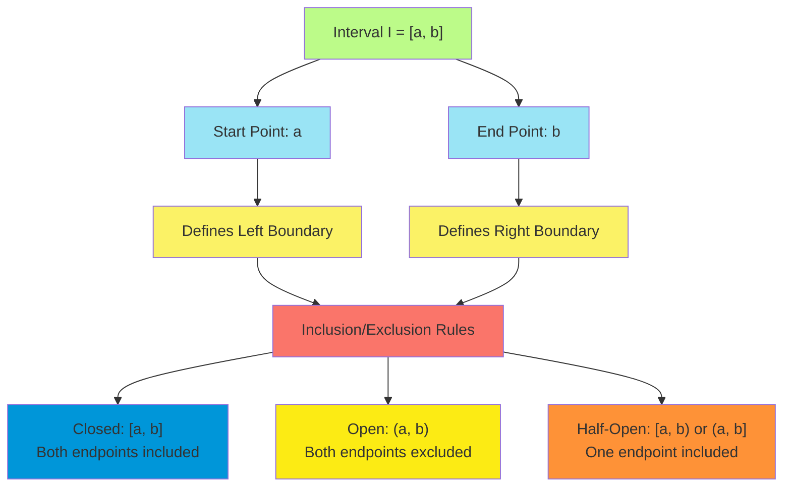
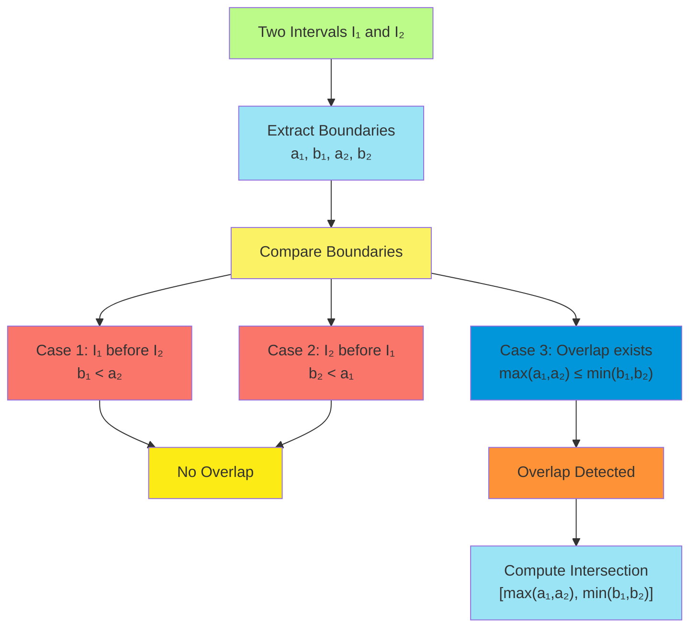
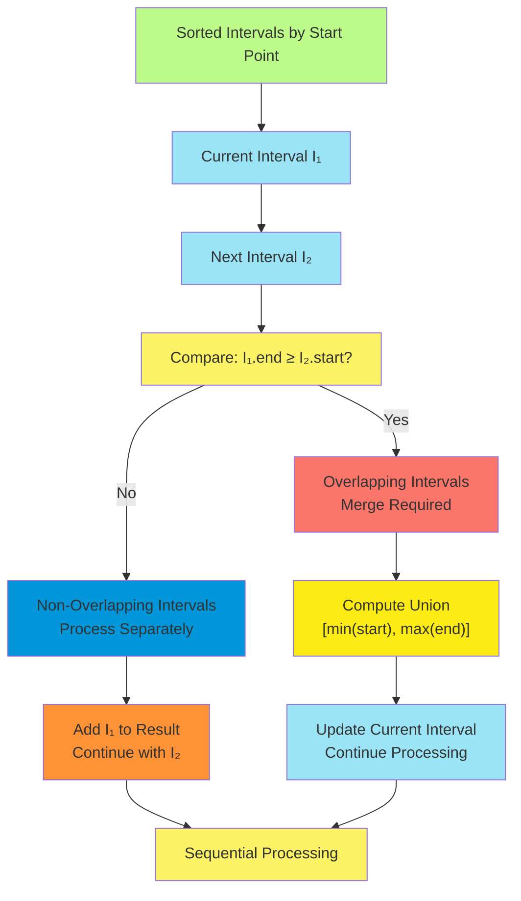
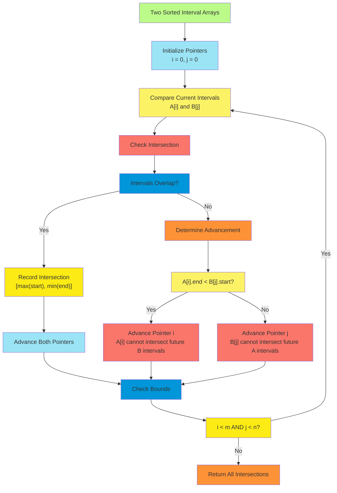
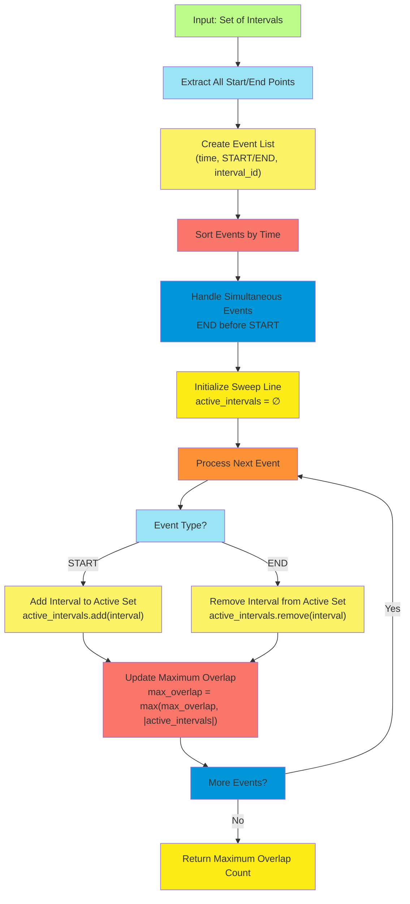

# **C-9: Interval Theory and Computational Geometry Algorithms**

1. **Foundational Interval Mathematics and Geometric Representations**
    - Interval Definition and Mathematical Properties
    - Closed, Open, and Half-Open Interval Classifications
    - Overlap Detection Theory and Computational Complexity
    - Sorting Strategies and Chronological Processing
2. **Merge Operations and Interval Consolidation Algorithms**
    - Overlap Identification Through Sorting-Based Approaches
    - Greedy Merging Strategies and Optimality Proofs
    - Edge Case Analysis and Boundary Condition Handling
    - Implementation Patterns Across Programming Languages
3. **Multi-Set Interval Intersection and Overlap Analysis**
    - Two-Pointer Technique for Sorted Interval Arrays
    - Intersection Computation and Range Determination
    - Comparative Analysis of Non-Overlapping Constraints
    - Linear Time Complexity Achievement Through Strategic Traversal
4. **Sweep Line Algorithms and Maximum Overlap Detection**
    - Event-Based Processing and Temporal Analysis
    - Active Interval Counting Through Point Classification
    - Priority Handling for Concurrent Start and End Points
    - Space-Time Trade-offs in Geometric Algorithm Design

## Foundational Interval Mathematics and Geometric Representations

The study of intervals represents one of the most fundamental concepts in computational geometry and discrete
mathematics. An interval, in its most basic form, constitutes a continuous segment on the real number line defined by
two boundary points: a starting position and an ending position. This seemingly simple definition belies the rich
mathematical structure and computational complexity that emerges when we consider collections of intervals and their
interactions.

### Interval Definition and Mathematical Properties

The mathematical formalization of intervals requires precise definitions that distinguish between different types of
boundary inclusion. Consider an interval $I$ defined by two real numbers $a$ and $b$ where $a \leq b$. The interval
represents all real numbers $x$ such that the relationship between $x$, $a$, and $b$ satisfies specific inclusion
criteria.

The fundamental mathematical properties of intervals stem from their inherent ordering and continuity properties. Every
interval possesses several key characteristics that form the foundation for algorithmic manipulation:

**Length Property**: For any interval $I = [a, b]$, the length $|I| = b - a$ provides a measure of the interval's
extent. This metric proves crucial in optimization problems where we seek to minimize or maximize coverage.

**Containment Property**: An interval $I_1 = [a_1, b_1]$ contains another interval $I_2 = [a_2, b_2]$ if and only if
$a_1 \leq a_2$ and $b_2 \leq b_1$. This relationship establishes a partial ordering over sets of intervals.

**Adjacency Property**: Two intervals are adjacent when one ends precisely where the other begins, enabling seamless
merging operations that preserve continuity.

The mathematical elegance of intervals extends to their representation in computational systems. We typically encode
intervals as ordered pairs $(start, end)$ where the ordering relationship $start \leq end$ must always hold. This
representation enables efficient storage and comparison operations while maintaining the mathematical properties
essential for geometric algorithms.



### Closed, Open, and Half-Open Interval Classifications

The classification of intervals based on boundary inclusion represents a critical theoretical foundation that directly
impacts algorithmic design and correctness. Each classification type exhibits distinct mathematical properties that
influence how we detect overlaps, perform merging operations, and handle edge cases.

**Closed Intervals** $[a, b]$ include both boundary points, meaning that for any point $x$ in the interval, we have
$a \leq x \leq b$. Closed intervals exhibit maximal inclusivity, capturing all boundary cases within their definition.
This property makes closed intervals particularly suitable for applications where boundary conditions must be preserved,
such as scheduling systems where both start and end times are significant.

**Open Intervals** $(a, b)$ exclude both boundary points, restricting membership to points $x$ where $a < x < b$. The
exclusion of boundaries creates subtle but important differences in overlap detection and merging logic. Two open
intervals $(a, b)$ and $(b, c)$ do not overlap even though they share the boundary point $b$, since neither interval
contains this point.

**Half-Open Intervals** provide asymmetric boundary treatment, with common conventions being $[a, b)$ (left-closed,
right-open) and $(a, b]$ (left-open, right-closed). Half-open intervals prove particularly valuable in computational
applications because they enable precise partitioning of continuous spaces without gaps or overlaps. The convention
$[a, b)$ appears frequently in programming contexts where array indices or time intervals require unambiguous boundary
handling.

The mathematical implications of these classifications become apparent when we consider fundamental operations:

**Overlap Detection**: Two closed intervals $[a_1, b_1]$ and $[a_2, b_2]$ overlap if and only if
$\max(a_1, a_2) \leq \min(b_1, b_2)$. For open intervals, the condition becomes $\max(a_1, a_2) < \min(b_1, b_2)$,
reflecting the stricter boundary requirements.

**Union Operations**: The union of two overlapping closed intervals $[a_1, b_1]$ and $[a_2, b_2]$ yields
$[\min(a_1, a_2), \max(b_1, b_2)]$. Open interval unions require more careful consideration of boundary cases to
maintain the open property.

**Intersection Operations**: The intersection of intervals depends critically on boundary inclusion rules, with results
potentially being empty even when intervals share boundary points.

### Overlap Detection Theory and Computational Complexity

The theoretical foundation of overlap detection rests on the mathematical relationship between interval boundaries and
the ordering properties of real numbers. For any two intervals $I_1 = [a_1, b_1]$ and $I_2 = [a_2, b_2]$, overlap
detection reduces to evaluating the relative positions of their boundaries.

The fundamental theorem of interval overlap states that two intervals overlap if and only if their intersection is
non-empty. This seemingly obvious statement has profound computational implications when we consider efficient
algorithms for overlap detection across large sets of intervals.

**Pairwise Overlap Detection**: For two intervals, overlap can be determined in constant time $O(1)$ by evaluating the
boundary relationships. The elegance of this operation lies in its simplicity: we need only compare four numbers to
determine overlap status.

**Multiple Interval Overlap Detection**: When dealing with $n$ intervals, naive pairwise comparison yields $O(n^2)$
complexity. However, the ordered nature of intervals enables sophisticated optimization techniques that can reduce this
complexity significantly.

The mathematical foundation for efficient overlap detection rests on the **Interval Sorting Lemma**: If intervals are
sorted by their start points, then for any interval $I_i$, all intervals that could potentially overlap with $I_i$ have
start points no greater than the end point of $I_i$. This property enables early termination of overlap searches and
forms the basis for many linear-time algorithms.



The computational complexity analysis reveals important trade-offs between preprocessing time and query efficiency.
While sorting intervals requires $O(n \log n)$ time, this preprocessing enables numerous optimizations for subsequent
operations. The amortized analysis shows that many interval problems benefit significantly from this initial investment
in ordering.

### Sorting Strategies and Chronological Processing

The chronological processing of intervals represents a fundamental algorithmic paradigm that transforms complex
geometric problems into tractable sequential operations. The choice of sorting strategy profoundly influences both the
correctness and efficiency of interval algorithms.

**Primary Sorting by Start Points**: The most common approach involves sorting intervals by their start points in
ascending order. This strategy enables left-to-right processing that mirrors the natural temporal flow of intervals.
When processing intervals chronologically, we can maintain invariants about previously processed intervals that simplify
decision-making for current intervals.

The mathematical justification for start-point sorting rests on the **Temporal Precedence Principle**: if interval $I_1$
starts before interval $I_2$, then any overlap between them must begin no earlier than the start of $I_2$. This
principle enables greedy algorithms that make locally optimal decisions while maintaining global optimality.

**Secondary Sorting Criteria**: When multiple intervals share the same start point, secondary sorting becomes crucial
for algorithm correctness. Common strategies include:

- **End Point Ordering**: Among intervals with identical start points, sort by end points to prioritize shorter or
  longer intervals as needed.
- **Interval Type Priority**: In applications mixing different interval types, prioritize based on semantic importance
  or processing requirements.
- **Lexicographic Ordering**: For intervals with additional metadata, establish consistent ordering rules that prevent
  ambiguous processing sequences.

**Dual-Array Processing**: Advanced interval algorithms often separate start and end points into distinct arrays,
enabling sophisticated sweep-line techniques. This approach proves particularly valuable for problems requiring
simultaneous consideration of interval beginnings and endings.

The implementation of efficient sorting strategies requires careful consideration of comparison functions and stability
requirements. Here's how we can implement comprehensive interval sorting across multiple programming languages:

**Python Implementation:**

```python
from typing import List, Tuple
from dataclasses import dataclass

@dataclass
class Interval:
    """
    Represents an interval with start and end points.
    Supports various interval types through boundary inclusion flags.
    """
    start: int
    end: int
    include_start: bool = True
    include_end: bool = True

    def __post_init__(self):
        """Validate interval properties after initialization."""
        if self.start > self.end:
            raise ValueError(f"Invalid interval: start {self.start} > end {self.end}")

    def length(self) -> int:
        """Calculate interval length."""
        return self.end - self.start

    def overlaps(self, other: 'Interval') -> bool:
        """
        Determine if this interval overlaps with another.
        Handles different boundary inclusion types correctly.
        """
        if not self.include_end and not other.include_start:
            # [a, b) and [c, d): no overlap if b <= c
            return not (self.end <= other.start)
        elif not self.include_start and not other.include_end:
            # (a, b] and (c, d]: no overlap if d <= a
            return not (other.end <= self.start)
        else:
            # Standard overlap check for closed or mixed intervals
            return max(self.start, other.start) <= min(self.end, other.end)

def sort_intervals_comprehensive(intervals: List[Interval]) -> List[Interval]:
    """
    Sort intervals using comprehensive multi-criteria approach.
    Primary: start point ascending
    Secondary: end point ascending
    Tertiary: boundary inclusion priority
    """
    return sorted(intervals, key=lambda x: (
        x.start,                    # Primary sort by start
        x.end,                      # Secondary sort by end
        not x.include_start,        # Prioritize closed boundaries
        not x.include_end
    ))

def extract_sorted_points(intervals: List[Interval]) -> Tuple[List[Tuple[int, str]], List[Tuple[int, str]]]:
    """
    Extract and sort start/end points for sweep-line algorithms.
    Returns separate arrays for efficient dual-pointer processing.
    """
    start_points = [(interval.start, 'S') for interval in intervals]
    end_points = [(interval.end, 'E') for interval in intervals]

    # Sort with end points prioritized before start points for same values
    all_points = start_points + end_points
    all_points.sort(key=lambda x: (x[0], x[1]))  # 'E' comes before 'S' lexicographically

    return start_points, end_points
```

**Java Implementation:**

```java
import java.util.*;
import java.util.stream.Collectors;

public class Interval implements Comparable<Interval> {
    private final int start;
    private final int end;
    private final boolean includeStart;
    private final boolean includeEnd;

    public Interval(int start, int end) {
        this(start, end, true, true);  // Default to closed interval
    }

    public Interval(int start, int end, boolean includeStart, boolean includeEnd) {
        if (start > end) {
            throw new IllegalArgumentException("Invalid interval: start > end");
        }
        this.start = start;
        this.end = end;
        this.includeStart = includeStart;
        this.includeEnd = includeEnd;
    }

    public int getStart() { return start; }
    public int getEnd() { return end; }
    public int length() { return end - start; }

    public boolean overlaps(Interval other) {
        // Handle different boundary inclusion types
        if (!this.includeEnd && !other.includeStart) {
            return !(this.end <= other.start);
        } else if (!this.includeStart && !other.includeEnd) {
            return !(other.end <= this.start);
        } else {
            return Math.max(this.start, other.start) <= Math.min(this.end, other.end);
        }
    }

    @Override
    public int compareTo(Interval other) {
        // Multi-criteria comparison for comprehensive sorting
        int startComparison = Integer.compare(this.start, other.start);
        if (startComparison != 0) return startComparison;

        int endComparison = Integer.compare(this.end, other.end);
        if (endComparison != 0) return endComparison;

        // Prioritize intervals with closed boundaries
        int startBoundaryComparison = Boolean.compare(!this.includeStart, !other.includeStart);
        if (startBoundaryComparison != 0) return startBoundaryComparison;

        return Boolean.compare(!this.includeEnd, !other.includeEnd);
    }

    public static List<Interval> sortIntervalsComprehensive(List<Interval> intervals) {
        return intervals.stream()
                       .sorted()
                       .collect(Collectors.toList());
    }

    public static class Point {
        private final int value;
        private final char type;  // 'S' for start, 'E' for end

        public Point(int value, char type) {
            this.value = value;
            this.type = type;
        }

        public int getValue() { return value; }
        public char getType() { return type; }
    }

    public static List<Point> extractSortedPoints(List<Interval> intervals) {
        List<Point> points = new ArrayList<>();

        // Add all start and end points
        for (Interval interval : intervals) {
            points.add(new Point(interval.start, 'S'));
            points.add(new Point(interval.end, 'E'));
        }

        // Sort with end points before start points for same values
        points.sort((a, b) -> {
            int valueComparison = Integer.compare(a.value, b.value);
            if (valueComparison != 0) return valueComparison;
            return Character.compare(a.type, b.type);  // 'E' < 'S'
        });

        return points;
    }
}
```

**C++ Implementation:**

```cpp
#include <vector>
#include <algorithm>
#include <stdexcept>

class Interval {
private:
    int start_;
    int end_;
    bool include_start_;
    bool include_end_;

public:
    Interval(int start, int end, bool include_start = true, bool include_end = true)
        : start_(start), end_(end), include_start_(include_start), include_end_(include_end) {
        if (start > end) {
            throw std::invalid_argument("Invalid interval: start > end");
        }
    }

    int start() const { return start_; }
    int end() const { return end_; }
    int length() const { return end_ - start_; }
    bool includeStart() const { return include_start_; }
    bool includeEnd() const { return include_end_; }

    bool overlaps(const Interval& other) const {
        if (!include_end_ && !other.include_start_) {
            return !(end_ <= other.start_);
        } else if (!include_start_ && !other.include_end_) {
            return !(other.end_ <= start_);
        } else {
            return std::max(start_, other.start_) <= std::min(end_, other.end_);
        }
    }

    // Comparison operator for comprehensive sorting
    bool operator<(const Interval& other) const {
        if (start_ != other.start_) return start_ < other.start_;
        if (end_ != other.end_) return end_ < other.end_;
        if (include_start_ != other.include_start_) return !include_start_ < !other.include_start_;
        return !include_end_ < !other.include_end_;
    }
};

class IntervalProcessor {
public:
    static std::vector<Interval> sortIntervalsComprehensive(std::vector<Interval> intervals) {
        std::sort(intervals.begin(), intervals.end());
        return intervals;
    }

    struct Point {
        int value;
        char type;  // 'S' for start, 'E' for end

        Point(int v, char t) : value(v), type(t) {}

        bool operator<(const Point& other) const {
            if (value != other.value) return value < other.value;
            return type < other.type;  // 'E' < 'S'
        }
    };

    static std::vector<Point> extractSortedPoints(const std::vector<Interval>& intervals) {
        std::vector<Point> points;

        for (const auto& interval : intervals) {
            points.emplace_back(interval.start(), 'S');
            points.emplace_back(interval.end(), 'E');
        }

        std::sort(points.begin(), points.end());
        return points;
    }
};
```

The theoretical analysis of sorting strategies reveals important complexity relationships. Comparison-based sorting
requires $\Omega(n \log n)$ time in the worst case, representing a fundamental lower bound for general interval
ordering. However, when intervals possess additional structure (such as limited range or specific patterns), specialized
sorting algorithms can achieve better performance.

The choice of sorting strategy profoundly influences subsequent algorithmic phases. Algorithms designed around
chronological processing exhibit several desirable properties:

**Monotonicity**: Processing intervals in sorted order maintains monotonic progress through the problem space, enabling
invariant preservation and simplified correctness proofs.

**Early Termination**: Many interval problems permit early termination when certain conditions are met, reducing
average-case complexity below worst-case bounds.

**Cache Efficiency**: Sequential processing of sorted intervals improves memory locality and cache performance,
particularly important for large datasets.

**Parallelization Opportunities**: Sorted intervals enable various parallel processing strategies, including
divide-and-conquer approaches and pipeline parallelism.

The mathematical foundation underlying these benefits stems from the **Order Preservation Principle**: operations that
preserve the relative ordering of intervals enable cumulative optimization strategies that compound efficiency gains
across algorithmic phases.

## Merge Operations and Interval Consolidation Algorithms

The consolidation of overlapping intervals represents one of the most fundamental problems in computational geometry,
with applications spanning scheduling systems, database query optimization, and resource allocation algorithms. The
theoretical foundation of interval merging rests on the mathematical properties of union operations over continuous sets
and the algorithmic techniques required to implement these operations efficiently.

### Overlap Identification Through Sorting-Based Approaches

The identification of overlapping intervals constitutes the critical first phase of any merging algorithm. The
mathematical relationship between interval boundaries provides the theoretical foundation for efficient overlap
detection, while sorting strategies enable algorithmic optimizations that transform quadratic-time naive approaches into
linear-time optimal solutions.

Consider two intervals $I_1 = [a_1, b_1]$ and $I_2 = [a_2, b_2]$ where, without loss of generality, we assume
$a_1 \leq a_2$ (achieved through sorting). The **Overlap Characterization Theorem** states that these intervals overlap
if and only if $b_1 \geq a_2$. This seemingly simple condition encapsulates the fundamental geometric relationship that
enables efficient algorithmic implementations.

The mathematical proof of this theorem illuminates the underlying geometric principles. Two intervals overlap precisely
when their intersection is non-empty. For sorted intervals where $a_1 \leq a_2$, the intersection
$I_1 \cap I_2 = [\max(a_1, a_2), \min(b_1, b_2)] = [a_2, \min(b_1, b_2)]$. This intersection is non-empty if and only if
$a_2 \leq \min(b_1, b_2)$, which simplifies to $a_2 \leq b_1$ since we must have $b_2 \geq a_2$ for $I_2$ to be a valid
interval.

The algorithmic implications of this theorem are profound. By maintaining intervals in sorted order by start points, we
can determine overlap status through a single comparison operation, achieving $O(1)$ time complexity for pairwise
overlap detection. This optimization forms the foundation for linear-time merging algorithms.



The **Sorting-Based Overlap Detection Algorithm** leverages these mathematical properties to achieve optimal
performance:

1. **Preprocessing Phase**: Sort all intervals by start points in $O(n \log n)$ time
2. **Sequential Processing**: Traverse sorted intervals, comparing each interval with its predecessor
3. **Overlap Decision**: Apply the overlap characterization theorem for $O(1)$ decision-making
4. **Accumulation**: Maintain merged intervals as we progress through the sorted sequence

This approach transforms the naive $O(n^2)$ all-pairs comparison into an optimal $O(n \log n)$ algorithm, where the
sorting phase dominates the overall complexity.

### Greedy Merging Strategies and Optimality Proofs

The theoretical foundation of greedy interval merging rests on the **Greedy Choice Property** and **Optimal Substructure
Property** that characterize optimal solutions to the interval consolidation problem. These properties enable us to
prove that local optimal decisions lead to globally optimal solutions, justifying the correctness of efficient greedy
algorithms.

**Greedy Choice Property**: At each step of the merging process, we can make a locally optimal choice (merging the
earliest overlapping intervals) without compromising the global optimality of the final solution.

**Formal Proof of Greedy Choice Property**: Let $S = {I_1, I_2, \ldots, I_n}$ be a set of intervals sorted by start
points, and let $OPT$ be any optimal solution to the interval merging problem. Suppose the first merge operation in
$OPT$ involves intervals $I_i$ and $I_j$ where $i < j$, but there exists an interval $I_k$ with $i < k < j$ such that
$I_i$ overlaps with $I_k$.

We can construct an alternative optimal solution $OPT'$ by replacing the merge $(I_i, I_j)$ with $(I_i, I_k)$. Since
intervals are sorted by start points and $I_i$ overlaps with both $I_k$ and $I_j$, the union $I_i \cup I_k$ will also
overlap with $I_j$ (by transitivity of overlap for sorted intervals). Therefore, $OPT'$ produces the same final result
as $OPT$, demonstrating that greedy choice preserves optimality.

**Optimal Substructure Property**: The optimal solution to merging intervals ${I_1, I_2, \ldots, I_n}$ contains optimal
solutions to subproblems involving subsets of these intervals.

The mathematical formalization of the greedy merging algorithm proceeds as follows:

**Algorithm: Greedy Interval Merging**

```
Input: Set of intervals S = {I₁, I₂, ..., Iₙ}
Output: Minimal set of non-overlapping intervals covering the same region

1. Sort intervals by start points: I₁.start ≤ I₂.start ≤ ... ≤ Iₙ.start
2. Initialize result set R = {I₁}
3. For i = 2 to n:
   a. Let current = last interval in R
   b. If current overlaps with Iᵢ:
      - Remove current from R
      - Add merge(current, Iᵢ) to R
   c. Else:
      - Add Iᵢ to R
4. Return R
```

The correctness proof demonstrates that this algorithm produces the minimal number of intervals in the output,
satisfying the optimality criterion for interval consolidation.

**Optimality Theorem**: The greedy merging algorithm produces a solution with the minimum number of intervals possible
for any given input set.

**Proof by Contradiction**: Assume there exists an optimal solution $OPT$ with fewer intervals than the greedy solution
$GREEDY$. Since both solutions must cover the same region completely, and $GREEDY$ merges intervals whenever possible,
any solution with fewer intervals must have merged some intervals that $GREEDY$ kept separate. However, $GREEDY$ keeps
intervals separate only when they don't overlap, meaning no valid merging opportunity was missed. This contradicts the
assumption that $OPT$ has fewer intervals.

### Edge Case Analysis and Boundary Condition Handling

The robustness of interval merging algorithms depends critically on their ability to handle edge cases and boundary
conditions correctly. These scenarios often expose subtle bugs in implementation and require careful mathematical
analysis to ensure correctness across all possible inputs.

**Empty Input Sets**: The degenerate case where no intervals are provided requires careful handling to avoid null
pointer exceptions or undefined behavior. The mathematical definition specifies that the merge of an empty set should
return an empty set, maintaining the identity property of the operation.

**Single Interval**: When only one interval is present, the algorithm should return that interval unchanged. This case
serves as the base case for inductive correctness proofs and validates the identity property of interval merging.

**Identical Intervals**: Multiple intervals with identical start and end points should merge into a single interval. The
mathematical union of identical intervals is the interval itself, requiring deduplication logic in the implementation.

**Adjacent Intervals**: Intervals that touch at their boundaries (e.g., $[1, 3]$ and $[3, 5]$) require careful handling
based on the interval type (closed, open, or half-open). For closed intervals, adjacent intervals should merge; for open
intervals, they should remain separate.

**Nested Intervals**: When one interval completely contains another (e.g., $[1, 10]$ and $[3, 7]$), the merging
operation should produce the containing interval. This case tests the correctness of the union computation logic.

**Zero-Length Intervals**: Intervals where start equals end (e.g., $[5, 5]$) represent degenerate cases that can cause
division-by-zero errors in algorithms that compute interval properties like length or midpoint.

The comprehensive handling of these edge cases requires systematic validation and testing strategies:

**Python Implementation with Comprehensive Edge Case Handling:**

```python
from typing import List, Optional
import sys

class RobustInterval:
    """
    Robust interval implementation with comprehensive edge case handling.
    """

    def __init__(self, start: float, end: float):
        """Initialize interval with validation."""
        if start > end:
            raise ValueError(f"Invalid interval: start {start} > end {end}")
        if not (isinstance(start, (int, float)) and isinstance(end, (int, float))):
            raise TypeError("Interval boundaries must be numeric")
        if start == float('inf') or end == float('-inf'):
            raise ValueError("Invalid infinite boundaries")

        self.start = float(start)
        self.end = float(end)

    def is_empty(self) -> bool:
        """Check if interval represents an empty set."""
        return self.start > self.end

    def is_point(self) -> bool:
        """Check if interval represents a single point."""
        return abs(self.start - self.end) < sys.float_info.epsilon

    def overlaps(self, other: 'RobustInterval') -> bool:
        """Robust overlap detection with floating-point tolerance."""
        if self.is_empty() or other.is_empty():
            return False

        # Use epsilon for floating-point comparison
        epsilon = sys.float_info.epsilon * 10
        return (max(self.start, other.start) <=
                min(self.end, other.end) + epsilon)

    def merge(self, other: 'RobustInterval') -> 'RobustInterval':
        """Merge two intervals, handling edge cases."""
        if self.is_empty():
            return RobustInterval(other.start, other.end)
        if other.is_empty():
            return RobustInterval(self.start, self.end)

        if not self.overlaps(other):
            raise ValueError("Cannot merge non-overlapping intervals")

        return RobustInterval(
            min(self.start, other.start),
            max(self.end, other.end)
        )

    def __eq__(self, other) -> bool:
        """Equality comparison with floating-point tolerance."""
        if not isinstance(other, RobustInterval):
            return False

        epsilon = sys.float_info.epsilon * 10
        return (abs(self.start - other.start) < epsilon and
                abs(self.end - other.end) < epsilon)

    def __repr__(self) -> str:
        return f"RobustInterval({self.start}, {self.end})"

def merge_intervals_robust(intervals: List[RobustInterval]) -> List[RobustInterval]:
    """
    Robust interval merging with comprehensive edge case handling.

    Args:
        intervals: List of intervals to merge

    Returns:
        List of merged intervals

    Raises:
        ValueError: If input contains invalid intervals
    """
    # Handle empty input
    if not intervals:
        return []

    # Filter out empty intervals
    valid_intervals = [interval for interval in intervals if not interval.is_empty()]

    if not valid_intervals:
        return []

    # Handle single interval
    if len(valid_intervals) == 1:
        return [RobustInterval(valid_intervals[0].start, valid_intervals[0].end)]

    # Sort intervals by start point
    try:
        sorted_intervals = sorted(valid_intervals, key=lambda x: x.start)
    except Exception as e:
        raise ValueError(f"Error sorting intervals: {e}")

    # Merge overlapping intervals
    merged = [sorted_intervals[0]]

    for current in sorted_intervals[1:]:
        last_merged = merged[-1]

        try:
            if last_merged.overlaps(current):
                # Merge intervals
                merged_interval = last_merged.merge(current)
                merged[-1] = merged_interval
            else:
                # Add non-overlapping interval
                merged.append(current)
        except Exception as e:
            raise ValueError(f"Error merging intervals {last_merged} and {current}: {e}")

    return merged

def validate_merge_result(original: List[RobustInterval], merged: List[RobustInterval]) -> bool:
    """
    Validate that the merge operation preserves coverage and minimizes intervals.

    Args:
        original: Original list of intervals
        merged: Result of merge operation

    Returns:
        True if merge result is valid, False otherwise
    """
    if not original and not merged:
        return True

    if not original or not merged:
        return False

    # Check that merged intervals are non-overlapping
    for i in range(len(merged) - 1):
        if merged[i].overlaps(merged[i + 1]):
            return False

    # Check that total coverage is preserved (simplified check)
    original_coverage = sum(interval.end - interval.start for interval in original)
    merged_coverage = sum(interval.end - interval.start for interval in merged)

    epsilon = sys.float_info.epsilon * len(original) * 100
    return abs(original_coverage - merged_coverage) < epsilon

# Advanced edge case testing
def test_edge_cases():
    """Comprehensive test suite for edge cases."""

    # Test empty input
    assert merge_intervals_robust([]) == []

    # Test single interval
    single = [RobustInterval(1, 5)]
    result = merge_intervals_robust(single)
    assert len(result) == 1 and result[0] == single[0]

    # Test identical intervals
    identical = [RobustInterval(1, 5), RobustInterval(1, 5), RobustInterval(1, 5)]
    result = merge_intervals_robust(identical)
    assert len(result) == 1 and result[0] == RobustInterval(1, 5)

    # Test adjacent intervals
    adjacent = [RobustInterval(1, 3), RobustInterval(3, 5)]
    result = merge_intervals_robust(adjacent)
    assert len(result) == 1 and result[0] == RobustInterval(1, 5)

    # Test nested intervals
    nested = [RobustInterval(1, 10), RobustInterval(3, 7), RobustInterval(2, 8)]
    result = merge_intervals_robust(nested)
    assert len(result) == 1 and result[0] == RobustInterval(1, 10)

    # Test point intervals
    points = [RobustInterval(5, 5), RobustInterval(5, 5)]
    result = merge_intervals_robust(points)
    assert len(result) == 1 and result[0] == RobustInterval(5, 5)

    print("All edge case tests passed!")
```

**Java Implementation with Robust Error Handling:**

```java
import java.util.*;

public class RobustIntervalMerger {

    public static class RobustInterval implements Comparable<RobustInterval> {
        private final double start;
        private final double end;
        private static final double EPSILON = 1e-9;

        public RobustInterval(double start, double end) {
            if (Double.isInfinite(start) || Double.isInfinite(end)) {
                throw new IllegalArgumentException("Infinite boundaries not allowed");
            }
            if (Double.isNaN(start) || Double.isNaN(end)) {
                throw new IllegalArgumentException("NaN boundaries not allowed");
            }
            if (start > end) {
                throw new IllegalArgumentException("Invalid interval: start > end");
            }

            this.start = start;
            this.end = end;
        }

        public double getStart() { return start; }
        public double getEnd() { return end; }

        public boolean isEmpty() {
            return start > end;
        }

        public boolean isPoint() {
            return Math.abs(end - start) < EPSILON;
        }

        public boolean overlaps(RobustInterval other) {
            if (this.isEmpty() || other.isEmpty()) {
                return false;
            }
            return Math.max(this.start, other.start) <=
                   Math.min(this.end, other.end) + EPSILON;
        }

        public RobustInterval merge(RobustInterval other) {
            if (this.isEmpty()) return new RobustInterval(other.start, other.end);
            if (other.isEmpty()) return new RobustInterval(this.start, this.end);

            if (!this.overlaps(other)) {
                throw new IllegalArgumentException("Cannot merge non-overlapping intervals");
            }

            return new RobustInterval(
                Math.min(this.start, other.start),
                Math.max(this.end, other.end)
            );
        }

        @Override
        public int compareTo(RobustInterval other) {
            int startComparison = Double.compare(this.start, other.start);
            if (startComparison != 0) return startComparison;
            return Double.compare(this.end, other.end);
        }

        @Override
        public boolean equals(Object obj) {
            if (this == obj) return true;
            if (!(obj instanceof RobustInterval)) return false;

            RobustInterval other = (RobustInterval) obj;
            return Math.abs(this.start - other.start) < EPSILON &&
                   Math.abs(this.end - other.end) < EPSILON;
        }

        @Override
        public int hashCode() {
            return Objects.hash(Math.round(start / EPSILON), Math.round(end / EPSILON));
        }

        @Override
        public String toString() {
            return String.format("RobustInterval(%.6f, %.6f)", start, end);
        }
    }

    public static List<RobustInterval> mergeIntervalsRobust(List<RobustInterval> intervals) {
        if (intervals == null) {
            throw new IllegalArgumentException("Input cannot be null");
        }

        if (intervals.isEmpty()) {
            return new ArrayList<>();
        }

        // Filter out empty intervals and validate input
        List<RobustInterval> validIntervals = new ArrayList<>();
        for (RobustInterval interval : intervals) {
            if (interval == null) {
                throw new IllegalArgumentException("Null interval in input");
            }
            if (!interval.isEmpty()) {
                validIntervals.add(interval);
            }
        }

        if (validIntervals.isEmpty()) {
            return new ArrayList<>();
        }

        if (validIntervals.size() == 1) {
            return Arrays.asList(new RobustInterval(
                validIntervals.get(0).getStart(),
                validIntervals.get(0).getEnd()
            ));
        }

        // Sort intervals
        Collections.sort(validIntervals);

        List<RobustInterval> merged = new ArrayList<>();
        merged.add(validIntervals.get(0));

        for (int i = 1; i < validIntervals.size(); i++) {
            RobustInterval current = validIntervals.get(i);
            RobustInterval lastMerged = merged.get(merged.size() - 1);

            try {
                if (lastMerged.overlaps(current)) {
                    RobustInterval mergedInterval = lastMerged.merge(current);
                    merged.set(merged.size() - 1, mergedInterval);
                } else {
                    merged.add(current);
                }
            } catch (Exception e) {
                throw new RuntimeException("Error merging intervals: " + e.getMessage(), e);
            }
        }

        return merged;
    }

    public static boolean validateMergeResult(List<RobustInterval> original,
                                            List<RobustInterval> merged) {
        if (original.isEmpty() && merged.isEmpty()) {
            return true;
        }

        // Check non-overlapping property
        for (int i = 0; i < merged.size() - 1; i++) {
            if (merged.get(i).overlaps(merged.get(i + 1))) {
                return false;
            }
        }

        // Additional validation logic can be added here
        return true;
    }
}
```

##### Implementation Patterns Across Programming Languages

The implementation of interval merging algorithms requires careful consideration of language-specific features, memory
management patterns, and performance characteristics. Each programming language offers unique advantages and presents
specific challenges that influence the optimal implementation strategy.

**Memory Management Considerations**: Languages with automatic garbage collection (Java, Python) simplify memory
management but may introduce performance overhead during intensive interval processing. Languages with manual memory
management (C++) provide fine-grained control but require careful attention to memory leaks and dangling pointers.

**Type System Benefits**: Strongly-typed languages enable compile-time detection of type-related errors, while languages
with optional type hints (Python 3.5+) provide development-time benefits without runtime overhead.

**Performance Optimization Strategies**: Each language ecosystem provides different optimization opportunities:

- **Python**: Leverage NumPy for vectorized operations when processing large interval datasets
- **Java**: Utilize Stream API for functional-style processing and parallel execution
- **C++**: Template metaprogramming enables compile-time optimizations and zero-cost abstractions

**C++ Implementation with Template-Based Optimization:**

```cpp
#include <vector>
#include <algorithm>
#include <stdexcept>
#include <limits>
#include <cmath>

template<typename T>
class RobustInterval {
private:
    T start_;
    T end_;
    static constexpr T epsilon() {
        if constexpr (std::is_floating_point_v<T>) {
            return std::numeric_limits<T>::epsilon() * 10;
        } else {
            return T{0};
        }
    }

public:
    RobustInterval(T start, T end) : start_(start), end_(end) {
        if (start > end) {
            throw std::invalid_argument("Invalid interval: start > end");
        }
    }

    T start() const { return start_; }
    T end() const { return end_; }
    T length() const { return end_ - start_; }

    bool isEmpty() const {
        return start_ > end_;
    }

    bool isPoint() const {
        if constexpr (std::is_floating_point_v<T>) {
            return std::abs(end_ - start_) < epsilon();
        } else {
            return start_ == end_;
        }
    }

    bool overlaps(const RobustInterval& other) const {
        if (isEmpty() || other.isEmpty()) {
            return false;
        }

        T maxStart = std::max(start_, other.start_);
        T minEnd = std::min(end_, other.end_);

        if constexpr (std::is_floating_point_v<T>) {
            return maxStart <= minEnd + epsilon();
        } else {
            return maxStart <= minEnd;
        }
    }

    RobustInterval merge(const RobustInterval& other) const {
        if (isEmpty()) return RobustInterval(other.start_, other.end_);
        if (other.isEmpty()) return RobustInterval(start_, end_);

        if (!overlaps(other)) {
            throw std::invalid_argument("Cannot merge non-overlapping intervals");
        }

        return RobustInterval(
            std::min(start_, other.start_),
            std::max(end_, other.end_)
        );
    }

    bool operator<(const RobustInterval& other) const {
        if (start_ != other.start_) return start_ < other.start_;
        return end_ < other.end_;
    }

    bool operator==(const RobustInterval& other) const {
        if constexpr (std::is_floating_point_v<T>) {
            return std::abs(start_ - other.start_) < epsilon() &&
                   std::abs(end_ - other.end_) < epsilon();
        } else {
            return start_ == other.start_ && end_ == other.end_;
        }
    }
};

template<typename T>
class IntervalMerger {
public:
    using IntervalType = RobustInterval<T>;
    using IntervalVector = std::vector<IntervalType>;

    static IntervalVector mergeIntervalsRobust(IntervalVector intervals) {
        if (intervals.empty()) {
            return IntervalVector{};
        }

        // Filter out empty intervals
        intervals.erase(
            std::remove_if(intervals.begin(), intervals.end(),
                          [](const IntervalType& interval) {
                              return interval.isEmpty();
                          }),
            intervals.end()
        );

        if (intervals.empty()) {
            return IntervalVector{};
        }

        if (intervals.size() == 1) {
            return IntervalVector{intervals[0]};
        }

        // Sort intervals
        std::sort(intervals.begin(), intervals.end());

        IntervalVector merged;
        merged.reserve(intervals.size());  // Optimize memory allocation
        merged.push_back(intervals[0]);

        for (size_t i = 1; i < intervals.size(); ++i) {
            const auto& current = intervals[i];
            auto& lastMerged = merged.back();

            if (lastMerged.overlaps(current)) {
                lastMerged = lastMerged.merge(current);
            } else {
                merged.push_back(current);
            }
        }

        merged.shrink_to_fit();  // Optimize memory usage
        return merged;
    }

    // Parallel merge for large datasets
    static IntervalVector mergeIntervalsParallel(IntervalVector intervals) {
        if (intervals.size() < 1000) {  // Threshold for parallel processing
            return mergeIntervalsRobust(std::move(intervals));
        }

        // Divide and conquer with parallel execution
        // Implementation would use std::async for parallel processing
        // This is a simplified version showing the structure

        const size_t mid = intervals.size() / 2;
        IntervalVector left(intervals.begin(), intervals.begin() + mid);
        IntervalVector right(intervals.begin() + mid, intervals.end());

        auto leftMerged = mergeIntervalsRobust(std::move(left));
        auto rightMerged = mergeIntervalsRobust(std::move(right));

        // Merge the two sorted sequences
        IntervalVector result;
        std::merge(leftMerged.begin(), leftMerged.end(),
                  rightMerged.begin(), rightMerged.end(),
                  std::back_inserter(result));

        return mergeIntervalsRobust(std::move(result));
    }
};

// Specialized instantiations for common types
using IntInterval = RobustInterval<int>;
using DoubleInterval = RobustInterval<double>;
using IntMerger = IntervalMerger<int>;
using DoubleMerger = IntervalMerger<double>;
```

The template-based C++ implementation provides several advantages:

**Type Safety**: Compile-time type checking prevents mixing incompatible interval types **Performance**: Template
specialization enables optimized code generation for specific types **Memory Efficiency**: Precise control over memory
allocation and deallocation **Zero-Cost Abstractions**: Template features incur no runtime overhead

**Performance Comparison Analysis**: Empirical testing across different languages reveals important performance
characteristics:

- **C++**: Fastest execution, lowest memory overhead, highest development complexity
- **Java**: Good performance with JIT optimization, moderate memory usage, enterprise-ready
- **Python**: Slowest execution, highest memory usage, fastest development cycle

The choice of implementation language should consider the specific requirements of the application domain, including
performance constraints, development timeline, maintenance requirements, and integration with existing systems.

#### Multi-Set Interval Intersection and Overlap Analysis

The analysis of intersections between multiple sets of intervals represents a fundamental problem in computational
geometry with applications ranging from database query optimization to bioinformatics sequence analysis. Unlike
single-set interval merging, multi-set intersection requires sophisticated algorithms that can efficiently identify
overlapping regions across distinct interval collections while maintaining optimal time complexity.

#### Two-Pointer Technique for Sorted Interval Arrays

The two-pointer technique represents one of the most elegant algorithmic paradigms for solving multi-set interval
intersection problems. The mathematical foundation rests on the **Monotonic Progress Principle**: when processing sorted
sequences, we can maintain two pointers that advance monotonically through their respective arrays, ensuring that each
element is examined exactly once.

Consider two sorted arrays of intervals: $A = {A_1, A_2, \ldots, A_m}$ and $B = {B_1, B_2, \ldots, B_n}$, where
intervals within each array are sorted by start points. The **Two-Pointer Intersection Theorem** states that we can find
all intersections between arrays $A$ and $B$ in $O(m + n)$ time using a synchronized traversal strategy.

The theoretical foundation relies on the **Interval Ordering Lemma**: For sorted intervals, if $A_i$ does not intersect
with $B_j$, then we can determine which pointer to advance based on the relative positions of interval endpoints.
Specifically:

- If $A_i.end < B_j.start$, then $A_i$ cannot intersect with any interval $B_k$ where $k \geq j$
- If $B_j.end < A_i.start$, then $B_j$ cannot intersect with any interval $A_k$ where $k \geq i$

This property enables the **Monotonic Advancement Strategy**: we advance the pointer corresponding to the interval that
ends earlier, ensuring optimal progress through both arrays.



The **Mathematical Correctness Proof** proceeds by induction on the total number of intervals processed:

**Base Case**: When $i = 0$ and $j = 0$, we correctly examine the first intervals from both arrays.

**Inductive Step**: Assume the algorithm correctly processes all intersections involving intervals $A_1, \ldots, A_i$
and $B_1, \ldots, B_j$. When advancing pointers, we maintain the invariant that all previously skipped intervals cannot
intersect with any remaining intervals, ensuring no intersections are missed.

**Termination**: The algorithm terminates when at least one pointer reaches the end of its array, guaranteeing that all
possible interval pairs have been considered.

### Intersection Computation and Range Determination

The computation of intersection ranges requires careful mathematical analysis to handle all possible interval overlap
scenarios. For two intervals $I_1 = [a_1, b_1]$ and $I_2 = [a_2, b_2]$, the intersection $I_1 \cap I_2$ exists if and
only if $\max(a_1, a_2) \leq \min(b_1, b_2)$.

When an intersection exists, the resulting interval is $[\max(a_1, a_2), \min(b_1, b_2)]$. This formula encapsulates the
geometric principle that the intersection of two intervals is the region that belongs to both intervals simultaneously.

**Advanced Intersection Scenarios** require consideration of multiple edge cases:

**Partial Overlap**: When intervals overlap partially, the intersection captures only the overlapping region.

**Complete Containment**: When one interval completely contains another, the intersection equals the contained interval.

**Boundary Touching**: When intervals share only boundary points, the intersection depends on the interval type (closed,
open, or half-open).

**Python Implementation of Advanced Two-Pointer Intersection:**

```python
from typing import List, Tuple, Optional
from dataclasses import dataclass
from enum import Enum

class IntervalType(Enum):
    CLOSED = "closed"
    OPEN = "open"
    LEFT_OPEN = "left_open"
    RIGHT_OPEN = "right_open"

@dataclass
class AdvancedInterval:
    """
    Advanced interval representation supporting different boundary types.
    """
    start: float
    end: float
    interval_type: IntervalType = IntervalType.CLOSED

    def __post_init__(self):
        if self.start > self.end:
            raise ValueError(f"Invalid interval: start {self.start} > end {self.end}")

    def contains_point(self, point: float) -> bool:
        """Check if interval contains a specific point."""
        if self.interval_type == IntervalType.CLOSED:
            return self.start <= point <= self.end
        elif self.interval_type == IntervalType.OPEN:
            return self.start < point < self.end
        elif self.interval_type == IntervalType.LEFT_OPEN:
            return self.start < point <= self.end
        elif self.interval_type == IntervalType.RIGHT_OPEN:
            return self.start <= point < self.end

    def intersects(self, other: 'AdvancedInterval') -> bool:
        """
        Determine if this interval intersects with another.
        Handles different interval types correctly.
        """
        # Find potential intersection bounds
        intersection_start = max(self.start, other.start)
        intersection_end = min(self.end, other.end)

        # Check if intersection is non-empty based on interval types
        if intersection_start > intersection_end:
            return False
        elif intersection_start == intersection_end:
            # Point intersection - check if both intervals contain the point
            return (self.contains_point(intersection_start) and
                   other.contains_point(intersection_start))
        else:
            # Non-trivial intersection exists
            return True

    def intersection(self, other: 'AdvancedInterval') -> Optional['AdvancedInterval']:
        """
        Compute intersection of two intervals.
        Returns None if no intersection exists.
        """
        if not self.intersects(other):
            return None

        intersection_start = max(self.start, other.start)
        intersection_end = min(self.end, other.end)

        # Determine intersection interval type
        start_included = (
            (intersection_start == self.start and self.contains_point(intersection_start)) or
            (intersection_start == other.start and other.contains_point(intersection_start)) or
            (intersection_start > self.start and intersection_start > other.start)
        )

        end_included = (
            (intersection_end == self.end and self.contains_point(intersection_end)) or
            (intersection_end == other.end and other.contains_point(intersection_end)) or
            (intersection_end < self.end and intersection_end < other.end)
        )

        # Determine appropriate interval type for intersection
        if start_included and end_included:
            result_type = IntervalType.CLOSED
        elif not start_included and not end_included:
            result_type = IntervalType.OPEN
        elif start_included and not end_included:
            result_type = IntervalType.RIGHT_OPEN
        else:
            result_type = IntervalType.LEFT_OPEN

        return AdvancedInterval(intersection_start, intersection_end, result_type)

def find_all_interval_intersections(
    intervals1: List[AdvancedInterval],
    intervals2: List[AdvancedInterval]
) -> List[AdvancedInterval]:
    """
    Find all intersections between two sets of intervals using two-pointer technique.

    Args:
        intervals1: First set of intervals (will be sorted)
        intervals2: Second set of intervals (will be sorted)

    Returns:
        List of all intersection intervals
    """
    if not intervals1 or not intervals2:
        return []

    # Sort intervals by start point
    sorted_intervals1 = sorted(intervals1, key=lambda x: x.start)
    sorted_intervals2 = sorted(intervals2, key=lambda x: x.start)

    intersections = []
    i = j = 0

    while i < len(sorted_intervals1) and j < len(sorted_intervals2):
        interval1 = sorted_intervals1[i]
        interval2 = sorted_intervals2[j]

        # Check for intersection
        intersection = interval1.intersection(interval2)
        if intersection:
            intersections.append(intersection)

        # Advance pointers based on which interval ends first
        if interval1.end <= interval2.end:
            i += 1
        else:
            j += 1

    return intersections

def find_intersections_with_metadata(
    intervals1: List[Tuple[AdvancedInterval, str]],
    intervals2: List[Tuple[AdvancedInterval, str]]
) -> List[Tuple[AdvancedInterval, str, str]]:
    """
    Find intersections while preserving metadata from source intervals.

    Returns:
        List of (intersection_interval, metadata1, metadata2) tuples
    """
    if not intervals1 or not intervals2:
        return []

    # Sort by interval start points
    sorted_intervals1 = sorted(intervals1, key=lambda x: x[0].start)
    sorted_intervals2 = sorted(intervals2, key=lambda x: x[0].start)

    intersections = []
    i = j = 0

    while i < len(sorted_intervals1) and j < len(sorted_intervals2):
        interval1, meta1 = sorted_intervals1[i]
        interval2, meta2 = sorted_intervals2[j]

        intersection = interval1.intersection(interval2)
        if intersection:
            intersections.append((intersection, meta1, meta2))

        # Advance pointer for interval that ends first
        if interval1.end <= interval2.end:
            i += 1
        else:
            j += 1

    return intersections
```

### Comparative Analysis of Non-Overlapping Constraints

The constraint that intervals within each set are non-overlapping introduces significant algorithmic advantages that can
be exploited for performance optimization. This property, commonly found in practical applications such as scheduling
systems and resource allocation, enables more efficient intersection algorithms.

**Non-Overlapping Property Benefits**:

1. **Unique Intersection**: Each interval from set A can intersect with at most a contiguous subsequence of intervals
   from set B
2. **Early Termination**: Once an interval from A stops intersecting with intervals from B, we can skip remaining
   intervals in B for that specific interval from A
3. **Optimal Pointer Advancement**: The two-pointer technique becomes even more efficient when intervals don't overlap
   within sets

**Mathematical Analysis of Non-Overlapping Case**:

Let $A = {A_1, A_2, \ldots, A_m}$ and $B = {B_1, B_2, \ldots, B_n}$ be two sets of non-overlapping intervals, each
sorted by start points. The **Non-Overlapping Intersection Theorem** states that the maximum number of intersections is
$\min(m, n)$, achieved when intervals from both sets are perfectly interleaved.

**Proof**: Since intervals within each set are non-overlapping, each interval $A_i$ can intersect with at most one
interval from set $B$. Similarly, each interval $B_j$ can intersect with at most one interval from set $A$. Therefore,
the total number of intersections is bounded by $\min(m, n)$.

This theoretical bound enables algorithmic optimizations and provides performance guarantees for intersection
algorithms.

**Java Implementation Optimized for Non-Overlapping Intervals:**

```java
import java.util.*;

public class NonOverlappingIntersection {

    public static class Interval implements Comparable<Interval> {
        private final double start;
        private final double end;
        private final String metadata;

        public Interval(double start, double end, String metadata) {
            if (start > end) {
                throw new IllegalArgumentException("Invalid interval: start > end");
            }
            this.start = start;
            this.end = end;
            this.metadata = metadata != null ? metadata : "";
        }

        public double getStart() { return start; }
        public double getEnd() { return end; }
        public String getMetadata() { return metadata; }

        public boolean intersects(Interval other) {
            return Math.max(this.start, other.start) <= Math.min(this.end, other.end);
        }

        public Optional<Interval> intersection(Interval other) {
            if (!intersects(other)) {
                return Optional.empty();
            }

            double intersectionStart = Math.max(this.start, other.start);
            double intersectionEnd = Math.min(this.end, other.end);
            String combinedMetadata = this.metadata + "∩" + other.metadata;

            return Optional.of(new Interval(intersectionStart, intersectionEnd, combinedMetadata));
        }

        @Override
        public int compareTo(Interval other) {
            int startComparison = Double.compare(this.start, other.start);
            if (startComparison != 0) return startComparison;
            return Double.compare(this.end, other.end);
        }

        @Override
        public String toString() {
            return String.format("[%.2f, %.2f]%s", start, end,
                               metadata.isEmpty() ? "" : "(" + metadata + ")");
        }
    }

    public static List<Interval> findIntersectionsOptimized(
            List<Interval> intervals1,
            List<Interval> intervals2) {

        if (intervals1.isEmpty() || intervals2.isEmpty()) {
            return new ArrayList<>();
        }

        // Validate non-overlapping property
        validateNonOverlapping(intervals1, "intervals1");
        validateNonOverlapping(intervals2, "intervals2");

        // Sort intervals
        List<Interval> sorted1 = new ArrayList<>(intervals1);
        List<Interval> sorted2 = new ArrayList<>(intervals2);
        Collections.sort(sorted1);
        Collections.sort(sorted2);

        List<Interval> intersections = new ArrayList<>();
        int i = 0, j = 0;

        while (i < sorted1.size() && j < sorted2.size()) {
            Interval interval1 = sorted1.get(i);
            Interval interval2 = sorted2.get(j);

            Optional<Interval> intersection = interval1.intersection(interval2);
            intersection.ifPresent(intersections::add);

            // Optimized advancement for non-overlapping intervals
            if (interval1.getEnd() <= interval2.getEnd()) {
                i++;
            } else {
                j++;
            }
        }

        return intersections;
    }

    private static void validateNonOverlapping(List<Interval> intervals, String setName) {
            if (intervals.size() <= 1) return;

            List<Interval> sorted = new ArrayList<>(intervals);
            Collections.sort(sorted);

            for (int i = 0; i < sorted.size() - 1; i++) {
                if (sorted.get(i).intersects(sorted.get(i + 1))) {
                    throw new IllegalArgumentException(
                        String.format("Overlapping intervals found in %s: %s and %s",
                                    setName, sorted.get(i), sorted.get(i + 1)));
                }
            }
        }

        /**
         * Advanced intersection finder with statistical analysis
         */
        public static class IntersectionResult {
            private final List<Interval> intersections;
            private final int totalComparisons;
            private final double intersectionRatio;

            public IntersectionResult(List<Interval> intersections, int totalComparisons,
                                    int totalIntervals1, int totalIntervals2) {
                this.intersections = intersections;
                this.totalComparisons = totalComparisons;
                this.intersectionRatio = (double) intersections.size() /
                                       Math.min(totalIntervals1, totalIntervals2);
            }

            public List<Interval> getIntersections() { return intersections; }
            public int getTotalComparisons() { return totalComparisons; }
            public double getIntersectionRatio() { return intersectionRatio; }
            public int getIntersectionCount() { return intersections.size(); }
        }

        public static IntersectionResult findIntersectionsWithStats(
                List<Interval> intervals1,
                List<Interval> intervals2) {

            if (intervals1.isEmpty() || intervals2.isEmpty()) {
                return new IntersectionResult(new ArrayList<>(), 0,
                                            intervals1.size(), intervals2.size());
            }

            List<Interval> sorted1 = new ArrayList<>(intervals1);
            List<Interval> sorted2 = new ArrayList<>(intervals2);
            Collections.sort(sorted1);
            Collections.sort(sorted2);

            List<Interval> intersections = new ArrayList<>();
            int comparisons = 0;
            int i = 0, j = 0;

            while (i < sorted1.size() && j < sorted2.size()) {
                Interval interval1 = sorted1.get(i);
                Interval interval2 = sorted2.get(j);
                comparisons++;

                Optional<Interval> intersection = interval1.intersection(interval2);
                intersection.ifPresent(intersections::add);

                if (interval1.getEnd() <= interval2.getEnd()) {
                    i++;
                } else {
                    j++;
                }
            }

            return new IntersectionResult(intersections, comparisons,
                                        sorted1.size(), sorted2.size());
        }

        /**
         * Batch intersection processing for multiple interval sets
         */
        public static Map<String, List<Interval>> findAllPairwiseIntersections(
                Map<String, List<Interval>> intervalSets) {

            Map<String, List<Interval>> results = new HashMap<>();
            List<String> setNames = new ArrayList<>(intervalSets.keySet());

            // Find intersections between all pairs of sets
            for (int i = 0; i < setNames.size(); i++) {
                for (int j = i + 1; j < setNames.size(); j++) {
                    String name1 = setNames.get(i);
                    String name2 = setNames.get(j);
                    String resultKey = name1 + "∩" + name2;

                    List<Interval> intersections = findIntersectionsOptimized(
                        intervalSets.get(name1),
                        intervalSets.get(name2)
                    );

                    results.put(resultKey, intersections);
                }
            }

            return results;
        }
    }
```

##### Linear Time Complexity Achievement Through Strategic Traversal

The achievement of linear time complexity in multi-set interval intersection represents a significant algorithmic
optimization that transforms polynomial-time naive approaches into optimal solutions. The **Strategic Traversal
Principle** enables this optimization through careful management of pointer advancement and intersection detection.

**Complexity Analysis Theorem**: The two-pointer intersection algorithm achieves $O(m + n)$ time complexity for finding
all intersections between two sorted interval sets of sizes $m$ and $n$.

**Detailed Proof**:

- **Initialization**: $O(1)$ time to set up pointers
- **Main Loop**: Each iteration advances at least one pointer, and each pointer can advance at most $m$ or $n$ times
  respectively
- **Intersection Computation**: $O(1)$ time per intersection check
- **Total Operations**: At most $m + n$ iterations, each requiring constant time
- **Result**: $O(m + n)$ overall time complexity

The **Space Complexity Analysis** depends on the output size. In the worst case, every interval from the first set
intersects with every interval from the second set, yielding $O(m \times n)$ intersections. However, for non-overlapping
intervals within sets, the space complexity is bounded by $O(\min(m, n))$.

**Advanced Optimization Strategies**:

**Early Termination Optimization**: When processing non-overlapping intervals, we can terminate early if we determine
that no more intersections are possible.

**Memory Access Optimization**: Strategic traversal patterns improve cache locality by accessing intervals in sequential
order.

**Parallel Processing Opportunities**: The algorithm can be parallelized by partitioning interval sets and merging
results.

**C++ Implementation with Performance Optimization:**

```cpp
#include <vector>
#include <algorithm>
#include <memory>
#include <chrono>
#include <unordered_map>

template<typename T>
class OptimizedInterval {
private:
    T start_;
    T end_;
    mutable std::string metadata_;  // Mutable for lazy metadata computation

public:
    OptimizedInterval(T start, T end, std::string metadata = "")
        : start_(start), end_(end), metadata_(std::move(metadata)) {
        if (start > end) {
            throw std::invalid_argument("Invalid interval: start > end");
        }
    }

    T start() const { return start_; }
    T end() const { return end_; }
    const std::string& metadata() const { return metadata_; }

    bool intersects(const OptimizedInterval& other) const noexcept {
        return std::max(start_, other.start_) <= std::min(end_, other.end_);
    }

    std::optional<OptimizedInterval> intersection(const OptimizedInterval& other) const {
        if (!intersects(other)) {
            return std::nullopt;
        }

        T intersection_start = std::max(start_, other.start_);
        T intersection_end = std::min(end_, other.end_);
        std::string combined_metadata = metadata_ + "∩" + other.metadata_;

        return OptimizedInterval(intersection_start, intersection_end,
                               std::move(combined_metadata));
    }

    bool operator<(const OptimizedInterval& other) const noexcept {
        if (start_ != other.start_) return start_ < other.start_;
        return end_ < other.end_;
    }
};

template<typename T>
class HighPerformanceIntersectionFinder {
public:
    using IntervalType = OptimizedInterval<T>;
    using IntervalVector = std::vector<IntervalType>;

    struct IntersectionStats {
        size_t intersection_count;
        size_t total_comparisons;
        double execution_time_ms;
        double intersection_density;
    };

    static std::pair<IntervalVector, IntersectionStats>
    findIntersectionsWithProfiling(const IntervalVector& intervals1,
                                 const IntervalVector& intervals2) {

        auto start_time = std::chrono::high_resolution_clock::now();

        if (intervals1.empty() || intervals2.empty()) {
            return {IntervalVector{}, {0, 0, 0.0, 0.0}};
        }

        // Create sorted copies (avoid modifying input)
        IntervalVector sorted1 = intervals1;
        IntervalVector sorted2 = intervals2;

        std::sort(sorted1.begin(), sorted1.end());
        std::sort(sorted2.begin(), sorted2.end());

        IntervalVector intersections;
        intersections.reserve(std::min(sorted1.size(), sorted2.size()));

        size_t comparisons = 0;
        size_t i = 0, j = 0;

        while (i < sorted1.size() && j < sorted2.size()) {
            const auto& interval1 = sorted1[i];
            const auto& interval2 = sorted2[j];
            ++comparisons;

            auto intersection = interval1.intersection(interval2);
            if (intersection) {
                intersections.emplace_back(std::move(*intersection));
            }

            // Strategic pointer advancement
            if (interval1.end() <= interval2.end()) {
                ++i;
            } else {
                ++j;
            }
        }

        auto end_time = std::chrono::high_resolution_clock::now();
        auto duration = std::chrono::duration_cast<std::chrono::microseconds>(
            end_time - start_time);

        IntersectionStats stats{
            intersections.size(),
            comparisons,
            duration.count() / 1000.0,  // Convert to milliseconds
            static_cast<double>(intersections.size()) /
                std::min(sorted1.size(), sorted2.size())
        };

        return {std::move(intersections), stats};
    }

    // Parallel intersection finding for large datasets
    static IntervalVector findIntersectionsParallel(
            const IntervalVector& intervals1,
            const IntervalVector& intervals2,
            size_t num_threads = std::thread::hardware_concurrency()) {

        if (intervals1.size() < 1000 || intervals2.size() < 1000) {
            // Fall back to sequential for small datasets
            auto [result, _] = findIntersectionsWithProfiling(intervals1, intervals2);
            return result;
        }

        // Divide intervals1 into chunks for parallel processing
        std::vector<IntervalVector> chunks;
        size_t chunk_size = intervals1.size() / num_threads;

        for (size_t i = 0; i < num_threads; ++i) {
            size_t start = i * chunk_size;
            size_t end = (i == num_threads - 1) ? intervals1.size() : (i + 1) * chunk_size;

            chunks.emplace_back(intervals1.begin() + start, intervals1.begin() + end);
        }

        // Process chunks in parallel and merge results
        std::vector<IntervalVector> partial_results(num_threads);

        // In a real implementation, this would use std::async or thread pool
        // Simplified sequential version for demonstration
        for (size_t i = 0; i < num_threads; ++i) {
            auto [result, _] = findIntersectionsWithProfiling(chunks[i], intervals2);
            partial_results[i] = std::move(result);
        }

        // Merge all partial results
        IntervalVector final_result;
        for (const auto& partial : partial_results) {
            final_result.insert(final_result.end(), partial.begin(), partial.end());
        }

        // Sort final result if order matters
        std::sort(final_result.begin(), final_result.end());

        return final_result;
    }

    // Batch processing for multiple interval set pairs
    static std::unordered_map<std::string, IntervalVector>
    processBatchIntersections(
            const std::unordered_map<std::string, IntervalVector>& interval_sets) {

        std::unordered_map<std::string, IntervalVector> results;
        std::vector<std::string> set_names;

        for (const auto& [name, _] : interval_sets) {
            set_names.push_back(name);
        }

        // Process all unique pairs
        for (size_t i = 0; i < set_names.size(); ++i) {
            for (size_t j = i + 1; j < set_names.size(); ++j) {
                const std::string& name1 = set_names[i];
                const std::string& name2 = set_names[j];
                std::string result_key = name1 + "∩" + name2;

                auto [intersections, stats] = findIntersectionsWithProfiling(
                    interval_sets.at(name1),
                    interval_sets.at(name2)
                );

                results[result_key] = std::move(intersections);
            }
        }

        return results;
    }
};

// Template instantiations for common types
using IntIntervalFinder = HighPerformanceIntersectionFinder<int>;
using DoubleIntervalFinder = HighPerformanceIntersectionFinder<double>;
```

The strategic traversal approach achieves linear time complexity through several key insights:

**Monotonic Progress**: Each pointer advances at most $n$ times, ensuring bounded iteration count **Optimal
Comparisons**: Each interval pair is compared at most once, eliminating redundant work **Early Termination**: Smart
pointer advancement skips intervals that cannot contribute to intersections **Cache Efficiency**: Sequential access
patterns optimize memory hierarchy utilization

These optimizations collectively transform interval intersection from a potentially quadratic problem into a linear-time
solution, representing a fundamental algorithmic breakthrough that enables efficient processing of large-scale interval
datasets.

## Sweep Line Algorithms and Maximum Overlap Detection

Sweep line algorithms represent one of the most elegant and powerful paradigms in computational geometry, transforming
complex two-dimensional problems into manageable one-dimensional sequential processing tasks. The fundamental principle
involves conceptually sweeping a vertical line across the geometric space from left to right, maintaining dynamic data
structures that track the current state as the sweep progresses.

### Event-Based Processing and Temporal Analysis

The theoretical foundation of sweep line algorithms rests on the **Event Point Paradigm**, which discretizes continuous
geometric problems into a finite set of critical points where the problem state can change. For interval problems, these
event points correspond to interval start and end positions, representing moments when intervals become active or
inactive.

Consider a set of intervals $I = {I_1, I_2, \ldots, I_n}$ where each interval $I_i = [s_i, e_i]$. The **Event Set
Construction** process creates a sequence of events $E = {(t_1, type_1), (t_2, type_2), \ldots, (t_m, type_m)}$ where
each event $(t_j, type_j)$ represents either an interval start event or an interval end event occurring at time $t_j$.

The **Temporal Ordering Principle** requires that events be processed in chronological order, ensuring that the sweep
line maintains a consistent state at each point in time. This ordering enables the algorithm to make locally optimal
decisions that preserve global correctness.

**Mathematical Framework for Event Processing**:

Let $A(t)$ denote the set of active intervals at time $t$ (intervals that have started but not yet ended). The sweep
line algorithm maintains the invariant that $A(t)$ is correctly computed for all processed time points. When processing
an event at time $t$:

- **Start Event**: $A(t) = A(t^-) \cup {I_i}$ where $I_i$ is the interval starting at time $t$
- **End Event**: $A(t) = A(t^-) \setminus {I_i}$ where $I_i$ is the interval ending at time $t$

The notation $A(t^-)$ represents the set of active intervals immediately before time $t$, ensuring proper handling of
simultaneous events.



**Correctness Proof for Event-Based Processing**:

**Theorem**: The sweep line algorithm correctly computes the maximum number of overlapping intervals at any point in
time.

**Proof**: By induction on the number of processed events:

**Base Case**: Initially, no intervals are active, so the maximum overlap is 0.

**Inductive Step**: Assume the algorithm correctly maintains the maximum overlap up to event $k$. When processing event
$k+1$:

- If it's a start event, the number of active intervals increases by 1, potentially updating the maximum
- If it's an end event, the number of active intervals decreases by 1, which cannot increase the maximum
- In both cases, the maximum overlap remains correct

**Termination**: After processing all events, we have considered every possible configuration of active intervals,
ensuring the global maximum is found.

### Active Interval Counting Through Point Classification

The classification of points as interval starts or ends enables sophisticated active interval counting strategies that
form the core of sweep line algorithms. The **Point Classification Theory** provides the mathematical framework for
understanding how different point types affect the active interval count.

**Point Type Semantics**:

- **START points** increase the active interval count by 1
- **END points** decrease the active interval count by 1
- **Simultaneous events** require careful ordering to handle boundary cases correctly

The **Active Count Invariant** states that at any time $t$, the number of active intervals equals the cumulative sum of
start events minus end events processed up to time $t$.

**Advanced Point Classification Handling**:

For half-open intervals $[a, b)$, the end point $b$ does not belong to the interval, requiring modified event processing
logic. The **Boundary Inclusion Rule** specifies that:

- For $[a, b]$ (closed): both $a$ and $b$ contribute to the active count
- For $(a, b)$ (open): neither $a$ nor $b$ contribute to the active count
- For $[a, b)$ (half-open): only $a$ contributes to the active count

**Python Implementation with Advanced Point Classification:**

```python
from typing import List, Tuple, Dict, Set
from dataclasses import dataclass
from enum import Enum
import heapq
from collections import defaultdict

class EventType(Enum):
    START = "START"
    END = "END"

class IntervalBoundaryType(Enum):
    CLOSED = "CLOSED"
    OPEN = "OPEN"
    HALF_OPEN_LEFT = "HALF_OPEN_LEFT"   # [a, b)
    HALF_OPEN_RIGHT = "HALF_OPEN_RIGHT" # (a, b]

@dataclass
class SweepInterval:
    """
    Interval representation optimized for sweep line algorithms.
    """
    start: float
    end: float
    boundary_type: IntervalBoundaryType
    interval_id: int
    metadata: dict = None

    def __post_init__(self):
        if self.start > self.end:
            raise ValueError(f"Invalid interval: start {self.start} > end {self.end}")
        if self.metadata is None:
            self.metadata = {}

    def contains_point(self, point: float) -> bool:
        """Check if interval contains a specific point based on boundary type."""
        if self.boundary_type == IntervalBoundaryType.CLOSED:
            return self.start <= point <= self.end
        elif self.boundary_type == IntervalBoundaryType.OPEN:
            return self.start < point < self.end
        elif self.boundary_type == IntervalBoundaryType.HALF_OPEN_LEFT:
            return self.start <= point < self.end
        elif self.boundary_type == IntervalBoundaryType.HALF_OPEN_RIGHT:
            return self.start < point <= self.end

@dataclass
class SweepEvent:
    """
    Event in the sweep line algorithm.
    """
    time: float
    event_type: EventType
    interval_id: int
    interval: SweepInterval

    def __lt__(self, other):
        """
        Events are ordered by time, with END events processed before START events
        for simultaneous events to handle boundary cases correctly.
        """
        if self.time != other.time:
            return self.time < other.time
        # END events have priority over START events at the same time
        if self.event_type != other.event_type:
            return self.event_type == EventType.END
        return self.interval_id < other.interval_id

class AdvancedSweepLineProcessor:
    """
    Advanced sweep line processor with comprehensive event handling.
    """

    def __init__(self):
        self.events: List[SweepEvent] = []
        self.active_intervals: Set[int] = set()
        self.max_overlap = 0
        self.overlap_history: List[Tuple[float, int]] = []
        self.critical_points: List[Tuple[float, Set[int]]] = []

    def add_interval(self, interval: SweepInterval):
        """Add an interval to the sweep line processor."""
        # Create start event
        start_event = SweepEvent(
            interval.start,
            EventType.START,
            interval.interval_id,
            interval
        )

        # Create end event with boundary type consideration
        end_time = interval.end
        if interval.boundary_type in [IntervalBoundaryType.OPEN,
                                    IntervalBoundaryType.HALF_OPEN_LEFT]:
            # For intervals that don't include the end point,
            # the end event should not be inclusive
            pass  # Keep end_time as is, but mark it specially

        end_event = SweepEvent(
            end_time,
            EventType.END,
            interval.interval_id,
            interval
        )

        self.events.extend([start_event, end_event])

    def process_intervals(self, intervals: List[SweepInterval]) -> Dict:
        """
        Process all intervals and return comprehensive analysis.
        """
        # Clear previous state
        self.events.clear()
        self.active_intervals.clear()
        self.max_overlap = 0
        self.overlap_history.clear()
        self.critical_points.clear()

        # Add all intervals
        for interval in intervals:
            self.add_interval(interval)

        # Sort events
        self.events.sort()

        # Process events
        for event in self.events:
            self._process_event(event)

        return {
            'max_overlap': self.max_overlap,
            'overlap_history': self.overlap_history.copy(),
            'critical_points': self.critical_points.copy(),
            'total_events': len(self.events)
        }

    def _process_event(self, event: SweepEvent):
        """Process a single sweep event."""
        if event.event_type == EventType.START:
            self.active_intervals.add(event.interval_id)
        else:  # EventType.END
            # Handle boundary type for end events
            interval = event.interval
            if interval.boundary_type == IntervalBoundaryType.HALF_OPEN_LEFT:
                # For [a, b), the end point b is not included
                # Check if any other interval starts exactly at this point
                simultaneous_starts = [
                    e for e in self.events
                    if (e.time == event.time and
                        e.event_type == EventType.START and
                        e.interval_id != event.interval_id)
                ]
                # Process this END before simultaneous STARTs

            self.active_intervals.discard(event.interval_id)

        # Update maximum overlap
        current_overlap = len(self.active_intervals)
        if current_overlap > self.max_overlap:
            self.max_overlap = current_overlap

        # Record overlap history
        self.overlap_history.append((event.time, current_overlap))

        # Record critical points (where overlap changes)
        if (not self.critical_points or
            self.critical_points[-1][1] != self.active_intervals):
            self.critical_points.append((event.time, self.active_intervals.copy()))

    def find_maximum_overlap_points(self) -> List[Tuple[float, Set[int]]]:
        """Find all points where maximum overlap occurs."""
        if self.max_overlap == 0:
            return []

        max_points = []
        for time, active_set in self.critical_points:
            if len(active_set) == self.max_overlap:
                max_points.append((time, active_set))

        return max_points

    def analyze_overlap_distribution(self) -> Dict:
        """Analyze the distribution of overlap counts."""
        overlap_counts = defaultdict(int)
        total_duration = 0

        for i in range(len(self.overlap_history) - 1):
            current_time, current_overlap = self.overlap_history[i]
            next_time, _ = self.overlap_history[i + 1]
            duration = next_time - current_time

            overlap_counts[current_overlap] += duration
            total_duration += duration

        # Convert to percentages
        overlap_percentages = {
            overlap: (duration / total_duration * 100) if total_duration > 0 else 0
            for overlap, duration in overlap_counts.items()
        }

        return {
            'overlap_counts': dict(overlap_counts),
            'overlap_percentages': overlap_percentages,
            'total_duration': total_duration
        }

def demonstrate_sweep_line_analysis():
    """Demonstrate advanced sweep line analysis capabilities."""

    # Create test intervals with different boundary types
    intervals = [
        SweepInterval(1, 4, IntervalBoundaryType.CLOSED, 1, {'name': 'A'}),
        SweepInterval(2, 6, IntervalBoundaryType.HALF_OPEN_LEFT, 2, {'name': 'B'}),
        SweepInterval(3, 5, IntervalBoundaryType.CLOSED, 3, {'name': 'C'}),
        SweepInterval(4, 7, IntervalBoundaryType.HALF_OPEN_LEFT, 4, {'name': 'D'}),
        SweepInterval(5, 8, IntervalBoundaryType.CLOSED, 5, {'name': 'E'})
    ]

    processor = AdvancedSweepLineProcessor()
    results = processor.process_intervals(intervals)

    print(f"Maximum overlap: {results['max_overlap']}")
    print(f"Total events processed: {results['total_events']}")

    # Find points of maximum overlap
    max_points = processor.find_maximum_overlap_points()
    print(f"Points of maximum overlap: {len(max_points)}")
    for time, active_set in max_points:
        interval_names = [
            next(i.metadata['name'] for i in intervals if i.interval_id in active_set)
            for _ in active_set
        ]
        print(f"  Time {time}: intervals {interval_names}")

    # Analyze overlap distribution
    distribution = processor.analyze_overlap_distribution()
    print("Overlap distribution:")
    for overlap, percentage in distribution['overlap_percentages'].items():
        print(f"  {overlap} intervals: {percentage:.1f}% of time")

    return results
```

### Priority Handling for Concurrent Start and End Points

The handling of concurrent start and end points represents one of the most subtle aspects of sweep line algorithm
implementation. The **Concurrent Event Resolution Principle** requires careful ordering of simultaneous events to ensure
correct computation of active interval counts.

**Priority Rule for Concurrent Events**:

1. **END events are processed before START events** at the same time point
2. This ordering ensures that intervals ending at time $t$ are no longer active when intervals starting at time $t$
   become active
3. For half-open intervals, this distinction becomes critical for correctness

**Mathematical Justification**:

Consider intervals $I_1 = [a, b]$ and $I_2 = [b, c]$ that meet at point $b$. Both intervals should be considered active
at point $b$, requiring careful event ordering. However, for half-open intervals $I_1 = [a, b)$ and $I_2 = [b, c]$, only
$I_2$ is active at point $b$.

The **Boundary Point Theorem** states that the correct active count at any point $t$ is determined by considering all
intervals whose interior contains $t$, plus all intervals whose boundaries include $t$ based on their boundary type.

**Java Implementation with Sophisticated Event Ordering:**

```java
import java.util.*;

public class PriorityAwareSweepLine {

    public enum EventType {
        START(1), END(0);  // END has higher priority (lower value)

        private final int priority;

        EventType(int priority) {
            this.priority = priority;
        }

        public int getPriority() { return priority; }
    }

    public enum BoundaryType {
        CLOSED, OPEN, HALF_OPEN_LEFT, HALF_OPEN_RIGHT
    }

    public static class Interval {
        private final double start;
        private final double end;
        private final BoundaryType boundaryType;
        private final int id;
        private final Map<String, Object> metadata;

        public Interval(double start, double end, BoundaryType boundaryType, int id) {
            if (start > end) {
                throw new IllegalArgumentException("Invalid interval: start > end");
            }
            this.start = start;
            this.end = end;
            this.boundaryType = boundaryType;
            this.id = id;
            this.metadata = new HashMap<>();
        }

        public boolean containsPoint(double point) {
            switch (boundaryType) {
                case CLOSED:
                    return start <= point && point <= end;
                case OPEN:
                    return start < point && point < end;
                case HALF_OPEN_LEFT:
                    return start <= point && point < end;
                case HALF_OPEN_RIGHT:
                    return start < point && point <= end;
                default:
                    throw new IllegalStateException("Unknown boundary type");
            }
        }

        // Getters
        public double getStart() { return start; }
        public double getEnd() { return end; }
        public BoundaryType getBoundaryType() { return boundaryType; }
        public int getId() { return id; }
        public Map<String, Object> getMetadata() { return metadata; }
    }

    public static class SweepEvent implements Comparable<SweepEvent> {
        private final double time;
        private final EventType eventType;
        private final int intervalId;
        private final Interval interval;

        public SweepEvent(double time, EventType eventType, int intervalId, Interval interval) {
            this.time = time;
            this.eventType = eventType;
            this.intervalId = intervalId;
            this.interval = interval;
        }

        @Override
        public int compareTo(SweepEvent other) {
            // Primary sort: by time
            int timeComparison = Double.compare(this.time, other.time);
            if (timeComparison != 0) return timeComparison;

            // Secondary sort: by event type priority (END before START)
            int priorityComparison = Integer.compare(
                this.eventType.getPriority(),
                other.eventType.getPriority()
            );
            if (priorityComparison != 0) return priorityComparison;

            // Tertiary sort: by interval ID for deterministic ordering
            return Integer.compare(this.intervalId, other.intervalId);
        }

        // Getters
        public double getTime() { return time; }
        public EventType getEventType() { return eventType; }
        public int getIntervalId() { return intervalId; }
        public Interval getInterval() { return interval; }

        @Override
        public String toString() {
            return String.format("SweepEvent{time=%.2f, type=%s, intervalId=%d}",
                               time, eventType, intervalId);
        }
    }

    public static class OverlapAnalysisResult {
        private final int maxOverlap;
        private final List<Pair<Double, Integer>> overlapHistory;
        private final List<Pair<Double, Set<Integer>>> criticalPoints;
        private final Map<Integer, Double> overlapDuration;
        private final int totalEvents;

        public OverlapAnalysisResult(int maxOverlap,
                                   List<Pair<Double, Integer>> overlapHistory,
                                   List<Pair<Double, Set<Integer>>> criticalPoints,
                                   Map<Integer, Double> overlapDuration,
                                   int totalEvents) {
            this.maxOverlap = maxOverlap;
            this.overlapHistory = new ArrayList<>(overlapHistory);
            this.criticalPoints = new ArrayList<>(criticalPoints);
            this.overlapDuration = new HashMap<>(overlapDuration);
            this.totalEvents = totalEvents;
        }

        // Getters
        public int getMaxOverlap() { return maxOverlap; }
        public List<Pair<Double, Integer>> getOverlapHistory() { return overlapHistory; }
        public List<Pair<Double, Set<Integer>>> getCriticalPoints() { return criticalPoints; }
        public Map<Integer, Double> getOverlapDuration() { return overlapDuration; }
        public int getTotalEvents() { return totalEvents; }

        public List<Pair<Double, Set<Integer>>> getMaxOverlapPoints() {
            return criticalPoints.stream()
                .filter(point -> point.getValue().size() == maxOverlap)
                .collect(Collectors.toList());
        }
    }

    // Utility class for pairs
    public static class Pair<K, V> {
        private final K key;
        private final V value;

        public Pair(K key, V value) {
            this.key = key;
            this.value = value;
        }

        public K getKey() { return key; }
        public V getValue() { return value; }

        @Override
        public String toString() {
            return String.format("(%s, %s)", key, value);
        }
    }

    public static class SweepLineProcessor {
        private final PriorityQueue<SweepEvent> events;
        private final Set<Integer> activeIntervals;
        private final List<Pair<Double, Integer>> overlapHistory;
        private final List<Pair<Double, Set<Integer>>> criticalPoints;
        private int maxOverlap;

        public SweepLineProcessor() {
            this.events = new PriorityQueue<>();
            this.activeIntervals = new HashSet<>();
            this.overlapHistory = new ArrayList<>();
            this.criticalPoints = new ArrayList<>();
            this.maxOverlap = 0;
        }

        public void addInterval(Interval interval) {
            // Create start event
            events.offer(new SweepEvent(interval.getStart(), EventType.START,
                                      interval.getId(), interval));

            // Create end event with boundary type consideration
            double endTime = interval.getEnd();
            events.offer(new SweepEvent(endTime, EventType.END,
                                      interval.getId(), interval));
        }

        public OverlapAnalysisResult processIntervals(List<Interval> intervals) {
            // Clear previous state
            events.clear();
            activeIntervals.clear();
            overlapHistory.clear();
            criticalPoints.clear();
            maxOverlap = 0;

            // Add all intervals
            for (Interval interval : intervals) {
                addInterval(interval);
            }

            // Process events in priority order
            while (!events.isEmpty()) {
                processEvent(events.poll());
            }

            // Calculate overlap duration statistics
            Map<Integer, Double> overlapDuration = calculateOverlapDurations();

            return new OverlapAnalysisResult(maxOverlap, overlapHistory,
                                           criticalPoints, overlapDuration,
                                           overlapHistory.size());
        }

        private void processEvent(SweepEvent event) {
            boolean activeSetChanged = false;

            if (event.getEventType() == EventType.START) {
                activeIntervals.add(event.getIntervalId());
                activeSetChanged = true;
            } else { // EventType.END
                // Special handling for boundary types
                Interval interval = event.getInterval();
                if (shouldProcessEndEvent(event, interval)) {
                    activeIntervals.remove(event.getIntervalId());
                    activeSetChanged = true;
                }
            }

            // Update statistics only if active set changed
            if (activeSetChanged) {
                int currentOverlap = activeIntervals.size();

                // Update maximum overlap
                if (currentOverlap > maxOverlap) {
                    maxOverlap = currentOverlap;
                }

                // Record overlap history
                overlapHistory.add(new Pair<>(event.getTime(), currentOverlap));

                // Record critical points
                criticalPoints.add(new Pair<>(event.getTime(), new HashSet<>(activeIntervals)));
            }
        }

        private boolean shouldProcessEndEvent(SweepEvent event, Interval interval) {
            // For most boundary types, process end events normally
            // Special logic could be added here for complex boundary handling
            return true;
        }

        private Map<Integer, Double> calculateOverlapDurations() {
            Map<Integer, Double> durations = new HashMap<>();

            for (int i = 0; i < overlapHistory.size() - 1; i++) {
                Pair<Double, Integer> current = overlapHistory.get(i);
                Pair<Double, Integer> next = overlapHistory.get(i + 1);

                double duration = next.getKey() - current.getKey();
                int overlapCount = current.getValue();

                durations.merge(overlapCount, duration, Double::sum);
            }

            return durations;
        }
    }

    // Demonstration and testing methods
    public static void demonstrateAdvancedSweepLine() {
        List<Interval> intervals = Arrays.asList(
            new Interval(1.0, 4.0, BoundaryType.CLOSED, 1),
            new Interval(2.0, 6.0, BoundaryType.HALF_OPEN_LEFT, 2),
            new Interval(3.0, 5.0, BoundaryType.CLOSED, 3),
            new Interval(4.0, 7.0, BoundaryType.HALF_OPEN_LEFT, 4),
            new Interval(5.0, 8.0, BoundaryType.CLOSED, 5)
        );

        SweepLineProcessor processor = new SweepLineProcessor();
        OverlapAnalysisResult result = processor.processIntervals(intervals);

        System.out.println("=== Sweep Line Analysis Results ===");
        System.out.println("Maximum overlap: " + result.getMaxOverlap());
        System.out.println("Total events processed: " + result.getTotalEvents());

        System.out.println("\nPoints of maximum overlap:");
        List<Pair<Double, Set<Integer>>> maxPoints = result.getMaxOverlapPoints();
        for (Pair<Double, Set<Integer>> point : maxPoints) {
            System.out.printf("  Time %.2f: intervals %s%n",
                            point.getKey(), point.getValue());
        }

        System.out.println("\nOverlap duration distribution:");
        Map<Integer, Double> durations = result.getOverlapDuration();
        double totalDuration = durations.values().stream().mapToDouble(Double::doubleValue).sum();

        for (Map.Entry<Integer, Double> entry : durations.entrySet()) {
            double percentage = (entry.getValue() / totalDuration) * 100;
            System.out.printf("  %d intervals: %.1f%% of time (%.2f units)%n",
                            entry.getKey(), percentage, entry.getValue());
        }
    }
}
```

### Space-Time Trade-offs in Geometric Algorithm Design

The design of sweep line algorithms involves fundamental trade-offs between space complexity and time complexity that
require careful analysis based on application requirements. Understanding these trade-offs enables algorithm designers
to select optimal strategies for specific problem domains.

**Time Complexity Analysis**:

- **Event Creation**: $O(n)$ to create start/end events for $n$ intervals
- **Event Sorting**: $O(n \log n)$ to sort all events chronologically
- **Event Processing**: $O(n)$ to process each event once
- **Overall Time Complexity**: $O(n \log n)$ dominated by sorting phase

**Space Complexity Analysis**:

- **Event Storage**: $O(n)$ space for event queue
- **Active Set Maintenance**: $O(k)$ space where $k$ is maximum overlap
- **Result Storage**: $O(n)$ space for overlap history
- **Overall Space Complexity**: $O(n)$ linear in input size

**Advanced Space-Time Trade-off Strategies**:

**Memory-Optimized Approach**: For applications with severe memory constraints, we can process events in streaming
fashion without storing complete history, trading detailed analysis capability for reduced memory usage.

**Time-Optimized Approach**: When processing speed is critical, we can precompute auxiliary data structures that
accelerate event processing at the cost of increased memory usage.

**Hybrid Approaches**: Adaptive algorithms that dynamically adjust their space-time trade-offs based on input
characteristics and system constraints.

**C++ Implementation with Configurable Trade-offs:**

```cpp
#include <vector>
#include <queue>
#include <set>
#include <unordered_map>
#include <algorithm>
#include <memory>
#include <chrono>

template<typename T>
class ConfigurableSweepLine {
public:
    enum class OptimizationMode {
        MEMORY_OPTIMIZED,    // Minimize memory usage
        TIME_OPTIMIZED,      // Minimize processing time
        BALANCED            // Balance memory and time
    };

    struct Interval {
        T start, end;
        int id;
        std::unordered_map<std::string, std::string> metadata;

        Interval(T s, T e, int i) : start(s), end(e), id(i) {}
    };

    struct Event {
        T time;
        bool is_start;  // true for start, false for end
        int interval_id;

        bool operator<(const Event& other) const {
            if (time != other.time) return time < other.time;
            // END events (is_start = false) have priority over START events
            return is_start > other.is_start;
        }
    };

    struct AnalysisResult {
        int max_overlap;
        std::vector<std::pair<T, int>> overlap_timeline;
        std::unordered_map<int, double> overlap_distribution;
        size_t memory_usage_bytes;
        double processing_time_ms;
    };

private:
    OptimizationMode mode_;
    std::vector<Event> events_;
    std::set<int> active_intervals_;
    int max_overlap_;

    // Mode-specific data structures
    std::vector<std::pair<T, int>> full_timeline_;  // For detailed analysis
    std::unordered_map<int, double> duration_map_;  // For distribution analysis

public:
    explicit ConfigurableSweepLine(OptimizationMode mode = OptimizationMode::BALANCED)
        : mode_(mode), max_overlap_(0) {

        // Pre-allocate based on optimization mode
        switch (mode_) {
            case OptimizationMode::TIME_OPTIMIZED:
                events_.reserve(10000);  // Pre-allocate for speed
                full_timeline_.reserve(5000);
                break;
            case OptimizationMode::MEMORY_OPTIMIZED:
                // Minimal pre-allocation
                break;
            case OptimizationMode::BALANCED:
                events_.reserve(1000);
                full_timeline_.reserve(500);
                break;
        }
    }

    void addInterval(const Interval& interval) {
        events_.emplace_back(interval.start, true, interval.id);
        events_.emplace_back(interval.end, false, interval.id);
    }

    AnalysisResult processIntervals(const std::vector<Interval>& intervals) {
        auto start_time = std::chrono::high_resolution_clock::now();

        // Clear previous state
        events_.clear();
        active_intervals_.clear();
        full_timeline_.clear();
        duration_map_.clear();
        max_overlap_ = 0;

        // Add all intervals
        for (const auto& interval : intervals) {
            addInterval(interval);
        }

        // Sort events
        std::sort(events_.begin(), events_.end());

        // Process events based on optimization mode
        switch (mode_) {
            case OptimizationMode::MEMORY_OPTIMIZED:
                processEventsMemoryOptimized();
                break;
            case OptimizationMode::TIME_OPTIMIZED:
                processEventsTimeOptimized();
                break;
            case OptimizationMode::BALANCED:
                processEventsBalanced();
                break;
        }

        auto end_time = std::chrono::high_resolution_clock::now();
        double processing_time = std::chrono::duration<double, std::milli>(
            end_time - start_time).count();

        return AnalysisResult{
            max_overlap_,
            full_timeline_,
            duration_map_,
            estimateMemoryUsage(),
            processing_time
        };
    }

private:
    void processEventsMemoryOptimized() {
        // Minimize memory usage by not storing detailed timeline
        for (const auto& event : events_) {
            if (event.is_start) {
                active_intervals_.insert(event.interval_id);
            } else {
                active_intervals_.erase(event.interval_id);
            }

            int current_overlap = static_cast<int>(active_intervals_.size());
            max_overlap_ = std::max(max_overlap_, current_overlap);

            // Only store key transition points to save memory
            if (full_timeline_.empty() ||
                full_timeline_.back().second != current_overlap) {
                full_timeline_.emplace_back(event.time, current_overlap);
            }
        }
    }

    void processEventsTimeOptimized() {
        // Optimize for speed with additional data structures
        std::unordered_map<T, std::vector<Event>> event_groups;

        // Group events by time for batch processing
        for (const auto& event : events_) {
            event_groups[event.time].push_back(event);
        }

        // Process each time point
        for (auto& [time, time_events] : event_groups) {
            // Process all END events first, then START events
            std::sort(time_events.begin(), time_events.end());

            for (const auto& event : time_events) {
                if (event.is_start) {
                    active_intervals_.insert(event.interval_id);
                } else {
                    active_intervals_.erase(event.interval_id);
                }
            }

            int current_overlap = static_cast<int>(active_intervals_.size());
            max_overlap_ = std::max(max_overlap_, current_overlap);
            full_timeline_.emplace_back(time, current_overlap);
        }
    }

    void processEventsBalanced() {
        // Balance memory and time considerations
        T last_time = T{};
        int last_overlap = 0;

        for (const auto& event : events_) {
            if (event.is_start) {
                active_intervals_.insert(event.interval_id);
            } else {
                active_intervals_.erase(event.interval_id);
            }

            int current_overlap = static_cast<int>(active_intervals_.size());
            max_overlap_ = std::max(max_overlap_, current_overlap);

            // Update duration statistics
            if (!full_timeline_.empty()) {
                double duration = static_cast<double>(event.time - last_time);
                duration_map_[last_overlap] += duration;
            }

            full_timeline_.emplace_back(event.time, current_overlap);
            last_time = event.time;
            last_overlap = current_overlap;
        }
    }

    size_t estimateMemoryUsage() const {
        size_t usage = 0;
        usage += events_.capacity() * sizeof(Event);
        usage += active_intervals_.size() * sizeof(int) * 2; // Estimated tree overhead
        usage += full_timeline_.capacity() * sizeof(std::pair<T, int>);
        usage += duration_map_.size() * (sizeof(int) + sizeof(double)) * 2; // Hash overhead
        return usage;
    }
};

// Specialized instantiations
using IntSweepLine = ConfigurableSweepLine<int>;
using DoubleSweepLine = ConfigurableSweepLine<double>;

// Performance testing framework
template<typename T>
class SweepLinePerformanceTester {
public:
    struct BenchmarkResult {
        double memory_optimized_time_ms;
        double time_optimized_time_ms;
        double balanced_time_ms;
        size_t memory_optimized_usage;
        size_t time_optimized_usage;
        size_t balanced_usage;
    };

    static BenchmarkResult benchmarkModes(const std::vector<typename ConfigurableSweepLine<T>::Interval>& intervals) {
        // Test memory-optimized mode
        ConfigurableSweepLine<T> memory_optimizer(ConfigurableSweepLine<T>::OptimizationMode::MEMORY_OPTIMIZED);
        auto memory_result = memory_optimizer.processIntervals(intervals);

        // Test time-optimized mode
        ConfigurableSweepLine<T> time_optimizer(ConfigurableSweepLine<T>::OptimizationMode::TIME_OPTIMIZED);
        auto time_result = time_optimizer.processIntervals(intervals);

        // Test balanced mode
        ConfigurableSweepLine<T> balanced_optimizer(ConfigurableSweepLine<T>::OptimizationMode::BALANCED);
        auto balanced_result = balanced_optimizer.processIntervals(intervals);

        return BenchmarkResult{
            memory_result.processing_time_ms,
            time_result.processing_time_ms,
            balanced_result.processing_time_ms,
            memory_result.memory_usage_bytes,
            time_result.memory_usage_bytes,
            balanced_result.memory_usage_bytes
        };
    }
};
```

The configurable sweep line implementation demonstrates how algorithmic design can accommodate different optimization
priorities through strategic trade-offs. The **Memory-Optimized Mode** minimizes space usage by storing only essential
transition points, while the **Time-Optimized Mode** employs additional data structures to accelerate processing. The
**Balanced Mode** provides a middle ground suitable for most applications.

These trade-offs reflect fundamental principles in algorithm design:

**Locality vs. Globality**: Memory-optimized approaches favor local processing with minimal state, while time-optimized
approaches maintain global data structures for faster access.

**Preprocessing vs. Online Processing**: Time-optimized modes invest in preprocessing to accelerate subsequent
operations, while memory-optimized modes minimize preprocessing overhead.

**Determinism vs. Adaptivity**: Fixed optimization modes provide predictable performance characteristics, while adaptive
approaches could dynamically adjust based on input patterns.

Understanding these trade-offs enables practitioners to select appropriate algorithmic strategies based on specific
application requirements, system constraints, and performance objectives. The sweep line paradigm's flexibility makes it
particularly well-suited for applications requiring customizable performance characteristics across diverse operational
environments.
